ICHIP英锐芯

深圳市英锐芯电子科技AT 24C0 2

<table><tr><td></td><td>宽范围的工作电压1.8V~5.5V</td><td colspan="2">封装:SOP-8</td><td></td></tr><tr><td></td><td>低电压技术</td><td></td><td></td><td></td></tr><tr><td></td><td>- 1mA典型工作电流</td><td></td><td></td><td></td></tr><tr><td></td><td>- 1μA 典型待机电流</td><td></td><td>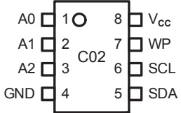</td><td></td></tr><tr><td></td><td>存储器组织结构</td><td></td><td></td><td></td></tr><tr><td></td><td>- 24C02, 256 X 8 (2K bits)</td><td></td><td></td><td></td></tr><tr><td></td><td>- 24C04, 512 X 8 (4K bits)</td><td></td><td></td><td></td></tr><tr><td></td><td>- 24C08, 1024 X 8 (8K bits)</td><td></td><td></td><td></td></tr><tr><td></td><td>- 24C16, 2048 X 8 (16K bits)</td><td></td><td>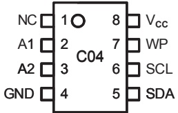</td><td></td></tr><tr><td></td><td>- 24C32, 4096 X 8 (32K bits)</td><td></td><td></td><td></td></tr><tr><td></td><td>- 24C64, 8192 X 8 (64K bits)</td><td></td><td></td><td></td></tr><tr><td></td><td>2线串行接口，完全兼容I²C总线</td><td>NC</td><td>10 8</td><td>Vcc</td></tr><tr><td></td><td>I²C时钟频率为1 MHz (5V), 400 kHz (1.8V, 2.5V, 2.7V)</td><td>NC</td><td>7 C08</td><td>WP</td></tr><tr><td></td><td>施密特触发输入噪声抑制</td><td>A2 3</td><td>6</td><td>SCL</td></tr><tr><td></td><td>硬件数据写保护</td><td>GND</td><td>4 5</td><td>SDA</td></tr><tr><td></td><td>内部写周期(最大5 ms)</td><td></td><td></td><td></td></tr><tr><td></td><td>可按字节写</td><td>NC</td><td>10 8</td><td>Vcc</td></tr><tr><td></td><td>页写：8字节页(24C02),16字节页(24C04/08/16),32字节页(24C32/64)</td><td>NC</td><td>2 7 C16</td><td>WP</td></tr><tr><td></td><td>可按字节，随机和序列读</td><td>NC</td><td>3 6</td><td>SCL</td></tr><tr><td></td><td>自动递增地址 T24C02A</td><td>GND</td><td>4 5</td><td>SDA</td></tr><tr><td></td><td>ESD保护大于2.5kV</td><td></td><td></td><td></td></tr><tr><td></td><td>高可靠性</td><td>A0</td><td>10 8</td><td>1Vcc</td></tr><tr><td></td><td>-擦写寿命：100万次</td><td>A1</td><td>2 7 C32</td><td>WP</td></tr><tr><td></td><td>-数据保持时间：100年</td><td>A2</td><td>3 6</td><td>SCL</td></tr><tr><td></td><td>• 8-pin DIP和8-pin SOP封装</td><td>GND</td><td>4 5</td><td>SDA</td></tr><tr><td></td><td>● 无铅工艺，符合RoHS标准</td><td></td><td></td><td></td></tr><tr><td></td><td>3. 应用领域</td><td></td><td></td><td></td></tr><tr><td></td><td>● 智能仪器仪表 工业控制</td><td></td><td>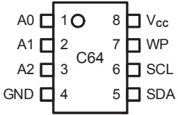</td><td></td></tr><tr><td></td><td>计算机 笔记本电脑</td><td>家用电器</td><td></td><td></td></tr><tr><td></td><td>汽车电子</td><td>通信设备</td><td></td><td></td></tr></table>

## 1. 描述

24C02/04/08/16/32/64是电可擦除PROM，分别采用

256/512/1024/2048/4096/8192×8-bit的组织结构以及两线串行接口。

电压可允许低至1.8V，待机电流和工作电流分别为1μA和

1mA。24C02/04/08/16/32/64具有页写能力，每页分别为

8/16/16/16/32/32字节。24C02/04/08/16/32/64具有8-pin PDIP

和8-pin SOP 和 5-pin SOT 23-5 三种封装形式

## 2. 特点

电话：0755-82568886 82568883

传真：0755-82568886

公司地址：深圳市福田区滨河大道联合广场A座1308

## 引脚排列

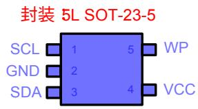

(顶视图)

邮箱：idchip@indreamchip.com

网址：www.idchip.cn

ICHIP英锐芯

深圳市英锐芯电子科技AT24C0 2

## 5. 框图

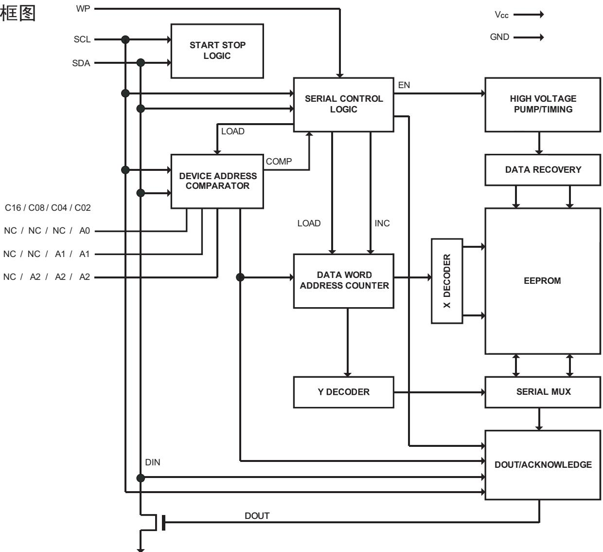

图1 框图

## 6. 最大额定参数

(超出最大额定参数可能会导致器件损坏)

<table><tr><td rowspan=1 colspan=1>参数</td><td rowspan=1 colspan=1>符号</td><td rowspan=1 colspan=1>值</td><td rowspan=1 colspan=1>单位</td></tr><tr><td rowspan=1 colspan=1>直流供电电压</td><td rowspan=1 colspan=1>Vcc</td><td rowspan=1 colspan=1>-0.3~+6.5</td><td rowspan=1 colspan=1>V</td></tr><tr><td rowspan=1 colspan=1>直流输入电压</td><td rowspan=1 colspan=1>VIN</td><td rowspan=1 colspan=1>-0.3 ~ Vcc +0.3</td><td rowspan=1 colspan=1>V</td></tr><tr><td rowspan=1 colspan=1>直流输出电压</td><td rowspan=1 colspan=1>VOut</td><td rowspan=1 colspan=1>-0.3 ~ Vcc +0.3</td><td rowspan=1 colspan=1>V</td></tr><tr><td rowspan=1 colspan=1>存储温度</td><td rowspan=1 colspan=1>TSTG</td><td rowspan=1 colspan=1>-65~+150</td><td rowspan=1 colspan=1>℃</td></tr><tr><td rowspan=1 colspan=1>ESD电压 (人体模型)</td><td rowspan=2 colspan=1>VESD</td><td rowspan=1 colspan=1>2500</td><td rowspan=1 colspan=1>V</td></tr><tr><td rowspan=1 colspan=1>ESD电压 (机器模型)</td><td rowspan=1 colspan=1>200</td><td rowspan=1 colspan=1>V</td></tr></table>

应在推荐工作条件下实现功能)

<table><tr><td rowspan=1 colspan=1>参数</td><td rowspan=1 colspan=1>符号</td><td rowspan=1 colspan=1>最小值</td><td rowspan=1 colspan=1>最大值</td><td rowspan=1 colspan=1>单位</td></tr><tr><td rowspan=1 colspan=1>直流供电电压</td><td rowspan=1 colspan=1>Vcc</td><td rowspan=1 colspan=1>1.8</td><td rowspan=1 colspan=1>5.5</td><td rowspan=1 colspan=1>V</td></tr><tr><td rowspan=1 colspan=1>工作温度</td><td rowspan=1 colspan=1>TA</td><td rowspan=1 colspan=1>-40</td><td rowspan=1 colspan=1>+85</td><td rowspan=1 colspan=1>℃</td></tr></table>

电话：0755-82568886 82568883

邮箱：idchip@indreamchip.com

传真：0755-82568886

网址：www.idchip.cn

公司地址：深圳市福田区滨河大道联合广场A座1308

ICHIP英锐芯

深圳市英锐芯电子科技AT24C0 2

## 8. 引脚电容

(条件：TA = 25°C, f = 1.0 MHz, $\mathsf { V } _ { \mathsf { C C } } = + 1 . 8 \mathsf { V } )$

<table><tr><td rowspan=1 colspan=1>参数</td><td rowspan=1 colspan=1>符号</td><td rowspan=1 colspan=1>测试条件</td><td rowspan=1 colspan=1>最小值</td><td rowspan=1 colspan=1>最大值</td><td rowspan=1 colspan=1>单位</td></tr><tr><td rowspan=1 colspan=1>输入/输出电容(SDA)</td><td rowspan=1 colspan=1>Ci/o</td><td rowspan=1 colspan=1>Vi/o = 0V</td><td rowspan=1 colspan=1></td><td rowspan=1 colspan=1>8</td><td rowspan=1 colspan=1>pF</td></tr><tr><td rowspan=1 colspan=1>输入电容(A0， A1， A2, SCL)</td><td rowspan=1 colspan=1>CIN</td><td rowspan=1 colspan=1>ViN = 0V</td><td rowspan=1 colspan=1></td><td rowspan=1 colspan=1>6</td><td rowspan=1 colspan=1>pF</td></tr></table>

## 9. 直流电气特性

(条件： ${ \sf T } _ { \sf A } = 0 ^ { \circ } { \sf C } \sim + 7 0 ^ { \circ } { \sf C } ,$ Vcc = +1.8V～+5.5V，除非另有注释)

<table><tr><td rowspan=1 colspan=1>参数</td><td rowspan=1 colspan=1>符号</td><td rowspan=1 colspan=2>测试条件</td><td rowspan=1 colspan=1>最小值</td><td rowspan=1 colspan=1>典型值</td><td rowspan=1 colspan=1>最大值</td><td rowspan=1 colspan=1>单位</td></tr><tr><td rowspan=2 colspan=1>供电电流</td><td rowspan=2 colspan=1>lcc</td><td rowspan=2 colspan=1>Vcc =5V</td><td rowspan=1 colspan=1>100kHz读</td><td rowspan=1 colspan=1></td><td rowspan=1 colspan=1>0.4</td><td rowspan=1 colspan=1>1.0</td><td rowspan=1 colspan=1>mA</td></tr><tr><td rowspan=1 colspan=1>100kHz写</td><td rowspan=1 colspan=1></td><td rowspan=1 colspan=1>2.0</td><td rowspan=1 colspan=1>3.0</td><td rowspan=1 colspan=1>mA</td></tr><tr><td rowspan=1 colspan=1>待机电流</td><td rowspan=1 colspan=1>lsB</td><td rowspan=1 colspan=2>Vin = Vcc 或 GND</td><td rowspan=1 colspan=1></td><td rowspan=1 colspan=1></td><td rowspan=1 colspan=1>1.0</td><td rowspan=1 colspan=1>μA</td></tr><tr><td rowspan=1 colspan=1>输入漏电流</td><td rowspan=1 colspan=1>lLI</td><td rowspan=1 colspan=2>Vin = Vcc 或 GND</td><td rowspan=1 colspan=1></td><td rowspan=1 colspan=1></td><td rowspan=1 colspan=1>3.0</td><td rowspan=1 colspan=1>μA</td></tr><tr><td rowspan=1 colspan=1>输出漏电流</td><td rowspan=1 colspan=1>lLO</td><td rowspan=1 colspan=2>Vout = Vcc 或 GND</td><td rowspan=1 colspan=1></td><td rowspan=1 colspan=1>0.05</td><td rowspan=1 colspan=1>3.0</td><td rowspan=1 colspan=1>μA</td></tr><tr><td rowspan=1 colspan=1>输入低电平电压</td><td rowspan=1 colspan=1>VIL</td><td rowspan=1 colspan=2></td><td rowspan=1 colspan=1>-0.6</td><td rowspan=1 colspan=1></td><td rowspan=1 colspan=1>Vcc×0.3</td><td rowspan=1 colspan=1>V</td></tr><tr><td rowspan=1 colspan=1>输入高电平电压</td><td rowspan=1 colspan=1>VIH</td><td rowspan=1 colspan=2></td><td rowspan=1 colspan=1>Vcc×0.7</td><td rowspan=1 colspan=1></td><td rowspan=1 colspan=1>Vcc+0.5</td><td rowspan=1 colspan=1>V</td></tr><tr><td rowspan=3 colspan=1>输出低电平电压</td><td rowspan=1 colspan=1>VoL3</td><td rowspan=1 colspan=2>Vcc =5.0V, loL = 3.0 mA</td><td rowspan=1 colspan=1></td><td rowspan=1 colspan=1></td><td rowspan=1 colspan=1>0.4</td><td rowspan=1 colspan=1>V</td></tr><tr><td rowspan=1 colspan=1>VoL2</td><td rowspan=1 colspan=2>Vcc =3.0V, loL = 2.1 mA</td><td rowspan=1 colspan=1></td><td rowspan=1 colspan=1></td><td rowspan=1 colspan=1>0.4</td><td rowspan=1 colspan=1>V</td></tr><tr><td rowspan=1 colspan=1>VoL1</td><td rowspan=1 colspan=2>Vcc =1.8V, loL = 0.15 mA</td><td rowspan=1 colspan=1></td><td rowspan=1 colspan=1></td><td rowspan=1 colspan=1>0.2</td><td rowspan=1 colspan=1>V</td></tr></table>

## 10. 交流电气特性

(条件： ${ \sf T } _ { \sf A } = 0 ^ { \circ } { \sf C } \sim + 7 0 ^ { \circ } { \sf C } ,$ Vcc = +1.8V ～ +5.5V, CL = 100 pF，除非另有注释)

<table><tr><td rowspan=1 colspan=1>参数</td><td rowspan=1 colspan=1>符号</td><td rowspan=1 colspan=1>测试条件</td><td rowspan=1 colspan=1>最小值典</td><td rowspan=1 colspan=1>型值</td><td rowspan=1 colspan=1>最大值</td><td rowspan=1 colspan=1>单位</td></tr><tr><td rowspan=2 colspan=1>时钟频率，SCL</td><td rowspan=2 colspan=1>fscL</td><td rowspan=1 colspan=1>Vcc =1.8V</td><td rowspan=1 colspan=1></td><td rowspan=1 colspan=1></td><td rowspan=1 colspan=1>400</td><td rowspan=2 colspan=1>kHz</td></tr><tr><td rowspan=1 colspan=1>Vcc =5V</td><td rowspan=1 colspan=1></td><td rowspan=1 colspan=1></td><td rowspan=1 colspan=1>1000</td></tr><tr><td rowspan=2 colspan=1>时钟低电平宽度</td><td rowspan=2 colspan=1>tLow</td><td rowspan=1 colspan=1>Vcc =1.8V</td><td rowspan=1 colspan=1>1.2</td><td rowspan=1 colspan=1></td><td rowspan=1 colspan=1></td><td rowspan=2 colspan=1>μs</td></tr><tr><td rowspan=1 colspan=1>Vcc =5V</td><td rowspan=1 colspan=1>0.6</td><td rowspan=1 colspan=1></td><td rowspan=1 colspan=1></td></tr><tr><td rowspan=2 colspan=1>时钟高电平宽度</td><td rowspan=2 colspan=1>tHIGH</td><td rowspan=1 colspan=1>Vcc =1.8V</td><td rowspan=1 colspan=1>0.6</td><td rowspan=1 colspan=1></td><td rowspan=1 colspan=1></td><td rowspan=2 colspan=1>μs</td></tr><tr><td rowspan=1 colspan=1>Vcc =5V</td><td rowspan=1 colspan=1>0.4</td><td rowspan=1 colspan=1></td><td rowspan=1 colspan=1></td></tr><tr><td rowspan=2 colspan=1>噪声消除时间</td><td rowspan=2 colspan=1>ti</td><td rowspan=1 colspan=1>Vcc =1.8V</td><td rowspan=1 colspan=1></td><td rowspan=1 colspan=1></td><td rowspan=1 colspan=1>50</td><td rowspan=2 colspan=1>ns</td></tr><tr><td rowspan=1 colspan=1>Vcc =5V</td><td rowspan=1 colspan=1></td><td rowspan=1 colspan=1></td><td rowspan=1 colspan=1>40</td></tr><tr><td rowspan=2 colspan=1>时钟下降沿到数据有效输出间隔时间</td><td rowspan=2 colspan=1>tAA</td><td rowspan=1 colspan=1>Vcc =1.8V</td><td rowspan=1 colspan=1>0.05</td><td rowspan=1 colspan=1></td><td rowspan=1 colspan=1>0.9</td><td rowspan=2 colspan=1>μs</td></tr><tr><td rowspan=1 colspan=1>Vcc =5V</td><td rowspan=1 colspan=1>0.05</td><td rowspan=1 colspan=1></td><td rowspan=1 colspan=1>0.55</td></tr><tr><td rowspan=2 colspan=1>总线释放时间</td><td rowspan=2 colspan=1>tBUF</td><td rowspan=1 colspan=1>Vcc =1.8V</td><td rowspan=1 colspan=1>1.2</td><td rowspan=1 colspan=1></td><td rowspan=1 colspan=1></td><td rowspan=2 colspan=1>μs</td></tr><tr><td rowspan=1 colspan=1>Vcc =5V</td><td rowspan=1 colspan=1>0.5</td><td rowspan=1 colspan=1></td><td rowspan=1 colspan=1></td></tr></table>

电话：0755-82568886 82568883

邮箱：idchip@indreamchip.com

传真：0755-82568886

公司地址：深圳市福田区滨河大道联合广场A座1308

网址：www.idchip.cn

ICHIP英锐芯

深圳市英锐芯电子科技AT 24C0 2

10.

<table><tr><td rowspan=1 colspan=1>参数</td><td rowspan=1 colspan=1>符号</td><td rowspan=1 colspan=1>测试条件</td><td rowspan=1 colspan=1>最小值</td><td rowspan=1 colspan=1>典型值</td><td rowspan=1 colspan=1>最大值</td><td rowspan=1 colspan=1>单位</td></tr><tr><td rowspan=2 colspan=1>起始条件保持时间</td><td rowspan=2 colspan=1>tHD.STA</td><td rowspan=1 colspan=1>Vcc =1.8V</td><td rowspan=1 colspan=1>0.6</td><td rowspan=1 colspan=1></td><td rowspan=1 colspan=1></td><td rowspan=2 colspan=1>μs</td></tr><tr><td rowspan=1 colspan=1>Vcc =5V</td><td rowspan=1 colspan=1>0.25</td><td rowspan=1 colspan=1></td><td rowspan=1 colspan=1></td></tr><tr><td rowspan=2 colspan=1>起始条件建立时间</td><td rowspan=2 colspan=1>tsU.STA</td><td rowspan=1 colspan=1>Vcc =1.8V</td><td rowspan=1 colspan=1>0.6</td><td rowspan=1 colspan=1></td><td rowspan=1 colspan=1></td><td rowspan=2 colspan=1>μs</td></tr><tr><td rowspan=1 colspan=1>Vcc =5V</td><td rowspan=1 colspan=1>0.25</td><td rowspan=1 colspan=1></td><td rowspan=1 colspan=1></td></tr><tr><td rowspan=1 colspan=1>数据输入保持时间</td><td rowspan=1 colspan=1>tHD.DAT</td><td rowspan=1 colspan=1></td><td rowspan=1 colspan=1>0</td><td rowspan=1 colspan=1></td><td rowspan=1 colspan=1></td><td rowspan=1 colspan=1>μs</td></tr><tr><td rowspan=1 colspan=1>数据输入建立时间</td><td rowspan=1 colspan=1>tsU.DAT</td><td rowspan=1 colspan=1></td><td rowspan=1 colspan=1>100</td><td rowspan=1 colspan=1></td><td rowspan=1 colspan=1></td><td rowspan=1 colspan=1>ns</td></tr><tr><td rowspan=1 colspan=1>输入上升时间</td><td rowspan=1 colspan=1>tR</td><td rowspan=1 colspan=1></td><td rowspan=1 colspan=1></td><td rowspan=1 colspan=1></td><td rowspan=1 colspan=1>300</td><td rowspan=1 colspan=1>ns</td></tr><tr><td rowspan=2 colspan=1>输入下降时间</td><td rowspan=2 colspan=1>tF</td><td rowspan=1 colspan=1>Vcc =1.8V</td><td rowspan=1 colspan=1></td><td rowspan=1 colspan=1></td><td rowspan=1 colspan=1>300</td><td rowspan=2 colspan=1>ns</td></tr><tr><td rowspan=1 colspan=1>Vcc =5V</td><td rowspan=1 colspan=1></td><td rowspan=1 colspan=1></td><td rowspan=1 colspan=1>100</td></tr><tr><td rowspan=2 colspan=1>停止条件建立时间</td><td rowspan=2 colspan=1>tsu.STO</td><td rowspan=1 colspan=1>Vcc =1.8V</td><td rowspan=1 colspan=1>0.6</td><td rowspan=1 colspan=1></td><td rowspan=1 colspan=1></td><td rowspan=2 colspan=1>μs</td></tr><tr><td rowspan=1 colspan=1>Vcc =5V</td><td rowspan=1 colspan=1>0.25</td><td rowspan=1 colspan=1></td><td rowspan=1 colspan=1></td></tr><tr><td rowspan=1 colspan=1>数据输出保持时间</td><td rowspan=1 colspan=1>tDH</td><td rowspan=1 colspan=1></td><td rowspan=1 colspan=1>50</td><td rowspan=1 colspan=1></td><td rowspan=1 colspan=1></td><td rowspan=1 colspan=1>ns</td></tr><tr><td rowspan=1 colspan=1>写周期</td><td rowspan=1 colspan=1>twR</td><td rowspan=1 colspan=1></td><td rowspan=1 colspan=1></td><td rowspan=1 colspan=1></td><td rowspan=1 colspan=1>5</td><td rowspan=1 colspan=1>ms</td></tr></table>

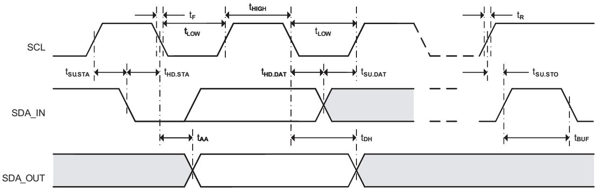

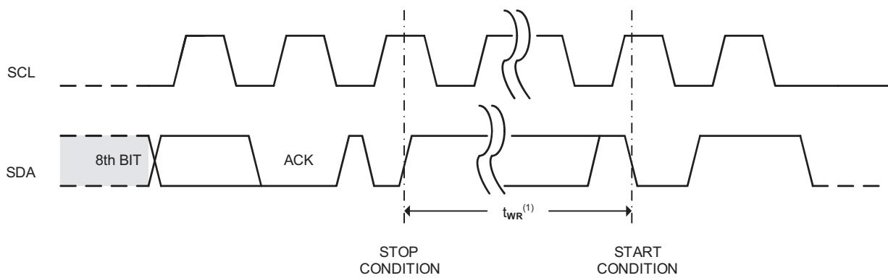

图2 总线时序

注1.写周期时间twR是指从一个写序列的有效停止条件开始至内部写周期结束的时间。

电话：0755-82568886 82568883

图3 写周期时序

邮箱：idchip@indreamchip.com

传真：0755-82568886

网址：www.idchip.cn

公司地址：深圳市福田区滨河大道联合广场A座1308

ICHIP英锐芯

深圳市英锐芯电子科技AT 24C0 2

11. 引脚说明

<table><tr><td rowspan=1 colspan=1>引脚号引</td><td rowspan=1 colspan=1>脚名称</td><td rowspan=1 colspan=1>功能说明</td></tr><tr><td rowspan=1 colspan=1>1</td><td rowspan=1 colspan=1>A0</td><td rowspan=3 colspan=1>地址输入。A2、A1和A0是器件地址输入引脚。24C02/32/64使用A2、A1和A0输入引脚作为硬件地址，总线上可同时级联8个24C02/32/64器件（详见器件寻址）。24C04使用A2和A1输入引脚作为硬件地址，总线上可同时级联4个24C04器件，A0为空脚，可接地。24C08使用A2输入引脚作为硬件地址，总线上可同时级联2个24C08器件，A0和A1为空脚，可接地。24C16未使用器件地址引脚，总线上最多只可连接一个16K器件，A2、A1和A0为空脚，可接地。</td></tr><tr><td rowspan=1 colspan=1>2</td><td rowspan=1 colspan=1>A1</td></tr><tr><td rowspan=1 colspan=1>3</td><td rowspan=1 colspan=1>A2</td></tr><tr><td rowspan=1 colspan=1>5</td><td rowspan=1 colspan=1>SDA</td><td rowspan=1 colspan=1>串行地址和数据输入/输出。SDA是双向串行数据传输引脚，漏极开路，需外接上拉电阻到Vcc（典型值10kΩ）。</td></tr><tr><td rowspan=1 colspan=1>6</td><td rowspan=1 colspan=1>SCL</td><td rowspan=1 colspan=1>串行时钟输入。SCL同步数据传输，上升沿数据写入，下降沿数据读出。</td></tr><tr><td rowspan=1 colspan=1>7</td><td rowspan=1 colspan=1>WP</td><td rowspan=1 colspan=1>写保护。WP引脚提供硬件数据保护。当WP接地时，允许数据正常读写操作；当WP接Vcc时，写保护，只读。</td></tr><tr><td rowspan=1 colspan=1>4</td><td rowspan=1 colspan=1>GND</td><td rowspan=1 colspan=1>地</td></tr><tr><td rowspan=1 colspan=1>8</td><td rowspan=1 colspan=1>Vcc</td><td rowspan=1 colspan=1>正电源</td></tr></table>

## 12. 存储结构

<table><tr><td rowspan=1 colspan=1>器件</td><td rowspan=1 colspan=1>总容量（位）</td><td rowspan=1 colspan=1>总页数</td><td rowspan=1 colspan=1>字节/页</td><td rowspan=1 colspan=1>字地址长度</td></tr><tr><td rowspan=1 colspan=1>24C02</td><td rowspan=1 colspan=1>2K</td><td rowspan=1 colspan=1>32</td><td rowspan=1 colspan=1>8</td><td rowspan=1 colspan=1>8位</td></tr><tr><td rowspan=1 colspan=1>24C04</td><td rowspan=1 colspan=1>4K</td><td rowspan=1 colspan=1>32</td><td rowspan=1 colspan=1>16</td><td rowspan=1 colspan=1>9位</td></tr><tr><td rowspan=1 colspan=1>24C08</td><td rowspan=1 colspan=1>8K</td><td rowspan=1 colspan=1>64</td><td rowspan=1 colspan=1>16</td><td rowspan=1 colspan=1>10位</td></tr><tr><td rowspan=1 colspan=1>24C16</td><td rowspan=1 colspan=1>16K</td><td rowspan=1 colspan=1>128</td><td rowspan=1 colspan=1>16</td><td rowspan=1 colspan=1>11位</td></tr><tr><td rowspan=1 colspan=1>24C32</td><td rowspan=1 colspan=1>32K</td><td rowspan=1 colspan=1>128</td><td rowspan=1 colspan=1>32</td><td rowspan=1 colspan=1>12位</td></tr><tr><td rowspan=1 colspan=1>24C64</td><td rowspan=1 colspan=1>64K</td><td rowspan=1 colspan=1>256</td><td rowspan=1 colspan=1>32</td><td rowspan=1 colspan=1>13位</td></tr></table>

网址：www.idchip.cn

电话：0755-82568886 82568883

传真：0755-82568886

邮箱：idchip@indreamchip.com

公司地址：深圳市福田区滨河大道联合广场A座1308

ICHIP英锐芯

深圳市英锐芯电子科技AT24C0 2

24CXX支持I²C总线传输协议。I²C是一种双向、两线串行通讯接口，分别是串行数据线SDA和串行时钟线SCL。两根线都必须通过一个上拉电阻接到电源。典型的总线配置如图4所示

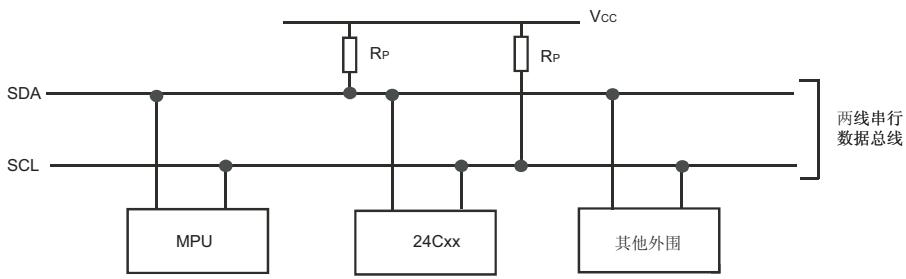

图4 典型两线总线配置

总线上发送数据的器件被称作发送器，接收数据的器件被称作接收器。控制信息交换的器件被称作主器件，受主器件控制的器件则被称作从器件。主器件产生串行时钟SCL，控制总线的访问状态、产生START和STOP条件。24CXX在I²C总线中作为从器件工作。

只有当总线处于空闲状态时才可以启动数据传输。每次数据传输均开始于START条件，结束于STOP条件，二者之间的数据字节数是没有限制的，由总线上的主器件决定。信息以字节（8位）为单位传输，第9位时由接收器产生应答。

## 起始和停止条件

数据和时钟线都为高则称总线处在空闲状态。当SCL为高电平时SDA的下降沿（高到低叫做起始条件（START，简写为S），SDA的上升沿（低到高）则叫做停止条件（STOP，简写为P）。参见图5。

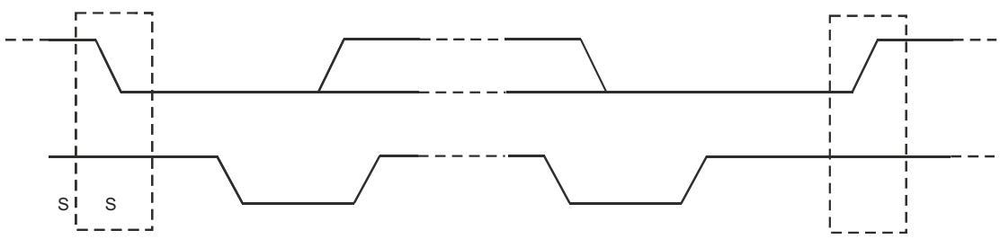

起始条件

图5起始条件和停止条件的定义

电话：0755-82568886 82568883

邮箱：idchip@indreamchip.com

传真：0755-82568886

公司地址：深圳市福田区滨河大道联合广场A座1308

网址：www.idchip.cn

ICHIP英锐芯

深圳市英锐芯电子科技

AT24C02

## 13. 详细操作说明（续）

## 位传输

每个时钟脉冲传送一位数据。SCL为高时SDA必须保持稳定，因为此时SDA的改变被认为是控制信号。位传输参见图6。

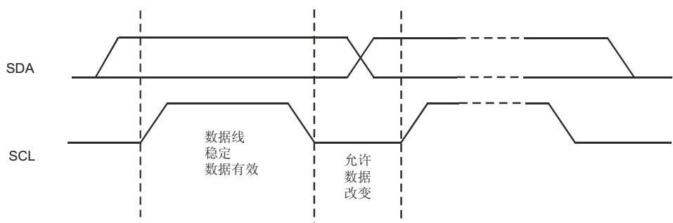

图6 位传输

## 应答

总线上的接收器每接收到一个字节就产生一个应答，主器件必须产生一个对应的额外的时钟脉冲，见图7。

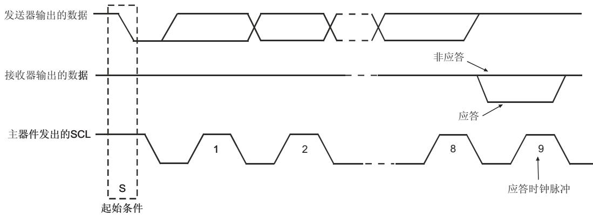

图7I2C总线的应答

接收器拉低SDA线表示应答，并在应答脉冲期间保持稳定的低电平。当主器件作接收器时，必须发出数据传输结束的信号给发送器，即它在最后一个字节之后的应答脉冲期间不会产生应答信号（不拉低SDA）。这种情况下，发送器必须释放SDA线为高以便主器件产生停止条件。

电话：0755-82568886 82568883

传真：0755-82568886

网址：www.idchip.cn

邮箱：idchip@indreamchip.com

公司地址：深圳市福田区滨河大道联合广场A座1308

ICHIP英锐芯

深圳市英锐芯电子科技AT 24C0 2

## 器件寻址

起始条件使能芯片读写操作后，EEPROM都要求有8位的器件地址信息（见图8）。

器件地址信息由"1"、"0"序列组成，前4位如图中所示，对于所有串行EEPROM都是一样的。

对于24C02/32/64，随后3位A2、A1和A0为器件地址位，必须与硬件输入引脚保持一致。

对于24C04，随后2位A2和A1为器件地址位，另1位为页地址位。A2和A1必须与硬件输入引脚保持一致，而A0是空脚。

对于24C08，随后1位A2为器件地址位，另2位为页地址位。A2必须与硬件输入引脚保持一致，而A1和A0是空脚。

对于24C16，无器件地址位，3位都为页地址位，而A2、A1和A0是空脚。

器件地址信息的LSB为读/写操作选择位，高为读操作，低为写操作。

若比较器件地址一致，EEPROM将输出应答"O"。如果不一致，则返回到待机状态。

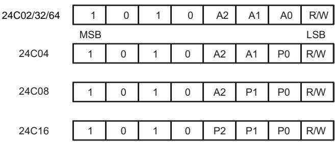

图8 器件地址

## 器件操作

## 待机模式

EEPROM具有低功耗待机的特点，条件为：（1）电源上电；（2）接收停止条件及完成任何内部操作后。

## 存储复位

当协议中产生中断、掉电或系统复位后，I²C总线可通过以下步骤复位：

（1）产生9个时钟周期。

（2）当SCL为高时，SDA也为高。

（3）产生一个起始条件。

## 写操作

## 1. 字节写

写操作要求在接收器件地址和ACK应答后，接收8位的字地址。接收到这个地址后EEPROM应答"0"，然后是一个8位数据。在接收8位数据后，EEPROM应答"0"，接着必须由主器件发送停止条件来终止写序列。

此时EEPROM进入内部写周期twR，数据写入非易失性存储器中，在此期间所有输入都无效。直到写周期完成，EEPROM才会有应答（见图9）。

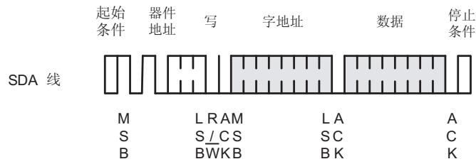

图9字节写

电话：0755-82568886 82568883

邮箱：idchip@indreamchip.com

传真：0755-82568886

公司地址：深圳市福田区滨河大道联合广场A座1308

网址：www.idchip.cn

ICHIP英锐芯

深圳市英锐芯电子科技AT 24C0 2

## 13. 详细操作说明（续）

## 2. 页写

24C02器件按8字节/页执行页写，24C04/08/16器件按16字节/页执行页写，24C32/64器件按32字节/页执行页写。

页写初始化与字节写相同，只是主器件不会在第一个数据后发送停止条件，而是在EEPROMEEPROM收到每个数据后都应答“0”。最后仍需由主器件发送停止条件，终止写序列（见图10）。

接收到每个数据后，字地址的低3位（24C02）或4位（24C04/08/16）或5位（24C32/64）内部自动加1，高位地址位不变，维持在当前页内。当内部产生的字地址达到该页边界地址时，随后的数据将写入该页的页首。如果超过8个（24C02）或16个（24C04/08/16）或32个

（24C32/64）数据传送给了EEPROM，字地址将回转到该页的首字节，先前的字节将会被覆盖。

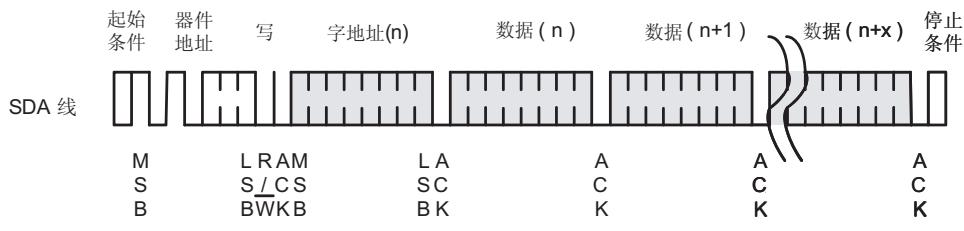

图10页写

## 3. 应答查询

一旦内部写周期启动，EEPROM输入无效，此时即可启动应答查询：发送起始条件和器件地址（读/写位为期望的操作）。只有内部写周期完成，EEPROM才应答"O"。之后可继续读/写操作。

应答查询流程见图11。

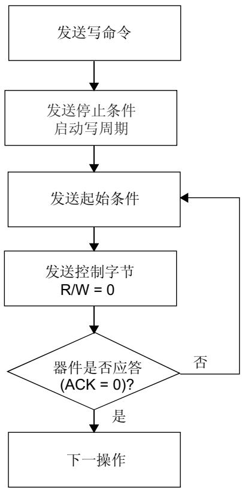

图11 应答查询流程

电话：0755-82568886 82568883

传真：0755-82568886

邮箱：idchip@indreamchip.com

网址：www.idchip.cn

公司地址：深圳市福田区滨河大道联合广场A座1308

ICHIP英锐芯

深圳市英锐芯电子科技AT 24C0 2

## 读操作

读操作与写操作初始化相同，只是器件地址中的读/写选择位应为"1"。有三种不同的读操作方式：当前地址读，随机读和顺序读。

## 1. 当前地址读

内部地址计数器保存着上次访问时最后一个地址加1的值。只要芯片有电，该地址就一直保存。当读到最后页的最后字节，地址会回转到0；当写到某页尾的最后一个字节，地址会回转到该页的首字节。

接收器件地址（读/写选择位为"1"）、EEPROM应答ACK后，当前地址的数据就随时钟送出。主器件无需应答"0"，但需发送停止条件（见图12）。

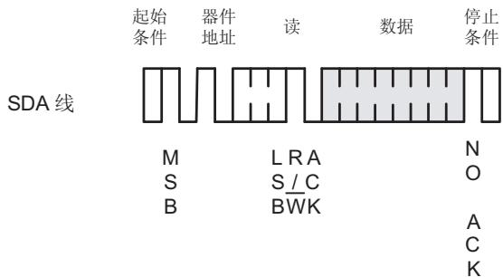

图12 当前地址读

## 2. 随机读

随机读需先写一个目标字地址，一旦EEPROM接收器件地址和字地址并应答了ACK，主器件就产生一个重复的起始条件。

然后，主器件发送器件地址（读/写选择位为"1"），EEPROM应答ACK，并随时钟送出数据。主器件无需应答"0"，但需发送停止条件（见图13）。

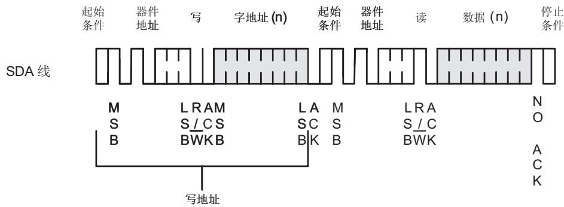

图13 随机读

## 3. 顺序读

顺序读可以通过“当前地址读”或“随机读”启动。主器件接收到一个数据后，应答ACK。只要EEPROM接收到ACK，将自动增加字地址并继续随时钟发送后面的数据。若达到存储器地址末尾，地址自动回转到0，仍可继续顺序读取数据。

主器件不应答"0"，而发送停止条件，即可结束顺序读操作（见图14）。

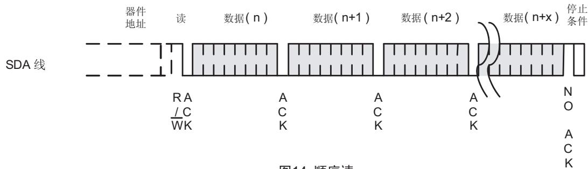

图14 顺序读

电话：0755-82568886 82568883

传真：0755-82568886

邮箱：idchip@indreamchip.com

公司地址：深圳市福田区滨河大道联合广场A座1308

网址：www.idchip.cn

ICHIP英锐芯

深圳市英锐芯电子科技AT 24C0 2

## 14. 典型应用

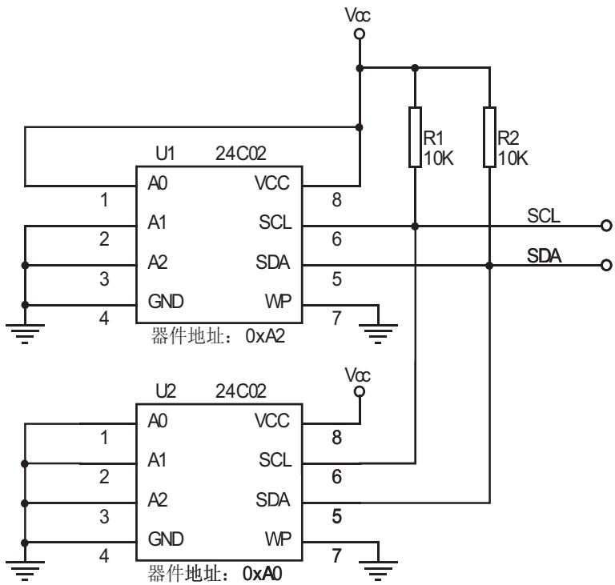

图15 EEPROM的级联

电话：0755-82568886 82568883

邮箱：idchip@indreamchip.com

传真：0755-82568886

公司地址：深圳市福田区滨河大道联合广场A座1308

网址：www.idchip.cn

ICHIP英锐芯

深圳市英锐芯电子科技AT 24C0 2

## 15. 封装尺寸SOP8L

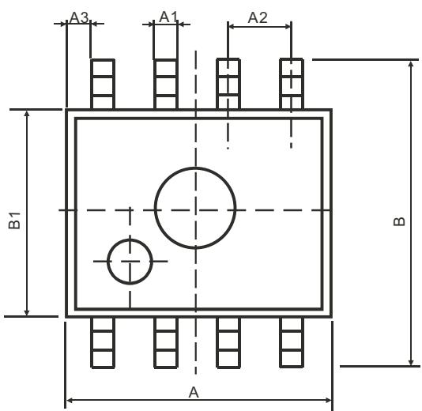

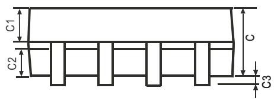

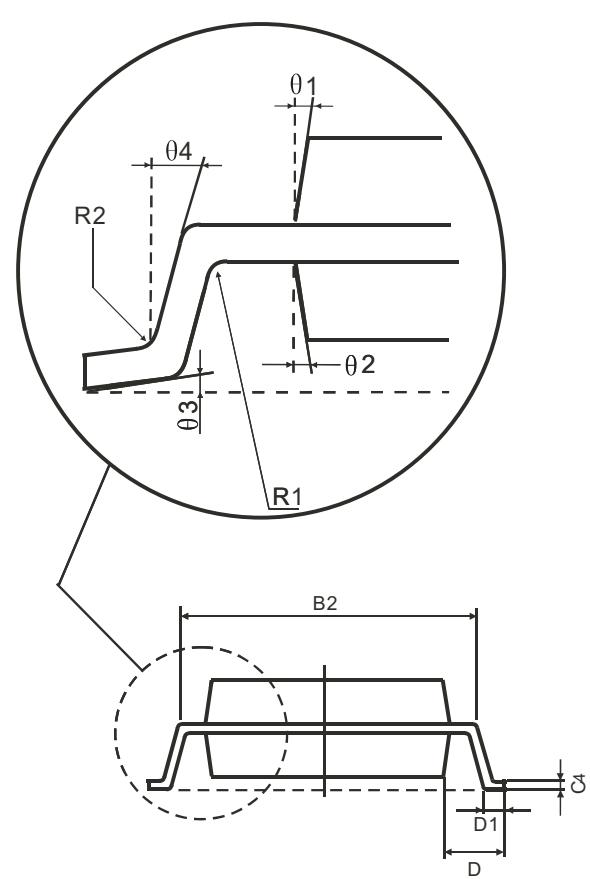

<table><tr><td rowspan=2 colspan=1>符号</td><td rowspan=1 colspan=2>尺寸(mm)</td><td rowspan=2 colspan=1>符号</td><td rowspan=1 colspan=2>尺寸(mm)</td></tr><tr><td rowspan=1 colspan=1>最小值</td><td rowspan=1 colspan=1>最大值</td><td rowspan=1 colspan=1>最小值</td><td rowspan=1 colspan=1>最大值</td></tr><tr><td rowspan=1 colspan=1>A</td><td rowspan=1 colspan=1>4.95</td><td rowspan=1 colspan=1>5.15</td><td rowspan=1 colspan=1>C3</td><td rowspan=1 colspan=1>0.05</td><td rowspan=1 colspan=1>0.20</td></tr><tr><td rowspan=1 colspan=1>A1</td><td rowspan=1 colspan=1>0.37</td><td rowspan=1 colspan=1>0.47</td><td rowspan=1 colspan=1>C4</td><td rowspan=1 colspan=2>0.20(典型值)</td></tr><tr><td rowspan=1 colspan=1>A2</td><td rowspan=1 colspan=2>1.27(典型值)</td><td rowspan=1 colspan=1>D</td><td rowspan=1 colspan=2>1.05(典型值)</td></tr><tr><td rowspan=1 colspan=1>A3</td><td rowspan=1 colspan=2>0.41(典型值)</td><td rowspan=1 colspan=1>D1</td><td rowspan=1 colspan=1>0.40</td><td rowspan=1 colspan=1>0.60</td></tr><tr><td rowspan=1 colspan=1>B</td><td rowspan=1 colspan=1>5.80</td><td rowspan=1 colspan=1>6.20</td><td rowspan=1 colspan=1>R1</td><td rowspan=1 colspan=2>0.07(典型值)</td></tr><tr><td rowspan=1 colspan=1>B1</td><td rowspan=1 colspan=1>3.80</td><td rowspan=1 colspan=1>4.00</td><td rowspan=1 colspan=1>R2</td><td rowspan=1 colspan=2>0.07(典型值)</td></tr><tr><td rowspan=1 colspan=1>B2</td><td rowspan=1 colspan=2>5.0(典型值)</td><td rowspan=1 colspan=1>01</td><td rowspan=1 colspan=2>17(典型值)</td></tr><tr><td rowspan=1 colspan=1>C</td><td rowspan=1 colspan=1>1.30</td><td rowspan=1 colspan=1>1.50</td><td rowspan=1 colspan=1>02</td><td rowspan=1 colspan=2>13(典型值)</td></tr><tr><td rowspan=1 colspan=1>C1</td><td rowspan=1 colspan=1>0.55</td><td rowspan=1 colspan=1>0.65</td><td rowspan=1 colspan=1>03</td><td rowspan=1 colspan=2>4°(典型值)</td></tr><tr><td rowspan=1 colspan=1>C2</td><td rowspan=1 colspan=1>0.55</td><td rowspan=1 colspan=1>0.65</td><td rowspan=1 colspan=1>04</td><td rowspan=1 colspan=2>12°(典型值)</td></tr></table>

网址：www.idchip.cn

电话：0755-82568886 82568883

传真：0755-82568886

邮箱：idchip@indreamchip.com

公司地址：深圳市福田区滨河大道联合广场A座1308

ICHIP英锐芯

深圳市英锐芯电子科技AT 24C0 2

## DIP8L

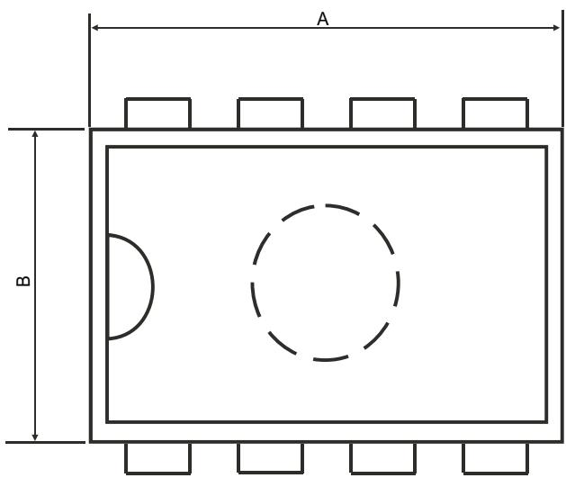

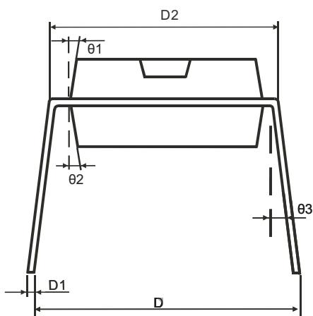

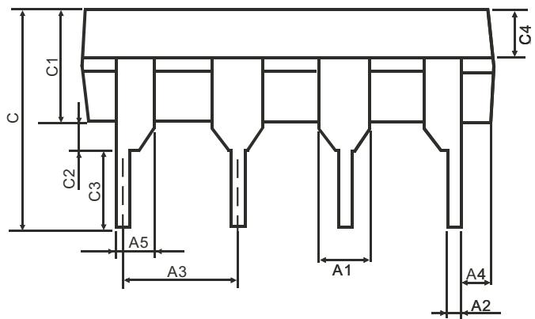

<table><tr><td rowspan=2 colspan=1>符号</td><td rowspan=1 colspan=2>尺寸(mm)</td><td rowspan=2 colspan=1>符号</td><td rowspan=1 colspan=1>尺寸(mm)</td></tr><tr><td rowspan=1 colspan=1>最小值</td><td rowspan=1 colspan=1>最大值</td><td rowspan=1 colspan=1>最大值</td></tr><tr><td rowspan=1 colspan=1>A</td><td rowspan=1 colspan=1>9.30</td><td rowspan=1 colspan=1>9.50</td><td rowspan=1 colspan=1>C2</td><td rowspan=1 colspan=1>0.5(典型值)</td></tr><tr><td rowspan=1 colspan=1>A1</td><td rowspan=1 colspan=2>1.524(典型值)</td><td rowspan=1 colspan=1>C3</td><td rowspan=1 colspan=1>3.3(典型值)</td></tr><tr><td rowspan=1 colspan=1>A2</td><td rowspan=1 colspan=1>0.39</td><td rowspan=1 colspan=1>0.53</td><td rowspan=1 colspan=1>C4</td><td rowspan=1 colspan=1>1.57(典型值)</td></tr><tr><td rowspan=1 colspan=1>A3</td><td rowspan=1 colspan=2>2.54(典型值)</td><td rowspan=1 colspan=1>D</td><td rowspan=1 colspan=1>8.20</td></tr><tr><td rowspan=1 colspan=1>A4</td><td rowspan=1 colspan=2>0.66(典型值)</td><td rowspan=1 colspan=1>D1</td><td rowspan=1 colspan=1>0.20</td></tr><tr><td rowspan=1 colspan=1>A5</td><td rowspan=1 colspan=2>0.99(典型值)</td><td rowspan=1 colspan=1>D2</td><td rowspan=1 colspan=1>7.62</td></tr><tr><td rowspan=1 colspan=1>B</td><td rowspan=1 colspan=1>6.3</td><td rowspan=1 colspan=1>6.5</td><td rowspan=1 colspan=1>01</td><td rowspan=1 colspan=1>8(典型值)</td></tr><tr><td rowspan=1 colspan=1>C</td><td rowspan=1 colspan=2>7.20(典型值)</td><td rowspan=1 colspan=1>02</td><td rowspan=1 colspan=1>8°(典型值)</td></tr><tr><td rowspan=1 colspan=1>C1</td><td rowspan=1 colspan=1>3.30</td><td rowspan=1 colspan=1>3.50</td><td rowspan=1 colspan=1>03</td><td rowspan=1 colspan=1>5°(典型值)</td></tr></table>

电话：0755-82568886 82568883

传真：0755-82568886

公司地址：深圳市福田区滨河大道联合广场A座1308

邮箱：idchip@indreamchip.com

网址：www.idchip.cn

ICHIP英锐芯

深圳市英锐芯电子科技AT 24C0 2

## TSOT-23-5 PACKAGE OUTLINE DIMENSIONS

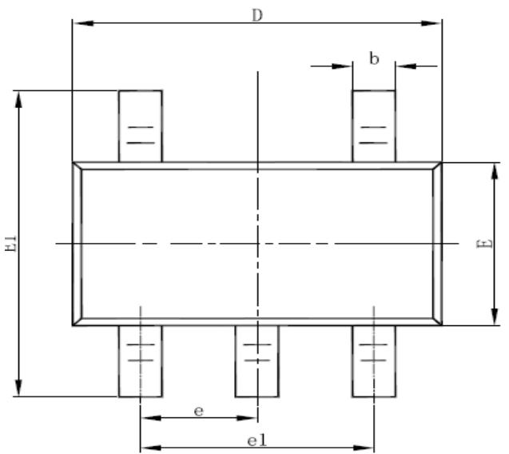

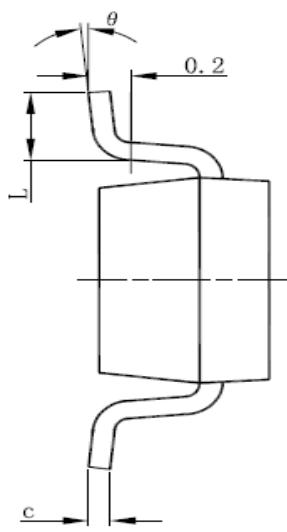

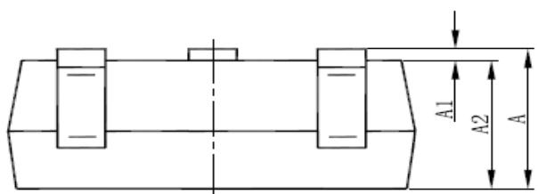

<table><tr><td rowspan=2 colspan=1>Symbol</td><td rowspan=1 colspan=2>Dimensions In Millimeters</td><td rowspan=1 colspan=2>Dimensions In Inches</td></tr><tr><td rowspan=1 colspan=1>Min</td><td rowspan=1 colspan=1>Max</td><td rowspan=1 colspan=1>Min</td><td rowspan=1 colspan=1>Max</td></tr><tr><td rowspan=1 colspan=1>A</td><td rowspan=1 colspan=1>0.700</td><td rowspan=1 colspan=1>0.900</td><td rowspan=1 colspan=1>0.028</td><td rowspan=1 colspan=1>0.035</td></tr><tr><td rowspan=1 colspan=1>A1</td><td rowspan=1 colspan=1>0.000</td><td rowspan=1 colspan=1>0.100</td><td rowspan=1 colspan=1>0.000</td><td rowspan=1 colspan=1>0.004</td></tr><tr><td rowspan=1 colspan=1>A2</td><td rowspan=1 colspan=1>0.700</td><td rowspan=1 colspan=1>0.800</td><td rowspan=1 colspan=1>0.028</td><td rowspan=1 colspan=1>0.031</td></tr><tr><td rowspan=1 colspan=1>b</td><td rowspan=1 colspan=1>0.350</td><td rowspan=1 colspan=1>0.500</td><td rowspan=1 colspan=1>0.014</td><td rowspan=1 colspan=1>0.020</td></tr><tr><td rowspan=1 colspan=1>C</td><td rowspan=1 colspan=1>0.080</td><td rowspan=1 colspan=1>0.200</td><td rowspan=1 colspan=1>0.003</td><td rowspan=1 colspan=1>0.008</td></tr><tr><td rowspan=1 colspan=1>D</td><td rowspan=1 colspan=1>2.820</td><td rowspan=1 colspan=1>3.020</td><td rowspan=1 colspan=1>0.111</td><td rowspan=1 colspan=1>0.119</td></tr><tr><td rowspan=1 colspan=1>E</td><td rowspan=1 colspan=1>1.600</td><td rowspan=1 colspan=1>1.700</td><td rowspan=1 colspan=1>0.063</td><td rowspan=1 colspan=1>0.067</td></tr><tr><td rowspan=1 colspan=1>E1</td><td rowspan=1 colspan=1>2.650</td><td rowspan=1 colspan=1>2.950</td><td rowspan=1 colspan=1>0.104</td><td rowspan=1 colspan=1>0.116</td></tr><tr><td rowspan=1 colspan=1>e</td><td rowspan=1 colspan=2>0.95 (BSC)</td><td rowspan=1 colspan=2>0.037 (BSC)</td></tr><tr><td rowspan=1 colspan=1>e1</td><td rowspan=1 colspan=2>1.90 (BSC)</td><td rowspan=1 colspan=2>0.075 (BSC)</td></tr><tr><td rowspan=1 colspan=1>L</td><td rowspan=1 colspan=1>0.300</td><td rowspan=1 colspan=1>0.600</td><td rowspan=1 colspan=1>0.012</td><td rowspan=1 colspan=1>0.024</td></tr><tr><td rowspan=1 colspan=1>θ</td><td rowspan=1 colspan=1>0°</td><td rowspan=1 colspan=1>8°</td><td rowspan=1 colspan=1>0°</td><td rowspan=1 colspan=1>8°</td></tr></table>

电话：0755-82568886 82568883

传真：0755-82568886公司地址：深圳市福田区滨河大道联合广场A座1308

邮箱：idchip@indreamchip.com

网址：www.idchip.cn