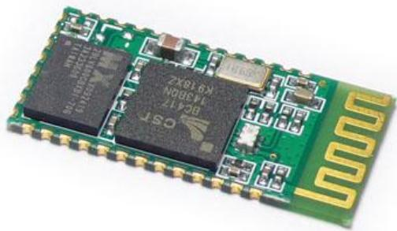
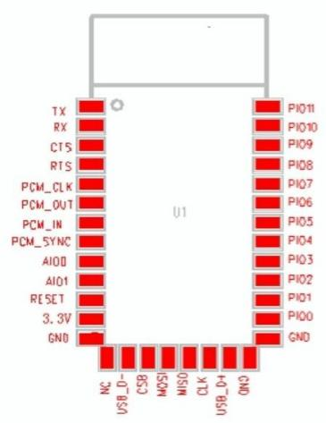
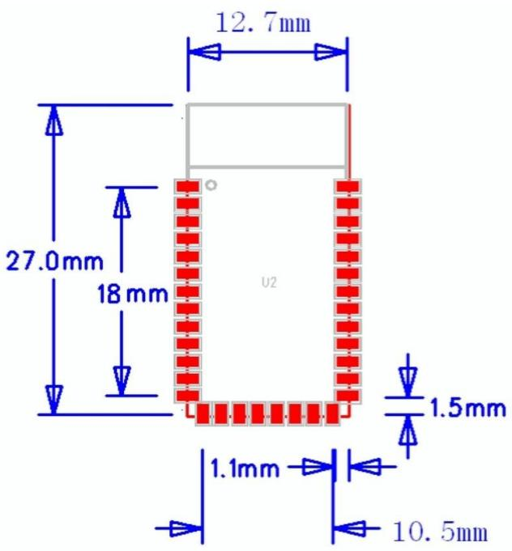

ITead Studio Make innovation easier

Tech Support: info@iteadstudio.com

# HC-05

# -Bluetooth to Serial Port Module

Overview

HC-05 module is an easy to use Bluetooth SPP (Serial Port Protocol) module, designed for transparent wireless serial connection setup.

Serial port Bluetooth module is fully qualified Bluetooth V2.0+EDR (Enhanced Data Rate) 3Mbps Modulation with complete 2.4GHz radio transceiver and baseband. It uses CSR Bluecore 04-External single chip Bluetooth system with CMOS technology and with AFH(Adaptive Frequency Hopping Feature). It has the footprint as small as 12.7mmx27mm. Hope it will simplify your overall design/development cycle.

## Specifications

## Hardware features

 Typical -80dBm sensitivity

 Up to +4dBm RF transmit power

 Low Power 1.8V Operation ,1.8 to 3.6V I/O

 PIO control

 UART interface with programmable baud rate

 With integrated antenna

 With edge connector

06.18.2010

HC-05 Bluetooth module

iteadstudio.com

ITead Studio Make innovation easier

Tech Support: info@iteadstudio.com

## Software features

 Default Baud rate: 38400, Data bits:8, Stop bit:1,Parity:No parity, Data control: has. Supported baud rate: 9600,19200,38400,57600,115200,230400,460800.

 Given a rising pulse in PIO0, device will be disconnected.

 Status instruction port PIO1: low-disconnected, high-connected;

PIO10 and PIO11 can be connected to red and blue led separately. When master and slave are paired, red and blue led blinks 1time/2s in interval, while disconnected only blue led blinks 2times/s.

 Auto-connect to the last device on power as default.

 Permit pairing device to connect as default.

 Auto-pairing PINCODE:”0000” as default

 Auto-reconnect in 30 min when disconnected as a result of beyond the range of connection.

## Hardware

06.18.2010

2

HC-05 Bluetooth module

iteadstudio.com

ITead Studio Make innovation easier

Tech Support: info@iteadstudio.com

<table><tr><td rowspan=1 colspan=1>PIN Name</td><td rowspan=1 colspan=1>PIN#</td><td rowspan=1 colspan=1>Pad type</td><td rowspan=1 colspan=1>Description</td><td rowspan=1 colspan=1>Note</td></tr><tr><td rowspan=1 colspan=1>GND</td><td rowspan=1 colspan=1>132122</td><td rowspan=1 colspan=1>VSS</td><td rowspan=1 colspan=1>Ground pot</td><td rowspan=1 colspan=1></td></tr><tr><td rowspan=1 colspan=1>3.3VCC</td><td rowspan=1 colspan=1>12</td><td rowspan=1 colspan=1>3.3V</td><td rowspan=1 colspan=1>Integrated 3.3V (+) supply withOn-chip linear regulator outputwithin 3.15-3.3V</td><td rowspan=1 colspan=1></td></tr><tr><td rowspan=1 colspan=1>AIO0</td><td rowspan=1 colspan=1>9</td><td rowspan=1 colspan=1>Bi-Directional</td><td rowspan=1 colspan=1>Programmable input/output line</td><td rowspan=1 colspan=1></td></tr><tr><td rowspan=1 colspan=1>AI01</td><td rowspan=1 colspan=1>10</td><td rowspan=1 colspan=1>Bi-Directional</td><td rowspan=1 colspan=1>Programmable input/output line</td><td rowspan=1 colspan=1></td></tr><tr><td rowspan=1 colspan=1>PIO0</td><td rowspan=1 colspan=1>23</td><td rowspan=1 colspan=1>Bi-DirectionalRX EN</td><td rowspan=1 colspan=1>Programmable input/output line,control output for LNA(if fitted)</td><td rowspan=1 colspan=1></td></tr><tr><td rowspan=1 colspan=1>PIO1</td><td rowspan=1 colspan=1>24</td><td rowspan=1 colspan=1>Bi-DirectionalTX EN</td><td rowspan=1 colspan=1>Programmable input/output line,control output for PA(if fitted)</td><td rowspan=1 colspan=1></td></tr></table>

<table><tr><td colspan="1" rowspan="1">PIO2</td><td colspan="1" rowspan="1">25</td><td colspan="1" rowspan="1">Bi-Directional</td><td colspan="1" rowspan="1">Programmable input/output line</td><td colspan="1" rowspan="1"></td></tr><tr><td colspan="1" rowspan="1">PIO3</td><td colspan="1" rowspan="1">26</td><td colspan="1" rowspan="1">Bi-Directional</td><td colspan="1" rowspan="1">Programmable input/output line</td><td colspan="1" rowspan="1"></td></tr><tr><td colspan="1" rowspan="1">PIO4</td><td colspan="1" rowspan="1">27</td><td colspan="1" rowspan="1">Bi-Directional</td><td colspan="1" rowspan="1">Programmable input/output line</td><td colspan="1" rowspan="1"></td></tr><tr><td colspan="1" rowspan="1">PIO5</td><td colspan="1" rowspan="1">28</td><td colspan="1" rowspan="1">Bi-Directional</td><td colspan="1" rowspan="1">Programmable input/output line</td><td colspan="1" rowspan="1"></td></tr><tr><td colspan="1" rowspan="1">PIO6</td><td colspan="1" rowspan="1">29</td><td colspan="1" rowspan="1">Bi-Directional</td><td colspan="1" rowspan="1">Programmable input/output line</td><td colspan="1" rowspan="1"></td></tr><tr><td colspan="1" rowspan="1">PIO7</td><td colspan="1" rowspan="1">30</td><td colspan="1" rowspan="1">Bi-Directional</td><td colspan="1" rowspan="1">Programmable input/output line</td><td colspan="1" rowspan="1"></td></tr><tr><td colspan="1" rowspan="1">PIO8</td><td colspan="1" rowspan="1">31</td><td colspan="1" rowspan="1">Bi-Directional</td><td colspan="1" rowspan="1">Programmable input/output line</td><td colspan="1" rowspan="1"></td></tr><tr><td colspan="1" rowspan="1">PIO9</td><td colspan="1" rowspan="1">32</td><td colspan="1" rowspan="1">Bi-Directional</td><td colspan="1" rowspan="1">Programmable input/output line</td><td colspan="1" rowspan="1"></td></tr><tr><td colspan="1" rowspan="1">PIO10</td><td colspan="1" rowspan="1">33</td><td colspan="1" rowspan="1">Bi-Directional</td><td colspan="1" rowspan="1">Programmable input/output line</td><td colspan="1" rowspan="1"></td></tr><tr><td colspan="1" rowspan="1">PIO11</td><td colspan="1" rowspan="1">34</td><td colspan="1" rowspan="1">Bi-Directional</td><td colspan="1" rowspan="1">Programmable input/output line</td><td colspan="1" rowspan="1"></td></tr><tr><td colspan="1" rowspan="1">RESETB</td><td colspan="1" rowspan="1">11</td><td colspan="1" rowspan="1">CMOS input withweak internalpull-up</td><td colspan="1" rowspan="1">Reset if low.input debouncde somust be low for >5MS to causea reset</td><td colspan="1" rowspan="1"></td></tr><tr><td colspan="1" rowspan="1">UART_RTS</td><td colspan="1" rowspan="1">4</td><td colspan="1" rowspan="1">CMOS output,tri-stable withweak internalpull-up</td><td colspan="1" rowspan="1">UART request to send, active low</td><td colspan="1" rowspan="1"></td></tr><tr><td colspan="1" rowspan="1">UART_CTS</td><td colspan="1" rowspan="1">3</td><td colspan="1" rowspan="1">CMOS inputwith weakinternalpull-down</td><td colspan="1" rowspan="1">UART clear to send, active low</td><td colspan="1" rowspan="1"></td></tr><tr><td colspan="1" rowspan="1">UART RX</td><td colspan="1" rowspan="1">2</td><td colspan="1" rowspan="1">CMOS inputwith weakinternalpull-down</td><td colspan="1" rowspan="1">UART Data input</td><td colspan="1" rowspan="1"></td></tr><tr><td colspan="1" rowspan="1">UART_TX</td><td colspan="1" rowspan="1">1</td><td colspan="1" rowspan="1">CMOS output,Tri-stable withweak internalpull-up</td><td colspan="1" rowspan="1">UART Data output</td><td colspan="1" rowspan="1"></td></tr><tr><td colspan="1" rowspan="1">SPI_MOSI</td><td colspan="1" rowspan="1">17</td><td colspan="1" rowspan="1">CMOS inputwith weakinternalpull-down</td><td colspan="1" rowspan="1">Serial peripheral interface datainput</td><td colspan="1" rowspan="1"></td></tr></table>

06.18.2010

3

HC-05 Bluetooth module

iteadstudio.com

ITead Studio Make innovation easier

Tech Support: info@iteadstudio.com

<table><tr><td colspan="1" rowspan="1">SPI_CSB</td><td colspan="1" rowspan="1">16</td><td colspan="1" rowspan="1">CMOS inputwith weakinternalpull-up</td><td colspan="1" rowspan="1">Chip select for serial peripheralinterface, active low</td><td colspan="1" rowspan="1"></td></tr><tr><td colspan="1" rowspan="1">SPI_CLK</td><td colspan="1" rowspan="1">19</td><td colspan="1" rowspan="1">CMOS inputwith weakinternalpull-down</td><td colspan="1" rowspan="1">Serial peripheral interface clock</td><td colspan="1" rowspan="1"></td></tr><tr><td colspan="1" rowspan="1">SPI_MISO</td><td colspan="1" rowspan="1">18</td><td colspan="1" rowspan="1">CMOS inputwith weakinternalpull-down</td><td colspan="1" rowspan="1">Serial peripheral interface dataOutput</td><td colspan="1" rowspan="1"></td></tr><tr><td colspan="1" rowspan="1">USB_-</td><td colspan="1" rowspan="1">15</td><td colspan="1" rowspan="1">Bi-Directional</td><td colspan="1" rowspan="1"></td><td colspan="1" rowspan="1"></td></tr><tr><td colspan="1" rowspan="1">USB_+</td><td colspan="1" rowspan="1">20</td><td colspan="1" rowspan="1">Bi-Directional</td><td colspan="1" rowspan="1"></td><td colspan="1" rowspan="1"></td></tr><tr><td colspan="1" rowspan="1">NC</td><td colspan="1" rowspan="1">14</td><td colspan="1" rowspan="1"></td><td colspan="1" rowspan="1"></td><td colspan="1" rowspan="1"></td></tr><tr><td colspan="1" rowspan="1">PCM_CLK</td><td colspan="1" rowspan="1">5</td><td colspan="1" rowspan="1">Bi-Directional</td><td colspan="1" rowspan="1">Synchronous PCM data clock</td><td colspan="1" rowspan="1"></td></tr><tr><td colspan="1" rowspan="1">PCM_OUT</td><td colspan="1" rowspan="1">6</td><td colspan="1" rowspan="1">CMOS output</td><td colspan="1" rowspan="1">Synchronous PCM data output</td><td colspan="1" rowspan="1"></td></tr><tr><td colspan="1" rowspan="1">PCM_IN</td><td colspan="1" rowspan="1">7</td><td colspan="1" rowspan="1">CMOS Input</td><td colspan="1" rowspan="1">Synchronous PCM data input</td><td colspan="1" rowspan="1"></td></tr><tr><td colspan="1" rowspan="1">PCM_SYNC</td><td colspan="1" rowspan="1">8</td><td colspan="1" rowspan="1">Bi-Directional</td><td colspan="1" rowspan="1">Synchronous PCM data strobe</td><td colspan="1" rowspan="1"></td></tr></table>

4

06.18.2010

HC-05 Bluetooth module

iteadstudio.com

ITead Studio Make innovation easier

Tech Support: info@iteadstudio.com

## AT command Default:

How to set the mode to server (master):

1. Connect PIO11 to high level.

2. Power on, module into command state.

3. Using baud rate 38400, sent the $^ { \prime \prime } \mathsf { A T } + \mathsf { R O L E } = 1 \mathsf { V } \mathsf { U } ^ { \prime \prime }$ to module, with “OK\r\n” means setting successes.

4. Connect the PIO11 to low level, repower the module, the module work as server (master).

AT commands: (all end with \r\n)

1. Test command:

<table><tr><td rowspan=1 colspan=1>Command</td><td rowspan=1 colspan=1>Respond</td><td rowspan=1 colspan=1>Parameter</td></tr><tr><td rowspan=1 colspan=1>AT</td><td rowspan=1 colspan=1>OK</td><td rowspan=1 colspan=1></td></tr></table>

<table><tr><td rowspan=1 colspan=1>Command</td><td rowspan=1 colspan=1>Respond</td><td rowspan=1 colspan=1>Parameter</td></tr><tr><td rowspan=1 colspan=1>AT+RESET</td><td rowspan=1 colspan=1>OK</td><td rowspan=1 colspan=1></td></tr></table>

3. Get firmware version

<table><tr><td rowspan=1 colspan=1>Command</td><td rowspan=1 colspan=1>Respond</td><td rowspan=1 colspan=1>Parameter</td></tr><tr><td rowspan=1 colspan=1>AT+VERSION?</td><td rowspan=1 colspan=1>+VERSION:<Param>OK</td><td rowspan=1 colspan=1>Param : firmware version</td></tr></table>

Example:

AT+VERSION?\r\n

+VERSION:2.0-20100601

OK

06.18.2010

5

HC-05 Bluetooth module

iteadstudio.com

ITead Studio Make innovation easier

Tech Support: info@iteadstudio.com

4. Restore default

<table><tr><td rowspan=1 colspan=1>Command</td><td rowspan=1 colspan=1>Respond</td><td rowspan=1 colspan=1>Parameter</td></tr><tr><td rowspan=1 colspan=1>AT+ORGL</td><td rowspan=1 colspan=1>OK</td><td rowspan=1 colspan=1></td></tr></table>

Default state:

Slave mode, pin code :1234, device name: H-C-2010-06-01 ,Baud 38400bits/s.

5. Get module address

<table><tr><td rowspan=1 colspan=1>Command</td><td rowspan=1 colspan=1>Respond</td><td rowspan=1 colspan=1>Parameter</td></tr><tr><td rowspan=1 colspan=1>AT+ADDR?</td><td rowspan=1 colspan=1>+ADDR:<Param>OK</td><td rowspan=1 colspan=1>Param: address of Bluetoothmodule</td></tr></table>

Bluetooth address: NAP: UAP : LAP

Example:

AT+ADDR?\r\n

+ADDR:1234:56:abcdef

OK

6. Set/Check module name:

<table><tr><td rowspan=1 colspan=1>Command</td><td rowspan=1 colspan=1>Respond</td><td rowspan=1 colspan=1>Parameter</td></tr><tr><td rowspan=1 colspan=1>AT+NAME=<Param></td><td rowspan=1 colspan=1>OK</td><td rowspan=2 colspan=1>Param:Bluetooth modulename(Default :HC-05)</td></tr><tr><td rowspan=1 colspan=1>AT+NAME?</td><td rowspan=1 colspan=1>+NAME:<Param>OK (/FAIL)</td></tr></table>

Example:

AT+NAME=HC-05\r\n set the module name to “HC-05”

OK

AT+NAME=ITeadStudio\r\n

OK

AT+NAME?\r\n

+NAME: ITeadStudio

OK

7. Get the Bluetooth device name:

<table><tr><td rowspan=1 colspan=1>Command</td><td rowspan=1 colspan=1>Respond</td><td rowspan=1 colspan=1>Parameter</td></tr><tr><td rowspan=1 colspan=1>AT+RNAME?<Param1></td><td rowspan=1 colspan=1>1. +NAME:<Param2>OK2. FAIL</td><td rowspan=1 colspan=1>Param1,Param 2 : the addressof Bluetooth device</td></tr></table>

Example: (Device address 00:02:72:od:22:24，name：ITead)

AT+RNAME? 0002，72，od2224\r\n

+RNAME:ITead

OK

8. Set/Check module mode:

<table><tr><td colspan="1" rowspan="1">Command</td><td colspan="1" rowspan="1">Respond</td><td colspan="1" rowspan="1">Parameter</td></tr><tr><td colspan="1" rowspan="1">AT+ROLE=<Param></td><td colspan="1" rowspan="1">OK</td><td colspan="1" rowspan="2">Param:0- Slave</td></tr><tr><td colspan="1" rowspan="1">AT+ ROLE?</td><td colspan="1" rowspan="1">+ROLE:<Param></td></tr><tr><td></td><td>OK</td><td>1-Master 2-Slave-Loop</td></tr></table>

06.18.2010

6

HC-05 Bluetooth module

iteadstudio.com

ITead Studio Make innovation easier

Tech Support: info@iteadstudio.com

9. Set/Check device class

<table><tr><td>Command</td><td>Respond</td><td>Parameter</td></tr><tr><td>AT+CLASS=<Param></td><td>OK</td><td rowspan="3">Param: Device Class</td></tr><tr><td>AT+ CLASS?</td><td>1. +CLASS:<Param></td></tr><tr><td></td><td>OK 2. FAIL</td></tr></table>

10. Set/Check GIAC (General Inquire Access Code)

<table><tr><td rowspan=1 colspan=1>Command</td><td rowspan=1 colspan=1>Respond</td><td rowspan=1 colspan=1>Parameter</td></tr><tr><td rowspan=1 colspan=1>AT+IAC=<Param></td><td rowspan=1 colspan=1>1.0K2. FAIL</td><td rowspan=2 colspan=1>Param: GIAC(Default : 9e8b33)</td></tr><tr><td rowspan=1 colspan=1>AT+IAC</td><td rowspan=1 colspan=1>+IAC:<Param>OK</td></tr></table>

Example:

AT+IAC=9e8b3f\r\n

OK

AT+IAC?\r\n

+IAC: 9e8b3f

OK

11. Set/Check -- Query access patterns

<table><tr><td rowspan=1 colspan=1>Command</td><td rowspan=1 colspan=1>Respond</td><td rowspan=1 colspan=1>Parameter</td></tr><tr><td rowspan=1 colspan=1>AT+INQM=<Param>,<Param2>,<Param3></td><td rowspan=1 colspan=1>1.0K2. FAIL</td><td rowspan=2 colspan=1>Param:0——inquiry_mode_standard1——inquiry_mode_rssiParam2: Maximum number ofBluetooth devices to respondtoParam3:Timeout (1-48 : 1.28s to61.44s)</td></tr><tr><td rowspan=1 colspan=1>AT+ INQM?</td><td rowspan=1 colspan=1>+INQM ： <Param>,<Param2>,<Param3>OK</td></tr></table>

Example:

AT+INQM=1,9,48\r\n

OK

AT+INQM\r\n

+INQM:1, 9, 48

OK

06.18.2010

7

HC-05 Bluetooth module

iteadstudio.com

ITead Studio Make innovation easier

Tech Support: info@iteadstudio.com

12. Set/Check PIN code:

<table><tr><td>Command</td><td>Respond</td><td>Parameter</td></tr><tr><td>AT+PSWD=<Param></td><td>OK</td><td rowspan="3">Param: PIN code (Default 1234)</td></tr><tr><td>AT+ PSWD?</td><td>+ PSWD : <Param></td></tr><tr><td>OK</td><td></td></tr></table>

13. Set/Check serial parameter:

<table><tr><td rowspan=1 colspan=1>Command</td><td rowspan=1 colspan=1>Respond</td><td rowspan=1 colspan=1>Parameter</td></tr><tr><td rowspan=1 colspan=1>AT+UART=<Param>,<Param2>,<Param3></td><td rowspan=1 colspan=1>OK</td><td rowspan=2 colspan=1>Param1: BaudParam2: Stop bitParam3: Parity</td></tr><tr><td rowspan=1 colspan=1>AT+ UART?</td><td rowspan=1 colspan=1>+UART=<Param>,<Param2>,<Param3>OK</td></tr></table>

Example:

AT+UART=115200，1,2,\r\n

OK

AT+UART?

+UART:115200,1,2

OK

14. Set/Check connect mode:

<table><tr><td rowspan=1 colspan=1>Command</td><td rowspan=1 colspan=1>Respond</td><td rowspan=1 colspan=1>Parameter</td></tr><tr><td rowspan=1 colspan=1>AT+CMODE=<Param></td><td rowspan=1 colspan=1>OK</td><td rowspan=2 colspan=1>Param:0 - connect fixed address1 - connect any address2 - slave-Loop</td></tr><tr><td rowspan=1 colspan=1>AT+ CMODE?</td><td rowspan=1 colspan=1>+ CMODE:<Param>OK</td></tr></table>

15. Set/Check fixed address:

<table><tr><td rowspan=1 colspan=1>Command</td><td rowspan=1 colspan=1>Respond</td><td rowspan=1 colspan=1>Parameter</td></tr><tr><td rowspan=1 colspan=1>AT+BIND=<Param></td><td rowspan=1 colspan=1>OK</td><td rowspan=2 colspan=1>Param: Fixed address(Default00:00:00:00:00:00)</td></tr><tr><td rowspan=1 colspan=1>AT+ BIND?</td><td rowspan=1 colspan=1>+ BIND:<Param>OK</td></tr></table>

Example:

AT+BIND=1234，56，abcdef\r\n

OK

AT+BIND?\r\n

+BIND:1234:56:abcdef

OK

16. Set/Check LED I/O

<table><tr><td>Command</td><td>Respond</td><td>Parameter</td></tr><tr><td>AT+POLAR=<Param1,<Param2></td><td>OK</td><td>Param1:</td></tr><tr><td>AT+ POLAR?</td><td>+ POLAR=<Param1>,<Param2></td><td>0- PIO8 low drive LED</td></tr><tr><td></td><td>OK</td><td>1- PIO8 high drive LED</td></tr><tr><td></td><td></td><td>Param2: 0- PIO9 low drive LED 1- PIO9 high drive LED</td></tr></table>

06.18.2010

8

HC-05 Bluetooth module

iteadstudio.com

ITead Studio Make innovation easier

Tech Support: info@iteadstudio.com

17. Set PIO output

<table><tr><td>Command</td><td>Respond</td><td>Parameter</td></tr><tr><td rowspan="5">AT+PIO=<Param1>,<Param2></td><td rowspan="5">OK</td><td>Param1: PIO number</td></tr><tr><td>Param2: PIO level</td></tr><tr><td>0- low</td></tr><tr><td>1- high</td></tr><tr><td></td></tr></table>

Example:

1. PIO10 output high level

AT+PI0=10，1\r\n

OK

18. Set/Check – scan parameter

<table><tr><td rowspan=1 colspan=1>Command</td><td rowspan=1 colspan=1>Respond</td><td rowspan=1 colspan=1>Parameter</td></tr><tr><td rowspan=1 colspan=1>AT+IPSCAN=<Param1>,<Param2>,<Param3>,<Param4></td><td rowspan=1 colspan=1>OK</td><td rowspan=2 colspan=1>Param1:  Query  timeintervalParam2: Query durationParam3: Paging intervalParam4: Call duration</td></tr><tr><td rowspan=1 colspan=1>AT+IPSCAN?</td><td rowspan=1 colspan=1>+IPSCAN:<Param1>,<Param2>,<Param3>,<Param4>OK</td></tr></table>

Example:

AT+IPSCAN =1234,500,1200,250\r\n

OK

AT+IPSCAN?

+IPSCAN:1234,500,1200,250

19. Set/Check – SHIFF parameter

<table><tr><td rowspan=1 colspan=1>Command</td><td rowspan=1 colspan=1>Respond</td><td rowspan=1 colspan=1>Parameter</td></tr><tr><td rowspan=1 colspan=1>AT+SNIFF=<Param1>,<Param2>,<Param3>,<Param4></td><td rowspan=1 colspan=1>OK</td><td rowspan=2 colspan=1>Param1: Max timeParam2: Min timeParam3: Retry timeParam4: Time out</td></tr><tr><td rowspan=1 colspan=1>AT+ SNIFF?</td><td rowspan=1 colspan=1>+SNIFF:<Param1>,<Param2>,<Param3>,<Param4>OK</td></tr></table>

20. Set/Check security mode

<table><tr><td colspan="1" rowspan="1">Command</td><td colspan="1" rowspan="1">Respond</td><td colspan="1" rowspan="1">Parameter</td></tr><tr><td colspan="1" rowspan="1">AT+SENM=<Param1>,<Param2></td><td colspan="1" rowspan="1">1.0K2. FAIL</td><td colspan="1" rowspan="2">Param1:0——sec_mode0+off1——sec_mode1+non_se</td></tr><tr><td colspan="1" rowspan="1">AT+ SENM?</td><td colspan="1" rowspan="1">+SENM:<Param1>,<Param2></td></tr><tr><td></td><td>OK o_pt</td><td>cure 2——sec_mode2_service 3——sec_mode3_link 4——sec_mode_unknow n Param2: 0——hci_enc_mode_off 1——hci_enc_mode_pt_t</td></tr></table>

06.18.2010

HC-05 Bluetooth module

iteadstudio.com

ITead Studio Make innovation easier

Tech Support: info@iteadstudio.com

21. Delete Authenticated Device

<table><tr><td rowspan=1 colspan=1>Command</td><td rowspan=1 colspan=1>Respond</td><td rowspan=1 colspan=1>Parameter</td></tr><tr><td rowspan=1 colspan=1>AT+PMSAD=<Param></td><td rowspan=1 colspan=1>OK</td><td rowspan=1 colspan=1>Param:Authenticated     DeviceAddress</td></tr></table>

Example:

AT+PMSAD =1234,56,abcdef\r\n

OK

22. Delete All Authenticated Device

23. Search Authenticated Device

<table><tr><td rowspan=1 colspan=1>Command</td><td rowspan=1 colspan=1>Respond</td><td rowspan=1 colspan=1>Parameter</td></tr><tr><td rowspan=1 colspan=1>AT+ RMAAD</td><td rowspan=1 colspan=1>OK</td><td rowspan=1 colspan=1></td></tr></table>

<table><tr><td rowspan=1 colspan=1>Command</td><td rowspan=1 colspan=1>Respond</td><td rowspan=1 colspan=1>Parameter</td></tr><tr><td rowspan=1 colspan=1>AT+FSAD=<Param></td><td rowspan=1 colspan=1>1.OK2. FAIL</td><td rowspan=1 colspan=1>Param: Device address</td></tr></table>

24. Get Authenticated Device Count

<table><tr><td rowspan=1 colspan=1>Command</td><td rowspan=1 colspan=1>Respond</td><td rowspan=1 colspan=1>Parameter</td></tr><tr><td rowspan=1 colspan=1>AT+ADCN?</td><td rowspan=1 colspan=1>+ADCN: <Param>OK</td><td rowspan=1 colspan=1>Param: Device Count</td></tr></table>

25. Most Recently Used Authenticated Device

<table><tr><td>Command</td><td>Respond</td><td>Parameter</td><td></td></tr><tr><td>AT+MRAD?</td><td>+ MRAD: <Param> OK</td><td>Param: Authenticated Address</td><td>Recently Device</td></tr></table>

26. Get the module working state

<table><tr><td>Command</td><td>Respond</td><td>Parameter</td></tr><tr><td>AT+ STATE? OK</td><td>+ STATE: <Param></td><td>Param:</td></tr><tr><td rowspan="9"></td><td>“INITIALIZED”</td></tr><tr><td>“READY"</td></tr><tr><td>“PAIRABLE" “PAIRED”</td></tr><tr><td>"INQUIRING"</td></tr><tr><td>“CONNECTING"</td></tr><tr><td>“CONNECTED"</td></tr><tr><td></td></tr><tr><td>"DISCONNECTED"</td></tr><tr><td>"NUKNOW"</td></tr></table>

10

06.18.2010

HC-05 Bluetooth module

iteadstudio.com

ITead Studio Make innovation easier

Tech Support: info@iteadstudio.com

27. Initialize the SPP profile lib

<table><tr><td rowspan=1 colspan=1>Command</td><td rowspan=1 colspan=1>Respond</td><td rowspan=1 colspan=1>Parameter</td></tr><tr><td rowspan=1 colspan=1>AT+INIT</td><td rowspan=1 colspan=1>1.OK2. FAIL</td><td rowspan=1 colspan=1></td></tr></table>

## 28. Inquiry Bluetooth Device

<table><tr><td>Command</td><td>Respond</td><td>Parameter</td></tr><tr><td rowspan="3">AT+INQ</td><td>+INQ: <Param1>, <Param2> ,</td><td>Param1: Address Param2: Device Class</td></tr><tr><td><Param3> .….</td><td>Param3 : RSSI Signal</td></tr><tr><td>OK</td><td>strength</td></tr></table>

Example:

OK

OK

28. Cancel Inquiring Bluetooth Device

<table><tr><td rowspan=1 colspan=1>Command</td><td rowspan=1 colspan=1>Respond</td><td rowspan=1 colspan=1>Parameter</td></tr><tr><td rowspan=1 colspan=1>AT+ INQC</td><td rowspan=1 colspan=1>OK</td><td rowspan=1 colspan=1></td></tr></table>

11

06.18.2010

HC-05 Bluetooth module

iteadstudio.com

ITead Studio Make innovation easier

Tech Support: info@iteadstudio.com

29. Equipment Matching

<table><tr><td rowspan=1 colspan=1>Command</td><td rowspan=1 colspan=1>Respond</td><td rowspan=1 colspan=1>Parameter</td></tr><tr><td rowspan=2 colspan=1>AT+PAIR=<Param1>,<Param2></td><td rowspan=1 colspan=1>1.OK</td><td rowspan=2 colspan=1>Param1: Device AddressParam2: Time out</td></tr><tr><td rowspan=1 colspan=1>2. FAIL</td></tr></table>

## 30. Connect Device

<table><tr><td rowspan=1 colspan=1>Command</td><td rowspan=1 colspan=1>Respond</td><td rowspan=1 colspan=1>Parameter</td></tr><tr><td rowspan=1 colspan=1>AT+LINK=<Param></td><td rowspan=1 colspan=1>1.OK2. FAIL</td><td rowspan=1 colspan=1>Param: Device Address</td></tr></table>

Example:

AT+FSAD=1234,56,abcdef\r\n

OK

AT+LINK=1234,56,abcdef\r\n

OK

31. Disconnect

<table><tr><td rowspan=1 colspan=1>Command</td><td rowspan=1 colspan=1>Respond</td><td rowspan=1 colspan=1>Parameter</td></tr><tr><td rowspan=1 colspan=1>AT+DISC</td><td rowspan=1 colspan=1>1. +DISC:SUCCESSOK2. +DISC:LINK_LOSSOK3. +DISC:NO_SLCOK4. +DISC:TIMEOUTOK5. +DISC:ERROROK</td><td rowspan=1 colspan=1>Param: Device Address</td></tr></table>

32. Energy-saving mode

<table><tr><td rowspan=1 colspan=1>Command</td><td rowspan=1 colspan=1>Respond</td><td rowspan=1 colspan=1>Parameter</td></tr><tr><td rowspan=1 colspan=1>AT+ENSNIFF=<Param></td><td rowspan=1 colspan=1>OK</td><td rowspan=1 colspan=1>Param: Device Address</td></tr></table>

## 33. Exerts Energy-saving mode

<table><tr><td rowspan=1 colspan=1>Command</td><td rowspan=1 colspan=1>Respond</td><td rowspan=1 colspan=1>Parameter</td></tr><tr><td rowspan=1 colspan=1>AT+ EXSNIFF =<Param></td><td rowspan=1 colspan=1>OK</td><td rowspan=1 colspan=1>Param: Device Address</td></tr></table>

12

06.18.2010

HC-05 Bluetooth module

iteadstudio.com

ITead Studio Make innovation easier

Tech Support: info@iteadstudio.com

## Revision History

<table><tr><td rowspan=1 colspan=1>Rev.</td><td rowspan=1 colspan=1>Description</td><td rowspan=1 colspan=1>Release date</td></tr><tr><td rowspan=1 colspan=1>v1.0</td><td rowspan=1 colspan=1>Initial version</td><td rowspan=1 colspan=1>7/18/2010</td></tr><tr><td rowspan=1 colspan=1></td><td rowspan=1 colspan=1></td><td rowspan=1 colspan=1></td></tr><tr><td rowspan=1 colspan=1></td><td rowspan=1 colspan=1></td><td rowspan=1 colspan=1></td></tr></table>

06.18.2010

13

HC-05 Bluetooth module

iteadstudio.com