STM32F405xx STM32F407xx

life.augmented

## Arm® Cortex®-M4 32b MCU+FPU, 210DMIPS, up to 1MB flash/192+4KB RAM, USB OTG HS/FS, Ethernet, 17 TIMs, 3 ADCs, 15 comm. interfaces, and camera

## Datasheet - production data

## Features

• Includes ST state-of-the-art patented technology

• Core: Arm® 32-bit Cortex®-M4 CPU with FPU, Adaptive real-time accelerator (ART Accelerator) allowing 0-wait state execution from flash memory, frequency up to 168 MHz, memory protection unit, 210 DMIPS/ 1.25 DMIPS/MHz (Dhrystone 2.1), and DSP instructions

• Memories

– Up to 1 Mbyte of flash memory

Up to 192+4 Kbytes of SRAM including 64- Kbyte of CCM (core coupled memory) data RAM

– 512 bytes of OTP memory

一 Flexible static memory controllersupporting CompactFlash™, SRAM,PSRAM, NOR and NAND memories

• LCD parallel interface, 8080/6800 modes

• Clock, reset, and supply management

– 1.8 V to 3.6 V application supply and I/Os

– POR, PDR, PVD and BOR

– 4-to-26 MHz crystal oscillator

– Internal 16 MHz factory-trimmed RC (1% accuracy)

– 32 kHz oscillator for RTC with calibration

– Internal 32 kHz RC with calibration

• Low-power operation

– Sleep, Stop, and Standby modes

\- VBAT supply for RTC, 20×32-bit backup registers + optional 4 KB backup SRAM

• 3×12-bit, 2.4 MSPS A/D converters: up to 24 channels and 7.2 MSPS in triple interleaved mode

• 2×12-bit D/A converters

• General-purpose DMA: 16-stream DMA controller with FIFOs and burst support

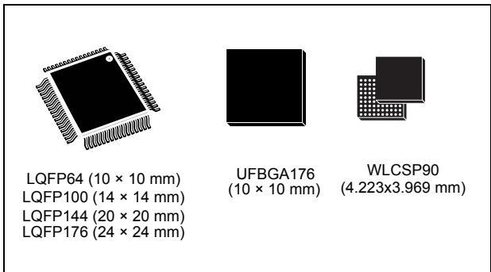

Up to 17 timers: up to twelve 16-bit and two 32- bit timers up to 168 MHz, each with up to 4 IC/OC/PWM or pulse counter and quadrature (incremental) encoder input

• Debug mode

Serial wire debug (SWD) & JTAG interfaces

– Cortex-M4 Embedded Trace Macrocell ™

• Up to 140 l/O ports with interrupt capability

– Up to 136 fast l/Os up to 84 MHz

– Up to 138 5 V-tolerant l/Os

• Up to 15 communication interfaces

\- Up to $3 \times 1 ^ { 2 } \mathrm { C }$ interfaces (SMBus/PMBus)

– Up to 4 USARTs/2 UARTs (10.5 Mbit/s, ISO 7816 interface, LIN, IrDA, modem control)

Up to 3 SPIs (42 Mbits/s), 2 with muxed full-duplex I²S to achieve audio class accuracy via internal audio PLL or external clock

– 2 × CAN interfaces (2.0B Active)

\- SDIO interface

## • Advanced connectivity

– USB 2.0 full-speed device/host/OTG controller with on-chip PHY

一 USB 2.0 high-speed/full-speeddevice/host/OTG controller with dedicatedDMA, on-chip full-speed PHY and ULPI

一 10/100 Ethernet MAC with dedicated DMA:supports IEEE 1588v2 hardware, MII/RMII

www.st.com

March 2026

DS8626 Rev 12

This is information on a product in full production.

1/206

STM32F405xx, STM32F407xx

• 8- to 14-bit parallel camera interface up to 54 Mbytes/s

• 96-bit unique ID

• True random number generator

• RTC: subsecond accuracy, hardware calendar

• All packages are ECOPACK2 compliant

• CRC calculation unit

Table 1. Device summary

<table><tr><td rowspan=1 colspan=1>Reference</td><td rowspan=1 colspan=1>Part number</td></tr><tr><td rowspan=1 colspan=1>STM32F405xx</td><td rowspan=1 colspan=1>STM32F405RG, STM32F405VG, STM32F405ZG, STM32F405OG, STM32F405OE</td></tr><tr><td rowspan=1 colspan=1>STM32F407xx</td><td rowspan=1 colspan=1>STM32F407VG, STM32F407IG, STM32F407ZG, STM32F407VE, STM32F407ZE,STM32F407IE</td></tr></table>

2/206

DS8626 Rev 12

STM32F405xx, STM32F407xx

Contents

## Contents

1 Introduction 13   
2 Description . 14   
2.1 Full compatibility throughout the family 17   
3 Functional overview 20   
3.1 $\mathsf { A r m } ^ { \mathbb { B } }$ Cortex®-M4 core with FPU and embedded flash and SRAM 21   
3.2 Adaptive real-time memory accelerator (ART Accelerator) 21   
3.3 Memory protection unit 21   
3.4 Embedded flash memory 22   
3.5 CRC (cyclic redundancy check) calculation unit 22   
3.6 Embedded SRAM . 22   
3.7 Multi-AHB bus matrix 22   
3.8 DMA controller (DMA) 23   
3.9 Flexible static memory controller (FSMC) 24   
3.9.1 LCD parallel interface 24   
3.10 Nested vectored interrupt controller (NVIC) 24   
3.11 External interrupt/event controller (EXTI) . 25   
3.12 Clocks and startup 25   
3.13 Boot modes 25   
3.14 Power supply schemes 25   
3.15 Power supply supervisor 26   
3.15.1 Internal reset ON 26   
3.15.2 Internal reset OFF .26   
3.16 Voltage regulator 28   
3.16.1 Regulator ON 28   
3.16.2 Regulator OFF .29   
3.17 Regulator ON/OFF and internal reset ON/OFF availability 31   
3.18 Real-time clock (RTC), backup SRAM and backup registers 31   
3.19 Low-power modes 32   
3.20 $\mathsf { V } _ { \mathsf { B A T } }$ operation 33   
3.21 Timers and watchdogs 33   
3.21.1 Advanced-control timers (TIM1, TIM8) .34   
3.21.2 General-purpose timers (TIMx) .35   
3.21.3 Basic timers TIM6 and TIM7 .35   
3.22 Inter-integrated circuit interface (I²C) 36   
3.23 Universal synchronous/asynchronous receiver transmitters (USART). . 36   
3.24 Serial peripheral interface (SPI) 37   
3.25 Inter-integrated sound (I2S) 37   
3.26 Audio PLL (PLLI2S) 38   
3.27 Secure digital input/output interface (SDIO) 38   
3.28 Ethernet MAC interface with dedicated DMA and IEEE 1588 support . . . 38   
3.29 Controller area network (bxCAN) 39   
3.30 Universal serial bus on-the-go full-speed (OTG FS) 39   
3.31 Universal serial bus on-the-go high-speed (OTG\_HS) 40   
3.32 Digital camera interface (DCMI) 40   
3.33 True random number generator (RNG) 40   
3.34 General-purpose input/outputs (GPIOs) 41   
3.35 Analog-to-digital converters (ADCs) 41   
3.36 Temperature sensor 41   
3.37 Digital-to-analog converter (DAC) 41   
3.38 Serial wire JTAG debug port (SWJ-DP) 42   
3.39 Embedded Trace Macrocell ™ 42   
Pinouts and pin description . 43   
Memory mapping . .73   
Electrical characteristics .78   
6.1 Parameter conditions 78   
6.1.1 Minimum and maximum values .78   
6.1.2 Typical values .78   
6.1.3 Typical curves .78   
6.1.4 Loading capacitor .78   
6.1.5 Pin input voltage .78   
6.1.6 Power supply scheme .79   
6.1.7 Current consumption measurement .80   
6.2 Absolute maximum ratings 80   
6.3 Operating conditions 81   
6.3.1 General operating conditions .81   
6.3.2 VCAP\_1/VCAP\_2 external capacitor .84   
6.3.3 Operating conditions at power-up / power-down (regulator ON) .84   
6.3.4 Operating conditions at power-up / power-down (regulator OFF) 84   
6.3.5 Embedded reset and power control block characteristics ..85   
6.3.6 Supply current characteristics .86   
6.3.7 Wakeup time from low-power mode 100   
6.3.8 External clock source characteristics 101   
6.3.9 Internal clock source characteristics 105   
6.3.10 PLL characteristics 106   
6.3.11 PLL spread spectrum clock generation (SSCG) characteristics .108   
6.3.12 Memory characteristics 110   
6.3.13 EMC characteristics 112   
6.3.14 Absolute maximum ratings (electrical sensitivity) 114   
6.3.15 I/O current injection characteristics 115   
6.3.16 I/O port characteristics 116   
6.3.17 NRST pin characteristics 121   
6.3.18 TIM timer characteristics 121   
6.3.19 Communications interfaces 123   
6.3.20 CAN (controller area network) interface 135   
6.3.21 12-bit ADC characteristics .135   
6.3.22 Temperature sensor characteristics .140   
6.3.23 $\mathsf { V } _ { \mathsf { B A T } }$ monitoring characteristics .141   
6.3.24 Embedded reference voltage 141   
6.3.25 DAC electrical characteristics 141   
6.3.26 FSMC characteristics 144   
6.3.27 Camera interface (DCMI) timing specifications 162   
6.3.28 SD/SDIO MMC card host interface (SDIO) characteristics 163   
6.3.29 RTC characteristics 164   
Package information 165   
7.1 Device marking 165   
7.2 WLCSP90 package information 166   
7.3 LQFP64 package information (5W) 169   
7.4 LQFP100 package information (1L) 172   
7.5 LQFP144 package information (1A) . 175   
7.6 UFBGA(176+25) package information (A0E7) . . . . . . . . 179   
7.7 LQFP176 package information (1T) . 181   
7.8 Thermal characteristics 185   
8 Ordering information .186   
Appendix A Application block diagrams .187   
A.1 USB OTG full speed (FS) interface solutions 187   
A.2 USB OTG high speed (HS) interface solutions . . 189   
A.3 Ethernet interface solutions. 190   
9 Important security notice . 192   
10 Revision history .193

DS8626 Rev 12

3/206

Contents

STM32F405xx, STM32F407xx

4/206

DS8626 Rev 12

STM32F405xx, STM32F407xx

Contents

5/206

DS8626 Rev 12

Contents

STM32F405xx, STM32F407xx

6/206

DS8626 Rev 12

STM32F405xx, STM32F407xx

List of tables

## List of tables

Table 1. Device summary . .2   
Table 2. STM32F405xx and STM32F407xx: features and peripheral counts. 15   
Table 3. Regulator ON/OFF and internal reset ON/OFF availability 31   
Table 4. Timer feature comparison. 33   
Table 5. USART feature comparison 37   
Table 6. Legend/abbreviations used in the pinout table 48   
Table 7. STM32F40xxx pin and ball definitions 49   
Table 8. FSMC pin definition 61   
Table 9. Alternate function mapping . 64   
Table 10. Register boundary addresses 74   
Table 11. Voltage characteristics 80   
Table 12. Current characteristics 81   
Table 13. Thermal characteristics. 81   
Table 14. General operating conditions 81   
Table 15. Limitations depending on the operating power supply range 83   
Table 16. VCAP\_1/VCAP\_2 operating conditions 84   
Table 17. Operating conditions at power-up / power-down (regulator ON) 84   
Table 18. Operating conditions at power-up / power-down (regulator OFF) 84   
Table 19. Embedded reset and power control block characteristics. 85   
Table 20. Typical and maximum current consumption in Run mode, code with data processing   
running from flash memory (ART accelerator enabled) or RAM .87   
Table 21. Typical and maximum current consumption in Run mode, code with data processing   
running from flash memory (ART accelerator disabled) 88   
Table 22. Typical and maximum current consumption in Sleep mode 91   
Table 23. Typical and maximum current consumptions in Stop mode 92   
Table 24. Typical and maximum current consumptions in Standby mode 92   
Table 25. Typical and maximum current consumptions in VBAτ mode. 93   
Table 26. Typical current consumption in Run mode, code with data processing   
running from flash memory, regulator ON (ART accelerator enabled   
except prefetch), VDD = 1.8 V. .95   
Table 27. Switching output l/O current consumption 97   
Table 28. Peripheral current consumption 98   
Table 29. Low-power mode wakeup timings 101   
Table 30. High-speed external user clock characteristics. 101   
Table 31. Low-speed external user clock characteristics 102   
Table 32. HSE 4-26 MHz oscillator characteristics 103   
Table 33. LSE oscillator characteristics (fLsE = 32.768 kHz) 104   
Table 34. HSI oscillator characteristics 105   
Table 35. LSI oscillator characteristics 105   
Table 36. Main PLL characteristics. 106   
Table 37. PLLI2S (audio PLL) characteristics 107   
Table 38. SSCG parameters constraint 108   
Table 39. Flash memory characteristics 110   
Table 40. Flash memory programming 110   
Table 41. Flash memory programming with VPP 112   
Table 42. Flash memory endurance and data retention 112   
Table 43. EMS characteristics 113   
Table 44. EMI characteristics for fHSE = 25 MH and fCPU = 168 MHz. 114   
Table 45. ESD absolute maximum ratings 114   
Table 46. Electrical sensitivities 115   
Table 47. I/O current injection susceptibility 116   
Table 48. I/O static characteristics 116   
Table 49. Output voltage characteristics 118   
Table 50. I/O AC characteristics 119   
Table 51. NRST pin characteristics 121   
Table 52. Characteristics of TIMx connected to the APB1 domain 122   
Table 53. Characteristics of TIMx connected to the APB2 domain 123   
Table 54. I2C analog filter characteristics. 123   
Table 55. SPI dynamic characteristics 124   
Table 56. I2S dynamic characteristics 128   
Table 57. USB OTG FS startup time 130   
Table 58. USB OTG FS DC electrical characteristics 130   
Table 59. USB OTG FS electrical characteristics 131   
Table 60. USB HS DC electrical characteristics 131   
Table 61. USB HS clock timing parameters 131   
Table 62. ULPI timing 132   
Table 63. Ethernet DC electrical characteristics 133   
Table 64. Dynamic characteristics: Ethernet MAC signals for SMI. 133   
Table 65. Dynamic characteristics: Ethernet MAC signals for RMII 134   
Table 66. Dynamic characteristics: Ethernet MAC signals for MII 135   
Table 67. ADC characteristics 135   
Table 68. ADC accuracy at fADC = 30 MHz 137   
Table 69. Temperature sensor characteristics 140   
Table 70. Temperature sensor calibration values 140   
Table 71. VBAT monitoring characteristics 141   
Table 72. Embedded internal reference voltage 141   
Table 73. Internal reference voltage calibration values 141   
Table 74. DAC characteristics 141   
Table 75. Asynchronous non-multiplexed SRAM/PSRAM/NOR read timings 145   
Table 76. Asynchronous non-multiplexed SRAM/PSRAM/NOR write timings 146   
Table 77. Asynchronous multiplexed PSRAM/NOR read timings 147   
Table 78. Asynchronous multiplexed PSRAM/NOR write timings 148   
Table 79. Synchronous multiplexed NOR/PSRAM read timings 150   
Table 80. Synchronous multiplexed PSRAM write timings 151   
Table 81. Synchronous non-multiplexed NOR/PSRAM read timings 153   
Table 82. Synchronous non-multiplexed PSRAM write timings 154   
Table 83. Switching characteristics for PC Card/CF read and write cycles   
in attribute/common space 159   
Table 84. Switching characteristics for PC Card/CF read and write cycles   
in l/O space 160   
Table 85. Switching characteristics for NAND flash read cycles 161   
Table 86. Switching characteristics for NAND flash write cycles 162   
Table 87. DCMI characteristics 162   
Table 88. Dynamic characteristics: SD/MMC characteristics 164   
Table 89. RTC characteristics 164   
Table 90. WLCSP90 - 4.223 x 3.969 mm, 0.400 mm pitch wafer level chip scale   
package mechanical data 167   
Table 91. WLCSP90 recommended PCB design rules 168   
Table 92. LQFP64 - Mechanical data 170   
Table 93. LQFP100 - Mechanical data 173   
Table 94. LQFP144 - Mechanical data . 176   
Table 95. UFBGA(176+25) - Mechanical data. 179   
Table 96. UFBGA(176+25) - Example of PCB design rules (0.65 mm pitch BGA) 180   
Table 97. LQFP176 - Mechanical data . 182   
Table 98. Package thermal characteristics. 185   
Table 99. Document revision history 193

7/206

DS8626 Rev 12

List of tables

STM32F405xx, STM32F407xx

8/206

DS8626 Rev 12

STM32F405xx, STM32F407xx

List of tables

DS8626 Rev 12

9/206

List of figures

STM32F405xx, STM32F407xx

## List of figures

Figure 1. Compatible board design between STM32F10xx/STM32F40xxx for LQFP64 .17   
Figure 2. Compatible board design STM32F10xx/STM32F2/STM32F40xxx   
for LQFP100 package 18   
Figure 3. Compatible board design between STM32F10xx/STM32F2/STM32F40xxx   
for LQFP144 package. 18   
Figure 4. Compatible board design between STM32F2 and STM32F40xxx   
for LQFP176 and BGA176 packages 19   
Figure 5. STM32F40xxx block diagram 20   
Figure 6. Multi-AHB matrix. 23   
Figure 7. Power supply supervisor interconnection with internal reset OFF 27   
Figure 8. PDR\_ON and NRST control with internal reset OFF 28   
Figure 9. Regulator OFF 29   
Figure 10. Startup in regulator OFF mode: slow Vpp slope   
- power-down reset risen after VcAP 1/VcAP 2 stabilization 30   
Figure 11. Startup in regulator OFF mode: fast pp slope   
- power-down reset risen before VcAP 1/VcAP 2 stabilization 31   
Figure 12. STM32F40xxx LQFP64 pinout . 43   
Figure 13. STM32F40xxx LQFP100 pinout. 44   
Figure 14. STM32F40xxx LQFP144 pinout . 45   
Figure 15. STM32F40xxx LQFP176 pinout. 46   
Figure 16. STM32F40xxx UFBGA176 ballout 47   
Figure 17. STM32F40xxx WLCSP90 ballout 48   
Figure 18. STM32F40xxx memory map. 73   
Figure 19. Pin loading conditions 78   
Figure 20. Pin input voltage 78   
Figure 21. Power supply scheme 79   
Figure 22. Current consumption measurement scheme 80   
Figure 23. External capacitor CEXT 84   
Figure 24. Typical current consumption versus temperature, Run mode, code with data   
processing running from flash (ART accelerator ON) or RAM, and peripherals OFF. . . . . 89   
Figure 25. Typical current consumption versus temperature, Run mode, code with data   
processing running from flash (ART accelerator ON) or RAM, and peripherals ON. 89   
Figure 26. Typical current consumption versus temperature, Run mode, code with data   
processing running from flash (ART accelerator OFF) or RAM, and peripherals OFF. . . . 90   
Figure 27. Typical current consumption versus temperature, Run mode, code with data   
processing running from flash (ART accelerator OFF) or RAM, and peripherals ON. . . . . 90   
Figure 28. Typical VBAT current consumption (LSE and RTC ON/backup RAM OFF) 93   
Figure 29. Typical VBAT current consumption (LSE and RTC ON/backup RAM ON) 94   
Figure 30. High-speed external clock source AC timing diagram 102   
Figure 31. Low-speed external clock source AC timing diagram. 103   
Figure 32. Typical application with an 8 MHz crystal. 104   
Figure 33. Typical application with a 32.768 kHz crystal 105   
Figure 34. ACCLsı versus temperature 106   
Figure 35. PLL output clock waveforms in center spread mode 109   
Figure 36. PLL output clock waveforms in down spread mode 110   
Figure 37. I/O AC characteristics definition 120   
Figure 38. Recommended NRST pin protection 121   
Figure 39. SPI timing diagram - slave mode and CPHA = 0 126   
Figure 40. SPI timing diagram - slave mode and CPHA = 1 126   
Figure 41. SPI timing diagram - master mode 127   
Figure 42. I2S slave timing diagram (Philips protocol) 129   
Figure 43. I2S master timing diagram (Philips protocol)(1) 129   
Figure 44. USB OTG FS timings: definition of data signal rise and fall time 131   
Figure 45. ULPI timing diagram 132   
Figure 46. Ethernet SMI timing diagram 133   
Figure 47. Ethernet RMII timing diagram 134   
Figure 48. Ethernet MIl timing diagram 134   
Figure 49. ADC accuracy characteristics 137   
Figure 50. Typical connection diagram when using the ADC with FT/TT pins featuring   
analog switch function 138   
Figure 51. Power supply and reference decoupling (VREF+ not connected to $\mathsf { V } _ { \mathsf { D D A } } )$ 139   
Figure 52. Power supply and reference decoupling (VREF+ connected to VDDA). 140   
Figure 53. 12-bit buffered /non-buffered DAC 144   
Figure 54. Asynchronous non-multiplexed SRAM/PSRAM/NOR read waveforms 145   
Figure 55. Asynchronous non-multiplexed SRAM/PSRAM/NOR write waveforms 146   
Figure 56. Asynchronous multiplexed PSRAM/NOR read waveforms 147   
Figure 57. Asynchronous multiplexed PSRAM/NOR write waveforms 148   
Figure 58. Synchronous multiplexed NOR/PSRAM read timings 149   
Figure 59. Synchronous multiplexed PSRAM write timings 151   
Figure 60. Synchronous non-multiplexed NOR/PSRAM read timings 152   
Figure 61. Synchronous non-multiplexed PSRAM write timings 154   
Figure 62. PC Card/CompactFlash controller waveforms for common memory read access 155   
Figure 63. PC Card/CompactFlash controller waveforms for common memory write access 156   
Figure 64. PC Card/CompactFlash controller waveforms for attribute memory read   
access. 157   
Figure 65. PC Card/CompactFlash controller waveforms for attribute memory write   
access 158   
Figure 66. PC Card/CompactFlash controller waveforms for l/O space read access 158   
Figure 67. PC Card/CompactFlash controller waveforms for l/O space write access 159   
Figure 68. NAND controller waveforms for read access 161   
Figure 69. NAND controller waveforms for write access 161   
Figure 70. DCMI timing diagram 162   
Figure 71. SDIO high-speed mode 163   
Figure 72. SD default mode 164   
Figure 73. WLCSP90 - 4.223 x 3.969 mm, 0.400 mm pitch wafer level chip scale   
package outline. 166   
Figure 74. WLCSP90 - 4.223 x 3.969 mm, 0.400 mm pitch wafer level chip scale   
package recommended footprint 167   
Figure 75. WLCSP90 marking example (package top view) 168   
Figure 76. LQFP64 - Outline(15) 169   
Figure 77. LQFP100 - Outline(15) 172   
Figure 78. LQFP100 - Footprint \_example 174   
Figure 79. LQFP144 - Outline(15) 175   
Figure 80. LQFP144 - Footprint example 178   
Figure 81. UFBGA(176+25) - Outline 179   
Figure 82. UFBGA(176+25) - Footprint example 180   
Figure 83. LQFP176 - Outline(15) 181   
Figure 84. LQFP176 - Footprint example 184   
Figure 85. USB controller configured as peripheral-only and used   
in Full speed mode 187   
Figure 86. USB controller configured as host-only and used in full speed mode. . 187   
Figure 87. USB controller configured in dual mode and used in full speed mode . 188   
Figure 88. USB controller configured as peripheral, host, or dual-mode   
and used in high speed mode. . 189   
Figure 89. MIl mode using a 25 MHz crystal 190   
Figure 90. RMIl with a 50 MHz oscillator . 190   
Figure 91. RMII with a 25 MHz crystal and PHY with PLL. 191

10/206

DS8626 Rev 12

STM32F405xx, STM32F407xx

List of figures

11/206

DS8626 Rev 12

List of figures

STM32F405xx, STM32F407xx

12/206

DS8626 Rev 12

STM32F405xx, STM32F407xx

Introduction

## 1

## Introduction

This datasheet provides the description of the STM32F405xx and STM32F407xx lines of microcontrollers. For more details on the whole STMicroelectronics STM32™ family, refer to Section 2.1: Full compatibility throughout the family

The STM32F405xx and STM32F407xx datasheet should be read in conjunction with the STM32F4xx reference manual which is available from the STMicroelectronics website www.st.com.

For information on the device errata with respect to the datasheet and reference manual, refer to the STM32F405xx and STM32F407xx errata sheet (ES0182), which is available from the STMicroelectronics website www.st.com

For information on the Arm® Cortex®-M4 core, refer to the Cortex®-M4 programming manual (PM0214) available from www.st.com.

Note: Arm and Cortex are registered trademarks of Arm Limited (or its subsidiaries or affiliates) in the US and/or elsewhere.

The Arm word and logo are trademarks of Arm Limited (or its subsidiaries) in the US and/or elsewhere. All rights reserved.

13/206

DS8626 Rev 12

Description

STM32F405xx, STM32F407xx

## 2

## Description

The STM32F405xx and STM32F407xx family is based on the high-performance $\mathsf { A r m } ^ { \circledast }$ Cortex®-M4 32-bit RISC core operating at a frequency of up to 168 MHz. The Cortex®-M4 core features a floating-point unit (FPU) single precision which supports all Arm singleprecision data-processing instructions and data types. It also implements a full set of DSP instructions and a memory protection unit (MPU) which enhances application security.

The STM32F405xx and STM32F407xx family incorporates high-speed embedded memories (flash memory up to 1 Mbyte, up to 192 Kbytes of SRAM), up to 4 Kbytes of backup SRAM, and an extensive range of enhanced l/Os and peripherals connected to two APB buses, three AHB buses and a 32-bit multi-AHB bus matrix.

All devices offer three 12-bit ADCs, two DACs, a low-power RTC, 12 general-purpose 16-bit timers including two PWM timers for motor control, two general-purpose 32-bit timers. a true random number generator (RNG). They also feature standard and advanced communication interfaces.

• Up to three ${ | ^ { 2 } { \mathsf { C } } \mathsf { s } }$

Three SPIs, two $1 ^ { 2 } \mathsf { S } \mathsf { s }$ full duplex. To achieve audio class accuracy, the I2S peripherals can be clocked via a dedicated internal audio PLL or via an external clock to allow synchronization

• Four USARTs plus two UARTs

A USB OTG full speed and a USB OTG high speed with full-speed capability (with the ULPI)

• Two CANs

• An SDIO/MMC interface

•Ethernet and the camera interface available on STM32F407xx devices only

New advanced peripherals include an SDiO, an enhanced flexible static memory control (FSMC) interface (for devices offered in packages of 100 pins and more), a camera interface for CMOS sensors. Refer to Table 2: STM32F405xx and STM32F407xx: features and peripheral counts for the list of peripherals available on each part number.

The STM32F405xx and STM32F407xx family operates in the -40 to $+ 1 0 5 ^ { \circ } \mathrm { C }$ temperature range from a 1.8 to 3.6 V power supply. The supply voltage can drop to $1 . 7 \lor$ when the device operates in the 0 to $7 0 ~ ^ { \circ } \mathrm { C }$ temperature range using an external power supply supervisor: refer to Section 3.15.2: Internal reset OFF. A comprehensive set of powersaving mode allows the design of low-power applications.

The STM32F405xx and STM32F407xx family offers devices in various packages ranging from 64 pins to 176 pins. The set of included peripherals changes with the device chosen.

These features make the STM32F405xx and STM32F407xx microcontroller family suitable for a wide range of applications:

•Motor drive and application control

• Medical equipment

•Industrial applications: PLC, inverters, circuit breakers

• Printers, and scanners

• Alarm systems, video intercom, and HVAC

• Home audio appliances

14/206

DS8626 Rev 12

DS8626 Rev 12

15/206

STM32F405xx, STM32F407xx

Description

Figure 5 shows the general block diagram of the device family.

Table 2. STM32F405xx and STM32F407xx: features and peripheral counts

<table><tr><td rowspan=1 colspan=2>Peripherals</td><td rowspan=1 colspan=1>STM32F405RG</td><td rowspan=1 colspan=1>STM32F405OG</td><td rowspan=1 colspan=1>STM32F405VG</td><td rowspan=1 colspan=1>STM32F405ZG</td><td rowspan=1 colspan=1>STM32F405OE</td><td rowspan=1 colspan=2>STM32F407Vx</td><td rowspan=1 colspan=2>STM32F407Zx</td><td rowspan=1 colspan=1>STM32F407Ix</td></tr><tr><td rowspan=1 colspan=2>Flash memory inKbytes</td><td rowspan=1 colspan=4>1024</td><td rowspan=1 colspan=1>512</td><td rowspan=1 colspan=1>512</td><td rowspan=1 colspan=1>1024</td><td rowspan=1 colspan=1>512</td><td rowspan=1 colspan=1>1024</td><td rowspan=1 colspan=1>512</td></tr><tr><td rowspan=1 colspan=1>SRAM in</td><td rowspan=1 colspan=1>System</td><td rowspan=1 colspan=10>192(112+16+64)</td></tr><tr><td rowspan=1 colspan=1>Kbytes</td><td rowspan=1 colspan=1>Backup</td><td rowspan=1 colspan=10>4</td></tr><tr><td rowspan=1 colspan=2>FSMC memorycontroller</td><td rowspan=1 colspan=1>No</td><td rowspan=1 colspan=9><eq>\mathsf { Y e s } ^ { ( 1 ) }</eq></td></tr><tr><td rowspan=1 colspan=2>Ethernet</td><td rowspan=1 colspan=5>No</td><td rowspan=1 colspan=5>Yes</td></tr><tr><td rowspan=6 colspan=1>Timers</td><td rowspan=1 colspan=1>General-purpose</td><td rowspan=1 colspan=10>10</td></tr><tr><td rowspan=1 colspan=1>Advanced-control</td><td rowspan=1 colspan=10>2</td></tr><tr><td rowspan=1 colspan=1>Basic</td><td rowspan=1 colspan=10>2</td></tr><tr><td rowspan=1 colspan=1>IWDG</td><td rowspan=1 colspan=10>Yes</td></tr><tr><td rowspan=1 colspan=1>WWDG</td><td rowspan=1 colspan=10>Yes</td></tr><tr><td rowspan=1 colspan=1>RTC</td><td rowspan=1 colspan=10>Yes</td></tr><tr><td rowspan=1 colspan=2>True random numbergenerator</td><td rowspan=1 colspan=10>Yes</td></tr></table>

DS8626 Rev 12

16/206

Description

STM32F405xx, STM32F407xx

Table 2. STM32F405xx and STM32F407xx: features and peripheral counts (continued)

<table><tr><td rowspan=1 colspan=2>Peripherals</td><td rowspan=1 colspan=1>STM32F405RG</td><td rowspan=1 colspan=1>STM32F405OG</td><td rowspan=1 colspan=1>STM32F405VG</td><td rowspan=1 colspan=1>STM32F405ZG</td><td rowspan=1 colspan=1>STM32F405OE</td><td rowspan=1 colspan=1>STM32F407Vx</td><td rowspan=1 colspan=1>STM32F407Zx</td><td rowspan=1 colspan=1>STM32F407lx</td></tr><tr><td rowspan=7 colspan=1>Communicationinterfaces</td><td rowspan=1 colspan=1>SPI/ I2S</td><td rowspan=1 colspan=8><eq>\overline { { 3 / 2 \ ( \mathrm { f u } | | \ \mathsf { d u p } | \mathrm { e } \times ) ^ { ( 2 ) } } }</eq></td></tr><tr><td rowspan=1 colspan=1>12C</td><td rowspan=1 colspan=8>3</td></tr><tr><td rowspan=1 colspan=1>USART/UART</td><td rowspan=1 colspan=8>4/2</td></tr><tr><td rowspan=1 colspan=1>USBOTG FS</td><td rowspan=1 colspan=8>Yes</td></tr><tr><td rowspan=1 colspan=1>USBOTG HS</td><td rowspan=1 colspan=8>Yes</td></tr><tr><td rowspan=1 colspan=1>CAN</td><td rowspan=1 colspan=8>2</td></tr><tr><td rowspan=1 colspan=1>SDIO</td><td rowspan=1 colspan=8>Yes</td></tr><tr><td rowspan=1 colspan=2>Camera interface</td><td rowspan=1 colspan=5>No</td><td rowspan=1 colspan=3>Yes</td></tr><tr><td rowspan=1 colspan=2>GPIOs</td><td rowspan=1 colspan=1>51</td><td rowspan=1 colspan=1>72</td><td rowspan=1 colspan=1>82</td><td rowspan=1 colspan=1>114</td><td rowspan=1 colspan=1>72</td><td rowspan=1 colspan=1>82</td><td rowspan=1 colspan=1>114</td><td rowspan=1 colspan=1>140</td></tr><tr><td rowspan=2 colspan=2>12-bit ADCNumber of channels</td><td rowspan=1 colspan=8>3</td></tr><tr><td rowspan=1 colspan=1>16</td><td rowspan=1 colspan=1>13</td><td rowspan=1 colspan=1>16</td><td rowspan=1 colspan=1>24</td><td rowspan=1 colspan=1>13</td><td rowspan=1 colspan=1>16</td><td rowspan=1 colspan=1>24</td><td rowspan=1 colspan=1>24</td></tr><tr><td rowspan=1 colspan=2>12-bit DACNumber of channels</td><td rowspan=1 colspan=8>Yes2</td></tr><tr><td rowspan=1 colspan=2>Maximum CPUfrequency</td><td rowspan=1 colspan=8>168 MHz</td></tr><tr><td rowspan=1 colspan=2>Operating voltage</td><td rowspan=1 colspan=8><eq>1 . 8 \mathrm { t o } 3 . 6 \mathrm { V } ^ { ( 3 ) }</eq></td></tr><tr><td rowspan=2 colspan=2>Operatingtemperatures</td><td rowspan=1 colspan=8>Ambient temperatures: -40 to +85 °C /–40 to +105 °C</td></tr><tr><td rowspan=1 colspan=8>Junction temperature: -40 to + 125 °C</td></tr><tr><td rowspan=1 colspan=2>Package</td><td rowspan=1 colspan=1>LQFP64</td><td rowspan=1 colspan=1>WLCSP90</td><td rowspan=1 colspan=1>LQFP100</td><td rowspan=1 colspan=1>LQFP144</td><td rowspan=1 colspan=1>WLCSP90</td><td rowspan=1 colspan=1>LQFP100</td><td rowspan=1 colspan=1>LQFP144</td><td rowspan=1 colspan=1>UFBGA176LQFP176</td></tr></table>

1. For the LQFP100 and WLCSP90 packages, only FSMC Bank1 or Bank2 are available. Bank1 can only support a multiplexed NOR/PSRAM memory using the NE1 Chip Select. Bank2 can only support a 16- or 8-bit NÁND flash memory using the NCE2 Chip Select. The interrupt line cannot be used since Port G is not available in this package.

2. The SPI2 and SPI3 interfaces give the flexibility to work in an exclusive way in either the SPI mode or the $1 ^ { 2 } \mathsf { S }$ audio mode.

3. V $\mathsf { \Pi } _ { \mathsf { D } _ { \mathsf { A } } ^ { N } : \mathsf { D } \mathsf { D } \mathsf { A } }$ minimum value of 1.7 V is obtained when the device operates in reduced temperature range, and with the use of an external power supply supervisor (refer to Section 3.15.2: Internal reset OFF).

STM32F405xx, STM32F407xx

Description

## 2.1 Full compatibility throughout the family

The STM32F405xx and STM32F407xx are part of the STM32F4 family. They are fully pinto-pin, software and feature compatible with the STM32F2xx devices, allowing the user to try different memory densities, peripherals, and performances (FPU, higher frequency) for a greater degree of freedom during the development cycle.

The STM32F405xx and STM32F407xx devices maintain a close compatibility with the whole STM32F10xxx family. All functional pins are pin-to-pin compatible. The STM32F405xx and STM32F407xx, however, are not drop-in replacements for the STM32F10xxx devices: the two families do not have the same power scheme, and so their power pins are different. Nonetheless, transition from the STM32F10xxx to the STM32F40xxx family remains simple as only a few pins are impacted.

Figure 4, Figure 3, Figure 2, and Figure 1 give compatible board designs between the STM32F40xxx, STM32F2, and STM32F10xxx families.

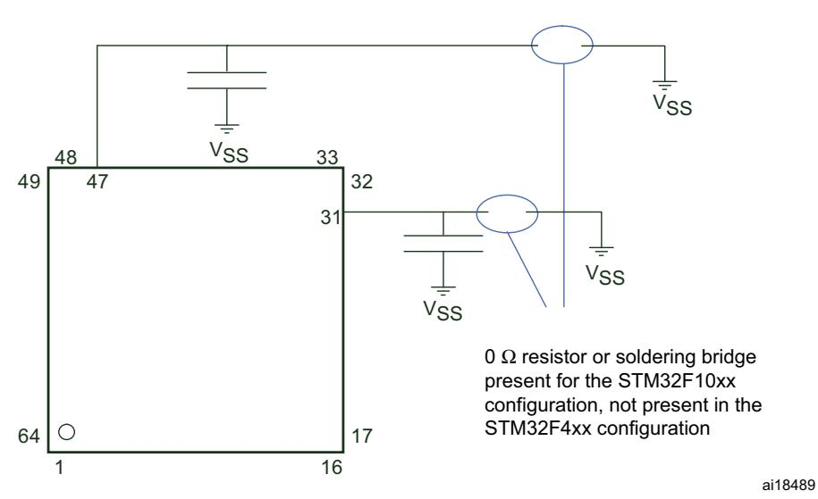

Figure 1. Compatible board design between STM32F10xx/STM32F40xxx for LQFP64

17/206

DS8626 Rev 12

Description

STM32F405xx, STM32F407xx

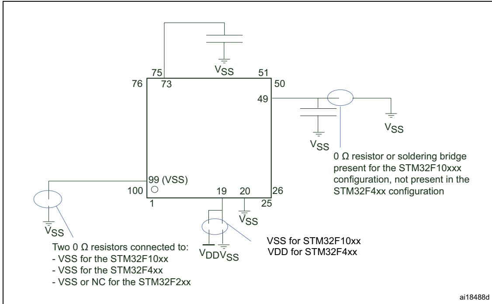

Figure 2. Compatible board design STM32F10xx/STM32F2/STM32F40xxx for LQFP100 package

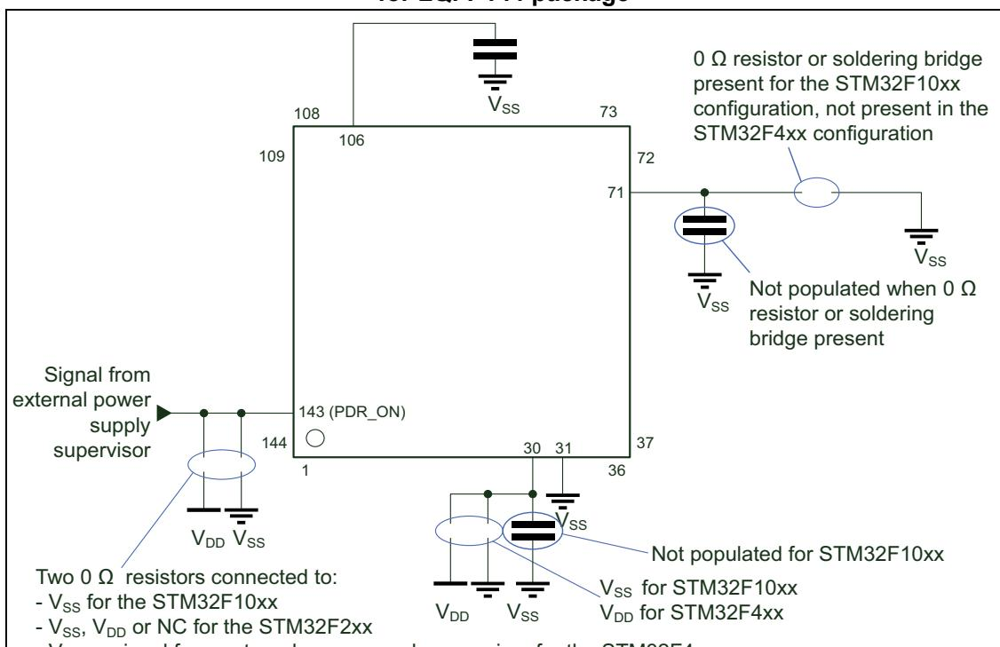

Figure 3. Compatible board design between STM32F10xx/STM32F2/STM32F40xxx for LQFP144 package

$- V _ { \mathsf { D D } }$ or signal from external power supply supervisor for the STM32F4xx

ai18487d|

18/206

DS8626 Rev 12

STM32F405xx, STM32F407xx

Description

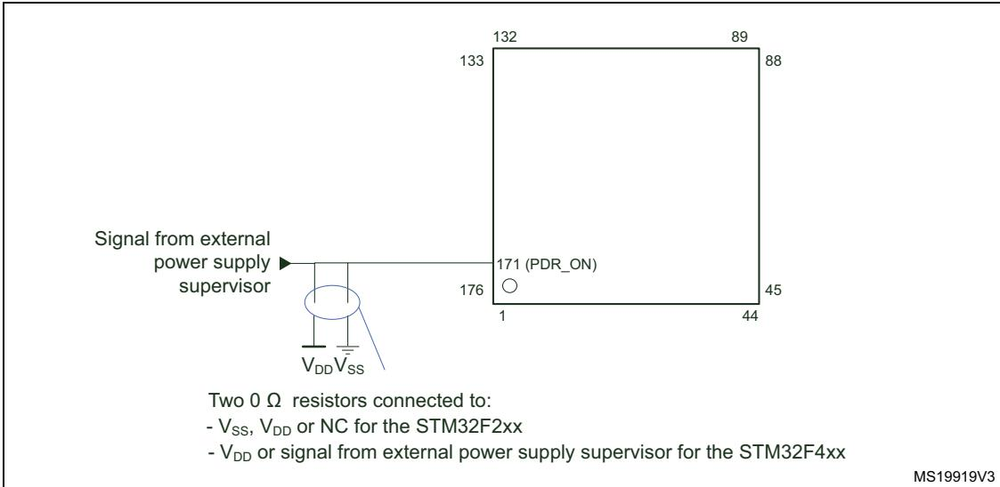

Figure 4. Compatible board design between STM32F2 and STM32F40xxx for LQFP176 and BGA176 packages

19/206

DS8626 Rev 12

Functional overview

STM32F405xx, STM32F407xx

## 3

## Functional overview

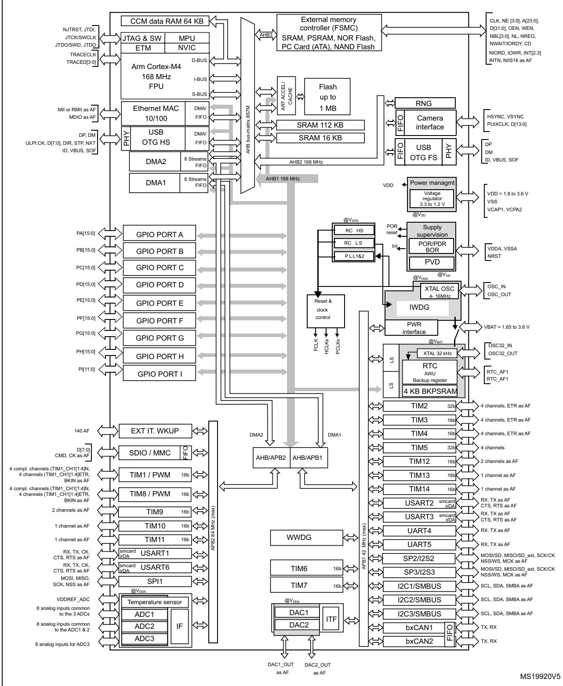

Figure 5. STM32F40xxx block diagram

1. The camera interface and ethernet are available only on STM32F407xx devices.

20/206

DS8626 Rev 12

STM32F405xx, STM32F407xx

Functional overview

## 3.1 Arm® Cortex®-M4 core with FPU and embedded flash and SRAM

The Arm Cortex-M4 processor with FPU is the latest generation of Arm processors for embedded systems. It was developed to provide a low-cost platform that meets the needs of MCU implementation, with a reduced pin count and low-power consumption, while delivering outstanding computational performance and an advanced response to interrupts

The Arm Cortex-M4 32-bit RISC processor with FPU features exceptional code-efficiency, delivering the high-performance expected from an Arm core in the memory size usually associated with 8- and 16-bit devices.

The processor supports a set of DSP instructions which allow efficient signal processing and complex algorithm execution.

Its single precision FPU (floating point unit) speeds up software development by using metalanguage development tools, while avoiding saturation.

The STM32F405xx and STM32F407xx family is compatible with all Arm tools and software.

Figure 5 shows the general block diagram of the STM32F40xxx family.

Note: Cortex-M4 with FPU is binary compatible with Cortex-M3.

## 3.2 Adaptive real-time memory accelerator (ART Accelerator)

The ART Accelerator is a memory accelerator which is optimized for STM32 industrystandard Arm® Cortex®-M4 with FPU processors. It balances the inherent performance advantage of the Arm Cortex-M4 with FPU over flash memory technologies, which normally requires the processor to wait for the flash memory at higher frequencies.

To release the processor full 210 DMiPS performance at this frequency, the accelerator implements an instruction prefetch queue and branch cache, which increases program execution speed from the 128-bit flash memory. Based on CoreMark benchmark, the performance achieved thanks to the ART accelerator is equivalent to 0 wait state program execution from flash memory at a CPU frequency up to 168 MHz.

## 3.3 Memory protection unit

The memory protection unit (MPU) is used to manage the CPU accesses to memory to prevent one task to accidentally corrupt the memory or resources used by any other active task. This memory area is organized into up to 8 protected areas that can in turn be divided up into 8 subareas. The protection area sizes are between 32 bytes and the whole 4 gigabytes of addressable memory.

The MPU is especially helpful for applications where some critical or certified code has to be protected against the misbehavior of other tasks. It is usually managed by an RTOS (realtime operating system). If a program accesses a memory location that is prohibited by the MPU, the RTOS can detect it and take action. In an RTOS environment, the kernel can dynamically update the MPU area setting, based on the process to be executed.

The MPU is optional and can be bypassed for applications that do not need it.

21/206

DS8626 Rev 12

Functional overview

STM32F405xx, STM32F407xx

## 3.4 Embedded flash memory

The STM32F40xxx devices embed a flash memory of 512 Kbytes or 1 Mbytes available for storing programs and data, plus 512 bytes of OTP memory.

## 3.5 CRC (cyclic redundancy check) calculation unit

The CRC (cyclic redundancy check) calculation unit is used to get a CRC code from a 32-bit data word and a fixed generator polynomial.

Among other applications, CRC-based techniques are used to verify data transmission or storage integrity. In the scope of the EN/IEC 60335-1 standard, they offer a means of verifying the flash memory integrity. The CRC calculation unit helps compute a software signature during runtime, to be compared with a reference signature generated at link-time and stored at a given memory location.

## 3.6 Embedded SRAM

All STM32F40xxx products embed:

Up to 192 Kbytes of system SRAM including 64 Kbytes of CCM (core coupled memory) data RAM

RAM memory is accessed (read/write) at CPU clock speed with 0 wait states.

• 4 Kbytes of backup SRAM

This area is accessible only from the CPU. Its content is protected against possible unwanted write accesses, and is retained in Standby or VBAT mode.

## 3.7 Multi-AHB bus matrix

The 32-bit multi-AHB bus matrix interconnects all the masters (CPU, DMAs, Ethernet, USB HS) and the slaves (flash memory, RAM, FSMC, AHB, and APB peripherals) and ensures a seamless and efficient operation even when several high-speed peripherals work simultaneously.

22/206

DS8626 Rev 12

STM32F405xx, STM32F407xx

Functional overview

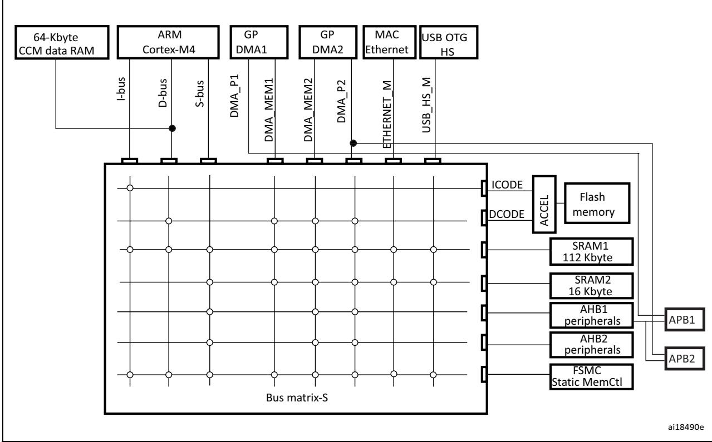

Figure 6. Multi-AHB matrix

## 3.8 DMA controller (DMA)

The devices feature two general-purpose dual-port DMAs (DMA1 and DMA2) with 8 streams each. They are able to manage memory-to-memory, peripheral-to-memory and memory-to-peripheral transfers. They feature dedicated FIFOs for APB/AHB peripherals, support burst transfer and are designed to provide the maximum peripheral bandwidth (AHB/APB).

The two DMA controllers support circular buffer management, so that no specific code is needed when the controller reaches the end of the buffer. The two DMA controllers also have a double buffering feature, which automates the use and switching of two memory buffers without requiring any special code.

Each stream is connected to dedicated hardware DMA requests, with support for software trigger on each stream. Configuration is made by software and transfer sizes between source and destination are independent.

23/206

DS8626 Rev 12

Functional overview

STM32F405xx, STM32F407xx

The DMA can be used with the main peripherals:

• SPI and I²S

• l²C

• USART

•General-purpose, basic and advanced-control timers TiMx

DAC

SDIO

• Camera interface (DCMI)

• ADC.

## 3.9 Flexible static memory controller (FSMC)

The FSMC is embedded in the STM32F405xx and STM32F407xx family. It has four Chip Select outputs supporting the following modes: PCCard/CompactFlash, SRAM, PSRAM, NOR flash and NAND flash.

Functionality overview:

Write FIFO

• Maximum FSMC\_CLK frequency for synchronous accesses is 60 MHz.

## 3.9.1 LCD parallel interface

The FSMC can be configured to interface seamlessly with most graphic LCD controllers. It supports the Intel 8080 and Motorola 6800 modes, and is flexible enough to adapt to specific LCD interfaces. This LCD parallel interface capability makes it easy to build costeffective graphic applications using LCD modules with embedded controllers or high performance solutions using external controllers with dedicated acceleration.

## 3.10Nested vectored interrupt controller (NVIC)

The STM32F405xx and STM32F407xx embed a nested vectored interrupt controller able to manage 16 priority levels, and handle up to 82 maskable interrupt channels plus the 16 interrupt lines of the Cortex®-M4 with FPU core.

• Closely coupled NVIC gives low-latency interrupt processing

•Interrupt entry vector table address passed directly to the core

• Allows early processing of interrupts

• Processing of late arriving, higher-priority interrupts

• Support tail chaining

• Processor state automatically saved

•Interrupt entry restored on interrupt exit with no instruction overhead

This hardware block provides flexible interrupt management features with minimum interrupt latency.

24/206

DS8626 Rev 12

STM32F405xx, STM32F407xx

Functional overview

## 3.11 External interrupt/event controller (EXTI)

The external interrupt/event controller consists of 23 edge-detector lines used to generate interrupt/event requests. Each line can be independently configured to select the trigger event (rising edge, falling edge, both) and can be masked independently. A pending register maintains the status of the interrupt requests. The EXTI can detect an external line with a pulse width shorter than the Internal APB2 clock period. Up to 140 GPIOs can be connected to the 16 external interrupt lines.

## 3.12 Clocks and startup

On reset the 16 MHz internal RC oscillator is selected as the default CPU clock. The 16 MHz internal RC oscillator is factory-trimmed to offer 1% accuracy over the full temperature range. The application can then select as system clock either the RC oscillator or an external 4-26 MHz clock source. This clock can be monitored for failure. If a failure is detected, the system automatically switches back to the internal RC oscillator and a software interrupt is generated (if enabled). This clock source is input to a PLL thus allowing to increase the frequency up to 168 MHz. Similarly, full interrupt management of the PLL clock entry is available when necessary (for example if an indirectly used external oscillator fails).

Several prescalers allow the configuration of the three AHB buses, the high-speed APB (APB2) and the low-speed APB (APB1) domains. The maximum frequency of the three AHB buses is 168 MHz while the maximum frequency of the high-speed APB domains is 84 MHz. The maximum allowed frequency of the low-speed APB domain is 42 MHz.

The devices embed a dedicated PLL (PLLI2S) which allows to achieve audio class performance. In this case, the $^ { 1 2 } \mathsf { S }$ master clock can generate all standard sampling frequencies from 8 kHz to 192 kHz.

## 3.13 Boot modes

At startup, boot pins are used to select one out of three boot options:

• Boot from user flash

• Boot from system memory

• Boot from embedded SRAM

The boot loader is located in system memory. It is used to reprogram the flash memory by using USART1 (PA9/PA10), USART3 (PC10/PC11 or PB10/PB11), CAN2 (PB5/PB13), USB OTG FS in Device mode (PA11/PA12) through DFU (device firmware upgrade).

## 3.14 Power supply schemes

$\mathsf { V } _ { \mathsf { D D } } = 1 . 8$ to 3.6 V: external power supply for l/Os and the internal regulator (when enabled), provided externally through $\mathsf { V } _ { \mathsf { D D } }$ pins.

$\mathsf { V } _ { \mathsf { S S A } } , \mathsf { V } _ { \mathsf { D D A } } = 1 . 8$ to 3.6 V: external analog power supplies for ADC, DAC, Reset blocks, RCs and PLL. $\mathsf { V } _ { \mathsf { D D A } }$ and $\mathsf { V } _ { \mathsf { S S A } }$ must be connected to $\mathsf { V } _ { \mathsf { D D } }$ and $\mathsf { V } _ { \mathsf { S S } }$ , respectively.

$\mathsf { V } _ { \mathsf { B A T } } = 1 . 6 5$ to 3.6 V: power supply for RTC, external clock 32 kHz oscillator and backup registers (through power switch) when $\mathsf { V } _ { \mathsf { D D } }$ is not present.

25/206

DS8626 Rev 12

Functional overview

STM32F405xx, STM32F407xx

Refer to Figure 21: Power supply scheme for more details.

Note: $V _ { D D } / V _ { D D A }$ minimum value of 1.7 V is obtained when the device operates in reduced temperature range, and with the use of an external power supply supervisor (refer to Section 3.15.2: Internal reset OFF).

Refer to Table 2 in order to identify the packages supporting this option.

## 3.15 Power supply supervisor

## 3.15.1Internal reset ON

On packages embedding the PDR\_ON pin, the power supply supervisor is enabled by holding PDR\_ON high. On all other packages, the power supply supervisor is always enabled.

The device has an integrated power-on reset (POR) / power-down reset (PDR) circuitry coupled with a Brownout reset (BOR) circuitry. At power-on, POR/PDR is always active and ensures proper operation starting from 1.8 V. After the 1.8 V POR threshold level is reached, the option byte loading process starts, either to confirm or modify default BOR threshold levels, or to disable BOR permanently. Three BOR thresholds are available through option bytes. The device remains in reset mode when $\mathsf { V } _ { \mathsf { D D } }$ is below a specified threshold, VpOR/PDR or $\mathsf { V } _ { \mathsf { B O R } }$ , without the need for an external reset circuit.

The device also features an embedded programmable voltage detector (PVD) that monitors the $\mathsf { V } _ { \mathsf { D D } } / \mathsf { V } _ { \mathsf { D D A } }$ power supply and compares it to the $\mathsf { V } _ { \mathsf { P V D } }$ threshold. An interrupt can be generated when $\mathsf { V } _ { \mathsf { D D } } / \mathsf { V } _ { \mathsf { D D A } }$ drops below the $\mathsf { V } _ { \mathsf { P V D } }$ threshold and/or when $\mathsf { V } _ { \mathsf { D D } } / \mathsf { V } _ { \mathsf { D D A } }$ is higher than the $\mathsf { V } _ { \mathsf { P V D } }$ threshold. The interrupt service routine can then generate a warning message and/or put the MCU into a safe state. The PVD is enabled by software.

## 3.15.2 Internal reset OFF

This feature is available only on packages featuring the PDR\_ON pin. The internal power-on reset (POR) / power-down reset (PDR) circuitry is disabled with the PDR\_ON pin.

An external power supply supervisor should monitor $\mathsf { V } _ { \mathsf { D D } }$ and should maintain the device in reset mode as long as $\mathsf { V } _ { \mathsf { D D } }$ is below a specified threshold. PDR\_ON should be connected to this external power supply supervisor. Refer to Figure 7: Power supply supervisor interconnection with internal reset OFF.

26/206

DS8626 Rev 12

STM32F405xx, STM32F407xx

Functional overview

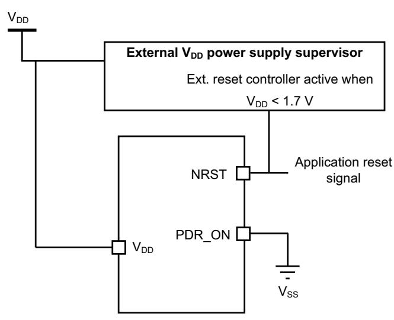

Figure 7. Power supply supervisor interconnection with internal reset OFF

1. PDR = 1.7 V for reduce temperature range; PDR = 1.8 V for all temperature range.

The $\mathsf { V } _ { \mathsf { D D } }$ specified threshold, below which the device must be maintained under reset, is 1.8 V (see Figure 7). This supply voltage can drop to 1.7 V when the device operates in the 0 to $7 0 ~ ^ { \circ } \mathrm { C }$ temperature range.

A comprehensive set of power-saving mode allows to design low-power applications.

When the internal reset is OFF, the following integrated features are no more supported:

• The integrated power-on reset $\left( \mathsf { P O R } \right) I$ power-down reset (PDR) circuitry is disabled

• The brownout reset (BOR) circuitry is disabled

•The embedded programmable voltage detector (PVD) is disabled

$\mathsf { V } _ { \mathsf { B A T } }$ functionality is no more available and $\mathsf { V } _ { \mathsf { B A T } }$ pin should be connected to $\mathsf { V } _ { \mathsf { D D } }$ All packages, except for the LQFP64 and $\mathsf { L Q F P 1 0 0 }$ , allow to disable the internal reset through the PDR\_ON signal.

27/206

DS8626 Rev 12

Functional overview

STM32F405xx, STM32F407xx

Figure 8. PDR\_ON and NRST control with internal reset OFF

1. PDR = 1.7 V for reduce temperature range; PDR = 1.8 V for all temperature range.

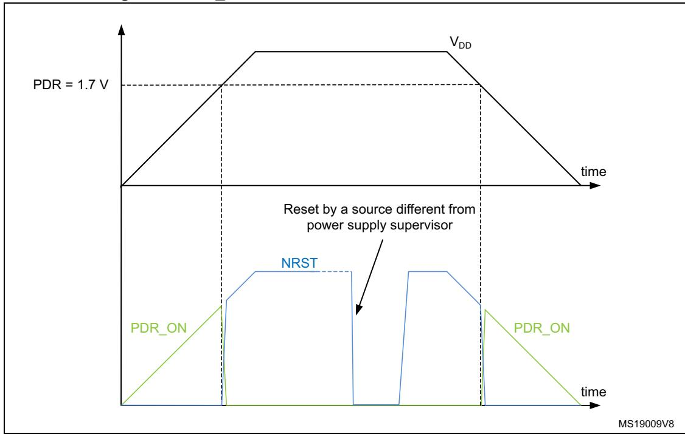

## 3.16Voltage regulator

The regulator has four operating modes:

• Regulator ON

– Main regulator mode (MR)

– Low-power regulator (LPR)

\- Power-down

• Regulator OFF

## 3.16.1 Regulator ON

On packages embedding the BYPASS\_REG pin, the regulator is enabled by holding BYPASS\_REG low. On all other packages, the regulator is always enabled.

There are three power modes configured by software when regulator is ON:

MR is used in the nominal regulation mode (With different voltage scaling in Run) In Main regulator mode (MR mode), different voltage scaling are provided to reach the best compromise between maximum frequency and dynamic power consumption. Refer to Table 14: General operating conditions.

• LPR is used in the Stop modes

The LP regulator mode is configured by software when entering Stop mode.

• Power-down is used in Standby mode.

The Power-down mode is activated only when entering in Standby mode. The regulator output is in high impedance and the kernel circuitry is powered down, inducing zero consumption. The contents of the registers and SRAM are lost)

28/206

DS8626 Rev 12

STM32F405xx, STM32F407xx

Functional overview

Two external ceramic capacitors should be connected on $\mathsf { V } _ { \mathsf { C A P \_ 1 } } \& \mathsf { V } _ { \mathsf { C A P \_ 2 } }$ pin. Refer to Figure 21: Power supply scheme and Figure 16: VCAP\_1/VCAP\_2 operating conditions

All packages have regulator ON feature.

## 3.16.2 Regulator OFF

This feature is available only on packages featuring the BYPASS\_REG pin. The regulator is disabled by holding BYPASS\_REG high. The regulator OFF mode allows to supply externally $\mathsf { a } \mathsf { V } _ { 1 2 }$ voltage source through $\mathsf { V } _ { \mathsf { C A P \_ 1 } }$ and $\mathsf { V } _ { \mathsf { C A P \_ 2 } } \mathsf { p i n s }$

Since the internal voltage scaling is not manage internally, the external voltage value must be aligned with the targeted maximum frequency. Refer to Table 14: General operating conditions.

The two 2.2 μF ceramic capacitors should be replaced by two 100 nF decoupling capacitors.

## Refer to Figure 21: Power supply scheme

When the regulator is OFF, there is no more internal monitoring on $\mathsf { V } _ { 1 2 }$ An external power supply supervisor should be used to monitor the $\forall _ { 1 2 }$ of the logic power domain. PA0 pin should be used for this purpose, and act as power-on reset on $\forall _ { 1 2 }$ power domain.

In regulator OFF mode the following features are no more supported:

PA0 cannot be used as a GPlO pin since it allows to reset a part of the $\forall _ { 1 2 }$ logic power domain which is not reset by the NRST pin.

As long as PA0 is kept low, the debug mode cannot be used under power-on reset. As a consequence, PA0 and NRST pins must be managed separately if the debug connection under reset or pre-reset is required.

•The standby mode is not available

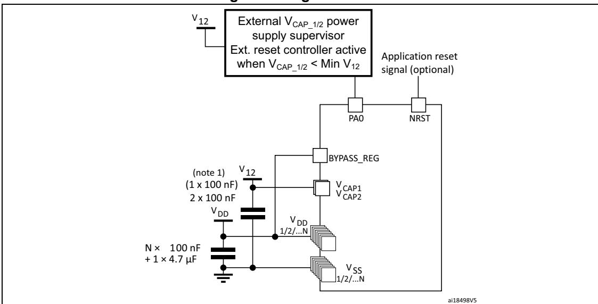

Figure 9. Regulator OFF

29/206

DS8626 Rev 12

Note:

Functional overview

STM32F405xx, STM32F407xx

The following conditions must be respected:

$\mathsf { V } _ { \mathsf { D D } }$ should always be higher than $\mathsf { V } _ { \mathsf { C A P \_ 1 } }$ and $\mathsf { V } _ { \mathsf { C A P } \_ 2 }$ to avoid current injection between power domains.

If the time for $\mathsf { V } _ { \mathsf { C A P } }  { 1 }$ and ${ \mathsf { V } } _ { \mathsf { C A P } } \ _ { 2 }$ to reach $\forall _ { 1 2 }$ minimum value is faster than the time for $\mathsf { V } _ { \mathsf { D D } }$ to reach $1 . 8 \ V ,$ then PA0 should be kept low to cover both conditions: until $\mathsf { V } _ { \mathsf { C A P \_ 1 } }$ and $\mathsf { V } _ { \mathsf { C A P } \_ 2 }$ reach $\forall _ { 1 2 }$ minimum value and until $\mathsf { V } _ { \mathsf { D D } }$ reaches 1.8 V (see Figure 10).

Otherwise, if the time for $\mathsf { V } _ { \mathsf { C A P \_ 1 } }$ and ${ \mathsf { V } } _ { \mathsf { C A P } } \ _ { 2 }$ to reach $\forall _ { 1 2 }$ minimum value is slower than the time for $\mathsf { V } _ { \mathsf { D D } }$ to reach 1.8 V, then PA0 could be asserted low externally (see Figure 11).

$\mathsf { I f } \mathsf { V } _ { \mathsf { C A P } } \mathsf { \Omega } _ { 1 }$ and $\mathsf { V } _ { \mathsf { C A P \_ 2 9 0 } }$ below $\forall _ { 1 2 }$ minimum value and $\mathsf { V } _ { \mathsf { D D } }$ is higher than 1.8 V, then a reset must be assērted on PA0 pin.

The minimum value of $\forall _ { 1 2 }$ depends on the maximum frequency targeted in the application (see Table 14: General operating conditions).

Figure 10. Startup in regulator OFF mode: slow $\mathsf { v } _ { \mathsf { D D } }$ slope - power-down reset risen after $\mathsf { V } _ { \mathsf { C A P } \ 1 } N _ { \mathsf { C A P } \ 2 }$ stabilization

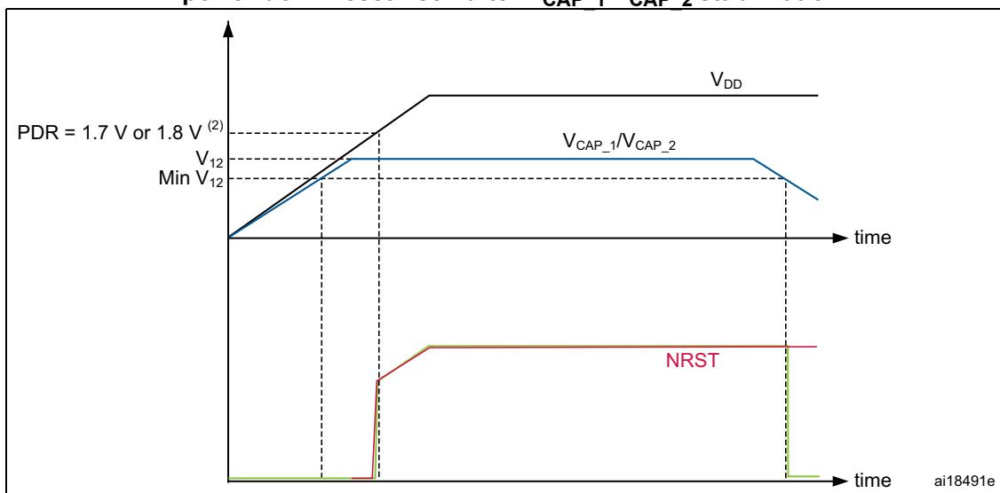

1. This figure is valid both whatever the internal reset mode (ON or OFF).

2. $\mathsf { P D R } = 1 . 7 \ : \mathsf { V }$ for reduced temperature range; ${ \mathsf { P D R } } = 1 . 8 { \mathsf { V } }$ for all temperature ranges.

30/206

DS8626 Rev 12

STM32F405xx, STM32F407xx

Functional overview

Figure 11. Startup in regulator OFF mode: fast $\mathsf { v } _ { \mathsf { D D } }$ slope - power-down reset risen before $\mathsf { v } _ { \mathsf { c A P } \ 1 } N _ { \mathsf { c A P } }$ 2 stabilization

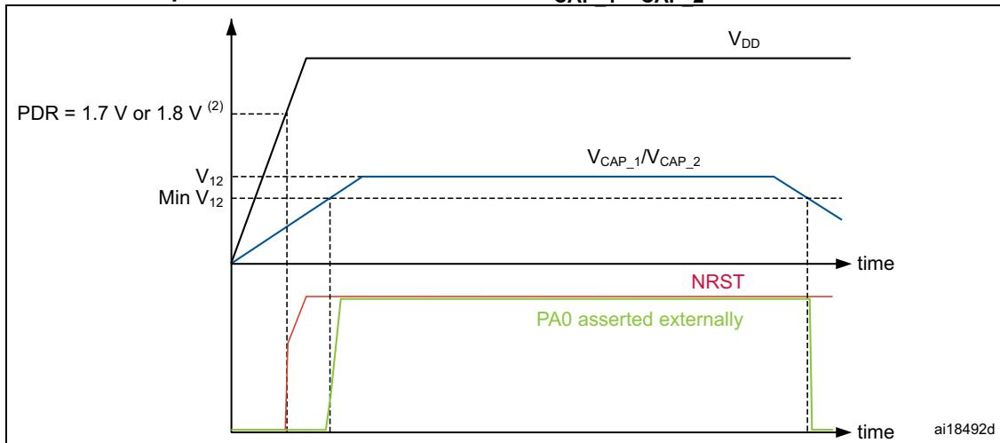

1. This figure is valid both whatever the internal reset mode (ON or OFF).

2. PDR = 1.7 V for a reduced temperature range; PDR = 1.8 V for all temperature ranges.

## 3.17 Regulator ON/OFF and internal reset ON/OFF availability

Table 3. Regulator ON/OFF and internal reset ON/OFF availability

<table><tr><td rowspan=1 colspan=1></td><td rowspan=1 colspan=1>Regulator ON</td><td rowspan=1 colspan=1>Regulator OFF</td><td rowspan=1 colspan=1>Internal reset ON</td><td rowspan=1 colspan=1>Internal resetOFF</td></tr><tr><td rowspan=1 colspan=1>LQFP64LQFP100</td><td rowspan=2 colspan=1>Yes</td><td rowspan=2 colspan=1>No</td><td rowspan=1 colspan=1>Yes</td><td rowspan=1 colspan=1>No</td></tr><tr><td rowspan=1 colspan=1>LQFP144</td><td rowspan=2 colspan=1>YesPDR_ON set to<eq>\mathsf { V } _ { \mathsf { D D } }</eq></td><td rowspan=2 colspan=1>YesPDR_ONconnected to anexternal powersupply supervisor</td></tr><tr><td rowspan=1 colspan=1>WLCSP90UFBGA176LQFP176</td><td rowspan=1 colspan=1>YesBYPASS_REG setto V_ss</td><td rowspan=1 colspan=1>YesBYPASS_REG setto VDD</td></tr></table>

## 3.18 Real-time clock (RTC), backup SRAM and backup registers

The backup domain of the STM32F405xx and STM32F407xx includes:

• The real-time clock (RTC)

• 4 Kbytes of backup SRAM

• 20 backup registers

The real-time clock (RTC) is an independent BCD timer/counter. Dedicated registers contain the second, minute, hour (in 12/24 hour), week day, date, month, year, in BCD (binarycoded decimal) format. Correction for 28, 29 (leap year), 30, and 31 day of the month are performed automatically. The RTC provides a programmable alarm and programmable periodic interrupts with wakeup from Stop and Standby modes. The sub-seconds value is also available in binary format.

It is clocked by a 32.768 kHz external crystal, resonator or oscillator, the internal low-power RC oscillator or the high-speed external clock divided by 2 to 31. The internal low-speed RC has a typical frequency of 32 kHz. The RTC can be calibrated using an external 512 Hz output to compensate for any natural quartz deviation.

31/206

DS8626 Rev 12

Functional overview

STM32F405xx, STM32F407xx

Two alarm registers are used to generate an alarm at a specific time and calendar fields can be independently masked for alarm comparison. To generate a periodic interrupt, a 16-bit programmable binary auto-reload downcounter with programmable resolution is available and allows automatic wakeup and periodic alarms from every 120 μs to every 36 hours.

A 20-bit prescaler is used for the time base clock. It is by default configured to generate a time base of 1 second from a clock at 32.768 kHz.

The 4-Kbyte backup SRAM is an EEPROM-like memory area. It can be used to store data which need to be retained in $\mathsf { V } _ { \mathsf { B A T } }$ and standby mode. This memory area is disabled by default to minimize power consumption (see Section 3.19: Low-power modes). It can be enabled by software.

The backup registers are 32-bit registers used to store 80 bytes of user application data when $\mathsf { V } _ { \mathsf { D D } }$ power is not present. Backup registers are not reset by a system, a power reset, or when the device wakes up from the Standby mode (see Section 3.19: Low-power modes).

Additional 32-bit registers contain the programmable alarm subseconds, seconds, minutes, hours, day, and date.

Like backup SRAM, the RTC and backup registers are supplied through a switch that is powered either from the $\mathsf { V } _ { \mathsf { D D } }$ supply when present or from the $\mathsf { V } _ { \mathsf { B A T } } \mathsf { p i n }$

## 3.19 Low-power modes

The STM32F405xx and STM32F407xx support three low-power modes to achieve the best compromise between low-power consumption, short startup time and available wakeup sources:

## • Sleep mode

In Sleep mode, only the CPU is stopped. All peripherals continue to operate and can wake up the CPU when an interrupt/event occurs.

## • Stop mode

The Stop mode achieves the lowest power consumption while retaining the contents of SRAM and registers. All clocks in the $\vee _ { 1 2 }$ domain are stopped, the PLL, the HSI RC and the HSE crystal oscillators are disabled. The voltage regulator can also be put either in normal or in low-power mode.

The device can be woken up from the Stop mode by any of the EXTI line (the EXTI line source can be one of the 16 external lines, the PVD output, the RTC alarm / wakeup / tamper / time stamp events, the USB OTG FS/HS wakeup or the Ethernet wakeup).

## • Standby mode

The Standby mode is used to achieve the lowest power consumption. The internal voltage regulator is switched off so that the entire $\forall _ { 1 2 }$ domain is powered off. The PLL, the HSI RC and the HSE crystal oscillators are also switched off. After entering

32/206

DS8626 Rev 12

STM32F405xx, STM32F407xx

Functional overview

Standby mode, the SRAM and register contents are lost except for registers in the backup domain and the backup SRAM when selected.

The device exits the Standby mode when an external reset (NRST pin), an IWDG reset, a rising edge on the WKUP pin, or an RTC alarm / wakeup / tamper /time stamp event occurs.

The standby mode is not supported when the embedded voltage regulator is bypassed and the $\forall _ { 1 2 }$ domain is controlled by an external power.

## 3.20 VBAT operation

The $\mathsf { V } _ { \mathsf { B A T } }$ pin allows to power the device $\mathsf { V } _ { \mathsf { B A T } }$ domain from an external battery, an external supercapacitor, or from $\mathsf { V } _ { \mathsf { D D } }$ when no external battery and an external supercapacitor are present.

$\mathsf { V } _ { \mathsf { B A T } }$ operation is activated when $\mathsf { V } _ { \mathsf { D D } }$ is not present.

The $\mathsf { V } _ { \mathsf { B A T } }$ pin supplies the RTC, the backup registers and the backup SRAM.

Note: When the microcontroller is supplied from $V _ { B A T } ,$ external interrupts and RTC alarm/events do not exit it from $V _ { B A T }$ operation.

When PDR\_ON pin is not connected to $V _ { D D }$ (internal reset OFF), the $V _ { B A T }$ functionality is no more available and $V _ { B A T }$ pin should be connected to $V _ { D D }$

## 3.21 Timers and watchdogs

The STM32F405xx and STM32F407xx devices include two advanced-control timers, eight general-purpose timers, two basic timers and two watchdog timers.

All timer counters can be frozen in debug mode.

Table 4 compares the features of the advanced-control, general-purpose and basic timers.

Table 4. Timer feature comparison

<table><tr><td colspan="1" rowspan="1">Timertype</td><td colspan="1" rowspan="1">Timer</td><td colspan="1" rowspan="1">Counterresolution</td><td colspan="1" rowspan="1">Countertype</td><td colspan="1" rowspan="1">Prescalerfactor</td><td colspan="1" rowspan="1">DMArequestgeneration</td><td colspan="1" rowspan="1">Capturelcomparechannels</td><td colspan="1" rowspan="1">Complemen-tary output</td><td colspan="1" rowspan="1">Maxinterfaceclock(MHz)</td><td colspan="1" rowspan="1">Maxtimerclock(MHz)</td></tr><tr><td colspan="1" rowspan="1">Advanced-control</td><td colspan="1" rowspan="1">TIM1,TIM8</td><td colspan="1" rowspan="1">16-bit</td><td colspan="1" rowspan="1">Up,Down,Up/down</td><td colspan="1" rowspan="1">Anyintegerbetween 1and 65536</td><td colspan="1" rowspan="1">Yes</td><td colspan="1" rowspan="1">4</td><td colspan="1" rowspan="1">Yes</td><td colspan="1" rowspan="1">84</td><td colspan="1" rowspan="1">168</td></tr><tr><td colspan="1" rowspan="6">Generalpurpose</td><td colspan="1" rowspan="1">TIM2,TIM5</td><td colspan="1" rowspan="1">32-bit</td><td colspan="1" rowspan="1">Up,Down,Up/down</td><td colspan="1" rowspan="1">Anyintegerbetween 1and 65536</td><td colspan="1" rowspan="1">Yes</td><td colspan="1" rowspan="1">4</td><td colspan="1" rowspan="1">No</td><td colspan="1" rowspan="1">42</td><td colspan="1" rowspan="1">84</td></tr><tr><td colspan="1" rowspan="1">TIM3,TIM4</td><td colspan="1" rowspan="1">16-bit</td><td colspan="1" rowspan="1">Up,Down,Up/down</td><td colspan="1" rowspan="1">Anyintegerbetween 1and 65536</td><td colspan="1" rowspan="1">Yes</td><td colspan="1" rowspan="1">4</td><td colspan="1" rowspan="1">No</td><td colspan="1" rowspan="1">42</td><td colspan="1" rowspan="1">84</td></tr><tr><td colspan="1" rowspan="1">TIM9</td><td colspan="1" rowspan="1">16-bit</td><td colspan="1" rowspan="1">Up</td><td colspan="1" rowspan="1">Anyintegerbetween 1and 65536</td><td colspan="1" rowspan="1">No</td><td colspan="1" rowspan="1">2</td><td colspan="1" rowspan="1">No</td><td colspan="1" rowspan="1">84</td><td colspan="1" rowspan="1">168</td></tr><tr><td colspan="1" rowspan="1">TIM10TIM11</td><td colspan="1" rowspan="1">16-bit</td><td colspan="1" rowspan="1">Up</td><td colspan="1" rowspan="1">Anyintegerbetween 1and 65536</td><td colspan="1" rowspan="1">No</td><td colspan="1" rowspan="1">1</td><td colspan="1" rowspan="1">No</td><td colspan="1" rowspan="1">84</td><td colspan="1" rowspan="1">168</td></tr><tr><td colspan="1" rowspan="1">TIM12</td><td colspan="1" rowspan="1">16-bit</td><td colspan="1" rowspan="1">Up</td><td colspan="1" rowspan="1">Anyintegerbetween 1and 65536</td><td colspan="1" rowspan="1">No</td><td colspan="1" rowspan="1">2</td><td colspan="1" rowspan="1">No</td><td colspan="1" rowspan="1">42</td><td colspan="1" rowspan="1">84</td></tr><tr><td colspan="1" rowspan="1">TIM13TIM14</td><td colspan="1" rowspan="1">16-bit</td><td colspan="1" rowspan="1">Up</td><td colspan="1" rowspan="1">Anyintegerbetween 1and 65536</td><td colspan="1" rowspan="1">No</td><td colspan="1" rowspan="1">1</td><td colspan="1" rowspan="1">No</td><td colspan="1" rowspan="1">42</td><td colspan="1" rowspan="1">84</td></tr><tr><td colspan="1" rowspan="1">Basic</td><td colspan="1" rowspan="1">TIM6,TIM7</td><td colspan="1" rowspan="1">16-bit</td><td colspan="1" rowspan="1">Up</td><td colspan="1" rowspan="1">Anyintegerbetween 1and 65536</td><td colspan="1" rowspan="1">Yes</td><td colspan="1" rowspan="1">0</td><td colspan="1" rowspan="1">No</td><td colspan="1" rowspan="1">42</td><td colspan="1" rowspan="1">84</td></tr></table>

33/206

DS8626 Rev 12

Functional overview

STM32F405xx, STM32F407xx

## 3.21.1 Advanced-control timers (TIM1, TIM8)

The advanced-control timers (TIM1, TIM8) can be seen as three-phase PWM generators multiplexed on 6 channels. They have complementary PWM outputs with programmable inserted dead times. They can also be considered as complete general-purpose timers. Their 4 independent channels can be used for:

• Input capture

• Output compare

• PWM generation (edge- or center-aligned modes)

• One-pulse mode output

If configured as standard 16-bit timers, they have the same features as the general-purpose TIMx timers. If configured as 16-bit PWM generators, they have full modulation capability (0- 100%).

The advanced-control timer can work together with the TiMx timers via the Timer Link feature for synchronization or event chaining.

TIM1 and TIM8 support independent DMA request generation.

34/206

DS8626 Rev 12

STM32F405xx, STM32F407xx

Functional overview

## 3.21.2General-purpose timers (TIMx)

There are ten synchronizable general-purpose timers embedded in the STM32F40xxx devices (see Table 4 for differences).

## • TIM2, TIM3, TIM4, TIM5

The STM32F40xxx include 4 full-featured general-purpose timers: TIM2, TIM5, TIM3, and TIM4.The TIM2 and TIM5 timers are based on a 32-bit auto-reload up/downcounter and a 16-bit prescaler. The TIM3 and TIM4 timers are based on a 16- bit auto-reload up/downcounter and a 16-bit prescaler. They all feature 4 independent channels for input capture/output compare, PWM or one-pulse mode output. This gives up to 16 input capture/output compare/PWMs on the largest packages.

The TIM2, TIM3, TIM4, TIM5 general-purpose timers can work together, or with the other general-purpose timers and the advanced-control timers TIM1 and TIM8 via the Timer Link feature for synchronization or event chaining.

Any of these general-purpose timers can be used to generate PWM outputs.

TIM2, TIM3, TIM4, TIM5 all have independent DMA request generation. They are capable of handling quadrature (incremental) encoder signals and the digital outputs from 1 to 4 hall-effect sensors.

## • TIM9, TIM10, TIM11, TIM12, TIM13, and TIM14

These timers are based on a 16-bit auto-reload upcounter and a 16-bit prescaler. TIM10, TIM11, TIM13, and TIM14 feature one independent channel, whereas TIM9 and TIM12 have two independent channels for input capture/output compare, PWM or one-pulse mode output. They can be synchronized with the TIM2, TIM3, TIM4, TIM5 full-featured general-purpose timers. They can also be used as simple time bases.

## 3.21.3Basic timers TIM6 and TIM7

These timers are mainly used for DAC trigger and waveform generation. They can also be used as a generic 16-bit time base.

TIM6 and TIM7 support independent DMA request generation.

## Independent watchdog

The independent watchdog is based on a 12-bit downcounter and 8-bit prescaler. It is clocked from an independent 32 kHz internal RC and as it operates independently from the main clock, it can operate in Stop and Standby modes. It can be used either as a watchdog to reset the device when a problem occurs, or as a free-running timer for application timeout management. It is hardware- or software-configurable through the option bytes.

## Window watchdog

The window watchdog is based on a 7-bit downcounter that can be set as free-running. It can be used as a watchdog to reset the device when a problem occurs. It is clocked from the main clock. It has an early warning interrupt capability and the counter can be frozen in debug mode.

35/206

DS8626 Rev 12

Functional overview

STM32F405xx, STM32F407xx

## SysTick timer

This timer is dedicated to real-time operating systems, but could also be used as a standard downcounter. It features:

• A 24-bit downcounter

• Autoreload capability

•Maskable system interrupt generation when the counter reaches 0

• Programmable clock source.

## 3.22 Inter-integrated circuit interface (l²C)

Up to three l²C bus interfaces can operate in multimaster and slave modes. They can support the Standard-mode (up to 100 kHz) and Fast-mode (up to 400 kHz). They support the 7/10-bit addressing mode and the 7-bit dual addressing mode (as slave). A hardware CRC generation/verification is embedded.

They can be served by DMA and they support SMBus 2.0/PMBus.

## 3.23 Universal synchronous/asynchronous receiver transmitters (USART)

The STM32F405xx and STM32F407xx embed four universal synchronous/asynchronous receiver transmitters (USART1, USART2, USART3 and USART6) and two universal asynchronous receiver transmitters (UART4 and UART5).

These six interfaces provide asynchronous communication, IrDA SIR ENDEC support, multiprocessor communication mode, single-wire half-duplex communication mode and have LIN Master/Slave capability. The USART1 and USART6 interfaces are able to communicate at speeds of up to 10.5 Mbit/s. The other available interfaces communicate at up to 5.25 Mbit/s.

USART1, USART2, USART3 and USART6 also provide hardware management of the CTS and RTS signals, Smart Card mode (ISO 7816 compliant) and SPI-like communication capability. All interfaces can be served by the DMA controller.

36/206

DS8626 Rev 12

STM32F405xx, STM32F407xx

Functional overview

Table 5. USART feature comparison

<table><tr><td rowspan=1 colspan=1>USARTname</td><td rowspan=1 colspan=1>Standardfeatures</td><td rowspan=1 colspan=1>Modem(RTS/CTS)</td><td rowspan=1 colspan=1>LIN</td><td rowspan=1 colspan=1>SPImaster</td><td rowspan=1 colspan=1>irDA</td><td rowspan=1 colspan=1>Smartcard(ISO 7816)</td><td rowspan=1 colspan=1>Max. baud ratein Mbit/s(oversamplingby 16)</td><td rowspan=1 colspan=1>Max. baud ratein Mbit/s(oversamplingby 8)</td><td rowspan=1 colspan=1>APBmapping</td></tr><tr><td rowspan=1 colspan=1>USART1</td><td rowspan=1 colspan=1>X</td><td rowspan=1 colspan=1>X</td><td rowspan=1 colspan=1>X</td><td rowspan=1 colspan=1>X</td><td rowspan=1 colspan=1>X</td><td rowspan=1 colspan=1>X</td><td rowspan=1 colspan=1>5.25</td><td rowspan=1 colspan=1>10.5</td><td rowspan=1 colspan=1>APB2(max.84 MHz)</td></tr><tr><td rowspan=1 colspan=1>USART2</td><td rowspan=1 colspan=1>X</td><td rowspan=1 colspan=1>X</td><td rowspan=1 colspan=1>X</td><td rowspan=1 colspan=1>X</td><td rowspan=1 colspan=1>X</td><td rowspan=1 colspan=1>X</td><td rowspan=1 colspan=1>2.62</td><td rowspan=1 colspan=1>5.25</td><td rowspan=1 colspan=1>APB1(max.42 MHz)</td></tr><tr><td rowspan=1 colspan=1>USART3</td><td rowspan=1 colspan=1>X</td><td rowspan=1 colspan=1>X</td><td rowspan=1 colspan=1>X</td><td rowspan=1 colspan=1>X</td><td rowspan=1 colspan=1>X</td><td rowspan=1 colspan=1>X</td><td rowspan=1 colspan=1>2.62</td><td rowspan=1 colspan=1>5.25</td><td rowspan=1 colspan=1>APB1(max.42 MHz)</td></tr><tr><td rowspan=1 colspan=1>UART4</td><td rowspan=1 colspan=1>X</td><td rowspan=1 colspan=1></td><td rowspan=1 colspan=1>X</td><td rowspan=1 colspan=1></td><td rowspan=1 colspan=1>X</td><td rowspan=1 colspan=1></td><td rowspan=1 colspan=1>2.62</td><td rowspan=1 colspan=1>5.25</td><td rowspan=1 colspan=1>APB1(max.42 MHz)</td></tr><tr><td rowspan=1 colspan=1>UART5</td><td rowspan=1 colspan=1>X</td><td rowspan=1 colspan=1></td><td rowspan=1 colspan=1>X</td><td rowspan=1 colspan=1></td><td rowspan=1 colspan=1>X</td><td rowspan=1 colspan=1></td><td rowspan=1 colspan=1>2.62</td><td rowspan=1 colspan=1>5.25</td><td rowspan=1 colspan=1>APB1(max.42 MHz)</td></tr><tr><td rowspan=1 colspan=1>USART6</td><td rowspan=1 colspan=1>X</td><td rowspan=1 colspan=1>X</td><td rowspan=1 colspan=1>X</td><td rowspan=1 colspan=1>X</td><td rowspan=1 colspan=1>X</td><td rowspan=1 colspan=1>X</td><td rowspan=1 colspan=1>5.25</td><td rowspan=1 colspan=1>10.5</td><td rowspan=1 colspan=1>APB2(max.84 MHz)</td></tr></table>

## 3.24Serial peripheral interface (SPI)

The STM32F40xxx feature up to three SPIs in slave and master modes in full-duplex and simplex communication modes. SPI1 can communicate at up to 42 Mbits/s, SPI2 and SPI3 can communicate at up to 21 Mbit/s. The 3-bit prescaler gives 8 master mode frequencies and the frame is configurable to 8 bits or 16 bits. The hardware CRC generation/verification supports basic SD Card/MMC modes. All SPIs can be served by the DMA controller.

The SPI interface can be configured to operate in TI mode for communications in master mode and slave mode.

## 3.25Inter-integrated sound (I²S)

Two standard I²S interfaces (multiplexed with SPI2 and SPI3) are available. They can be operated in master or slave mode, in full duplex and half-duplex communication modes, and can be configured to operate with a 16-/32-bit resolution as an input or output channel. Audio sampling frequencies from 8 kHz up to 192 kHz are supported. When either or both of the l²S interfaces is/are configured in master mode, the master clock can be output to the external DAC/CODEC at 256 times the sampling frequency.

All I²Sx can be served by the DMA controller.

37/206

DS8626 Rev 12

Functional overview

STM32F405xx, STM32F407xx

## 3.26 Audio PLL (PLLI2S)

The devices feature an additional dedicated PLL for audio ${ \mathsf { I } } ^ { 2 } { \mathsf { S } }$ application. It allows to achieve error-free ${ \mathsf { I } } ^ { 2 } { \mathsf { S } }$ sampling clock accuracy without compromising on the CPU performance, while using USB peripherals.

The PLLi2S configuration can be modified to manage an $^ { 1 2 } \mathsf { S }$ sample rate change without disabling the main PLL (PLL) used for CPU, USB and Ethernet interfaces.

The audio PLL can be programmed with very low error to obtain sampling rates ranging from 8 KHz to 192 KHz.

In addition to the audio PLL, a master clock input pin can be used to synchronize the $^ { 1 2 } \mathsf { S }$ flow with an external PLL (or Codec output)

## 3.27 Secure digital input/output interface (SDIO)

An SD/SDIO/MMC host interface is available, that supports MultiMediaCard System Specification Version 4.2 in three different databus modes: 1-bit (default), 4-bit and 8-bit.

The interface allows data transfer at up to 48 MHz, and is compliant with the SD Memory Card Specification Version 2.0.

The SDIO Card Specification Version 2.0 is also supported with two different databus modes: 1-bit (default) and 4-bit.

The current version supports only one SD/SDIO/MMC4.2 card at any one time and a stack of MMC4.1 or previous.

In addition to SD/SDIO/MMC, this interface is fully compliant with the CE-ATA digital protocol Rev1.1.

## 3.28 Ethernet MAC interface with dedicated DMA and IEEE 1588 support

Peripheral available only on the STM32F407xx devices.

The STM32F407xx devices provide an IEEE-802.3-2002-compliant media access controller (MAC) for ethernet LAN communications through an industry-standard mediumindependent interface (MII) or a reduced medium-independent interface (RMIl). The STM32F407xx requires an external physical interface device (PHY) to connect to the physical LAN bus (twisted-pair, fiber, etc.). the PHY is connected to the STM32F407xx MII port using 17 signals for MIl or 9 signals for RMIl, and can be clocked using the 25 MHz (MII) from the STM32F407xx.

38/206

DS8626 Rev 12

STM32F405xx, STM32F407xx

Functional overview

The STM32F407xx includes the following features:

•Supports 10 and 100 Mbit/s rates

Dedicated DMA controller allowing high-speed transfers between the dedicated SRAM and the descriptors (see the STM32F40xxx/41xxx reference manual for details)

• Tagged MAC frame support (VLAN support)

• Half-duplex (CSMA/CD) and full-duplex operation

• MAC control sublayer (control frames) support

• 32-bit CRC generation and removal

Several address filtering modes for physical and multicast address (multicast and group addresses)

•32-bit status code for each transmitted or received frame

Internal FIFOs to buffer transmit and receive frames. The transmit FIFO and the receive FIFO are both 2 Kbytes.

Supports hardware PTP (precision time protocol) in accordance with IEEE 1588 2008 (PTP V2) with the time stamp comparator connected to the TIM2 input

•Triggers interrupt when system time becomes greater than target time

## 3.29 Controller area network (bxCAN)

The two CANs are compliant with the 2.0A and B (active) specifications with a bitrate up to 1 Mbit/s. They can receive and transmit standard frames with 11-bit identifiers as well as extended frames with 29-bit identifiers. Each CAN has three transmit mailboxes, two receive FIFOS with 3 stages and 28 shared scalable filter banks (all of them can be used even if one CAN is used). 256 bytes of SRAM are allocated for each CAN.

## 3.30 Universal serial bus on-the-go full-speed (OTG\_FS)

The STM32F405xx and STM32F407xx embed an USB OTG full-speed device/host/OTG peripheral with integrated transceivers. The USB OTG FS peripheral is compliant with the USB 2.0 specification and with the OTG 1.0 specification. It has software-configurable endpoint setting and supports suspend/resume. The USB OTG full-speed controller requires a dedicated 48 MHz clock that is generated by a PLL connected to the HSE oscillator. The major features are:

• Combined Rx and Tx FIFO size of 320 × 35 bits with dynamic FIFO sizing

•Supports the session request protocol (SRP) and host negotiation protocol (HNP)

•4 bidirectional endpoints

• 8 host channels with periodic OUT support

• HNP/SNP/IP inside (no need for any external resistor)

For OTG/Host modes, a power switch is needed in case bus-powered devices are connected

39/206

DS8626 Rev 12

Functional overview

STM32F405xx, STM32F407xx

## 3.31 Universal serial bus on-the-go high-speed (OTG\_HS)

The STM32F405xx and STM32F407xx devices embed a USB OTG high-speed (up to 480 Mb/s) device/host/OTG peripheral. The USB OTG HS supports both full-speed and high-speed operations. It integrates the transceivers for full-speed operation (12 MB/s) and features a UTMI low-pin interface (ULPI) for high-speed operation (480 MB/s). When using the USB OTG HS in HS mode, an external PHY device connected to the ULPI is required.

The USB OTG HS peripheral is compliant with the USB 2.0 specification and with the OTG 1.0 specification. It has software-configurable endpoint setting and supports suspend/resume. The USB OTG full-speed controller requires a dedicated 48 MHz clock that is generated by a PLL connected to the HSE oscillator.

The major features are:

• Combined Rx and Tx FIFO size of 1 Kbit × 35 with dynamic FIFO sizing

• Supports the session request protocol (SRP) and host negotiation protocol (HNP)

•6 bidirectional endpoints

• 12 host channels with periodic OUT support

• Internal FS OTG PHY support

External HS or HS OTG operation supporting ULPI in SDR mode. The OTG PHY is connected to the microcontroller ULPI port through 12 signals. It can be clocked using the 60 MHz output.

• Internal USB DMA

• HNP/SNP/IP inside (no need for any external resistor)

for OTG/Host modes, a power switch is needed in case bus-powered devices are connected

## 3.32Digital camera interface (DCMI)

The camera interface is not available in STM32F405xx devices.

STM32F407xx products embed a camera interface that can connect with camera modules and CMOS sensors through an 8-bit to 14-bit parallel interface, to receive video data. The camera interface can sustain a data transfer rate up to 54 Mbyte/s at 54 MHz. It features:

•Programmable polarity for the input pixel clock and synchronization signals

• Parallel data communication can be 8-, 10-, 12- or 14-bit

Supports 8-bit progressive video monochrome or raw bayer format, YCbCr 4:2:2 progressive video, RGB 565 progressive video or compressed data (like JPEG)

•Supports continuous mode or snapshot (a single frame) mode

• Capability to automatically crop the image

## 3.33 True random number generator (RNG)

All STM32F405xx and STM32F407xx products embed a true random number generator (RNG) that provides full entropy outputs to the application as 32-bit samples. It is composed of a live entropy source (analog) and an internal conditioning component.

40/206

DS8626 Rev 12

STM32F405xx, STM32F407xx

Functional overview

## 3.34General-purpose input/outputs (GPIOs)

Each of the GPiO pins can be configured by software as output (push-pull or open-drain, with or without pull-up or pull-down), as input (floating, with or without pull-up or pull-down) or as peripheral alternate function. Most of the GPiO pins are shared with digital or analog alternate functions. All GPiOs are high-current-capable and have speed selection to better manage internal noise, power consumption and electromagnetic emission.

The l/O configuration can be locked if needed by following a specific sequence in order to avoid spurious writing to the l/Os registers.

Fast l/O handling allowing maximum l/O toggling up to 84 MHz.

## 3.35Analog-to-digital converters (ADCs)

Three 12-bit analog-to-digital converters are embedded and each ADC shares up to 16 external channels, performing conversions in the single-shot or scan mode. In scan mode, automatic conversion is performed on a selected group of analog inputs.

Additional logic functions embedded in the ADC interface allow:

• Simultaneous sample and hold

•Interleaved sample and hold

The ADC can be served by the DMA controller. An analog watchdog feature allows very precise monitoring of the converted voltage of one, some or all selected channels. An interrupt is generated when the converted voltage is outside the programmed thresholds.

To synchronize A/D conversion and timers, the ADCs could be triggered by any of TIM1, TIM2, TIM3, TIM4, TIM5, or TIM8 timer.

## 3.36 Temperature sensor

The temperature sensor has to generate a voltage that varies linearly with temperature. The conversion range is between 1.8 V and 3.6 V. The temperature sensor is internally connected to the ADC1\_IN16 input channel which is used to convert the sensor output voltage into a digital value.

As the offset of the temperature sensor varies from chip to chip due to process variation, the internal temperature sensor is mainly suitable for applications that detect temperature changes instead of absolute temperatures. If an accurate temperature reading is needed, then an external temperature sensor part should be used.

## 3.37 Digital-to-analog converter (DAC)

The two 12-bit buffered DAC channels can be used to convert two digital signals into two analog voltage signal outputs.

41/206

DS8626 Rev 12

Functional overview

STM32F405xx, STM32F407xx

This dual digital Interface supports the following features:

• two DAC converters: one for each output channel

8-bit or 12-bit monotonic output

• left or right data alignment in 12-bit mode

•synchronized update capability

•noise-wave generation

•triangular-wave generation

• dual DAC channel independent or simultaneous conversions

•DMA capability for each channel

• external triggers for conversion

• input voltage reference ${ \mathsf { V } } _ { { \mathsf { R E F } } + }$

Eight DAC trigger inputs are used in the device. The DAC channels are triggered through the timer update outputs that are also connected to different DMA streams.

## 3.38 Serial wire JTAG debug port (SWJ-DP)

The Arm SWJ-DP interface is embedded, and is a combined JTAG and serial wire debug port that enables either a serial wire debug or a JTAG probe to be connected to the target.

Debug is performed using 2 pins only instead of 5 required by the JTAG (JTAG pins could be re-use as GPIO with alternate function): the JTAG TMS and TCK pins are shared with SWDIO and SWCLK, respectively, and a specific sequence on the TMS pin is used to switch between JTAG-DP and SW-DP.

## 3.39 Embedded Trace Macrocell ™

The Arm Embedded Trace Macrocell provides a greater visibility of the instruction and data flow inside the CPU core by streaming compressed data at a very high rate from the STM32F40xxx through a small number of ETM pins to an external hardware trace port analyser (TPA) device. The TPA is connected to a host computer using USB, Ethernet, or any other high-speed channel. Real-time instruction and data flow activity can be recorded and then formatted for display on the host computer that runs the debugger software. TPA hardware is commercially available from common development tool vendors.

The Embedded Trace Macrocell operates with third party debugger software tools.

42/206

DS8626 Rev 12

STM32F405xx, STM32F407xx

Pinouts and pin description

## Pinouts and pin description

Figure 12. STM32F40xxx LQFP64 pinout

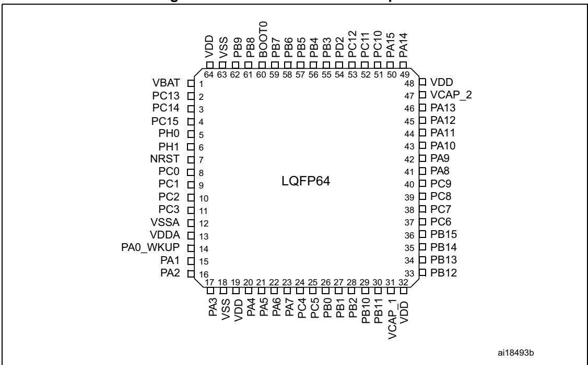

1. The above figure shows the package top view.

43/206

DS8626 Rev 12

Pinouts and pin description

STM32F405xx, STM32F407xx

Figure 13. STM32F40xxx LQFP100 pinout

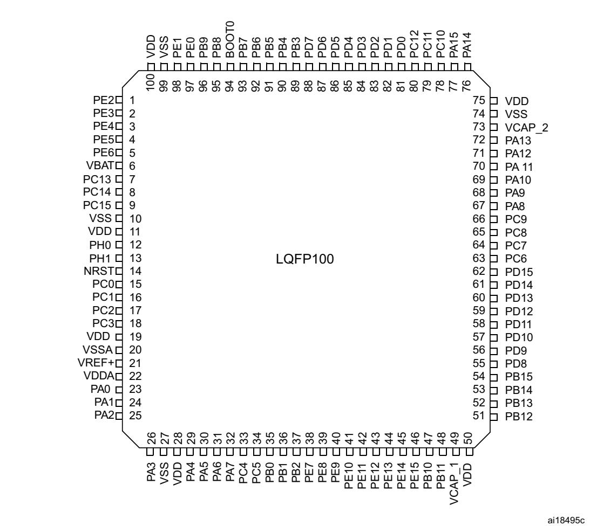

1. The above figure shows the package top view.

44/206

DS8626 Rev 12

STM32F405xx, STM32F407xx

Pinouts and pin description

Figure 14. STM32F40xxx LQFP144 pinout

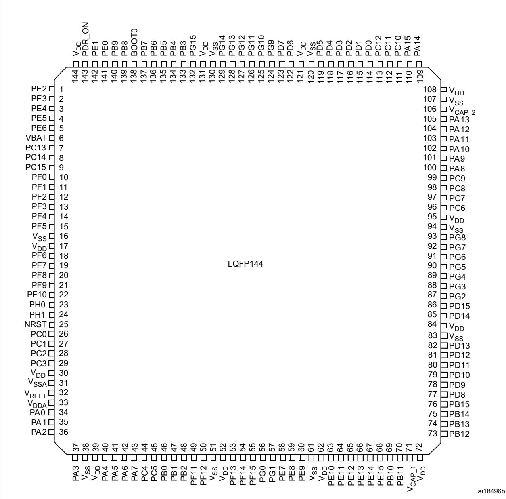

1. The above figure shows the package top view

DS8626 Rev 12

45/206

Pinouts and pin description

STM32F405xx, STM32F407xx

Figure 15. STM32F40xxx LQFP176 pinout

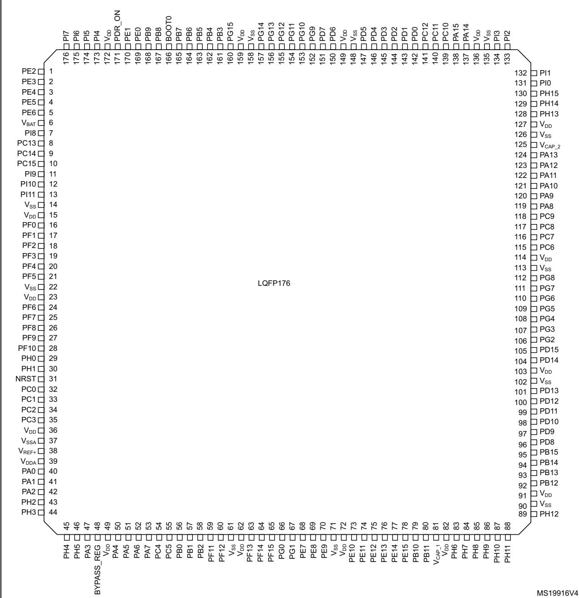

1. The above figure shows the package top view.

46/206

DS8626 Rev 12

STM32F405xx, STM32F407xx

Pinouts and pin description

Figure 16. STM32F40xxx UFBGA176 ballout

<table><tr><td></td><td>1</td><td>2</td><td>3</td><td>4</td><td>5</td><td>6</td><td>7</td><td>8</td><td>9</td><td>10</td><td>11</td><td>12</td><td>13</td><td>14</td><td>15</td></tr><tr><td>A</td><td>PE3</td><td>PE2</td><td>PE1</td><td>PE0</td><td>PB8</td><td>PB5</td><td>PG14</td><td>PG13</td><td>PB4</td><td>PB3</td><td>PD7</td><td>PC12</td><td>PA15</td><td>PA14</td><td>PA13</td></tr><tr><td>B</td><td>PE4</td><td>PE5</td><td>PE6</td><td>PB9</td><td>PB7</td><td>PB6</td><td>PG15</td><td>PG12</td><td>PG11</td><td>PG10</td><td>PD6</td><td>PD0</td><td>PC11</td><td>PC10</td><td>PA12</td></tr><tr><td>C</td><td>VBAT</td><td>PI7</td><td>PI6</td><td>PI5</td><td>VDD</td><td>PDR_ON</td><td>VDD</td><td>VDD</td><td>VDD</td><td>PG9</td><td>PD5</td><td>PD1</td><td>PI3</td><td>PI2</td><td>PA11</td></tr><tr><td>D</td><td>PC13</td><td>PI8</td><td>PI9</td><td>PI4</td><td>VSS BOOT0</td><td></td><td>VSS</td><td>VSS</td><td>VSS</td><td>PD4</td><td>PD3</td><td>PD2</td><td>PH15</td><td>PI1</td><td>PA10</td></tr><tr><td>E</td><td>PC14</td><td>PF0</td><td>PI10</td><td>PI11</td><td rowspan="6"></td><td></td><td></td><td></td><td></td><td>VSS</td><td rowspan="5"></td><td>PH13</td><td>PH14</td><td>PI0</td><td colspan="2">PA9</td></tr><tr><td>F</td><td>PC15</td><td>VSS</td><td>VDD</td><td>PH2</td><td></td><td>VSS</td><td>VSS</td><td>VSS</td><td>VSS</td><td></td><td>VSS</td><td>VCAP_2</td><td>PC9</td><td>PA8</td></tr><tr><td>G</td><td>PH0</td><td>VSS</td><td>VDD</td><td>PH3</td><td></td><td>VSS</td><td>VSS</td><td>VSS VSS</td><td>VSS</td><td></td><td>VSS</td><td>VDD</td><td>PC8</td><td>PC7</td></tr><tr><td>H</td><td>PH1</td><td>PF2</td><td>PF1</td><td>PH4</td><td></td><td>VSS</td><td>VSS</td><td>VSS VSS</td><td>VSS</td><td></td><td>VSS</td><td>VDD</td><td>PG8</td><td>PC6</td></tr><tr><td>J</td><td>NRST</td><td>PF3</td><td>PF4</td><td>PH5</td><td>VSS</td><td>VSS</td><td>VSS</td><td>VSS</td><td>VSS</td><td></td><td>VDD</td><td>VDD</td><td>PG7</td><td>PG6</td></tr><tr><td>K</td><td>PF7</td><td>PF6</td><td>PF5</td><td>VDD</td><td colspan="7">VSS VSS VSS VSS VSS</td><td>PH12</td><td>PG5</td><td>PG4</td><td>PG3</td></tr><tr><td>L</td><td>PF10</td><td>PF9</td><td>PF8</td><td>BYPASS REG</td><td colspan="7"></td><td>PH11</td><td>PH10</td><td>PD15</td><td>PG2</td></tr><tr><td>M</td><td>VSSA</td><td>PC0</td><td>PC1</td><td>PC2</td><td>PC3</td><td>PB2</td><td>PG1</td><td>VSS</td><td>VSS</td><td>VCAP_1</td><td>PH6</td><td>PH8</td><td>PH9</td><td>PD14</td><td>PD13</td></tr><tr><td>N</td><td>VREF-</td><td>PA1</td><td>PA0</td><td>PA4</td><td>PC4</td><td>PF13</td><td>PG0</td><td>VDD</td><td>VDD</td><td>VDD</td><td>PE13</td><td>PH7</td><td>PD12</td><td>PD11</td><td>PD10</td></tr><tr><td>P</td><td>VREF+</td><td>PA2</td><td>PA6</td><td>PA5</td><td>PC5</td><td>PF12</td><td>PF15</td><td>PE8</td><td>PE9</td><td>PE11</td><td>PE14</td><td>PB12</td><td>PB13</td><td>PD9</td><td>PD8</td></tr><tr><td>R</td><td>VDDA</td><td>PA3</td><td>PA7</td><td>PB1</td><td>PB0</td><td>PF11</td><td>PF14</td><td>PE7</td><td>PE10</td><td>PE12</td><td>PE15</td><td>PB10</td><td>PB11</td><td>PB14</td><td>PB15</td></tr><tr><td colspan="16">ai18497b</td></tr></table>

1. This figure shows the package top view.

47/206

DS8626 Rev 12

Pinouts and pin description

STM32F405xx, STM32F407xx

Figure 17. STM32F40xxx WLCSP90 ballout

<table><tr><td rowspan=1 colspan=1>VBAT</td><td rowspan=1 colspan=1>PC13</td><td rowspan=1 colspan=1>PDR_ON</td><td rowspan=1 colspan=1>BOOT0</td><td rowspan=1 colspan=1>PB4</td><td rowspan=1 colspan=1>PD7</td><td rowspan=1 colspan=1>PD4</td><td rowspan=1 colspan=1>PC12</td><td rowspan=1 colspan=1>PA14</td><td rowspan=1 colspan=1>VDD</td></tr><tr><td rowspan=1 colspan=1>PC14</td><td rowspan=1 colspan=1>PC15</td><td rowspan=1 colspan=1>VDD</td><td rowspan=1 colspan=1>PB7</td><td rowspan=1 colspan=1>PB3</td><td rowspan=1 colspan=1>PD6</td><td rowspan=1 colspan=1>PD2</td><td rowspan=1 colspan=1>PA15</td><td rowspan=1 colspan=1>PI1</td><td rowspan=1 colspan=1>VCAP_2</td></tr><tr><td rowspan=1 colspan=1>PA0</td><td rowspan=1 colspan=1>VSS</td><td rowspan=1 colspan=1>PB9</td><td rowspan=1 colspan=1>PB6</td><td rowspan=1 colspan=1>PD5</td><td rowspan=1 colspan=1>PD1</td><td rowspan=1 colspan=1>PC11</td><td rowspan=1 colspan=1>PIO</td><td rowspan=1 colspan=1>PA12</td><td rowspan=1 colspan=1>PA11</td></tr><tr><td rowspan=1 colspan=1>PC2</td><td rowspan=1 colspan=1>BYPASSREG</td><td rowspan=1 colspan=1>PB8</td><td rowspan=1 colspan=1>PB5</td><td rowspan=1 colspan=1>PD0</td><td rowspan=1 colspan=1>PC10</td><td rowspan=1 colspan=1>PA13</td><td rowspan=1 colspan=1>PA10</td><td rowspan=1 colspan=1>PA9</td><td rowspan=1 colspan=1>PA8</td></tr><tr><td rowspan=1 colspan=1>PC0</td><td rowspan=1 colspan=1>PC3</td><td rowspan=1 colspan=1>VSS</td><td rowspan=1 colspan=1>VSS</td><td rowspan=1 colspan=1>VDD</td><td rowspan=1 colspan=1>VSS</td><td rowspan=1 colspan=1>VDD</td><td rowspan=1 colspan=1>PC9</td><td rowspan=1 colspan=1>PC8</td><td rowspan=1 colspan=1>PC7</td></tr><tr><td rowspan=1 colspan=1>PH0</td><td rowspan=1 colspan=1>PH1</td><td rowspan=1 colspan=1>PA1</td><td rowspan=1 colspan=1>VDD</td><td rowspan=1 colspan=1>PE10</td><td rowspan=1 colspan=1>PE14</td><td rowspan=1 colspan=1>VCAP_1</td><td rowspan=1 colspan=1>PC6</td><td rowspan=1 colspan=1>PD14</td><td rowspan=1 colspan=1>PD15</td></tr><tr><td rowspan=1 colspan=1>NRST</td><td rowspan=1 colspan=1>VDDA</td><td rowspan=1 colspan=1>PA5</td><td rowspan=1 colspan=1>PB0</td><td rowspan=1 colspan=1>PE7</td><td rowspan=1 colspan=1>PE13</td><td rowspan=1 colspan=1>PE15</td><td rowspan=1 colspan=1>PD10</td><td rowspan=1 colspan=1>PD12</td><td rowspan=1 colspan=1>PD11</td></tr><tr><td rowspan=1 colspan=1>VSSA</td><td rowspan=1 colspan=1>PA3</td><td rowspan=1 colspan=1>PA6</td><td rowspan=1 colspan=1>PB1</td><td rowspan=1 colspan=1>PE8</td><td rowspan=1 colspan=1>PE12</td><td rowspan=1 colspan=1>PB10</td><td rowspan=1 colspan=1>PD9</td><td rowspan=1 colspan=1>PD8</td><td rowspan=1 colspan=1>PB15</td></tr><tr><td rowspan=1 colspan=1>PA2</td><td rowspan=1 colspan=1>PA4</td><td rowspan=1 colspan=1>PA7</td><td rowspan=1 colspan=1>PB2</td><td rowspan=1 colspan=1>PE9</td><td rowspan=1 colspan=1>PE11</td><td rowspan=1 colspan=1>PB11</td><td rowspan=1 colspan=1>PB12</td><td rowspan=1 colspan=1>PB14</td><td rowspan=1 colspan=1>PB13</td></tr></table>

1. This figure shows the package bump view.

Table 6. Legend/abbreviations used in the pinout table

<table><tr><td rowspan=1 colspan=1>Name</td><td rowspan=1 colspan=1>Abbreviation</td><td rowspan=1 colspan=1>Definition</td></tr><tr><td rowspan=1 colspan=1>Pin name</td><td rowspan=1 colspan=2>Unless otherwise specified in brackets below the pin name, the pin function during and afterreset is the same as the actual pin name</td></tr><tr><td rowspan=3 colspan=1>Pin type</td><td rowspan=1 colspan=1>S</td><td rowspan=1 colspan=1>Supply pin</td></tr><tr><td rowspan=1 colspan=1>1</td><td rowspan=1 colspan=1>Input only pin</td></tr><tr><td rowspan=1 colspan=1>1/0</td><td rowspan=1 colspan=1>Input / output pin</td></tr><tr><td rowspan=4 colspan=1>I/O structure</td><td rowspan=1 colspan=1>FT</td><td rowspan=1 colspan=1>5 V tolerant I/O</td></tr><tr><td rowspan=1 colspan=1>TTa</td><td rowspan=1 colspan=1>3.3 V tolerant I/O directly connected to ADC</td></tr><tr><td rowspan=1 colspan=1>B</td><td rowspan=1 colspan=1>Dedicated BOOT0 pin</td></tr><tr><td rowspan=1 colspan=1>RST</td><td rowspan=1 colspan=1>Bidirectional reset pin with embedded weak pull-up resistor</td></tr><tr><td rowspan=1 colspan=1>Notes</td><td rowspan=1 colspan=2>Unless otherwise specified by a note, all l/Os are set as floating inputs during and after reset</td></tr><tr><td rowspan=1 colspan=1>Alternatefunctions</td><td rowspan=1 colspan=2>Functions selected through GPIOx_AFR registers</td></tr><tr><td rowspan=1 colspan=1>Additionalfunctions</td><td rowspan=1 colspan=2>Functions directly selected/enabled through peripheral registers</td></tr></table>

48/206

DS8626 Rev 12

STM32F405xx, STM32F407xx

Pinouts and pin description

Table 7. STM32F40xxx pin and ball definitions(1)

<table><tr><td colspan="6" rowspan="1">Pin number</td><td colspan="1" rowspan="2">Pin name(function afterreset)(2)</td><td colspan="1" rowspan="2">Pinn ype</td><td colspan="1" rowspan="2">Irtuutut  </td><td colspan="1" rowspan="2">Notes</td><td colspan="1" rowspan="2">Alternate functions</td><td colspan="1" rowspan="2">Additionalfunctions</td></tr><tr><td colspan="1" rowspan="1">LOFFP64</td><td colspan="1" rowspan="1">WLSP90</td><td colspan="1" rowspan="1">LPFP10</td><td colspan="1" rowspan="1">L0P14</td><td colspan="1" rowspan="1">UFB176</td><td colspan="1" rowspan="1">LOFP176</td></tr><tr><td colspan="1" rowspan="1"></td><td colspan="1" rowspan="1"></td><td colspan="1" rowspan="1">1</td><td colspan="1" rowspan="1">1</td><td colspan="1" rowspan="1">A2</td><td colspan="1" rowspan="1">1</td><td colspan="1" rowspan="1">PE2</td><td colspan="1" rowspan="1">I/O</td><td colspan="1" rowspan="1">FT</td><td colspan="1" rowspan="1"></td><td colspan="1" rowspan="1">TRACECLK/ FSMC_A23 /ETH_MII_TXD3 /EVENTOUT</td><td colspan="1" rowspan="1"></td></tr><tr><td colspan="1" rowspan="1"></td><td colspan="1" rowspan="1"></td><td colspan="1" rowspan="1">2</td><td colspan="1" rowspan="1">2</td><td colspan="1" rowspan="1">A1</td><td colspan="1" rowspan="1">2</td><td colspan="1" rowspan="1">PE3</td><td colspan="1" rowspan="1">I/O</td><td colspan="1" rowspan="1">FT</td><td colspan="1" rowspan="1"></td><td colspan="1" rowspan="1">TRACED0/FSMC_A19 /EVENTOUT</td><td colspan="1" rowspan="1"></td></tr><tr><td colspan="1" rowspan="1"></td><td colspan="1" rowspan="1"></td><td colspan="1" rowspan="1">3</td><td colspan="1" rowspan="1">3</td><td colspan="1" rowspan="1">B1</td><td colspan="1" rowspan="1">3</td><td colspan="1" rowspan="1">PE4</td><td colspan="1" rowspan="1">1/0</td><td colspan="1" rowspan="1">FT</td><td colspan="1" rowspan="1"></td><td colspan="1" rowspan="1">TRACED1/FSMC_A20 /DCMI_D4/ EVENTOUT</td><td colspan="1" rowspan="1"></td></tr><tr><td colspan="1" rowspan="1"></td><td colspan="1" rowspan="1"></td><td colspan="1" rowspan="1">4</td><td colspan="1" rowspan="1">4</td><td colspan="1" rowspan="1">B2</td><td colspan="1" rowspan="1">4</td><td colspan="1" rowspan="1">PE5</td><td colspan="1" rowspan="1">1/0</td><td colspan="1" rowspan="1">FT</td><td colspan="1" rowspan="1"></td><td colspan="1" rowspan="1">TRACED2 / FSMC_A21 /TIM9_CH1 / DCMI_D6 /EVENTOUT</td><td colspan="1" rowspan="1"></td></tr><tr><td colspan="1" rowspan="1"></td><td colspan="1" rowspan="1"></td><td colspan="1" rowspan="1">5</td><td colspan="1" rowspan="1">5</td><td colspan="1" rowspan="1">B3</td><td colspan="1" rowspan="1">5</td><td colspan="1" rowspan="1">PE6</td><td colspan="1" rowspan="1">I/O</td><td colspan="1" rowspan="1">FT</td><td colspan="1" rowspan="1"></td><td colspan="1" rowspan="1">TRACED3 / FSMC_A22 /TIM9_CH2 / DCMI_D7 /EVENTOUT</td><td colspan="1" rowspan="1"></td></tr><tr><td colspan="1" rowspan="1">1</td><td colspan="1" rowspan="1">A10</td><td colspan="1" rowspan="1">6</td><td colspan="1" rowspan="1">6</td><td colspan="1" rowspan="1">C1</td><td colspan="1" rowspan="1">6</td><td colspan="1" rowspan="1">VBAT</td><td colspan="1" rowspan="1">S</td><td colspan="1" rowspan="1">1</td><td colspan="1" rowspan="1">-</td><td colspan="1" rowspan="1"></td><td colspan="1" rowspan="1"></td></tr><tr><td colspan="1" rowspan="1"></td><td colspan="1" rowspan="1"></td><td colspan="1" rowspan="1"></td><td colspan="1" rowspan="1"></td><td colspan="1" rowspan="1">D2</td><td colspan="1" rowspan="1">7</td><td colspan="1" rowspan="1">PI8</td><td colspan="1" rowspan="1">I/O</td><td colspan="1" rowspan="1">FT</td><td colspan="1" rowspan="1">(3)(4)</td><td colspan="1" rowspan="1"></td><td colspan="1" rowspan="1">RTC_TAMP1,RTC_TAMP2,RTC_TS</td></tr><tr><td colspan="1" rowspan="1">2</td><td colspan="1" rowspan="1">A9</td><td colspan="1" rowspan="1">7</td><td colspan="1" rowspan="1">7</td><td colspan="1" rowspan="1">D1</td><td colspan="1" rowspan="1">8</td><td colspan="1" rowspan="1">PC13</td><td colspan="1" rowspan="1">I/O</td><td colspan="1" rowspan="1">FT</td><td colspan="1" rowspan="1">(3)(4)</td><td colspan="1" rowspan="1"></td><td colspan="1" rowspan="1">RTC_OUT,RTC_TAMP1,RTC_TS</td></tr><tr><td colspan="1" rowspan="1">3</td><td colspan="1" rowspan="1">B10</td><td colspan="1" rowspan="1">8</td><td colspan="1" rowspan="1">8</td><td colspan="1" rowspan="1">E1</td><td colspan="1" rowspan="1">9</td><td colspan="1" rowspan="1">PC14/OSC32_IN(PC14)</td><td colspan="1" rowspan="1">I/O</td><td colspan="1" rowspan="1">FT</td><td colspan="1" rowspan="1">(3)(4)</td><td colspan="1" rowspan="1"></td><td colspan="1" rowspan="1">OSC32_IN(5)</td></tr><tr><td colspan="1" rowspan="1">4</td><td colspan="1" rowspan="1">B9</td><td colspan="1" rowspan="1">9</td><td colspan="1" rowspan="1">9</td><td colspan="1" rowspan="1">F1</td><td colspan="1" rowspan="1">10</td><td colspan="1" rowspan="1">PC15/OSC32_OUT(PC15)</td><td colspan="1" rowspan="1">I/O</td><td colspan="1" rowspan="1">FT</td><td colspan="1" rowspan="1">(3)(4)</td><td colspan="1" rowspan="1"></td><td colspan="1" rowspan="1">OSC32_OUT(5)</td></tr><tr><td colspan="1" rowspan="1"></td><td colspan="1" rowspan="1">1</td><td colspan="1" rowspan="1">-</td><td colspan="1" rowspan="1">-</td><td colspan="1" rowspan="1">D3</td><td colspan="1" rowspan="1">11</td><td colspan="1" rowspan="1">PI9</td><td colspan="1" rowspan="1">I/O</td><td colspan="1" rowspan="1">FT</td><td colspan="1" rowspan="1">-</td><td colspan="1" rowspan="1">CAN1_RX / EVENTOUT</td><td colspan="1" rowspan="1"></td></tr><tr><td colspan="1" rowspan="1"></td><td colspan="1" rowspan="1"></td><td colspan="1" rowspan="1"></td><td colspan="1" rowspan="1"></td><td colspan="1" rowspan="1">E3</td><td colspan="1" rowspan="1">12</td><td colspan="1" rowspan="1">PI10</td><td colspan="1" rowspan="1">I/O</td><td colspan="1" rowspan="1">FT</td><td colspan="1" rowspan="1"></td><td colspan="1" rowspan="1">ETH_MII_RX_ER/EVENTOUT</td><td colspan="1" rowspan="1"></td></tr><tr><td colspan="1" rowspan="1"></td><td colspan="1" rowspan="1"></td><td colspan="1" rowspan="1"></td><td colspan="1" rowspan="1"></td><td colspan="1" rowspan="1">E4</td><td colspan="1" rowspan="1">13</td><td colspan="1" rowspan="1">PI11</td><td colspan="1" rowspan="1">I/O</td><td colspan="1" rowspan="1">FT</td><td colspan="1" rowspan="1"></td><td colspan="1" rowspan="1">OTG_HS_ULPI_DIR/EVENTOUT</td><td colspan="1" rowspan="1"></td></tr><tr><td colspan="1" rowspan="1"></td><td colspan="1" rowspan="1"></td><td colspan="1" rowspan="1">1</td><td colspan="1" rowspan="1"></td><td colspan="1" rowspan="1">F2</td><td colspan="1" rowspan="1">14</td><td colspan="1" rowspan="1">Vss</td><td colspan="1" rowspan="1">S</td><td colspan="1" rowspan="1">-</td><td colspan="1" rowspan="1">1</td><td colspan="1" rowspan="1"></td><td colspan="1" rowspan="1"></td></tr><tr><td colspan="1" rowspan="1">1</td><td colspan="1" rowspan="1"></td><td colspan="1" rowspan="1"></td><td colspan="1" rowspan="1">I</td><td colspan="1" rowspan="1">F3</td><td colspan="1" rowspan="1">15</td><td colspan="1" rowspan="1">VDD</td><td colspan="1" rowspan="1">S</td><td colspan="1" rowspan="1">-</td><td colspan="1" rowspan="1">-</td><td colspan="1" rowspan="1"></td><td colspan="1" rowspan="1"></td></tr><tr><td colspan="1" rowspan="1"></td><td colspan="1" rowspan="1"></td><td colspan="1" rowspan="1"></td><td colspan="1" rowspan="1">10</td><td colspan="1" rowspan="1">E2</td><td colspan="1" rowspan="1">16</td><td colspan="1" rowspan="1">PF0</td><td colspan="1" rowspan="1">I/O</td><td colspan="1" rowspan="1">FT</td><td colspan="1" rowspan="1">-</td><td colspan="1" rowspan="1">FSMC_A0 / I2C2_SDA/EVENTOUT</td><td colspan="1" rowspan="1"></td></tr><tr><td colspan="6" rowspan="1">Pin number</td><td colspan="1" rowspan="2">Pin name(function afterreset)(2)</td><td colspan="1" rowspan="2">Pinn ype</td><td colspan="1" rowspan="2">Irtuutu  /</td><td colspan="1" rowspan="2">Notes</td><td colspan="1" rowspan="2">Alternate functions</td><td colspan="1" rowspan="2">Additionalfunctions</td></tr><tr><td colspan="1" rowspan="1">LOFP64</td><td colspan="1" rowspan="1">WLP90</td><td colspan="1" rowspan="1">LFP10</td><td colspan="1" rowspan="1">LP14</td><td colspan="1" rowspan="1">UFRB176</td><td colspan="1" rowspan="1">LOP176</td></tr><tr><td colspan="1" rowspan="1">1</td><td colspan="1" rowspan="1">-</td><td colspan="1" rowspan="1">-</td><td colspan="1" rowspan="1">11</td><td colspan="1" rowspan="1">H3</td><td colspan="1" rowspan="1">17</td><td colspan="1" rowspan="1">PF1</td><td colspan="1" rowspan="1">I/O</td><td colspan="1" rowspan="1">FT</td><td colspan="1" rowspan="1">-</td><td colspan="1" rowspan="1">FSMC_A1 / I2C2_SCL /EVENTOUT</td><td colspan="1" rowspan="1">1</td></tr><tr><td colspan="1" rowspan="1"></td><td colspan="1" rowspan="1"></td><td colspan="1" rowspan="1">1</td><td colspan="1" rowspan="1">12</td><td colspan="1" rowspan="1">H2</td><td colspan="1" rowspan="1">18</td><td colspan="1" rowspan="1">PF2</td><td colspan="1" rowspan="1">1/0</td><td colspan="1" rowspan="1">FT</td><td colspan="1" rowspan="1">-</td><td colspan="1" rowspan="1">FSMC_A2 / I2C2_SMBA/EVENTOUT</td><td colspan="1" rowspan="1"></td></tr><tr><td colspan="1" rowspan="1">-</td><td colspan="1" rowspan="1">-</td><td colspan="1" rowspan="1">-</td><td colspan="1" rowspan="1">13</td><td colspan="1" rowspan="1">J2</td><td colspan="1" rowspan="1">19</td><td colspan="1" rowspan="1">PF3</td><td colspan="1" rowspan="1">1/0</td><td colspan="1" rowspan="1">FT</td><td colspan="1" rowspan="1">(5)</td><td colspan="1" rowspan="1">FSMC_A3/EVENTOUT</td><td colspan="1" rowspan="1">ADC3_IN9</td></tr><tr><td colspan="1" rowspan="1">-</td><td colspan="1" rowspan="1">-</td><td colspan="1" rowspan="1">-</td><td colspan="1" rowspan="1">14</td><td colspan="1" rowspan="1">J3</td><td colspan="1" rowspan="1">20</td><td colspan="1" rowspan="1">PF4</td><td colspan="1" rowspan="1">1/0</td><td colspan="1" rowspan="1">FT</td><td colspan="1" rowspan="1">(5)</td><td colspan="1" rowspan="1">FSMC_A4/EVENTOUT</td><td colspan="1" rowspan="1">ADC3_IN14</td></tr><tr><td colspan="1" rowspan="1">–</td><td colspan="1" rowspan="1">-</td><td colspan="1" rowspan="1">-</td><td colspan="1" rowspan="1">15</td><td colspan="1" rowspan="1">K3</td><td colspan="1" rowspan="1">21</td><td colspan="1" rowspan="1">PF5</td><td colspan="1" rowspan="1">I/O</td><td colspan="1" rowspan="1">FT</td><td colspan="1" rowspan="1">(5)</td><td colspan="1" rowspan="1">FSMC_A5/EVENTOUT</td><td colspan="1" rowspan="1">ADC3_IN15</td></tr><tr><td colspan="1" rowspan="1">-</td><td colspan="1" rowspan="1">C9</td><td colspan="1" rowspan="1">10</td><td colspan="1" rowspan="1">16</td><td colspan="1" rowspan="1">G2</td><td colspan="1" rowspan="1">22</td><td colspan="1" rowspan="1">Vss</td><td colspan="1" rowspan="1">S</td><td colspan="1" rowspan="1">-</td><td colspan="1" rowspan="1">-</td><td colspan="1" rowspan="1"></td><td colspan="1" rowspan="1"></td></tr><tr><td colspan="1" rowspan="1">-</td><td colspan="1" rowspan="1">B8</td><td colspan="1" rowspan="1">11</td><td colspan="1" rowspan="1">17</td><td colspan="1" rowspan="1">G3</td><td colspan="1" rowspan="1">23</td><td colspan="1" rowspan="1">VDD</td><td colspan="1" rowspan="1">S</td><td colspan="1" rowspan="1">-</td><td colspan="1" rowspan="1">-</td><td colspan="1" rowspan="1">一</td><td colspan="1" rowspan="1"></td></tr><tr><td colspan="1" rowspan="1"></td><td colspan="1" rowspan="1"></td><td colspan="1" rowspan="1"></td><td colspan="1" rowspan="1">18</td><td colspan="1" rowspan="1">K2</td><td colspan="1" rowspan="1">24</td><td colspan="1" rowspan="1">PF6</td><td colspan="1" rowspan="1">I/O</td><td colspan="1" rowspan="1">FT</td><td colspan="1" rowspan="1">(5)</td><td colspan="1" rowspan="1">TIM10_CH1/FSMC_NIORD/EVENTOUT</td><td colspan="1" rowspan="1">ADC3_IN4</td></tr><tr><td colspan="1" rowspan="1"></td><td colspan="1" rowspan="1">-</td><td colspan="1" rowspan="1">-</td><td colspan="1" rowspan="1">19</td><td colspan="1" rowspan="1">K1</td><td colspan="1" rowspan="1">25</td><td colspan="1" rowspan="1">PF7</td><td colspan="1" rowspan="1">I/O</td><td colspan="1" rowspan="1">FT</td><td colspan="1" rowspan="1">(5)</td><td colspan="1" rowspan="1">TIM11_CH1/FSMC_NREG/EVENTOUT</td><td colspan="1" rowspan="1">ADC3_IN5</td></tr><tr><td colspan="1" rowspan="1"></td><td colspan="1" rowspan="1"></td><td colspan="1" rowspan="1"></td><td colspan="1" rowspan="1">20</td><td colspan="1" rowspan="1">L3</td><td colspan="1" rowspan="1">26</td><td colspan="1" rowspan="1">PF8</td><td colspan="1" rowspan="1">I/O</td><td colspan="1" rowspan="1">FT</td><td colspan="1" rowspan="1">(5)</td><td colspan="1" rowspan="1">TIM13_CH1/FSMC_NIOWR/EVENTOUT</td><td colspan="1" rowspan="1">ADC3_IN6</td></tr><tr><td colspan="1" rowspan="1"></td><td colspan="1" rowspan="1"></td><td colspan="1" rowspan="1">-</td><td colspan="1" rowspan="1">21</td><td colspan="1" rowspan="1">L2</td><td colspan="1" rowspan="1">27</td><td colspan="1" rowspan="1">PF9</td><td colspan="1" rowspan="1">I/O</td><td colspan="1" rowspan="1">FT</td><td colspan="1" rowspan="1">(5)</td><td colspan="1" rowspan="1">TIM14_CH1/ FSMC_CD/EVENTOUT</td><td colspan="1" rowspan="1">ADC3_IN7</td></tr><tr><td colspan="1" rowspan="1"></td><td colspan="1" rowspan="1">-</td><td colspan="1" rowspan="1">1</td><td colspan="1" rowspan="1">22</td><td colspan="1" rowspan="1">L1</td><td colspan="1" rowspan="1">28</td><td colspan="1" rowspan="1">PF10</td><td colspan="1" rowspan="1">I/O</td><td colspan="1" rowspan="1">FT</td><td colspan="1" rowspan="1">(5)</td><td colspan="1" rowspan="1">FSMC INTR/ EVENTOUT</td><td colspan="1" rowspan="1">ADC3_IN8</td></tr><tr><td colspan="1" rowspan="1">5</td><td colspan="1" rowspan="1">F10</td><td colspan="1" rowspan="1">12</td><td colspan="1" rowspan="1">23</td><td colspan="1" rowspan="1">G1</td><td colspan="1" rowspan="1">29</td><td colspan="1" rowspan="1">PH0/OSC_IN(PH0)</td><td colspan="1" rowspan="1">I/O</td><td colspan="1" rowspan="1">FT</td><td colspan="1" rowspan="1">一</td><td colspan="1" rowspan="1">EVENTOUT</td><td colspan="1" rowspan="1">OSC_IN(5)</td></tr><tr><td colspan="1" rowspan="1">6</td><td colspan="1" rowspan="1">F9</td><td colspan="1" rowspan="1">13</td><td colspan="1" rowspan="1">24</td><td colspan="1" rowspan="1">H1</td><td colspan="1" rowspan="1">30</td><td colspan="1" rowspan="1">PH1/OSC_OUT(PH1)</td><td colspan="1" rowspan="1">I/O</td><td colspan="1" rowspan="1">FT</td><td colspan="1" rowspan="1">-</td><td colspan="1" rowspan="1">EVENTOUT</td><td colspan="1" rowspan="1">OSC_OUT(5)</td></tr><tr><td colspan="1" rowspan="1">7</td><td colspan="1" rowspan="1">G10</td><td colspan="1" rowspan="1">14</td><td colspan="1" rowspan="1">25</td><td colspan="1" rowspan="1">J1</td><td colspan="1" rowspan="1">31</td><td colspan="1" rowspan="1">NRST</td><td colspan="1" rowspan="1">1/0</td><td colspan="1" rowspan="1">RST</td><td colspan="1" rowspan="1">-</td><td colspan="1" rowspan="1">一</td><td colspan="1" rowspan="1"></td></tr><tr><td colspan="1" rowspan="1">8</td><td colspan="1" rowspan="1">E10</td><td colspan="1" rowspan="1">15</td><td colspan="1" rowspan="1">26</td><td colspan="1" rowspan="1">M2</td><td colspan="1" rowspan="1">32</td><td colspan="1" rowspan="1">PC0</td><td colspan="1" rowspan="1">1/0</td><td colspan="1" rowspan="1">FT</td><td colspan="1" rowspan="1">(5)</td><td colspan="1" rowspan="1">OTG_HS_ULPI_STP/EVENTOUT</td><td colspan="1" rowspan="1">ADC123_IN10</td></tr><tr><td colspan="1" rowspan="1">9</td><td colspan="1" rowspan="1">-</td><td colspan="1" rowspan="1">16</td><td colspan="1" rowspan="1">27</td><td colspan="1" rowspan="1">M3</td><td colspan="1" rowspan="1">33</td><td colspan="1" rowspan="1">PC1</td><td colspan="1" rowspan="1">I/O</td><td colspan="1" rowspan="1">FT</td><td colspan="1" rowspan="1">(5)</td><td colspan="1" rowspan="1">ETH_MDC/ EVENTOUT</td><td colspan="1" rowspan="1">ADC123_IN11</td></tr><tr><td colspan="1" rowspan="1">10</td><td colspan="1" rowspan="1">D10</td><td colspan="1" rowspan="1">17</td><td colspan="1" rowspan="1">28</td><td colspan="1" rowspan="1">M4</td><td colspan="1" rowspan="1">34</td><td colspan="1" rowspan="1">PC2</td><td colspan="1" rowspan="1">I/O</td><td colspan="1" rowspan="1">FT</td><td colspan="1" rowspan="1">(5)</td><td colspan="1" rowspan="1">SPI2_MISO /OTG_HS_ULPI_DIR/ETH_MII_TXD2/I2S2ext_SD/ EVENTOUT</td><td colspan="1" rowspan="1">ADC123_IN12</td></tr><tr><td colspan="1" rowspan="1">11</td><td colspan="1" rowspan="1">E9</td><td colspan="1" rowspan="1">18</td><td colspan="1" rowspan="1">29</td><td colspan="1" rowspan="1">M5</td><td colspan="1" rowspan="1">35</td><td colspan="1" rowspan="1">PC3</td><td colspan="1" rowspan="1">I/O</td><td colspan="1" rowspan="1">FT</td><td colspan="1" rowspan="1">(5)</td><td colspan="1" rowspan="1">SPI2_MOSI / I2S2_SD /OTG_HS_ULPI_NXT /ETH_MII_TX_CLKIEVENTOUT</td><td colspan="1" rowspan="1">ADC123_IN13</td></tr><tr><td colspan="1" rowspan="1">-</td><td colspan="1" rowspan="1"></td><td colspan="1" rowspan="1">19</td><td colspan="1" rowspan="1">30</td><td colspan="1" rowspan="1">1</td><td colspan="1" rowspan="1">36</td><td colspan="1" rowspan="1">VDD</td><td colspan="1" rowspan="1">S</td><td colspan="1" rowspan="1">-</td><td colspan="1" rowspan="1">1</td><td colspan="1" rowspan="1"></td><td colspan="1" rowspan="1"></td></tr><tr><td colspan="1" rowspan="1">12</td><td colspan="1" rowspan="1">H10</td><td colspan="1" rowspan="1">20</td><td colspan="1" rowspan="1">31</td><td colspan="1" rowspan="1">M1</td><td colspan="1" rowspan="1">37</td><td colspan="1" rowspan="1">VSSA</td><td colspan="1" rowspan="1">S</td><td colspan="1" rowspan="1">-</td><td colspan="1" rowspan="1">-</td><td colspan="1" rowspan="1"></td><td colspan="1" rowspan="1"></td></tr><tr><td colspan="1" rowspan="1"></td><td colspan="1" rowspan="1"></td><td colspan="1" rowspan="1">-</td><td colspan="1" rowspan="1"></td><td colspan="1" rowspan="1">N1</td><td colspan="1" rowspan="1">-</td><td colspan="1" rowspan="1">VREF-</td><td colspan="1" rowspan="1">S</td><td colspan="1" rowspan="1">-</td><td colspan="1" rowspan="1">-</td><td colspan="1" rowspan="1"></td><td colspan="1" rowspan="1"></td></tr><tr><td colspan="1" rowspan="1">-</td><td colspan="1" rowspan="1">一</td><td colspan="1" rowspan="1">21</td><td colspan="1" rowspan="1">32</td><td colspan="1" rowspan="1">P1</td><td colspan="1" rowspan="1">38</td><td colspan="1" rowspan="1">VREF+</td><td colspan="1" rowspan="1">S</td><td colspan="1" rowspan="1">-</td><td colspan="1" rowspan="1">-</td><td colspan="1" rowspan="1"></td><td colspan="1" rowspan="1"></td></tr><tr><td colspan="1" rowspan="1">13</td><td colspan="1" rowspan="1">G9</td><td colspan="1" rowspan="1">22</td><td colspan="1" rowspan="1">33</td><td colspan="1" rowspan="1">R1</td><td colspan="1" rowspan="1">39</td><td colspan="1" rowspan="1">VDDA</td><td colspan="1" rowspan="1">S</td><td colspan="1" rowspan="1">1</td><td colspan="1" rowspan="1">1</td><td colspan="1" rowspan="1"></td><td colspan="1" rowspan="1"></td></tr><tr><td colspan="1" rowspan="1">14</td><td colspan="1" rowspan="1">C10</td><td colspan="1" rowspan="1">23</td><td colspan="1" rowspan="1">34</td><td colspan="1" rowspan="1">N3</td><td colspan="1" rowspan="1">40</td><td colspan="1" rowspan="1">PA0/WKUP(PA0)</td><td colspan="1" rowspan="1">I/O</td><td colspan="1" rowspan="1">FT</td><td colspan="1" rowspan="1">(6)</td><td colspan="1" rowspan="1">USART2_CTS/UART4_TX/ETH_MII_CRS /TIM2_CH1_ETR/TIM5_CH1 / TIM8_ETR/EVENTOUT</td><td colspan="1" rowspan="1">ADC123_IN0/WKUP(5)</td></tr><tr><td colspan="1" rowspan="1">15</td><td colspan="1" rowspan="1">F8</td><td colspan="1" rowspan="1">24</td><td colspan="1" rowspan="1">35</td><td colspan="1" rowspan="1">N2</td><td colspan="1" rowspan="1">41</td><td colspan="1" rowspan="1">PA1</td><td colspan="1" rowspan="1">I/O</td><td colspan="1" rowspan="1">FT</td><td colspan="1" rowspan="1">(5)</td><td colspan="1" rowspan="1">USART2_RTS /UART4_RX/ETH_RMII_REF_CLK/ETH_MII_RX_CLK/TIM5_CH2/ TIM2_CH2/EVENTOUT</td><td colspan="1" rowspan="1">ADC123_IN1</td></tr><tr><td colspan="1" rowspan="1">16</td><td colspan="1" rowspan="1">J10</td><td colspan="1" rowspan="1">25</td><td colspan="1" rowspan="1">36</td><td colspan="1" rowspan="1">P2</td><td colspan="1" rowspan="1">42</td><td colspan="1" rowspan="1">PA2</td><td colspan="1" rowspan="1">I/O</td><td colspan="1" rowspan="1">FT</td><td colspan="1" rowspan="1">(5)</td><td colspan="1" rowspan="1">USART2_TX/TIM5_CH3 /TIM9_CH1/ TIM2_CH3 /ETH_MDIO/ EVENTOUT</td><td colspan="1" rowspan="1">ADC123_IN2</td></tr><tr><td colspan="1" rowspan="1">1</td><td colspan="1" rowspan="1">-</td><td colspan="1" rowspan="1">-</td><td colspan="1" rowspan="1">-</td><td colspan="1" rowspan="1">F4</td><td colspan="1" rowspan="1">43</td><td colspan="1" rowspan="1">PH2</td><td colspan="1" rowspan="1">I/O</td><td colspan="1" rowspan="1">FT</td><td colspan="1" rowspan="1">1</td><td colspan="1" rowspan="1">ETH_MII_CRS/EVENTOUT</td><td colspan="1" rowspan="1"></td></tr><tr><td colspan="1" rowspan="1"></td><td colspan="1" rowspan="1"></td><td colspan="1" rowspan="1"></td><td colspan="1" rowspan="1">1</td><td colspan="1" rowspan="1">G4</td><td colspan="1" rowspan="1">44</td><td colspan="1" rowspan="1">PH3</td><td colspan="1" rowspan="1">I/O</td><td colspan="1" rowspan="1">FT</td><td colspan="1" rowspan="1">1</td><td colspan="1" rowspan="1">ETH_MII_COL/EVENTOUT</td><td colspan="1" rowspan="1"></td></tr><tr><td colspan="1" rowspan="1"></td><td colspan="1" rowspan="1"></td><td colspan="1" rowspan="1"></td><td colspan="1" rowspan="1"></td><td colspan="1" rowspan="1">H4</td><td colspan="1" rowspan="1">45</td><td colspan="1" rowspan="1">PH4</td><td colspan="1" rowspan="1">1/0</td><td colspan="1" rowspan="1">FT</td><td colspan="1" rowspan="1"></td><td colspan="1" rowspan="1">I2C2_SCL/OTG_HS_ULPI_NXT/EVENTOUT</td><td colspan="1" rowspan="1"></td></tr><tr><td colspan="1" rowspan="1"></td><td colspan="1" rowspan="1"></td><td colspan="1" rowspan="1">-</td><td colspan="1" rowspan="1">一</td><td colspan="1" rowspan="1">J4</td><td colspan="1" rowspan="1">46</td><td colspan="1" rowspan="1">PH5</td><td colspan="1" rowspan="1">I/O</td><td colspan="1" rowspan="1">FT</td><td colspan="1" rowspan="1">-</td><td colspan="1" rowspan="1">I2C2_SDA/ EVENTOUT</td><td colspan="1" rowspan="1"></td></tr><tr><td colspan="1" rowspan="1">17</td><td colspan="1" rowspan="1">H9</td><td colspan="1" rowspan="1">26</td><td colspan="1" rowspan="1">37</td><td colspan="1" rowspan="1">R2</td><td colspan="1" rowspan="1">47</td><td colspan="1" rowspan="1">PA3</td><td colspan="1" rowspan="1">1/0</td><td colspan="1" rowspan="1">FT</td><td colspan="1" rowspan="1">(5)</td><td colspan="1" rowspan="1">USART2_RX/TIM5_CH4/TIM9_CH2 / TIM2_CH4 /OTG_HS_ULPI_D0 /ETH_MII_COL/EVENTOUT</td><td colspan="1" rowspan="1">ADC123_IN3</td></tr><tr><td colspan="1" rowspan="1">18</td><td colspan="1" rowspan="1">E5</td><td colspan="1" rowspan="1">27</td><td colspan="1" rowspan="1">38</td><td colspan="1" rowspan="1"></td><td colspan="1" rowspan="1">1</td><td colspan="1" rowspan="1">V_ss</td><td colspan="1" rowspan="1">S</td><td colspan="1" rowspan="1">1</td><td colspan="1" rowspan="1"></td><td colspan="1" rowspan="1"></td><td colspan="1" rowspan="1"></td></tr><tr><td colspan="6" rowspan="1">Pin number</td><td colspan="1" rowspan="2">Pin name(function afterreset)(2)</td><td colspan="1" rowspan="2">Pin ype</td><td colspan="1" rowspan="2">Irtuut O /</td><td colspan="1" rowspan="2">Notes</td><td colspan="1" rowspan="2">Alternate functions</td><td colspan="1" rowspan="2">Additionalfunctions</td></tr><tr><td colspan="1" rowspan="1">LOFP64</td><td colspan="1" rowspan="1">WSPP90</td><td colspan="1" rowspan="1">LFP10</td><td colspan="1" rowspan="1">LP14</td><td colspan="1" rowspan="1">UFB176</td><td colspan="1" rowspan="1">LOP176</td></tr><tr><td colspan="1" rowspan="1"></td><td colspan="1" rowspan="1">D9</td><td colspan="1" rowspan="1"></td><td colspan="1" rowspan="1"></td><td colspan="1" rowspan="1">L4</td><td colspan="1" rowspan="1">48</td><td colspan="1" rowspan="1">BYPASS_REG</td><td colspan="1" rowspan="1">1</td><td colspan="1" rowspan="1">FT</td><td colspan="1" rowspan="1">1</td><td colspan="1" rowspan="1"></td><td colspan="1" rowspan="1"></td></tr><tr><td colspan="1" rowspan="1">19</td><td colspan="1" rowspan="1">E4</td><td colspan="1" rowspan="1">28</td><td colspan="1" rowspan="1">39</td><td colspan="1" rowspan="1">K4</td><td colspan="1" rowspan="1">49</td><td colspan="1" rowspan="1">VDD</td><td colspan="1" rowspan="1">S</td><td colspan="1" rowspan="1">-</td><td colspan="1" rowspan="1">-</td><td colspan="1" rowspan="1"></td><td colspan="1" rowspan="1"></td></tr><tr><td colspan="1" rowspan="1">20</td><td colspan="1" rowspan="1">J9</td><td colspan="1" rowspan="1">29</td><td colspan="1" rowspan="1">40</td><td colspan="1" rowspan="1">N4</td><td colspan="1" rowspan="1">50</td><td colspan="1" rowspan="1">PA4</td><td colspan="1" rowspan="1">1/O</td><td colspan="1" rowspan="1">TTa</td><td colspan="1" rowspan="1">(5)</td><td colspan="1" rowspan="1">SPI1_NSS / SPI3_NSS /USART2 CK/DCMI HSYNC /OTG HS SOF/ I2S3 WS/EVENTOUT</td><td colspan="1" rowspan="1">ADC12_IN4/DAC_OUT1</td></tr><tr><td colspan="1" rowspan="1">21</td><td colspan="1" rowspan="1">G8</td><td colspan="1" rowspan="1">30</td><td colspan="1" rowspan="1">41</td><td colspan="1" rowspan="1">P4</td><td colspan="1" rowspan="1">51</td><td colspan="1" rowspan="1">PA5</td><td colspan="1" rowspan="1">1/O</td><td colspan="1" rowspan="1">TTa</td><td colspan="1" rowspan="1">(5)</td><td colspan="1" rowspan="1">SPI1_SCK/OTG_HS_ULPI_CK/TIM2_CH1_ETR/TIM8_CH1N/ EVENTOUT</td><td colspan="1" rowspan="1">ADC12_IN5/DAC_OUT2</td></tr><tr><td colspan="1" rowspan="1">22</td><td colspan="1" rowspan="1">H8</td><td colspan="1" rowspan="1">31</td><td colspan="1" rowspan="1">42</td><td colspan="1" rowspan="1">P3</td><td colspan="1" rowspan="1">52</td><td colspan="1" rowspan="1">PA6</td><td colspan="1" rowspan="1">I/O</td><td colspan="1" rowspan="1">FT</td><td colspan="1" rowspan="1">(5)</td><td colspan="1" rowspan="1">SPI1_MISO/TIM8_BKIN/TIM13_CH1/DCMI_PIXCLK/TIM3_CH1/ TIM1_BKIN/ EVENTOUT</td><td colspan="1" rowspan="1">ADC12_IN6</td></tr><tr><td colspan="1" rowspan="1">23</td><td colspan="1" rowspan="1">J8</td><td colspan="1" rowspan="1">32</td><td colspan="1" rowspan="1">43</td><td colspan="1" rowspan="1">R3</td><td colspan="1" rowspan="1">53</td><td colspan="1" rowspan="1">PA7</td><td colspan="1" rowspan="1">1/O</td><td colspan="1" rowspan="1">FT</td><td colspan="1" rowspan="1">(5)</td><td colspan="1" rowspan="1">SPI1_MOSI/ TIM8_CH1N/TIM14_CH1/TIM3_CH2/ETH MII RX DV /TIM1 CH1N/ETH_RMII_CRS_DV/EVENTOUT</td><td colspan="1" rowspan="1">ADC12_IN7</td></tr><tr><td colspan="1" rowspan="1">24</td><td colspan="1" rowspan="1"></td><td colspan="1" rowspan="1">33</td><td colspan="1" rowspan="1">44</td><td colspan="1" rowspan="1">N5</td><td colspan="1" rowspan="1">54</td><td colspan="1" rowspan="1">PC4</td><td colspan="1" rowspan="1">I/O</td><td colspan="1" rowspan="1">FT</td><td colspan="1" rowspan="1">(5)</td><td colspan="1" rowspan="1">ETH_RMII_RX_D0 /ETH_MII_RX_DO/EVENTOUT</td><td colspan="1" rowspan="1">ADC12_IN14</td></tr><tr><td colspan="1" rowspan="1">25</td><td colspan="1" rowspan="1"></td><td colspan="1" rowspan="1">34</td><td colspan="1" rowspan="1">45</td><td colspan="1" rowspan="1">P5</td><td colspan="1" rowspan="1">55</td><td colspan="1" rowspan="1">PC5</td><td colspan="1" rowspan="1">I/O</td><td colspan="1" rowspan="1">FT</td><td colspan="1" rowspan="1">(5)</td><td colspan="1" rowspan="1">ETH_RMII_RX_D1 /ETH_MII_RX_D1/EVENTOUT</td><td colspan="1" rowspan="1">ADC12_IN15</td></tr><tr><td colspan="1" rowspan="1">26</td><td colspan="1" rowspan="1">G7</td><td colspan="1" rowspan="1">35</td><td colspan="1" rowspan="1">46</td><td colspan="1" rowspan="1">R5</td><td colspan="1" rowspan="1">56</td><td colspan="1" rowspan="1">PB0</td><td colspan="1" rowspan="1">1/O</td><td colspan="1" rowspan="1">FT</td><td colspan="1" rowspan="1">(5)</td><td colspan="1" rowspan="1">TIM3_CH3 /TIM8_CH2N/OTG_HS_ULPI_D1/ETH_MII_RXD2 /TIM1_CH2N/ EVENTOUT</td><td colspan="1" rowspan="1">ADC12_IN8</td></tr><tr><td colspan="1" rowspan="1">27</td><td colspan="1" rowspan="1">H7</td><td colspan="1" rowspan="1">36</td><td colspan="1" rowspan="1">47</td><td colspan="1" rowspan="1">R4</td><td colspan="1" rowspan="1">57</td><td colspan="1" rowspan="1">PB1</td><td colspan="1" rowspan="1">1/O</td><td colspan="1" rowspan="1">FT</td><td colspan="1" rowspan="1">(5)</td><td colspan="1" rowspan="1">TIM3_CH4 /TIM8_CH3N/OTG_HS_ULPI_D2/ETH_MII_RXD3 /TIM1_CH3N/ EVENTOUT</td><td colspan="1" rowspan="1">ADC12_IN9</td></tr><tr><td colspan="1" rowspan="1">28</td><td colspan="1" rowspan="1">J7</td><td colspan="1" rowspan="1">37</td><td colspan="1" rowspan="1">48</td><td colspan="1" rowspan="1">M6</td><td colspan="1" rowspan="1">58</td><td colspan="1" rowspan="1">PB2/BOOT1(PB2)</td><td colspan="1" rowspan="1">1/O</td><td colspan="1" rowspan="1">FT</td><td colspan="1" rowspan="1">-</td><td colspan="1" rowspan="1">EVENTOUT</td><td colspan="1" rowspan="1"></td></tr><tr><td colspan="6" rowspan="1">Pin number</td><td colspan="1" rowspan="2">Pin name(function afterreset)(2)</td><td colspan="1" rowspan="2">Pinn ype</td><td colspan="1" rowspan="2">Irtuutue u/r</td><td colspan="1" rowspan="2">Notes</td><td colspan="1" rowspan="2">Alternate functions</td><td colspan="1" rowspan="2">Additionalfunctions</td></tr><tr><td colspan="1" rowspan="1">LOFP64</td><td colspan="1" rowspan="1">WLP90</td><td colspan="1" rowspan="1">LFP10</td><td colspan="1" rowspan="1">LOP14</td><td colspan="1" rowspan="1">UFB176</td><td colspan="1" rowspan="1">LOP176</td></tr><tr><td colspan="1" rowspan="1"></td><td colspan="1" rowspan="1">-</td><td colspan="1" rowspan="1">-</td><td colspan="1" rowspan="1">49</td><td colspan="1" rowspan="1">R6</td><td colspan="1" rowspan="1">59</td><td colspan="1" rowspan="1">PF11</td><td colspan="1" rowspan="1">I/O</td><td colspan="1" rowspan="1">FT</td><td colspan="1" rowspan="1">一</td><td colspan="1" rowspan="1">DCMI_D12/ EVENTOUT</td><td colspan="1" rowspan="1"></td></tr><tr><td colspan="1" rowspan="1">-</td><td colspan="1" rowspan="1">-</td><td colspan="1" rowspan="1">1</td><td colspan="1" rowspan="1">50</td><td colspan="1" rowspan="1">P6</td><td colspan="1" rowspan="1">60</td><td colspan="1" rowspan="1">PF12</td><td colspan="1" rowspan="1">1/0</td><td colspan="1" rowspan="1">FT</td><td colspan="1" rowspan="1">-</td><td colspan="1" rowspan="1">FSMC_A6/ EVENTOUT</td><td colspan="1" rowspan="1"></td></tr><tr><td colspan="1" rowspan="1">1</td><td colspan="1" rowspan="1">-</td><td colspan="1" rowspan="1">-</td><td colspan="1" rowspan="1">51</td><td colspan="1" rowspan="1">M8</td><td colspan="1" rowspan="1">61</td><td colspan="1" rowspan="1">Vss</td><td colspan="1" rowspan="1">S</td><td colspan="1" rowspan="1">-</td><td colspan="1" rowspan="1">-</td><td colspan="1" rowspan="1">一</td><td colspan="1" rowspan="1">1</td></tr><tr><td colspan="1" rowspan="1">1</td><td colspan="1" rowspan="1">一</td><td colspan="1" rowspan="1">-</td><td colspan="1" rowspan="1">52</td><td colspan="1" rowspan="1">N8</td><td colspan="1" rowspan="1">62</td><td colspan="1" rowspan="1">VDD</td><td colspan="1" rowspan="1">S</td><td colspan="1" rowspan="1">-</td><td colspan="1" rowspan="1">一</td><td colspan="1" rowspan="1">一</td><td colspan="1" rowspan="1"></td></tr><tr><td colspan="1" rowspan="1">一</td><td colspan="1" rowspan="1"></td><td colspan="1" rowspan="1">-</td><td colspan="1" rowspan="1">53</td><td colspan="1" rowspan="1">N6</td><td colspan="1" rowspan="1">63</td><td colspan="1" rowspan="1">PF13</td><td colspan="1" rowspan="1">1/0</td><td colspan="1" rowspan="1">FT</td><td colspan="1" rowspan="1">-</td><td colspan="1" rowspan="1">FSMC_A7/ EVENTOUT</td><td colspan="1" rowspan="1">一</td></tr><tr><td colspan="1" rowspan="1">-</td><td colspan="1" rowspan="1">-</td><td colspan="1" rowspan="1">-</td><td colspan="1" rowspan="1">54</td><td colspan="1" rowspan="1">R7</td><td colspan="1" rowspan="1">64</td><td colspan="1" rowspan="1">PF14</td><td colspan="1" rowspan="1">I/O</td><td colspan="1" rowspan="1">FT</td><td colspan="1" rowspan="1">-</td><td colspan="1" rowspan="1">FSMC_A8/ EVENTOUT</td><td colspan="1" rowspan="1"></td></tr><tr><td colspan="1" rowspan="1">-</td><td colspan="1" rowspan="1">-</td><td colspan="1" rowspan="1">-</td><td colspan="1" rowspan="1">55</td><td colspan="1" rowspan="1">P7</td><td colspan="1" rowspan="1">65</td><td colspan="1" rowspan="1">PF15</td><td colspan="1" rowspan="1">I/O</td><td colspan="1" rowspan="1">FT</td><td colspan="1" rowspan="1">-</td><td colspan="1" rowspan="1">FSMC_A9/ EVENTOUT</td><td colspan="1" rowspan="1">1</td></tr><tr><td colspan="1" rowspan="1">-</td><td colspan="1" rowspan="1">-</td><td colspan="1" rowspan="1">-</td><td colspan="1" rowspan="1">56</td><td colspan="1" rowspan="1">N7</td><td colspan="1" rowspan="1">66</td><td colspan="1" rowspan="1">PG0</td><td colspan="1" rowspan="1">I/O</td><td colspan="1" rowspan="1">FT</td><td colspan="1" rowspan="1">-</td><td colspan="1" rowspan="1">FSMC_A10/ EVENTOUT</td><td colspan="1" rowspan="1"></td></tr><tr><td colspan="1" rowspan="1">1</td><td colspan="1" rowspan="1">-</td><td colspan="1" rowspan="1">-</td><td colspan="1" rowspan="1">57</td><td colspan="1" rowspan="1">M7</td><td colspan="1" rowspan="1">67</td><td colspan="1" rowspan="1">PG1</td><td colspan="1" rowspan="1">I/O</td><td colspan="1" rowspan="1">FT</td><td colspan="1" rowspan="1">-</td><td colspan="1" rowspan="1">FSMC_A11/ EVENTOUT</td><td colspan="1" rowspan="1">–</td></tr><tr><td colspan="1" rowspan="1"></td><td colspan="1" rowspan="1">G6</td><td colspan="1" rowspan="1">38</td><td colspan="1" rowspan="1">58</td><td colspan="1" rowspan="1">R8</td><td colspan="1" rowspan="1">68</td><td colspan="1" rowspan="1">PE7</td><td colspan="1" rowspan="1">I/O</td><td colspan="1" rowspan="1">FT</td><td colspan="1" rowspan="1">一</td><td colspan="1" rowspan="1">FSMC_D4/TIM1_ETR/EVENTOUT</td><td colspan="1" rowspan="1"></td></tr><tr><td colspan="1" rowspan="1"></td><td colspan="1" rowspan="1">H6</td><td colspan="1" rowspan="1">39</td><td colspan="1" rowspan="1">59</td><td colspan="1" rowspan="1">P8</td><td colspan="1" rowspan="1">69</td><td colspan="1" rowspan="1">PE8</td><td colspan="1" rowspan="1">1/0</td><td colspan="1" rowspan="1">FT</td><td colspan="1" rowspan="1">-</td><td colspan="1" rowspan="1">FSMC_D5/ TIM1_CH1N/EVENTOUT</td><td colspan="1" rowspan="1"></td></tr><tr><td colspan="1" rowspan="1"></td><td colspan="1" rowspan="1">J6</td><td colspan="1" rowspan="1">40</td><td colspan="1" rowspan="1">60</td><td colspan="1" rowspan="1">P9</td><td colspan="1" rowspan="1">70</td><td colspan="1" rowspan="1">PE9</td><td colspan="1" rowspan="1">I/O</td><td colspan="1" rowspan="1">FT</td><td colspan="1" rowspan="1">一</td><td colspan="1" rowspan="1">FSMC_D6/TIM1_CH1/EVENTOUT</td><td colspan="1" rowspan="1"></td></tr><tr><td colspan="1" rowspan="1"></td><td colspan="1" rowspan="1">一</td><td colspan="1" rowspan="1">-</td><td colspan="1" rowspan="1">61</td><td colspan="1" rowspan="1">M9</td><td colspan="1" rowspan="1">71</td><td colspan="1" rowspan="1">Vss</td><td colspan="1" rowspan="1">S</td><td colspan="1" rowspan="1">-</td><td colspan="1" rowspan="1">-</td><td colspan="1" rowspan="1"></td><td colspan="1" rowspan="1"></td></tr><tr><td colspan="1" rowspan="1">-</td><td colspan="1" rowspan="1">-</td><td colspan="1" rowspan="1">-</td><td colspan="1" rowspan="1">62</td><td colspan="1" rowspan="1">N9</td><td colspan="1" rowspan="1">72</td><td colspan="1" rowspan="1">VDD</td><td colspan="1" rowspan="1">S</td><td colspan="1" rowspan="1">-</td><td colspan="1" rowspan="1">-</td><td colspan="1" rowspan="1"></td><td colspan="1" rowspan="1"></td></tr><tr><td colspan="1" rowspan="1"></td><td colspan="1" rowspan="1">F6</td><td colspan="1" rowspan="1">41</td><td colspan="1" rowspan="1">63</td><td colspan="1" rowspan="1">R9</td><td colspan="1" rowspan="1">73</td><td colspan="1" rowspan="1">PE10</td><td colspan="1" rowspan="1">I/O</td><td colspan="1" rowspan="1">FT</td><td colspan="1" rowspan="1">一</td><td colspan="1" rowspan="1">FSMC_D7/TIM1_CH2N/EVENTOUT</td><td colspan="1" rowspan="1"></td></tr><tr><td colspan="1" rowspan="1"></td><td colspan="1" rowspan="1">J5</td><td colspan="1" rowspan="1">42</td><td colspan="1" rowspan="1">64</td><td colspan="1" rowspan="1">P10</td><td colspan="1" rowspan="1">74</td><td colspan="1" rowspan="1">PE11</td><td colspan="1" rowspan="1">I/O</td><td colspan="1" rowspan="1">FT</td><td colspan="1" rowspan="1">一</td><td colspan="1" rowspan="1">FSMC_D8/TIM1_CH2/EVENTOUT</td><td colspan="1" rowspan="1"></td></tr><tr><td colspan="1" rowspan="1"></td><td colspan="1" rowspan="1">H5</td><td colspan="1" rowspan="1">43</td><td colspan="1" rowspan="1">65</td><td colspan="1" rowspan="1">R10</td><td colspan="1" rowspan="1">75</td><td colspan="1" rowspan="1">PE12</td><td colspan="1" rowspan="1">I/O</td><td colspan="1" rowspan="1">FT</td><td colspan="1" rowspan="1">-</td><td colspan="1" rowspan="1">FSMC_D9/TIM1_CH3N/EVENTOUT</td><td colspan="1" rowspan="1"></td></tr><tr><td colspan="1" rowspan="1"></td><td colspan="1" rowspan="1">G5</td><td colspan="1" rowspan="1">44</td><td colspan="1" rowspan="1">66</td><td colspan="1" rowspan="1">N11</td><td colspan="1" rowspan="1">76</td><td colspan="1" rowspan="1">PE13</td><td colspan="1" rowspan="1">I/O</td><td colspan="1" rowspan="1">FT</td><td colspan="1" rowspan="1">一</td><td colspan="1" rowspan="1">FSMC_D10/TIM1_CH3/EVENTOUT</td><td colspan="1" rowspan="1"></td></tr><tr><td colspan="1" rowspan="1"></td><td colspan="1" rowspan="1">F5</td><td colspan="1" rowspan="1">45</td><td colspan="1" rowspan="1">67</td><td colspan="1" rowspan="1">P11</td><td colspan="1" rowspan="1">77</td><td colspan="1" rowspan="1">PE14</td><td colspan="1" rowspan="1">I/O</td><td colspan="1" rowspan="1">FT</td><td colspan="1" rowspan="1">一</td><td colspan="1" rowspan="1">FSMC D11/TIM1 CH4/EVENTOUT</td><td colspan="1" rowspan="1"></td></tr><tr><td colspan="1" rowspan="1"></td><td colspan="1" rowspan="1">G4</td><td colspan="1" rowspan="1">46</td><td colspan="1" rowspan="1">68</td><td colspan="1" rowspan="1">R11</td><td colspan="1" rowspan="1">78</td><td colspan="1" rowspan="1">PE15</td><td colspan="1" rowspan="1">I/O</td><td colspan="1" rowspan="1">FT</td><td colspan="1" rowspan="1">一</td><td colspan="1" rowspan="1">FSMC_D12/TIM1_BKIN/EVENTOUT</td><td colspan="1" rowspan="1"></td></tr><tr><td colspan="6" rowspan="1">Pin number</td><td colspan="1" rowspan="2">Pin name(function afterreset)(2)</td><td colspan="1" rowspan="2">Pinn ype</td><td colspan="1" rowspan="2">Ifrututure  u/re</td><td colspan="1" rowspan="2">Notes</td><td colspan="1" rowspan="2">Alternate functions</td><td colspan="1" rowspan="2">Additionalfunctions</td></tr><tr><td colspan="1" rowspan="1">LOFP64</td><td colspan="1" rowspan="1">WLSPP90</td><td colspan="1" rowspan="1">LP10</td><td colspan="1" rowspan="1">L0P14</td><td colspan="1" rowspan="1">UFB176G</td><td colspan="1" rowspan="1">LOFP176</td></tr><tr><td colspan="1" rowspan="1">29</td><td colspan="1" rowspan="1">H4</td><td colspan="1" rowspan="1">47</td><td colspan="1" rowspan="1">69</td><td colspan="1" rowspan="1">R12</td><td colspan="1" rowspan="1">79</td><td colspan="1" rowspan="1">PB10</td><td colspan="1" rowspan="1">I/O</td><td colspan="1" rowspan="1">FT</td><td colspan="1" rowspan="1"></td><td colspan="1" rowspan="1">SPI2_SCK / I2S2_CK /I2C2_SCL/ USART3_TX /OTG HS ULPI D3 /ETH MII RX ER/TIM2_CH3/ EVENTOUT</td><td colspan="1" rowspan="1"></td></tr><tr><td colspan="1" rowspan="1">30</td><td colspan="1" rowspan="1">J4</td><td colspan="1" rowspan="1">48</td><td colspan="1" rowspan="1">70</td><td colspan="1" rowspan="1">R13</td><td colspan="1" rowspan="1">80</td><td colspan="1" rowspan="1">PB11</td><td colspan="1" rowspan="1">I/O</td><td colspan="1" rowspan="1">FT</td><td colspan="1" rowspan="1"></td><td colspan="1" rowspan="1">I2C2_SDA/USART3_RX/OTG HS ULPI D4 /ETH RMII TX EN/ETH_MII_TX_EN /TIM2_CH4/ EVENTOUT</td><td colspan="1" rowspan="1"></td></tr><tr><td colspan="1" rowspan="1">31</td><td colspan="1" rowspan="1">F4</td><td colspan="1" rowspan="1">49</td><td colspan="1" rowspan="1">71</td><td colspan="1" rowspan="1">M10</td><td colspan="1" rowspan="1">81</td><td colspan="1" rowspan="1"><eq>\mathsf { V } _ { \mathsf { C A P \_ 1 } }</eq></td><td colspan="1" rowspan="1">S</td><td colspan="1" rowspan="1">-</td><td colspan="1" rowspan="1">-</td><td colspan="1" rowspan="1"></td><td colspan="1" rowspan="1"></td></tr><tr><td colspan="1" rowspan="1">32</td><td colspan="1" rowspan="1">-</td><td colspan="1" rowspan="1">50</td><td colspan="1" rowspan="1">72</td><td colspan="1" rowspan="1">N10</td><td colspan="1" rowspan="1">82</td><td colspan="1" rowspan="1">VDD</td><td colspan="1" rowspan="1">S</td><td colspan="1" rowspan="1">1</td><td colspan="1" rowspan="1">1</td><td colspan="1" rowspan="1"></td><td colspan="1" rowspan="1"></td></tr><tr><td colspan="1" rowspan="1"></td><td colspan="1" rowspan="1"></td><td colspan="1" rowspan="1">-</td><td colspan="1" rowspan="1"></td><td colspan="1" rowspan="1">M11</td><td colspan="1" rowspan="1">83</td><td colspan="1" rowspan="1">PH6</td><td colspan="1" rowspan="1">I/O</td><td colspan="1" rowspan="1">FT</td><td colspan="1" rowspan="1"></td><td colspan="1" rowspan="1">I2C2_SMBA/TIM12_CH1/ETH MII RXD2/EVENTOUT</td><td colspan="1" rowspan="1"></td></tr><tr><td colspan="1" rowspan="1"></td><td colspan="1" rowspan="1"></td><td colspan="1" rowspan="1">-</td><td colspan="1" rowspan="1"></td><td colspan="1" rowspan="1">N12</td><td colspan="1" rowspan="1">84</td><td colspan="1" rowspan="1">PH7</td><td colspan="1" rowspan="1">I/O</td><td colspan="1" rowspan="1">FT</td><td colspan="1" rowspan="1">–</td><td colspan="1" rowspan="1">I2C3_SCL/ETH_MII_RXD3/EVENTOUT</td><td colspan="1" rowspan="1"></td></tr><tr><td colspan="1" rowspan="1"></td><td colspan="1" rowspan="1"></td><td colspan="1" rowspan="1">1</td><td colspan="1" rowspan="1"></td><td colspan="1" rowspan="1">M12</td><td colspan="1" rowspan="1">85</td><td colspan="1" rowspan="1">PH8</td><td colspan="1" rowspan="1">I/O</td><td colspan="1" rowspan="1">FT</td><td colspan="1" rowspan="1">。</td><td colspan="1" rowspan="1">I2C3_SDA/DCMI_HSYNC/EVENTOUT</td><td colspan="1" rowspan="1"></td></tr><tr><td colspan="1" rowspan="1"></td><td colspan="1" rowspan="1">一</td><td colspan="1" rowspan="1">-</td><td colspan="1" rowspan="1"></td><td colspan="1" rowspan="1">M13</td><td colspan="1" rowspan="1">86</td><td colspan="1" rowspan="1">PH9</td><td colspan="1" rowspan="1">I/O</td><td colspan="1" rowspan="1">FT</td><td colspan="1" rowspan="1">-</td><td colspan="1" rowspan="1">I2C3_SMBA/TIM12_CH2/DCMI_D0/ EVENTOUT</td><td colspan="1" rowspan="1"></td></tr><tr><td colspan="1" rowspan="1"></td><td colspan="1" rowspan="1">-</td><td colspan="1" rowspan="1">-</td><td colspan="1" rowspan="1">1</td><td colspan="1" rowspan="1">L13</td><td colspan="1" rowspan="1">87</td><td colspan="1" rowspan="1">PH10</td><td colspan="1" rowspan="1">I/O</td><td colspan="1" rowspan="1">FT</td><td colspan="1" rowspan="1">1</td><td colspan="1" rowspan="1">TIM5_CH1/ DCMI_D1/EVENTOUT</td><td colspan="1" rowspan="1"></td></tr><tr><td colspan="1" rowspan="1"></td><td colspan="1" rowspan="1">-</td><td colspan="1" rowspan="1">-</td><td colspan="1" rowspan="1">-</td><td colspan="1" rowspan="1">L12</td><td colspan="1" rowspan="1">88</td><td colspan="1" rowspan="1">PH11</td><td colspan="1" rowspan="1">I/O</td><td colspan="1" rowspan="1">FT</td><td colspan="1" rowspan="1">-</td><td colspan="1" rowspan="1">TIM5_CH2 / DCMI_D2/EVENTOUT</td><td colspan="1" rowspan="1"></td></tr><tr><td colspan="1" rowspan="1"></td><td colspan="1" rowspan="1">一</td><td colspan="1" rowspan="1">-</td><td colspan="1" rowspan="1">-</td><td colspan="1" rowspan="1">K12</td><td colspan="1" rowspan="1">89</td><td colspan="1" rowspan="1">PH12</td><td colspan="1" rowspan="1">I/O</td><td colspan="1" rowspan="1">FT</td><td colspan="1" rowspan="1">-</td><td colspan="1" rowspan="1">TIM5_CH3 / DCMI_D3/EVENTOUT</td><td colspan="1" rowspan="1"></td></tr><tr><td colspan="1" rowspan="1">一</td><td colspan="1" rowspan="1">-</td><td colspan="1" rowspan="1">-</td><td colspan="1" rowspan="1">-</td><td colspan="1" rowspan="1">H12</td><td colspan="1" rowspan="1">90</td><td colspan="1" rowspan="1">Vss</td><td colspan="1" rowspan="1">S</td><td colspan="1" rowspan="1">-</td><td colspan="1" rowspan="1">一</td><td colspan="1" rowspan="1"></td><td colspan="1" rowspan="1"></td></tr><tr><td colspan="1" rowspan="1"></td><td colspan="1" rowspan="1">1</td><td colspan="1" rowspan="1">-</td><td colspan="1" rowspan="1">-</td><td colspan="1" rowspan="1">J12</td><td colspan="1" rowspan="1">91</td><td colspan="1" rowspan="1">VDD</td><td colspan="1" rowspan="1">S</td><td colspan="1" rowspan="1">-</td><td colspan="1" rowspan="1">1</td><td colspan="1" rowspan="1"></td><td colspan="1" rowspan="1"></td></tr><tr><td colspan="6" rowspan="1">Pin number</td><td colspan="1" rowspan="2">Pin name(function afterreset)(2)</td><td colspan="1" rowspan="2">Pinn ype</td><td colspan="1" rowspan="2">Irtuut  ure</td><td colspan="1" rowspan="2">Notes</td><td colspan="1" rowspan="2">Alternate functions</td><td colspan="1" rowspan="2">Additionalfunctions</td></tr><tr><td colspan="1" rowspan="1">LOFP64</td><td colspan="1" rowspan="1">WLSP90</td><td colspan="1" rowspan="1">LFP100</td><td colspan="1" rowspan="1">LOP14</td><td colspan="1" rowspan="1">UFB176</td><td colspan="1" rowspan="1">LOP176</td></tr><tr><td colspan="1" rowspan="1">33</td><td colspan="1" rowspan="1">J3</td><td colspan="1" rowspan="1">51</td><td colspan="1" rowspan="1">73</td><td colspan="1" rowspan="1">P12</td><td colspan="1" rowspan="1">92</td><td colspan="1" rowspan="1">PB12</td><td colspan="1" rowspan="1">I/O</td><td colspan="1" rowspan="1">FT</td><td colspan="1" rowspan="1"></td><td colspan="1" rowspan="1">SPI2_NSS / I2S2_WS /T2C2_SMBA/USART3 CK/ TIM1 BKIN/CAN2_RX/OTG_HS_ULPI_D5/ETH RMII TXD0 /ETH MII TXDO/OTG_HS_ID/ EVENTOUT</td><td colspan="1" rowspan="1"></td></tr><tr><td colspan="1" rowspan="1">34</td><td colspan="1" rowspan="1">J1</td><td colspan="1" rowspan="1">52</td><td colspan="1" rowspan="1">74</td><td colspan="1" rowspan="1">P13</td><td colspan="1" rowspan="1">93</td><td colspan="1" rowspan="1">PB13</td><td colspan="1" rowspan="1">I/O</td><td colspan="1" rowspan="1">FT</td><td colspan="1" rowspan="1"></td><td colspan="1" rowspan="1">SPI2_SCK / I2S2_CK /USART3 CTS/TIM1_CH1N /CAN2_TX /OTG HS ULPI D6 /ETH_RMII_TXD1 /ETH_MII_TXD1/EVENTOUT</td><td colspan="1" rowspan="1">OTG_HS_VBUS</td></tr><tr><td colspan="1" rowspan="1">35</td><td colspan="1" rowspan="1">J2</td><td colspan="1" rowspan="1">53</td><td colspan="1" rowspan="1">75</td><td colspan="1" rowspan="1">R14</td><td colspan="1" rowspan="1">94</td><td colspan="1" rowspan="1">PB14</td><td colspan="1" rowspan="1">I/O</td><td colspan="1" rowspan="1">FT</td><td colspan="1" rowspan="1"></td><td colspan="1" rowspan="1">SPI2_MISO/TIM1_CH2N /TIM12_CH1/OTG_HS_DM/USART3_RTS /TIM8_CH2N/I2S2ext_SD/EVENTOUT</td><td colspan="1" rowspan="1"></td></tr><tr><td colspan="1" rowspan="1">36</td><td colspan="1" rowspan="1">H1</td><td colspan="1" rowspan="1">54</td><td colspan="1" rowspan="1">76</td><td colspan="1" rowspan="1">R15</td><td colspan="1" rowspan="1">95</td><td colspan="1" rowspan="1">PB15</td><td colspan="1" rowspan="1">I/O</td><td colspan="1" rowspan="1">FT</td><td colspan="1" rowspan="1"></td><td colspan="1" rowspan="1">SPI2_MOSI / I2S2_SD/TIM1 CH3N / TIM8 CH3N/ TIM12 CH2 /OTG_HS_DP/EVENTOUT</td><td colspan="1" rowspan="1">RTC_REFIN</td></tr><tr><td colspan="1" rowspan="1"></td><td colspan="1" rowspan="1">H2</td><td colspan="1" rowspan="1">55</td><td colspan="1" rowspan="1">77</td><td colspan="1" rowspan="1">P15</td><td colspan="1" rowspan="1">96</td><td colspan="1" rowspan="1">PD8</td><td colspan="1" rowspan="1">I/O</td><td colspan="1" rowspan="1">FT</td><td colspan="1" rowspan="1"></td><td colspan="1" rowspan="1">FSMC_D13/USART3_TX/EVENTOUT</td><td colspan="1" rowspan="1"></td></tr><tr><td colspan="1" rowspan="1"></td><td colspan="1" rowspan="1">H3</td><td colspan="1" rowspan="1">56</td><td colspan="1" rowspan="1">78</td><td colspan="1" rowspan="1">P14</td><td colspan="1" rowspan="1">97</td><td colspan="1" rowspan="1">PD9</td><td colspan="1" rowspan="1">I/O</td><td colspan="1" rowspan="1">FT</td><td colspan="1" rowspan="1"></td><td colspan="1" rowspan="1">FSMC D14/USART3 RX/EVENTOUT</td><td colspan="1" rowspan="1"></td></tr><tr><td colspan="1" rowspan="1"></td><td colspan="1" rowspan="1">G3</td><td colspan="1" rowspan="1">57</td><td colspan="1" rowspan="1">79</td><td colspan="1" rowspan="1">N15</td><td colspan="1" rowspan="1">98</td><td colspan="1" rowspan="1">PD10</td><td colspan="1" rowspan="1">I/O</td><td colspan="1" rowspan="1">FT</td><td colspan="1" rowspan="1">1</td><td colspan="1" rowspan="1">FSMC_D15/USART3_CK/EVENTOUT</td><td colspan="1" rowspan="1"></td></tr><tr><td colspan="1" rowspan="1"></td><td colspan="1" rowspan="1">G1</td><td colspan="1" rowspan="1">58</td><td colspan="1" rowspan="1">80</td><td colspan="1" rowspan="1">N14</td><td colspan="1" rowspan="1">99</td><td colspan="1" rowspan="1">PD11</td><td colspan="1" rowspan="1">I/O</td><td colspan="1" rowspan="1">FT</td><td colspan="1" rowspan="1"></td><td colspan="1" rowspan="1">FSMC_CLE /FSMC A16/USART3 CTS/EVENTOUT</td><td colspan="1" rowspan="1"></td></tr><tr><td colspan="1" rowspan="1"></td><td colspan="1" rowspan="1">G2</td><td colspan="1" rowspan="1">59</td><td colspan="1" rowspan="1">81</td><td colspan="1" rowspan="1">N13</td><td colspan="1" rowspan="1">100</td><td colspan="1" rowspan="1">PD12</td><td colspan="1" rowspan="1">I/O</td><td colspan="1" rowspan="1">FT</td><td colspan="1" rowspan="1"></td><td colspan="1" rowspan="1">FSMC_ALE/FSMC_A17/TIM4_CH1 /USART3_RTS/EVENTOUT</td><td colspan="1" rowspan="1"></td></tr><tr><td colspan="6" rowspan="1">Pin number</td><td colspan="1" rowspan="2">Pin name(function afterreset)(2)</td><td colspan="1" rowspan="2">Pinn ype</td><td colspan="1" rowspan="2">Ifrutuutu  /</td><td colspan="1" rowspan="2">Notes</td><td colspan="1" rowspan="2">Alternate functions</td><td colspan="1" rowspan="2">Additionalfunctions</td></tr><tr><td colspan="1" rowspan="1">LOFP64</td><td colspan="1" rowspan="1">WLSP90</td><td colspan="1" rowspan="1">LFP100</td><td colspan="1" rowspan="1">L0P14</td><td colspan="1" rowspan="1">UFB176</td><td colspan="1" rowspan="1">LOP176</td></tr><tr><td colspan="1" rowspan="1"></td><td colspan="1" rowspan="1"></td><td colspan="1" rowspan="1">60</td><td colspan="1" rowspan="1">82</td><td colspan="1" rowspan="1">M15</td><td colspan="1" rowspan="1">101</td><td colspan="1" rowspan="1">PD13</td><td colspan="1" rowspan="1">I/O</td><td colspan="1" rowspan="1">FT</td><td colspan="1" rowspan="1">1</td><td colspan="1" rowspan="1">FSMC A18/TIM4 CH2/EVENTOUT</td><td colspan="1" rowspan="1"></td></tr><tr><td colspan="1" rowspan="1"></td><td colspan="1" rowspan="1"></td><td colspan="1" rowspan="1"></td><td colspan="1" rowspan="1">83</td><td colspan="1" rowspan="1">-</td><td colspan="1" rowspan="1">102</td><td colspan="1" rowspan="1">Vss</td><td colspan="1" rowspan="1">S</td><td colspan="1" rowspan="1">-</td><td colspan="1" rowspan="1">1</td><td colspan="1" rowspan="1"></td><td colspan="1" rowspan="1"></td></tr><tr><td colspan="1" rowspan="1"></td><td colspan="1" rowspan="1"></td><td colspan="1" rowspan="1"></td><td colspan="1" rowspan="1">84</td><td colspan="1" rowspan="1">J13</td><td colspan="1" rowspan="1">103</td><td colspan="1" rowspan="1">VDD</td><td colspan="1" rowspan="1">S</td><td colspan="1" rowspan="1">-</td><td colspan="1" rowspan="1">-</td><td colspan="1" rowspan="1"></td><td colspan="1" rowspan="1"></td></tr><tr><td colspan="1" rowspan="1"></td><td colspan="1" rowspan="1">F2</td><td colspan="1" rowspan="1">61</td><td colspan="1" rowspan="1">85</td><td colspan="1" rowspan="1">M14</td><td colspan="1" rowspan="1">104</td><td colspan="1" rowspan="1">PD14</td><td colspan="1" rowspan="1">I/O</td><td colspan="1" rowspan="1">FT</td><td colspan="1" rowspan="1">1</td><td colspan="1" rowspan="1">FSMC_D0/TIM4_CH3/EVENTOUT/ EVENTOUT</td><td colspan="1" rowspan="1"></td></tr><tr><td colspan="1" rowspan="1"></td><td colspan="1" rowspan="1">F1</td><td colspan="1" rowspan="1">62</td><td colspan="1" rowspan="1">86</td><td colspan="1" rowspan="1">L14</td><td colspan="1" rowspan="1">105</td><td colspan="1" rowspan="1">PD15</td><td colspan="1" rowspan="1">I/O</td><td colspan="1" rowspan="1">FT</td><td colspan="1" rowspan="1"></td><td colspan="1" rowspan="1">FSMC_D1/TIM4_CH4/EVENTOUT</td><td colspan="1" rowspan="1"></td></tr><tr><td colspan="1" rowspan="1">-</td><td colspan="1" rowspan="1">1</td><td colspan="1" rowspan="1">1</td><td colspan="1" rowspan="1">87</td><td colspan="1" rowspan="1">L15</td><td colspan="1" rowspan="1">106</td><td colspan="1" rowspan="1">PG2</td><td colspan="1" rowspan="1">I/O</td><td colspan="1" rowspan="1">FT</td><td colspan="1" rowspan="1">-</td><td colspan="1" rowspan="1">FSMC_A12/ EVENTOUT</td><td colspan="1" rowspan="1"></td></tr><tr><td colspan="1" rowspan="1"></td><td colspan="1" rowspan="1"></td><td colspan="1" rowspan="1"></td><td colspan="1" rowspan="1">88</td><td colspan="1" rowspan="1">K15</td><td colspan="1" rowspan="1">107</td><td colspan="1" rowspan="1">PG3</td><td colspan="1" rowspan="1">I/O</td><td colspan="1" rowspan="1">FT</td><td colspan="1" rowspan="1">-</td><td colspan="1" rowspan="1">FSMC_A13/ EVENTOUT</td><td colspan="1" rowspan="1"></td></tr><tr><td colspan="1" rowspan="1">-</td><td colspan="1" rowspan="1">1</td><td colspan="1" rowspan="1">1</td><td colspan="1" rowspan="1">89</td><td colspan="1" rowspan="1">K14</td><td colspan="1" rowspan="1">108</td><td colspan="1" rowspan="1">PG4</td><td colspan="1" rowspan="1">I/O</td><td colspan="1" rowspan="1">FT</td><td colspan="1" rowspan="1">-</td><td colspan="1" rowspan="1">FSMC_A14/ EVENTOUT</td><td colspan="1" rowspan="1"></td></tr><tr><td colspan="1" rowspan="1">-</td><td colspan="1" rowspan="1"></td><td colspan="1" rowspan="1"></td><td colspan="1" rowspan="1">90</td><td colspan="1" rowspan="1">K13</td><td colspan="1" rowspan="1">109</td><td colspan="1" rowspan="1">PG5</td><td colspan="1" rowspan="1">I/O</td><td colspan="1" rowspan="1">FT</td><td colspan="1" rowspan="1">-</td><td colspan="1" rowspan="1">FSMC_A15/ EVENTOUT</td><td colspan="1" rowspan="1">1</td></tr><tr><td colspan="1" rowspan="1">1</td><td colspan="1" rowspan="1">1</td><td colspan="1" rowspan="1">–</td><td colspan="1" rowspan="1">91</td><td colspan="1" rowspan="1">J15</td><td colspan="1" rowspan="1">110</td><td colspan="1" rowspan="1">PG6</td><td colspan="1" rowspan="1">I/O</td><td colspan="1" rowspan="1">FT</td><td colspan="1" rowspan="1">-</td><td colspan="1" rowspan="1">FSMC_INT2/ EVENTOUT</td><td colspan="1" rowspan="1">1</td></tr><tr><td colspan="1" rowspan="1"></td><td colspan="1" rowspan="1"></td><td colspan="1" rowspan="1"></td><td colspan="1" rowspan="1">92</td><td colspan="1" rowspan="1">J14</td><td colspan="1" rowspan="1">111</td><td colspan="1" rowspan="1">PG7</td><td colspan="1" rowspan="1">1/0</td><td colspan="1" rowspan="1">FT</td><td colspan="1" rowspan="1"></td><td colspan="1" rowspan="1">FSMC INT3/USART6 CK/EVENTOUT</td><td colspan="1" rowspan="1"></td></tr><tr><td colspan="1" rowspan="1"></td><td colspan="1" rowspan="1"></td><td colspan="1" rowspan="1"></td><td colspan="1" rowspan="1">93</td><td colspan="1" rowspan="1">H14</td><td colspan="1" rowspan="1">112</td><td colspan="1" rowspan="1">PG8</td><td colspan="1" rowspan="1">I/O</td><td colspan="1" rowspan="1">FT</td><td colspan="1" rowspan="1"></td><td colspan="1" rowspan="1">USART6 RTS /ETH_PPS_OUT/EVENTOUT</td><td colspan="1" rowspan="1"></td></tr><tr><td colspan="1" rowspan="1"></td><td colspan="1" rowspan="1"></td><td colspan="1" rowspan="1"></td><td colspan="1" rowspan="1">94</td><td colspan="1" rowspan="1">G12</td><td colspan="1" rowspan="1">113</td><td colspan="1" rowspan="1">Vss</td><td colspan="1" rowspan="1">S</td><td colspan="1" rowspan="1"></td><td colspan="1" rowspan="1">-</td><td colspan="1" rowspan="1"></td><td colspan="1" rowspan="1"></td></tr><tr><td colspan="1" rowspan="1">1</td><td colspan="1" rowspan="1">-</td><td colspan="1" rowspan="1">–</td><td colspan="1" rowspan="1">95</td><td colspan="1" rowspan="1">H13</td><td colspan="1" rowspan="1">114</td><td colspan="1" rowspan="1">VDD</td><td colspan="1" rowspan="1">S</td><td colspan="1" rowspan="1"></td><td colspan="1" rowspan="1">1</td><td colspan="1" rowspan="1"></td><td colspan="1" rowspan="1"></td></tr><tr><td colspan="1" rowspan="1">37</td><td colspan="1" rowspan="1">F3</td><td colspan="1" rowspan="1">63</td><td colspan="1" rowspan="1">96</td><td colspan="1" rowspan="1">H15</td><td colspan="1" rowspan="1">115</td><td colspan="1" rowspan="1">PC6</td><td colspan="1" rowspan="1">I/O</td><td colspan="1" rowspan="1">FT</td><td colspan="1" rowspan="1"></td><td colspan="1" rowspan="1">I2S2_MCK /TIM8_CH1/SDIO_D6 /USART6_TX/DCMI_D0/TIM3_CH1/EVENTOUT</td><td colspan="1" rowspan="1"></td></tr><tr><td colspan="1" rowspan="1">38</td><td colspan="1" rowspan="1">E1</td><td colspan="1" rowspan="1">64</td><td colspan="1" rowspan="1">97</td><td colspan="1" rowspan="1">G15</td><td colspan="1" rowspan="1">116</td><td colspan="1" rowspan="1">PC7</td><td colspan="1" rowspan="1">I/O</td><td colspan="1" rowspan="1">FT</td><td colspan="1" rowspan="1"></td><td colspan="1" rowspan="1">I2S3_MCK/TIM8_CH2/SDIO_D7 /USART6_RX/DCMI_D1/TIM3_CH2/EVENTOUT</td><td colspan="1" rowspan="1"></td></tr><tr><td colspan="1" rowspan="1">39</td><td colspan="1" rowspan="1">E2</td><td colspan="1" rowspan="1">65</td><td colspan="1" rowspan="1">98</td><td colspan="1" rowspan="1">G14</td><td colspan="1" rowspan="1">117</td><td colspan="1" rowspan="1">PC8</td><td colspan="1" rowspan="1">I/O</td><td colspan="1" rowspan="1">FT</td><td colspan="1" rowspan="1"></td><td colspan="1" rowspan="1">TIM8_CH3/SDIO_D0/TIM3_CH3/USART6_CK/DCMI_D2/ EVENTOUT</td><td colspan="1" rowspan="1"></td></tr><tr><td colspan="6" rowspan="1">Pin number</td><td colspan="1" rowspan="2">Pin name(function afterreset)(2)</td><td colspan="1" rowspan="2">Pin ype</td><td colspan="1" rowspan="2">Irtuutu  /r</td><td colspan="1" rowspan="2">Notes</td><td colspan="1" rowspan="2">Alternate functions</td><td colspan="1" rowspan="2">Additionalfunctions</td></tr><tr><td colspan="1" rowspan="1">LOFP64</td><td colspan="1" rowspan="1">WLSPP90</td><td colspan="1" rowspan="1">LFP10</td><td colspan="1" rowspan="1">L0P114</td><td colspan="1" rowspan="1">UFRB176</td><td colspan="1" rowspan="1">LOP176</td></tr><tr><td colspan="1" rowspan="1">40</td><td colspan="1" rowspan="1">E3</td><td colspan="1" rowspan="1">66</td><td colspan="1" rowspan="1">99</td><td colspan="1" rowspan="1">F14</td><td colspan="1" rowspan="1">118</td><td colspan="1" rowspan="1">PC9</td><td colspan="1" rowspan="1">I/O</td><td colspan="1" rowspan="1">FT</td><td colspan="1" rowspan="1"></td><td colspan="1" rowspan="1">I2S_CKIN/ MCO2 /TIM8_CH4/SDIO_D1 //I2C3_SDA/ DCMI_D3 /TIM3_CH4/ EVENTOUT</td><td colspan="1" rowspan="1"></td></tr><tr><td colspan="1" rowspan="1">41</td><td colspan="1" rowspan="1">D1</td><td colspan="1" rowspan="1">67</td><td colspan="1" rowspan="1">100</td><td colspan="1" rowspan="1">F15</td><td colspan="1" rowspan="1">119</td><td colspan="1" rowspan="1">PA8</td><td colspan="1" rowspan="1">I/O</td><td colspan="1" rowspan="1">FT</td><td colspan="1" rowspan="1"></td><td colspan="1" rowspan="1">MCO1 /USART1_CK/TIM1_CH1/I2C3_SCL/OTG_FS_SOF/EVENTOUT</td><td colspan="1" rowspan="1"></td></tr><tr><td colspan="1" rowspan="1">42</td><td colspan="1" rowspan="1">D2</td><td colspan="1" rowspan="1">68</td><td colspan="1" rowspan="1">101</td><td colspan="1" rowspan="1">E15</td><td colspan="1" rowspan="1">120</td><td colspan="1" rowspan="1">PA9</td><td colspan="1" rowspan="1">I/O</td><td colspan="1" rowspan="1">FT</td><td colspan="1" rowspan="1"></td><td colspan="1" rowspan="1">USART1_TX/ TIM1_CH2 /I2C3_SMBA/ DCMI_D0/EVENTOUT</td><td colspan="1" rowspan="1">OTG FS VBUS</td></tr><tr><td colspan="1" rowspan="1">43</td><td colspan="1" rowspan="1">D3</td><td colspan="1" rowspan="1">69</td><td colspan="1" rowspan="1">102</td><td colspan="1" rowspan="1">D15</td><td colspan="1" rowspan="1">121</td><td colspan="1" rowspan="1">PA10</td><td colspan="1" rowspan="1">I/O</td><td colspan="1" rowspan="1">FT</td><td colspan="1" rowspan="1"></td><td colspan="1" rowspan="1">USART1_RX/ TIM1_CH3/OTG_FS_ID/DCMI_D1/EVENTOUT</td><td colspan="1" rowspan="1"></td></tr><tr><td colspan="1" rowspan="1">44</td><td colspan="1" rowspan="1">C1</td><td colspan="1" rowspan="1">70</td><td colspan="1" rowspan="1">103</td><td colspan="1" rowspan="1">C15</td><td colspan="1" rowspan="1">122</td><td colspan="1" rowspan="1">PA11</td><td colspan="1" rowspan="1">I/O</td><td colspan="1" rowspan="1">FT</td><td colspan="1" rowspan="1"></td><td colspan="1" rowspan="1">USART1_CTS / CAN1_RX/ TIM1_CH4 /OTG_FS_DM/ EVENTOUT</td><td colspan="1" rowspan="1"></td></tr><tr><td colspan="1" rowspan="1">45</td><td colspan="1" rowspan="1">C2</td><td colspan="1" rowspan="1">71</td><td colspan="1" rowspan="1">104</td><td colspan="1" rowspan="1">B15</td><td colspan="1" rowspan="1">123</td><td colspan="1" rowspan="1">PA12</td><td colspan="1" rowspan="1">I/O</td><td colspan="1" rowspan="1">FT</td><td colspan="1" rowspan="1"></td><td colspan="1" rowspan="1">USART1_RTS/CAN1_TX/TIM1_ETR/OTG_FS_DP/EVENTOUT</td><td colspan="1" rowspan="1"></td></tr><tr><td colspan="1" rowspan="1">46</td><td colspan="1" rowspan="1">D4</td><td colspan="1" rowspan="1">72</td><td colspan="1" rowspan="1">105</td><td colspan="1" rowspan="1">A15</td><td colspan="1" rowspan="1">124</td><td colspan="1" rowspan="1">PA13(JTMS-SWDIO)</td><td colspan="1" rowspan="1">I/O</td><td colspan="1" rowspan="1">FT</td><td colspan="1" rowspan="1"></td><td colspan="1" rowspan="1">JTMS-SWDIO/ EVENTOUT</td><td colspan="1" rowspan="1"></td></tr><tr><td colspan="1" rowspan="1">47</td><td colspan="1" rowspan="1">B1</td><td colspan="1" rowspan="1">73</td><td colspan="1" rowspan="1">106</td><td colspan="1" rowspan="1">F13</td><td colspan="1" rowspan="1">125</td><td colspan="1" rowspan="1">VCAP_2</td><td colspan="1" rowspan="1">S</td><td colspan="1" rowspan="1">-</td><td colspan="1" rowspan="1">1</td><td colspan="1" rowspan="1"></td><td colspan="1" rowspan="1"></td></tr><tr><td colspan="1" rowspan="1"></td><td colspan="1" rowspan="1">E7</td><td colspan="1" rowspan="1">74</td><td colspan="1" rowspan="1">107</td><td colspan="1" rowspan="1">F12</td><td colspan="1" rowspan="1">126</td><td colspan="1" rowspan="1">Vss</td><td colspan="1" rowspan="1">S</td><td colspan="1" rowspan="1">-</td><td colspan="1" rowspan="1">-</td><td colspan="1" rowspan="1"></td><td colspan="1" rowspan="1"></td></tr><tr><td colspan="1" rowspan="1">48</td><td colspan="1" rowspan="1">E6</td><td colspan="1" rowspan="1">75</td><td colspan="1" rowspan="1">108</td><td colspan="1" rowspan="1">G13</td><td colspan="1" rowspan="1">127</td><td colspan="1" rowspan="1">VDD</td><td colspan="1" rowspan="1">S</td><td colspan="1" rowspan="1">-</td><td colspan="1" rowspan="1">-</td><td colspan="1" rowspan="1"></td><td colspan="1" rowspan="1"></td></tr><tr><td colspan="1" rowspan="1"></td><td colspan="1" rowspan="1"></td><td colspan="1" rowspan="1">1</td><td colspan="1" rowspan="1"></td><td colspan="1" rowspan="1">E12</td><td colspan="1" rowspan="1">128</td><td colspan="1" rowspan="1">PH13</td><td colspan="1" rowspan="1">I/O</td><td colspan="1" rowspan="1">FT</td><td colspan="1" rowspan="1">1</td><td colspan="1" rowspan="1">TIM8_CH1N / CAN1_TX/EVENTOUT</td><td colspan="1" rowspan="1"></td></tr><tr><td colspan="1" rowspan="1"></td><td colspan="1" rowspan="1"></td><td colspan="1" rowspan="1"></td><td colspan="1" rowspan="1"></td><td colspan="1" rowspan="1">E13</td><td colspan="1" rowspan="1">129</td><td colspan="1" rowspan="1">PH14</td><td colspan="1" rowspan="1">I/O</td><td colspan="1" rowspan="1">FT</td><td colspan="1" rowspan="1"></td><td colspan="1" rowspan="1">TIM8_CH2N / DCMI_D4/EVENTOUT</td><td colspan="1" rowspan="1"></td></tr><tr><td colspan="1" rowspan="1"></td><td colspan="1" rowspan="1"></td><td colspan="1" rowspan="1"></td><td colspan="1" rowspan="1"></td><td colspan="1" rowspan="1">D13</td><td colspan="1" rowspan="1">130</td><td colspan="1" rowspan="1">PH15</td><td colspan="1" rowspan="1">I/O</td><td colspan="1" rowspan="1">FT</td><td colspan="1" rowspan="1"></td><td colspan="1" rowspan="1">TIM8_CH3N / DCMI_D11/EVENTOUT</td><td colspan="1" rowspan="1"></td></tr><tr><td colspan="1" rowspan="1"></td><td colspan="1" rowspan="1">C3</td><td colspan="1" rowspan="1"></td><td colspan="1" rowspan="1"></td><td colspan="1" rowspan="1">E14</td><td colspan="1" rowspan="1">131</td><td colspan="1" rowspan="1">PIO</td><td colspan="1" rowspan="1">I/O</td><td colspan="1" rowspan="1">FT</td><td colspan="1" rowspan="1"></td><td colspan="1" rowspan="1">TIM5_CH4 / SPI2_NSS /I2S2_WS / DCMI_D13/EVENTOUT</td><td colspan="1" rowspan="1"></td></tr><tr><td colspan="1" rowspan="1"></td><td colspan="1" rowspan="1">B2</td><td colspan="1" rowspan="1"></td><td colspan="1" rowspan="1">1</td><td colspan="1" rowspan="1">D14</td><td colspan="1" rowspan="1">132</td><td colspan="1" rowspan="1">PI1</td><td colspan="1" rowspan="1">I/O</td><td colspan="1" rowspan="1">FT</td><td colspan="1" rowspan="1">-</td><td colspan="1" rowspan="1">SPI2_SCK / I2S2_CK /DCMI_D8/ EVENTOUT</td><td colspan="1" rowspan="1"></td></tr><tr><td colspan="6" rowspan="1">Pin number</td><td colspan="1" rowspan="2">Pin name(function afterreset)(2)</td><td colspan="1" rowspan="2">Pinn ype</td><td colspan="1" rowspan="2">Irtuutu  /r</td><td colspan="1" rowspan="2">Notes</td><td colspan="1" rowspan="2">Alternate functions</td><td colspan="1" rowspan="2">Additionalfunctions</td></tr><tr><td colspan="1" rowspan="1">LOFP64</td><td colspan="1" rowspan="1">WLSP90</td><td colspan="1" rowspan="1">LP100</td><td colspan="1" rowspan="1">LOP14</td><td colspan="1" rowspan="1">UFRB176</td><td colspan="1" rowspan="1">LOFP176</td></tr><tr><td colspan="1" rowspan="1"></td><td colspan="1" rowspan="1"></td><td colspan="1" rowspan="1"></td><td colspan="1" rowspan="1"></td><td colspan="1" rowspan="1">C14</td><td colspan="1" rowspan="1">133</td><td colspan="1" rowspan="1">PI2</td><td colspan="1" rowspan="1">I/O</td><td colspan="1" rowspan="1">FT</td><td colspan="1" rowspan="1"></td><td colspan="1" rowspan="1">TIM8_CH4 /SPI2_MISO /DCMI_D9 / I2S2ext_SD/EVENTOUT</td><td colspan="1" rowspan="1"></td></tr><tr><td colspan="1" rowspan="1"></td><td colspan="1" rowspan="1"></td><td colspan="1" rowspan="1"></td><td colspan="1" rowspan="1"></td><td colspan="1" rowspan="1">C13</td><td colspan="1" rowspan="1">134</td><td colspan="1" rowspan="1">PI3</td><td colspan="1" rowspan="1">I/O</td><td colspan="1" rowspan="1">FT</td><td colspan="1" rowspan="1"></td><td colspan="1" rowspan="1">TIM8 ETR / SPI2 MOSI/I2S2_SD / DCMI_D10/EVENTOUT</td><td colspan="1" rowspan="1"></td></tr><tr><td colspan="1" rowspan="1">1</td><td colspan="1" rowspan="1">-</td><td colspan="1" rowspan="1">-</td><td colspan="1" rowspan="1">-</td><td colspan="1" rowspan="1">D9</td><td colspan="1" rowspan="1">135</td><td colspan="1" rowspan="1">V_ss</td><td colspan="1" rowspan="1">S</td><td colspan="1" rowspan="1">-</td><td colspan="1" rowspan="1">-</td><td colspan="1" rowspan="1"></td><td colspan="1" rowspan="1"></td></tr><tr><td colspan="1" rowspan="1"></td><td colspan="1" rowspan="1">1</td><td colspan="1" rowspan="1"></td><td colspan="1" rowspan="1">1</td><td colspan="1" rowspan="1">C9</td><td colspan="1" rowspan="1">136</td><td colspan="1" rowspan="1">VDD</td><td colspan="1" rowspan="1">S</td><td colspan="1" rowspan="1">-</td><td colspan="1" rowspan="1">1</td><td colspan="1" rowspan="1"></td><td colspan="1" rowspan="1"></td></tr><tr><td colspan="1" rowspan="1">49</td><td colspan="1" rowspan="1">A2</td><td colspan="1" rowspan="1">76</td><td colspan="1" rowspan="1">109</td><td colspan="1" rowspan="1">A14</td><td colspan="1" rowspan="1">137</td><td colspan="1" rowspan="1">PA14(JTCK/SWCLK)</td><td colspan="1" rowspan="1">I/O</td><td colspan="1" rowspan="1">FT</td><td colspan="1" rowspan="1"></td><td colspan="1" rowspan="1">JTCK-SWCLK/ EVENTOUT</td><td colspan="1" rowspan="1"></td></tr><tr><td colspan="1" rowspan="1">50</td><td colspan="1" rowspan="1">B3</td><td colspan="1" rowspan="1">77</td><td colspan="1" rowspan="1">110</td><td colspan="1" rowspan="1">A13</td><td colspan="1" rowspan="1">138</td><td colspan="1" rowspan="1">PA15(JTDI)</td><td colspan="1" rowspan="1">I/O</td><td colspan="1" rowspan="1">FT</td><td colspan="1" rowspan="1"></td><td colspan="1" rowspan="1">JTDI/ SPI3_NSS/I2S3_WS/TIM2_CH1_ETR/ SPI1_NSS / EVENTOUT</td><td colspan="1" rowspan="1"></td></tr><tr><td colspan="1" rowspan="1">51</td><td colspan="1" rowspan="1">D5</td><td colspan="1" rowspan="1">78</td><td colspan="1" rowspan="1">111</td><td colspan="1" rowspan="1">B14</td><td colspan="1" rowspan="1">139</td><td colspan="1" rowspan="1">PC10</td><td colspan="1" rowspan="1">I/O</td><td colspan="1" rowspan="1">FT</td><td colspan="1" rowspan="1"></td><td colspan="1" rowspan="1">SPI3  SCK / I2S3  CK/UART4_TX/SDIO_D2 /DCMI_D8 / USART3_TX/EVENTOUT</td><td colspan="1" rowspan="1"></td></tr><tr><td colspan="1" rowspan="1">52</td><td colspan="1" rowspan="1">C4</td><td colspan="1" rowspan="1">79</td><td colspan="1" rowspan="1">112</td><td colspan="1" rowspan="1">B13</td><td colspan="1" rowspan="1">140</td><td colspan="1" rowspan="1">PC11</td><td colspan="1" rowspan="1">I/O</td><td colspan="1" rowspan="1">FT</td><td colspan="1" rowspan="1"></td><td colspan="1" rowspan="1">UART4_RX/ SPI3_MISO /SDIO_D3 /DCMI_D4/USART3_RX /I2S3ext_SD/ EVENTOUT</td><td colspan="1" rowspan="1"></td></tr><tr><td colspan="1" rowspan="1">53</td><td colspan="1" rowspan="1">A3</td><td colspan="1" rowspan="1">80</td><td colspan="1" rowspan="1">113</td><td colspan="1" rowspan="1">A12</td><td colspan="1" rowspan="1">141</td><td colspan="1" rowspan="1">PC12</td><td colspan="1" rowspan="1">I/O</td><td colspan="1" rowspan="1">FT</td><td colspan="1" rowspan="1"></td><td colspan="1" rowspan="1">UART5_TX/SDIO_CK/DCMI_D9 / SPI3_MOSI/I2S3_SD / USART3_CK/EVENTOUT</td><td colspan="1" rowspan="1"></td></tr><tr><td colspan="1" rowspan="1"></td><td colspan="1" rowspan="1">D6</td><td colspan="1" rowspan="1">81</td><td colspan="1" rowspan="1">114</td><td colspan="1" rowspan="1">B12</td><td colspan="1" rowspan="1">142</td><td colspan="1" rowspan="1">PD0</td><td colspan="1" rowspan="1">I/O</td><td colspan="1" rowspan="1">FT</td><td colspan="1" rowspan="1"></td><td colspan="1" rowspan="1">FSMC_D2/CAN1_RX/EVENTOUT</td><td colspan="1" rowspan="1"></td></tr><tr><td colspan="1" rowspan="1"></td><td colspan="1" rowspan="1">C5</td><td colspan="1" rowspan="1">82</td><td colspan="1" rowspan="1">115</td><td colspan="1" rowspan="1">C12</td><td colspan="1" rowspan="1">143</td><td colspan="1" rowspan="1">PD1</td><td colspan="1" rowspan="1">I/O</td><td colspan="1" rowspan="1">FT</td><td colspan="1" rowspan="1">1</td><td colspan="1" rowspan="1">FSMC_D3 / CAN1_TX/EVENTOUT</td><td colspan="1" rowspan="1"></td></tr><tr><td colspan="1" rowspan="1">54</td><td colspan="1" rowspan="1">B4</td><td colspan="1" rowspan="1">83</td><td colspan="1" rowspan="1">116</td><td colspan="1" rowspan="1">D12</td><td colspan="1" rowspan="1">144</td><td colspan="1" rowspan="1">PD2</td><td colspan="1" rowspan="1">I/O</td><td colspan="1" rowspan="1">FT</td><td colspan="1" rowspan="1"></td><td colspan="1" rowspan="1">TIM3_ETR/UART5_RX/SDIO_CMD / DCMI_D11/EVENTOUT</td><td colspan="1" rowspan="1"></td></tr><tr><td colspan="1" rowspan="1"></td><td colspan="1" rowspan="1"></td><td colspan="1" rowspan="1">84</td><td colspan="1" rowspan="1">117</td><td colspan="1" rowspan="1">D11</td><td colspan="1" rowspan="1">145</td><td colspan="1" rowspan="1">PD3</td><td colspan="1" rowspan="1">I/O</td><td colspan="1" rowspan="1">FT</td><td colspan="1" rowspan="1"></td><td colspan="1" rowspan="1">FSMC_CLK/USART2_CTS/EVENTOUT</td><td colspan="1" rowspan="1"></td></tr><tr><td colspan="6" rowspan="1">Pin number</td><td colspan="1" rowspan="2">Pin name(function afterreset)(2)</td><td colspan="1" rowspan="2">Pinn ype</td><td colspan="1" rowspan="2">Irtuuture  u</td><td colspan="1" rowspan="2">Notes</td><td colspan="1" rowspan="2">Alternate functions</td><td colspan="1" rowspan="2">Additionalfunctions</td></tr><tr><td colspan="1" rowspan="1">LOFP64</td><td colspan="1" rowspan="1">WLSP90</td><td colspan="1" rowspan="1">LFP10</td><td colspan="1" rowspan="1">LOP14</td><td colspan="1" rowspan="1">UFB176</td><td colspan="1" rowspan="1">LOP176</td></tr><tr><td colspan="1" rowspan="1"></td><td colspan="1" rowspan="1">A4</td><td colspan="1" rowspan="1">85</td><td colspan="1" rowspan="1">118</td><td colspan="1" rowspan="1">D10</td><td colspan="1" rowspan="1">146</td><td colspan="1" rowspan="1">PD4</td><td colspan="1" rowspan="1">I/O</td><td colspan="1" rowspan="1">FT</td><td colspan="1" rowspan="1"></td><td colspan="1" rowspan="1">FSMC NOE/USART2_RTS/EVENTOUT</td><td colspan="1" rowspan="1"></td></tr><tr><td colspan="1" rowspan="1"></td><td colspan="1" rowspan="1">C6</td><td colspan="1" rowspan="1">86</td><td colspan="1" rowspan="1">119</td><td colspan="1" rowspan="1">C11</td><td colspan="1" rowspan="1">147</td><td colspan="1" rowspan="1">PD5</td><td colspan="1" rowspan="1">I/O</td><td colspan="1" rowspan="1">FT</td><td colspan="1" rowspan="1"></td><td colspan="1" rowspan="1">FSMC_NWE/USART2_TX/EVENTOUT</td><td colspan="1" rowspan="1"></td></tr><tr><td colspan="1" rowspan="1"></td><td colspan="1" rowspan="1"></td><td colspan="1" rowspan="1"></td><td colspan="1" rowspan="1">120</td><td colspan="1" rowspan="1">D8</td><td colspan="1" rowspan="1">148</td><td colspan="1" rowspan="1">Vss</td><td colspan="1" rowspan="1">S</td><td colspan="1" rowspan="1">-</td><td colspan="1" rowspan="1">1</td><td colspan="1" rowspan="1"></td><td colspan="1" rowspan="1"></td></tr><tr><td colspan="1" rowspan="1">1</td><td colspan="1" rowspan="1"></td><td colspan="1" rowspan="1"></td><td colspan="1" rowspan="1">121</td><td colspan="1" rowspan="1">C8</td><td colspan="1" rowspan="1">149</td><td colspan="1" rowspan="1">VDD</td><td colspan="1" rowspan="1">S</td><td colspan="1" rowspan="1">-</td><td colspan="1" rowspan="1">-</td><td colspan="1" rowspan="1"></td><td colspan="1" rowspan="1"></td></tr><tr><td colspan="1" rowspan="1"></td><td colspan="1" rowspan="1">B5</td><td colspan="1" rowspan="1">87</td><td colspan="1" rowspan="1">122</td><td colspan="1" rowspan="1">B11</td><td colspan="1" rowspan="1">150</td><td colspan="1" rowspan="1">PD6</td><td colspan="1" rowspan="1">I/O</td><td colspan="1" rowspan="1">FT</td><td colspan="1" rowspan="1"></td><td colspan="1" rowspan="1">FSMC_NWAIT/USART2_RX/ EVENTOUT</td><td colspan="1" rowspan="1"></td></tr><tr><td colspan="1" rowspan="1"></td><td colspan="1" rowspan="1">A5</td><td colspan="1" rowspan="1">88</td><td colspan="1" rowspan="1">123</td><td colspan="1" rowspan="1">A11</td><td colspan="1" rowspan="1">151</td><td colspan="1" rowspan="1">PD7</td><td colspan="1" rowspan="1">I/O</td><td colspan="1" rowspan="1">FT</td><td colspan="1" rowspan="1"></td><td colspan="1" rowspan="1">USART2_CK/FSMC_NE1/FSMC_NCE2/ EVENTOUT</td><td colspan="1" rowspan="1"></td></tr><tr><td colspan="1" rowspan="1"></td><td colspan="1" rowspan="1"></td><td colspan="1" rowspan="1"></td><td colspan="1" rowspan="1">124</td><td colspan="1" rowspan="1">C10</td><td colspan="1" rowspan="1">152</td><td colspan="1" rowspan="1">PG9</td><td colspan="1" rowspan="1">I/O</td><td colspan="1" rowspan="1">FT</td><td colspan="1" rowspan="1"></td><td colspan="1" rowspan="1">USART6_RX /FSMC_NE2/FSMC_NCE3/EVENTOUT</td><td colspan="1" rowspan="1"></td></tr><tr><td colspan="1" rowspan="1"></td><td colspan="1" rowspan="1"></td><td colspan="1" rowspan="1"></td><td colspan="1" rowspan="1">125</td><td colspan="1" rowspan="1">B10</td><td colspan="1" rowspan="1">153</td><td colspan="1" rowspan="1">PG10</td><td colspan="1" rowspan="1">I/O</td><td colspan="1" rowspan="1">FT</td><td colspan="1" rowspan="1"></td><td colspan="1" rowspan="1">FSMC_NCE4_1/FSMC_NE3/ EVENTOUT</td><td colspan="1" rowspan="1"></td></tr><tr><td colspan="1" rowspan="1"></td><td colspan="1" rowspan="1"></td><td colspan="1" rowspan="1"></td><td colspan="1" rowspan="1">126</td><td colspan="1" rowspan="1">B9</td><td colspan="1" rowspan="1">154</td><td colspan="1" rowspan="1">PG11</td><td colspan="1" rowspan="1">I/O</td><td colspan="1" rowspan="1">FT</td><td colspan="1" rowspan="1"></td><td colspan="1" rowspan="1">FSMC_NCE4_2/ETH_MII_TX_EN/ETH _RMII_TX_EN/EVENTOUT</td><td colspan="1" rowspan="1"></td></tr><tr><td colspan="1" rowspan="1"></td><td colspan="1" rowspan="1"></td><td colspan="1" rowspan="1"></td><td colspan="1" rowspan="1">127</td><td colspan="1" rowspan="1">B8</td><td colspan="1" rowspan="1">155</td><td colspan="1" rowspan="1">PG12</td><td colspan="1" rowspan="1">I/O</td><td colspan="1" rowspan="1">FT</td><td colspan="1" rowspan="1"></td><td colspan="1" rowspan="1">FSMC_NE4 /USART6 RTS/EVENTOUT</td><td colspan="1" rowspan="1"></td></tr><tr><td colspan="1" rowspan="1"></td><td colspan="1" rowspan="1"></td><td colspan="1" rowspan="1"></td><td colspan="1" rowspan="1">128</td><td colspan="1" rowspan="1">A8</td><td colspan="1" rowspan="1">156</td><td colspan="1" rowspan="1">PG13</td><td colspan="1" rowspan="1">I/O</td><td colspan="1" rowspan="1">FT</td><td colspan="1" rowspan="1"></td><td colspan="1" rowspan="1">FSMC_A24 /USART6 CTS/ETH_MII_TXDO/ETH_RMII_TXDO/EVENTOUT</td><td colspan="1" rowspan="1"></td></tr><tr><td colspan="1" rowspan="1"></td><td colspan="1" rowspan="1"></td><td colspan="1" rowspan="1"></td><td colspan="1" rowspan="1">129</td><td colspan="1" rowspan="1">A7</td><td colspan="1" rowspan="1">157</td><td colspan="1" rowspan="1">PG14</td><td colspan="1" rowspan="1">I/O</td><td colspan="1" rowspan="1">FT</td><td colspan="1" rowspan="1"></td><td colspan="1" rowspan="1">FSMC_A25 / USART6_TX/ETH_MII_TXD1/ETH_RMII_TXD1/EVENTOUT</td><td colspan="1" rowspan="1"></td></tr><tr><td colspan="1" rowspan="1"></td><td colspan="1" rowspan="1">E8</td><td colspan="1" rowspan="1"></td><td colspan="1" rowspan="1">130</td><td colspan="1" rowspan="1">D7</td><td colspan="1" rowspan="1">158</td><td colspan="1" rowspan="1">Vss</td><td colspan="1" rowspan="1">S</td><td colspan="1" rowspan="1">-</td><td colspan="1" rowspan="1">-</td><td colspan="1" rowspan="1"></td><td colspan="1" rowspan="1"></td></tr><tr><td colspan="1" rowspan="1">–</td><td colspan="1" rowspan="1">F7</td><td colspan="1" rowspan="1">–</td><td colspan="1" rowspan="1">131</td><td colspan="1" rowspan="1">C7</td><td colspan="1" rowspan="1">159</td><td colspan="1" rowspan="1">VDD</td><td colspan="1" rowspan="1">S</td><td colspan="1" rowspan="1">-</td><td colspan="1" rowspan="1">-</td><td colspan="1" rowspan="1"></td><td colspan="1" rowspan="1"></td></tr><tr><td colspan="1" rowspan="1"></td><td colspan="1" rowspan="1"></td><td colspan="1" rowspan="1"></td><td colspan="1" rowspan="1">132</td><td colspan="1" rowspan="1">B7</td><td colspan="1" rowspan="1">160</td><td colspan="1" rowspan="1">PG15</td><td colspan="1" rowspan="1">I/O</td><td colspan="1" rowspan="1">FT</td><td colspan="1" rowspan="1"></td><td colspan="1" rowspan="1">USART6_CTS /DCMI_D13/ EVENTOUT</td><td colspan="1" rowspan="1"></td></tr><tr><td colspan="6" rowspan="1">Pin number</td><td colspan="1" rowspan="2">Pin name(function afterreset)(2)</td><td colspan="1" rowspan="2">Pinn ype</td><td colspan="1" rowspan="2">Irtuuut  r</td><td colspan="1" rowspan="2">Notes</td><td colspan="1" rowspan="2">Alternate functions</td><td colspan="1" rowspan="2">Additionalfunctions</td></tr><tr><td colspan="1" rowspan="1">LOFP64</td><td colspan="1" rowspan="1">WLSP90</td><td colspan="1" rowspan="1">LFP10</td><td colspan="1" rowspan="1">L0P14</td><td colspan="1" rowspan="1">UFRB176</td><td colspan="1" rowspan="1">LOP176</td></tr><tr><td colspan="1" rowspan="1">55</td><td colspan="1" rowspan="1">B6</td><td colspan="1" rowspan="1">89</td><td colspan="1" rowspan="1">133</td><td colspan="1" rowspan="1">A10</td><td colspan="1" rowspan="1">161</td><td colspan="1" rowspan="1">PB3(JTDO/TRACESWO)</td><td colspan="1" rowspan="1">I/O</td><td colspan="1" rowspan="1">FT</td><td colspan="1" rowspan="1"></td><td colspan="1" rowspan="1">JTDO/ TRACESWO/SPI3_SCK / I2S3_CK /TIM2_CH2 / SPI1_SCK/EVENTOUT</td><td colspan="1" rowspan="1"></td></tr><tr><td colspan="1" rowspan="1">56</td><td colspan="1" rowspan="1">A6</td><td colspan="1" rowspan="1">90</td><td colspan="1" rowspan="1">134</td><td colspan="1" rowspan="1">A9</td><td colspan="1" rowspan="1">162</td><td colspan="1" rowspan="1">PB4(NJTRST)</td><td colspan="1" rowspan="1">I/O</td><td colspan="1" rowspan="1">FT</td><td colspan="1" rowspan="1"></td><td colspan="1" rowspan="1">NJTRST/ SPI3 MISO /TIM3_CH1 / SPI1_MISO /I2S3ext_SD/ EVENTOUT</td><td colspan="1" rowspan="1"></td></tr><tr><td colspan="1" rowspan="1">57</td><td colspan="1" rowspan="1">D7</td><td colspan="1" rowspan="1">91</td><td colspan="1" rowspan="1">135</td><td colspan="1" rowspan="1">A6</td><td colspan="1" rowspan="1">163</td><td colspan="1" rowspan="1">PB5</td><td colspan="1" rowspan="1">I/O</td><td colspan="1" rowspan="1">FT</td><td colspan="1" rowspan="1"></td><td colspan="1" rowspan="1">I2C1_SMBA/ CAN2_RX /OTG_HS_ULPI_D7 /ETH_PPS_OUT/TIM3_CH2/ SPI1MOSI/SPI3MOSI/DCMI_D10 / I2S3_SD/EVENTOUT</td><td colspan="1" rowspan="1"></td></tr><tr><td colspan="1" rowspan="1">58</td><td colspan="1" rowspan="1">C7</td><td colspan="1" rowspan="1">92</td><td colspan="1" rowspan="1">136</td><td colspan="1" rowspan="1">B6</td><td colspan="1" rowspan="1">164</td><td colspan="1" rowspan="1">PB6</td><td colspan="1" rowspan="1">I/O</td><td colspan="1" rowspan="1">FT</td><td colspan="1" rowspan="1"></td><td colspan="1" rowspan="1">I2C1_SCL/ TIM4_CH1 /CAN2_TX/DCMI_D5/USART1_TX/EVENTOUT</td><td colspan="1" rowspan="1"></td></tr><tr><td colspan="1" rowspan="1">59</td><td colspan="1" rowspan="1">B7</td><td colspan="1" rowspan="1">93</td><td colspan="1" rowspan="1">137</td><td colspan="1" rowspan="1">B5</td><td colspan="1" rowspan="1">165</td><td colspan="1" rowspan="1">PB7</td><td colspan="1" rowspan="1">I/O</td><td colspan="1" rowspan="1">FT</td><td colspan="1" rowspan="1"></td><td colspan="1" rowspan="1">I2C1 SDA/ FSMC NL/DCMI VSYNC /USART1_RX/ TIM4_CH2/EVENTOUT</td><td colspan="1" rowspan="1"></td></tr><tr><td colspan="1" rowspan="1">60</td><td colspan="1" rowspan="1">A7</td><td colspan="1" rowspan="1">94</td><td colspan="1" rowspan="1">138</td><td colspan="1" rowspan="1">D6</td><td colspan="1" rowspan="1">166</td><td colspan="1" rowspan="1">BOOT0</td><td colspan="1" rowspan="1">I</td><td colspan="1" rowspan="1">B</td><td colspan="1" rowspan="1">-</td><td colspan="1" rowspan="1"></td><td colspan="1" rowspan="1">VpP</td></tr><tr><td colspan="1" rowspan="1">61</td><td colspan="1" rowspan="1">D8</td><td colspan="1" rowspan="1">95</td><td colspan="1" rowspan="1">139</td><td colspan="1" rowspan="1">A5</td><td colspan="1" rowspan="1">167</td><td colspan="1" rowspan="1">PB8</td><td colspan="1" rowspan="1">I/O</td><td colspan="1" rowspan="1">FT</td><td colspan="1" rowspan="1"></td><td colspan="1" rowspan="1">TIM4_CH3/SDIO_D4/TIM10 CH1 / DCMI D6 /ETH_MII_TXD3 /I2C1 SCL/ CAN1 RX/EVENTOUT</td><td colspan="1" rowspan="1"></td></tr><tr><td colspan="1" rowspan="1">62</td><td colspan="1" rowspan="1">C8</td><td colspan="1" rowspan="1">96</td><td colspan="1" rowspan="1">140</td><td colspan="1" rowspan="1">B4</td><td colspan="1" rowspan="1">168</td><td colspan="1" rowspan="1">PB9</td><td colspan="1" rowspan="1">I/O</td><td colspan="1" rowspan="1">FT</td><td colspan="1" rowspan="1"></td><td colspan="1" rowspan="1">SPI2_NSS/I2S2_WS /TIM4_CH4/TIM11_CH1/SDIO_D5 / DCMI_D7 /I2C1_SDA/ CAN1_TX/EVENTOUT</td><td colspan="1" rowspan="1"></td></tr><tr><td colspan="1" rowspan="1"></td><td colspan="1" rowspan="1"></td><td colspan="1" rowspan="1">97</td><td colspan="1" rowspan="1">141</td><td colspan="1" rowspan="1">A4</td><td colspan="1" rowspan="1">169</td><td colspan="1" rowspan="1">PE0</td><td colspan="1" rowspan="1">I/O</td><td colspan="1" rowspan="1">FT</td><td colspan="1" rowspan="1"></td><td colspan="1" rowspan="1">TIM4_ETR / FSMC_NBL0 /DCMI_D2/ EVENTOUT</td><td colspan="1" rowspan="1"></td></tr><tr><td colspan="1" rowspan="1"></td><td colspan="1" rowspan="1"></td><td colspan="1" rowspan="1">98</td><td colspan="1" rowspan="1">142</td><td colspan="1" rowspan="1">A3</td><td colspan="1" rowspan="1">170</td><td colspan="1" rowspan="1">PE1</td><td colspan="1" rowspan="1">I/O</td><td colspan="1" rowspan="1">FT</td><td colspan="1" rowspan="1">1</td><td colspan="1" rowspan="1">FSMC_NBL1 / DCMI_D3/EVENTOUT</td><td colspan="1" rowspan="1"></td></tr><tr><td colspan="1" rowspan="1">63</td><td colspan="1" rowspan="1"></td><td colspan="1" rowspan="1">99</td><td colspan="1" rowspan="1">1</td><td colspan="1" rowspan="1">D5</td><td colspan="1" rowspan="1">1</td><td colspan="1" rowspan="1">Vss</td><td colspan="1" rowspan="1">S</td><td colspan="1" rowspan="1">1</td><td colspan="1" rowspan="1">-</td><td colspan="1" rowspan="1"></td><td colspan="1" rowspan="1"></td></tr><tr><td colspan="6" rowspan="1">Pin number</td><td colspan="1" rowspan="2">Pin name(function afterreset)(2)</td><td colspan="1" rowspan="2">Pinn ype</td><td colspan="1" rowspan="2">Irutuu  /</td><td colspan="1" rowspan="2">Notes</td><td colspan="1" rowspan="2">Alternate functions</td><td colspan="1" rowspan="2">Additionalfunctions</td></tr><tr><td colspan="1" rowspan="1">LOFFP64</td><td colspan="1" rowspan="1">WLSP90</td><td colspan="1" rowspan="1">LFP100</td><td colspan="1" rowspan="1">LP14</td><td colspan="1" rowspan="1">UF176G</td><td colspan="1" rowspan="1">LOP176</td></tr><tr><td colspan="1" rowspan="1">一</td><td colspan="1" rowspan="1">A8</td><td colspan="1" rowspan="1">-</td><td colspan="1" rowspan="1">143</td><td colspan="1" rowspan="1">C6</td><td colspan="1" rowspan="1">171</td><td colspan="1" rowspan="1">PDR_ON</td><td colspan="1" rowspan="1">1</td><td colspan="1" rowspan="1">FT</td><td colspan="1" rowspan="1">-</td><td colspan="1" rowspan="1"></td><td colspan="1" rowspan="1"></td></tr><tr><td colspan="1" rowspan="1">64</td><td colspan="1" rowspan="1">A1</td><td colspan="1" rowspan="1">100</td><td colspan="1" rowspan="1">144</td><td colspan="1" rowspan="1">C5</td><td colspan="1" rowspan="1">172</td><td colspan="1" rowspan="1">VDD</td><td colspan="1" rowspan="1">S</td><td colspan="1" rowspan="1">–</td><td colspan="1" rowspan="1"></td><td colspan="1" rowspan="1"></td><td colspan="1" rowspan="1"></td></tr><tr><td colspan="1" rowspan="1"></td><td colspan="1" rowspan="1">-</td><td colspan="1" rowspan="1">-</td><td colspan="1" rowspan="1">-</td><td colspan="1" rowspan="1">D4</td><td colspan="1" rowspan="1">173</td><td colspan="1" rowspan="1">PI4</td><td colspan="1" rowspan="1">I/O</td><td colspan="1" rowspan="1">FT</td><td colspan="1" rowspan="1">-</td><td colspan="1" rowspan="1">TIM8_BKIN / DCMI_D5/EVENTOUT</td><td colspan="1" rowspan="1"></td></tr><tr><td colspan="1" rowspan="1"></td><td colspan="1" rowspan="1">一</td><td colspan="1" rowspan="1">一</td><td colspan="1" rowspan="1">-</td><td colspan="1" rowspan="1">C4</td><td colspan="1" rowspan="1">174</td><td colspan="1" rowspan="1">PI5</td><td colspan="1" rowspan="1">I/O</td><td colspan="1" rowspan="1">FT</td><td colspan="1" rowspan="1">一</td><td colspan="1" rowspan="1">TIM8_CH1/DCMI_VSYNC/EVENTOUT</td><td colspan="1" rowspan="1"></td></tr><tr><td colspan="1" rowspan="1"></td><td colspan="1" rowspan="1">一</td><td colspan="1" rowspan="1">一</td><td colspan="1" rowspan="1">1</td><td colspan="1" rowspan="1">C3</td><td colspan="1" rowspan="1">175</td><td colspan="1" rowspan="1">PI6</td><td colspan="1" rowspan="1">I/O</td><td colspan="1" rowspan="1">FT</td><td colspan="1" rowspan="1">-</td><td colspan="1" rowspan="1">TIM8_CH2 / DCMI_D6/EVENTOUT</td><td colspan="1" rowspan="1"></td></tr><tr><td colspan="1" rowspan="1"></td><td colspan="1" rowspan="1">一</td><td colspan="1" rowspan="1">一</td><td colspan="1" rowspan="1"></td><td colspan="1" rowspan="1">C2</td><td colspan="1" rowspan="1">176</td><td colspan="1" rowspan="1">PI7</td><td colspan="1" rowspan="1">I/O</td><td colspan="1" rowspan="1">FT</td><td colspan="1" rowspan="1">-</td><td colspan="1" rowspan="1">TIM8_CH3 / DCMI_D7/EVENTOUT</td><td colspan="1" rowspan="1"></td></tr></table>

1. UFBGA176 F6, F7, F8, F9, F10, G6, G7, G8, G9, G10, H6, H7, H8, H9, H10, J6, J7, J8, J9, J10, K6, K7, K8, K9 and K10 balls are connected to Vss for heat dissipation and package mechanical stability.

2. Function availability depends on the chosen device.

3. PC13, PC14, PC15 and PI8 are supplied through the power switch. Since the switch only sinks a limited amount of current (3 mA), the use of GPIOs PC13 to PC15 and Pī8 in output mode is limited: - The speed should not exceed 2 MHz with a maximum load of 30 pF. - Thesé l/Os must not be used as a current source (e.g. to drive an LED).

4. Main function after the first backup domain power-up. Later on, it depends on the contents of the RTC registers even after reset (because these registers are not reset by the main reset). For details on how to manage these l/Os, refer to the RTC register description sectíons in the STM32F4xx reference manual, available from the STMicroelectronics website: www.st.com.

5. FT = 5 V tolerant except when in analog mode or oscillator mode (for PC14, PC15, PH0 and PH1).

6. If the device is delivered in an UFBGA176 or WLCSP90 and the BYPASS\_REG pin is set to VDD (Regulator off/internal reset ON mode), then PA0 is used as an internal Reset (active low).

DS8626 Rev 12

49/206

Pinouts and pin description

STM32F405xx, STM32F407xx

50/206

DS8626 Rev 12

STM32F405xx, STM32F407xx

Pinouts and pin description

DS8626 Rev 12

51/206

Pinouts and pin description

STM32F405xx, STM32F407xx

52/206

DS8626 Rev 12

STM32F405xx, STM32F407xx

Pinouts and pin description

DS8626 Rev 12

53/206

Pinouts and pin description

STM32F405xx, STM32F407xx

54/206

DS8626 Rev 12

STM32F405xx, STM32F407xx

Pinouts and pin description

55/206

DS8626 Rev 12

Pinouts and pin description

STM32F405xx, STM32F407xx

56/206

DS8626 Rev 12

STM32F405xx, STM32F407xx

Pinouts and pin description

DS8626 Rev 12

57/206

Pinouts and pin description

STM32F405xx, STM32F407xx

58/206

DS8626 Rev 12

STM32F405xx, STM32F407xx

Pinouts and pin description

DS8626 Rev 12

59/206

Pinouts and pin description

STM32F405xx, STM32F407xx

60/206

DS8626 Rev 12

STM32F405xx, STM32F407xx

Pinouts and pin description

Table 8. FSMC pin definition

<table><tr><td colspan="1" rowspan="2">Pins(1)</td><td colspan="4" rowspan="1">FSMC</td><td colspan="1" rowspan="2">LQFP100(2)</td><td colspan="1" rowspan="2">WLCSP90(2)</td></tr><tr><td colspan="1" rowspan="1">CF</td><td colspan="1" rowspan="1">NOR/PSRAM/SRAM</td><td colspan="1" rowspan="1">NOR/PSRAM Mux</td><td colspan="1" rowspan="1">NAND 16 bit</td></tr><tr><td colspan="1" rowspan="1">PE2</td><td colspan="1" rowspan="1">1</td><td colspan="1" rowspan="1">A23</td><td colspan="1" rowspan="1">A23</td><td colspan="1" rowspan="1">1</td><td colspan="1" rowspan="1">Yes</td><td colspan="1" rowspan="1">-</td></tr><tr><td colspan="1" rowspan="1">PE3</td><td colspan="1" rowspan="1">1</td><td colspan="1" rowspan="1">A19</td><td colspan="1" rowspan="1">A19</td><td colspan="1" rowspan="1">一</td><td colspan="1" rowspan="1">Yes</td><td colspan="1" rowspan="1"></td></tr><tr><td colspan="1" rowspan="1">PE4</td><td colspan="1" rowspan="1">1</td><td colspan="1" rowspan="1">A20</td><td colspan="1" rowspan="1">A20</td><td colspan="1" rowspan="1">-</td><td colspan="1" rowspan="1">Yes</td><td colspan="1" rowspan="1">-</td></tr><tr><td colspan="1" rowspan="1">PE5</td><td colspan="1" rowspan="1">1</td><td colspan="1" rowspan="1">A21</td><td colspan="1" rowspan="1">A21</td><td colspan="1" rowspan="1">1</td><td colspan="1" rowspan="1">Yes</td><td colspan="1" rowspan="1">-</td></tr><tr><td colspan="1" rowspan="1">PE6</td><td colspan="1" rowspan="1">一</td><td colspan="1" rowspan="1">A22</td><td colspan="1" rowspan="1">A22</td><td colspan="1" rowspan="1">-</td><td colspan="1" rowspan="1">Yes</td><td colspan="1" rowspan="1">1</td></tr><tr><td colspan="1" rowspan="1">PF0</td><td colspan="1" rowspan="1">A0</td><td colspan="1" rowspan="1">A0</td><td colspan="1" rowspan="1"></td><td colspan="1" rowspan="1"></td><td colspan="1" rowspan="1"></td><td colspan="1" rowspan="1"></td></tr><tr><td colspan="1" rowspan="1">PF1</td><td colspan="1" rowspan="1">A1</td><td colspan="1" rowspan="1">A1</td><td colspan="1" rowspan="1">1</td><td colspan="1" rowspan="1">1</td><td colspan="1" rowspan="1"></td><td colspan="1" rowspan="1"></td></tr><tr><td colspan="1" rowspan="1">PF2</td><td colspan="1" rowspan="1">A2</td><td colspan="1" rowspan="1">A2</td><td colspan="1" rowspan="1">1</td><td colspan="1" rowspan="1">1</td><td colspan="1" rowspan="1">1</td><td colspan="1" rowspan="1"></td></tr><tr><td colspan="1" rowspan="1">PF3</td><td colspan="1" rowspan="1">A3</td><td colspan="1" rowspan="1">A3</td><td colspan="1" rowspan="1">1</td><td colspan="1" rowspan="1">1</td><td colspan="1" rowspan="1">1</td><td colspan="1" rowspan="1"></td></tr><tr><td colspan="1" rowspan="1">PF4</td><td colspan="1" rowspan="1">A4</td><td colspan="1" rowspan="1">A4</td><td colspan="1" rowspan="1">1</td><td colspan="1" rowspan="1">1</td><td colspan="1" rowspan="1"></td><td colspan="1" rowspan="1"></td></tr><tr><td colspan="1" rowspan="1">PF5</td><td colspan="1" rowspan="1">A5</td><td colspan="1" rowspan="1">A5</td><td colspan="1" rowspan="1">1</td><td colspan="1" rowspan="1">1</td><td colspan="1" rowspan="1">1</td><td colspan="1" rowspan="1"></td></tr><tr><td colspan="1" rowspan="1">PF6</td><td colspan="1" rowspan="1">NIORD</td><td colspan="1" rowspan="1">1</td><td colspan="1" rowspan="1">1</td><td colspan="1" rowspan="1">1</td><td colspan="1" rowspan="1">1</td><td colspan="1" rowspan="1"></td></tr><tr><td colspan="1" rowspan="1">PF7</td><td colspan="1" rowspan="1">NREG</td><td colspan="1" rowspan="1">1</td><td colspan="1" rowspan="1">1</td><td colspan="1" rowspan="1">1</td><td colspan="1" rowspan="1"></td><td colspan="1" rowspan="1"></td></tr><tr><td colspan="1" rowspan="1">PF8</td><td colspan="1" rowspan="1">NIOWR</td><td colspan="1" rowspan="1">1</td><td colspan="1" rowspan="1">1</td><td colspan="1" rowspan="1">1</td><td colspan="1" rowspan="1">1</td><td colspan="1" rowspan="1"></td></tr><tr><td colspan="1" rowspan="1">PF9</td><td colspan="1" rowspan="1">CD</td><td colspan="1" rowspan="1">1</td><td colspan="1" rowspan="1">1</td><td colspan="1" rowspan="1"></td><td colspan="1" rowspan="1">1</td><td colspan="1" rowspan="1"></td></tr><tr><td colspan="1" rowspan="1">PF10</td><td colspan="1" rowspan="1">INTR</td><td colspan="1" rowspan="1">1</td><td colspan="1" rowspan="1">1</td><td colspan="1" rowspan="1"></td><td colspan="1" rowspan="1"></td><td colspan="1" rowspan="1"></td></tr><tr><td colspan="1" rowspan="1">PF12</td><td colspan="1" rowspan="1">A6</td><td colspan="1" rowspan="1">A6</td><td colspan="1" rowspan="1">1</td><td colspan="1" rowspan="1">1</td><td colspan="1" rowspan="1">1</td><td colspan="1" rowspan="1"></td></tr><tr><td colspan="1" rowspan="1">PF13</td><td colspan="1" rowspan="1">A7</td><td colspan="1" rowspan="1">A7</td><td colspan="1" rowspan="1">1</td><td colspan="1" rowspan="1">1</td><td colspan="1" rowspan="1">1</td><td colspan="1" rowspan="1"></td></tr><tr><td colspan="1" rowspan="1">PF14</td><td colspan="1" rowspan="1">A8</td><td colspan="1" rowspan="1">A8</td><td colspan="1" rowspan="1">1</td><td colspan="1" rowspan="1"></td><td colspan="1" rowspan="1">1</td><td colspan="1" rowspan="1"></td></tr><tr><td colspan="1" rowspan="1">PF15</td><td colspan="1" rowspan="1">A9</td><td colspan="1" rowspan="1">A9</td><td colspan="1" rowspan="1">1</td><td colspan="1" rowspan="1">1</td><td colspan="1" rowspan="1">1</td><td colspan="1" rowspan="1"></td></tr><tr><td colspan="1" rowspan="1">PG0</td><td colspan="1" rowspan="1">A10</td><td colspan="1" rowspan="1">A10</td><td colspan="1" rowspan="1">1</td><td colspan="1" rowspan="1">1</td><td colspan="1" rowspan="1">1</td><td colspan="1" rowspan="1">1</td></tr><tr><td colspan="1" rowspan="1">PG1</td><td colspan="1" rowspan="1">-</td><td colspan="1" rowspan="1">A11</td><td colspan="1" rowspan="1">1</td><td colspan="1" rowspan="1">-</td><td colspan="1" rowspan="1">-</td><td colspan="1" rowspan="1">1</td></tr><tr><td colspan="1" rowspan="1">PE7</td><td colspan="1" rowspan="1">D4</td><td colspan="1" rowspan="1">D4</td><td colspan="1" rowspan="1">DA4</td><td colspan="1" rowspan="1">D4</td><td colspan="1" rowspan="1">Yes</td><td colspan="1" rowspan="1">Yes</td></tr><tr><td colspan="1" rowspan="1">PE8</td><td colspan="1" rowspan="1">D5</td><td colspan="1" rowspan="1">D5</td><td colspan="1" rowspan="1">DA5</td><td colspan="1" rowspan="1">D5</td><td colspan="1" rowspan="1">Yes</td><td colspan="1" rowspan="1">Yes</td></tr><tr><td colspan="1" rowspan="1">PE9</td><td colspan="1" rowspan="1">D6</td><td colspan="1" rowspan="1">D6</td><td colspan="1" rowspan="1">DA6</td><td colspan="1" rowspan="1">D6</td><td colspan="1" rowspan="1">Yes</td><td colspan="1" rowspan="1">Yes</td></tr><tr><td colspan="1" rowspan="1">PE10</td><td colspan="1" rowspan="1">D7</td><td colspan="1" rowspan="1">D7</td><td colspan="1" rowspan="1">DA7</td><td colspan="1" rowspan="1">D7</td><td colspan="1" rowspan="1">Yes</td><td colspan="1" rowspan="1">Yes</td></tr><tr><td colspan="1" rowspan="1">PE11</td><td colspan="1" rowspan="1">D8</td><td colspan="1" rowspan="1">D8</td><td colspan="1" rowspan="1">DA8</td><td colspan="1" rowspan="1">D8</td><td colspan="1" rowspan="1">Yes</td><td colspan="1" rowspan="1">Yes</td></tr><tr><td colspan="1" rowspan="1">PE12</td><td colspan="1" rowspan="1">D9</td><td colspan="1" rowspan="1">D9</td><td colspan="1" rowspan="1">DA9</td><td colspan="1" rowspan="1">D9</td><td colspan="1" rowspan="1">Yes</td><td colspan="1" rowspan="1">Yes</td></tr><tr><td colspan="1" rowspan="1">PE13</td><td colspan="1" rowspan="1">D10</td><td colspan="1" rowspan="1">D10</td><td colspan="1" rowspan="1">DA10</td><td colspan="1" rowspan="1">D10</td><td colspan="1" rowspan="1">Yes</td><td colspan="1" rowspan="1">Yes</td></tr><tr><td colspan="1" rowspan="1">PE14</td><td colspan="1" rowspan="1">D11</td><td colspan="1" rowspan="1">D11</td><td colspan="1" rowspan="1">DA11</td><td colspan="1" rowspan="1">D11</td><td colspan="1" rowspan="1">Yes</td><td colspan="1" rowspan="1">Yes</td></tr><tr><td colspan="1" rowspan="1">PE15</td><td colspan="1" rowspan="1">D12</td><td colspan="1" rowspan="1">D12</td><td colspan="1" rowspan="1">DA12</td><td colspan="1" rowspan="1">D12</td><td colspan="1" rowspan="1">Yes</td><td colspan="1" rowspan="1">Yes</td></tr><tr><td colspan="1" rowspan="1">PD8</td><td colspan="1" rowspan="1">D13</td><td colspan="1" rowspan="1">D13</td><td colspan="1" rowspan="1">DA13</td><td colspan="1" rowspan="1">D13</td><td colspan="1" rowspan="1">Yes</td><td colspan="1" rowspan="1">Yes</td></tr><tr><td colspan="1" rowspan="1">PD9</td><td colspan="1" rowspan="1">D14</td><td colspan="1" rowspan="1">D14</td><td colspan="1" rowspan="1">DA14</td><td colspan="1" rowspan="1">D14</td><td colspan="1" rowspan="1">Yes</td><td colspan="1" rowspan="1">Yes</td></tr><tr><td colspan="1" rowspan="1">PD10</td><td colspan="1" rowspan="1">D15</td><td colspan="1" rowspan="1">D15</td><td colspan="1" rowspan="1">DA15</td><td colspan="1" rowspan="1">D15</td><td colspan="1" rowspan="1">Yes</td><td colspan="1" rowspan="1">Yes</td></tr><tr><td colspan="1" rowspan="1">PD11</td><td colspan="1" rowspan="1">1</td><td colspan="1" rowspan="1">A16</td><td colspan="1" rowspan="1">A16</td><td colspan="1" rowspan="1">CLE</td><td colspan="1" rowspan="1">Yes</td><td colspan="1" rowspan="1">Yes</td></tr><tr><td colspan="1" rowspan="1">PD12</td><td colspan="1" rowspan="1">1</td><td colspan="1" rowspan="1">A17</td><td colspan="1" rowspan="1">A17</td><td colspan="1" rowspan="1">ALE</td><td colspan="1" rowspan="1">Yes</td><td colspan="1" rowspan="1">Yes</td></tr><tr><td colspan="1" rowspan="1">PD13</td><td colspan="1" rowspan="1">1</td><td colspan="1" rowspan="1">A18</td><td colspan="1" rowspan="1">A18</td><td colspan="1" rowspan="1">-</td><td colspan="1" rowspan="1">Yes</td><td colspan="1" rowspan="1">1</td></tr><tr><td colspan="1" rowspan="1">PD14</td><td colspan="1" rowspan="1">DO</td><td colspan="1" rowspan="1">DO</td><td colspan="1" rowspan="1">DA0</td><td colspan="1" rowspan="1">DO</td><td colspan="1" rowspan="1">Yes</td><td colspan="1" rowspan="1">Yes</td></tr><tr><td colspan="1" rowspan="2"><eq>\mathsf { P i n s } ^ { ( 1 ) }</eq></td><td colspan="4" rowspan="1">FSMC</td><td colspan="1" rowspan="2">LQFP100(2)</td><td colspan="1" rowspan="2">WLCSP90(2)</td></tr><tr><td colspan="1" rowspan="1">CF</td><td colspan="1" rowspan="1">NOR/PSRAM/SRAM</td><td colspan="1" rowspan="1">NOR/PSRAM Mux</td><td colspan="1" rowspan="1">NAND 16 bit</td></tr><tr><td colspan="1" rowspan="1">PD15</td><td colspan="1" rowspan="1">D1</td><td colspan="1" rowspan="1">D1</td><td colspan="1" rowspan="1">DA1</td><td colspan="1" rowspan="1">D1</td><td colspan="1" rowspan="1">Yes</td><td colspan="1" rowspan="1">Yes</td></tr><tr><td colspan="1" rowspan="1">PG2</td><td colspan="1" rowspan="1">1</td><td colspan="1" rowspan="1">A12</td><td colspan="1" rowspan="1">1</td><td colspan="1" rowspan="1">1</td><td colspan="1" rowspan="1">1</td><td colspan="1" rowspan="1">1</td></tr><tr><td colspan="1" rowspan="1">PG3</td><td colspan="1" rowspan="1">1</td><td colspan="1" rowspan="1">A13</td><td colspan="1" rowspan="1">1</td><td colspan="1" rowspan="1">-</td><td colspan="1" rowspan="1">1</td><td colspan="1" rowspan="1">1</td></tr><tr><td colspan="1" rowspan="1">PG4</td><td colspan="1" rowspan="1">1</td><td colspan="1" rowspan="1">A14</td><td colspan="1" rowspan="1">1</td><td colspan="1" rowspan="1">1</td><td colspan="1" rowspan="1">1</td><td colspan="1" rowspan="1">1</td></tr><tr><td colspan="1" rowspan="1">PG5</td><td colspan="1" rowspan="1">1</td><td colspan="1" rowspan="1">A15</td><td colspan="1" rowspan="1">1</td><td colspan="1" rowspan="1">1</td><td colspan="1" rowspan="1">1</td><td colspan="1" rowspan="1">1</td></tr><tr><td colspan="1" rowspan="1">PG6</td><td colspan="1" rowspan="1">1</td><td colspan="1" rowspan="1">1</td><td colspan="1" rowspan="1">1</td><td colspan="1" rowspan="1">INT2</td><td colspan="1" rowspan="1">1</td><td colspan="1" rowspan="1">1</td></tr><tr><td colspan="1" rowspan="1">PG7</td><td colspan="1" rowspan="1">-</td><td colspan="1" rowspan="1">-</td><td colspan="1" rowspan="1">-</td><td colspan="1" rowspan="1">INT3</td><td colspan="1" rowspan="1">-</td><td colspan="1" rowspan="1">1</td></tr><tr><td colspan="1" rowspan="1">PD0</td><td colspan="1" rowspan="1">D2</td><td colspan="1" rowspan="1">D2</td><td colspan="1" rowspan="1">DA2</td><td colspan="1" rowspan="1">D2</td><td colspan="1" rowspan="1">Yes</td><td colspan="1" rowspan="1">Yes</td></tr><tr><td colspan="1" rowspan="1">PD1</td><td colspan="1" rowspan="1">D3</td><td colspan="1" rowspan="1">D3</td><td colspan="1" rowspan="1">DA3</td><td colspan="1" rowspan="1">D3</td><td colspan="1" rowspan="1">Yes</td><td colspan="1" rowspan="1">Yes</td></tr><tr><td colspan="1" rowspan="1">PD3</td><td colspan="1" rowspan="1">-</td><td colspan="1" rowspan="1">CLK</td><td colspan="1" rowspan="1">CLK</td><td colspan="1" rowspan="1">-</td><td colspan="1" rowspan="1">Yes</td><td colspan="1" rowspan="1">-</td></tr><tr><td colspan="1" rowspan="1">PD4</td><td colspan="1" rowspan="1">NOE</td><td colspan="1" rowspan="1">NOE</td><td colspan="1" rowspan="1">NOE</td><td colspan="1" rowspan="1">NOE</td><td colspan="1" rowspan="1">Yes</td><td colspan="1" rowspan="1">Yes</td></tr><tr><td colspan="1" rowspan="1">PD5</td><td colspan="1" rowspan="1">NWE</td><td colspan="1" rowspan="1">NWE</td><td colspan="1" rowspan="1">NWE</td><td colspan="1" rowspan="1">NWE</td><td colspan="1" rowspan="1">Yes</td><td colspan="1" rowspan="1">Yes</td></tr><tr><td colspan="1" rowspan="1">PD6</td><td colspan="1" rowspan="1">NWAIT</td><td colspan="1" rowspan="1">NWAIT</td><td colspan="1" rowspan="1">NWAIT</td><td colspan="1" rowspan="1">NWAIT</td><td colspan="1" rowspan="1">Yes</td><td colspan="1" rowspan="1">Yes</td></tr><tr><td colspan="1" rowspan="1">PD7</td><td colspan="1" rowspan="1">1</td><td colspan="1" rowspan="1">NE1</td><td colspan="1" rowspan="1">NE1</td><td colspan="1" rowspan="1">NCE2</td><td colspan="1" rowspan="1">Yes</td><td colspan="1" rowspan="1">Yes</td></tr><tr><td colspan="1" rowspan="1">PG9</td><td colspan="1" rowspan="1">1</td><td colspan="1" rowspan="1">NE2</td><td colspan="1" rowspan="1">NE2</td><td colspan="1" rowspan="1">NCE3</td><td colspan="1" rowspan="1">1</td><td colspan="1" rowspan="1">1</td></tr><tr><td colspan="1" rowspan="1">PG10</td><td colspan="1" rowspan="1">NCE4_1</td><td colspan="1" rowspan="1">NE3</td><td colspan="1" rowspan="1">NE3</td><td colspan="1" rowspan="1">1</td><td colspan="1" rowspan="1">1</td><td colspan="1" rowspan="1">1</td></tr><tr><td colspan="1" rowspan="1">PG11</td><td colspan="1" rowspan="1">NCE4_2</td><td colspan="1" rowspan="1">-</td><td colspan="1" rowspan="1">-</td><td colspan="1" rowspan="1">1</td><td colspan="1" rowspan="1">1</td><td colspan="1" rowspan="1">1</td></tr><tr><td colspan="1" rowspan="1">PG12</td><td colspan="1" rowspan="1">1</td><td colspan="1" rowspan="1">NE4</td><td colspan="1" rowspan="1">NE4</td><td colspan="1" rowspan="1">1</td><td colspan="1" rowspan="1">1</td><td colspan="1" rowspan="1">1</td></tr><tr><td colspan="1" rowspan="1">PG13</td><td colspan="1" rowspan="1">1</td><td colspan="1" rowspan="1">A24</td><td colspan="1" rowspan="1">A24</td><td colspan="1" rowspan="1">1</td><td colspan="1" rowspan="1">1</td><td colspan="1" rowspan="1">1</td></tr><tr><td colspan="1" rowspan="1">PG14</td><td colspan="1" rowspan="1">1</td><td colspan="1" rowspan="1">A25</td><td colspan="1" rowspan="1">A25</td><td colspan="1" rowspan="1">1</td><td colspan="1" rowspan="1">-</td><td colspan="1" rowspan="1">-</td></tr><tr><td colspan="1" rowspan="1">PB7</td><td colspan="1" rowspan="1">1</td><td colspan="1" rowspan="1">NADV</td><td colspan="1" rowspan="1">NADV</td><td colspan="1" rowspan="1">1</td><td colspan="1" rowspan="1">Yes</td><td colspan="1" rowspan="1">Yes</td></tr><tr><td colspan="1" rowspan="1">PE0</td><td colspan="1" rowspan="1">1</td><td colspan="1" rowspan="1">NBL0</td><td colspan="1" rowspan="1">NBL0</td><td colspan="1" rowspan="1">1</td><td colspan="1" rowspan="1">Yes</td><td colspan="1" rowspan="1">1</td></tr><tr><td colspan="1" rowspan="1">PE1</td><td colspan="1" rowspan="1">一</td><td colspan="1" rowspan="1">NBL1</td><td colspan="1" rowspan="1">NBL1</td><td colspan="1" rowspan="1"></td><td colspan="1" rowspan="1">Yes</td><td colspan="1" rowspan="1">一</td></tr></table>

2. Ports F and G are not available in devices delivered in 100-pin packages.

1. Full FSMC features are available on LQFP144, LQFP176, and UFBGA176. The features available on smaller packages are given in the dedicated package column.

61/206

DS8626 Rev 12

Pinouts and pin description

STM32F405xx, STM32F407xx

62/206

DS8626 Rev 12

STM32F405xx, STM32F407xx

Pinouts and pin description

63/206

DS8626 Rev 12

64/206

Pinouts and pin description

STM32F405xx, STM32F407xx

DS8626 Rev 12

Table 9. Alternate function mapping

<table><tr><td rowspan=2 colspan=2>Port</td><td rowspan=1 colspan=1>AF0</td><td rowspan=1 colspan=1>AF1</td><td rowspan=1 colspan=1>AF2</td><td rowspan=1 colspan=1>AF3</td><td rowspan=1 colspan=1>AF4</td><td rowspan=1 colspan=1>AF5</td><td rowspan=1 colspan=1>AF6</td><td rowspan=1 colspan=1>AF7</td><td rowspan=1 colspan=1>AF8</td><td rowspan=1 colspan=1>AF9</td><td rowspan=1 colspan=1>AF10</td><td rowspan=1 colspan=1>AF11</td><td rowspan=1 colspan=1>AF12</td><td rowspan=1 colspan=1>AF13</td><td rowspan=2 colspan=1>AF14</td><td rowspan=2 colspan=1>AF15</td></tr><tr><td rowspan=1 colspan=1>SYS</td><td rowspan=1 colspan=1>TIM1/2</td><td rowspan=1 colspan=1>TIM3/4/5</td><td rowspan=1 colspan=1>TIM8/9/10/11</td><td rowspan=1 colspan=1>I2C1/2/3</td><td rowspan=1 colspan=1>SPI1/SPI2/I2S2/I2S2ext</td><td rowspan=1 colspan=1>SPI3/I2Sext/I2S3</td><td rowspan=1 colspan=1>USART1/2/3/I2S3ext</td><td rowspan=1 colspan=1>UART4/5/USART6</td><td rowspan=1 colspan=1>CAN1/2TIM12/13/14</td><td rowspan=1 colspan=1>OTG_FS/OTG_HS</td><td rowspan=1 colspan=1>ETH</td><td rowspan=1 colspan=1>FSMC/SDIO/OTG_FS</td><td rowspan=1 colspan=1>DCMI</td></tr><tr><td rowspan=16 colspan=1>Port A</td><td rowspan=1 colspan=1>PA0</td><td rowspan=1 colspan=1></td><td rowspan=1 colspan=1>TIM2_CH1_ETR</td><td rowspan=1 colspan=1>TIM 5_CH1</td><td rowspan=1 colspan=1>TIM8_ETR</td><td rowspan=1 colspan=1></td><td rowspan=1 colspan=1></td><td rowspan=1 colspan=1></td><td rowspan=1 colspan=1>USART2_CTS</td><td rowspan=1 colspan=1>UART4_TX</td><td rowspan=1 colspan=1></td><td rowspan=1 colspan=1></td><td rowspan=1 colspan=1>ETH_MII_CRS</td><td rowspan=1 colspan=1></td><td rowspan=1 colspan=1></td><td rowspan=1 colspan=1></td><td rowspan=1 colspan=1>EVENTOUT</td></tr><tr><td rowspan=1 colspan=1>PA1</td><td rowspan=1 colspan=1></td><td rowspan=1 colspan=1>TIM2_CH2</td><td rowspan=1 colspan=1>TIM5_CH2</td><td rowspan=1 colspan=1></td><td rowspan=1 colspan=1></td><td rowspan=1 colspan=1></td><td rowspan=1 colspan=1></td><td rowspan=1 colspan=1>USART2_RTS</td><td rowspan=1 colspan=1>UART4_RX</td><td rowspan=1 colspan=1></td><td rowspan=1 colspan=1></td><td rowspan=1 colspan=1>ETH_MII_RX_CLKETH_RMII__REF_CLK</td><td rowspan=1 colspan=1></td><td rowspan=1 colspan=1></td><td rowspan=1 colspan=1></td><td rowspan=1 colspan=1>EVENTOUT</td></tr><tr><td rowspan=1 colspan=1>PA2</td><td rowspan=1 colspan=1></td><td rowspan=1 colspan=1>TIM2_CH3</td><td rowspan=1 colspan=1>TIM5_CH3</td><td rowspan=1 colspan=1>TIM9_CH1</td><td rowspan=1 colspan=1></td><td rowspan=1 colspan=1></td><td rowspan=1 colspan=1></td><td rowspan=1 colspan=1>USART2_TX</td><td rowspan=1 colspan=1></td><td rowspan=1 colspan=1></td><td rowspan=1 colspan=1></td><td rowspan=1 colspan=1>ETH_MDIO</td><td rowspan=1 colspan=1></td><td rowspan=1 colspan=1></td><td rowspan=1 colspan=1></td><td rowspan=1 colspan=1>EVENTOUT</td></tr><tr><td rowspan=1 colspan=1>PA3</td><td rowspan=1 colspan=1></td><td rowspan=1 colspan=1>TIM2_CH4</td><td rowspan=1 colspan=1>TIM5_CH4</td><td rowspan=1 colspan=1>TIM9_CH2</td><td rowspan=1 colspan=1></td><td rowspan=1 colspan=1></td><td rowspan=1 colspan=1></td><td rowspan=1 colspan=1>USART2_RX</td><td rowspan=1 colspan=1></td><td rowspan=1 colspan=1></td><td rowspan=1 colspan=1>OTG_HS_ULPI_D0</td><td rowspan=1 colspan=1>ETH_MII_COL</td><td rowspan=1 colspan=1></td><td rowspan=1 colspan=1></td><td rowspan=1 colspan=1></td><td rowspan=1 colspan=1>EVENTOUT</td></tr><tr><td rowspan=1 colspan=1>PA4</td><td rowspan=1 colspan=1></td><td rowspan=1 colspan=1></td><td rowspan=1 colspan=1></td><td rowspan=1 colspan=1></td><td rowspan=1 colspan=1></td><td rowspan=1 colspan=1>SPI1_NSS</td><td rowspan=1 colspan=1>SPI3_NSSI2S3_WS</td><td rowspan=1 colspan=1>USART2_CK</td><td rowspan=1 colspan=1></td><td rowspan=1 colspan=1></td><td rowspan=1 colspan=1></td><td rowspan=1 colspan=1></td><td rowspan=1 colspan=1>OTG_HS_SOF</td><td rowspan=1 colspan=1>DCMIHSYNC</td><td rowspan=1 colspan=1></td><td rowspan=1 colspan=1>EVENTOUT</td></tr><tr><td rowspan=1 colspan=1>PA5</td><td rowspan=1 colspan=1></td><td rowspan=1 colspan=1>TIM2_CH1_ETR</td><td rowspan=1 colspan=1></td><td rowspan=1 colspan=1>TIM8_CH1N</td><td rowspan=1 colspan=1></td><td rowspan=1 colspan=1>SPI1_SCK</td><td rowspan=1 colspan=1></td><td rowspan=1 colspan=1></td><td rowspan=1 colspan=1></td><td rowspan=1 colspan=1></td><td rowspan=1 colspan=1>OTG_HS_ULPI_CK</td><td rowspan=1 colspan=1></td><td rowspan=1 colspan=1></td><td rowspan=1 colspan=1></td><td rowspan=1 colspan=1></td><td rowspan=1 colspan=1>EVENTOUT</td></tr><tr><td rowspan=1 colspan=1>PA6</td><td rowspan=1 colspan=1></td><td rowspan=1 colspan=1>TIM1_BKIN</td><td rowspan=1 colspan=1>TIM3_CH1</td><td rowspan=1 colspan=1>TIM8_BKIN</td><td rowspan=1 colspan=1></td><td rowspan=1 colspan=1>SPI1_MISO</td><td rowspan=1 colspan=1></td><td rowspan=1 colspan=1></td><td rowspan=1 colspan=1></td><td rowspan=1 colspan=1>TIM13_CH1</td><td rowspan=1 colspan=1></td><td rowspan=1 colspan=1></td><td rowspan=1 colspan=1></td><td rowspan=1 colspan=1>DCMIPIXCLK</td><td rowspan=1 colspan=1></td><td rowspan=1 colspan=1>EVENTOUT</td></tr><tr><td rowspan=1 colspan=1>PA7</td><td rowspan=1 colspan=1></td><td rowspan=1 colspan=1>TIM1_CH1N</td><td rowspan=1 colspan=1>TIM3_CH2</td><td rowspan=1 colspan=1>TIM8_CH1N</td><td rowspan=1 colspan=1></td><td rowspan=1 colspan=1>SPI1_MOSI</td><td rowspan=1 colspan=1></td><td rowspan=1 colspan=1></td><td rowspan=1 colspan=1></td><td rowspan=1 colspan=1>TIM14_CH1</td><td rowspan=1 colspan=1></td><td rowspan=1 colspan=1>ETH_MII_RX_DVETH_RMII_CRS_DV</td><td rowspan=1 colspan=1></td><td rowspan=1 colspan=1></td><td rowspan=1 colspan=1></td><td rowspan=1 colspan=1>EVENTOUT</td></tr><tr><td rowspan=1 colspan=1>PA8</td><td rowspan=1 colspan=1>MCO1</td><td rowspan=1 colspan=1>TIM1_CH1</td><td rowspan=1 colspan=1></td><td rowspan=1 colspan=1></td><td rowspan=1 colspan=1>I2C3_SCL</td><td rowspan=1 colspan=1></td><td rowspan=1 colspan=1></td><td rowspan=1 colspan=1>USART1_CK</td><td rowspan=1 colspan=1></td><td rowspan=1 colspan=1></td><td rowspan=1 colspan=1>OTG_FS_SOF</td><td rowspan=1 colspan=1></td><td rowspan=1 colspan=1></td><td rowspan=1 colspan=1></td><td rowspan=1 colspan=1></td><td rowspan=1 colspan=1>EVENTOUT</td></tr><tr><td rowspan=1 colspan=1>PA9</td><td rowspan=1 colspan=1></td><td rowspan=1 colspan=1>TIM1_CH2</td><td rowspan=1 colspan=1></td><td rowspan=1 colspan=1></td><td rowspan=1 colspan=1>I2C3SMBA</td><td rowspan=1 colspan=1></td><td rowspan=1 colspan=1></td><td rowspan=1 colspan=1>USART1_TX</td><td rowspan=1 colspan=1></td><td rowspan=1 colspan=1></td><td rowspan=1 colspan=1></td><td rowspan=1 colspan=1></td><td rowspan=1 colspan=1></td><td rowspan=1 colspan=1>DCMI_D0</td><td rowspan=1 colspan=1></td><td rowspan=1 colspan=1>EVENTOUT</td></tr><tr><td rowspan=1 colspan=1>PA10</td><td rowspan=1 colspan=1></td><td rowspan=1 colspan=1>TIM1_CH3</td><td rowspan=1 colspan=1></td><td rowspan=1 colspan=1></td><td rowspan=1 colspan=1></td><td rowspan=1 colspan=1></td><td rowspan=1 colspan=1></td><td rowspan=1 colspan=1>USART1_RX</td><td rowspan=1 colspan=1></td><td rowspan=1 colspan=1></td><td rowspan=1 colspan=1>OTG_FS_ID</td><td rowspan=1 colspan=1></td><td rowspan=1 colspan=1></td><td rowspan=1 colspan=1>DCMI_D1</td><td rowspan=1 colspan=1></td><td rowspan=1 colspan=1>EVENTOUT</td></tr><tr><td rowspan=1 colspan=1>PA11</td><td rowspan=1 colspan=1></td><td rowspan=1 colspan=1>TIM1_CH4</td><td rowspan=1 colspan=1></td><td rowspan=1 colspan=1></td><td rowspan=1 colspan=1></td><td rowspan=1 colspan=1></td><td rowspan=1 colspan=1></td><td rowspan=1 colspan=1>USART1_CTS</td><td rowspan=1 colspan=1></td><td rowspan=1 colspan=1>CAN1_RX</td><td rowspan=1 colspan=1>OTG_FS_DM</td><td rowspan=1 colspan=1></td><td rowspan=1 colspan=1></td><td rowspan=1 colspan=1></td><td rowspan=1 colspan=1></td><td rowspan=1 colspan=1>EVENTOUT</td></tr><tr><td rowspan=1 colspan=1>PA12</td><td rowspan=1 colspan=1></td><td rowspan=1 colspan=1>TIM1_ETR</td><td rowspan=1 colspan=1></td><td rowspan=1 colspan=1></td><td rowspan=1 colspan=1></td><td rowspan=1 colspan=1></td><td rowspan=1 colspan=1></td><td rowspan=1 colspan=1>USART1_RTS</td><td rowspan=1 colspan=1></td><td rowspan=1 colspan=1>CAN1_TX</td><td rowspan=1 colspan=1>OTG_FS_DP</td><td rowspan=1 colspan=1></td><td rowspan=1 colspan=1></td><td rowspan=1 colspan=1></td><td rowspan=1 colspan=1></td><td rowspan=1 colspan=1>EVENTOUT</td></tr><tr><td rowspan=1 colspan=1>PA13</td><td rowspan=1 colspan=1>JTMS-SWDIO</td><td rowspan=1 colspan=1></td><td rowspan=1 colspan=1></td><td rowspan=1 colspan=1></td><td rowspan=1 colspan=1></td><td rowspan=1 colspan=1></td><td rowspan=1 colspan=1></td><td rowspan=1 colspan=1></td><td rowspan=1 colspan=1></td><td rowspan=1 colspan=1></td><td rowspan=1 colspan=1></td><td rowspan=1 colspan=1></td><td rowspan=1 colspan=1></td><td rowspan=1 colspan=1></td><td rowspan=1 colspan=1></td><td rowspan=1 colspan=1>EVENTOUT</td></tr><tr><td rowspan=1 colspan=1>PA14</td><td rowspan=1 colspan=1>JTCK-SWCLK</td><td rowspan=1 colspan=1></td><td rowspan=1 colspan=1></td><td rowspan=1 colspan=1></td><td rowspan=1 colspan=1></td><td rowspan=1 colspan=1></td><td rowspan=1 colspan=1></td><td rowspan=1 colspan=1></td><td rowspan=1 colspan=1></td><td rowspan=1 colspan=1></td><td rowspan=1 colspan=1></td><td rowspan=1 colspan=1></td><td rowspan=1 colspan=1></td><td rowspan=1 colspan=1></td><td rowspan=1 colspan=1></td><td rowspan=1 colspan=1>EVENTOUT</td></tr><tr><td rowspan=1 colspan=1>PA15</td><td rowspan=1 colspan=1>JTDI</td><td rowspan=1 colspan=1>TIM 2_CH1TIM 2_ETR</td><td rowspan=1 colspan=1></td><td rowspan=1 colspan=1></td><td rowspan=1 colspan=1></td><td rowspan=1 colspan=1>SPI1_NSS</td><td rowspan=1 colspan=1>SPI3_NSS/I2S3_WS</td><td rowspan=1 colspan=1></td><td rowspan=1 colspan=1></td><td rowspan=1 colspan=1></td><td rowspan=1 colspan=1></td><td rowspan=1 colspan=1></td><td rowspan=1 colspan=1></td><td rowspan=1 colspan=1></td><td rowspan=1 colspan=1></td><td rowspan=1 colspan=1>EVENTOUT</td></tr></table>

STM32F405xx, STM32F407xx

Pinouts and pin description

DS8626 Rev 12

Table 9. Alternate function mapping (continued)

<table><tr><td rowspan=18 colspan=2>Port B</td><td rowspan=2 colspan=2>Port</td><td rowspan=1 colspan=1>AF0</td><td rowspan=1 colspan=1>AF1</td><td rowspan=1 colspan=1>AF2</td><td rowspan=1 colspan=1>AF3</td><td rowspan=1 colspan=1>AF4</td><td rowspan=1 colspan=1>AF5</td><td rowspan=1 colspan=1>AF6</td><td rowspan=1 colspan=1>AF7</td><td rowspan=1 colspan=1>AF8</td><td rowspan=1 colspan=1>AF9</td><td rowspan=1 colspan=1>AF10</td><td rowspan=1 colspan=1>AF11</td><td rowspan=1 colspan=1>AF12</td><td rowspan=1 colspan=1>AF13</td><td rowspan=2 colspan=1>AF14</td></tr><tr><td rowspan=1 colspan=1>SYS</td><td rowspan=1 colspan=1>TIM1/2</td><td rowspan=1 colspan=1>TIM3/4/5</td><td rowspan=1 colspan=1>TIM8/9/10/11</td><td rowspan=1 colspan=1>I2C1/2/3</td><td rowspan=1 colspan=1>SPI1/SPI2/I2S2/I2S2ext</td><td rowspan=1 colspan=1>SPI3/I2Sext/I2S3</td><td rowspan=1 colspan=1>USART1/2/3/I2S3ext</td><td rowspan=1 colspan=1>UART4/5/USART6</td><td rowspan=1 colspan=1>CAN1/2TIM12/13/14</td><td rowspan=1 colspan=1>OTG_FS/OTG_HS</td><td rowspan=1 colspan=1>ETH</td><td rowspan=1 colspan=1>FSMC/SDIO/OTG_FS</td><td rowspan=1 colspan=1>DCMI</td><td></td></tr><tr><td rowspan=1 colspan=1>PB0</td><td rowspan=1 colspan=1></td><td rowspan=1 colspan=1>TIM1_CH2N</td><td rowspan=1 colspan=1>TIM3_CH3</td><td rowspan=1 colspan=1>TIM8_CH2N</td><td rowspan=1 colspan=1></td><td rowspan=1 colspan=1></td><td rowspan=1 colspan=1></td><td rowspan=1 colspan=1></td><td rowspan=1 colspan=1></td><td rowspan=1 colspan=1></td><td rowspan=1 colspan=1>OTG_HS_ULPID1</td><td rowspan=1 colspan=1>ETH_MII_RXD2</td><td rowspan=1 colspan=1></td><td rowspan=1 colspan=1></td><td rowspan=1 colspan=1></td><td rowspan=1 colspan=1>EVENTOUT</td></tr><tr><td rowspan=1 colspan=1>PB1</td><td rowspan=1 colspan=1></td><td rowspan=1 colspan=1>TIM1_CH3N</td><td rowspan=1 colspan=1>TIM3_CH4</td><td rowspan=1 colspan=1>TIM8_CH3N</td><td rowspan=1 colspan=1></td><td rowspan=1 colspan=1></td><td rowspan=1 colspan=1></td><td rowspan=1 colspan=1></td><td rowspan=1 colspan=1></td><td rowspan=1 colspan=1></td><td rowspan=1 colspan=1>OTG_HS_ULPID2</td><td rowspan=1 colspan=1>ETH _MII_RXD3</td><td rowspan=1 colspan=1></td><td rowspan=1 colspan=1></td><td rowspan=1 colspan=1></td><td rowspan=1 colspan=1>EVENTOUT</td></tr><tr><td rowspan=1 colspan=1>PB2</td><td rowspan=1 colspan=1></td><td rowspan=1 colspan=1></td><td rowspan=1 colspan=1></td><td rowspan=1 colspan=1></td><td rowspan=1 colspan=1></td><td rowspan=1 colspan=1></td><td rowspan=1 colspan=1></td><td rowspan=1 colspan=1></td><td rowspan=1 colspan=1></td><td rowspan=1 colspan=1></td><td rowspan=1 colspan=1></td><td rowspan=1 colspan=1></td><td rowspan=1 colspan=1></td><td rowspan=1 colspan=1></td><td rowspan=1 colspan=1></td><td rowspan=1 colspan=1>EVENTOUT</td></tr><tr><td rowspan=1 colspan=1>PB3</td><td rowspan=1 colspan=1>JTDOITRACESWO</td><td rowspan=1 colspan=1>TIM2_CH2</td><td rowspan=1 colspan=1></td><td rowspan=1 colspan=1></td><td rowspan=1 colspan=1></td><td rowspan=1 colspan=1>SPI1_SCK</td><td rowspan=1 colspan=1>SPI3_SCKI2S3_CK</td><td rowspan=1 colspan=1></td><td rowspan=1 colspan=1></td><td rowspan=1 colspan=1></td><td rowspan=1 colspan=1></td><td rowspan=1 colspan=1></td><td rowspan=1 colspan=1></td><td rowspan=1 colspan=1></td><td rowspan=1 colspan=1></td><td rowspan=1 colspan=1>EVENTOUT</td></tr><tr><td rowspan=1 colspan=1>PB4</td><td rowspan=1 colspan=1>NJTRST</td><td rowspan=1 colspan=1></td><td rowspan=1 colspan=1>TIM3_CH1</td><td rowspan=1 colspan=1></td><td rowspan=1 colspan=1></td><td rowspan=1 colspan=1>SPI1_MISO</td><td rowspan=1 colspan=1>SPI3_MISO</td><td rowspan=1 colspan=1>I2S3ext_SD</td><td rowspan=1 colspan=1></td><td rowspan=1 colspan=1></td><td rowspan=1 colspan=1></td><td rowspan=1 colspan=1></td><td rowspan=1 colspan=1></td><td rowspan=1 colspan=1></td><td rowspan=1 colspan=1></td><td rowspan=1 colspan=1>EVENTOUT</td></tr><tr><td rowspan=1 colspan=1>PB5</td><td rowspan=1 colspan=1></td><td rowspan=1 colspan=1></td><td rowspan=1 colspan=1>TIM3_CH2</td><td rowspan=1 colspan=1></td><td rowspan=1 colspan=1>I2C1_SMBA</td><td rowspan=1 colspan=1>SPI1_MOSI</td><td rowspan=1 colspan=1>SPI3_MOSII2S3_SD</td><td rowspan=1 colspan=1></td><td rowspan=1 colspan=1></td><td rowspan=1 colspan=1>CAN2_RX</td><td rowspan=1 colspan=1>OTG_HS_ULPI_D7</td><td rowspan=1 colspan=1>ETH_PPS_OUT</td><td rowspan=1 colspan=1></td><td rowspan=1 colspan=1>DCMI_D10</td><td rowspan=1 colspan=1></td><td rowspan=1 colspan=1>EVENTOUT</td></tr><tr><td rowspan=1 colspan=1>PB6</td><td rowspan=1 colspan=1></td><td rowspan=1 colspan=1></td><td rowspan=1 colspan=1>TIM4_CH1</td><td rowspan=1 colspan=1></td><td rowspan=1 colspan=1>I2C1_SCL</td><td rowspan=1 colspan=1></td><td rowspan=1 colspan=1></td><td rowspan=1 colspan=1>USART1_TX</td><td rowspan=1 colspan=1></td><td rowspan=1 colspan=1>CAN2_TX</td><td rowspan=1 colspan=1></td><td rowspan=1 colspan=1></td><td rowspan=1 colspan=1></td><td rowspan=1 colspan=1>DCMI_D5</td><td rowspan=1 colspan=1></td><td rowspan=1 colspan=1>EVENTOUT</td></tr><tr><td rowspan=1 colspan=1>PB7</td><td rowspan=1 colspan=1></td><td rowspan=1 colspan=1></td><td rowspan=1 colspan=1>TIM4_CH2</td><td rowspan=1 colspan=1></td><td rowspan=1 colspan=1>I2C1_SDA</td><td rowspan=1 colspan=1></td><td rowspan=1 colspan=1></td><td rowspan=1 colspan=1>USART1_RX</td><td rowspan=1 colspan=1></td><td rowspan=1 colspan=1></td><td rowspan=1 colspan=1></td><td rowspan=1 colspan=1></td><td rowspan=1 colspan=1>FSMC_NL</td><td rowspan=1 colspan=1>DCMI_VSYNC</td><td rowspan=1 colspan=1></td><td rowspan=1 colspan=1>EVENTOUT</td></tr><tr><td rowspan=1 colspan=1>PB8</td><td rowspan=1 colspan=1></td><td rowspan=1 colspan=1></td><td rowspan=1 colspan=1>TIM4_CH3</td><td rowspan=1 colspan=1>TIM10_CH1</td><td rowspan=1 colspan=1>I2C1_SCL</td><td rowspan=1 colspan=1></td><td rowspan=1 colspan=1></td><td rowspan=1 colspan=1></td><td rowspan=1 colspan=1></td><td rowspan=1 colspan=1>CAN1_RX</td><td rowspan=1 colspan=1></td><td rowspan=1 colspan=1>ETH_MII_TXD3</td><td rowspan=1 colspan=1>SDIO_D4</td><td rowspan=1 colspan=1>DCMI_D6</td><td rowspan=1 colspan=1></td><td rowspan=1 colspan=1>EVENTOUT</td></tr><tr><td rowspan=1 colspan=1>PB9</td><td rowspan=1 colspan=1></td><td rowspan=1 colspan=1></td><td rowspan=1 colspan=1>TIM4_CH4</td><td rowspan=1 colspan=1>TIM11_CH1</td><td rowspan=1 colspan=1>I2C1_SDA</td><td rowspan=1 colspan=1>SPI2_NSSI2S2_WS</td><td rowspan=1 colspan=1></td><td rowspan=1 colspan=1></td><td rowspan=1 colspan=1></td><td rowspan=1 colspan=1>CAN1_TX</td><td rowspan=1 colspan=1></td><td rowspan=1 colspan=1></td><td rowspan=1 colspan=1>SDIO_D5</td><td rowspan=1 colspan=1>DCMI_D7</td><td rowspan=1 colspan=1></td><td rowspan=1 colspan=1>EVENTOUT</td></tr><tr><td rowspan=1 colspan=1>PB10</td><td rowspan=1 colspan=1></td><td rowspan=1 colspan=1>TIM2_CH3</td><td rowspan=1 colspan=1></td><td rowspan=1 colspan=1></td><td rowspan=1 colspan=1>I2C2_SCL</td><td rowspan=1 colspan=1>SPI2_SCKI2S2_CK</td><td rowspan=1 colspan=1></td><td rowspan=1 colspan=1>USART3_TX</td><td rowspan=1 colspan=1></td><td rowspan=1 colspan=1></td><td rowspan=1 colspan=1>OTG_HS_ULPID3</td><td rowspan=1 colspan=1>ETH_MII_RX_ER</td><td rowspan=1 colspan=1></td><td rowspan=1 colspan=1></td><td rowspan=1 colspan=1></td><td rowspan=1 colspan=1>EVENTOUT</td></tr><tr><td rowspan=1 colspan=1>PB11</td><td rowspan=1 colspan=1></td><td rowspan=1 colspan=1>TIM2_CH4</td><td rowspan=1 colspan=1></td><td rowspan=1 colspan=1></td><td rowspan=1 colspan=1>I2C2_SDA</td><td rowspan=1 colspan=1></td><td rowspan=1 colspan=1></td><td rowspan=1 colspan=1>USART3_RX</td><td rowspan=1 colspan=1></td><td rowspan=1 colspan=1></td><td rowspan=1 colspan=1>OTG_HS_ULPID4</td><td rowspan=1 colspan=1>ETH_MII_TX_ENETH_RMII_TX_EN</td><td rowspan=1 colspan=1></td><td rowspan=1 colspan=1></td><td rowspan=1 colspan=1></td><td rowspan=1 colspan=1>EVENTOUT</td></tr><tr><td rowspan=1 colspan=1>PB12</td><td rowspan=1 colspan=1></td><td rowspan=1 colspan=1>TIM1_BKIN</td><td rowspan=1 colspan=1></td><td rowspan=1 colspan=1></td><td rowspan=1 colspan=1>1M2A</td><td rowspan=1 colspan=1>SPI2_NSSI2S2_WS</td><td rowspan=1 colspan=1></td><td rowspan=1 colspan=1>USART3_CK</td><td rowspan=1 colspan=1></td><td rowspan=1 colspan=1>CAN2_RX</td><td rowspan=1 colspan=1>OTG_HS_ULPI_D5</td><td rowspan=1 colspan=1>ETH _MII_TXD0ETH_RMII_TXD0</td><td rowspan=1 colspan=1>OTG_HS_ID</td><td rowspan=1 colspan=1></td><td rowspan=1 colspan=1></td><td rowspan=1 colspan=1>EVENTOUT</td></tr><tr><td rowspan=1 colspan=1>PB13</td><td rowspan=1 colspan=1></td><td rowspan=1 colspan=1>TIM1_CH1N</td><td rowspan=1 colspan=1></td><td rowspan=1 colspan=1></td><td rowspan=1 colspan=1></td><td rowspan=1 colspan=1>SPI2_SCKI2S2_CK</td><td rowspan=1 colspan=1></td><td rowspan=1 colspan=1>USART3_CTS</td><td rowspan=1 colspan=1></td><td rowspan=1 colspan=1>CAN2_TX</td><td rowspan=1 colspan=1>OTG_HS_ULPI_D6</td><td rowspan=1 colspan=1>ETH_MII_TXD1ETH_RMII_TXD1</td><td rowspan=1 colspan=1></td><td rowspan=1 colspan=1></td><td rowspan=1 colspan=1></td><td rowspan=1 colspan=1>EVENTOUT</td></tr><tr><td rowspan=1 colspan=1>PB14</td><td rowspan=1 colspan=1></td><td rowspan=1 colspan=1>TIM1_CH2N</td><td rowspan=1 colspan=1></td><td rowspan=1 colspan=1>TIM8_CH2N</td><td rowspan=1 colspan=1></td><td rowspan=1 colspan=1>SPI2_MISO</td><td rowspan=1 colspan=1>I2S2ext_SD</td><td rowspan=1 colspan=1>USART3_RTS</td><td rowspan=1 colspan=1></td><td rowspan=1 colspan=1>TIM12_CH1</td><td rowspan=1 colspan=1></td><td rowspan=1 colspan=1></td><td rowspan=1 colspan=1>OTG_HS_DM</td><td rowspan=1 colspan=1></td><td rowspan=1 colspan=1></td><td rowspan=1 colspan=1>EVENTOUT</td></tr><tr><td rowspan=1 colspan=1>PB15</td><td rowspan=1 colspan=1>RTC_REFIN</td><td rowspan=1 colspan=1>TIM1_CH3N</td><td rowspan=1 colspan=1></td><td rowspan=1 colspan=1>TIM8_CH3N</td><td rowspan=1 colspan=1></td><td rowspan=1 colspan=1>SPI2_MOSII2S2_SD</td><td rowspan=1 colspan=1></td><td rowspan=1 colspan=1></td><td rowspan=1 colspan=1></td><td rowspan=1 colspan=1>TIM12_CH2</td><td rowspan=1 colspan=1></td><td rowspan=1 colspan=1></td><td rowspan=1 colspan=1>OTG_HS_DP</td><td rowspan=1 colspan=1></td><td rowspan=1 colspan=1></td><td rowspan=1 colspan=1>EVENTOUT</td></tr></table>

65/206

DS8626 Rev 12

Pinouts and pin description

STM32F405xx, STM32F407xx

66/206

Table 9. Alternate function mapping (continued)

<table><tr><td colspan="2" rowspan="2">Port</td><td colspan="1" rowspan="1">AF0</td><td colspan="1" rowspan="1">AF1</td><td colspan="1" rowspan="1">AF2</td><td colspan="1" rowspan="1">AF3</td><td colspan="1" rowspan="1">AF4</td><td colspan="1" rowspan="1">AF5</td><td colspan="1" rowspan="1">AF6</td><td colspan="1" rowspan="1">AF7</td><td colspan="1" rowspan="1">AF8</td><td colspan="1" rowspan="1">AF9</td><td colspan="1" rowspan="1">AF10</td><td colspan="1" rowspan="1">AF11</td><td colspan="1" rowspan="1">AF12</td><td colspan="1" rowspan="1">AF13</td><td colspan="1" rowspan="2">AF14</td><td colspan="1" rowspan="2">AF15</td></tr><tr><td colspan="1" rowspan="1">SYS</td><td colspan="1" rowspan="1">TIM1/2</td><td colspan="1" rowspan="1">TIM3/4/5</td><td colspan="1" rowspan="1">TIM8/9/10/11</td><td colspan="1" rowspan="1">I2C1/2/3</td><td colspan="1" rowspan="1">SPI1/SPI2/I2S2/I2S2ext</td><td colspan="1" rowspan="1">SPI3/I2Sext/I2S3</td><td colspan="1" rowspan="1">USART1/2/3/I2S3ext</td><td colspan="1" rowspan="1">UART4/5/USART6</td><td colspan="1" rowspan="1">CAN1/2TIM12/13/14</td><td colspan="1" rowspan="1">OTG_FSIOTG_HS</td><td colspan="1" rowspan="1">ETH</td><td colspan="1" rowspan="1">FSMC/SDIO/OTG_FS</td><td colspan="1" rowspan="1">DCMI</td></tr><tr><td colspan="1" rowspan="16">Port C</td><td colspan="1" rowspan="1">PC0</td><td colspan="1" rowspan="1"></td><td colspan="1" rowspan="1"></td><td colspan="1" rowspan="1"></td><td colspan="1" rowspan="1"></td><td colspan="1" rowspan="1"></td><td colspan="1" rowspan="1"></td><td colspan="1" rowspan="1"></td><td colspan="1" rowspan="1"></td><td colspan="1" rowspan="1"></td><td colspan="1" rowspan="1"></td><td colspan="1" rowspan="1">OTG_HS_ULPISTP</td><td colspan="1" rowspan="1"></td><td colspan="1" rowspan="1"></td><td colspan="1" rowspan="1"></td><td colspan="1" rowspan="1"></td><td colspan="1" rowspan="1">EVENTOUT</td></tr><tr><td colspan="1" rowspan="1">PC1</td><td colspan="1" rowspan="1"></td><td colspan="1" rowspan="1"></td><td colspan="1" rowspan="1"></td><td colspan="1" rowspan="1"></td><td colspan="1" rowspan="1"></td><td colspan="1" rowspan="1"></td><td colspan="1" rowspan="1"></td><td colspan="1" rowspan="1"></td><td colspan="1" rowspan="1"></td><td colspan="1" rowspan="1"></td><td colspan="1" rowspan="1"></td><td colspan="1" rowspan="1">ETH_MDC</td><td colspan="1" rowspan="1"></td><td colspan="1" rowspan="1"></td><td colspan="1" rowspan="1"></td><td colspan="1" rowspan="1">EVENTOUT</td></tr><tr><td colspan="1" rowspan="1">PC2</td><td colspan="1" rowspan="1"></td><td colspan="1" rowspan="1"></td><td colspan="1" rowspan="1"></td><td colspan="1" rowspan="1"></td><td colspan="1" rowspan="1"></td><td colspan="1" rowspan="1">SPI2_MISO</td><td colspan="1" rowspan="1">I2S2ext_SD</td><td colspan="1" rowspan="1"></td><td colspan="1" rowspan="1"></td><td colspan="1" rowspan="1"></td><td colspan="1" rowspan="1">OTG_HS_ULPI_DIR</td><td colspan="1" rowspan="1">ETH_MII_TXD2</td><td colspan="1" rowspan="1"></td><td colspan="1" rowspan="1"></td><td colspan="1" rowspan="1"></td><td colspan="1" rowspan="1">EVENTOUT</td></tr><tr><td colspan="1" rowspan="1">PC3</td><td colspan="1" rowspan="1"></td><td colspan="1" rowspan="1"></td><td colspan="1" rowspan="1"></td><td colspan="1" rowspan="1"></td><td colspan="1" rowspan="1"></td><td colspan="1" rowspan="1">SPI2_MOSII2S2_SD</td><td colspan="1" rowspan="1"></td><td colspan="1" rowspan="1"></td><td colspan="1" rowspan="1"></td><td colspan="1" rowspan="1"></td><td colspan="1" rowspan="1">OTG_HS_ULPI_NXT</td><td colspan="1" rowspan="1">ETH_MI_TX_CLK</td><td colspan="1" rowspan="1"></td><td colspan="1" rowspan="1"></td><td colspan="1" rowspan="1"></td><td colspan="1" rowspan="1">EVENTOUT</td></tr><tr><td colspan="1" rowspan="1">PC4</td><td colspan="1" rowspan="1"></td><td colspan="1" rowspan="1"></td><td colspan="1" rowspan="1"></td><td colspan="1" rowspan="1"></td><td colspan="1" rowspan="1"></td><td colspan="1" rowspan="1"></td><td colspan="1" rowspan="1"></td><td colspan="1" rowspan="1"></td><td colspan="1" rowspan="1"></td><td colspan="1" rowspan="1"></td><td colspan="1" rowspan="1"></td><td colspan="1" rowspan="1">ETH_MII_RXD0ETH_RMII_RXD0</td><td colspan="1" rowspan="1"></td><td colspan="1" rowspan="1"></td><td colspan="1" rowspan="1"></td><td colspan="1" rowspan="1">EVENTOUT</td></tr><tr><td colspan="1" rowspan="1">PC5</td><td colspan="1" rowspan="1"></td><td colspan="1" rowspan="1"></td><td colspan="1" rowspan="1"></td><td colspan="1" rowspan="1"></td><td colspan="1" rowspan="1"></td><td colspan="1" rowspan="1"></td><td colspan="1" rowspan="1"></td><td colspan="1" rowspan="1"></td><td colspan="1" rowspan="1"></td><td colspan="1" rowspan="1"></td><td colspan="1" rowspan="1"></td><td colspan="1" rowspan="1">ETH_MII_RXD1ETH_RMII_RXD1</td><td colspan="1" rowspan="1"></td><td colspan="1" rowspan="1"></td><td colspan="1" rowspan="1"></td><td colspan="1" rowspan="1">EVENTOUT</td></tr><tr><td colspan="1" rowspan="1">PC6</td><td colspan="1" rowspan="1"></td><td colspan="1" rowspan="1"></td><td colspan="1" rowspan="1">TIM3_CH1</td><td colspan="1" rowspan="1">TIM8_CH1</td><td colspan="1" rowspan="1"></td><td colspan="1" rowspan="1">I2S2_MCK</td><td colspan="1" rowspan="1"></td><td colspan="1" rowspan="1"></td><td colspan="1" rowspan="1">USART6_TX</td><td colspan="1" rowspan="1"></td><td colspan="1" rowspan="1"></td><td colspan="1" rowspan="1"></td><td colspan="1" rowspan="1">SDIO_D6</td><td colspan="1" rowspan="1">DCMI_D0</td><td colspan="1" rowspan="1"></td><td colspan="1" rowspan="1">EVENTOUT</td></tr><tr><td colspan="1" rowspan="1">PC7</td><td colspan="1" rowspan="1"></td><td colspan="1" rowspan="1"></td><td colspan="1" rowspan="1">TIM3_CH2</td><td colspan="1" rowspan="1">TIM8_CH2</td><td colspan="1" rowspan="1"></td><td colspan="1" rowspan="1"></td><td colspan="1" rowspan="1">I2S3_MCK</td><td colspan="1" rowspan="1"></td><td colspan="1" rowspan="1">USART6_RX</td><td colspan="1" rowspan="1"></td><td colspan="1" rowspan="1"></td><td colspan="1" rowspan="1"></td><td colspan="1" rowspan="1">SDIO_D7</td><td colspan="1" rowspan="1">DCMI_D1</td><td colspan="1" rowspan="1"></td><td colspan="1" rowspan="1">EVENTOUT</td></tr><tr><td colspan="1" rowspan="1">PC8</td><td colspan="1" rowspan="1"></td><td colspan="1" rowspan="1"></td><td colspan="1" rowspan="1">TIM3_CH3</td><td colspan="1" rowspan="1">TIM8_CH3</td><td colspan="1" rowspan="1"></td><td colspan="1" rowspan="1"></td><td colspan="1" rowspan="1"></td><td colspan="1" rowspan="1"></td><td colspan="1" rowspan="1">USART6_CK</td><td colspan="1" rowspan="1"></td><td colspan="1" rowspan="1"></td><td colspan="1" rowspan="1"></td><td colspan="1" rowspan="1">SDIO_D0</td><td colspan="1" rowspan="1">DCMI_D2</td><td colspan="1" rowspan="1"></td><td colspan="1" rowspan="1">EVENTOUT</td></tr><tr><td colspan="1" rowspan="1">PC9</td><td colspan="1" rowspan="1">MCO2</td><td colspan="1" rowspan="1"></td><td colspan="1" rowspan="1">TIM3_CH4</td><td colspan="1" rowspan="1">TIM8_CH4</td><td colspan="1" rowspan="1">I2C3_SDA</td><td colspan="1" rowspan="1">I2S_CKIN</td><td colspan="1" rowspan="1"></td><td colspan="1" rowspan="1"></td><td colspan="1" rowspan="1"></td><td colspan="1" rowspan="1"></td><td colspan="1" rowspan="1"></td><td colspan="1" rowspan="1"></td><td colspan="1" rowspan="1">SDIO_D1</td><td colspan="1" rowspan="1">DCMI_D3</td><td colspan="1" rowspan="1"></td><td colspan="1" rowspan="1">EVENTOUT</td></tr><tr><td colspan="1" rowspan="1">PC10</td><td colspan="1" rowspan="1"></td><td colspan="1" rowspan="1"></td><td colspan="1" rowspan="1"></td><td colspan="1" rowspan="1"></td><td colspan="1" rowspan="1"></td><td colspan="1" rowspan="1"></td><td colspan="1" rowspan="1">SPI3_SCK/I2S3_CK</td><td colspan="1" rowspan="1">USART3_TXI</td><td colspan="1" rowspan="1">UART4_TX</td><td colspan="1" rowspan="1"></td><td colspan="1" rowspan="1"></td><td colspan="1" rowspan="1"></td><td colspan="1" rowspan="1">SDIO_D2</td><td colspan="1" rowspan="1">DCMI_D8</td><td colspan="1" rowspan="1"></td><td colspan="1" rowspan="1">EVENTOUT</td></tr><tr><td colspan="1" rowspan="1">PC11</td><td colspan="1" rowspan="1"></td><td colspan="1" rowspan="1"></td><td colspan="1" rowspan="1"></td><td colspan="1" rowspan="1"></td><td colspan="1" rowspan="1"></td><td colspan="1" rowspan="1">I2S3ext_SD</td><td colspan="1" rowspan="1">SPI3_MISO/</td><td colspan="1" rowspan="1">USART3_RX</td><td colspan="1" rowspan="1">UART4_RX</td><td colspan="1" rowspan="1"></td><td colspan="1" rowspan="1"></td><td colspan="1" rowspan="1"></td><td colspan="1" rowspan="1">SDIO_D3</td><td colspan="1" rowspan="1">DCMI_D4</td><td colspan="1" rowspan="1"></td><td colspan="1" rowspan="1">EVENTOUT</td></tr><tr><td colspan="1" rowspan="1">PC12</td><td colspan="1" rowspan="1"></td><td colspan="1" rowspan="1"></td><td colspan="1" rowspan="1"></td><td colspan="1" rowspan="1"></td><td colspan="1" rowspan="1"></td><td colspan="1" rowspan="1"></td><td colspan="1" rowspan="1">SPI3_MOSII2S3_SD</td><td colspan="1" rowspan="1">USART3_CK</td><td colspan="1" rowspan="1">UART5_TX</td><td colspan="1" rowspan="1"></td><td colspan="1" rowspan="1"></td><td colspan="1" rowspan="1"></td><td colspan="1" rowspan="1">SDIO_CK</td><td colspan="1" rowspan="1">DCMI_D9</td><td colspan="1" rowspan="1"></td><td colspan="1" rowspan="1">EVENTOUT</td></tr><tr><td colspan="1" rowspan="1">PC13</td><td colspan="1" rowspan="1"></td><td colspan="1" rowspan="1"></td><td colspan="1" rowspan="1"></td><td colspan="1" rowspan="1"></td><td colspan="1" rowspan="1"></td><td colspan="1" rowspan="1"></td><td colspan="1" rowspan="1"></td><td colspan="1" rowspan="1"></td><td colspan="1" rowspan="1"></td><td colspan="1" rowspan="1"></td><td colspan="1" rowspan="1"></td><td colspan="1" rowspan="1"></td><td colspan="1" rowspan="1"></td><td colspan="1" rowspan="1"></td><td colspan="1" rowspan="1"></td><td colspan="1" rowspan="1"></td></tr><tr><td colspan="1" rowspan="1">PC14</td><td colspan="1" rowspan="1"></td><td colspan="1" rowspan="1"></td><td colspan="1" rowspan="1"></td><td colspan="1" rowspan="1"></td><td colspan="1" rowspan="1"></td><td colspan="1" rowspan="1"></td><td colspan="1" rowspan="1"></td><td colspan="1" rowspan="1"></td><td colspan="1" rowspan="1"></td><td colspan="1" rowspan="1"></td><td colspan="1" rowspan="1"></td><td colspan="1" rowspan="1"></td><td colspan="1" rowspan="1"></td><td colspan="1" rowspan="1"></td><td colspan="1" rowspan="1"></td><td colspan="1" rowspan="1"></td></tr><tr><td colspan="1" rowspan="1">PC15</td><td colspan="1" rowspan="1"></td><td colspan="1" rowspan="1"></td><td colspan="1" rowspan="1"></td><td colspan="1" rowspan="1"></td><td colspan="1" rowspan="1"></td><td colspan="1" rowspan="1"></td><td colspan="1" rowspan="1"></td><td colspan="1" rowspan="1"></td><td colspan="1" rowspan="1"></td><td colspan="1" rowspan="1"></td><td colspan="1" rowspan="1"></td><td colspan="1" rowspan="1"></td><td colspan="1" rowspan="1"></td><td colspan="1" rowspan="1"></td><td colspan="1" rowspan="1"></td><td colspan="1" rowspan="1"></td></tr><tr><td colspan="1" rowspan="16">Port D</td><td colspan="1" rowspan="1">PD0</td><td colspan="1" rowspan="1"></td><td colspan="1" rowspan="1"></td><td colspan="1" rowspan="1"></td><td colspan="1" rowspan="1"></td><td colspan="1" rowspan="1"></td><td colspan="1" rowspan="1"></td><td colspan="1" rowspan="1"></td><td colspan="1" rowspan="1"></td><td colspan="1" rowspan="1"></td><td colspan="1" rowspan="1">CAN1_RX</td><td colspan="1" rowspan="1"></td><td colspan="1" rowspan="1"></td><td colspan="1" rowspan="1">FSMC_D2</td><td colspan="1" rowspan="1"></td><td colspan="1" rowspan="1"></td><td colspan="1" rowspan="1">EVENTOUT</td></tr><tr><td colspan="1" rowspan="1">PD1</td><td colspan="1" rowspan="1"></td><td colspan="1" rowspan="1"></td><td colspan="1" rowspan="1"></td><td colspan="1" rowspan="1"></td><td colspan="1" rowspan="1"></td><td colspan="1" rowspan="1"></td><td colspan="1" rowspan="1"></td><td colspan="1" rowspan="1"></td><td colspan="1" rowspan="1"></td><td colspan="1" rowspan="1">CAN1_TX</td><td colspan="1" rowspan="1"></td><td colspan="1" rowspan="1"></td><td colspan="1" rowspan="1">FSMC_D3</td><td colspan="1" rowspan="1"></td><td colspan="1" rowspan="1"></td><td colspan="1" rowspan="1">EVENTOUT</td></tr><tr><td colspan="1" rowspan="1">PD2</td><td colspan="1" rowspan="1"></td><td colspan="1" rowspan="1"></td><td colspan="1" rowspan="1">TIM3_ETR</td><td colspan="1" rowspan="1"></td><td colspan="1" rowspan="1"></td><td colspan="1" rowspan="1"></td><td colspan="1" rowspan="1"></td><td colspan="1" rowspan="1"></td><td colspan="1" rowspan="1">UART5_RX</td><td colspan="1" rowspan="1"></td><td colspan="1" rowspan="1"></td><td colspan="1" rowspan="1"></td><td colspan="1" rowspan="1">SDIO_CMD</td><td colspan="1" rowspan="1">DCMI_D11</td><td colspan="1" rowspan="1"></td><td colspan="1" rowspan="1">EVENTOUT</td></tr><tr><td colspan="1" rowspan="1">PD3</td><td colspan="1" rowspan="1"></td><td colspan="1" rowspan="1"></td><td colspan="1" rowspan="1"></td><td colspan="1" rowspan="1"></td><td colspan="1" rowspan="1"></td><td colspan="1" rowspan="1"></td><td colspan="1" rowspan="1"></td><td colspan="1" rowspan="1">USART2_CTS</td><td colspan="1" rowspan="1"></td><td colspan="1" rowspan="1"></td><td colspan="1" rowspan="1"></td><td colspan="1" rowspan="1"></td><td colspan="1" rowspan="1">FSMC_CLK</td><td colspan="1" rowspan="1"></td><td colspan="1" rowspan="1"></td><td colspan="1" rowspan="1">EVENTOUT</td></tr><tr><td colspan="1" rowspan="1">PD4</td><td colspan="1" rowspan="1"></td><td colspan="1" rowspan="1"></td><td colspan="1" rowspan="1"></td><td colspan="1" rowspan="1"></td><td colspan="1" rowspan="1"></td><td colspan="1" rowspan="1"></td><td colspan="1" rowspan="1"></td><td colspan="1" rowspan="1">USART2_RTS</td><td colspan="1" rowspan="1"></td><td colspan="1" rowspan="1"></td><td colspan="1" rowspan="1"></td><td colspan="1" rowspan="1"></td><td colspan="1" rowspan="1">FSMC_NOE</td><td colspan="1" rowspan="1"></td><td colspan="1" rowspan="1"></td><td colspan="1" rowspan="1">EVENTOUT</td></tr><tr><td colspan="1" rowspan="1">PD5</td><td colspan="1" rowspan="1"></td><td colspan="1" rowspan="1"></td><td colspan="1" rowspan="1"></td><td colspan="1" rowspan="1"></td><td colspan="1" rowspan="1"></td><td colspan="1" rowspan="1"></td><td colspan="1" rowspan="1"></td><td colspan="1" rowspan="1">USART2_TX</td><td colspan="1" rowspan="1"></td><td colspan="1" rowspan="1"></td><td colspan="1" rowspan="1"></td><td colspan="1" rowspan="1"></td><td colspan="1" rowspan="1">FSMC_NWE</td><td colspan="1" rowspan="1"></td><td colspan="1" rowspan="1"></td><td colspan="1" rowspan="1">EVENTOUT</td></tr><tr><td colspan="1" rowspan="1">PD6</td><td colspan="1" rowspan="1"></td><td colspan="1" rowspan="1"></td><td colspan="1" rowspan="1"></td><td colspan="1" rowspan="1"></td><td colspan="1" rowspan="1"></td><td colspan="1" rowspan="1"></td><td colspan="1" rowspan="1"></td><td colspan="1" rowspan="1">USART2_RX</td><td colspan="1" rowspan="1"></td><td colspan="1" rowspan="1"></td><td colspan="1" rowspan="1"></td><td colspan="1" rowspan="1"></td><td colspan="1" rowspan="1">FSMC_NWAIT</td><td colspan="1" rowspan="1"></td><td colspan="1" rowspan="1"></td><td colspan="1" rowspan="1">EVENTOUT</td></tr><tr><td colspan="1" rowspan="1">PD7</td><td colspan="1" rowspan="1"></td><td colspan="1" rowspan="1"></td><td colspan="1" rowspan="1"></td><td colspan="1" rowspan="1"></td><td colspan="1" rowspan="1"></td><td colspan="1" rowspan="1"></td><td colspan="1" rowspan="1"></td><td colspan="1" rowspan="1">USART2_CK</td><td colspan="1" rowspan="1"></td><td colspan="1" rowspan="1"></td><td colspan="1" rowspan="1"></td><td colspan="1" rowspan="1"></td><td colspan="1" rowspan="1">FSMC_NE1/FSMC_NCE2</td><td colspan="1" rowspan="1"></td><td colspan="1" rowspan="1"></td><td colspan="1" rowspan="1">EVENTOUT</td></tr><tr><td colspan="1" rowspan="1">PD8</td><td colspan="1" rowspan="1"></td><td colspan="1" rowspan="1"></td><td colspan="1" rowspan="1"></td><td colspan="1" rowspan="1"></td><td colspan="1" rowspan="1"></td><td colspan="1" rowspan="1"></td><td colspan="1" rowspan="1"></td><td colspan="1" rowspan="1">USART3_TX</td><td colspan="1" rowspan="1"></td><td colspan="1" rowspan="1"></td><td colspan="1" rowspan="1"></td><td colspan="1" rowspan="1"></td><td colspan="1" rowspan="1">FSMC_D13</td><td colspan="1" rowspan="1"></td><td colspan="1" rowspan="1"></td><td colspan="1" rowspan="1">EVENTOUT</td></tr><tr><td colspan="1" rowspan="1">PD9</td><td colspan="1" rowspan="1"></td><td colspan="1" rowspan="1"></td><td colspan="1" rowspan="1"></td><td colspan="1" rowspan="1"></td><td colspan="1" rowspan="1"></td><td colspan="1" rowspan="1"></td><td colspan="1" rowspan="1"></td><td colspan="1" rowspan="1">USART3_RX</td><td colspan="1" rowspan="1"></td><td colspan="1" rowspan="1"></td><td colspan="1" rowspan="1"></td><td colspan="1" rowspan="1"></td><td colspan="1" rowspan="1">FSMC_D14</td><td colspan="1" rowspan="1"></td><td colspan="1" rowspan="1"></td><td colspan="1" rowspan="1">EVENTOUT</td></tr><tr><td colspan="1" rowspan="1">PD10</td><td colspan="1" rowspan="1"></td><td colspan="1" rowspan="1"></td><td colspan="1" rowspan="1"></td><td colspan="1" rowspan="1"></td><td colspan="1" rowspan="1"></td><td colspan="1" rowspan="1"></td><td colspan="1" rowspan="1"></td><td colspan="1" rowspan="1">USART3_CK</td><td colspan="1" rowspan="1"></td><td colspan="1" rowspan="1"></td><td colspan="1" rowspan="1"></td><td colspan="1" rowspan="1"></td><td colspan="1" rowspan="1">FSMC_D15</td><td colspan="1" rowspan="1"></td><td colspan="1" rowspan="1"></td><td colspan="1" rowspan="1">EVENTOUT</td></tr><tr><td colspan="1" rowspan="1">PD11</td><td colspan="1" rowspan="1"></td><td colspan="1" rowspan="1"></td><td colspan="1" rowspan="1"></td><td colspan="1" rowspan="1"></td><td colspan="1" rowspan="1"></td><td colspan="1" rowspan="1"></td><td colspan="1" rowspan="1"></td><td colspan="1" rowspan="1">USART3_CTS</td><td colspan="1" rowspan="1"></td><td colspan="1" rowspan="1"></td><td colspan="1" rowspan="1"></td><td colspan="1" rowspan="1"></td><td colspan="1" rowspan="1">FSMC_A16</td><td colspan="1" rowspan="1"></td><td colspan="1" rowspan="1"></td><td colspan="1" rowspan="1">EVENTOUT</td></tr><tr><td colspan="1" rowspan="1">PD12</td><td colspan="1" rowspan="1"></td><td colspan="1" rowspan="1"></td><td colspan="1" rowspan="1">TIM4_CH1</td><td colspan="1" rowspan="1"></td><td colspan="1" rowspan="1"></td><td colspan="1" rowspan="1"></td><td colspan="1" rowspan="1"></td><td colspan="1" rowspan="1">USART3_RTS</td><td colspan="1" rowspan="1"></td><td colspan="1" rowspan="1"></td><td colspan="1" rowspan="1"></td><td colspan="1" rowspan="1"></td><td colspan="1" rowspan="1">FSMC_A17</td><td colspan="1" rowspan="1"></td><td colspan="1" rowspan="1"></td><td colspan="1" rowspan="1">EVENTOUT</td></tr><tr><td colspan="1" rowspan="1">PD13</td><td colspan="1" rowspan="1"></td><td colspan="1" rowspan="1"></td><td colspan="1" rowspan="1">TIM4_CH2</td><td colspan="1" rowspan="1"></td><td colspan="1" rowspan="1"></td><td colspan="1" rowspan="1"></td><td colspan="1" rowspan="1"></td><td colspan="1" rowspan="1"></td><td colspan="1" rowspan="1"></td><td colspan="1" rowspan="1"></td><td colspan="1" rowspan="1"></td><td colspan="1" rowspan="1"></td><td colspan="1" rowspan="1">FSMC_A18</td><td colspan="1" rowspan="1"></td><td colspan="1" rowspan="1"></td><td colspan="1" rowspan="1">EVENTOUT</td></tr><tr><td colspan="1" rowspan="1">PD14</td><td colspan="1" rowspan="1"></td><td colspan="1" rowspan="1"></td><td colspan="1" rowspan="1">TIM4_CH3</td><td colspan="1" rowspan="1"></td><td colspan="1" rowspan="1"></td><td colspan="1" rowspan="1"></td><td colspan="1" rowspan="1"></td><td colspan="1" rowspan="1"></td><td colspan="1" rowspan="1"></td><td colspan="1" rowspan="1"></td><td colspan="1" rowspan="1"></td><td colspan="1" rowspan="1"></td><td colspan="1" rowspan="1">FSMC_D0</td><td colspan="1" rowspan="1"></td><td colspan="1" rowspan="1"></td><td colspan="1" rowspan="1">EVENTOUT</td></tr><tr><td colspan="1" rowspan="1">PD15</td><td colspan="1" rowspan="1"></td><td colspan="1" rowspan="1"></td><td colspan="1" rowspan="1">TIM4_CH4</td><td colspan="1" rowspan="1"></td><td colspan="1" rowspan="1"></td><td colspan="1" rowspan="1"></td><td colspan="1" rowspan="1"></td><td colspan="1" rowspan="1"></td><td colspan="1" rowspan="1"></td><td colspan="1" rowspan="1"></td><td colspan="1" rowspan="1"></td><td colspan="1" rowspan="1"></td><td colspan="1" rowspan="1">FSMC_D1</td><td colspan="1" rowspan="1"></td><td colspan="1" rowspan="1"></td><td colspan="1" rowspan="1">EVENTOUT</td></tr></table>

DS8626 Rev 12

STM32F405xx, STM32F407xx

Pinouts and pin description

67/206

DS8626 Rev 12

Pinouts and pin description

STM32F405xx, STM32F407xx

68/206

Table 9. Alternate function mapping (continued)

<table><tr><td colspan="2" rowspan="2">Port</td><td colspan="1" rowspan="1">AF0</td><td colspan="1" rowspan="1">AF1</td><td colspan="1" rowspan="1">AF2</td><td colspan="1" rowspan="1">AF3</td><td colspan="1" rowspan="1">AF4</td><td colspan="1" rowspan="1">AF5</td><td colspan="1" rowspan="1">AF6</td><td colspan="1" rowspan="1">AF7</td><td colspan="1" rowspan="1">AF8</td><td colspan="1" rowspan="1">AF9</td><td colspan="1" rowspan="1">AF10</td><td colspan="1" rowspan="1">AF11</td><td colspan="1" rowspan="1">AF12</td><td colspan="1" rowspan="1">AF13</td><td colspan="1" rowspan="2">AF14</td><td colspan="1" rowspan="2">AF15</td></tr><tr><td colspan="1" rowspan="1">SYS</td><td colspan="1" rowspan="1">TIM1/2</td><td colspan="1" rowspan="1">TIM3/4/5</td><td colspan="1" rowspan="1">TIM8/9/10/11</td><td colspan="1" rowspan="1">I2C1/2/3</td><td colspan="1" rowspan="1">SPI1/SPI2/I2S2/I2S2ext</td><td colspan="1" rowspan="1">SPI3/I2Sext/I2S3</td><td colspan="1" rowspan="1">USART1/2/3/I2S3ext</td><td colspan="1" rowspan="1">UART4/5/USART6</td><td colspan="1" rowspan="1">CAN1/2TIM12/13/14</td><td colspan="1" rowspan="1">OTG_FS/OTG_HS</td><td colspan="1" rowspan="1">ETH</td><td colspan="1" rowspan="1">FSMC/SDIO/OTG_FS</td><td colspan="1" rowspan="1">DCMI</td></tr><tr><td colspan="1" rowspan="16">Port E</td><td colspan="1" rowspan="1">PE0</td><td colspan="1" rowspan="1"></td><td colspan="1" rowspan="1"></td><td colspan="1" rowspan="1">TIM4_ETR</td><td colspan="1" rowspan="1"></td><td colspan="1" rowspan="1"></td><td colspan="1" rowspan="1"></td><td colspan="1" rowspan="1"></td><td colspan="1" rowspan="1"></td><td colspan="1" rowspan="1"></td><td colspan="1" rowspan="1"></td><td colspan="1" rowspan="1"></td><td colspan="1" rowspan="1"></td><td colspan="1" rowspan="1">FSMC_NBL0</td><td colspan="1" rowspan="1">DCMI_D2</td><td colspan="1" rowspan="1"></td><td colspan="1" rowspan="1">EVENTOUT</td></tr><tr><td colspan="1" rowspan="1">PE1</td><td colspan="1" rowspan="1"></td><td colspan="1" rowspan="1"></td><td colspan="1" rowspan="1"></td><td colspan="1" rowspan="1"></td><td colspan="1" rowspan="1"></td><td colspan="1" rowspan="1"></td><td colspan="1" rowspan="1"></td><td colspan="1" rowspan="1"></td><td colspan="1" rowspan="1"></td><td colspan="1" rowspan="1"></td><td colspan="1" rowspan="1"></td><td colspan="1" rowspan="1"></td><td colspan="1" rowspan="1">FSMC_NBL1</td><td colspan="1" rowspan="1">DCMI_D3</td><td colspan="1" rowspan="1"></td><td colspan="1" rowspan="1">EVENTOUT</td></tr><tr><td colspan="1" rowspan="1">PE2</td><td colspan="1" rowspan="1">TRACECLK</td><td colspan="1" rowspan="1"></td><td colspan="1" rowspan="1"></td><td colspan="1" rowspan="1"></td><td colspan="1" rowspan="1"></td><td colspan="1" rowspan="1"></td><td colspan="1" rowspan="1"></td><td colspan="1" rowspan="1"></td><td colspan="1" rowspan="1"></td><td colspan="1" rowspan="1"></td><td colspan="1" rowspan="1"></td><td colspan="1" rowspan="1">ETH _MII_TXD3</td><td colspan="1" rowspan="1">FSMC_A23</td><td colspan="1" rowspan="1"></td><td colspan="1" rowspan="1"></td><td colspan="1" rowspan="1">EVENTOUT</td></tr><tr><td colspan="1" rowspan="1">PE3</td><td colspan="1" rowspan="1">TRACED0</td><td colspan="1" rowspan="1"></td><td colspan="1" rowspan="1"></td><td colspan="1" rowspan="1"></td><td colspan="1" rowspan="1"></td><td colspan="1" rowspan="1"></td><td colspan="1" rowspan="1"></td><td colspan="1" rowspan="1"></td><td colspan="1" rowspan="1"></td><td colspan="1" rowspan="1"></td><td colspan="1" rowspan="1"></td><td colspan="1" rowspan="1"></td><td colspan="1" rowspan="1">FSMC_A19</td><td colspan="1" rowspan="1"></td><td colspan="1" rowspan="1"></td><td colspan="1" rowspan="1">EVENTOUT</td></tr><tr><td colspan="1" rowspan="1">PE4</td><td colspan="1" rowspan="1">TRACED1</td><td colspan="1" rowspan="1"></td><td colspan="1" rowspan="1"></td><td colspan="1" rowspan="1"></td><td colspan="1" rowspan="1"></td><td colspan="1" rowspan="1"></td><td colspan="1" rowspan="1"></td><td colspan="1" rowspan="1"></td><td colspan="1" rowspan="1"></td><td colspan="1" rowspan="1"></td><td colspan="1" rowspan="1"></td><td colspan="1" rowspan="1"></td><td colspan="1" rowspan="1">FSMC_A20</td><td colspan="1" rowspan="1">DCMI_D4</td><td colspan="1" rowspan="1"></td><td colspan="1" rowspan="1">EVENTOUT</td></tr><tr><td colspan="1" rowspan="1">PE5</td><td colspan="1" rowspan="1">TRACED2</td><td colspan="1" rowspan="1"></td><td colspan="1" rowspan="1"></td><td colspan="1" rowspan="1">TIM9_CH1</td><td colspan="1" rowspan="1"></td><td colspan="1" rowspan="1"></td><td colspan="1" rowspan="1"></td><td colspan="1" rowspan="1"></td><td colspan="1" rowspan="1"></td><td colspan="1" rowspan="1"></td><td colspan="1" rowspan="1"></td><td colspan="1" rowspan="1"></td><td colspan="1" rowspan="1">FSMC_A21</td><td colspan="1" rowspan="1">DCMI_D6</td><td colspan="1" rowspan="1"></td><td colspan="1" rowspan="1">EVENTOUT</td></tr><tr><td colspan="1" rowspan="1">PE6</td><td colspan="1" rowspan="1">TRACED3</td><td colspan="1" rowspan="1"></td><td colspan="1" rowspan="1"></td><td colspan="1" rowspan="1">TIM9_CH2</td><td colspan="1" rowspan="1"></td><td colspan="1" rowspan="1"></td><td colspan="1" rowspan="1"></td><td colspan="1" rowspan="1"></td><td colspan="1" rowspan="1"></td><td colspan="1" rowspan="1"></td><td colspan="1" rowspan="1"></td><td colspan="1" rowspan="1"></td><td colspan="1" rowspan="1">FSMC_A22</td><td colspan="1" rowspan="1">DCMI_D7</td><td colspan="1" rowspan="1"></td><td colspan="1" rowspan="1">EVENTOUT</td></tr><tr><td colspan="1" rowspan="1">PE7</td><td colspan="1" rowspan="1"></td><td colspan="1" rowspan="1">TIM1_ETR</td><td colspan="1" rowspan="1"></td><td colspan="1" rowspan="1"></td><td colspan="1" rowspan="1"></td><td colspan="1" rowspan="1"></td><td colspan="1" rowspan="1"></td><td colspan="1" rowspan="1"></td><td colspan="1" rowspan="1"></td><td colspan="1" rowspan="1"></td><td colspan="1" rowspan="1"></td><td colspan="1" rowspan="1"></td><td colspan="1" rowspan="1">FSMC_D4</td><td colspan="1" rowspan="1"></td><td colspan="1" rowspan="1"></td><td colspan="1" rowspan="1">EVENTOUT</td></tr><tr><td colspan="1" rowspan="1">PE8</td><td colspan="1" rowspan="1"></td><td colspan="1" rowspan="1">TIM1_CH1N</td><td colspan="1" rowspan="1"></td><td colspan="1" rowspan="1"></td><td colspan="1" rowspan="1"></td><td colspan="1" rowspan="1"></td><td colspan="1" rowspan="1"></td><td colspan="1" rowspan="1"></td><td colspan="1" rowspan="1"></td><td colspan="1" rowspan="1"></td><td colspan="1" rowspan="1"></td><td colspan="1" rowspan="1"></td><td colspan="1" rowspan="1">FSMC_D5</td><td colspan="1" rowspan="1"></td><td colspan="1" rowspan="1"></td><td colspan="1" rowspan="1">EVENTOUT</td></tr><tr><td colspan="1" rowspan="1">PE9</td><td colspan="1" rowspan="1"></td><td colspan="1" rowspan="1">TIM1_CH1</td><td colspan="1" rowspan="1"></td><td colspan="1" rowspan="1"></td><td colspan="1" rowspan="1"></td><td colspan="1" rowspan="1"></td><td colspan="1" rowspan="1"></td><td colspan="1" rowspan="1"></td><td colspan="1" rowspan="1"></td><td colspan="1" rowspan="1"></td><td colspan="1" rowspan="1"></td><td colspan="1" rowspan="1"></td><td colspan="1" rowspan="1">FSMC_D6</td><td colspan="1" rowspan="1"></td><td colspan="1" rowspan="1"></td><td colspan="1" rowspan="1">EVENTOUT</td></tr><tr><td colspan="1" rowspan="1">PE10</td><td colspan="1" rowspan="1"></td><td colspan="1" rowspan="1">TIM1_CH2N</td><td colspan="1" rowspan="1"></td><td colspan="1" rowspan="1"></td><td colspan="1" rowspan="1"></td><td colspan="1" rowspan="1"></td><td colspan="1" rowspan="1"></td><td colspan="1" rowspan="1"></td><td colspan="1" rowspan="1"></td><td colspan="1" rowspan="1"></td><td colspan="1" rowspan="1"></td><td colspan="1" rowspan="1"></td><td colspan="1" rowspan="1">FSMC_D7</td><td colspan="1" rowspan="1"></td><td colspan="1" rowspan="1"></td><td colspan="1" rowspan="1">EVENTOUT</td></tr><tr><td colspan="1" rowspan="1">PE11</td><td colspan="1" rowspan="1"></td><td colspan="1" rowspan="1">TIM1_CH2</td><td colspan="1" rowspan="1"></td><td colspan="1" rowspan="1"></td><td colspan="1" rowspan="1"></td><td colspan="1" rowspan="1"></td><td colspan="1" rowspan="1"></td><td colspan="1" rowspan="1"></td><td colspan="1" rowspan="1"></td><td colspan="1" rowspan="1"></td><td colspan="1" rowspan="1"></td><td colspan="1" rowspan="1"></td><td colspan="1" rowspan="1">FSMC_D8</td><td colspan="1" rowspan="1"></td><td colspan="1" rowspan="1"></td><td colspan="1" rowspan="1">EVENTOUT</td></tr><tr><td colspan="1" rowspan="1">PE12</td><td colspan="1" rowspan="1"></td><td colspan="1" rowspan="1">TIM1_CH3N</td><td colspan="1" rowspan="1"></td><td colspan="1" rowspan="1"></td><td colspan="1" rowspan="1"></td><td colspan="1" rowspan="1"></td><td colspan="1" rowspan="1"></td><td colspan="1" rowspan="1"></td><td colspan="1" rowspan="1"></td><td colspan="1" rowspan="1"></td><td colspan="1" rowspan="1"></td><td colspan="1" rowspan="1"></td><td colspan="1" rowspan="1">FSMC_D9</td><td colspan="1" rowspan="1"></td><td colspan="1" rowspan="1"></td><td colspan="1" rowspan="1">EVENTOUT</td></tr><tr><td colspan="1" rowspan="1">PE13</td><td colspan="1" rowspan="1"></td><td colspan="1" rowspan="1">TIM1_CH3</td><td colspan="1" rowspan="1"></td><td colspan="1" rowspan="1"></td><td colspan="1" rowspan="1"></td><td colspan="1" rowspan="1"></td><td colspan="1" rowspan="1"></td><td colspan="1" rowspan="1"></td><td colspan="1" rowspan="1"></td><td colspan="1" rowspan="1"></td><td colspan="1" rowspan="1"></td><td colspan="1" rowspan="1"></td><td colspan="1" rowspan="1">FSMC_D10</td><td colspan="1" rowspan="1"></td><td colspan="1" rowspan="1"></td><td colspan="1" rowspan="1">EVENTOUT</td></tr><tr><td colspan="1" rowspan="1">PE14</td><td colspan="1" rowspan="1"></td><td colspan="1" rowspan="1">TIM1_CH4</td><td colspan="1" rowspan="1"></td><td colspan="1" rowspan="1"></td><td colspan="1" rowspan="1"></td><td colspan="1" rowspan="1"></td><td colspan="1" rowspan="1"></td><td colspan="1" rowspan="1"></td><td colspan="1" rowspan="1"></td><td colspan="1" rowspan="1"></td><td colspan="1" rowspan="1"></td><td colspan="1" rowspan="1"></td><td colspan="1" rowspan="1">FSMC_D11</td><td colspan="1" rowspan="1"></td><td colspan="1" rowspan="1"></td><td colspan="1" rowspan="1">EVENTOUT</td></tr><tr><td colspan="1" rowspan="1">PE15</td><td colspan="1" rowspan="1"></td><td colspan="1" rowspan="1">TIM1_BKIN</td><td colspan="1" rowspan="1"></td><td colspan="1" rowspan="1"></td><td colspan="1" rowspan="1"></td><td colspan="1" rowspan="1"></td><td colspan="1" rowspan="1"></td><td colspan="1" rowspan="1"></td><td colspan="1" rowspan="1"></td><td colspan="1" rowspan="1"></td><td colspan="1" rowspan="1"></td><td colspan="1" rowspan="1"></td><td colspan="1" rowspan="1">FSMC_D12</td><td colspan="1" rowspan="1"></td><td colspan="1" rowspan="1"></td><td colspan="1" rowspan="1">EVENTOUT</td></tr><tr><td colspan="1" rowspan="16">Port F</td><td colspan="1" rowspan="1">PF0</td><td colspan="1" rowspan="1"></td><td colspan="1" rowspan="1"></td><td colspan="1" rowspan="1"></td><td colspan="1" rowspan="1"></td><td colspan="1" rowspan="1">I2C2_SDA</td><td colspan="1" rowspan="1"></td><td colspan="1" rowspan="1"></td><td colspan="1" rowspan="1"></td><td colspan="1" rowspan="1"></td><td colspan="1" rowspan="1"></td><td colspan="1" rowspan="1"></td><td colspan="1" rowspan="1"></td><td colspan="1" rowspan="1">FSMC_A0</td><td colspan="1" rowspan="1"></td><td colspan="1" rowspan="1"></td><td colspan="1" rowspan="1">EVENTOUT</td></tr><tr><td colspan="1" rowspan="1">PF1</td><td colspan="1" rowspan="1"></td><td colspan="1" rowspan="1"></td><td colspan="1" rowspan="1"></td><td colspan="1" rowspan="1"></td><td colspan="1" rowspan="1">I2C2_SCL</td><td colspan="1" rowspan="1"></td><td colspan="1" rowspan="1"></td><td colspan="1" rowspan="1"></td><td colspan="1" rowspan="1"></td><td colspan="1" rowspan="1"></td><td colspan="1" rowspan="1"></td><td colspan="1" rowspan="1"></td><td colspan="1" rowspan="1">FSMC_A1</td><td colspan="1" rowspan="1"></td><td colspan="1" rowspan="1"></td><td colspan="1" rowspan="1">EVENTOUT</td></tr><tr><td colspan="1" rowspan="1">PF2</td><td colspan="1" rowspan="1"></td><td colspan="1" rowspan="1"></td><td colspan="1" rowspan="1"></td><td colspan="1" rowspan="1"></td><td colspan="1" rowspan="1">I2C2SMBA</td><td colspan="1" rowspan="1"></td><td colspan="1" rowspan="1"></td><td colspan="1" rowspan="1"></td><td colspan="1" rowspan="1"></td><td colspan="1" rowspan="1"></td><td colspan="1" rowspan="1"></td><td colspan="1" rowspan="1"></td><td colspan="1" rowspan="1">FSMC_A2</td><td colspan="1" rowspan="1"></td><td colspan="1" rowspan="1"></td><td colspan="1" rowspan="1">EVENTOUT</td></tr><tr><td colspan="1" rowspan="1">PF3</td><td colspan="1" rowspan="1"></td><td colspan="1" rowspan="1"></td><td colspan="1" rowspan="1"></td><td colspan="1" rowspan="1"></td><td colspan="1" rowspan="1"></td><td colspan="1" rowspan="1"></td><td colspan="1" rowspan="1"></td><td colspan="1" rowspan="1"></td><td colspan="1" rowspan="1"></td><td colspan="1" rowspan="1"></td><td colspan="1" rowspan="1"></td><td colspan="1" rowspan="1"></td><td colspan="1" rowspan="1">FSMC_A3</td><td colspan="1" rowspan="1"></td><td colspan="1" rowspan="1"></td><td colspan="1" rowspan="1">EVENTOUT</td></tr><tr><td colspan="1" rowspan="1">PF4</td><td colspan="1" rowspan="1"></td><td colspan="1" rowspan="1"></td><td colspan="1" rowspan="1"></td><td colspan="1" rowspan="1"></td><td colspan="1" rowspan="1"></td><td colspan="1" rowspan="1"></td><td colspan="1" rowspan="1"></td><td colspan="1" rowspan="1"></td><td colspan="1" rowspan="1"></td><td colspan="1" rowspan="1"></td><td colspan="1" rowspan="1"></td><td colspan="1" rowspan="1"></td><td colspan="1" rowspan="1">FSMC_A4</td><td colspan="1" rowspan="1"></td><td colspan="1" rowspan="1"></td><td colspan="1" rowspan="1">EVENTOUT</td></tr><tr><td colspan="1" rowspan="1">PF5</td><td colspan="1" rowspan="1"></td><td colspan="1" rowspan="1"></td><td colspan="1" rowspan="1"></td><td colspan="1" rowspan="1"></td><td colspan="1" rowspan="1"></td><td colspan="1" rowspan="1"></td><td colspan="1" rowspan="1"></td><td colspan="1" rowspan="1"></td><td colspan="1" rowspan="1"></td><td colspan="1" rowspan="1"></td><td colspan="1" rowspan="1"></td><td colspan="1" rowspan="1"></td><td colspan="1" rowspan="1">FSMC_A5</td><td colspan="1" rowspan="1"></td><td colspan="1" rowspan="1"></td><td colspan="1" rowspan="1">EVENTOUT</td></tr><tr><td colspan="1" rowspan="1">PF6</td><td colspan="1" rowspan="1"></td><td colspan="1" rowspan="1"></td><td colspan="1" rowspan="1"></td><td colspan="1" rowspan="1">TIM10_CH1</td><td colspan="1" rowspan="1"></td><td colspan="1" rowspan="1"></td><td colspan="1" rowspan="1"></td><td colspan="1" rowspan="1"></td><td colspan="1" rowspan="1"></td><td colspan="1" rowspan="1"></td><td colspan="1" rowspan="1"></td><td colspan="1" rowspan="1"></td><td colspan="1" rowspan="1">FSMC_NIORD</td><td colspan="1" rowspan="1"></td><td colspan="1" rowspan="1"></td><td colspan="1" rowspan="1">EVENTOUT</td></tr><tr><td colspan="1" rowspan="1">PF7</td><td colspan="1" rowspan="1"></td><td colspan="1" rowspan="1"></td><td colspan="1" rowspan="1"></td><td colspan="1" rowspan="1">TIM11_CH1</td><td colspan="1" rowspan="1"></td><td colspan="1" rowspan="1"></td><td colspan="1" rowspan="1"></td><td colspan="1" rowspan="1"></td><td colspan="1" rowspan="1"></td><td colspan="1" rowspan="1"></td><td colspan="1" rowspan="1"></td><td colspan="1" rowspan="1"></td><td colspan="1" rowspan="1">FSMC_NREG</td><td colspan="1" rowspan="1"></td><td colspan="1" rowspan="1"></td><td colspan="1" rowspan="1">EVENTOUT</td></tr><tr><td colspan="1" rowspan="1">PF8</td><td colspan="1" rowspan="1"></td><td colspan="1" rowspan="1"></td><td colspan="1" rowspan="1"></td><td colspan="1" rowspan="1"></td><td colspan="1" rowspan="1"></td><td colspan="1" rowspan="1"></td><td colspan="1" rowspan="1"></td><td colspan="1" rowspan="1"></td><td colspan="1" rowspan="1"></td><td colspan="1" rowspan="1">TIM13_CH1</td><td colspan="1" rowspan="1"></td><td colspan="1" rowspan="1"></td><td colspan="1" rowspan="1">FSMCNIOWR</td><td colspan="1" rowspan="1"></td><td colspan="1" rowspan="1"></td><td colspan="1" rowspan="1">EVENTOUT</td></tr><tr><td colspan="1" rowspan="1">PF9</td><td colspan="1" rowspan="1"></td><td colspan="1" rowspan="1"></td><td colspan="1" rowspan="1"></td><td colspan="1" rowspan="1"></td><td colspan="1" rowspan="1"></td><td colspan="1" rowspan="1"></td><td colspan="1" rowspan="1"></td><td colspan="1" rowspan="1"></td><td colspan="1" rowspan="1"></td><td colspan="1" rowspan="1">TIM14_CH1</td><td colspan="1" rowspan="1"></td><td colspan="1" rowspan="1"></td><td colspan="1" rowspan="1">FSMC_CD</td><td colspan="1" rowspan="1"></td><td colspan="1" rowspan="1"></td><td colspan="1" rowspan="1">EVENTOUT</td></tr><tr><td colspan="1" rowspan="1">PF10</td><td colspan="1" rowspan="1"></td><td colspan="1" rowspan="1"></td><td colspan="1" rowspan="1"></td><td colspan="1" rowspan="1"></td><td colspan="1" rowspan="1"></td><td colspan="1" rowspan="1"></td><td colspan="1" rowspan="1"></td><td colspan="1" rowspan="1"></td><td colspan="1" rowspan="1"></td><td colspan="1" rowspan="1"></td><td colspan="1" rowspan="1"></td><td colspan="1" rowspan="1"></td><td colspan="1" rowspan="1">FSMC_INTR</td><td colspan="1" rowspan="1"></td><td colspan="1" rowspan="1"></td><td colspan="1" rowspan="1">EVENTOUT</td></tr><tr><td colspan="1" rowspan="1">PF11</td><td colspan="1" rowspan="1"></td><td colspan="1" rowspan="1"></td><td colspan="1" rowspan="1"></td><td colspan="1" rowspan="1"></td><td colspan="1" rowspan="1"></td><td colspan="1" rowspan="1"></td><td colspan="1" rowspan="1"></td><td colspan="1" rowspan="1"></td><td colspan="1" rowspan="1"></td><td colspan="1" rowspan="1"></td><td colspan="1" rowspan="1"></td><td colspan="1" rowspan="1"></td><td colspan="1" rowspan="1"></td><td colspan="1" rowspan="1">DCMI_D12</td><td colspan="1" rowspan="1"></td><td colspan="1" rowspan="1">EVENTOUT</td></tr><tr><td colspan="1" rowspan="1">PF12</td><td colspan="1" rowspan="1"></td><td colspan="1" rowspan="1"></td><td colspan="1" rowspan="1"></td><td colspan="1" rowspan="1"></td><td colspan="1" rowspan="1"></td><td colspan="1" rowspan="1"></td><td colspan="1" rowspan="1"></td><td colspan="1" rowspan="1"></td><td colspan="1" rowspan="1"></td><td colspan="1" rowspan="1"></td><td colspan="1" rowspan="1"></td><td colspan="1" rowspan="1"></td><td colspan="1" rowspan="1">FSMC_A6</td><td colspan="1" rowspan="1"></td><td colspan="1" rowspan="1"></td><td colspan="1" rowspan="1">EVENTOUT</td></tr><tr><td colspan="1" rowspan="1">PF13</td><td colspan="1" rowspan="1"></td><td colspan="1" rowspan="1"></td><td colspan="1" rowspan="1"></td><td colspan="1" rowspan="1"></td><td colspan="1" rowspan="1">.</td><td colspan="1" rowspan="1"></td><td colspan="1" rowspan="1"></td><td colspan="1" rowspan="1"></td><td colspan="1" rowspan="1"></td><td colspan="1" rowspan="1"></td><td colspan="1" rowspan="1"></td><td colspan="1" rowspan="1"></td><td colspan="1" rowspan="1">FSMC_A7</td><td colspan="1" rowspan="1"></td><td colspan="1" rowspan="1"></td><td colspan="1" rowspan="1">EVENTOUT</td></tr><tr><td colspan="1" rowspan="1">PF14</td><td colspan="1" rowspan="1"></td><td colspan="1" rowspan="1"></td><td colspan="1" rowspan="1"></td><td colspan="1" rowspan="1"></td><td colspan="1" rowspan="1"></td><td colspan="1" rowspan="1"></td><td colspan="1" rowspan="1"></td><td colspan="1" rowspan="1"></td><td colspan="1" rowspan="1"></td><td colspan="1" rowspan="1"></td><td colspan="1" rowspan="1"></td><td colspan="1" rowspan="1"></td><td colspan="1" rowspan="1">FSMC_A8</td><td colspan="1" rowspan="1"></td><td colspan="1" rowspan="1"></td><td colspan="1" rowspan="1">EVENTOUT</td></tr><tr><td colspan="1" rowspan="1">PF15</td><td colspan="1" rowspan="1"></td><td colspan="1" rowspan="1"></td><td colspan="1" rowspan="1"></td><td colspan="1" rowspan="1"></td><td colspan="1" rowspan="1"></td><td colspan="1" rowspan="1"></td><td colspan="1" rowspan="1"></td><td colspan="1" rowspan="1"></td><td colspan="1" rowspan="1"></td><td colspan="1" rowspan="1"></td><td colspan="1" rowspan="1"></td><td colspan="1" rowspan="1"></td><td colspan="1" rowspan="1">FSMC_A9</td><td colspan="1" rowspan="1"></td><td colspan="1" rowspan="1"></td><td colspan="1" rowspan="1">EVENTOUT</td></tr></table>

DS8626 Rev 12

STM32F405xx, STM32F407xx

Pinouts and pin description

69/206

DS8626 Rev 12

Pinouts and pin description

STM32F405xx, STM32F407xx

70/206

Table 9. Alternate function mapping (continued)

<table><tr><td rowspan=2 colspan=2>Port</td><td rowspan=1 colspan=1>AF0</td><td rowspan=1 colspan=1>AF1</td><td rowspan=1 colspan=1>AF2</td><td rowspan=1 colspan=1>AF3</td><td rowspan=1 colspan=1>AF4</td><td rowspan=1 colspan=1>AF5</td><td rowspan=1 colspan=1>AF6</td><td rowspan=1 colspan=1>AF7</td><td rowspan=1 colspan=1>AF8</td><td rowspan=1 colspan=1>AF9</td><td rowspan=1 colspan=1>AF10</td><td rowspan=1 colspan=1>AF11</td><td rowspan=1 colspan=1>AF12</td><td rowspan=1 colspan=1>AF13</td><td rowspan=2 colspan=1>AF14</td><td rowspan=2 colspan=1>AF15</td></tr><tr><td rowspan=1 colspan=1>SYS</td><td rowspan=1 colspan=1>TIM1/2</td><td rowspan=1 colspan=1>TIM3/4/5</td><td rowspan=1 colspan=1>TIM8/9/10/11</td><td rowspan=1 colspan=1>I2C1/2/3</td><td rowspan=1 colspan=1>SPI1/SPI2/I2S2/I2S2ext</td><td rowspan=1 colspan=1>SPI3/I2Sext/I2S3</td><td rowspan=1 colspan=1>USART1/2/3/I2S3ext</td><td rowspan=1 colspan=1>UART4/5/USART6</td><td rowspan=1 colspan=1>CAN1/2TIM12/13/14</td><td rowspan=1 colspan=1>OTG_FSIOTG_HS</td><td rowspan=1 colspan=1>ETH</td><td rowspan=1 colspan=1>FSMC/SDIO/OTG_FS</td><td rowspan=1 colspan=1>DCMI</td></tr><tr><td rowspan=16 colspan=1>Port G</td><td rowspan=1 colspan=1>PG0</td><td rowspan=1 colspan=1></td><td rowspan=1 colspan=1></td><td rowspan=1 colspan=1></td><td rowspan=1 colspan=1></td><td rowspan=1 colspan=1></td><td rowspan=1 colspan=1></td><td rowspan=1 colspan=1></td><td rowspan=1 colspan=1></td><td rowspan=1 colspan=1></td><td rowspan=1 colspan=1></td><td rowspan=1 colspan=1></td><td rowspan=1 colspan=1></td><td rowspan=1 colspan=1>FSMC_A10</td><td rowspan=1 colspan=1></td><td rowspan=1 colspan=1></td><td rowspan=1 colspan=1>EVENTOUT</td></tr><tr><td rowspan=1 colspan=1>PG1</td><td rowspan=1 colspan=1></td><td rowspan=1 colspan=1></td><td rowspan=1 colspan=1></td><td rowspan=1 colspan=1></td><td rowspan=1 colspan=1></td><td rowspan=1 colspan=1></td><td rowspan=1 colspan=1></td><td rowspan=1 colspan=1></td><td rowspan=1 colspan=1></td><td rowspan=1 colspan=1></td><td rowspan=1 colspan=1></td><td rowspan=1 colspan=1></td><td rowspan=1 colspan=1>FSMC_A11</td><td rowspan=1 colspan=1></td><td rowspan=1 colspan=1></td><td rowspan=1 colspan=1>EVENTOUT</td></tr><tr><td rowspan=1 colspan=1>PG2</td><td rowspan=1 colspan=1></td><td rowspan=1 colspan=1></td><td rowspan=1 colspan=1></td><td rowspan=1 colspan=1></td><td rowspan=1 colspan=1></td><td rowspan=1 colspan=1></td><td rowspan=1 colspan=1></td><td rowspan=1 colspan=1></td><td rowspan=1 colspan=1></td><td rowspan=1 colspan=1></td><td rowspan=1 colspan=1></td><td rowspan=1 colspan=1></td><td rowspan=1 colspan=1>FSMC_A12</td><td rowspan=1 colspan=1></td><td rowspan=1 colspan=1></td><td rowspan=1 colspan=1>EVENTOUT</td></tr><tr><td rowspan=1 colspan=1>PG3</td><td rowspan=1 colspan=1></td><td rowspan=1 colspan=1></td><td rowspan=1 colspan=1></td><td rowspan=1 colspan=1></td><td rowspan=1 colspan=1></td><td rowspan=1 colspan=1></td><td rowspan=1 colspan=1></td><td rowspan=1 colspan=1></td><td rowspan=1 colspan=1></td><td rowspan=1 colspan=1></td><td rowspan=1 colspan=1></td><td rowspan=1 colspan=1></td><td rowspan=1 colspan=1>FSMC_A13</td><td rowspan=1 colspan=1></td><td rowspan=1 colspan=1></td><td rowspan=1 colspan=1>EVENTOUT</td></tr><tr><td rowspan=1 colspan=1>PG4</td><td rowspan=1 colspan=1></td><td rowspan=1 colspan=1></td><td rowspan=1 colspan=1></td><td rowspan=1 colspan=1></td><td rowspan=1 colspan=1></td><td rowspan=1 colspan=1></td><td rowspan=1 colspan=1></td><td rowspan=1 colspan=1></td><td rowspan=1 colspan=1></td><td rowspan=1 colspan=1></td><td rowspan=1 colspan=1></td><td rowspan=1 colspan=1></td><td rowspan=1 colspan=1>FSMC_A14</td><td rowspan=1 colspan=1></td><td rowspan=1 colspan=1></td><td rowspan=1 colspan=1>EVENTOUT</td></tr><tr><td rowspan=1 colspan=1>PG5</td><td rowspan=1 colspan=1></td><td rowspan=1 colspan=1></td><td rowspan=1 colspan=1></td><td rowspan=1 colspan=1></td><td rowspan=1 colspan=1></td><td rowspan=1 colspan=1></td><td rowspan=1 colspan=1></td><td rowspan=1 colspan=1></td><td rowspan=1 colspan=1></td><td rowspan=1 colspan=1></td><td rowspan=1 colspan=1></td><td rowspan=1 colspan=1></td><td rowspan=1 colspan=1>FSMC_A15</td><td rowspan=1 colspan=1></td><td rowspan=1 colspan=1></td><td rowspan=1 colspan=1>EVENTOUT</td></tr><tr><td rowspan=1 colspan=1>PG6</td><td rowspan=1 colspan=1></td><td rowspan=1 colspan=1></td><td rowspan=1 colspan=1></td><td rowspan=1 colspan=1></td><td rowspan=1 colspan=1></td><td rowspan=1 colspan=1></td><td rowspan=1 colspan=1></td><td rowspan=1 colspan=1></td><td rowspan=1 colspan=1></td><td rowspan=1 colspan=1></td><td rowspan=1 colspan=1></td><td rowspan=1 colspan=1></td><td rowspan=1 colspan=1>FSMC_INT2</td><td rowspan=1 colspan=1></td><td rowspan=1 colspan=1></td><td rowspan=1 colspan=1>EVENTOUT</td></tr><tr><td rowspan=1 colspan=1>PG7</td><td rowspan=1 colspan=1></td><td rowspan=1 colspan=1></td><td rowspan=1 colspan=1></td><td rowspan=1 colspan=1></td><td rowspan=1 colspan=1></td><td rowspan=1 colspan=1></td><td rowspan=1 colspan=1></td><td rowspan=1 colspan=1></td><td rowspan=1 colspan=1>USART6_CK</td><td rowspan=1 colspan=1></td><td rowspan=1 colspan=1></td><td rowspan=1 colspan=1></td><td rowspan=1 colspan=1>FSMC_INT3</td><td rowspan=1 colspan=1></td><td rowspan=1 colspan=1></td><td rowspan=1 colspan=1>EVENTOUT</td></tr><tr><td rowspan=1 colspan=1>PG8</td><td rowspan=1 colspan=1></td><td rowspan=1 colspan=1></td><td rowspan=1 colspan=1></td><td rowspan=1 colspan=1></td><td rowspan=1 colspan=1></td><td rowspan=1 colspan=1></td><td rowspan=1 colspan=1></td><td rowspan=1 colspan=1></td><td rowspan=1 colspan=1>USART6RTS</td><td rowspan=1 colspan=1></td><td rowspan=1 colspan=1></td><td rowspan=1 colspan=1>ETH_PPS_OUT</td><td rowspan=1 colspan=1></td><td rowspan=1 colspan=1></td><td rowspan=1 colspan=1></td><td rowspan=1 colspan=1>EVENTOUT</td></tr><tr><td rowspan=1 colspan=1>PG9</td><td rowspan=1 colspan=1></td><td rowspan=1 colspan=1></td><td rowspan=1 colspan=1></td><td rowspan=1 colspan=1></td><td rowspan=1 colspan=1></td><td rowspan=1 colspan=1></td><td rowspan=1 colspan=1></td><td rowspan=1 colspan=1></td><td rowspan=1 colspan=1>USART6_RX</td><td rowspan=1 colspan=1></td><td rowspan=1 colspan=1></td><td rowspan=1 colspan=1></td><td rowspan=1 colspan=1>FSMC_NE2/FSMC_NCE3</td><td rowspan=1 colspan=1></td><td rowspan=1 colspan=1></td><td rowspan=1 colspan=1>EVENTOUT</td></tr><tr><td rowspan=1 colspan=1>PG10</td><td rowspan=1 colspan=1></td><td rowspan=1 colspan=1></td><td rowspan=1 colspan=1></td><td rowspan=1 colspan=1></td><td rowspan=1 colspan=1></td><td rowspan=1 colspan=1></td><td rowspan=1 colspan=1></td><td rowspan=1 colspan=1></td><td rowspan=1 colspan=1></td><td rowspan=1 colspan=1></td><td rowspan=1 colspan=1></td><td rowspan=1 colspan=1></td><td rowspan=1 colspan=1>FSMCNCE4_1/FSMC_NE3</td><td rowspan=1 colspan=1></td><td rowspan=1 colspan=1></td><td rowspan=1 colspan=1>EVENTOUT</td></tr><tr><td rowspan=1 colspan=1>PG11</td><td rowspan=1 colspan=1></td><td rowspan=1 colspan=1></td><td rowspan=1 colspan=1></td><td rowspan=1 colspan=1></td><td rowspan=1 colspan=1></td><td rowspan=1 colspan=1></td><td rowspan=1 colspan=1></td><td rowspan=1 colspan=1></td><td rowspan=1 colspan=1></td><td rowspan=1 colspan=1></td><td rowspan=1 colspan=1></td><td rowspan=1 colspan=1>ETH_MII_TX_ENETH_RMII_TX_EN</td><td rowspan=1 colspan=1>FSMC_NCE42</td><td rowspan=1 colspan=1></td><td rowspan=1 colspan=1></td><td rowspan=1 colspan=1>EVENTOUT</td></tr><tr><td rowspan=1 colspan=1>PG12</td><td rowspan=1 colspan=1></td><td rowspan=1 colspan=1></td><td rowspan=1 colspan=1></td><td rowspan=1 colspan=1></td><td rowspan=1 colspan=1></td><td rowspan=1 colspan=1></td><td rowspan=1 colspan=1></td><td rowspan=1 colspan=1></td><td rowspan=1 colspan=1>USART6RTS</td><td rowspan=1 colspan=1></td><td rowspan=1 colspan=1></td><td rowspan=1 colspan=1></td><td rowspan=1 colspan=1>FSMC_NE4</td><td rowspan=1 colspan=1></td><td rowspan=1 colspan=1></td><td rowspan=1 colspan=1>EVENTOUT</td></tr><tr><td rowspan=1 colspan=1>PG13</td><td rowspan=1 colspan=1></td><td rowspan=1 colspan=1></td><td rowspan=1 colspan=1></td><td rowspan=1 colspan=1></td><td rowspan=1 colspan=1></td><td rowspan=1 colspan=1></td><td rowspan=1 colspan=1></td><td rowspan=1 colspan=1></td><td rowspan=1 colspan=1>UART6_CTS</td><td rowspan=1 colspan=1></td><td rowspan=1 colspan=1></td><td rowspan=1 colspan=1>ETH_MII_TXD0ETH_RMII_TXD0</td><td rowspan=1 colspan=1>FSMC_A24</td><td rowspan=1 colspan=1></td><td rowspan=1 colspan=1></td><td rowspan=1 colspan=1>EVENTOUT</td></tr><tr><td rowspan=1 colspan=1>PG14</td><td rowspan=1 colspan=1></td><td rowspan=1 colspan=1></td><td rowspan=1 colspan=1></td><td rowspan=1 colspan=1></td><td rowspan=1 colspan=1></td><td rowspan=1 colspan=1></td><td rowspan=1 colspan=1></td><td rowspan=1 colspan=1></td><td rowspan=1 colspan=1>USART6_TX</td><td rowspan=1 colspan=1></td><td rowspan=1 colspan=1></td><td rowspan=1 colspan=1>ETH_MII_TXD1ETH_RMII_TXD1</td><td rowspan=1 colspan=1>FSMC_A25</td><td rowspan=1 colspan=1></td><td rowspan=1 colspan=1></td><td rowspan=1 colspan=1>EVENTOUT</td></tr><tr><td rowspan=1 colspan=1>PG15</td><td rowspan=1 colspan=1></td><td rowspan=1 colspan=1></td><td rowspan=1 colspan=1></td><td rowspan=1 colspan=1></td><td rowspan=1 colspan=1></td><td rowspan=1 colspan=1></td><td rowspan=1 colspan=1></td><td rowspan=1 colspan=1></td><td rowspan=1 colspan=1>USART6CTS</td><td rowspan=1 colspan=1></td><td rowspan=1 colspan=1></td><td rowspan=1 colspan=1></td><td rowspan=1 colspan=1></td><td rowspan=1 colspan=1>DCMI_D13</td><td rowspan=1 colspan=1></td><td rowspan=1 colspan=1>EVENTOUT</td></tr></table>

STM32F405xx, STM32F407xx

Pinouts and pin description

DS8626 Rev 12

Table 9. Alternate function mapping (continued)

<table><tr><td rowspan=2 colspan=1></td><td rowspan=2 colspan=2>Port</td><td rowspan=1 colspan=1>AF0</td><td rowspan=1 colspan=1>AF1</td><td rowspan=1 colspan=1>AF2</td><td rowspan=1 colspan=1>AF3</td><td rowspan=1 colspan=1>AF4</td><td rowspan=1 colspan=1>AF5</td><td rowspan=1 colspan=1>AF6</td><td rowspan=1 colspan=1>AF7</td><td rowspan=1 colspan=1>AF8</td><td rowspan=1 colspan=1>AF9</td><td rowspan=1 colspan=1>AF10</td><td rowspan=1 colspan=1>AF11</td><td rowspan=1 colspan=1>AF12</td><td rowspan=1 colspan=1>AF13</td><td rowspan=2 colspan=1>AF14</td><td rowspan=2 colspan=1>AF15</td></tr><tr><td rowspan=1 colspan=1>SYS</td><td rowspan=1 colspan=1>TIM1/2</td><td rowspan=1 colspan=1>TIM3/4/5</td><td rowspan=1 colspan=1>TIM8/9/10/11</td><td rowspan=1 colspan=1>I2C1/2/3</td><td rowspan=1 colspan=1>SPI1/SPI2/I2S2/I2S2ext</td><td rowspan=1 colspan=1>SPI3/I2Sext/I2S3</td><td rowspan=1 colspan=1>USART1/2/3/I2S3ext</td><td rowspan=1 colspan=1>UART4/5/USART6</td><td rowspan=1 colspan=1>CAN1/2TIM12/13/14</td><td rowspan=1 colspan=1>OTG_FS/OTG_HS</td><td rowspan=1 colspan=1>ETH</td><td rowspan=1 colspan=1>FSMC/SDIO/OTG_FS</td><td rowspan=1 colspan=1>DCMI</td></tr><tr><td rowspan=16 colspan=2>PortH</td><td rowspan=1 colspan=1>PH0</td><td rowspan=1 colspan=1></td><td rowspan=1 colspan=1></td><td rowspan=1 colspan=1></td><td rowspan=1 colspan=1>.</td><td rowspan=1 colspan=1></td><td rowspan=1 colspan=1></td><td rowspan=1 colspan=1></td><td rowspan=1 colspan=1></td><td rowspan=1 colspan=1></td><td rowspan=1 colspan=1></td><td rowspan=1 colspan=1></td><td rowspan=1 colspan=1></td><td rowspan=1 colspan=1></td><td rowspan=1 colspan=1></td><td rowspan=1 colspan=1></td><td rowspan=1 colspan=1>EVENTOUT</td></tr><tr><td rowspan=1 colspan=1>PH1</td><td rowspan=1 colspan=1></td><td rowspan=1 colspan=1></td><td rowspan=1 colspan=1></td><td rowspan=1 colspan=1></td><td rowspan=1 colspan=1></td><td rowspan=1 colspan=1></td><td rowspan=1 colspan=1></td><td rowspan=1 colspan=1></td><td rowspan=1 colspan=1></td><td rowspan=1 colspan=1></td><td rowspan=1 colspan=1></td><td rowspan=1 colspan=1></td><td rowspan=1 colspan=1></td><td rowspan=1 colspan=1></td><td rowspan=1 colspan=1></td><td rowspan=1 colspan=1>EVENTOUT</td></tr><tr><td rowspan=1 colspan=1>PH2</td><td rowspan=1 colspan=1></td><td rowspan=1 colspan=1></td><td rowspan=1 colspan=1></td><td rowspan=1 colspan=1></td><td rowspan=1 colspan=1></td><td rowspan=1 colspan=1></td><td rowspan=1 colspan=1></td><td rowspan=1 colspan=1></td><td rowspan=1 colspan=1></td><td rowspan=1 colspan=1></td><td rowspan=1 colspan=1></td><td rowspan=1 colspan=1>ETH_MII_CRS</td><td rowspan=1 colspan=1></td><td rowspan=1 colspan=1></td><td rowspan=1 colspan=1></td><td rowspan=1 colspan=1>EVENTOUT</td></tr><tr><td rowspan=1 colspan=1>PH3</td><td rowspan=1 colspan=1></td><td rowspan=1 colspan=1></td><td rowspan=1 colspan=1></td><td rowspan=1 colspan=1></td><td rowspan=1 colspan=1></td><td rowspan=1 colspan=1></td><td rowspan=1 colspan=1></td><td rowspan=1 colspan=1></td><td rowspan=1 colspan=1></td><td rowspan=1 colspan=1></td><td rowspan=1 colspan=1></td><td rowspan=1 colspan=1>ETH_MII_COL</td><td rowspan=1 colspan=1></td><td rowspan=1 colspan=1></td><td rowspan=1 colspan=1></td><td rowspan=1 colspan=1>EVENTOUT</td></tr><tr><td rowspan=1 colspan=1>PH4</td><td rowspan=1 colspan=1></td><td rowspan=1 colspan=1></td><td rowspan=1 colspan=1></td><td rowspan=1 colspan=1></td><td rowspan=1 colspan=1>I2C2_SCL</td><td rowspan=1 colspan=1></td><td rowspan=1 colspan=1></td><td rowspan=1 colspan=1></td><td rowspan=1 colspan=1></td><td rowspan=1 colspan=1></td><td rowspan=1 colspan=1>OTG_HS_ULPI_NXT</td><td rowspan=1 colspan=1></td><td rowspan=1 colspan=1></td><td rowspan=1 colspan=1></td><td rowspan=1 colspan=1></td><td rowspan=1 colspan=1>EVENTOUT</td></tr><tr><td rowspan=1 colspan=1>PH5</td><td rowspan=1 colspan=1></td><td rowspan=1 colspan=1></td><td rowspan=1 colspan=1></td><td rowspan=1 colspan=1></td><td rowspan=1 colspan=1>I2C2_SDA</td><td rowspan=1 colspan=1></td><td rowspan=1 colspan=1></td><td rowspan=1 colspan=1></td><td rowspan=1 colspan=1></td><td rowspan=1 colspan=1></td><td rowspan=1 colspan=1></td><td rowspan=1 colspan=1></td><td rowspan=1 colspan=1></td><td rowspan=1 colspan=1></td><td rowspan=1 colspan=1></td><td rowspan=1 colspan=1>EVENTOUT</td></tr><tr><td rowspan=1 colspan=1>PH6</td><td rowspan=1 colspan=1></td><td rowspan=1 colspan=1></td><td rowspan=1 colspan=1></td><td rowspan=1 colspan=1></td><td rowspan=1 colspan=1>I2C2SMBA</td><td rowspan=1 colspan=1></td><td rowspan=1 colspan=1></td><td rowspan=1 colspan=1></td><td rowspan=1 colspan=1></td><td rowspan=1 colspan=1>TIM12_CH1</td><td rowspan=1 colspan=1></td><td rowspan=1 colspan=1>ETH_MII_RXD2</td><td rowspan=1 colspan=1></td><td rowspan=1 colspan=1></td><td rowspan=1 colspan=1></td><td rowspan=1 colspan=1>EVENTOUT</td></tr><tr><td rowspan=1 colspan=1>PH7</td><td rowspan=1 colspan=1></td><td rowspan=1 colspan=1></td><td rowspan=1 colspan=1></td><td rowspan=1 colspan=1></td><td rowspan=1 colspan=1>I2C3_SCL</td><td rowspan=1 colspan=1></td><td rowspan=1 colspan=1></td><td rowspan=1 colspan=1></td><td rowspan=1 colspan=1></td><td rowspan=1 colspan=1></td><td rowspan=1 colspan=1></td><td rowspan=1 colspan=1>ETH_MII_RXD3</td><td rowspan=1 colspan=1></td><td rowspan=1 colspan=1></td><td rowspan=1 colspan=1></td><td rowspan=1 colspan=1>EVENTOUT</td></tr><tr><td rowspan=1 colspan=1>PH8</td><td rowspan=1 colspan=1></td><td rowspan=1 colspan=1></td><td rowspan=1 colspan=1></td><td rowspan=1 colspan=1></td><td rowspan=1 colspan=1>I2C3_SDA</td><td rowspan=1 colspan=1></td><td rowspan=1 colspan=1></td><td rowspan=1 colspan=1></td><td rowspan=1 colspan=1></td><td rowspan=1 colspan=1></td><td rowspan=1 colspan=1></td><td rowspan=1 colspan=1></td><td rowspan=1 colspan=1></td><td rowspan=1 colspan=1>DCMIHSYNC</td><td rowspan=1 colspan=1></td><td rowspan=1 colspan=1>EVENTOUT</td></tr><tr><td rowspan=1 colspan=1>PH9</td><td rowspan=1 colspan=1></td><td rowspan=1 colspan=1></td><td rowspan=1 colspan=1></td><td rowspan=1 colspan=1></td><td rowspan=1 colspan=1>123</td><td rowspan=1 colspan=1></td><td rowspan=1 colspan=1></td><td rowspan=1 colspan=1></td><td rowspan=1 colspan=1></td><td rowspan=1 colspan=1>TIM12_CH2</td><td rowspan=1 colspan=1></td><td rowspan=1 colspan=1></td><td rowspan=1 colspan=1></td><td rowspan=1 colspan=1>DCMI_D0</td><td rowspan=1 colspan=1></td><td rowspan=1 colspan=1>EVENTOUT</td></tr><tr><td rowspan=1 colspan=1>PH10</td><td rowspan=1 colspan=1></td><td rowspan=1 colspan=1></td><td rowspan=1 colspan=1>TIM5_CH1</td><td rowspan=1 colspan=1></td><td rowspan=1 colspan=1></td><td rowspan=1 colspan=1></td><td rowspan=1 colspan=1></td><td rowspan=1 colspan=1></td><td rowspan=1 colspan=1></td><td rowspan=1 colspan=1></td><td rowspan=1 colspan=1></td><td rowspan=1 colspan=1></td><td rowspan=1 colspan=1></td><td rowspan=1 colspan=1>DCMI_D1</td><td rowspan=1 colspan=1></td><td rowspan=1 colspan=1>EVENTOUT</td></tr><tr><td rowspan=1 colspan=1>PH11</td><td rowspan=1 colspan=1></td><td rowspan=1 colspan=1></td><td rowspan=1 colspan=1>TIM5_CH2</td><td rowspan=1 colspan=1></td><td rowspan=1 colspan=1></td><td rowspan=1 colspan=1></td><td rowspan=1 colspan=1></td><td rowspan=1 colspan=1></td><td rowspan=1 colspan=1></td><td rowspan=1 colspan=1></td><td rowspan=1 colspan=1></td><td rowspan=1 colspan=1></td><td rowspan=1 colspan=1></td><td rowspan=1 colspan=1>DCMI_D2</td><td rowspan=1 colspan=1></td><td rowspan=1 colspan=1>EVENTOUT</td></tr><tr><td rowspan=1 colspan=1>PH12</td><td rowspan=1 colspan=1></td><td rowspan=1 colspan=1></td><td rowspan=1 colspan=1>TIM5_CH3</td><td rowspan=1 colspan=1></td><td rowspan=1 colspan=1></td><td rowspan=1 colspan=1></td><td rowspan=1 colspan=1></td><td rowspan=1 colspan=1></td><td rowspan=1 colspan=1></td><td rowspan=1 colspan=1></td><td rowspan=1 colspan=1></td><td rowspan=1 colspan=1></td><td rowspan=1 colspan=1></td><td rowspan=1 colspan=1>DCMI_D3</td><td rowspan=1 colspan=1></td><td rowspan=1 colspan=1>EVENTOUT</td></tr><tr><td rowspan=1 colspan=1>PH13</td><td rowspan=1 colspan=1></td><td rowspan=1 colspan=1></td><td rowspan=1 colspan=1></td><td rowspan=1 colspan=1>TIM8_CH1N</td><td rowspan=1 colspan=1></td><td rowspan=1 colspan=1></td><td rowspan=1 colspan=1></td><td rowspan=1 colspan=1></td><td rowspan=1 colspan=1></td><td rowspan=1 colspan=1>CAN1_TX</td><td rowspan=1 colspan=1></td><td rowspan=1 colspan=1></td><td rowspan=1 colspan=1></td><td rowspan=1 colspan=1></td><td rowspan=1 colspan=1></td><td rowspan=1 colspan=1>EVENTOUT</td></tr><tr><td rowspan=1 colspan=1>PH14</td><td rowspan=1 colspan=1></td><td rowspan=1 colspan=1></td><td rowspan=1 colspan=1></td><td rowspan=1 colspan=1>TIM8_CH2N</td><td rowspan=1 colspan=1></td><td rowspan=1 colspan=1></td><td rowspan=1 colspan=1></td><td rowspan=1 colspan=1></td><td rowspan=1 colspan=1></td><td rowspan=1 colspan=1></td><td rowspan=1 colspan=1></td><td rowspan=1 colspan=1></td><td rowspan=1 colspan=1></td><td rowspan=1 colspan=1>DCMI_D4</td><td rowspan=1 colspan=1></td><td rowspan=1 colspan=1>EVENTOUT</td></tr><tr><td rowspan=1 colspan=1>PH15</td><td rowspan=1 colspan=1></td><td rowspan=1 colspan=1></td><td rowspan=1 colspan=1></td><td rowspan=1 colspan=1>TIM8_CH3N</td><td rowspan=1 colspan=1></td><td rowspan=1 colspan=1></td><td rowspan=1 colspan=1></td><td rowspan=1 colspan=1></td><td rowspan=1 colspan=1></td><td rowspan=1 colspan=1></td><td rowspan=1 colspan=1></td><td rowspan=1 colspan=1></td><td rowspan=1 colspan=1></td><td rowspan=1 colspan=1>DCMI_D11</td><td rowspan=1 colspan=1></td><td rowspan=1 colspan=1>EVENTOUT</td></tr></table>

71/206

Pinouts and pin description

STM32F405xx, STM32F407xx

72/206

Table 9. Alternate function mapping (continued)

<table><tr><td rowspan=2 colspan=2>Port</td><td rowspan=1 colspan=1>AF0</td><td rowspan=1 colspan=1>AF1</td><td rowspan=1 colspan=1>AF2</td><td rowspan=1 colspan=1>AF3</td><td rowspan=1 colspan=1>AF4</td><td rowspan=1 colspan=1>AF5</td><td rowspan=1 colspan=1>AF6</td><td rowspan=1 colspan=1>AF7</td><td rowspan=1 colspan=1>AF8</td><td rowspan=1 colspan=1>AF9</td><td rowspan=1 colspan=1>AF10</td><td rowspan=1 colspan=1>AF11</td><td rowspan=1 colspan=1>AF12</td><td rowspan=1 colspan=1>AF13</td><td rowspan=2 colspan=1>AF14</td><td rowspan=2 colspan=1>AF15</td></tr><tr><td rowspan=1 colspan=1>SYS</td><td rowspan=1 colspan=1>TIM1/2</td><td rowspan=1 colspan=1>TIM3/4/5</td><td rowspan=1 colspan=1>TIM8/9/10/11</td><td rowspan=1 colspan=1>I2C1/2/3</td><td rowspan=1 colspan=1>SPI1/SPI2/I2S2/I2S2ext</td><td rowspan=1 colspan=1>SPI3/I2Sext/I2S3</td><td rowspan=1 colspan=1>USART1/2/3/I2S3ext</td><td rowspan=1 colspan=1>UART4/5/USART6</td><td rowspan=1 colspan=1>CAN1/2TIM12/13/14</td><td rowspan=1 colspan=1>OTG_FS/OTG_HS</td><td rowspan=1 colspan=1>ETH</td><td rowspan=1 colspan=1>FSMC/SDIO/OTG_FS</td><td rowspan=1 colspan=1>DCMI</td></tr><tr><td></td><td rowspan=1 colspan=1>PI0</td><td rowspan=1 colspan=1></td><td rowspan=1 colspan=1></td><td rowspan=1 colspan=1>TIM5_CH4</td><td rowspan=1 colspan=1></td><td rowspan=1 colspan=1></td><td rowspan=1 colspan=1>SPI2_NSSI2S2_WS</td><td rowspan=1 colspan=1></td><td rowspan=1 colspan=1></td><td rowspan=1 colspan=1></td><td rowspan=1 colspan=1></td><td rowspan=1 colspan=1></td><td rowspan=1 colspan=1></td><td rowspan=1 colspan=1></td><td rowspan=1 colspan=1>DCMI_D13</td><td rowspan=1 colspan=1></td><td rowspan=1 colspan=1>EVENTOUT</td></tr><tr><td></td><td rowspan=1 colspan=1>PI1</td><td rowspan=1 colspan=1></td><td rowspan=1 colspan=1></td><td rowspan=1 colspan=1></td><td rowspan=1 colspan=1></td><td rowspan=1 colspan=1></td><td rowspan=1 colspan=1>SPI2_SCKI2S2_CK</td><td rowspan=1 colspan=1></td><td rowspan=1 colspan=1></td><td rowspan=1 colspan=1></td><td rowspan=1 colspan=1></td><td rowspan=1 colspan=1></td><td rowspan=1 colspan=1></td><td rowspan=1 colspan=1></td><td rowspan=1 colspan=1>DCMI_D8</td><td rowspan=1 colspan=1></td><td rowspan=1 colspan=1>EVENTOUT</td></tr><tr><td></td><td rowspan=1 colspan=1>PI2</td><td rowspan=1 colspan=1></td><td rowspan=1 colspan=1></td><td rowspan=1 colspan=1></td><td rowspan=1 colspan=1>TIM8_CH4</td><td rowspan=1 colspan=1></td><td rowspan=1 colspan=1>SPI2_MISO</td><td rowspan=1 colspan=1>I2S2ext_SD</td><td rowspan=1 colspan=1></td><td rowspan=1 colspan=1></td><td rowspan=1 colspan=1></td><td rowspan=1 colspan=1></td><td rowspan=1 colspan=1></td><td rowspan=1 colspan=1></td><td rowspan=1 colspan=1>DCMI_D9</td><td rowspan=1 colspan=1></td><td rowspan=1 colspan=1>EVENTOUT</td></tr><tr><td></td><td rowspan=1 colspan=1>PI3</td><td rowspan=1 colspan=1></td><td rowspan=1 colspan=1></td><td rowspan=1 colspan=1></td><td rowspan=1 colspan=1>TIM8_ETR</td><td rowspan=1 colspan=1></td><td rowspan=1 colspan=1>SPI2_MOSII2S2_SD</td><td rowspan=1 colspan=1></td><td rowspan=1 colspan=1></td><td rowspan=1 colspan=1></td><td rowspan=1 colspan=1></td><td rowspan=1 colspan=1></td><td rowspan=1 colspan=1></td><td rowspan=1 colspan=1></td><td rowspan=1 colspan=1>DCMI_D10</td><td rowspan=1 colspan=1>-</td><td rowspan=1 colspan=1>EVENTOUT</td></tr><tr><td></td><td rowspan=1 colspan=1>PI4</td><td rowspan=1 colspan=1></td><td rowspan=1 colspan=1></td><td rowspan=1 colspan=1></td><td rowspan=1 colspan=1>TIM8_BKIN</td><td rowspan=1 colspan=1></td><td rowspan=1 colspan=1></td><td rowspan=1 colspan=1></td><td rowspan=1 colspan=1></td><td rowspan=1 colspan=1></td><td rowspan=1 colspan=1></td><td rowspan=1 colspan=1></td><td rowspan=1 colspan=1></td><td rowspan=1 colspan=1></td><td rowspan=1 colspan=1>DCMI_D5</td><td rowspan=1 colspan=1></td><td rowspan=1 colspan=1>EVENTOUT</td></tr><tr><td></td><td rowspan=1 colspan=1>PI5</td><td rowspan=1 colspan=1></td><td rowspan=1 colspan=1></td><td rowspan=1 colspan=1></td><td rowspan=1 colspan=1>TIM8_CH1</td><td rowspan=1 colspan=1></td><td rowspan=1 colspan=1></td><td rowspan=1 colspan=1></td><td rowspan=1 colspan=1></td><td rowspan=1 colspan=1></td><td rowspan=1 colspan=1></td><td rowspan=1 colspan=1></td><td rowspan=1 colspan=1></td><td rowspan=1 colspan=1></td><td rowspan=1 colspan=1>DCMI_VSYNC</td><td rowspan=1 colspan=1></td><td rowspan=1 colspan=1>EVENTOUT</td></tr><tr><td></td><td rowspan=1 colspan=1>PI6</td><td rowspan=1 colspan=1></td><td rowspan=1 colspan=1></td><td rowspan=1 colspan=1></td><td rowspan=1 colspan=1>TIM8_CH2</td><td rowspan=1 colspan=1></td><td rowspan=1 colspan=1></td><td rowspan=1 colspan=1></td><td rowspan=1 colspan=1></td><td rowspan=1 colspan=1></td><td rowspan=1 colspan=1></td><td rowspan=1 colspan=1></td><td rowspan=1 colspan=1></td><td rowspan=1 colspan=1></td><td rowspan=1 colspan=1>DCMI_D6</td><td rowspan=1 colspan=1></td><td rowspan=1 colspan=1>EVENTOUT</td></tr><tr><td></td><td rowspan=1 colspan=1>P17</td><td rowspan=1 colspan=1></td><td rowspan=1 colspan=1></td><td rowspan=1 colspan=1></td><td rowspan=1 colspan=1>TIM8_CH3</td><td rowspan=1 colspan=1></td><td rowspan=1 colspan=1></td><td rowspan=1 colspan=1></td><td rowspan=1 colspan=1></td><td rowspan=1 colspan=1></td><td rowspan=1 colspan=1></td><td rowspan=1 colspan=1></td><td rowspan=1 colspan=1></td><td rowspan=1 colspan=1></td><td rowspan=1 colspan=1>DCMI_D7</td><td rowspan=1 colspan=1></td><td rowspan=1 colspan=1>EVENTOUT</td></tr><tr><td></td><td rowspan=1 colspan=1>PI8</td><td rowspan=1 colspan=1></td><td rowspan=1 colspan=1></td><td rowspan=1 colspan=1></td><td rowspan=1 colspan=1></td><td rowspan=1 colspan=1></td><td rowspan=1 colspan=1></td><td rowspan=1 colspan=1></td><td rowspan=1 colspan=1></td><td rowspan=1 colspan=1></td><td rowspan=1 colspan=1></td><td rowspan=1 colspan=1></td><td rowspan=1 colspan=1></td><td rowspan=1 colspan=1></td><td rowspan=1 colspan=1></td><td rowspan=1 colspan=1></td><td rowspan=1 colspan=1></td></tr><tr><td></td><td rowspan=1 colspan=1>PI9</td><td rowspan=1 colspan=1></td><td rowspan=1 colspan=1></td><td rowspan=1 colspan=1></td><td rowspan=1 colspan=1></td><td rowspan=1 colspan=1></td><td rowspan=1 colspan=1></td><td rowspan=1 colspan=1></td><td rowspan=1 colspan=1></td><td rowspan=1 colspan=1></td><td rowspan=1 colspan=1>CAN1_RX</td><td rowspan=1 colspan=1></td><td rowspan=1 colspan=1></td><td rowspan=1 colspan=1></td><td rowspan=1 colspan=1></td><td rowspan=1 colspan=1></td><td rowspan=1 colspan=1>EVENTOUT</td></tr><tr><td></td><td rowspan=1 colspan=1>PI10</td><td rowspan=1 colspan=1></td><td rowspan=1 colspan=1></td><td rowspan=1 colspan=1></td><td rowspan=1 colspan=1></td><td rowspan=1 colspan=1></td><td rowspan=1 colspan=1></td><td rowspan=1 colspan=1></td><td rowspan=1 colspan=1></td><td rowspan=1 colspan=1></td><td rowspan=1 colspan=1></td><td rowspan=1 colspan=1></td><td rowspan=1 colspan=1>ETH_MII_RX_ER</td><td rowspan=1 colspan=1></td><td rowspan=1 colspan=1></td><td rowspan=1 colspan=1></td><td rowspan=1 colspan=1>EVENTOUT</td></tr><tr><td></td><td rowspan=1 colspan=1>PI11</td><td rowspan=1 colspan=1></td><td rowspan=1 colspan=1></td><td rowspan=1 colspan=1></td><td rowspan=1 colspan=1></td><td rowspan=1 colspan=1></td><td rowspan=1 colspan=1></td><td rowspan=1 colspan=1></td><td rowspan=1 colspan=1></td><td rowspan=1 colspan=1></td><td rowspan=1 colspan=1></td><td rowspan=1 colspan=1>OTG_HS_ULPI_DIR</td><td rowspan=1 colspan=1></td><td rowspan=1 colspan=1></td><td rowspan=1 colspan=1></td><td rowspan=1 colspan=1></td><td rowspan=1 colspan=1>EVENTOUT</td></tr></table>

STM32F405xx, STM32F407xx

Memory mapping

## 5 Memory mapping

The memory map is shown in Figure 18.

Figure 18. STM32F40xxx memory map

<table><tr><td rowspan="9">512-Mbyte block 7 Cortex-M4&#x27;s</td><td rowspan="4"></td><td>Reserved OxE010 0000 - OxFFFF FF CORTEX-M4 internal peripherals</td><td rowspan="13">0x6000 0000 0x5000 0000 0x4008 0000 - 0x4FFF FFFF</td></tr><tr><td>OxE000 0000 - 0xE00F FFFF OxA000 1000 - OxDFFF FFFF</td></tr><tr><td>Reserved 0xA000 0FFF AHB3</td></tr><tr><td></td><td rowspan="3">0x5006 0C00 - Ox5FFF FFFF 0x5006 0BFF</td></tr><tr><td></td></tr><tr><td>AHB2</td></tr><tr><td>internal 0xE000 0000 peripherals OxDFFF FFFF 512-Mbyte block 6 Not used</td><td>Reserved 0x4007 FFFF</td></tr><tr><td>OxC000 0000 OxBFFF FFFF 512-Mbyte block 5 FSMC registers</td><td>AHB1</td><td rowspan="9">0x4002 0000 0x4001 5800 - 0x4001 FFFF 0x4001 0000 0x4000 7800 - 0x4000 FFFF 0x4000 7FFF</td></tr><tr><td>0xA000 0000 0x9FFF FFFF 512-Mbyte block 4 FSMC bank 3 & bank4 0x8000 0000</td><td>Reserved</td></tr><tr><td></td><td>0x4001 57FF</td></tr><tr><td>block 3 FSMC bank1 & bank2 0x6000 0000 0x5FFF FFFF 512-Mbyte block 2</td><td>APB2</td></tr><tr><td rowspan="5">Peripherals 0x4000 0000 0x3FFF FFFF 512-Mbyte block 1 SRAM 0x2000 0000 0x1FFF FFFF 512-Mbyte block 0 Code 0x0000 0000</td><td></td></tr><tr><td></td></tr><tr><td>Reserved 0x2002 0000 - 0x3FFF FFFF</td></tr><tr><td>0x2001 C000 - 0x2001 FFFF 0x2000 0000 - 0x2001 BFFF</td></tr><tr><td>Ox1FFF C008 - Ox1FFF FFFF</td></tr><tr> rowspan="12" rowspan="12">by bit-banding)</td><td rowspan="2"></td><td rowspan="2"></td><td rowspan="2"></td></tr><tr><td>Reserved</td></tr><tr><td></td><td></td><td>Option Bytes</td></tr><tr><td>Ox1FFF C000 - 0x1FFF C007</td><td></td><td rowspan="4"></td></tr><tr><td>Ox1FFF 7A10 - 0x1FFF 7FFF</td><td>Reserved</td></tr><tr><td></td><td>System memory + OTP</td></tr><tr><td>0×1FFF 0000 - 0x1FFF 7A0F 0x10Q1 0000 - 0x1FFE FFFF</td><td></td></tr><tr><td>Reserved</td><td></td><td></td></tr><tr><td>CCM data RAM</td><td>APB1</td><td></td></tr><tr><td>0x1000 000Q - 0x1000 FFFF</td><td></td><td>(64 KB data SRAM)</td></tr><tr><td></td><td></td><td>Reserved</td></tr><tr><td>0x0810 0000 - OXQFFF FFFF</td><td></td><td>Flash</td></tr><tr><td>0x0800 0000 - 0x080F FFFF</td><td></td><td>Reserved</td></tr><tr><td>0x0010 0000 - 0x07FF FFFF</td><td></td><td>Aliased to Flash, system</td></tr><tr><td></td><td></td><td>memory or SRAM depending</td></tr><tr><td>0x0000 0000 - 0x000F FFFF</td><td></td><td>on the BOOT pins</td></tr><tr><td></td><td>0x4000 0000</td><td></td></tr></table>

73/206

DS8626 Rev 12

Memory mapping

STM32F405xx, STM32F407xx

Table 10. Register boundary addresses

<table><tr><td colspan="1" rowspan="1">Bus</td><td colspan="1" rowspan="1">Boundary address</td><td colspan="1" rowspan="1">Peripheral</td></tr><tr><td colspan="1" rowspan="1"></td><td colspan="1" rowspan="1">0xE00F FFFF - 0xFFFF FFFF</td><td colspan="1" rowspan="1">Reserved</td></tr><tr><td colspan="1" rowspan="1">Cortex-M4</td><td colspan="1" rowspan="1">0xE000 0000 - 0xE00F FFFF</td><td colspan="1" rowspan="1">Cortex-M4 internal peripherals</td></tr><tr><td colspan="1" rowspan="1"></td><td colspan="1" rowspan="1">0xA000 1000 - 0xDFFF FFFF</td><td colspan="1" rowspan="1">Reserved</td></tr><tr><td colspan="1" rowspan="5">AHB3</td><td colspan="1" rowspan="1">0xA000 0000 - 0xA000 0FFF</td><td colspan="1" rowspan="1">FSMC control register</td></tr><tr><td colspan="1" rowspan="1">0x9000 0000 - 0x9FFF FFFF</td><td colspan="1" rowspan="1">FSMC bank 4</td></tr><tr><td colspan="1" rowspan="1">0x8000 0000 - 0x8FFF FFFF</td><td colspan="1" rowspan="1">FSMC bank 3</td></tr><tr><td colspan="1" rowspan="1">0x7000 0000 - 0x7FFF FFFF</td><td colspan="1" rowspan="1">FSMC bank 2</td></tr><tr><td colspan="1" rowspan="1">0x6000 0000 - 0x6FFF FFFF</td><td colspan="1" rowspan="1">FSMC bank 1</td></tr><tr><td colspan="1" rowspan="1"></td><td colspan="1" rowspan="1">0x5006 0C00- 0x5FFF FFFF</td><td colspan="1" rowspan="1">Reserved</td></tr><tr><td colspan="1" rowspan="3">AHB2</td><td colspan="1" rowspan="1">0x5006 0800 - 0x5006 0BFF</td><td colspan="1" rowspan="1">RNG</td></tr><tr><td colspan="1" rowspan="1">0x5005 0400 - 0x5006 07FF</td><td colspan="1" rowspan="1">Reserved</td></tr><tr><td colspan="1" rowspan="1">0x5005 0000 - 0x5005 03FF</td><td colspan="1" rowspan="1">DCMI</td></tr><tr><td colspan="1" rowspan="1"></td><td colspan="1" rowspan="1">0x5004 0000- 0x5004 FFFF</td><td colspan="1" rowspan="1">Reserved</td></tr><tr><td colspan="1" rowspan="1"></td><td colspan="1" rowspan="1">0x5000 0000 - 0x5003 FFFF</td><td colspan="1" rowspan="1">USB OTG FS</td></tr><tr><td colspan="1" rowspan="1"></td><td colspan="1" rowspan="1">0x4008 0000- 0x4FFF FFFF</td><td colspan="1" rowspan="1">Reserved</td></tr><tr><td colspan="1" rowspan="26">AHB1</td><td colspan="1" rowspan="1">0x4004 0000 - 0x4007 FFFF</td><td colspan="1" rowspan="1">USB OTG HS</td></tr><tr><td colspan="1" rowspan="1">0x4002 9400 - 0x4003 FFFF</td><td colspan="1" rowspan="1">Reserved</td></tr><tr><td colspan="1" rowspan="1">0x4002 9000 - 0x4002 93FF</td><td colspan="1" rowspan="5">ETHERNET MAC</td></tr><tr><td colspan="1" rowspan="1">0x4002 8C00 - 0x4002 8FFF</td></tr><tr><td colspan="1" rowspan="1">0x4002 8800 - 0x4002 8BFF</td></tr><tr><td colspan="1" rowspan="1">0x4002 8400 - 0x4002 87FF</td></tr><tr><td colspan="1" rowspan="1">0x4002 8000 - 0x4002 83FF</td></tr><tr><td colspan="1" rowspan="1">0x4002 6800 - 0x4002 7FFF</td><td colspan="1" rowspan="1">Reserved</td></tr><tr><td colspan="1" rowspan="1">0x4002 6400 - 0x4002 67FF</td><td colspan="1" rowspan="1">DMA2</td></tr><tr><td colspan="1" rowspan="1">0x4002 6000 - 0x4002 63FF</td><td colspan="1" rowspan="1">DMA1</td></tr><tr><td colspan="1" rowspan="1">0x4002 5000 - 0x4002 5FFF</td><td colspan="1" rowspan="1">Reserved</td></tr><tr><td colspan="1" rowspan="1">0x4002 4000 - 0x4002 4FFF</td><td colspan="1" rowspan="1">BKPSRAM</td></tr><tr><td colspan="1" rowspan="1">0x4002 3C00 - 0x4002 3FFF</td><td colspan="1" rowspan="1">Flash interface register</td></tr><tr><td colspan="1" rowspan="1">0x4002 3800 - 0x4002 3BFF</td><td colspan="1" rowspan="1">RCC</td></tr><tr><td colspan="1" rowspan="1">0x4002 3400 - 0x4002 37FF</td><td colspan="1" rowspan="1">Reserved</td></tr><tr><td colspan="1" rowspan="1">0x4002 3000 - 0x4002 33FF</td><td colspan="1" rowspan="1">CRC</td></tr><tr><td colspan="1" rowspan="1">0x4002 2400 - 0x4002 2FFF</td><td colspan="1" rowspan="1">Reserved</td></tr><tr><td colspan="1" rowspan="1">0x4002 2000 - 0x4002 23FF</td><td colspan="1" rowspan="1">GPIOI</td></tr><tr><td colspan="1" rowspan="1">0x4002 1C00 - 0x4002 1FFF</td><td colspan="1" rowspan="1">GPIOH</td></tr><tr><td colspan="1" rowspan="1">0x4002 1800 - 0x4002 1BFF</td><td colspan="1" rowspan="1">GPIOG</td></tr><tr><td colspan="1" rowspan="1">0x4002 1400 - 0x4002 17FF</td><td colspan="1" rowspan="1">GPIOF</td></tr><tr><td colspan="1" rowspan="1">0x4002 1000 - 0x4002 13FF</td><td colspan="1" rowspan="1">GPIOE</td></tr><tr><td colspan="1" rowspan="1">0x4002 0C00 - 0x4002 0FFF</td><td colspan="1" rowspan="1">GPIOD</td></tr><tr><td colspan="1" rowspan="1">0x4002 0800 - 0x4002 0BFF</td><td colspan="1" rowspan="1">GPIOC</td></tr><tr><td colspan="1" rowspan="1">0x4002 0400 - 0x4002 07FF</td><td colspan="1" rowspan="1">GPIOB</td></tr><tr><td colspan="1" rowspan="1">0x4002 0000 - 0x4002 03FF</td><td colspan="1" rowspan="1">GPIOA</td></tr><tr><td colspan="1" rowspan="1"></td><td colspan="1" rowspan="1">0x4001 5800- 0x4001 FFFF</td><td colspan="1" rowspan="1">Reserved</td></tr><tr><td colspan="1" rowspan="17">APB2</td><td colspan="1" rowspan="1">0x4001 4C00 - 0x4001 57FF</td><td colspan="1" rowspan="1">Reserved</td></tr><tr><td colspan="1" rowspan="1">0x4001 4800 - 0x4001 4BFF</td><td colspan="1" rowspan="1">TIM11</td></tr><tr><td colspan="1" rowspan="1">0x4001 4400 - 0x4001 47FF</td><td colspan="1" rowspan="1">TIM10</td></tr><tr><td colspan="1" rowspan="1">0x4001 4000 - 0x4001 43FF</td><td colspan="1" rowspan="1">TIM9</td></tr><tr><td colspan="1" rowspan="1">0x4001 3C00 - 0x4001 3FFF</td><td colspan="1" rowspan="1">EXTI</td></tr><tr><td colspan="1" rowspan="1">0x4001 3800 - 0x4001 3BFF</td><td colspan="1" rowspan="1">SYSCFG</td></tr><tr><td colspan="1" rowspan="1">0x4001 3400 - 0x4001 37FF</td><td colspan="1" rowspan="1">Reserved</td></tr><tr><td colspan="1" rowspan="1">0x4001 3000 - 0x4001 33FF</td><td colspan="1" rowspan="1">SPI1</td></tr><tr><td colspan="1" rowspan="1">0x4001 2C00 - 0x4001 2FFF</td><td colspan="1" rowspan="1">SDIO</td></tr><tr><td colspan="1" rowspan="1">0x4001 2400 - 0x4001 2BFF</td><td colspan="1" rowspan="1">Reserved</td></tr><tr><td colspan="1" rowspan="1">0x4001 2000 - 0x4001 23FF</td><td colspan="1" rowspan="1">ADC1 - ADC2 - ADC3</td></tr><tr><td colspan="1" rowspan="1">0x4001 1800 - 0x4001 1FFF</td><td colspan="1" rowspan="1">Reserved</td></tr><tr><td colspan="1" rowspan="1">0x4001 1400 - 0x4001 17FF</td><td colspan="1" rowspan="1">USART6</td></tr><tr><td colspan="1" rowspan="1">0x4001 1000 - 0x4001 13FF</td><td colspan="1" rowspan="1">USART1</td></tr><tr><td colspan="1" rowspan="1">0x4001 0800 - 0x4001 0FFF</td><td colspan="1" rowspan="1">Reserved</td></tr><tr><td colspan="1" rowspan="1">0x4001 0400 - 0x4001 07FF</td><td colspan="1" rowspan="1">TIM8</td></tr><tr><td colspan="1" rowspan="1">0x4001 0000 - 0x4001 03FF</td><td colspan="1" rowspan="1">TIM1</td></tr><tr><td colspan="1" rowspan="1"></td><td colspan="1" rowspan="1">0x4000 7800- 0x4000 FFFF</td><td colspan="1" rowspan="1">Reserved</td></tr><tr><td colspan="1" rowspan="31">APB1</td><td colspan="1" rowspan="1">0x4000 7800 - 0x4000 7FFF</td><td colspan="1" rowspan="1">Reserved</td></tr><tr><td colspan="1" rowspan="1">0x4000 7400 - 0x4000 77FF</td><td colspan="1" rowspan="1">DAC</td></tr><tr><td colspan="1" rowspan="1">0x4000 7000 - 0x4000 73FF</td><td colspan="1" rowspan="1">PWR</td></tr><tr><td colspan="1" rowspan="1">0x4000 6C00 - 0x4000 6FFF</td><td colspan="1" rowspan="1">Reserved</td></tr><tr><td colspan="1" rowspan="1">0x4000 6800 - 0x4000 6BFF</td><td colspan="1" rowspan="1">CAN2</td></tr><tr><td colspan="1" rowspan="1">0x4000 6400 - 0x4000 67FF</td><td colspan="1" rowspan="1">CAN1</td></tr><tr><td colspan="1" rowspan="1">0x4000 6000 - 0x4000 63FF</td><td colspan="1" rowspan="1">Reserved</td></tr><tr><td colspan="1" rowspan="1">0x4000 5C00 - 0x4000 5FFF</td><td colspan="1" rowspan="1">I2C3</td></tr><tr><td colspan="1" rowspan="1">0x4000 5800 - 0x4000 5BFF</td><td colspan="1" rowspan="1">I2C2</td></tr><tr><td colspan="1" rowspan="1">0x4000 5400 - 0x4000 57FF</td><td colspan="1" rowspan="1">I2C1</td></tr><tr><td colspan="1" rowspan="1">0x4000 5000 - 0x4000 53FF</td><td colspan="1" rowspan="1">UART5</td></tr><tr><td colspan="1" rowspan="1">0x4000 4C00 - 0x4000 4FFF</td><td colspan="1" rowspan="1">UART4</td></tr><tr><td colspan="1" rowspan="1">0x4000 4800 - 0x4000 4BFF</td><td colspan="1" rowspan="1">USART3</td></tr><tr><td colspan="1" rowspan="1">0x4000 4400 - 0x4000 47FF</td><td colspan="1" rowspan="1">USART2</td></tr><tr><td colspan="1" rowspan="1">0x4000 4000 - 0x4000 43FF</td><td colspan="1" rowspan="1">I2S3ext</td></tr><tr><td colspan="1" rowspan="1">0x4000 3C00 - 0x4000 3FFF</td><td colspan="1" rowspan="1">SPI3 / I2S3</td></tr><tr><td colspan="1" rowspan="1">0x4000 3800 - 0x4000 3BFF</td><td colspan="1" rowspan="1">SPI2 / I2S2</td></tr><tr><td colspan="1" rowspan="1">0x4000 3400 - 0x4000 37FF</td><td colspan="1" rowspan="1">I2S2ext</td></tr><tr><td colspan="1" rowspan="1">0x4000 3000 - 0x4000 33FF</td><td colspan="1" rowspan="1">IWDG</td></tr><tr><td colspan="1" rowspan="1">0x4000 2C00 - 0x4000 2FFF</td><td colspan="1" rowspan="1">WWDG</td></tr><tr><td colspan="1" rowspan="1">0x4000 2800 - 0x4000 2BFF</td><td colspan="1" rowspan="1">RTC & BKP Registers</td></tr><tr><td colspan="1" rowspan="1">0x4000 2400 - 0x4000 27FF</td><td colspan="1" rowspan="1">Reserved</td></tr><tr><td colspan="1" rowspan="1">0x4000 2000 - 0x4000 23FF</td><td colspan="1" rowspan="1">TIM14</td></tr><tr><td colspan="1" rowspan="1">0x4000 1C00 - 0x4000 1FFF</td><td colspan="1" rowspan="1">TIM13</td></tr><tr><td colspan="1" rowspan="1">0x4000 1800 - 0x4000 1BFF</td><td colspan="1" rowspan="1">TIM12</td></tr><tr><td colspan="1" rowspan="1">0x4000 1400 - 0x4000 17FF</td><td colspan="1" rowspan="1">TIM7</td></tr><tr><td colspan="1" rowspan="1">0x4000 1000 - 0x4000 13FF</td><td colspan="1" rowspan="1">TIM6</td></tr><tr><td colspan="1" rowspan="1">0x4000 0C00 - 0x4000 0FFF</td><td colspan="1" rowspan="1">TIM5</td></tr><tr><td colspan="1" rowspan="1">0x4000 0800 - 0x4000 0BFF</td><td colspan="1" rowspan="1">TIM4</td></tr><tr><td colspan="1" rowspan="1">0x4000 0400 - 0x4000 07FF</td><td colspan="1" rowspan="1">TIM3</td></tr><tr><td colspan="1" rowspan="1">0x4000 0000 - 0x4000 03FF</td><td colspan="1" rowspan="1">TIM2</td></tr></table>

74/206

DS8626 Rev 12

STM32F405xx, STM32F407xx

Memory mapping

DS8626 Rev 12

75/206

Memory mapping

STM32F405xx, STM32F407xx

76/206

DS8626 Rev 12

STM32F405xx, STM32F407xx

Memory mapping

DS8626 Rev 12

77/206

Electrical characteristics

STM32F405xx, STM32F407xx

## Electrical characteristics

## 6.1 Parameter conditions

Unless otherwise specified, all voltages are referenced to $\mathsf { V } _ { \mathsf { S S } }$

## 6.1.1 Minimum and maximum values

Unless otherwise specified the minimum and maximum values are evaluated in the worst conditions of ambient temperature, supply voltage, and frequencies by tests in production on 100% of the devices with an ambient temperature at $\mathsf { T } _ { \mathsf { A } } = 2 5 ^ { \circ } \mathsf { C }$ and $\mathsf { T } _ { \mathsf { A } } = \mathsf { T } _ { \mathsf { A } } \mathsf { m a x }$ (given by the selected temperature range).

Data based on characterization results, design simulation and/or technology characteristics are indicated in the table footnotes and are not tested in production. Based on characterization, the minimum and maximum values refer to sample tests and represent the mean value plus or minus three times the standard deviation (mean±3Σ).

## 6.1.2 Typical values

Unless otherwise specified, typical data are based on $\mathsf { T } _ { \mathsf { A } } = 2 5 ^ { \circ } \mathsf { C } , \mathsf { V } _ { \mathsf { D D } } = 3 . 3 \mathsf { V }$ (for the $1 . 8 \mathrm { V } \le \mathrm { V } _ { \mathrm { D D } } \le 3 . 6 \mathrm { V }$ voltage range). They are given only as design guidelines and are not tested.

Typical ADC accuracy values are determined by characterization of a batch of samples from a standard diffusion lot over the full temperature range, where 95% of the devices have an error less than or equal to the value indicated (mean±2Σ).

## 6.1.3 Typical curves

Unless otherwise specified, all typical curves are given only as design guidelines and are not tested.

## 6.1.4Loading capacitor

The loading conditions used for pin parameter measurement are shown in Figure 19.

## 6.1.5 Pin input voltage

The input voltage measurement on a pin of the device is described in Figure 20

<table><tr><td rowspan=1 colspan=1>Figure 19. Pin loading conditions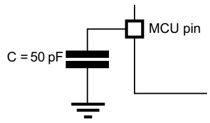MS19011V2</td><td rowspan=1 colspan=1>Figure 20. Pin input voltage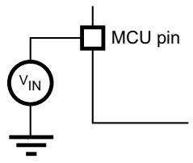MS19010V2</td></tr></table>

78/206

DS8626 Rev 12

STM32F405xx, STM32F407xx

Electrical characteristics

## 6.1.6 Power supply scheme

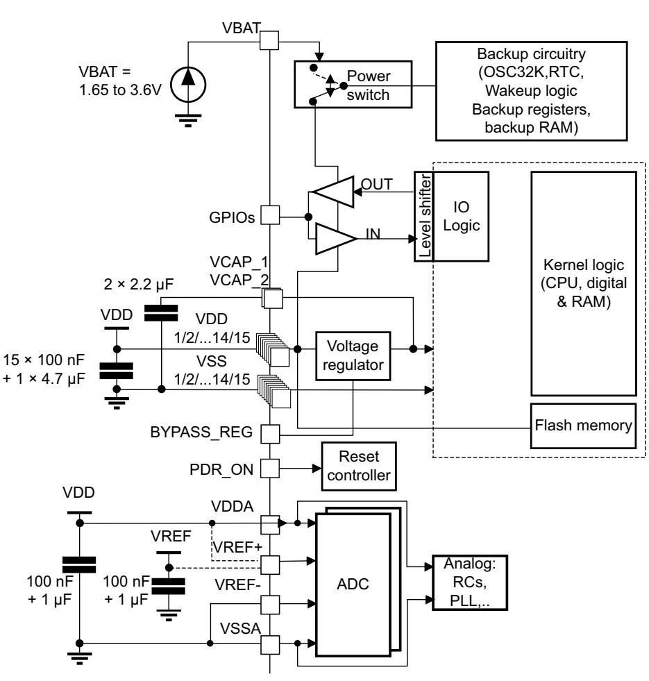

Figure 21. Power supply scheme

1. Each power supply pair must be decoupled with filtering ceramic capacitors as shown above. These capacitors must be placed as close as possible to, or below, the appropriate pins on the underside of the PCB to ensure the good functionality of the device.

2. To connect BYPASS\_REG and PDR\_ON pins, refer to Section 3.16: Voltage regulator and Table 3.15: Power supply supervisor.

3. The\_two 2.2 μF ceramic capacitors should be replaced by two 100 nF decoupling capacitors when the voltage regulator is OFF.

4. The 4.7 μF ceramic capacitor must be connected to one of the $\mathsf { V } _ { \mathsf { D D } }$ pin.

5. $\mathsf { V } _ { \mathsf { D D A } } { = } \mathsf { V } _ { \mathsf { D D } } { \mathsf { a n d } } \mathsf { V } _ { \mathsf { S S A } } { = } \mathsf { V } _ { \mathsf { S S } } .$

79/206

DS8626 Rev 12

Electrical characteristics

STM32F405xx, STM32F407xx

## 6.1.7Current consumption measurement

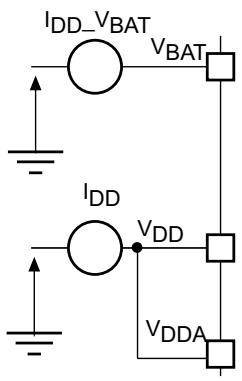

Figure 22. Current consumption measurement scheme

## 6.2 Absolute maximum ratings

Stresses above the absolute maximum ratings listed in Table 11: Voltage characteristics, Table 12: Current characteristics, and Table 13: Thermal characteristics may cause permanent damage to the device. These are stress ratings only and functional operation of the device at these conditions is not implied. Exposure to maximum rating conditions for extended periods may affect device reliability. Device mission profile (application conditions) is compliant with JEDEC JESD47 Qualification Standard, extended mission profiles are available on demand.

Table 11. Voltage characteristics

<table><tr><td rowspan=1 colspan=1>Symbol</td><td rowspan=1 colspan=1>Ratings</td><td rowspan=1 colspan=1>Min</td><td rowspan=1 colspan=1>Max</td><td rowspan=1 colspan=1>Unit</td></tr><tr><td rowspan=1 colspan=1><eq>\mathsf { V } _ { \mathsf { D } \mathsf { D } } \mathrm { - V } _ { \mathsf { S } \mathsf { S } }</eq></td><td rowspan=1 colspan=1>External main supply voltage (including<eq>\mathsf { V } _ { \mathsf { D D A } } ,</eq><eq>\overline { { \mathsf { V } _ { \mathsf { D D } } ) ^ { ( 1 ) } } }</eq></td><td rowspan=1 colspan=1>-0.3</td><td rowspan=1 colspan=1>4.0</td><td rowspan=3 colspan=1>V</td></tr><tr><td rowspan=2 colspan=1><eq>V _ { \mathsf { I N } }</eq></td><td rowspan=1 colspan=1>Input voltage on five-volt tolerant<eq>\overline { { \mathsf { p i n } ^ { ( 2 ) } } }</eq></td><td rowspan=1 colspan=1><eq>{ \mathsf { V } } _ { \mathsf { S S } } { - } 0 . 3</eq></td><td rowspan=1 colspan=1><eq>\mathsf { V } _ { \mathsf { D D } } { + 4 }</eq></td></tr><tr><td rowspan=1 colspan=1>Input voltage on any other pin</td><td rowspan=1 colspan=1><eq>{ \tt V } _ { \tt S S } { - } 0 . 3</eq></td><td rowspan=1 colspan=1>4.0</td></tr><tr><td rowspan=1 colspan=1><eq>| \Delta \mathsf { V } _ { \mathsf { D D x } } |</eq></td><td rowspan=1 colspan=1>Variations between different<eq>\mathsf { V } _ { \mathsf { D D } }</eq>power pins</td><td rowspan=1 colspan=1></td><td rowspan=1 colspan=1>50</td><td rowspan=2 colspan=1>mV</td></tr><tr><td rowspan=1 colspan=1><eq>| \mathsf { V } _ { \mathsf { S S X } } - \mathsf { V } _ { \mathsf { S S } } |</eq></td><td rowspan=1 colspan=1>Variations between all the different ground pinsincluding<eq>V _ { \mathsf { R E F - } }</eq></td><td rowspan=1 colspan=1></td><td rowspan=1 colspan=1>50</td></tr><tr><td rowspan=1 colspan=1><eq>\mathsf { V } _ { \mathsf { E S D ( H B M ) } }</eq></td><td rowspan=1 colspan=1>Electrostatic discharge voltage (human body model)</td><td rowspan=1 colspan=2>see Section 6.3.14:Absolute maximumratings (electricalsensitivity)</td><td rowspan=1 colspan=1></td></tr></table>

1. All main power $( \mathsf { V } _ { \mathsf { D D } } , \mathsf { V } _ { \mathsf { D D A } } )$ and ground $( \mathsf { V } _ { \mathsf { S S } } , \mathsf { V } _ { \mathsf { S S A } } )$ pins must always be connected to the external power supply, in the permitted range.

2. VIn maximum value must always be respected. Refer to Table 12 for the values of the maximum allowed injected current.

80/206

DS8626 Rev 12

STM32F405xx, STM32F407xx

Electrical characteristics

Table 12. Current characteristics

<table><tr><td rowspan=1 colspan=1>Symbol</td><td rowspan=1 colspan=1>Ratings</td><td rowspan=1 colspan=1>Max.</td><td rowspan=1 colspan=1>Unit</td></tr><tr><td rowspan=1 colspan=1><eq>\mathsf { I } _ { \mathsf { V D D } }</eq></td><td rowspan=1 colspan=1>Total current into<eq>\mathsf { V } _ { \mathsf { D D } }</eq>power lines<eq>\overline { { ( \mathsf { s o u r c e } ) ^ { ( 1 ) } } }</eq></td><td rowspan=1 colspan=1>240</td><td rowspan=7 colspan=1>mA</td></tr><tr><td rowspan=1 colspan=1><eq>\mathsf { I } _ { \mathsf { V S S } }</eq></td><td rowspan=1 colspan=1>Total current out of<eq>\mathsf { V } _ { \mathsf { S S } }</eq>ground lines<eq>( \mathsf { s i n k } ) ^ { ( 1 ) }</eq></td><td rowspan=1 colspan=1>240</td></tr><tr><td rowspan=2 colspan=1><eq>\mathsf { I } _ { \mathsf { I O } }</eq></td><td rowspan=1 colspan=1>Output current sunk by any l/O and control pin</td><td rowspan=1 colspan=1>25</td></tr><tr><td rowspan=1 colspan=1>Output current source by any l/Os and control pin</td><td rowspan=1 colspan=1>25</td></tr><tr><td rowspan=2 colspan=1><eq>{ \mathsf { I } } _ { { \mathsf { I N J } } ( { \mathsf { P } } \mid { \mathsf { N } } ) } ^ { ( 2 ) }</eq></td><td rowspan=1 colspan=1>Injected current on five-volt tolerant<eq>1 / \mathsf { O } ^ { ( 3 ) }</eq></td><td rowspan=1 colspan=1>-5/+0</td></tr><tr><td rowspan=1 colspan=1>Injected current on any other<eq>\mathsf { p i n } ^ { ( 4 ) }</eq></td><td rowspan=1 colspan=1>±5</td></tr><tr><td rowspan=1 colspan=1><eq>\Sigma \mathsf { I } _ { \mathsf { I N J ( P I N ) } } ( 4 )</eq></td><td rowspan=1 colspan=1>Total injected current (sum of all l/O and control<eq>\overline { { \mathsf { p i n s } ) ^ { ( 5 ) } } }</eq></td><td rowspan=1 colspan=1>±25</td></tr></table>

1. All main power $( \mathsf { V } _ { \mathsf { D } \mathsf { D } } , \mathsf { V } _ { \mathsf { D } \mathsf { D } \mathsf { A } } )$ and ground $( \mathsf { V } _ { \mathsf { S S } } , \mathsf { V } _ { \mathsf { S S A } } )$ pins must always be connected to the external power supply, in the permitted range.

2. Negative injection disturbs the analog performance of the device. See note in Section 6.3.21: 12-bit ADC characteristics

3. Positive injection is not possible on these l/Os. A negative injection is induced by $\mathsf { V } _ { ! \mathsf { N } } { \sf < V } _ { \mathsf { S } \mathsf { S } } .$ INJ(PIN) must never be exceeded. Refer to Table 11 for the values of the maximum allowed input voltage.

4. A positive injection is induced $ { \mathtt { b y } }  { \mathtt { V } } _ { 1  { \mathtt { N } } } >  { \mathtt { V } } _ { \mathrm { D D } }$ while a negative injection is induced by $\mathsf { V } _ { 1 \mathsf { N } _ { \mathrm { * } } } { < } \mathsf { V } _ { \mathsf { S } \mathsf { S } }$ . INJ(PIN) must never be exceeded. Refer to Table 11 for the values of the maximum allowed input voltage.

5. When several inputs are submitted to a current injection, the maximum $\Sigma \mathsf { I } _ { \mathsf { I N J ( P | N ) } }$ is the absolute sum of the positive and negative injected currents (instantaneous values).

Table 13. Thermal characteristics

<table><tr><td rowspan=1 colspan=1>Symbol</td><td rowspan=1 colspan=1>Ratings</td><td rowspan=1 colspan=1>Value</td><td rowspan=1 colspan=1>Unit</td></tr><tr><td rowspan=1 colspan=1><eq>{ \sf T } _ { \sf S T G }</eq></td><td rowspan=1 colspan=1>Storage temperature range</td><td rowspan=1 colspan=1>–65 to +150</td><td rowspan=1 colspan=1><eq>^ \circ \mathsf { C }</eq></td></tr><tr><td rowspan=1 colspan=1><eq>{ \mathsf { T } } _ { \mathsf { J } }</eq></td><td rowspan=1 colspan=1>Maximum junction temperature</td><td rowspan=1 colspan=1>125</td><td rowspan=1 colspan=1><eq>^ \circ { \mathsf { C } }</eq></td></tr></table>

## 6.3 Operating conditions

## 6.3.1General operating conditions

Table 14. General operating conditions

<table><tr><td colspan="1" rowspan="1">Symbol</td><td colspan="1" rowspan="1">Parameter</td><td colspan="1" rowspan="1">Conditions</td><td colspan="1" rowspan="1">Min</td><td colspan="1" rowspan="1"><eq>T y \ p</eq></td><td colspan="1" rowspan="1">Max</td><td colspan="1" rowspan="1">Unit</td></tr><tr><td colspan="1" rowspan="2">fHCLK</td><td colspan="1" rowspan="2">Internal AHB clock frequency</td><td colspan="1" rowspan="1">VOS bit in PWR_CR register = 0(1)</td><td colspan="1" rowspan="1">0</td><td colspan="1" rowspan="1"></td><td colspan="1" rowspan="1">144</td><td colspan="1" rowspan="4">MHz</td></tr><tr><td colspan="1" rowspan="1">VOS bit in PWR_CR register= 1</td><td colspan="1" rowspan="1">0</td><td colspan="1" rowspan="1">-</td><td colspan="1" rowspan="1">168</td></tr><tr><td colspan="1" rowspan="1">fPCLK1</td><td colspan="1" rowspan="1">Internal APB1 clock frequency</td><td colspan="1" rowspan="1">一</td><td colspan="1" rowspan="1">0</td><td colspan="1" rowspan="1">-</td><td colspan="1" rowspan="1">42</td></tr><tr><td colspan="1" rowspan="1"><eq>\mathsf { f } _ { \mathsf { P C L K 2 } }</eq></td><td colspan="1" rowspan="1">Internal APB2 clock frequency</td><td colspan="1" rowspan="1"></td><td colspan="1" rowspan="1">0</td><td colspan="1" rowspan="1">一</td><td colspan="1" rowspan="1">84</td></tr><tr><td colspan="1" rowspan="1"><eq>\mathsf { V } _ { \mathsf { D D } }</eq></td><td colspan="1" rowspan="1">Standard operating voltage</td><td colspan="1" rowspan="1"></td><td colspan="1" rowspan="1"><eq>1 . 8 ^ { ( 2 ) }</eq></td><td colspan="1" rowspan="1">一</td><td colspan="1" rowspan="1">3.6</td><td colspan="1" rowspan="1">V</td></tr><tr><td colspan="1" rowspan="2"><eq>{ \mathsf { V } } _ { \mathsf { D D A } } { } ^ { ( 3 ) ( 4 ) }</eq></td><td colspan="1" rowspan="1">Analog operating voltage(ADC limited to 1.2 M samples)</td><td colspan="1" rowspan="1">Must be the same potential as</td><td colspan="1" rowspan="1"><eq>1 . 8 ^ { ( 2 ) }</eq></td><td colspan="1" rowspan="1">一</td><td colspan="1" rowspan="1">2.4</td><td colspan="1" rowspan="2">V</td></tr><tr><td colspan="1" rowspan="1">Analog operating voltage(ADC limited to 1.4 M samples)</td><td colspan="1" rowspan="1"><eq>{ \mathsf { V } } _ { \mathsf { D D } } ^ { ( 5 ) }</eq></td><td colspan="1" rowspan="1">2.4</td><td colspan="1" rowspan="1">-</td><td colspan="1" rowspan="1">3.6</td></tr><tr><td colspan="1" rowspan="1"><eq>\mathsf { V } _ { \mathsf { B A T } }</eq></td><td colspan="1" rowspan="1">Backup operating voltage</td><td colspan="1" rowspan="1">-</td><td colspan="1" rowspan="1">1.65</td><td colspan="1" rowspan="1">-</td><td colspan="1" rowspan="1">3.6</td><td colspan="1" rowspan="1">V</td></tr><tr><td colspan="1" rowspan="1">Symbol</td><td colspan="1" rowspan="1">Parameter</td><td colspan="1" rowspan="1">Conditions</td><td colspan="1" rowspan="1">Min</td><td colspan="1" rowspan="1">Typ</td><td colspan="1" rowspan="1">Max</td><td colspan="1" rowspan="1">Unit</td></tr><tr><td colspan="1" rowspan="4"><eq>\mathsf { V } _ { 1 2 }</eq></td><td colspan="1" rowspan="2">Regulator ON:1.2 V internal voltage on<eq>\mathsf { V } _ { \mathsf { C A P \_ 1 } } N _ { \mathsf { C A P \_ 2 } }</eq>pins</td><td colspan="1" rowspan="1">VOS bit in PWR_CR register = 0(1)Max frequency 144MHz</td><td colspan="1" rowspan="1">1.08</td><td colspan="1" rowspan="1">1.14</td><td colspan="1" rowspan="1">1.20</td><td colspan="1" rowspan="1">V</td></tr><tr><td colspan="1" rowspan="1">VOS bit in PWR_CR register= 1Max frequency 168MHz</td><td colspan="1" rowspan="1">1.20</td><td colspan="1" rowspan="1">1.26</td><td colspan="1" rowspan="1">1.32</td><td colspan="1" rowspan="1">V</td></tr><tr><td colspan="1" rowspan="2">Regulator OFF:1.2 V external voltage must besupplied from external regulatoron<eq>\mathsf { V } _ { \mathsf { C A P \_ 1 } } / \mathsf { V } _ { \mathsf { C A P \_ 2 } } \mathsf { p i n s }</eq></td><td colspan="1" rowspan="1">Max frequency 144MHz</td><td colspan="1" rowspan="1">1.10</td><td colspan="1" rowspan="1">1.14</td><td colspan="1" rowspan="1">1.20</td><td colspan="1" rowspan="1">V</td></tr><tr><td colspan="1" rowspan="1">Max frequency 168MHz</td><td colspan="1" rowspan="1">1.20</td><td colspan="1" rowspan="1">1.26</td><td colspan="1" rowspan="1">1.30</td><td colspan="1" rowspan="1">V</td></tr><tr><td colspan="1" rowspan="4"><eq>V _ { \mathsf { I N } }</eq></td><td colspan="1" rowspan="2">Input voltage on RST and FT<eq>\mathsf { p i n s } ^ { ( 6 ) }</eq></td><td colspan="1" rowspan="1"><eq>2 \vee \le \vee _ { \mathsf { D D } } \le 3 . 6 \vee</eq></td><td colspan="1" rowspan="1">-0.3</td><td colspan="1" rowspan="1">-</td><td colspan="1" rowspan="1">5.5</td><td colspan="1" rowspan="4">V</td></tr><tr><td colspan="1" rowspan="1"><eq>\mathsf { V } _ { \mathsf { D D } } \leq 2 \mathsf { V }</eq></td><td colspan="1" rowspan="1">-0.3</td><td colspan="1" rowspan="1">-</td><td colspan="1" rowspan="1">5.2</td></tr><tr><td colspan="1" rowspan="1">Input voltage on TTa pins</td><td colspan="1" rowspan="1"></td><td colspan="1" rowspan="1">-0.3</td><td colspan="1" rowspan="1"></td><td colspan="1" rowspan="1"><eq>^ { \vee _ { \mathsf { D D A } ^ { + } } } _ { 0 . 3 }</eq></td></tr><tr><td colspan="1" rowspan="1">Input voltage on B pin</td><td colspan="1" rowspan="1">–</td><td colspan="1" rowspan="1"></td><td colspan="1" rowspan="1"></td><td colspan="1" rowspan="1">5.5</td></tr><tr><td colspan="1" rowspan="6"><eq>\mathsf { P } _ { \mathsf { D } }</eq></td><td colspan="1" rowspan="6">Power dissipation at<eq>\mathsf { T } _ { \mathsf { A } } = 8 5 ^ { \circ } \mathsf { C }</eq>for suffix 6 or<eq>\mathsf { T } _ { \mathsf { A } } = 1 0 5 ^ { \circ } \mathsf { C }</eq>forsuffix<eq>7 ^ { ( 7 ) }</eq></td><td colspan="1" rowspan="1">LQFP64</td><td colspan="1" rowspan="1">-</td><td colspan="1" rowspan="1"></td><td colspan="1" rowspan="1">435</td><td colspan="1" rowspan="6">mW</td></tr><tr><td colspan="1" rowspan="1">LQFP100</td><td colspan="1" rowspan="1"></td><td colspan="1" rowspan="1">一</td><td colspan="1" rowspan="1">465</td></tr><tr><td colspan="1" rowspan="1">LQFP144</td><td colspan="1" rowspan="1">一</td><td colspan="1" rowspan="1">1</td><td colspan="1" rowspan="1">500</td></tr><tr><td colspan="1" rowspan="1">LQFP176</td><td colspan="1" rowspan="1">一</td><td colspan="1" rowspan="1">-</td><td colspan="1" rowspan="1">526</td></tr><tr><td colspan="1" rowspan="1">UFBGA176</td><td colspan="1" rowspan="1"></td><td colspan="1" rowspan="1">-</td><td colspan="1" rowspan="1">513</td></tr><tr><td colspan="1" rowspan="1">WLCSP90</td><td colspan="1" rowspan="1">-</td><td colspan="1" rowspan="1">=</td><td colspan="1" rowspan="1">543</td></tr><tr><td colspan="1" rowspan="4"><eq>\mathsf { T A }</eq></td><td colspan="1" rowspan="2">Ambient temperature for 6 suffixversion</td><td colspan="1" rowspan="1">Maximum power dissipation</td><td colspan="1" rowspan="1">-40</td><td colspan="1" rowspan="1">-</td><td colspan="1" rowspan="1">85</td><td colspan="1" rowspan="2"><eq>^ \circ \mathsf { C }</eq></td></tr><tr><td colspan="1" rowspan="1">Low-power dissipation(8)</td><td colspan="1" rowspan="1">-40</td><td colspan="1" rowspan="1">-</td><td colspan="1" rowspan="1">105</td></tr><tr><td colspan="1" rowspan="2">Ambient temperature for 7 suffixversion</td><td colspan="1" rowspan="1">Maximum power dissipation</td><td colspan="1" rowspan="1">-40</td><td colspan="1" rowspan="1">-</td><td colspan="1" rowspan="1">105</td><td colspan="1" rowspan="2"><eq>^ \circ \mathsf { C }</eq></td></tr><tr><td colspan="1" rowspan="1">Low-power dissipation(8)</td><td colspan="1" rowspan="1">-40</td><td colspan="1" rowspan="1">-</td><td colspan="1" rowspan="1">125</td></tr><tr><td colspan="1" rowspan="2">TJ</td><td colspan="1" rowspan="2">Junction temperature range</td><td colspan="1" rowspan="1">6 suffix version</td><td colspan="1" rowspan="1">-40</td><td colspan="1" rowspan="1">–</td><td colspan="1" rowspan="1">105</td><td colspan="1" rowspan="2"><eq>^ \circ \mathsf { C }</eq></td></tr><tr><td colspan="1" rowspan="1">7 suffix version</td><td colspan="1" rowspan="1">-40</td><td colspan="1" rowspan="1">-</td><td colspan="1" rowspan="1">125</td></tr></table>

1. The average expected gain in power consumption when ${ \mathsf { V O S } } = 0$ compared to $\mathsf { V O S } = \mathsf { 1 }$ is around 10% for the whole temperature range, when the system clock frèquency is between 30 and 144 MHz.

2. $\mathsf { V } _ { \mathsf { D D } } N _ { \mathsf { D D A } }$ minimum value of 1.7 V is obtained when the device operates in reduced temperature range, and with the use of an extērnàl power supply supervisor (refer to Section 3.15.2: Intérnal reset OFF).

3. When the ADC is used, refer to Table 67: ADC characteristics.

4. If $\because V _ { R E F } .$ pin is present, it must respect the following condition: $\mathsf { V } _ { \mathsf { D D A } ^ { - } } \mathsf { V } _ { \mathsf { R E F } ^ { + } } < 1 . 2 \mathsf { V } .$

5. It is recommended to power $\mathsf { V } _ { \mathsf { D D } }$ and $\mathsf { V } _ { \mathsf { D D A } }$ from the same source. A maximum difference of 300 mV between $\mathsf { V } _ { \mathsf { D D } }$ and $\mathsf { V } _ { \mathsf { D D A } }$ can be tolerated during power-up and power-down operation.

6. To sustain a voltage higher than $\mathsf { V } _ { \mathsf { D D } } { + } 0 . 3$ , the internal pull-up and pull-down resistors must be disabled.

7. ${ \mathsf { I f } } { \mathsf { T } } _ { \mathsf { A } }$ is lower, higher $\mathsf { P } _ { \mathsf { D } }$ values are allowed as long as $\mathsf { T } _ { \mathsf { J } }$ does not exceed $\tau _ { \mathrm { J m a x } } .$

81/206

DS8626 Rev 12

Electrical characteristics

STM32F405xx, STM32F407xx

8. In low-power dissipation state, $\mathsf { T } _ { \mathsf { A } }$ can be extended to this range as long as $\mathsf { T } _ { \mathsf { J } }$ does not exceed $\tau _ { \mathrm { J m a x } } .$

82/206

DS8626 Rev 12

STM32F405xx, STM32F407xx

Electrical characteristics

Table 15. Limitations depending on the operating power supply range

<table><tr><td rowspan=1 colspan=1>Operatingpowersupplyrange</td><td rowspan=1 colspan=1>ADCoperation</td><td rowspan=1 colspan=1>Maximumflash memoryaccessfrequencywith no waitstate<eq>( f _ { \mathsf { F l a s h m a x } } )</eq></td><td rowspan=1 colspan=1>Maximum flashmemory accessfrequencywith wait<eq>\mathsf { s t a t e s } ^ { ( 1 ) ( 2 ) }</eq></td><td rowspan=1 colspan=1>I/O operation</td><td rowspan=1 colspan=1>Clock outputFrequency onI/O pins</td><td rowspan=1 colspan=1>Possibleflashmemoryoperations</td></tr><tr><td rowspan=1 colspan=1><eq>\mathsf { V } _ { \mathsf { D D } } = 1 . 8 \mathsf { t o }</eq></td><td rowspan=1 colspan=1>Conversiontime up to1.2 Msps</td><td rowspan=1 colspan=1><eq>2 0 \ M H z ^ { ( 4 ) }</eq></td><td rowspan=1 colspan=1>160 MHz with 7wait states</td><td rowspan=1 colspan=1>Degradedspeedperformance– No I/Ocompensation</td><td rowspan=1 colspan=1>up to 30 MHz</td><td rowspan=1 colspan=1>8-bit eraseand programoperationsonly</td></tr><tr><td rowspan=1 colspan=1><eq>\mathtt { V _ { D D } } = 2 . 1 \mathtt { t } \mathtt { o }</eq></td><td rowspan=1 colspan=1>Conversiontime up to1.2 Msps</td><td rowspan=1 colspan=1>22 MHz</td><td rowspan=1 colspan=1>168 MHz with 7wait states</td><td rowspan=1 colspan=1>Degradedspeedperformance– No I/Ocompensation</td><td rowspan=1 colspan=1>up to 30 MHz</td><td rowspan=1 colspan=1>16-bit eraseand programoperations</td></tr><tr><td rowspan=1 colspan=1><eq>\mathsf { V } _ { \mathsf { D D } } = 2 . 4 \mathsf { t o }</eq>2.7 V</td><td rowspan=1 colspan=1>Conversiontime up to2.4 Msps</td><td rowspan=1 colspan=1>24 MHz</td><td rowspan=1 colspan=1>168 MHz with 6wait states</td><td rowspan=1 colspan=1> Degradedspeedperformance- 1/0compensationworks</td><td rowspan=1 colspan=1>up to 48 MHz</td><td rowspan=1 colspan=1>16-bit eraseand programoperations</td></tr><tr><td rowspan=1 colspan=1><eq>\mathsf { V } _ { \mathsf { D D } } = 2 . 7 \mathrm { t }</eq>O3.6 V(5)</td><td rowspan=1 colspan=1>Conversiontime up to2.4 Msps</td><td rowspan=1 colspan=1>30 MHz</td><td rowspan=1 colspan=1>168 MHz with 5wait states</td><td rowspan=1 colspan=1>– Full-speedoperation- 1/0compensationworks</td><td rowspan=1 colspan=1>− up to60 MHzwhen<eq>\mathsf { V } _ { \mathsf { D D } } =</eq>3.0 to 3.6 V- up to48 MHzwhen<eq>\mathsf { V } _ { \mathsf { D D } } =</eq>2.7 to 3.0 V</td><td rowspan=1 colspan=1>32-bit eraseand programoperations</td></tr></table>

1. It applies only when code executed from flash memory access, when code executed from RAM, no wait state is required

2. Thanks to the ART accelerator and the 128-bit flash memory, the number of wait states given here does not impact the execution speed from flash memory since the ART accelerator allows to achieve a performance equivalent to 0 wait state program execution.

3. $\mathsf { V } _ { \mathsf { D D } } / \mathsf { V } \mathsf { D } \mathsf { D } \mathsf { A }$ minimum value of 1.7 V is obtained when the device operates in reduced temperature range, and with the use of ān external power supply supervisor (refer to Section 3.15.2: Internal reset OFF).

4. Prefetch is not available. Refer to AN3430 application note for details on how to adjust performance and power.

5. The voltage range for OTG USB FS can drop down to 2.7 V. However it is degraded between 2.7 and 3 V.

83/206

DS8626 Rev 12

Electrical characteristics

STM32F405xx, STM32F407xx

## 6.3.2 $\mathsf { V } _ { \mathsf { C A P \_ 1 } } N _ { \mathsf { C A P \_ 2 } }$ external capacitor

Stabilization for the main regulator is achieved by connecting an external capacitor CExτ to the $\mathsf { V } _ { \mathsf { C A P \_ 1 } } N _ { \mathsf { C A P \_ 2 } }$ pins. $C _ { \mathsf { E X T } }$ is specified in Table 16.

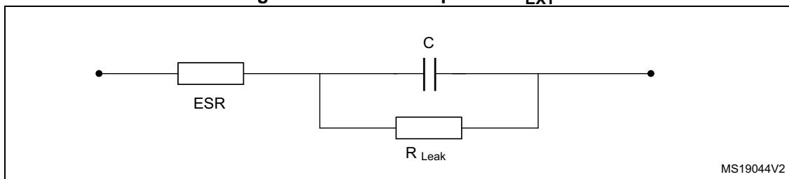

Figure 23. External capacitor CExT

1. Legend: ESR is the equivalent series resistance.

Table 16. $\mathsf { V } _ { \mathsf { C A P \_ 1 } } N _ { \mathsf { C A P \_ i } }$ 2 operating conditions(1)

<table><tr><td rowspan=1 colspan=1>Symbol</td><td rowspan=1 colspan=1>Parameter</td><td rowspan=1 colspan=1>Conditions</td></tr><tr><td rowspan=1 colspan=1>CEXT</td><td rowspan=1 colspan=1>Capacitance of external capacitor</td><td rowspan=1 colspan=1>2.2 μF</td></tr><tr><td rowspan=1 colspan=1>ESR</td><td rowspan=1 colspan=1>ESR of external capacitor</td><td rowspan=1 colspan=1><2Ω</td></tr></table>

1. When bypassing the voltage regulator, the two 2.2 μF ${ \mathsf { V } } _ { \mathsf { C A P } }$ capacitors are not required and should be replaced by two 100 nF decoupling capacitors.

## 6.3.3 Operating conditions at power-up / power-down (regulator ON)

Subject to general operating conditions for ${ \mathsf { T } } _ { \mathsf { A } } .$

Table 17. Operating conditions at power-up / power-down (regulator ON)

<table><tr><td rowspan=1 colspan=1>Symbol</td><td rowspan=1 colspan=1>Parameter</td><td rowspan=1 colspan=1>Min</td><td rowspan=1 colspan=1>Max</td><td rowspan=1 colspan=1>Unit</td></tr><tr><td rowspan=2 colspan=1>tVDD</td><td rowspan=1 colspan=1><eq>\mathsf { V } _ { \mathsf { D D } }</eq>rise time rate</td><td rowspan=1 colspan=1>20</td><td rowspan=1 colspan=1>8</td><td rowspan=2 colspan=1>μs/V</td></tr><tr><td rowspan=1 colspan=1><eq>\mathsf { V } _ { \mathsf { D D } }</eq>fall time rate</td><td rowspan=1 colspan=1>20</td><td rowspan=1 colspan=1>8</td></tr></table>

## 6.3.4 Operating conditions at power-up / power-down (regulator OFF)

Subject to general operating conditions for ${ \mathsf { T } } _ { \mathsf { A } } .$

Table 18. Operating conditions at power-up / power-down (regulator OFF)(1)

<table><tr><td rowspan=1 colspan=1>Symbol</td><td rowspan=1 colspan=1>Parameter</td><td rowspan=1 colspan=1>Conditions</td><td rowspan=1 colspan=1>Min</td><td rowspan=1 colspan=1>Max</td><td rowspan=1 colspan=1>Unit</td></tr><tr><td rowspan=2 colspan=1><eq>\mathtt { t } _ { \mathtt { V D D } }</eq></td><td rowspan=1 colspan=1><eq>\mathsf { V } _ { \mathsf { D D } }</eq>rise time rate</td><td rowspan=1 colspan=1>Power-up</td><td rowspan=1 colspan=1>20</td><td rowspan=1 colspan=1>8</td><td rowspan=4 colspan=1>μs/V</td></tr><tr><td rowspan=1 colspan=1><eq>\mathsf { V } _ { \mathsf { D D } }</eq>fall time rate</td><td rowspan=1 colspan=1>Power-down</td><td rowspan=1 colspan=1>20</td><td rowspan=1 colspan=1>8</td></tr><tr><td rowspan=2 colspan=1><eq>\mathsf { t } _ { \mathsf { V C A P } }</eq></td><td rowspan=1 colspan=1><eq>\mathsf { V } _ { \mathsf { C A P \_ 1 } }</eq>and<eq>\mathsf { V } _ { \mathsf { C A P } \_ 2 }</eq>rise timerate</td><td rowspan=1 colspan=1>Power-up</td><td rowspan=1 colspan=1>20</td><td rowspan=1 colspan=1>8</td></tr><tr><td rowspan=1 colspan=1><eq>\mathsf { V } _ { \mathsf { C A P \_ 1 } }</eq>and<eq>\mathsf { V } _ { \mathsf { C A P } \_ 2 }</eq>fall timerate</td><td rowspan=1 colspan=1>Power-down</td><td rowspan=1 colspan=1>20</td><td rowspan=1 colspan=1>8</td></tr></table>

1. To reset the internal logic at power-down, a reset must be applied on pin PA0 when $\mathsf { V } _ { \mathsf { D D } }$ reach below minimum value of $\mathsf { V } _ { 1 2 } .$

84/206

DS8626 Rev 12

STM32F405xx, STM32F407xx

Electrical characteristics

## 6.3.5 Embedded reset and power control block characteristics

The parameters given in Table 19 are derived from tests performed under ambient temperature and $\mathsf { V } _ { \mathsf { D D } }$ supply voltage conditions summarized in Table 14.

Table 19. Embedded reset and power control block characteristics

<table><tr><td colspan="1" rowspan="1">Symbol</td><td colspan="1" rowspan="1">Parameter</td><td colspan="1" rowspan="1">Conditions</td><td colspan="1" rowspan="1">Min</td><td colspan="1" rowspan="1">Typ</td><td colspan="1" rowspan="1">Max</td><td colspan="1" rowspan="1">Unit</td></tr><tr><td colspan="1" rowspan="16">VPVD</td><td colspan="1" rowspan="16">Programmable voltagedetector level selection</td><td colspan="1" rowspan="1">PLS[2:0]=000 (risingedge)</td><td colspan="1" rowspan="1">2.09</td><td colspan="1" rowspan="1">2.14</td><td colspan="1" rowspan="1">2.19</td><td colspan="1" rowspan="1">V</td></tr><tr><td colspan="1" rowspan="1">PLS[2:0]=000 (fallingedge)</td><td colspan="1" rowspan="1">1.98</td><td colspan="1" rowspan="1">2.04</td><td colspan="1" rowspan="1">2.08</td><td colspan="1" rowspan="1">V</td></tr><tr><td colspan="1" rowspan="1">PLS[2:0]=001 (risingedge)</td><td colspan="1" rowspan="1">2.23</td><td colspan="1" rowspan="1">2.30</td><td colspan="1" rowspan="1">2.37</td><td colspan="1" rowspan="1">V</td></tr><tr><td colspan="1" rowspan="1">PLS[2:0]=001 (fallingedge)</td><td colspan="1" rowspan="1">2.13</td><td colspan="1" rowspan="1">2.19</td><td colspan="1" rowspan="1">2.25</td><td colspan="1" rowspan="1">V</td></tr><tr><td colspan="1" rowspan="1">PLS[2:0]=010 (risingedge)</td><td colspan="1" rowspan="1">2.39</td><td colspan="1" rowspan="1">2.45</td><td colspan="1" rowspan="1">2.51</td><td colspan="1" rowspan="1">V</td></tr><tr><td colspan="1" rowspan="1">PLS[2:0]=010 (fallingedge)</td><td colspan="1" rowspan="1">2.29</td><td colspan="1" rowspan="1">2.35</td><td colspan="1" rowspan="1">2.39</td><td colspan="1" rowspan="1">V</td></tr><tr><td colspan="1" rowspan="1">PLS[2:0]=011 (rising edge)</td><td colspan="1" rowspan="1">2.54</td><td colspan="1" rowspan="1">2.60</td><td colspan="1" rowspan="1">2.65</td><td colspan="1" rowspan="1">V</td></tr><tr><td colspan="1" rowspan="1">PLS[2:0]=011 (fallingedge)</td><td colspan="1" rowspan="1">2.44</td><td colspan="1" rowspan="1">2.51</td><td colspan="1" rowspan="1">2.56</td><td colspan="1" rowspan="1">V</td></tr><tr><td colspan="1" rowspan="1">PLS[2:0]=100 (risingedge)</td><td colspan="1" rowspan="1">2.70</td><td colspan="1" rowspan="1">2.76</td><td colspan="1" rowspan="1">2.82</td><td colspan="1" rowspan="1">V</td></tr><tr><td colspan="1" rowspan="1">PLS[2:0]=100 (fallingedge)</td><td colspan="1" rowspan="1">2.59</td><td colspan="1" rowspan="1">2.66</td><td colspan="1" rowspan="1">2.71</td><td colspan="1" rowspan="1">V</td></tr><tr><td colspan="1" rowspan="1">PLS[2:0]=101 (risingedge)</td><td colspan="1" rowspan="1">2.86</td><td colspan="1" rowspan="1">2.93</td><td colspan="1" rowspan="1">2.99</td><td colspan="1" rowspan="1">V</td></tr><tr><td colspan="1" rowspan="1">PLS[2:0]=101 (fallingedge)</td><td colspan="1" rowspan="1">2.75</td><td colspan="1" rowspan="1">2.84</td><td colspan="1" rowspan="1">2.92</td><td colspan="1" rowspan="1">V</td></tr><tr><td colspan="1" rowspan="1">PLS[2:0]=110 (rising edge)</td><td colspan="1" rowspan="1">2.96</td><td colspan="1" rowspan="1">3.03</td><td colspan="1" rowspan="1">3.10</td><td colspan="1" rowspan="1">V</td></tr><tr><td colspan="1" rowspan="1">PLS[2:0]=110 (fallingedge)</td><td colspan="1" rowspan="1">2.85</td><td colspan="1" rowspan="1">2.93</td><td colspan="1" rowspan="1">2.99</td><td colspan="1" rowspan="1">V</td></tr><tr><td colspan="1" rowspan="1">PLS[2:0]=111 (rising edge)</td><td colspan="1" rowspan="1">3.07</td><td colspan="1" rowspan="1">3.14</td><td colspan="1" rowspan="1">3.21</td><td colspan="1" rowspan="1">V</td></tr><tr><td colspan="1" rowspan="1">PLS[2:0]=111 (fallingedge)</td><td colspan="1" rowspan="1">2.95</td><td colspan="1" rowspan="1">3.03</td><td colspan="1" rowspan="1">3.09</td><td colspan="1" rowspan="1">V</td></tr><tr><td colspan="1" rowspan="1"><eq>\overline { { \mathsf { V } _ { P \vee \mathsf { D h y s t } } ( 1 ) } }</eq></td><td colspan="1" rowspan="1">PVD hysteresis</td><td colspan="1" rowspan="1">一</td><td colspan="1" rowspan="1">-</td><td colspan="1" rowspan="1">100</td><td colspan="1" rowspan="1">-</td><td colspan="1" rowspan="1">mV</td></tr><tr><td colspan="1" rowspan="2"><eq>V _ { P O R I P D R }</eq></td><td colspan="1" rowspan="2">Power-on/power-downreset threshold</td><td colspan="1" rowspan="1">Falling edge</td><td colspan="1" rowspan="1">1.60</td><td colspan="1" rowspan="1">1.68</td><td colspan="1" rowspan="1">1.76</td><td colspan="1" rowspan="1">V</td></tr><tr><td colspan="1" rowspan="1">Rising edge</td><td colspan="1" rowspan="1">1.64</td><td colspan="1" rowspan="1">1.72</td><td colspan="1" rowspan="1">1.80</td><td colspan="1" rowspan="1">V</td></tr><tr><td colspan="1" rowspan="1"><eq>\overline { { \mathsf { V } _ { P D R h y s t } ( 1 ) } }</eq></td><td colspan="1" rowspan="1">PDR hysteresis</td><td colspan="1" rowspan="1">-</td><td colspan="1" rowspan="1">-</td><td colspan="1" rowspan="1">40</td><td colspan="1" rowspan="1">-</td><td colspan="1" rowspan="1">mV</td></tr><tr><td colspan="1" rowspan="2">VBOR1</td><td colspan="1" rowspan="2">Brownout level 1threshold</td><td colspan="1" rowspan="1">Falling edge</td><td colspan="1" rowspan="1">2.13</td><td colspan="1" rowspan="1">2.19</td><td colspan="1" rowspan="1">2.24</td><td colspan="1" rowspan="1">V</td></tr><tr><td colspan="1" rowspan="1">Rising edge</td><td colspan="1" rowspan="1">2.23</td><td colspan="1" rowspan="1">2.29</td><td colspan="1" rowspan="1">2.33</td><td colspan="1" rowspan="1">V</td></tr><tr><td colspan="1" rowspan="2"><eq>\mathsf { V } _ { \mathsf { B O R 2 } }</eq></td><td colspan="1" rowspan="2">Brownout level 2threshold</td><td colspan="1" rowspan="1">Falling edge</td><td colspan="1" rowspan="1">2.44</td><td colspan="1" rowspan="1">2.50</td><td colspan="1" rowspan="1">2.56</td><td colspan="1" rowspan="1">V</td></tr><tr><td colspan="1" rowspan="1">Rising edge</td><td colspan="1" rowspan="1">2.53</td><td colspan="1" rowspan="1">2.59</td><td colspan="1" rowspan="1">2.63</td><td colspan="1" rowspan="1">V</td></tr><tr><td colspan="1" rowspan="2"><eq>\mathsf { V } _ { \mathsf { B O R 3 } }</eq></td><td colspan="1" rowspan="2">Brownout level 3threshold</td><td colspan="1" rowspan="1">Falling edge</td><td colspan="1" rowspan="1">2.75</td><td colspan="1" rowspan="1">2.83</td><td colspan="1" rowspan="1">2.88</td><td colspan="1" rowspan="1">V</td></tr><tr><td colspan="1" rowspan="1">Rising edge</td><td colspan="1" rowspan="1">2.85</td><td colspan="1" rowspan="1">2.92</td><td colspan="1" rowspan="1">2.97</td><td colspan="1" rowspan="1">V</td></tr><tr><td colspan="1" rowspan="1"><eq>\overline { { \mathsf { V } _ { \mathsf { B O R h y s t } } ( 1 ) } }</eq></td><td colspan="1" rowspan="1">BOR hysteresis</td><td colspan="1" rowspan="1"></td><td colspan="1" rowspan="1">-</td><td colspan="1" rowspan="1">100</td><td colspan="1" rowspan="1">-</td><td colspan="1" rowspan="1">mV</td></tr><tr><td colspan="1" rowspan="1"><eq>\overline { { \mathsf { T } _ { \mathsf { R S T T E M P O } } ( 1 ) ( 2 ) } }</eq></td><td colspan="1" rowspan="1">Reset temporization</td><td colspan="1" rowspan="1"></td><td colspan="1" rowspan="1">0.5</td><td colspan="1" rowspan="1">1.5</td><td colspan="1" rowspan="1">3.0</td><td colspan="1" rowspan="1">ms</td></tr><tr><td colspan="1" rowspan="1"><eq>\mathsf { I } _ { \mathsf { R U S H } } ( 1 )</eq></td><td colspan="1" rowspan="1">InRush current onvoltage regulatorpower-on (POR orwakeup from Standby)</td><td colspan="1" rowspan="1"></td><td colspan="1" rowspan="1"></td><td colspan="1" rowspan="1">160</td><td colspan="1" rowspan="1">200</td><td colspan="1" rowspan="1">mA</td></tr><tr><td colspan="1" rowspan="1"><eq>\mathsf { E } _ { \mathsf { R U S H } } ( 1 )</eq></td><td colspan="1" rowspan="1">InRush energy onvoltage regulatorpower-on (POR orwakeup from Standby)</td><td colspan="1" rowspan="1"><eq>\mathsf { V } _ { \mathsf { D } \mathsf { D } } = 1 . 8 \mathsf { V } , \mathsf { T } _ { \mathsf { A } } = 1 0 5 ^ { \circ } \mathsf { C } ,</eq><eq>\mathsf { I } _ { \mathsf { R U S H } } = 1 7 1</eq>mA for 31 μs</td><td colspan="1" rowspan="1"></td><td colspan="1" rowspan="1"></td><td colspan="1" rowspan="1">5.4</td><td colspan="1" rowspan="1">μC</td></tr></table>

1. Specified by design.

85/206

DS8626 Rev 12

Electrical characteristics

STM32F405xx, STM32F407xx

2. The reset temporization is measured from the power-on (POR reset or wakeup from $\mathsf { V } _ { \mathsf { B A T } } )$ to the instant when first instruction is read by the user application code.

## 6.3.6Supply current characteristics

The current consumption is a function of several parameters and factors such as the operating voltage, ambient temperature, l/O pin loading, device software configuration, operating frequencies, l/O pin switching rate, program location in memory and executed binary code.

The current consumption is measured as described in Figure 22: Current consumption measurement scheme.

All Run mode current consumption measurements given in this section are performed using a CoreMark-compliant code.

## Typical and maximum current consumption

The MCU is placed under the following conditions:

•At startup, all l/O pins are configured as analog inputs by firmware.

• All peripherals are disabled except if it is explicitly mentioned.

The flash memory access time is adjusted to $\mathsf { f } _ { \mathsf { H C L K } }$ frequency (0 wait state from 0 to 30 MHz, 1 wait state from 30 to 60 MHz, 2 wait states from 60 to 90 MHz, 3 wait states from 90 to 120 MHz, 4 wait states from 120 to 150 MHz, and 5 wait states from 150 to 168 MHz).

When the peripherals are enabled HCLK is the system clock, $\mathsf { f } _ { \mathsf { P C L K 1 } } = \mathsf { f } _ { \mathsf { H C L K } } / 4$ , and $\mathsf { f } _ { \mathsf { P C L K } 2 } = \mathsf { f } _ { \mathsf { H C L K } } / 2$ , except is explicitly mentioned.

The maximum values are obtained for $\mathsf { V } _ { \mathsf { D D } } = 3 . 6 \mathsf { V }$ and maximum ambient temperature $( \mathsf { T } _ { \mathsf { A } } )$ , and the typical values for $\mathsf { T } _ { \mathsf { A } } = 2 5 \ ^ { \circ } \mathsf { C }$ and $\mathsf { V } _ { \mathsf { D D } } = 3 . 3 \mathsf { V }$ unless otherwise specified.

86/206

DS8626 Rev 12

STM32F405xx, STM32F407xx

Electrical characteristics

Table 20. Typical and maximum current consumption in Run mode, code with data processing running from flash memory (ART accelerator enabled) or RAM(1)

<table><tr><td rowspan=2 colspan=1>Symbol</td><td rowspan=2 colspan=1>Parameter</td><td rowspan=2 colspan=1>Conditions</td><td rowspan=2 colspan=1><eq>\mathtt { f } _ { \mathsf { H C L K } }</eq></td><td rowspan=1 colspan=1>Typ</td><td rowspan=1 colspan=2><eq>{ \bf M } { \bf a x } ^ { ( 2 ) }</eq></td><td rowspan=2 colspan=1>Unit</td></tr><tr><td rowspan=1 colspan=1><eq>\mathsf { T } _ { \mathsf { A } } =</eq><eq>2 5 \textdegree</eq></td><td rowspan=1 colspan=1><eq>\mathsf { T } _ { \mathsf { A } } =</eq><eq>8 5 ^ { \circ } C</eq></td><td rowspan=1 colspan=1><eq>\mathsf { T } _ { \mathsf { A } } =</eq><eq>1 0 5 ^ { \circ } C</eq></td></tr><tr><td rowspan=22 colspan=1>IDD</td><td rowspan=22 colspan=1>Supply current inRun mode</td><td rowspan=11 colspan=1>External clock(3), all]peripherals enabled(4)(5)</td><td rowspan=1 colspan=1>168 MHz</td><td rowspan=1 colspan=1>87</td><td rowspan=1 colspan=1>102</td><td rowspan=1 colspan=1>109</td><td rowspan=22 colspan=1>mA</td></tr><tr><td rowspan=1 colspan=1>144 MHz</td><td rowspan=1 colspan=1>67</td><td rowspan=1 colspan=1>80</td><td rowspan=1 colspan=1>86</td></tr><tr><td rowspan=1 colspan=1>120 MHz</td><td rowspan=1 colspan=1>56</td><td rowspan=1 colspan=1>69</td><td rowspan=1 colspan=1>75</td></tr><tr><td rowspan=1 colspan=1>90 MHz</td><td rowspan=1 colspan=1>44</td><td rowspan=1 colspan=1>56</td><td rowspan=1 colspan=1>62</td></tr><tr><td rowspan=1 colspan=1>60 MHz</td><td rowspan=1 colspan=1>30</td><td rowspan=1 colspan=1>42</td><td rowspan=1 colspan=1>49</td></tr><tr><td rowspan=1 colspan=1>30 MHz</td><td rowspan=1 colspan=1>16</td><td rowspan=1 colspan=1>28</td><td rowspan=1 colspan=1>35</td></tr><tr><td rowspan=1 colspan=1>25 MHz</td><td rowspan=1 colspan=1>12</td><td rowspan=1 colspan=1>24</td><td rowspan=1 colspan=1>31</td></tr><tr><td rowspan=1 colspan=1><eq>{ 1 6 \ M H z ^ { ( 6 ) } }</eq></td><td rowspan=1 colspan=1>9</td><td rowspan=1 colspan=1>20</td><td rowspan=1 colspan=1>28</td></tr><tr><td rowspan=1 colspan=1>8 MHz</td><td rowspan=1 colspan=1>5</td><td rowspan=1 colspan=1>17</td><td rowspan=1 colspan=1>24</td></tr><tr><td rowspan=1 colspan=1>4MHz</td><td rowspan=1 colspan=1>3</td><td rowspan=1 colspan=1>15</td><td rowspan=1 colspan=1>22</td></tr><tr><td rowspan=1 colspan=1>2 MHz</td><td rowspan=1 colspan=1>2</td><td rowspan=1 colspan=1>14</td><td rowspan=1 colspan=1>21</td></tr><tr><td rowspan=11 colspan=1>External clock(3), allperipherals disabled(4)(5)</td><td rowspan=1 colspan=1>168 MHz</td><td rowspan=1 colspan=1>40</td><td rowspan=1 colspan=1>54</td><td rowspan=1 colspan=1>61</td></tr><tr><td rowspan=1 colspan=1>144 MHz</td><td rowspan=1 colspan=1>31</td><td rowspan=1 colspan=1>43</td><td rowspan=1 colspan=1>50</td></tr><tr><td rowspan=1 colspan=1>120 MHz</td><td rowspan=1 colspan=1>26</td><td rowspan=1 colspan=1>38</td><td rowspan=1 colspan=1>45</td></tr><tr><td rowspan=1 colspan=1>90 MHz</td><td rowspan=1 colspan=1>20</td><td rowspan=1 colspan=1>32</td><td rowspan=1 colspan=1>39</td></tr><tr><td rowspan=1 colspan=1>60 MHz</td><td rowspan=1 colspan=1>14</td><td rowspan=1 colspan=1>26</td><td rowspan=1 colspan=1>33</td></tr><tr><td rowspan=1 colspan=1>30 MHz</td><td rowspan=1 colspan=1>8</td><td rowspan=1 colspan=1>20</td><td rowspan=1 colspan=1>27</td></tr><tr><td rowspan=1 colspan=1>25 MHz</td><td rowspan=1 colspan=1>6</td><td rowspan=1 colspan=1>18</td><td rowspan=1 colspan=1>25</td></tr><tr><td rowspan=1 colspan=1><eq>{ 1 6 \ M H z ^ { ( 6 ) } }</eq></td><td rowspan=1 colspan=1>5</td><td rowspan=1 colspan=1>16</td><td rowspan=1 colspan=1>24</td></tr><tr><td rowspan=1 colspan=1>8 MHz</td><td rowspan=1 colspan=1>3</td><td rowspan=1 colspan=1>15</td><td rowspan=1 colspan=1>22</td></tr><tr><td rowspan=1 colspan=1>4MHz</td><td rowspan=1 colspan=1>2</td><td rowspan=1 colspan=1>14</td><td rowspan=1 colspan=1>21</td></tr><tr><td rowspan=1 colspan=1>2 MHz</td><td rowspan=1 colspan=1>2</td><td rowspan=1 colspan=1>14</td><td rowspan=1 colspan=1>21</td></tr></table>

1. Code and data processing running from SRAM1 using boot pins.

2. Evaluated by characterization, tested in production at $\mathsf { V } _ { \mathsf { D D } }$ max and $\mathsf { f } _ { \mathsf { H C L K } }$ max with peripherals enabled

3. External clock is 4 MHz and PLL is on when $\mathsf { f } _ { \mathsf { H C L K } } :$ >25 MHz.

4. When the $\mathsf { A D C }$ is ON (ADON bit set in the ADC\_CR2 register), add an additional power consumption of 1.6 mA per ADC for the analog part.

5. When analog peripheral blocks such as ADCs, DACs, HSE, LSE, HSI, or LSI are ON, an additional power consumption should be considered.

6. In this case HCLK = system clock/2.

87/206

DS8626 Rev 12

Electrical characteristics

STM32F405xx, STM32F407xx

Table 21. Typical and maximum current consumption in Run mode, code with data processing running from flash memory (ART accelerator disabled)

<table><tr><td rowspan=2 colspan=1>Symbol</td><td rowspan=2 colspan=1>Parameter</td><td rowspan=2 colspan=1>Conditions</td><td rowspan=2 colspan=1>fHCLK</td><td rowspan=1 colspan=1>Typ</td><td rowspan=1 colspan=2><eq>{ \pmb M } { \bf a x } ^ { ( 1 ) }</eq></td><td rowspan=2 colspan=1>Unit</td></tr><tr><td rowspan=1 colspan=1><eq>\bar { \mathsf { T } } _ { \mathsf { A } } = 2 5 ^ { \circ } { \mathsf { C } }</eq></td><td rowspan=1 colspan=1><eq>\bar { \mathsf { T } } _ { \mathsf { A } } = 8 5 ^ { \circ } { \mathsf { C } }</eq></td><td rowspan=1 colspan=1><eq>\bar { \mathsf { T } } _ { \mathsf { A } } = 1 0 5 ^ { \circ } { \mathsf { C } }</eq></td></tr><tr><td rowspan=22 colspan=1>IDD</td><td rowspan=22 colspan=1>Supply currentin Run mode</td><td rowspan=11 colspan=1>External clock(²),all peripheralsenabled(3)(4)</td><td rowspan=1 colspan=1>168 MHz</td><td rowspan=1 colspan=1>93</td><td rowspan=1 colspan=1>109</td><td rowspan=1 colspan=1>117</td><td rowspan=22 colspan=1>mA</td></tr><tr><td rowspan=1 colspan=1>144 MHz</td><td rowspan=1 colspan=1>76</td><td rowspan=1 colspan=1>89</td><td rowspan=1 colspan=1>96</td></tr><tr><td rowspan=1 colspan=1>120 MHz</td><td rowspan=1 colspan=1>67</td><td rowspan=1 colspan=1>79</td><td rowspan=1 colspan=1>86</td></tr><tr><td rowspan=1 colspan=1>90 MHz</td><td rowspan=1 colspan=1>53</td><td rowspan=1 colspan=1>65</td><td rowspan=1 colspan=1>73</td></tr><tr><td rowspan=1 colspan=1>60 MHz</td><td rowspan=1 colspan=1>37</td><td rowspan=1 colspan=1>49</td><td rowspan=1 colspan=1>56</td></tr><tr><td rowspan=1 colspan=1>30 MHz</td><td rowspan=1 colspan=1>20</td><td rowspan=1 colspan=1>32</td><td rowspan=1 colspan=1>39</td></tr><tr><td rowspan=1 colspan=1>25 MHz</td><td rowspan=1 colspan=1>16</td><td rowspan=1 colspan=1>27</td><td rowspan=1 colspan=1>35</td></tr><tr><td rowspan=1 colspan=1>16 MHz</td><td rowspan=1 colspan=1>11</td><td rowspan=1 colspan=1>23</td><td rowspan=1 colspan=1>30</td></tr><tr><td rowspan=1 colspan=1>8 MHz</td><td rowspan=1 colspan=1>6</td><td rowspan=1 colspan=1>18</td><td rowspan=1 colspan=1>25</td></tr><tr><td rowspan=1 colspan=1>4 MHz</td><td rowspan=1 colspan=1>4</td><td rowspan=1 colspan=1>16</td><td rowspan=1 colspan=1>23</td></tr><tr><td rowspan=1 colspan=1>2 MHz</td><td rowspan=1 colspan=1>3</td><td rowspan=1 colspan=1>15</td><td rowspan=1 colspan=1>22</td></tr><tr><td rowspan=11 colspan=1>External clock(²),all peripheralsdisabled(3)(4)</td><td rowspan=1 colspan=1>168 MHz</td><td rowspan=1 colspan=1>46</td><td rowspan=1 colspan=1>61</td><td rowspan=1 colspan=1>69</td></tr><tr><td rowspan=1 colspan=1>144 MHz</td><td rowspan=1 colspan=1>40</td><td rowspan=1 colspan=1>52</td><td rowspan=1 colspan=1>60</td></tr><tr><td rowspan=1 colspan=1>120 MHz</td><td rowspan=1 colspan=1>37</td><td rowspan=1 colspan=1>48</td><td rowspan=1 colspan=1>56</td></tr><tr><td rowspan=1 colspan=1>90 MHz</td><td rowspan=1 colspan=1>30</td><td rowspan=1 colspan=1>42</td><td rowspan=1 colspan=1>50</td></tr><tr><td rowspan=1 colspan=1>60 MHz</td><td rowspan=1 colspan=1>22</td><td rowspan=1 colspan=1>33</td><td rowspan=1 colspan=1>41</td></tr><tr><td rowspan=1 colspan=1>30 MHz</td><td rowspan=1 colspan=1>12</td><td rowspan=1 colspan=1>24</td><td rowspan=1 colspan=1>31</td></tr><tr><td rowspan=1 colspan=1>25 MHz</td><td rowspan=1 colspan=1>10</td><td rowspan=1 colspan=1>21</td><td rowspan=1 colspan=1>29</td></tr><tr><td rowspan=1 colspan=1>16 MHz</td><td rowspan=1 colspan=1>7</td><td rowspan=1 colspan=1>19</td><td rowspan=1 colspan=1>26</td></tr><tr><td rowspan=1 colspan=1>8 MHz</td><td rowspan=1 colspan=1>4</td><td rowspan=1 colspan=1>16</td><td rowspan=1 colspan=1>23</td></tr><tr><td rowspan=1 colspan=1>4MHz</td><td rowspan=1 colspan=1>3</td><td rowspan=1 colspan=1>15</td><td rowspan=1 colspan=1>22</td></tr><tr><td rowspan=1 colspan=1>2 MHz</td><td rowspan=1 colspan=1>2</td><td rowspan=1 colspan=1>14</td><td rowspan=1 colspan=1>21</td></tr></table>

1. Evaluated by characterization, tested in production at $\mathsf { V } _ { \mathsf { D D } }$ max and $\mathsf { f } _ { \mathsf { H C L K } }$ max with peripherals enabled.

2. External clock is 4 MHz and PLL is on when fHCLk > 25 MHz.

3. When analog peripheral blocks such as (ADCs, DACs, HSE, LSE, HSI,LSI) are on, an additional power consumption should be considered.

4. When the ADC is ON (ADON bit set in the ADC\_CR2 register), add an additional power consumption of 1.6 mA per ADC for the analog part.

88/206

DS8626 Rev 12

STM32F405xx, STM32F407xx

Electrical characteristics

Figure 24. Typical current consumption versus temperature, Run mode, code with data processing running from flash (ART accelerator ON) or RAM, and peripherals OFF

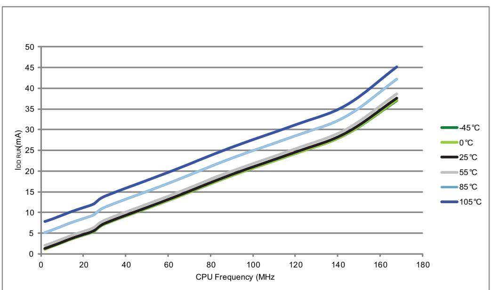

Figure 25. Typical current consumption versus temperature, Run mode, code with data processing running from flash (ART accelerator ON) or RAM, and peripherals ON

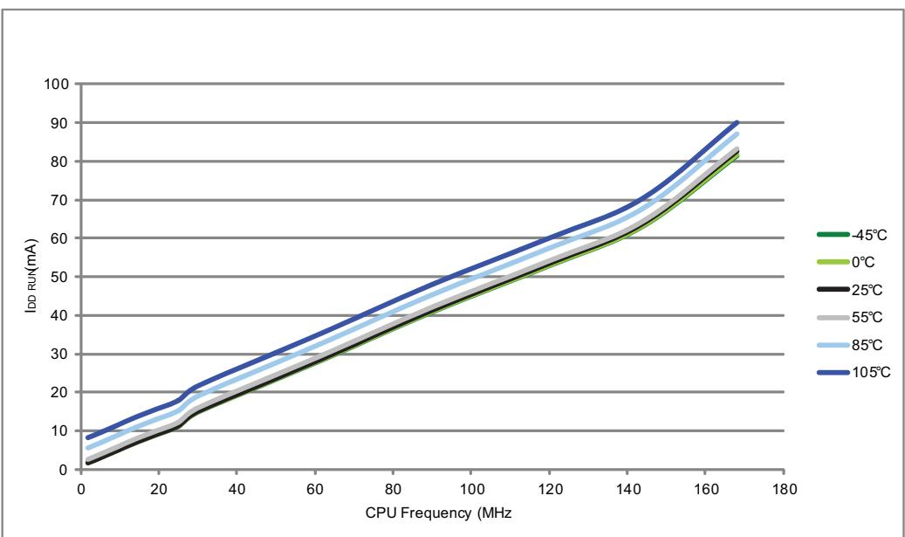

89/206

DS8626 Rev 12

Electrical characteristics

STM32F405xx, STM32F407xx

Figure 26. Typical current consumption versus temperature, Run mode, code with data processing running from flash (ART accelerator OFF) or RAM, and peripherals OFF

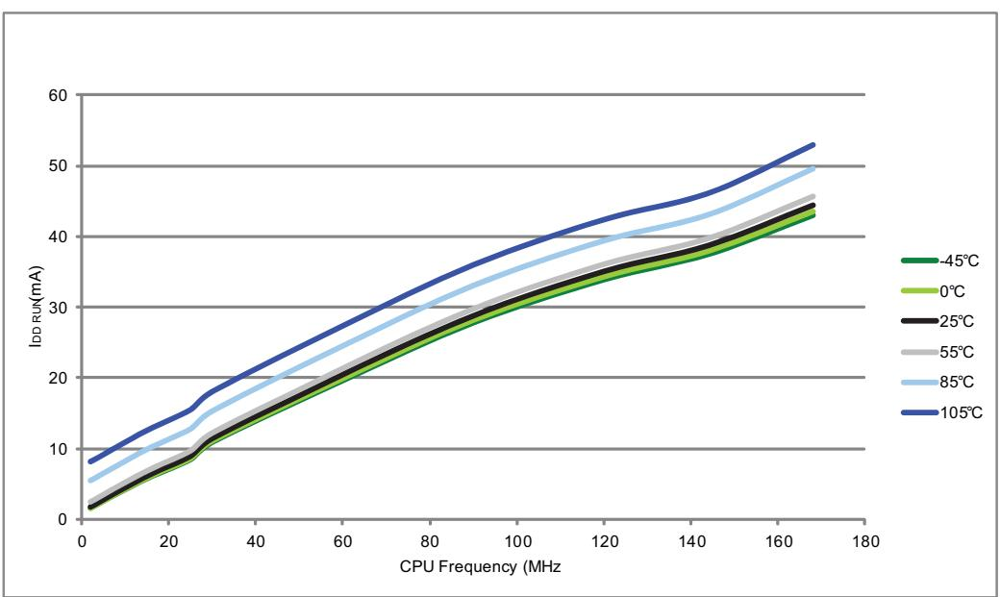

Figure 27. Typical current consumption versus temperature, Run mode, code with data processing running from flash (ART accelerator OFF) or RAM, and peripherals ON

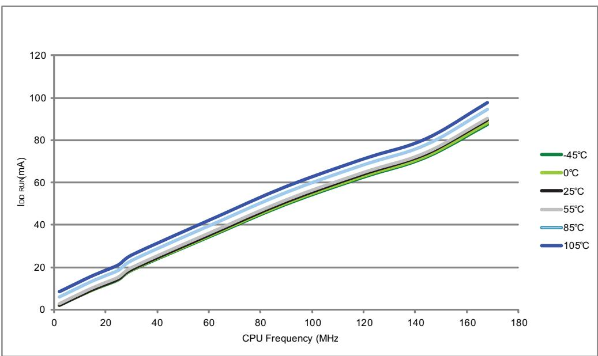

90/206

DS8626 Rev 12

STM32F405xx, STM32F407xx

Electrical characteristics

Table 22. Typical and maximum current consumption in Sleep mode

<table><tr><td rowspan=2 colspan=1>Symbol</td><td rowspan=2 colspan=1>Parameter</td><td rowspan=2 colspan=1>Conditions</td><td rowspan=2 colspan=1>fHCLK</td><td rowspan=1 colspan=1><eq>T y \ p</eq></td><td rowspan=1 colspan=2><eq>{ \pmb M } { \bf a x } ^ { ( 1 ) }</eq></td><td rowspan=2 colspan=1>Unit</td></tr><tr><td rowspan=1 colspan=1><eq>\begin{array} { c } { \mathsf { T } _ { \mathsf { A } } = } \\ { 2 5 ^ { \circ } { \mathsf { C } } } \end{array}</eq></td><td rowspan=1 colspan=1><eq>\begin{array} { c } { \mathsf { T } _ { \mathsf { A } } = } \\ { 8 5 ^ { \circ } { \mathsf { c } } } \end{array}</eq></td><td rowspan=1 colspan=1><eq>\mathsf { T } _ { \mathsf { A } } =</eq><eq>1 0 5 ^ { \circ } C</eq></td></tr><tr><td rowspan=22 colspan=1>IDD</td><td rowspan=11 colspan=1>Supply current in</td><td rowspan=11 colspan=1>External clock(2),all peripherals enabled(3)</td><td rowspan=1 colspan=1>168 MHz</td><td rowspan=1 colspan=1>59</td><td rowspan=1 colspan=1>77</td><td rowspan=1 colspan=1>84</td><td rowspan=22 colspan=1>mA</td></tr><tr><td rowspan=1 colspan=1>144 MHz</td><td rowspan=1 colspan=1>46</td><td rowspan=1 colspan=1>61</td><td rowspan=1 colspan=1>67</td></tr><tr><td rowspan=1 colspan=1>120 MHz</td><td rowspan=1 colspan=1>38</td><td rowspan=1 colspan=1>53</td><td rowspan=1 colspan=1>60</td></tr><tr><td rowspan=1 colspan=1>90 MHz</td><td rowspan=1 colspan=1>30</td><td rowspan=1 colspan=1>44</td><td rowspan=1 colspan=1>51</td></tr><tr><td rowspan=1 colspan=1>60 MHz</td><td rowspan=1 colspan=1>20</td><td rowspan=1 colspan=1>34</td><td rowspan=1 colspan=1>41</td></tr><tr><td rowspan=1 colspan=1>30 MHz</td><td rowspan=1 colspan=1>11</td><td rowspan=1 colspan=1>24</td><td rowspan=1 colspan=1>31</td></tr><tr><td rowspan=1 colspan=1>25 MHz</td><td rowspan=1 colspan=1>8</td><td rowspan=1 colspan=1>21</td><td rowspan=1 colspan=1>28</td></tr><tr><td rowspan=1 colspan=1>16 MHz</td><td rowspan=1 colspan=1>6</td><td rowspan=1 colspan=1>18</td><td rowspan=1 colspan=1>25</td></tr><tr><td rowspan=1 colspan=1>8 MHz</td><td rowspan=1 colspan=1>3</td><td rowspan=1 colspan=1>16</td><td rowspan=1 colspan=1>23</td></tr><tr><td rowspan=1 colspan=1>4MHz</td><td rowspan=1 colspan=1>2</td><td rowspan=1 colspan=1>15</td><td rowspan=1 colspan=1>22</td></tr><tr><td rowspan=1 colspan=1>2 MHz</td><td rowspan=1 colspan=1>2</td><td rowspan=1 colspan=1>14</td><td rowspan=1 colspan=1>21</td></tr><tr><td rowspan=11 colspan=1>Sleep mode</td><td rowspan=11 colspan=1>External clock(²), allperipherals disabled</td><td rowspan=1 colspan=1>168 MHz</td><td rowspan=1 colspan=1>12</td><td rowspan=1 colspan=1>27</td><td rowspan=1 colspan=1>35</td></tr><tr><td rowspan=1 colspan=1>144 MHz</td><td rowspan=1 colspan=1>9</td><td rowspan=1 colspan=1>22</td><td rowspan=1 colspan=1>29</td></tr><tr><td rowspan=1 colspan=1>120 MHz</td><td rowspan=1 colspan=1>8</td><td rowspan=1 colspan=1>20</td><td rowspan=1 colspan=1>28</td></tr><tr><td rowspan=1 colspan=1>90 MHz</td><td rowspan=1 colspan=1>7</td><td rowspan=1 colspan=1>19</td><td rowspan=1 colspan=1>26</td></tr><tr><td rowspan=1 colspan=1>60 MHz</td><td rowspan=1 colspan=1>5</td><td rowspan=1 colspan=1>17</td><td rowspan=1 colspan=1>24</td></tr><tr><td rowspan=1 colspan=1>30 MHz</td><td rowspan=1 colspan=1>3</td><td rowspan=1 colspan=1>16</td><td rowspan=1 colspan=1>23</td></tr><tr><td rowspan=1 colspan=1>25 MHz</td><td rowspan=1 colspan=1>2</td><td rowspan=1 colspan=1>15</td><td rowspan=1 colspan=1>22</td></tr><tr><td rowspan=1 colspan=1>16 MHz</td><td rowspan=1 colspan=1>2</td><td rowspan=1 colspan=1>14</td><td rowspan=1 colspan=1>21</td></tr><tr><td rowspan=1 colspan=1>8 MHz</td><td rowspan=1 colspan=1>1</td><td rowspan=1 colspan=1>14</td><td rowspan=1 colspan=1>21</td></tr><tr><td rowspan=1 colspan=1>4MHz</td><td rowspan=1 colspan=1>1</td><td rowspan=1 colspan=1>13</td><td rowspan=1 colspan=1>21</td></tr><tr><td rowspan=1 colspan=1>2 MHz</td><td rowspan=1 colspan=1>1</td><td rowspan=1 colspan=1>13</td><td rowspan=1 colspan=1>21</td></tr></table>

1. Evaluated by characterization, tested in production at $\mathsf { V } _ { \mathsf { D D } }$ max and $\mathsf { f } _ { \mathsf { H C L K } }$ max with peripherals enabled.

2. External clock is 4 MHz and PLL is on when $f _ { \mathsf { H C L K } } > 2 5$ MHz.

3. Add an additional power consumption of 1.6 mA per ADC for the analog part. In applications, this consumption occurs only while the ADC is ON (ADON bit is set in the ADC\_CR2 register).

91/206

DS8626 Rev 12

Electrical characteristics

STM32F405xx, STM32F407xx

Table 23. Typical and maximum current consumptions in Stop mode

<table><tr><td rowspan=2 colspan=1>Symbol</td><td rowspan=2 colspan=1>Parameter</td><td rowspan=2 colspan=1>Conditions</td><td rowspan=1 colspan=1>Typ</td><td rowspan=1 colspan=3>Max</td><td rowspan=2 colspan=1>Unit</td></tr><tr><td rowspan=1 colspan=1><eq>\mathsf { T } _ { \mathsf { A } } =</eq><eq>\pmb { 2 5 } \circ _ { \mathbf { C } }</eq></td><td rowspan=1 colspan=1><eq>\mathsf { T } _ { \mathsf { A } } =</eq><eq>\tt a s \tt ^ { \circ } \tt c</eq></td><td rowspan=1 colspan=1><eq>\mathsf { T } _ { \mathsf { A } } =</eq><eq>\ B E ^ { \circ } \ C</eq></td><td rowspan=1 colspan=1><eq>\mathsf { T } _ { \mathsf { A } } =</eq><eq>1 0 5 ^ { \circ } C</eq></td></tr><tr><td rowspan=4 colspan=1>IDD_STOP</td><td rowspan=2 colspan=1>Supplycurrent inStop modewith mainregulator inRun mode</td><td rowspan=1 colspan=1>Flash in Stop mode, low-speed and high-speed internal RC oscillators and high-speedoscillator OFF (no independent watchdog)</td><td rowspan=1 colspan=1>0.45</td><td rowspan=1 colspan=1>1.5</td><td rowspan=1 colspan=1>11.00</td><td rowspan=1 colspan=1>20.00</td><td rowspan=4 colspan=1>mA</td></tr><tr><td rowspan=1 colspan=1>Flash in Deep power-down mode, low-speedand high-speed internal RC oscillators andhigh-speed oscillator OFF (no independentwatchdog)</td><td rowspan=1 colspan=1>0.40</td><td rowspan=1 colspan=1>1.5</td><td rowspan=1 colspan=1>11.00</td><td rowspan=1 colspan=1>20.00</td></tr><tr><td rowspan=2 colspan=1>Supplycurrent inStop modewith mainregulator inLow-powermode</td><td rowspan=1 colspan=1>Flash in Stop mode, low-speed and high-speed internal RC oscillators and high-speedoscillator OFF (no independent watchdog)</td><td rowspan=1 colspan=1>0.31</td><td rowspan=1 colspan=1>1.1</td><td rowspan=1 colspan=1>8.00</td><td rowspan=1 colspan=1>15.00</td></tr><tr><td rowspan=1 colspan=1>Flash in Deep power-down mode, low-speedand high-speed internal RC oscillators andhigh-speed oscillator OFF (no independentwatchdog)</td><td rowspan=1 colspan=1>0.28</td><td rowspan=1 colspan=1>1.1</td><td rowspan=1 colspan=1>8.00</td><td rowspan=1 colspan=1>15.00</td></tr></table>

Table 24. Typical and maximum current consumptions in Standby mode

<table><tr><td rowspan=3 colspan=1>Symbol</td><td rowspan=3 colspan=1>Parameter</td><td rowspan=3 colspan=1>Conditions</td><td rowspan=1 colspan=3>Typ</td><td rowspan=1 colspan=2><eq>{ \pmb { M } } \mathbf { a x } ^ { ( 1 ) }</eq></td><td rowspan=3 colspan=1>Unit</td></tr><tr><td rowspan=1 colspan=3><eq>\bar { \mathsf { T } } _ { \mathsf { A } } = 2 5 ^ { \circ } { \mathsf { C } }</eq></td><td rowspan=1 colspan=1><eq>\mathsf { T } _ { \mathsf { A } } =</eq><eq>8 5 ^ { \circ } C</eq></td><td rowspan=1 colspan=1><eq>\mathsf { T } _ { \mathsf { A } } =</eq><eq>1 0 5 ^ { \circ } C</eq></td></tr><tr><td rowspan=1 colspan=1><eq>\mathsf { v } _ { \mathsf { D } \mathsf { D } } =</eq>1.8 V</td><td rowspan=1 colspan=1><eq>\boldsymbol { \mathsf { v } } _ { \mathsf { D } \mathsf { D } } \mathbf { \equiv }</eq>2.4 V</td><td rowspan=1 colspan=1><eq>\mathsf { v _ { D D } = }</eq>3.3 V</td><td rowspan=1 colspan=2><eq>V _ { \mathsf { D D } } = 3 . 6 ~ \mathsf { V }</eq></td></tr><tr><td rowspan=4 colspan=1>IDD_STBY</td><td rowspan=4 colspan=1>Supply currentin Standbymode</td><td rowspan=1 colspan=1>Backup SRAM ON, low-speed oscillator and RTC ON</td><td rowspan=1 colspan=1>3.0</td><td rowspan=1 colspan=1>3.4</td><td rowspan=1 colspan=1>4.0</td><td rowspan=1 colspan=1>20</td><td rowspan=1 colspan=1>36</td><td rowspan=4 colspan=1>μA</td></tr><tr><td rowspan=1 colspan=1>Backup SRAM OFF, low-speed oscillator and RTC ON</td><td rowspan=1 colspan=1>2.4</td><td rowspan=1 colspan=1>2.7</td><td rowspan=1 colspan=1>3.3</td><td rowspan=1 colspan=1>16</td><td rowspan=1 colspan=1>32</td></tr><tr><td rowspan=1 colspan=1>Backup SRAM ON, RTCOFF</td><td rowspan=1 colspan=1>2.4</td><td rowspan=1 colspan=1>2.6</td><td rowspan=1 colspan=1>3.0</td><td rowspan=1 colspan=1>12.5</td><td rowspan=1 colspan=1>24.8</td></tr><tr><td rowspan=1 colspan=1>Backup SRAM OFF, RTCOFF</td><td rowspan=1 colspan=1>1.7</td><td rowspan=1 colspan=1>1.9</td><td rowspan=1 colspan=1>2.2</td><td rowspan=1 colspan=1>9.8</td><td rowspan=1 colspan=1>19.2</td></tr></table>

1. Evaluated by characterization - not tested in production.

92/206

DS8626 Rev 12

STM32F405xx, STM32F407xx

Electrical characteristics

MS19990V1

Table 25. Typical and maximum current consumptions in $\mathsf { v } _ { \mathsf { B A T } }$ mode

<table><tr><td rowspan=3 colspan=1>Symbol</td><td rowspan=3 colspan=1>Parameter</td><td rowspan=3 colspan=1>Conditions</td><td rowspan=1 colspan=3>Typ</td><td rowspan=1 colspan=2><eq>\mathbf { \Delta } \mathbf { M } \mathbf { a x } ^ { ( 1 ) }</eq></td><td rowspan=3 colspan=1>Unit</td></tr><tr><td rowspan=1 colspan=3><eq>\bar { \mathsf { T } } _ { \mathsf { A } } = 2 5 ^ { \circ } { \mathsf { C } }</eq></td><td rowspan=1 colspan=1><eq>\begin{array} { c } { \mathsf { T } _ { \mathsf { A } } = } \\ { 8 5 ^ { \circ } { \mathsf { C } } } \end{array}</eq></td><td rowspan=1 colspan=1><eq>\yen 123,456</eq>105℃</td></tr><tr><td rowspan=1 colspan=1><eq>\begin{array} { r } { \mathsf { v } _ { \mathsf { B A T } } } \\ { = } \end{array}</eq>1.8 V</td><td rowspan=1 colspan=1><eq>v _ { B A T } =</eq>2.4 V</td><td rowspan=1 colspan=1><eq>\mathsf { v } _ { \mathsf { B A T } }</eq>=3.3 V</td><td rowspan=1 colspan=2><eq>\mathsf { V } _ { \mathsf { B A T } } = 3 . 6 \mathsf { V }</eq></td></tr><tr><td rowspan=4 colspan=1><eq>1 _ { \mathsf { D D \_ V B A } }</eq>T</td><td rowspan=4 colspan=1>Backupdomainsupplycurrent</td><td rowspan=1 colspan=1>Backup SRAM ON, low-speedoscillator and RTC ON</td><td rowspan=1 colspan=1>1.29</td><td rowspan=1 colspan=1>1.42</td><td rowspan=1 colspan=1>1.68</td><td rowspan=1 colspan=1>6</td><td rowspan=1 colspan=1>11</td><td rowspan=4 colspan=1>μA</td></tr><tr><td rowspan=1 colspan=1>Backup SRAM OFF, low-speedoscillator and RTC ON</td><td rowspan=1 colspan=1>0.62</td><td rowspan=1 colspan=1>0.73</td><td rowspan=1 colspan=1>0.96</td><td rowspan=1 colspan=1>3</td><td rowspan=1 colspan=1>5</td></tr><tr><td rowspan=1 colspan=1>Backup SRAM ON, RTC OFF</td><td rowspan=1 colspan=1>0.79</td><td rowspan=1 colspan=1>0.81</td><td rowspan=1 colspan=1>0.86</td><td rowspan=1 colspan=1>5</td><td rowspan=1 colspan=1>10</td></tr><tr><td rowspan=1 colspan=1>Backup SRAM OFF, RTC OFF</td><td rowspan=1 colspan=1>0.10</td><td rowspan=1 colspan=1>0.10</td><td rowspan=1 colspan=1>0.10</td><td rowspan=1 colspan=1>2</td><td rowspan=1 colspan=1>4</td></tr></table>

1. Evaluated by characterization - not tested in production.

Figure 28. Typical $\underline { v _ { \mathsf { B A T } } }$ current consumption (LSE and RTC ON/backup RAM OFF)

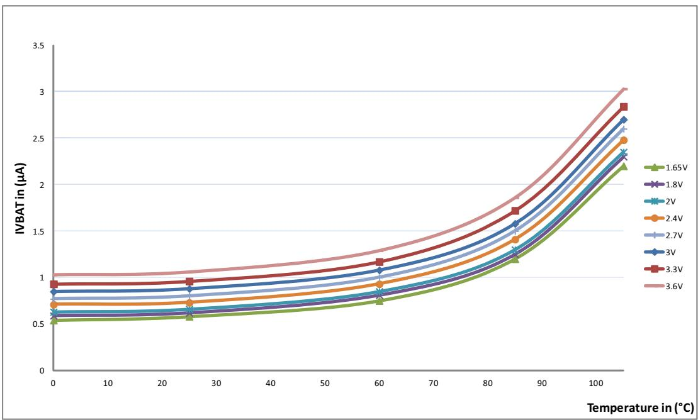

93/206

DS8626 Rev 12

Electrical characteristics

STM32F405xx, STM32F407xx

MS19991V1

Figure 29. Typical $v _ { B A T }$ current consumption (LSE and RTC ON/backup RAM ON)

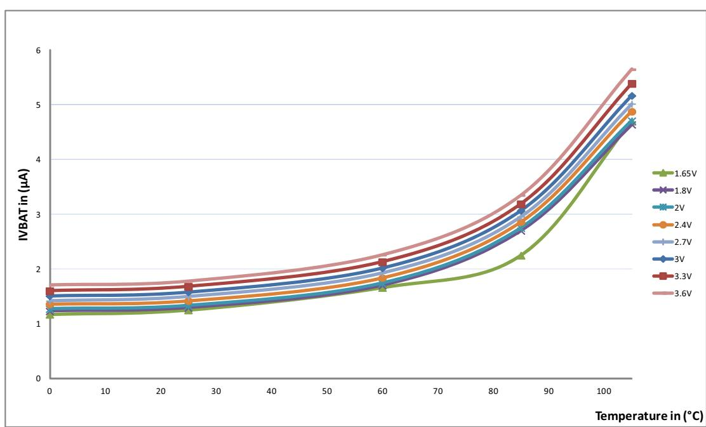

## Additional current consumption

The MCU is placed under the following conditions:

• All l/O pins are configured in analog mode.

• The flash memory access time is adjusted to $\mathsf { f } _ { \mathsf { H C L K } }$ frequency.

• The voltage scaling is adjusted to $\mathsf { f } _ { \mathsf { H C L K } }$ frequency as follows:

Scale 2 for $\mathsf { f } _ { \mathsf { H C L K } } \leq 1 4 4 ~ \mathsf { M H z }$

Scale 1 for 144 MHz $< P _ { \mathrm { H C L K } } \leq 1 6 8 ~ \mathsf { M H } z .$

• The system clock is HCLK, $\mathsf { f } _ { \mathsf { P C L K 1 } } = \mathsf { f } _ { \mathsf { H C L K } } / 4$ , and $\mathsf { f } _ { \mathsf { P C L K 2 } } = \mathsf { f } _ { \mathsf { H C L K } } / 2$

• The HSE crystal clock frequency is 25 MHz.

${ \mathsf { T } } _ { \mathsf { A } } = 2 5 { \mathsf { \Omega } } ^ { \circ } { \mathsf { C } } .$

94/206

DS8626 Rev 12

STM32F405xx, STM32F407xx

Electrical characteristics

Table 26. Typical current consumption in Run mode, code with data processing running from flash memory, regulator ON (ART accelerator enabled except prefetch), $\mathsf { V } _ { \mathsf { D D } } = \mathsf { i } . 8 \mathsf { V } ^ { ( 1 ) }$

<table><tr><td rowspan=1 colspan=1>Symbol</td><td rowspan=1 colspan=1>Parameter</td><td rowspan=1 colspan=1>Conditions</td><td rowspan=1 colspan=1><eq>{ \bf f } _ { { \sf H C L K } } \left( { \sf M H z } \right)</eq></td><td rowspan=1 colspan=1>Typ. at<eq>\mathsf { T } _ { \mathsf { A } } =</eq><eq>\tt^ { 2 5 } ^ { \circ } \tt C</eq></td><td rowspan=1 colspan=1>Unit</td></tr><tr><td rowspan=7 colspan=1>IDD</td><td rowspan=7 colspan=1>Supply current inRun mode</td><td rowspan=7 colspan=1>All peripheraldisabled</td><td rowspan=1 colspan=1>160</td><td rowspan=1 colspan=1>36.2</td><td rowspan=7 colspan=1>mA</td></tr><tr><td rowspan=1 colspan=1>144</td><td rowspan=1 colspan=1>29.3</td></tr><tr><td rowspan=1 colspan=1>120</td><td rowspan=1 colspan=1>24.7</td></tr><tr><td rowspan=1 colspan=1>90</td><td rowspan=1 colspan=1>19.3</td></tr><tr><td rowspan=1 colspan=1>60</td><td rowspan=1 colspan=1>13.4</td></tr><tr><td rowspan=1 colspan=1>30</td><td rowspan=1 colspan=1>7.7</td></tr><tr><td rowspan=1 colspan=1>25</td><td rowspan=1 colspan=1>6.0</td></tr></table>

1. When peripherals are enabled, the power consumption corresponding to the analog part of the peripherals (such as ADC or DAC) is not included.

## I/O system current consumption

The current consumption of the l/O system has two components: static and dynamic.

## I/O static current consumption

All the l/Os used as input with pull-up or pull-down generate current consumption when the pin is externally held to the opposite level. The value of this current consumption can be simply computed by using the pull-up/pull-down resistors values given in Table 48: I/O static characteristics.

For the output pins, any internal or external pull-up or pull-down and external load must also be considered to estimate the current consumption.

Additional l/O current consumption is due to l/Os configured as inputs if an intermediate voltage level is externally applied. This current consumption is caused by the input Schmitt trigger circuits used to discriminate the input value. Unless this specific configuration is required by the application, this supply current consumption can be avoided by configuring these l/Os in analog mode. This is notably the case of ADC input pins which should be configured as analog inputs.

Caution: Any floating input pin can also settle to an intermediate voltage level or switch inadvertently, as a result of external electromagnetic noise. To avoid current consumption related to floating pins, they must either be configured in analog mode, or forced internally to a definite digital value. This can be done either by using pull-up/down resistors or by configuring the pins in output mode.

## I/O dynamic current consumption

In addition to the internal peripheral current consumption measured previously (see Table 28: Peripheral current consumption), the l/Os used by an application also contribute to the current consumption. When an l/O pin switches, it uses the current from the MCU supply voltage to supply the l/O pin circuitry and to charge/discharge the capacitive load internal and external connected to the pin:

$$
{ \sf I } _ { \sf S W } = \sf V _ { \sf D D } \times { \sf f } _ { \sf S W } \times { \sf C }
$$

95/206

DS8626 Rev 12

Electrical characteristics

STM32F405xx, STM32F407xx

## where

Isw is the current sunk by a switching l/O to charge/discharge the capacitive load

$\mathsf { V } _ { \mathsf { D D } }$ is the MCU supply voltage

$\mathsf { f } _ { \mathsf { S W } }$ is the l/O switching frequency

C is the total capacitance seen by the l/O pin: $\mathsf { C } = \mathsf { C } _ { | \mathsf { N T } ^ { + } } \mathsf { C } _ { \mathsf { E X T } }$

The test pin is configured in push-pull output mode and is toggled by software at a fixed frequency.

96/206

DS8626 Rev 12

STM32F405xx, STM32F407xx

Electrical characteristics

Table 27. Switching output l/O current consumption

<table><tr><td rowspan=1 colspan=1>Symbol</td><td rowspan=1 colspan=1>Parameter</td><td rowspan=1 colspan=1><eq>\mathtt { c o n d i t i o n s } ^ { ( 1 ) }</eq></td><td rowspan=1 colspan=1>I/O togglingfrequency<eq>( \hslash \hslash )</eq></td><td rowspan=1 colspan=1>Typ</td><td rowspan=1 colspan=1>Unit</td></tr><tr><td rowspan=25 colspan=1>IDDIO</td><td rowspan=25 colspan=1>I/O switchingcurrent</td><td rowspan=5 colspan=1><eq>\mathsf { V } _ { \mathsf { D D } } = 3 . 3 \mathsf { V } ^ { ( 2 ) }</eq><eq>\mathsf { C } = \mathsf { C } _ { \mathsf { I N T } }</eq></td><td rowspan=1 colspan=1>2 MHz</td><td rowspan=1 colspan=1>0.02</td><td rowspan=25 colspan=1>mA</td></tr><tr><td rowspan=1 colspan=1>8MHz</td><td rowspan=1 colspan=1>0.14</td></tr><tr><td rowspan=1 colspan=1>25 MHz</td><td rowspan=1 colspan=1>0.51</td></tr><tr><td rowspan=1 colspan=1>50 MHz</td><td rowspan=1 colspan=1>0.86</td></tr><tr><td rowspan=1 colspan=1>60 MHz</td><td rowspan=1 colspan=1>1.30</td></tr><tr><td rowspan=5 colspan=1><eq>\mathsf { V } _ { \mathsf { D D } } = 3 . 3 \mathsf { V }</eq><eq>\mathsf { C } _ { \mathsf { E X T } } = 0 \mathsf { p F }</eq><eq>\mathsf { C } = \mathsf { C } _ { \mathsf { I N T } } + \mathsf { C } _ { \mathsf { E X T } } + \mathsf { C } _ { \mathsf { S } }</eq></td><td rowspan=1 colspan=1>2 MHz</td><td rowspan=1 colspan=1>0.10</td></tr><tr><td rowspan=1 colspan=1>8 MHz</td><td rowspan=1 colspan=1>0.38</td></tr><tr><td rowspan=1 colspan=1>25 MHz</td><td rowspan=1 colspan=1>1.18</td></tr><tr><td rowspan=1 colspan=1>50 MHz</td><td rowspan=1 colspan=1>2.47</td></tr><tr><td rowspan=1 colspan=1>60 MHz</td><td rowspan=1 colspan=1>2.86</td></tr><tr><td rowspan=5 colspan=1><eq>\mathsf { V } _ { \mathsf { D D } } = 3 . 3 \mathsf { V }</eq><eq>\mathsf { C } _ { \mathsf { E X T } } = 1 0 \mathsf { p F }</eq><eq>\mathsf { C } = \mathsf { C } _ { \mathsf { I N T } } + \mathsf { C } _ { \mathsf { E X T } ^ { + } } \mathsf { C } _ { \mathsf { S } }</eq></td><td rowspan=1 colspan=1>2 MHz</td><td rowspan=1 colspan=1>0.17</td></tr><tr><td rowspan=1 colspan=1>8MHz</td><td rowspan=1 colspan=1>0.66</td></tr><tr><td rowspan=1 colspan=1>25 MHz</td><td rowspan=1 colspan=1>1.70</td></tr><tr><td rowspan=1 colspan=1>50 MHz</td><td rowspan=1 colspan=1>2.65</td></tr><tr><td rowspan=1 colspan=1>60 MHz</td><td rowspan=1 colspan=1>3.48</td></tr><tr><td rowspan=5 colspan=1><eq>\mathsf { V } _ { \mathsf { D D } } = 3 . 3 \mathsf { V }</eq><eq>\mathsf C _ { \mathsf E \mathsf X \mathsf T } = 2 2 \mathsf { p F }</eq><eq>\mathsf { C } = \mathsf { C } _ { \mathsf { I N T } } + \mathsf { C } _ { \mathsf { E X T } ^ { + } } \mathsf { C } _ { \mathsf { S } }</eq></td><td rowspan=1 colspan=1>2 MHz</td><td rowspan=1 colspan=1>0.23</td></tr><tr><td rowspan=1 colspan=1>8MHz</td><td rowspan=1 colspan=1>0.95</td></tr><tr><td rowspan=1 colspan=1>25 MHz</td><td rowspan=1 colspan=1>3.20</td></tr><tr><td rowspan=1 colspan=1>50 MHz</td><td rowspan=1 colspan=1>4.69</td></tr><tr><td rowspan=1 colspan=1>60 MHz</td><td rowspan=1 colspan=1>8.06</td></tr><tr><td rowspan=5 colspan=1><eq>\mathsf { V } _ { \mathsf { D D } } = 3 . 3 \mathsf { V }</eq><eq>\mathsf { C } _ { \mathsf { E X T } } = 3 3 \mathsf { p F }</eq><eq>\mathsf { C } = \mathsf { C } _ { \mathsf { I N T } } + \mathsf { C } _ { \mathsf { E X T } ^ { + } } \mathsf { C } _ { \mathsf { S } }</eq></td><td rowspan=1 colspan=1>2 MHz</td><td rowspan=1 colspan=1>0.30</td></tr><tr><td rowspan=1 colspan=1>8 MHz</td><td rowspan=1 colspan=1>1.22</td></tr><tr><td rowspan=1 colspan=1>25 MHz</td><td rowspan=1 colspan=1>3.90</td></tr><tr><td rowspan=1 colspan=1>50 MHz</td><td rowspan=1 colspan=1>8.82</td></tr><tr><td rowspan=1 colspan=1>60 MHz</td><td rowspan=1 colspan=1>_(3)</td></tr></table>

1. ${ \sf C } _ { \sf S }$ is the PCB board capacitance including the pad pin. $\mathtt { C } _ { \mathtt { S } } = 7$ pF (estimated value).

2. This test is performed by cutting the LQFP package pin (pad removal).

3. At 60 MHz, C maximum load is specified 30 pF.

97/206

DS8626 Rev 12

Electrical characteristics

STM32F405xx, STM32F407xx

## On-chip peripheral current consumption

The current consumption of the on-chip peripherals is given in Table 28. The MCU is placed under the following conditions:

• At startup, all l/O pins are configured as analog pins by firmware.

•All peripherals are disabled unless otherwise mentioned

The code is running from flash memory and the flash memory access time is equal to 5 wait states at 168 MHz.

The code is running from flash memory and the flash memory access time is equal to 4 wait states at 144 MHz, and the power scale mode is set to 2.

• The ART accelerator is ON.

•The given value is calculated by measuring the difference of current consumption with all peripherals clocked off

– with one peripheral clocked on (with only the clock applied)

When the peripherals are enabled: HCLK is the system clock, $\mathsf { f } _ { \mathsf { P C L K 1 } } = \mathsf { f } _ { \mathsf { H C L K } } / 4$ , and $\mathsf { f } _ { \mathsf { P C L K } 2 } = \mathsf { f } _ { \mathsf { H C L K } } / 2$

The typical values are obtained for $\mathsf { V } _ { \mathsf { D D } } = 3 . 3 \mathsf { V }$ and $\mathsf { T } _ { \mathsf { A } } = 2 5 \ ^ { \circ } \mathsf { C }$ unless otherwise specified.

Table 28. Peripheral current consumption

<table><tr><td colspan="2" rowspan="2">Peripheral</td><td colspan="2" rowspan="1">IDD(Typ)(1)</td><td colspan="1" rowspan="2">Unit</td></tr><tr><td colspan="1" rowspan="1">Scale1(up t 168 MHz)</td><td colspan="1" rowspan="1">Scale2(up to 144 MHz)</td></tr><tr><td colspan="1" rowspan="15">AHB1(up to 168 MHz)</td><td colspan="1" rowspan="1">GPIOA</td><td colspan="1" rowspan="1">2.70</td><td colspan="1" rowspan="1">2.40</td><td colspan="1" rowspan="15">μA/MHz</td></tr><tr><td colspan="1" rowspan="1">GPIOB</td><td colspan="1" rowspan="1">2.50</td><td colspan="1" rowspan="1">2.22</td></tr><tr><td colspan="1" rowspan="1">GPIOC</td><td colspan="1" rowspan="1">2.54</td><td colspan="1" rowspan="1">2.28</td></tr><tr><td colspan="1" rowspan="1">GPIOD</td><td colspan="1" rowspan="1">2.55</td><td colspan="1" rowspan="1">2.28</td></tr><tr><td colspan="1" rowspan="1">GPIOE</td><td colspan="1" rowspan="1">2.68</td><td colspan="1" rowspan="1">2.40</td></tr><tr><td colspan="1" rowspan="1">GPIOF</td><td colspan="1" rowspan="1">2.53</td><td colspan="1" rowspan="1">2.28</td></tr><tr><td colspan="1" rowspan="1">GPIOG</td><td colspan="1" rowspan="1">2.51</td><td colspan="1" rowspan="1">2.22</td></tr><tr><td colspan="1" rowspan="1">GPIOH</td><td colspan="1" rowspan="1">2.51</td><td colspan="1" rowspan="1">2.22</td></tr><tr><td colspan="1" rowspan="1">GPIOI</td><td colspan="1" rowspan="1">2.50</td><td colspan="1" rowspan="1">2.22</td></tr><tr><td colspan="1" rowspan="1">OTG_HS+ULPI</td><td colspan="1" rowspan="1">28.33</td><td colspan="1" rowspan="1">25.38</td></tr><tr><td colspan="1" rowspan="1">CRC</td><td colspan="1" rowspan="1">0.41</td><td colspan="1" rowspan="1">0.40</td></tr><tr><td colspan="1" rowspan="1">BKPSRAM</td><td colspan="1" rowspan="1">0.63</td><td colspan="1" rowspan="1">0.58</td></tr><tr><td colspan="1" rowspan="1">DMA1</td><td colspan="1" rowspan="1">37.44</td><td colspan="1" rowspan="1">33.58</td></tr><tr><td colspan="1" rowspan="1">DMA2</td><td colspan="1" rowspan="1">37.69</td><td colspan="1" rowspan="1">33.93</td></tr><tr><td colspan="1" rowspan="1">ETH_MACETH_MAC_TXETH_MAC_RXETH_MAC_PTP</td><td colspan="1" rowspan="1">20.43</td><td colspan="1" rowspan="1">18.39</td></tr><tr><td colspan="1" rowspan="3">AHB2(up to 168 MHz)</td><td colspan="1" rowspan="1">OTG_FS</td><td colspan="1" rowspan="1">26.45</td><td colspan="1" rowspan="1">26.67</td><td colspan="1" rowspan="3">μA/MHz</td></tr><tr><td colspan="1" rowspan="1">DCMI</td><td colspan="1" rowspan="1">5.87</td><td colspan="1" rowspan="1">5.35</td></tr><tr><td colspan="1" rowspan="1">RNG</td><td colspan="1" rowspan="1">1.50</td><td colspan="1" rowspan="1">1.67</td></tr><tr><td colspan="1" rowspan="1">AHB3(up to 168 MHz)</td><td colspan="1" rowspan="1">FSMC</td><td colspan="1" rowspan="1">12.46</td><td colspan="1" rowspan="1">11.31</td><td colspan="1" rowspan="1">μA/MHz</td></tr><tr><td colspan="2" rowspan="1">Bus matrix(2)</td><td colspan="1" rowspan="1">13.10</td><td colspan="1" rowspan="1">11.81</td><td colspan="1" rowspan="1">μA/MHz</td></tr><tr><td colspan="1" rowspan="25">APB1(up to 42 MHz)</td><td colspan="1" rowspan="1">TIM2</td><td colspan="1" rowspan="1">16.71</td><td colspan="1" rowspan="1">16.50</td><td colspan="1" rowspan="25">μA/MHz</td></tr><tr><td colspan="1" rowspan="1">TIM3</td><td colspan="1" rowspan="1">12.33</td><td colspan="1" rowspan="1">11.94</td></tr><tr><td colspan="1" rowspan="1">TIM4</td><td colspan="1" rowspan="1">13.45</td><td colspan="1" rowspan="1">12.92</td></tr><tr><td colspan="1" rowspan="1">TIM5</td><td colspan="1" rowspan="1">17.14</td><td colspan="1" rowspan="1">16.58</td></tr><tr><td colspan="1" rowspan="1">TIM6</td><td colspan="1" rowspan="1">2.43</td><td colspan="1" rowspan="1">3.06</td></tr><tr><td colspan="1" rowspan="1">TIM7</td><td colspan="1" rowspan="1">2.43</td><td colspan="1" rowspan="1">2.22</td></tr><tr><td colspan="1" rowspan="1">TIM12</td><td colspan="1" rowspan="1">6.62</td><td colspan="1" rowspan="1">6.83</td></tr><tr><td colspan="1" rowspan="1">TIM13</td><td colspan="1" rowspan="1">5.05</td><td colspan="1" rowspan="1">5.47</td></tr><tr><td colspan="1" rowspan="1">TIM14</td><td colspan="1" rowspan="1">5.26</td><td colspan="1" rowspan="1">5.61</td></tr><tr><td colspan="1" rowspan="1">PWR</td><td colspan="1" rowspan="1">1.00</td><td colspan="1" rowspan="1">0.56</td></tr><tr><td colspan="1" rowspan="1">USART2</td><td colspan="1" rowspan="1">2.69</td><td colspan="1" rowspan="1">2.78</td></tr><tr><td colspan="1" rowspan="1">USART3</td><td colspan="1" rowspan="1">2.74</td><td colspan="1" rowspan="1">2.78</td></tr><tr><td colspan="1" rowspan="1">UART4</td><td colspan="1" rowspan="1">3.24</td><td colspan="1" rowspan="1">3.33</td></tr><tr><td colspan="1" rowspan="1">UART5</td><td colspan="1" rowspan="1">2.69</td><td colspan="1" rowspan="1">2.78</td></tr><tr><td colspan="1" rowspan="1">I2C1</td><td colspan="1" rowspan="1">2.67</td><td colspan="1" rowspan="1">2.50</td></tr><tr><td colspan="1" rowspan="1">I2C2</td><td colspan="1" rowspan="1">2.83</td><td colspan="1" rowspan="1">2.78</td></tr><tr><td colspan="1" rowspan="1">I2C3</td><td colspan="1" rowspan="1">2.81</td><td colspan="1" rowspan="1">2.78</td></tr><tr><td colspan="1" rowspan="1">SPI2</td><td colspan="1" rowspan="1">2.43</td><td colspan="1" rowspan="1">2.22</td></tr><tr><td colspan="1" rowspan="1">SPI3</td><td colspan="1" rowspan="1">2.43</td><td colspan="1" rowspan="1">2.22</td></tr><tr><td colspan="1" rowspan="1">I2S2(3)</td><td colspan="1" rowspan="1">2.43</td><td colspan="1" rowspan="1">2.22</td></tr><tr><td colspan="1" rowspan="1">I2S3(3)</td><td colspan="1" rowspan="1">2.26</td><td colspan="1" rowspan="1">2.22</td></tr><tr><td colspan="1" rowspan="1">CAN1</td><td colspan="1" rowspan="1">5.12</td><td colspan="1" rowspan="1">5.56</td></tr><tr><td colspan="1" rowspan="1">CAN2</td><td colspan="1" rowspan="1">4.81</td><td colspan="1" rowspan="1">5.28</td></tr><tr><td colspan="1" rowspan="1">DAC(4)</td><td colspan="1" rowspan="1">1.67</td><td colspan="1" rowspan="1">1.67</td></tr><tr><td colspan="1" rowspan="1">WWDG</td><td colspan="1" rowspan="1">1.00</td><td colspan="1" rowspan="1">0.83</td></tr><tr><td colspan="1" rowspan="13">APB2(up to 84 MHz)</td><td colspan="1" rowspan="1">SDIO</td><td colspan="1" rowspan="1">7.08</td><td colspan="1" rowspan="1">7.92</td><td colspan="1" rowspan="13">μA/MHz</td></tr><tr><td colspan="1" rowspan="1">TIM1</td><td colspan="1" rowspan="1">16.79</td><td colspan="1" rowspan="1">15.51</td></tr><tr><td colspan="1" rowspan="1">TIM8</td><td colspan="1" rowspan="1">17.88</td><td colspan="1" rowspan="1">16.53</td></tr><tr><td colspan="1" rowspan="1">TIM9</td><td colspan="1" rowspan="1">7.64</td><td colspan="1" rowspan="1">7.28</td></tr><tr><td colspan="1" rowspan="1">TIM10</td><td colspan="1" rowspan="1">4.89</td><td colspan="1" rowspan="1">4.82</td></tr><tr><td colspan="1" rowspan="1">TIM11</td><td colspan="1" rowspan="1">5.19</td><td colspan="1" rowspan="1">4.82</td></tr><tr><td colspan="1" rowspan="1">ADC1(5)</td><td colspan="1" rowspan="1">4.67</td><td colspan="1" rowspan="1">4.58</td></tr><tr><td colspan="1" rowspan="1">ADC2(5)</td><td colspan="1" rowspan="1">4.67</td><td colspan="1" rowspan="1">4.58</td></tr><tr><td colspan="1" rowspan="1">ADC3(5)</td><td colspan="1" rowspan="1">4.43</td><td colspan="1" rowspan="1">4.44</td></tr><tr><td colspan="1" rowspan="1">SPI1</td><td colspan="1" rowspan="1">1.32</td><td colspan="1" rowspan="1">1.39</td></tr><tr><td colspan="1" rowspan="1">USART1</td><td colspan="1" rowspan="1">3.51</td><td colspan="1" rowspan="1">3.72</td></tr><tr><td colspan="1" rowspan="1">USART6</td><td colspan="1" rowspan="1">3.55</td><td colspan="1" rowspan="1">3.75</td></tr><tr><td colspan="1" rowspan="1">SYSCFG</td><td colspan="1" rowspan="1">0.74</td><td colspan="1" rowspan="1">0.56</td></tr></table>

1. When the l/O compensation cell is ON, Ipp typical value increases by 0.22 mA.

2. The BusMatrix is automatically active when at least one master is ON.

3. To enable an I2S peripheral, first set the I2SMOD bit and then the I2SE bit in the SPI\_I2SCFGR register

4. When the DAC is ON and EN1/2 bits are set in DAC\_CR register, add an additional power consumption of 0.8 mA per DAC channel for the analog part.

5. When the ADC is ON (ADON bit set in the ADC\_CR2 register), add an additional power consumption of 1.6 mA per ADC for thè analog part.

98/206

DS8626 Rev 12

STM32F405xx, STM32F407xx

Electrical characteristics

DS8626 Rev 12

99/206

Electrical characteristics

STM32F405xx, STM32F407xx

## 6.3.7 Wakeup time from low-power mode

The wakeup times given in Table 29 is measured on a wakeup phase with a 16 MHz HSl RC oscillator. The clock source used to wake up the device depends from the current operating mode:

• Stop or Standby mode: the clock source is the RC oscillator

• Sleep mode: the clock source is the clock that was set before entering Sleep mode.

All timings are derived from tests performed under ambient temperature and $\mathsf { V } _ { \mathsf { D D } }$ supply voltage conditions summarized in Table 14.

100/206

DS8626 Rev 12

STM32F405xx, STM32F407xx

Electrical characteristics

Table 29. Low-power mode wakeup timings

<table><tr><td rowspan=1 colspan=1>Symbol</td><td rowspan=1 colspan=1>Parameter</td><td rowspan=1 colspan=1><eq>\mathsf { M i n } ^ { ( 1 ) }</eq></td><td rowspan=1 colspan=1><eq>{ \mathsf { T y p } } ^ { ( 1 ) }</eq></td><td rowspan=1 colspan=1><eq>{ \pmb { M } } \mathbf { a x } ^ { ( 1 ) }</eq></td><td rowspan=1 colspan=1>Unit</td></tr><tr><td rowspan=1 colspan=1><eq>\mathsf { t } _ { \mathsf { W U S L E E P } } ( 2 )</eq></td><td rowspan=1 colspan=1>Wakeup from Sleep mode</td><td rowspan=1 colspan=1></td><td rowspan=1 colspan=1>5</td><td rowspan=1 colspan=1></td><td rowspan=1 colspan=1>CPUclockcycle</td></tr><tr><td rowspan=4 colspan=1><eq>\mathsf { t } _ { \mathsf { W U S T O P } } ( 2 )</eq></td><td rowspan=1 colspan=1>Wakeup from Stop mode (regulator in Run mode andflash memory in Stop mode)</td><td rowspan=1 colspan=1></td><td rowspan=1 colspan=1>13</td><td rowspan=1 colspan=1>一</td><td rowspan=4 colspan=1>μs</td></tr><tr><td rowspan=1 colspan=1>Wakeup from Stop mode (regulator in low-power modeand flash memory in Stop mode)</td><td rowspan=1 colspan=1></td><td rowspan=1 colspan=1>17</td><td rowspan=1 colspan=1>40</td></tr><tr><td rowspan=1 colspan=1>Wakeup from Stop mode (regulator in Run mode andflash memory in Deep power-down mode)</td><td rowspan=1 colspan=1></td><td rowspan=1 colspan=1>105</td><td rowspan=1 colspan=1>一</td></tr><tr><td rowspan=1 colspan=1>Wakeup from Stop mode (regulator in low-power modeand flash memory in Deep power-down mode)</td><td rowspan=1 colspan=1></td><td rowspan=1 colspan=1>110</td><td rowspan=1 colspan=1></td></tr><tr><td rowspan=1 colspan=1><eq>\overline { { { \mathrm { t } } _ { \mathsf { W U S T D B Y } } ( 2 ) ( 3 ) } }</eq></td><td rowspan=1 colspan=1>Wakeup from Standby mode</td><td rowspan=1 colspan=1>260</td><td rowspan=1 colspan=1>375</td><td rowspan=1 colspan=1>480</td><td rowspan=1 colspan=1>μs</td></tr></table>

1. Evaluated by characterization - not tested in production.

2. The wakeup times are measured from the wakeup event to the point in which the application code reads the first instruction.

3. twustDBy minimum and maximum values are given at $1 0 5 ~ ^ { \circ } \mathrm { C }$ and $- 4 5 ^ { \circ } \mathsf { C }$ , respectively.

## 6.3.8External clock source characteristics

## High-speed external user clock generated from an external source

The characteristics given in Table 30 result from tests performed using an high-speed external clock source, and under ambient temperature and supply voltage conditions summarized in Table 14.

Table 30. High-speed external user clock characteristics

<table><tr><td rowspan=1 colspan=1>Symbol</td><td rowspan=1 colspan=1>Parameter</td><td rowspan=1 colspan=4>Conditions</td><td rowspan=1 colspan=1>Min</td><td rowspan=1 colspan=1>Typ</td><td rowspan=1 colspan=1>Max</td><td rowspan=1 colspan=1>Unit</td></tr><tr><td rowspan=1 colspan=1><eq>\mathsf { f } _ { \mathsf { H S E \_ e x t } }</eq></td><td rowspan=1 colspan=1>External user clock sourcefrequency(1)</td><td rowspan=2 colspan=4></td><td rowspan=1 colspan=1>1</td><td rowspan=1 colspan=1>一</td><td rowspan=1 colspan=1>50</td><td rowspan=1 colspan=1>MHz</td></tr><tr><td rowspan=1 colspan=1><eq>V _ { H S E H }</eq></td><td rowspan=1 colspan=1>OSC_IN input pin high level voltage</td><td rowspan=1 colspan=2></td><td rowspan=1 colspan=1></td><td rowspan=1 colspan=1><eq>0 . 7 \mathsf { V } _ { \mathsf { D } \mathsf { D } }</eq></td><td rowspan=1 colspan=1>一</td><td rowspan=1 colspan=1><eq>\mathsf { V } _ { \mathsf { D D } }</eq></td><td rowspan=3 colspan=1>V</td></tr><tr><td rowspan=2 colspan=1><eq>V _ { \mathsf { H S E L } }</eq></td><td rowspan=2 colspan=1>OSC_IN input pin low level voltage</td><td rowspan=2 colspan=1></td><td rowspan=1 colspan=1></td><td rowspan=2 colspan=2></td><td rowspan=2 colspan=1><eq>\mathsf { V } _ { \mathsf { S S } }</eq></td><td rowspan=2 colspan=1>1</td><td rowspan=2 colspan=1><eq>0 . 3 \mathsf { V } _ { \mathsf { D } \mathsf { D } }</eq></td></tr><tr><td rowspan=1 colspan=2></td></tr><tr><td rowspan=1 colspan=1>tw(HSE)tw(HSE)</td><td rowspan=1 colspan=1>OSC_IN high or low time(1)</td><td rowspan=1 colspan=4></td><td rowspan=1 colspan=1>5</td><td rowspan=1 colspan=1></td><td rowspan=1 colspan=1>一</td><td rowspan=2 colspan=1>ns</td></tr><tr><td rowspan=1 colspan=1>tr(HSE))tf(HSE)</td><td rowspan=1 colspan=1>OSC_IN rise or fall time(1)</td><td rowspan=1 colspan=4></td><td rowspan=1 colspan=1></td><td rowspan=1 colspan=1>一</td><td rowspan=1 colspan=1>10</td></tr><tr><td rowspan=1 colspan=1><eq>\mathsf { C } _ { \mathsf { i n ( H S E ) } }</eq></td><td rowspan=1 colspan=1>OSC_IN input capacitance(1)</td><td rowspan=1 colspan=4></td><td rowspan=1 colspan=1>-</td><td rowspan=1 colspan=1>5</td><td rowspan=1 colspan=1>-</td><td rowspan=1 colspan=1>pF</td></tr><tr><td rowspan=1 colspan=1><eq>\mathsf { D u C y } _ { ( \mathsf { H S E } ) }</eq></td><td rowspan=1 colspan=1>Duty cycle</td><td rowspan=1 colspan=4></td><td rowspan=1 colspan=1>45</td><td rowspan=1 colspan=1>-</td><td rowspan=1 colspan=1>55</td><td rowspan=1 colspan=1>%</td></tr><tr><td rowspan=1 colspan=1><eq>\mathsf { I } _ { \mathsf { L } }</eq></td><td rowspan=1 colspan=1>OSC_IN Input leakage current</td><td rowspan=1 colspan=4><eq>\mathsf { V } _ { \mathsf { S } \mathsf { S } } \mathsf { A } _ { \mathsf { I N } } \mathsf { A } _ { \mathsf { D } \mathsf { D } }</eq></td><td rowspan=1 colspan=1>一</td><td rowspan=1 colspan=1>一</td><td rowspan=1 colspan=1>±1</td><td rowspan=1 colspan=1>μA</td></tr></table>

1. Specified by design.

101/206

DS8626 Rev 12

Electrical characteristics

STM32F405xx, STM32F407xx

## Low-speed external user clock generated from an external source

The characteristics given in Table 31 result from tests performed using an low-speed external clock source, and under ambient temperature and supply voltage conditions summarized in Table 14.

Table 31. Low-speed external user clock characteristics

<table><tr><td rowspan=1 colspan=1>Symbol</td><td rowspan=1 colspan=1>Parameter</td><td rowspan=1 colspan=1>Conditions</td><td rowspan=1 colspan=1>Min</td><td rowspan=1 colspan=1>Typ</td><td rowspan=1 colspan=1>Max</td><td rowspan=1 colspan=1>Unit</td></tr><tr><td rowspan=1 colspan=1><eq>\mathsf { f } _ { \mathsf { L S E \_ e x t } }</eq></td><td rowspan=1 colspan=1>User External clock sourcefrequency(1)</td><td rowspan=2 colspan=1></td><td rowspan=1 colspan=1></td><td rowspan=1 colspan=1>32.768</td><td rowspan=1 colspan=1>1000</td><td rowspan=1 colspan=1>kHz</td></tr><tr><td rowspan=1 colspan=1>VLSEH</td><td rowspan=1 colspan=1>OSC32_IN input pin high levelvoltage</td><td rowspan=1 colspan=1><eq>0 . 7 \mathsf { V } _ { \mathsf { D } \mathsf { D } }</eq></td><td rowspan=1 colspan=1></td><td rowspan=1 colspan=1><eq>\mathsf { V } _ { \mathsf { D D } }</eq></td><td rowspan=2 colspan=1>V</td></tr><tr><td rowspan=1 colspan=1><eq>V _ { \mathrm { L S E L } }</eq></td><td rowspan=1 colspan=1>OSC32_IN input pin low level voltage</td><td rowspan=1 colspan=1></td><td rowspan=1 colspan=1><eq>\mathsf { V } _ { \mathsf { S S } }</eq></td><td rowspan=1 colspan=1></td><td rowspan=1 colspan=1><eq>0 . 3 \mathsf { V } _ { \mathsf { D } \mathsf { D } }</eq></td></tr><tr><td rowspan=1 colspan=1>tw(LSE)tf(LSE)</td><td rowspan=1 colspan=1>OSC32_IN high or low time(1)</td><td rowspan=1 colspan=1></td><td rowspan=1 colspan=1>450</td><td rowspan=1 colspan=1></td><td rowspan=1 colspan=1>1</td><td rowspan=2 colspan=1>ns</td></tr><tr><td rowspan=1 colspan=1>tr(LSE))tf(LSE)</td><td rowspan=1 colspan=1>OSC32_IN rise or fall time(1)</td><td rowspan=1 colspan=1></td><td rowspan=1 colspan=1></td><td rowspan=1 colspan=1>一</td><td rowspan=1 colspan=1>50</td></tr><tr><td rowspan=1 colspan=1><eq>\mathsf { C } _ { \mathrm { i n ( L S E ) } }</eq></td><td rowspan=1 colspan=1>OSC32_IN input capacitance(1)</td><td rowspan=1 colspan=1>-</td><td rowspan=1 colspan=1>-</td><td rowspan=1 colspan=1>5</td><td rowspan=1 colspan=1>1</td><td rowspan=1 colspan=1>pF</td></tr><tr><td rowspan=1 colspan=1><eq>\mathsf { D u C y } _ { ( \mathsf { L S E } ) }</eq></td><td rowspan=1 colspan=1>Duty cycle</td><td rowspan=1 colspan=1>-</td><td rowspan=1 colspan=1>30</td><td rowspan=1 colspan=1>-</td><td rowspan=1 colspan=1>70</td><td rowspan=1 colspan=1>%</td></tr><tr><td rowspan=1 colspan=1>IL</td><td rowspan=1 colspan=1>OSC32_IN Input leakage current</td><td rowspan=1 colspan=1><eq>\mathsf { V } _ { \mathsf { S } \mathsf { S } } \mathsf { A } _ { \mathsf { I N } } \mathsf { A } _ { \mathsf { D } \mathsf { D } }</eq></td><td rowspan=1 colspan=1>-</td><td rowspan=1 colspan=1>一</td><td rowspan=1 colspan=1>±1</td><td rowspan=1 colspan=1>μA</td></tr></table>

1. Specified by design

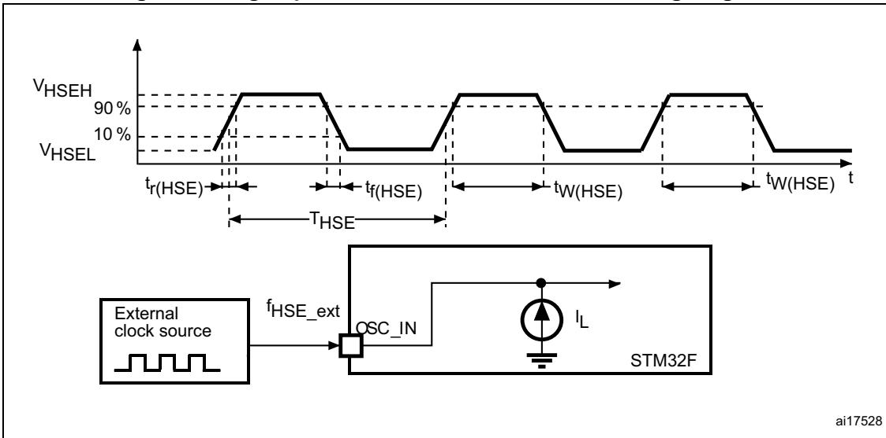

Figure 30. High-speed external clock source AC timing diagram

102/206

DS8626 Rev 12

STM32F405xx, STM32F407xx

Electrical characteristics

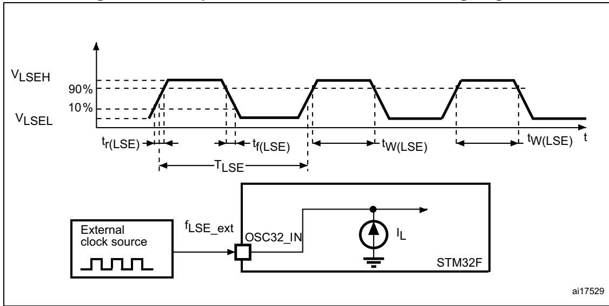

Figure 31. Low-speed external clock source AC timing diagram

High-speed external clock generated from a crystal/ceramic resonator

The high-speed external (HSE) clock can be supplied with a 4 to 26 MHz crystal/ceramic resonator oscillator. All the information given in this paragraph are based on characterization results obtained with typical external components specified in Table 32. In the application, the resonator and the load capacitors have to be placed as close as possible to the oscillator pins in order to minimize output distortion and startup stabilization time. Refer to the crystal resonator manufacturer for more details on the resonator characteristics (frequency, package, accuracy).

Table 32. HSE 4-26 MHz oscillator characteristics (1)

<table><tr><td rowspan=1 colspan=1>Symbol</td><td rowspan=1 colspan=1>Parameter</td><td rowspan=1 colspan=1>Conditions</td><td rowspan=1 colspan=1>Min</td><td rowspan=1 colspan=1>Typ</td><td rowspan=1 colspan=1>Max</td><td rowspan=1 colspan=1>Unit</td></tr><tr><td rowspan=1 colspan=1>fOSC_IN</td><td rowspan=1 colspan=1>Oscillator frequency</td><td rowspan=1 colspan=1>-</td><td rowspan=1 colspan=1>4</td><td rowspan=1 colspan=1>-</td><td rowspan=1 colspan=1>26</td><td rowspan=1 colspan=1>MHz</td></tr><tr><td rowspan=1 colspan=1><eq>\mathsf { R } _ { \mathsf { F } }</eq></td><td rowspan=1 colspan=1>Feedback resistor</td><td rowspan=1 colspan=1>一</td><td rowspan=1 colspan=1>-</td><td rowspan=1 colspan=1>200</td><td rowspan=1 colspan=1>-</td><td rowspan=1 colspan=1>kΩ</td></tr><tr><td rowspan=1 colspan=1><eq>\mathsf { G } _ { \mathsf { m } }</eq></td><td rowspan=1 colspan=1>Oscillator transconductance</td><td rowspan=2 colspan=1>Startup</td><td rowspan=1 colspan=1>5</td><td rowspan=1 colspan=1>-</td><td rowspan=1 colspan=1>-</td><td rowspan=2 colspan=1>mA/V</td></tr><tr><td rowspan=1 colspan=1>Gmcritmax</td><td rowspan=1 colspan=1>Maximum critical crystal<eq>\mathsf { G } _ { \mathsf { m } }</eq></td><td rowspan=1 colspan=1>-</td><td rowspan=1 colspan=1>-</td><td rowspan=1 colspan=1>1</td></tr><tr><td rowspan=1 colspan=1>tSU(HSE)(2)</td><td rowspan=1 colspan=1>Startup time</td><td rowspan=1 colspan=1><eq>\mathsf { V } _ { \mathsf { D D } }</eq>is stabilized</td><td rowspan=1 colspan=1>-</td><td rowspan=1 colspan=1>2</td><td rowspan=1 colspan=1>-</td><td rowspan=1 colspan=1>ms</td></tr></table>

1. Specified by design.

2. Evaluated by characterization - not tested in production. tsu(HSE) is the startup time measured from the moment it is enabled (by software) to a stabilized 8 MHz oscillātíon is reached. This value is measured for a standard crystal resonator and can vary significantly with the crystal manufacturer

For ${ \mathsf { C } } _ { \mathsf { L } 1 }$ and ${ \mathsf { C } } _ { \mathsf { L } 2 }$ , it is recommended to use high-quality external ceramic capacitors in the 5 pF to 25 pF range (typ.), designed for high-frequency applications, and selected to match the requirements of the crystal or resonator (see Figure 32). ${ \mathsf { C } } _ { \mathsf { L } 1 }$ and $\mathsf { C } _ { \mathsf { L } 2 }$ are usually the same size. The crystal manufacturer typically specifies a load capacitance which is the series combination of ${ \mathsf { C } } _ { \mathsf { L } 1 }$ and $\mathsf { C } _ { \mathsf { L } 2 }$ .PCB and MCU pin capacitance must be included (10 pF can be used as a rough estimate of the combined pin and board capacitance) when sizing $\mathsf { C } _ { \mathsf { L } 1 }$ and ${ \mathsf { C } } _ { \mathsf { L } 2 }$

103/206

DS8626 Rev 12

Note:

Note:

Electrical characteristics

STM32F405xx, STM32F407xx

For information on electing the crystal, refer to the application note AN2867 “Oscillator design guide for ST microcontrollers” available from the ST website www.st.com.

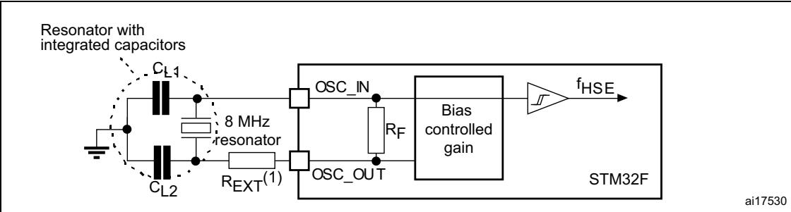

Figure 32. Typical application with an 8 MHz crystal

1. RExτ value depends on the crystal characteristics.

## Low-speed external clock generated from a crystal/ceramic resonator

The low-speed external (LSE) clock can be supplied with a 32.768 kHz crystal/ceramic resonator oscillator. All the information given in this paragraph are based on characterization results obtained with typical external components specified in Table 33. In the application, the resonator and the load capacitors have to be placed as close as possible to the oscillator pins in order to minimize output distortion and startup stabilization time. Refer to the crystal resonator manufacturer for more details on the resonator characteristics (frequency, package, accuracy).

Table 33. LSE oscillator characteristics $( \mathbf { f } _ { \mathsf { L S E } } = 3 2 . 7 6 8 ~ \mathsf { k H z } )$ (1)

<table><tr><td rowspan=1 colspan=1>Symbol</td><td rowspan=1 colspan=1>Parameter</td><td rowspan=1 colspan=1>Conditions</td><td rowspan=1 colspan=1>Min</td><td rowspan=1 colspan=1>Typ</td><td rowspan=1 colspan=1>Max</td><td rowspan=1 colspan=1>Unit</td></tr><tr><td rowspan=1 colspan=1>fOSC_IN</td><td rowspan=1 colspan=1>Oscillator frequency</td><td rowspan=1 colspan=1>-</td><td rowspan=1 colspan=1>-</td><td rowspan=1 colspan=1>32.768</td><td rowspan=1 colspan=1>-</td><td rowspan=1 colspan=1>kHz</td></tr><tr><td rowspan=1 colspan=1>RF</td><td rowspan=1 colspan=1>Feedback resistor</td><td rowspan=1 colspan=1>-</td><td rowspan=1 colspan=1>-</td><td rowspan=1 colspan=1>18.4</td><td rowspan=1 colspan=1>-</td><td rowspan=1 colspan=1>MΩ</td></tr><tr><td rowspan=1 colspan=1>IDD</td><td rowspan=1 colspan=1>LSE current consumption</td><td rowspan=1 colspan=1>-</td><td rowspan=1 colspan=1>-</td><td rowspan=1 colspan=1>-</td><td rowspan=1 colspan=1>1</td><td rowspan=1 colspan=1>μA</td></tr><tr><td rowspan=1 colspan=1><eq>\mathsf { G } _ { \mathsf { m } }</eq></td><td rowspan=1 colspan=1>Oscillator transconductance</td><td rowspan=2 colspan=1>Startup</td><td rowspan=1 colspan=1>2.8</td><td rowspan=1 colspan=1>1</td><td rowspan=1 colspan=1>-</td><td rowspan=2 colspan=1>μA/V</td></tr><tr><td rowspan=1 colspan=1>Gmcritmax</td><td rowspan=1 colspan=1>Maximum critical crystal<eq>\mathsf { G } _ { \mathsf { m } }</eq></td><td rowspan=1 colspan=1>-</td><td rowspan=1 colspan=1>-</td><td rowspan=1 colspan=1>0.56</td></tr><tr><td rowspan=1 colspan=1>tSU(LSE)(2)</td><td rowspan=1 colspan=1>Startup time</td><td rowspan=1 colspan=1><eq>\mathsf { V } _ { \mathsf { D D } }</eq>is stabilized</td><td rowspan=1 colspan=1>-</td><td rowspan=1 colspan=1>2</td><td rowspan=1 colspan=1>-</td><td rowspan=1 colspan=1>S</td></tr></table>

1. Specified by design.

2. Evaluated by characterization - not tested in production. tsu(LsE) is the startup time measured from the moment it is enabled (by software) to a stabilized 32.768 kHž ošcillation is reached. This value is measured for a standàrd crystal résonator and it can vary significantly with the crystal manufacturer

For information on electing the crystal, refer to the application note AN2867 “Oscillator design guide for ST microcontrollers” available from the ST website www.st.com.

104/206

DS8626 Rev 12

STM32F405xx, STM32F407xx

Electrical characteristics

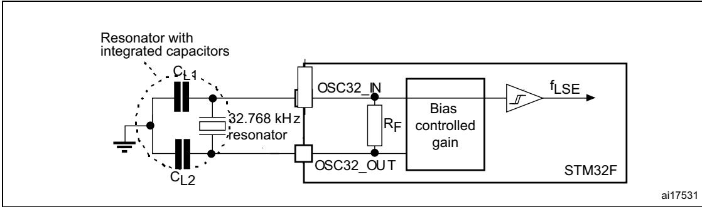

Figure 33. Typical application with a 32.768 kHz crystal

## 6.3.9Internal clock source characteristics

The parameters given in Table 34 and Table 35 are derived from tests performed under ambient temperature and $\mathsf { V } _ { \mathsf { D D } }$ supply voltage conditions summarized in Table 14.

## High-speed internal (HSI) RC oscillator

Table 34. HSI oscillator characteristics (1)

<table><tr><td rowspan=1 colspan=1>Symbol</td><td rowspan=1 colspan=1>Parameter</td><td rowspan=1 colspan=1>Conditions</td><td rowspan=1 colspan=1>Min</td><td rowspan=1 colspan=1><eq>{ \mathsf { T y p } }</eq></td><td rowspan=1 colspan=1>Max</td><td rowspan=1 colspan=1>Unit</td></tr><tr><td rowspan=1 colspan=1><eq>\mathsf { f } _ { \mathsf { H S I } }</eq></td><td rowspan=1 colspan=1>Frequency</td><td rowspan=1 colspan=1>一</td><td rowspan=1 colspan=1>-</td><td rowspan=1 colspan=1>16</td><td rowspan=1 colspan=1>-</td><td rowspan=1 colspan=1>MHz</td></tr><tr><td rowspan=4 colspan=1><eq>{ \mathsf { A C C } } _ { \mathsf { H S l } }</eq></td><td rowspan=1 colspan=1>HSI user trimming step(2)</td><td rowspan=1 colspan=1></td><td rowspan=1 colspan=1>-</td><td rowspan=1 colspan=1>1</td><td rowspan=1 colspan=1>1</td><td rowspan=1 colspan=1>%</td></tr><tr><td rowspan=3 colspan=1>Accuracy of the HSI oscillator</td><td rowspan=1 colspan=1><eq>\mathsf { T } _ { \mathsf { A } } = - 4 0 \mathsf { t o } 1 0 5 ^ { \circ } \mathsf { C } ^ { ( 3 ) }</eq></td><td rowspan=1 colspan=1>-8</td><td rowspan=1 colspan=1>1</td><td rowspan=1 colspan=1>4.5</td><td rowspan=1 colspan=1>%</td></tr><tr><td rowspan=1 colspan=1><eq>\mathsf { T } _ { \mathsf { A } } = - 1 0 \mathsf { t o } 8 5 ^ { \circ } \mathsf { C } ^ { ( 3 ) }</eq></td><td rowspan=1 colspan=1>-4</td><td rowspan=1 colspan=1>1</td><td rowspan=1 colspan=1>4</td><td rowspan=1 colspan=1>%</td></tr><tr><td rowspan=1 colspan=1><eq>{ \sf T } _ { \sf A } = 2 5 { \mathrm { ~ } ^ { \circ } } \sf C ^ { ( 4 ) }</eq></td><td rowspan=1 colspan=1>-1</td><td rowspan=1 colspan=1>1</td><td rowspan=1 colspan=1>1</td><td rowspan=1 colspan=1>%</td></tr><tr><td rowspan=1 colspan=1><eq>\mathfrak { t } _ { \mathtt { S U ( H S l ) } } ( 2 )</eq></td><td rowspan=1 colspan=1>HSI oscillator startup time</td><td rowspan=1 colspan=1></td><td rowspan=1 colspan=1>-</td><td rowspan=1 colspan=1>2.2</td><td rowspan=1 colspan=1>4</td><td rowspan=1 colspan=1>μs</td></tr><tr><td rowspan=1 colspan=1><eq>{ \mathsf { I } } _ { \mathsf { D D } ( \mathsf { H S I } ) } ( 2 )</eq></td><td rowspan=1 colspan=1>HSI oscillator powerconsumption</td><td rowspan=1 colspan=1></td><td rowspan=1 colspan=1>1</td><td rowspan=1 colspan=1>60</td><td rowspan=1 colspan=1>80</td><td rowspan=1 colspan=1><eq>\mu { \sf A }</eq></td></tr></table>

1. $\mathsf { V } _ { \mathsf { D D } } = 3 . 3 \mathsf { V } ,$ PLL OFF, $\mathsf { T } _ { \mathsf { A } } = - 4 0$ to $12 5 ^ { \circ } \mathsf { C }$ unless otherwise specified.

2. Specified by design.

3. Evaluated by characterization - not tested in production.

4. Factory calibrated, parts not soldered.

## Low-speed internal (LSI) RC oscillator

Table 35. LSI oscillator characteristics (1)

<table><tr><td rowspan=1 colspan=1>Symbol</td><td rowspan=1 colspan=1>Parameter</td><td rowspan=1 colspan=1>Min</td><td rowspan=1 colspan=1>Typ</td><td rowspan=1 colspan=1>Max</td><td rowspan=1 colspan=1>Unit</td></tr><tr><td rowspan=1 colspan=1><eq>\overline { { { \bf f } _ { \mathrm { L S l } } ( 2 ) } }</eq></td><td rowspan=1 colspan=1>Frequency</td><td rowspan=1 colspan=1>17</td><td rowspan=1 colspan=1>32</td><td rowspan=1 colspan=1>47</td><td rowspan=1 colspan=1>kHz</td></tr><tr><td rowspan=1 colspan=1><eq>\mathfrak { t } _ { \mathtt { S U } ( \mathsf { L S l } ) } { } ^ { ( 3 ) }</eq></td><td rowspan=1 colspan=1>LSI oscillator startup time</td><td rowspan=1 colspan=1>1</td><td rowspan=1 colspan=1>15</td><td rowspan=1 colspan=1>40</td><td rowspan=1 colspan=1>μs</td></tr><tr><td rowspan=1 colspan=1><eq>{ \mathsf { I } } _ { \mathsf { D D } ( \mathsf { L S I } ) } ( 3 )</eq></td><td rowspan=1 colspan=1>LSI oscillator power consumption</td><td rowspan=1 colspan=1>-</td><td rowspan=1 colspan=1>0.4</td><td rowspan=1 colspan=1>0.6</td><td rowspan=1 colspan=1><eq>\mu { \sf A }</eq></td></tr></table>

1. $\mathsf { V } _ { \mathsf { D D } } = 3 \mathsf { V } ,$ $\mathsf { T } _ { \mathsf { A } } = - 4 0$ to $1 0 5 ^ { \circ } \complement$ unless otherwise specified.

2. Evaluated by characterization - not tested in production.

3. Specified by design.

105/206

DS8626 Rev 12

Electrical characteristics

STM32F405xx, STM32F407xx

Figure 34. ACCLsı versus temperature

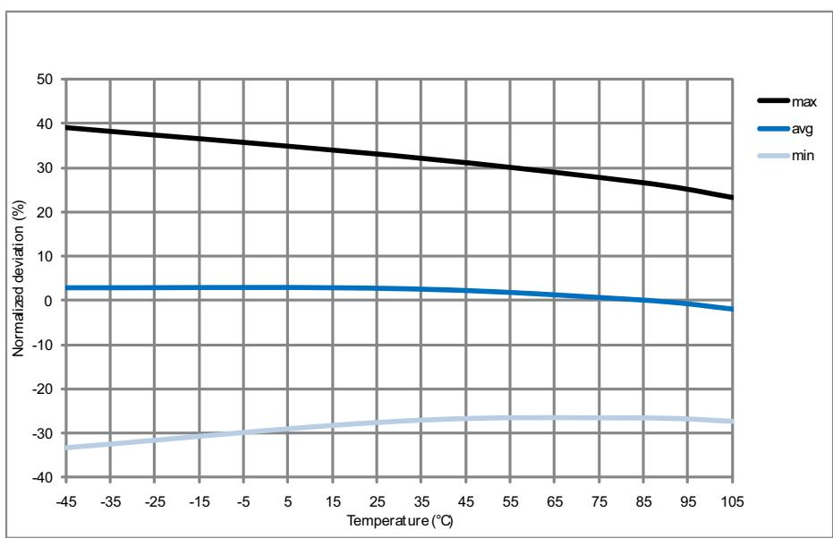

## 6.3.10PLL characteristics

The parameters given in Table 36 and Table 37 are derived from tests performed under temperature and $\mathsf { V } _ { \mathsf { D D } }$ supply voltage conditions summarized in Table 14.

Table 36. Main PLL characteristics

<table><tr><td rowspan=1 colspan=1>Symbol</td><td rowspan=1 colspan=1>Parameter</td><td rowspan=1 colspan=1>Conditions</td><td rowspan=1 colspan=1>Min</td><td rowspan=1 colspan=1>Typ</td><td rowspan=1 colspan=1>Max</td><td rowspan=1 colspan=1>Unit</td></tr><tr><td rowspan=1 colspan=1>fPLL_IN</td><td rowspan=1 colspan=1>PLL input clock(1)</td><td rowspan=1 colspan=1>-</td><td rowspan=1 colspan=1>0.95(2)</td><td rowspan=1 colspan=1>1</td><td rowspan=1 colspan=1>2.10</td><td rowspan=1 colspan=1>MHz</td></tr><tr><td rowspan=1 colspan=1>fPLL_OUT</td><td rowspan=1 colspan=1>PLL multiplier output clock</td><td rowspan=1 colspan=1>-</td><td rowspan=1 colspan=1>24</td><td rowspan=1 colspan=1>-</td><td rowspan=1 colspan=1>168</td><td rowspan=1 colspan=1>MHz</td></tr><tr><td rowspan=1 colspan=1>fPLL48_OUT</td><td rowspan=1 colspan=1>48 MHz PLL multiplier outputclock</td><td rowspan=1 colspan=1></td><td rowspan=1 colspan=1>-</td><td rowspan=1 colspan=1>48</td><td rowspan=1 colspan=1>75</td><td rowspan=1 colspan=1>MHz</td></tr><tr><td rowspan=1 colspan=1>fvco_OUT</td><td rowspan=1 colspan=1>PLL VCO output</td><td rowspan=1 colspan=1>-</td><td rowspan=1 colspan=1>100</td><td rowspan=1 colspan=1>1</td><td rowspan=1 colspan=1>432</td><td rowspan=1 colspan=1>MHz</td></tr><tr><td rowspan=2 colspan=1>tLOCK</td><td rowspan=2 colspan=1>PLL lock time</td><td rowspan=1 colspan=1>VCO freq = 100 MHz</td><td rowspan=1 colspan=1>75</td><td rowspan=1 colspan=1>-</td><td rowspan=1 colspan=1>200</td><td rowspan=2 colspan=1>μs</td></tr><tr><td rowspan=1 colspan=1>VCO freq = 432 MHz</td><td rowspan=1 colspan=1>100</td><td rowspan=1 colspan=1>-</td><td rowspan=1 colspan=1>300</td></tr></table>

106/206

DS8626 Rev 12

STM32F405xx, STM32F407xx

Electrical characteristics

Table 36. Main PLL characteristics (continued)

<table><tr><td rowspan=1 colspan=1>Symbol</td><td rowspan=1 colspan=1>Parameter</td><td rowspan=1 colspan=2>Conditions</td><td rowspan=1 colspan=1>Min</td><td rowspan=1 colspan=1>Typ</td><td rowspan=1 colspan=1>Max</td><td rowspan=1 colspan=1>Unit</td></tr><tr><td rowspan=7 colspan=1><eq>{ \mathsf { J i t t e r } } ^ { ( 3 ) }</eq></td><td rowspan=2 colspan=1>Cycle-to-cycle jitter</td><td rowspan=2 colspan=1>System clock</td><td rowspan=1 colspan=1>RMS</td><td rowspan=1 colspan=1></td><td rowspan=1 colspan=1>25</td><td rowspan=1 colspan=1></td><td rowspan=7 colspan=1>ps</td></tr><tr><td rowspan=1 colspan=1>peaktopeak</td><td rowspan=1 colspan=1></td><td rowspan=1 colspan=1>±150</td><td rowspan=1 colspan=1></td></tr><tr><td rowspan=2 colspan=1>Period Jitter</td><td rowspan=2 colspan=1>120 MHz</td><td rowspan=1 colspan=1>RMS</td><td rowspan=1 colspan=1></td><td rowspan=1 colspan=1>15</td><td rowspan=1 colspan=1></td></tr><tr><td rowspan=1 colspan=1>peaktopeak</td><td rowspan=1 colspan=1></td><td rowspan=1 colspan=1>+200</td><td rowspan=1 colspan=1></td></tr><tr><td rowspan=1 colspan=1>Main clock output (MCO) forRMII Ethernet</td><td rowspan=1 colspan=2>Cycle to cycle at 50 MHzon 1000 samples</td><td rowspan=1 colspan=1></td><td rowspan=1 colspan=1>32</td><td rowspan=1 colspan=1></td></tr><tr><td rowspan=1 colspan=1>Main clock output (MCO) for MIIEthernet</td><td rowspan=1 colspan=2>Cycle to cycle at 25 MHzon 1000 samples</td><td rowspan=1 colspan=1></td><td rowspan=1 colspan=1>40</td><td rowspan=1 colspan=1></td></tr><tr><td rowspan=1 colspan=1>Bit Time CAN jitter</td><td rowspan=1 colspan=2>Cycle to cycle at 1 MHzon 1000 samples</td><td rowspan=1 colspan=1></td><td rowspan=1 colspan=1>330</td><td rowspan=1 colspan=1></td></tr><tr><td rowspan=1 colspan=1><eq>{ \mathsf { I } } _ { \mathsf { D D } ( \mathsf { P L L } ) } ( 4 )</eq></td><td rowspan=1 colspan=1>PLL power consumption on VDD</td><td rowspan=1 colspan=2>VCO freq = 100 MHzVCO freq = 432 MHz</td><td rowspan=1 colspan=1>0.150.45</td><td rowspan=1 colspan=1></td><td rowspan=1 colspan=1>0.400.75</td><td rowspan=1 colspan=1>mA</td></tr><tr><td rowspan=1 colspan=1><eq>{ \mathsf { I } } _ { \mathsf { D D A ( P L L ) } } ( 4 )</eq></td><td rowspan=1 colspan=1>PLL power consumption onVDDA</td><td rowspan=1 colspan=2>VCO freq = 100 MHzVCO freq = 432 MHz</td><td rowspan=1 colspan=1>0.300.55</td><td rowspan=1 colspan=1></td><td rowspan=1 colspan=1>0.400.85</td><td rowspan=1 colspan=1>mA</td></tr></table>

1. Take care of using the appropriate division factor M to obtain the specified PLL input clock values. The M factor is shared between PLL and PLLI2S.

2. Specified by design.

3. The use of 2 PLLs in parallel could degraded the Jitter up to +30%.

4. Evaluated by characterization - not tested in production

Table 37. PLLI2S (audio PLL) characteristics

<table><tr><td colspan="1" rowspan="1">Symbol</td><td colspan="1" rowspan="1">Parameter</td><td colspan="2" rowspan="1">Conditions</td><td colspan="1" rowspan="1">Min</td><td colspan="1" rowspan="1">Typ</td><td colspan="1" rowspan="1">Max</td><td colspan="1" rowspan="1">Unit</td></tr><tr><td colspan="1" rowspan="1">fPLLI2S_IN</td><td colspan="1" rowspan="1">PLLI2S input clock(1)</td><td colspan="2" rowspan="1"></td><td colspan="1" rowspan="1">0.95(2)</td><td colspan="1" rowspan="1">1</td><td colspan="1" rowspan="1">2.10</td><td colspan="1" rowspan="1">MHz</td></tr><tr><td colspan="1" rowspan="1">fPLLI2S_OUT</td><td colspan="1" rowspan="1">PLLI2S multiplier output clock</td><td colspan="2" rowspan="1">-</td><td colspan="1" rowspan="1">-</td><td colspan="1" rowspan="1">-</td><td colspan="1" rowspan="1">216</td><td colspan="1" rowspan="1">MHz</td></tr><tr><td colspan="1" rowspan="1">fvco_OUT</td><td colspan="1" rowspan="1">PLLI2S VCO output</td><td colspan="2" rowspan="1">-</td><td colspan="1" rowspan="1">100</td><td colspan="1" rowspan="1">-</td><td colspan="1" rowspan="1">432</td><td colspan="1" rowspan="1">MHz</td></tr><tr><td colspan="1" rowspan="2">tLOCK</td><td colspan="1" rowspan="2">PLLI2S lock time</td><td colspan="2" rowspan="1">VCO freq = 100 MHz</td><td colspan="1" rowspan="1">75</td><td colspan="1" rowspan="1">-</td><td colspan="1" rowspan="1">200</td><td colspan="1" rowspan="2">μs</td></tr><tr><td colspan="2" rowspan="1">VCO freq = 432 MHz</td><td colspan="1" rowspan="1">100</td><td colspan="1" rowspan="1">-</td><td colspan="1" rowspan="1">300</td></tr><tr><td colspan="1" rowspan="4"><eq>{ \mathsf { J i t t e r } } ^ { ( 3 ) }</eq></td><td colspan="1" rowspan="3">Master<eq>{ \mathsf { I } } ^ { 2 } { \mathsf { S } }</eq>clock jitter</td><td colspan="1" rowspan="2">Cycle to cycle at12.288 MHz on48KHz period,N=432, R=5</td><td colspan="1" rowspan="1">RMS</td><td colspan="1" rowspan="1"></td><td colspan="1" rowspan="1">90</td><td colspan="1" rowspan="1"></td><td colspan="1" rowspan="1"></td></tr><tr><td colspan="1" rowspan="1">peaktopeak</td><td colspan="1" rowspan="1"></td><td colspan="1" rowspan="1">+280</td><td colspan="1" rowspan="1"></td><td colspan="1" rowspan="1">ps</td></tr><tr><td colspan="2" rowspan="1">Average frequency of12.288 MHzN = 432, R = 5on 1000 samples</td><td colspan="1" rowspan="1"></td><td colspan="1" rowspan="1">90</td><td colspan="1" rowspan="1"></td><td colspan="1" rowspan="1">ps</td></tr><tr><td colspan="1" rowspan="1">WS I²S clock jitter</td><td colspan="2" rowspan="1">Cycle to cycle at 48 KHzon 1000 samples</td><td colspan="1" rowspan="1"></td><td colspan="1" rowspan="1">400</td><td colspan="1" rowspan="1"></td><td colspan="1" rowspan="1">ps</td></tr><tr><td colspan="1" rowspan="1"><eq>{ | _ { \mathsf { D D } ( \mathsf { P L L I L S } ) } } ^ { ( 4 ) }</eq></td><td colspan="1" rowspan="1">PLLI2S power consumption on<eq>\mathsf { V } _ { \mathsf { D D } }</eq></td><td colspan="1" rowspan="1">VCO freq = 100 MHzVCO freq = 432 MHz</td><td colspan="1" rowspan="1">0.150.45</td><td colspan="1" rowspan="1"></td><td colspan="1" rowspan="1">0.400.75</td><td colspan="2" rowspan="1">mA</td></tr><tr><td colspan="1" rowspan="1">IDDA(PLLI2S)(4)</td><td colspan="1" rowspan="1">PLLI2S power consumption on<eq>\mathsf { V } _ { \mathsf { D D A } }</eq></td><td colspan="1" rowspan="1">VCO freq = 100 MHzVCO freq = 432 MHz</td><td colspan="1" rowspan="1">0.300.55</td><td colspan="1" rowspan="1"></td><td colspan="1" rowspan="1">0.400.85</td><td colspan="2" rowspan="1">mA</td></tr></table>

1. Take care of using the appropriate division factor M to have the specified PLL input clock values.

2. Specified by design.

107/206

DS8626 Rev 12

Electrical characteristics

STM32F405xx, STM32F407xx

3. Value given with main PLL running.

4. Evaluated by characterization - not tested in production.

## 6.3.11 PLL spread spectrum clock generation (SSCG) characteristics

The spread spectrum clock generation (SSCG) feature allows to reduce electromagnetic interferences (see Table 44: EMI characteristics for $f H S E = 2 5$ MH and $f C P U = 1 6 8 \ : M H z )$ . It is available only on the main PLL.

Table 38. SSCG parameters constraint

<table><tr><td rowspan=1 colspan=1>Symbol</td><td rowspan=1 colspan=1>Parameter</td><td rowspan=1 colspan=1>Min</td><td rowspan=1 colspan=1>Typ</td><td rowspan=1 colspan=1><eq>\mathbf { \Delta } \mathbf { M } \mathbf { a x } ^ { ( 1 ) }</eq></td><td rowspan=1 colspan=1>Unit</td></tr><tr><td rowspan=1 colspan=1><eq>\mathfrak { f } _ { \mathsf { M o d } }</eq></td><td rowspan=1 colspan=1>Modulation frequency</td><td rowspan=1 colspan=1>1</td><td rowspan=1 colspan=1></td><td rowspan=1 colspan=1>10</td><td rowspan=1 colspan=1>KHz</td></tr><tr><td rowspan=1 colspan=1>md</td><td rowspan=1 colspan=1>Peak modulation depth</td><td rowspan=1 colspan=1>0.25</td><td rowspan=1 colspan=1>1</td><td rowspan=1 colspan=1>2</td><td rowspan=1 colspan=1>%</td></tr><tr><td rowspan=1 colspan=1>MODEPER * INCSTEP</td><td rowspan=1 colspan=1></td><td rowspan=1 colspan=1>1</td><td rowspan=1 colspan=1>1</td><td rowspan=1 colspan=1><eq>2 ^ { 1 5 } \ v { A }</eq></td><td rowspan=1 colspan=1>-</td></tr></table>

1. Specified by design.

Equation 1

The frequency modulation period (MODEPER) is given by the equation below:

$$
\mathsf { M O D E P E R } = \mathsf { r o u n d } [ \mathsf { f } _ { \mathsf { P L L } _ { - } \mid \mathsf { N } } / \mathbf { \Gamma } ( 4 \times \mathsf { f } _ { \mathsf { M o d } } ) ]
$$

$\mathsf { f } _ { \mathsf { P L L } } \mathsf { \_ I N }$ and $\mathfrak { f } _ { \mathsf { M o d } }$ must be expressed in Hz.

As an example:

$1 \uparrow f _ { \mathsf { P L L \_ I N } } = 1 \mathsf { M H z }$ and $\mathsf { f } _ { \mathsf { M O D } } = 1$ kHz, the modulation depth (MODEPER) is given by equation 1:

$$
\mathsf { M O D E P E R } = \mathsf { r o u n d } [ 1 0 ^ { 6 } / \ ( 4 \times \ 1 0 ^ { 3 } ) ] = 2 5 0
$$

Equation 2

Equation 2 allows to calculate the increment step (INCSTEP):

$$
{ \mathsf { I N C S T E P } } = { \mathsf { r o u n d } } [ ( ( 2 ^ { 1 5 } - 1 ) \times { \mathsf { m d } } \times { \mathsf { P L L N } } ) / \ ( 1 0 0 \times 5 \times { \mathsf { M O D E P E R } } ) ]
$$

fyco\_ouτ must be expressed in MHz.

108/206

DS8626 Rev 12

STM32F405xx, STM32F407xx

Electrical characteristics

With a modulation depth (md) = ±2 % (4 % peak to peak), and PLLN = 240 (in MHz):

$$
\mathsf { I N C S T E P } = \mathsf { r o u n d } [ ( ( 2 ^ { 1 5 } - 1 ) \times 2 \times 2 4 0 ) / \phantom { \frac { 3 0 } { 7 } } ( 1 0 0 \times 5 \times 2 5 0 ) ] = 1 2 6 \mathsf { m d } ( \mathsf { q u a n t i t a z e d } ) \%
$$

An amplitude quantization error may be generated because the linear modulation profile is obtained by taking the quantized values (rounded to the nearest integer) of MODPER and INCSTEP. As a result, the achieved modulation depth is quantized. The percentage quantized modulation depth is given by the following formula:

$$
\mathsf { m d } _ { \mathsf { q u a n t i z e d } } \mathsf { \Omega } ^ { \mathsf { o } } \flat \ = ( \mathsf { M O D E P E R } \times \mathsf { I N C S T E P } \times \mathsf { 1 0 0 } \times \mathsf { 5 } ) / \mathsf { \Omega } ( ( 2 ^ { 1 5 } - 1 ) \times \mathsf { P L L N } )
$$

As a result:

$$
\mathsf { m d } _ { \mathsf { q u a n t i z e d } } \mathsf { \Omega } ^ { \mathsf { o } } \mathsf { \Omega } ^ { \mathsf { o } } \mathsf { \Omega } ^ { \mathsf { o } } = ( 2 5 0 \times 1 2 6 \times 1 0 0 \times 5 ) / \mathrm { \Omega } ( ( 2 ^ { 1 5 } - 1 ) \times 2 4 0 ) = 2 . 0 0 2 \% ( \mathsf { p e a k } )
$$

Figure 35 and Figure 36 show the main PLL output clock waveforms in center spread and down spread modes, where:

F0 is $\mathsf { f } _ { \mathsf { P L L } }$ \_OUT nominal.

$\mathsf { T } _ { \mathsf { m o d e } }$ is the modulation period.

md is the modulation depth.

Figure 35. PLL output clock waveforms in center spread mode

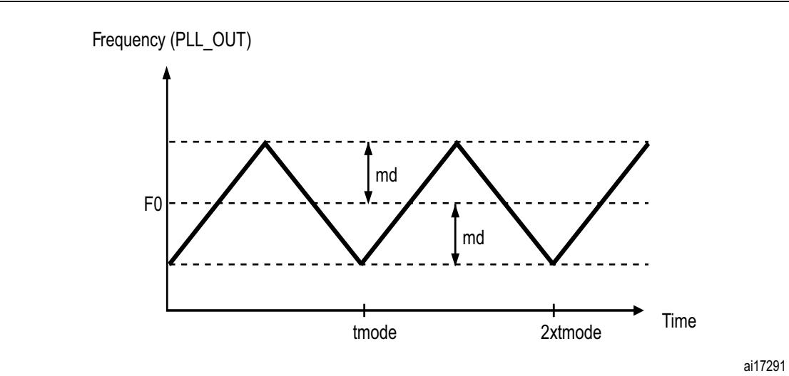

109/206

DS8626 Rev 12

Electrical characteristics

STM32F405xx, STM32F407xx

Figure 36. PLL output clock waveforms in down spread mode

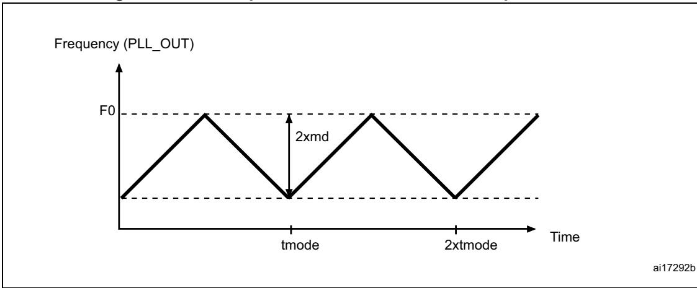

## 6.3.12Memory characteristics

## Flash memory

The characteristics are given at $\mathsf { T } _ { \mathsf { A } } = - 4 0 \mathsf { t o } \ 1 0 5 ^ { \circ } \mathsf { C }$ unless otherwise specified.

The devices are shipped to customers with the flash memory erased.

Table 39. Flash memory characteristics

<table><tr><td rowspan=1 colspan=1>Symbol</td><td rowspan=1 colspan=1>Parameter</td><td rowspan=1 colspan=1>Conditions</td><td rowspan=1 colspan=1>Min</td><td rowspan=1 colspan=1>Typ</td><td rowspan=1 colspan=1>Max</td><td rowspan=1 colspan=1>Unit</td></tr><tr><td rowspan=3 colspan=1>IDD</td><td rowspan=3 colspan=1>Supply current</td><td rowspan=1 colspan=1>Write / Erase 8-bit mode,<eq>\mathsf { V } _ { \mathsf { D D } } = 1 . 8 \mathsf { V }</eq></td><td rowspan=1 colspan=1>-</td><td rowspan=1 colspan=1>5</td><td rowspan=1 colspan=1>-</td><td rowspan=3 colspan=1>mA</td></tr><tr><td rowspan=1 colspan=1>Write / Erase 16-bit mode,<eq>\mathsf { V } _ { \mathsf { D D } } = 2 . 1 \ \mathsf { V }</eq></td><td rowspan=1 colspan=1>-</td><td rowspan=1 colspan=1>8</td><td rowspan=1 colspan=1></td></tr><tr><td rowspan=1 colspan=1>Write / Erase 32-bit mode,<eq>\mathsf { V } _ { \mathsf { D D } } = 3 . 3 \mathsf { V }</eq></td><td rowspan=1 colspan=1>-</td><td rowspan=1 colspan=1>12</td><td rowspan=1 colspan=1>=</td></tr></table>

Table 40. Flash memory programming

<table><tr><td colspan="1" rowspan="1">Symbol</td><td colspan="1" rowspan="1">Parameter</td><td colspan="1" rowspan="1">Conditions</td><td colspan="1" rowspan="1"><eq>\mathsf { M i n } ^ { ( 1 ) }</eq></td><td colspan="1" rowspan="1"><eq>{ \mathsf { T y p } }</eq></td><td colspan="1" rowspan="1"><eq>{ \pmb { M } } \mathbf { a x } ^ { ( 1 ) }</eq></td><td colspan="1" rowspan="1">Unit</td></tr><tr><td colspan="1" rowspan="1"><eq>\mathsf { t _ { p r o g } }</eq></td><td colspan="1" rowspan="1">Word programming time</td><td colspan="1" rowspan="1">Program/erase parallelism(PSIZE) = x 8/16/32</td><td colspan="1" rowspan="1"></td><td colspan="1" rowspan="1">16</td><td colspan="1" rowspan="1"><eq>\begin{array} { r l } {  { 1 0 0 ^ { ( 2 ) } } } \end{array}</eq></td><td colspan="1" rowspan="1">μs</td></tr><tr><td colspan="1" rowspan="3">tERASE16KB</td><td colspan="1" rowspan="3">Sector (16 KB) erase time</td><td colspan="1" rowspan="1">Program/erase parallelism(PSIZE) = x 8</td><td colspan="1" rowspan="1"></td><td colspan="1" rowspan="1">400</td><td colspan="1" rowspan="1">800</td><td colspan="1" rowspan="3">ms</td></tr><tr><td colspan="1" rowspan="1">Program/erase parallelism(PSIZE) = x 16</td><td colspan="1" rowspan="1"></td><td colspan="1" rowspan="1">300</td><td colspan="1" rowspan="1">600</td></tr><tr><td colspan="1" rowspan="1">Program/erase parallelism(PSIZE) = x 32</td><td colspan="1" rowspan="1">一</td><td colspan="1" rowspan="1">250</td><td colspan="1" rowspan="1">500</td></tr><tr><td colspan="1" rowspan="3"><eq>\mathtt { t _ { E R A S E 6 4 K B } }</eq></td><td colspan="1" rowspan="3">Sector (64 KB) erase time</td><td colspan="1" rowspan="1">Program/erase parallelism(PSIZE) = x 8</td><td colspan="1" rowspan="1">一</td><td colspan="1" rowspan="1">1200</td><td colspan="1" rowspan="1">2400</td><td colspan="1" rowspan="3">ms</td></tr><tr><td colspan="1" rowspan="1">Program/erase parallelism(PSIZE) = x 16</td><td colspan="1" rowspan="1">1</td><td colspan="1" rowspan="1">700</td><td colspan="1" rowspan="1">1400</td></tr><tr><td colspan="1" rowspan="1">Program/erase parallelism(PSIZE) = x 32</td><td colspan="1" rowspan="1"></td><td colspan="1" rowspan="1">550</td><td colspan="1" rowspan="1">1100</td></tr><tr><td colspan="1" rowspan="1">Symbol</td><td colspan="1" rowspan="1">Parameter</td><td colspan="1" rowspan="1">Conditions</td><td colspan="1" rowspan="1"><eq>\mathsf { M i n } ^ { ( 1 ) }</eq></td><td colspan="1" rowspan="1">Typ</td><td colspan="1" rowspan="1"><eq>{ \pmb { M } } \mathbf { a x } ^ { ( 1 ) }</eq></td><td colspan="1" rowspan="1">Unit</td></tr><tr><td colspan="1" rowspan="3">tERASE128KB</td><td colspan="1" rowspan="3">Sector (128 KB) erase time</td><td colspan="1" rowspan="1">Program/erase parallelism(PSIZE) = x 8</td><td colspan="1" rowspan="1"></td><td colspan="1" rowspan="1">2</td><td colspan="1" rowspan="1">4</td><td colspan="1" rowspan="3">S</td></tr><tr><td colspan="1" rowspan="1">Program/erase parallelism(PSIZE) = x 16</td><td colspan="1" rowspan="1"></td><td colspan="1" rowspan="1">1.3</td><td colspan="1" rowspan="1">2.6</td></tr><tr><td colspan="1" rowspan="1">Program/erase parallelism(PSIZE) = x 32</td><td colspan="1" rowspan="1"></td><td colspan="1" rowspan="1">1</td><td colspan="1" rowspan="1">2</td></tr><tr><td colspan="1" rowspan="3"><eq>\mathrm { t } _ { \mathsf { M E } }</eq></td><td colspan="1" rowspan="3">Mass erase time</td><td colspan="1" rowspan="1">Program/erase parallelism(PSIZE) = x 8</td><td colspan="1" rowspan="1"></td><td colspan="1" rowspan="1">16</td><td colspan="1" rowspan="1">32</td><td colspan="1" rowspan="3">S</td></tr><tr><td colspan="1" rowspan="1">Program/erase parallelism(PSIZE) = x 16</td><td colspan="1" rowspan="1">一</td><td colspan="1" rowspan="1">11</td><td colspan="1" rowspan="1">22</td></tr><tr><td colspan="1" rowspan="1">Program/erase parallelism(PSIZE) = x 32</td><td colspan="1" rowspan="1">1</td><td colspan="1" rowspan="1">8</td><td colspan="1" rowspan="1">16</td></tr><tr><td colspan="1" rowspan="3"><eq>\mathsf { V } _ { \mathsf { p r o g } }</eq></td><td colspan="1" rowspan="3">Programming voltage</td><td colspan="1" rowspan="1">32-bit program operation</td><td colspan="1" rowspan="1">2.7</td><td colspan="1" rowspan="1">一</td><td colspan="1" rowspan="1">3.6</td><td colspan="1" rowspan="1">V</td></tr><tr><td colspan="1" rowspan="1">16-bit program operation</td><td colspan="1" rowspan="1">2.1</td><td colspan="1" rowspan="1">-</td><td colspan="1" rowspan="1">3.6</td><td colspan="1" rowspan="1">V</td></tr><tr><td colspan="1" rowspan="1">8-bit program operation</td><td colspan="1" rowspan="1">1.8</td><td colspan="1" rowspan="1">一</td><td colspan="1" rowspan="1">3.6</td><td colspan="1" rowspan="1">V</td></tr></table>

1. Evaluated by characterization - not tested in production.

110/206

DS8626 Rev 12

STM32F405xx, STM32F407xx

Electrical characteristics

2. The maximum programming time is measured after 100K erase operations.

111/206

DS8626 Rev 12

Electrical characteristics

STM32F405xx, STM32F407xx

Table 41. Flash memory programming with $\mathsf { v } _ { \mathsf { P P } }$

<table><tr><td rowspan=1 colspan=1>Symbol</td><td rowspan=1 colspan=1>Parameter</td><td rowspan=1 colspan=2>Conditions</td><td rowspan=1 colspan=1><eq>\mathsf { M i n } ^ { ( 1 ) }</eq></td><td rowspan=1 colspan=1><eq>{ \mathsf { T y p } }</eq></td><td rowspan=1 colspan=1><eq>{ \pmb { M } } \mathbf { a x } ^ { ( 1 ) }</eq></td><td rowspan=1 colspan=1>Unit</td></tr><tr><td rowspan=1 colspan=1><eq>\mathsf { \Delta t _ { p r o g } }</eq></td><td rowspan=1 colspan=1>Double word programming</td><td rowspan=5 colspan=2><eq>\mathsf { T } _ { \mathsf { A } } = 0 \mathsf { t } 0 + 4 0 \mathsf { \Omega } ^ { \circ } \mathsf { C }</eq><eq>\mathsf { V } _ { \mathsf { D D } } = 3 . 3 \mathsf { V }</eq><eq>\mathsf { V } _ { \mathsf { P P } } = 8 . 5 \ : \mathsf { V }</eq></td><td rowspan=1 colspan=1></td><td rowspan=1 colspan=1>16</td><td rowspan=1 colspan=1><eq>\overline { { 1 0 0 ^ { ( 2 ) } } }</eq></td><td rowspan=1 colspan=1>μs</td></tr><tr><td rowspan=1 colspan=1>tERASE16KB</td><td rowspan=1 colspan=1>Sector (16 KB) erase time</td><td rowspan=1 colspan=1></td><td rowspan=1 colspan=1></td><td rowspan=1 colspan=1>230</td><td rowspan=1 colspan=1>-</td><td rowspan=3 colspan=1>ms</td></tr><tr><td rowspan=1 colspan=1>tERASE64KB</td><td rowspan=1 colspan=1>Sector (64 KB) erase time</td><td rowspan=1 colspan=1></td><td rowspan=1 colspan=1>一</td><td rowspan=1 colspan=1>490</td><td rowspan=1 colspan=1>-</td></tr><tr><td rowspan=1 colspan=1>tERASE128KB</td><td rowspan=1 colspan=1>Sector (128 KB) erase time</td><td rowspan=1 colspan=1>一</td><td rowspan=1 colspan=1>875</td><td rowspan=1 colspan=1>-</td></tr><tr><td rowspan=1 colspan=1><eq>\mathrm { t } _ { \mathsf { M E } }</eq></td><td rowspan=1 colspan=1>Mass erase time</td><td rowspan=1 colspan=1>1</td><td rowspan=1 colspan=1>6.9</td><td rowspan=1 colspan=1>1</td><td rowspan=1 colspan=1>S</td></tr><tr><td rowspan=1 colspan=1><eq>\mathsf { V } _ { \mathsf { p r o g } }</eq></td><td rowspan=1 colspan=1>Programming voltage</td><td rowspan=1 colspan=2>-</td><td rowspan=1 colspan=1>2.7</td><td rowspan=1 colspan=1>-</td><td rowspan=1 colspan=1>3.6</td><td rowspan=1 colspan=1>V</td></tr><tr><td rowspan=1 colspan=1><eq>\mathsf { V } _ { \mathsf { P P } }</eq></td><td rowspan=1 colspan=1><eq>\mathsf { V } _ { \mathsf { P P } }</eq>voltage range</td><td rowspan=1 colspan=2>-</td><td rowspan=1 colspan=1>7</td><td rowspan=1 colspan=1>-</td><td rowspan=1 colspan=1>9</td><td rowspan=1 colspan=1>V</td></tr><tr><td rowspan=1 colspan=1><eq>{ \mathsf { I } } _ { { \mathsf { P } } { \mathsf { P } } }</eq></td><td rowspan=1 colspan=1>Minimum current sunk onthe Vpp pin</td><td rowspan=1 colspan=2>1</td><td rowspan=1 colspan=1>10</td><td rowspan=1 colspan=1>一</td><td rowspan=1 colspan=1>1</td><td rowspan=1 colspan=1>mA</td></tr><tr><td rowspan=1 colspan=1><eq>\mathsf { t } _ { \mathsf { V P P } } ( 3 )</eq></td><td rowspan=1 colspan=1>Cumulative time duringwhich<eq>\mathsf { V } _ { \mathsf { P P } }</eq>is applied</td><td rowspan=1 colspan=2>一</td><td rowspan=1 colspan=1></td><td rowspan=1 colspan=1></td><td rowspan=1 colspan=1>1</td><td rowspan=1 colspan=1>hour</td></tr></table>

1. Specified by design.

2. The maximum programming time is measured after 100K erase operations.

3. $\mathsf { V } _ { \mathsf { P P } }$ should only be connected during programming/erasing.

Table 42. Flash memory endurance and data retention

<table><tr><td rowspan=2 colspan=1>Symbol</td><td rowspan=2 colspan=1>Parameter</td><td rowspan=2 colspan=1>Conditions</td><td rowspan=1 colspan=1>Value</td><td rowspan=2 colspan=1>Unit</td></tr><tr><td rowspan=1 colspan=1><eq>\mathsf { M i n } ^ { ( 1 ) }</eq></td></tr><tr><td rowspan=1 colspan=1><eq>N _ { E N D }</eq></td><td rowspan=1 colspan=1>Endurance</td><td rowspan=1 colspan=1><eq>\mathsf { T } _ { \mathsf { A } } = - 4 0 \mathsf { t } 0 + 8 5 ^ { \circ } \mathsf { C }</eq>(6 suffix versions)<eq>\mathsf { T } _ { \mathsf { A } } = - 4 0 \mathsf { t o } + 1 0 5 ^ { \circ } \mathsf { C } \ ( 7</eq>suffix versions)</td><td rowspan=1 colspan=1>10</td><td rowspan=1 colspan=1>kcycles</td></tr><tr><td rowspan=3 colspan=1>tRET</td><td rowspan=3 colspan=1>Data retention</td><td rowspan=1 colspan=1><eq>1 ~ \mathsf { k c y c l e } ^ { ( 2 ) } \mathsf { a t } \mathsf { T } _ { \mathsf { A } } = 8 5 ^ { \circ } \mathsf { C }</eq></td><td rowspan=1 colspan=1>30</td><td rowspan=3 colspan=1>Years</td></tr><tr><td rowspan=1 colspan=1><eq>1 ~ \mathrm { k c y c l e } ^ { ( 2 ) } \mathsf { a t T _ { A } } = 1 0 5 ^ { \circ } \mathsf { C }</eq></td><td rowspan=1 colspan=1>10</td></tr><tr><td rowspan=1 colspan=1><eq>1 0 \mathrm { k c y c l e s } ^ { ( 2 ) }</eq>at<eq>\mathsf { T } _ { \mathsf { A } } = 5 5 ^ { \circ } \mathsf { C }</eq></td><td rowspan=1 colspan=1>20</td></tr></table>

1. Evaluated by characterization - not tested in production.

2. Cycling performed over the whole temperature range.

## 6.3.13 EMC characteristics

Susceptibility tests are performed on a sample basis during device characterization.

## Functional EMS (electromagnetic susceptibility)

While a simple application is executed on the device (toggling 2 LEDs through l/O ports). the device is stressed by two electromagnetic events until a failure occurs. The failure is indicated by the LEDs:

Electrostatic discharge (EsD) (positive and negative) is applied to all device pins until a functional disturbance occurs. This test is compliant with the lEC 61000-4-2 standard.

FTB: A burst of fast transient voltage (positive and negative) is applied to $\mathsf { V } _ { \mathsf { D D } }$ and $\vee _ { \mathsf { S S } }$ through a 100 pF capacitor, until a functional disturbance occurs. This test is compliant with the IEC 61000-4-4 standard.

112/206

DS8626 Rev 12

STM32F405xx, STM32F407xx

Electrical characteristics

A device reset allows normal operations to be resumed.

The test results are given in Table 43. They are based on the EMS levels and classes defined in application note AN1709.

Table 43. EMS characteristics

<table><tr><td rowspan=1 colspan=1>Symbol</td><td rowspan=1 colspan=1>Parameter</td><td rowspan=1 colspan=1>Conditions</td><td rowspan=1 colspan=1>Level/Class</td></tr><tr><td rowspan=1 colspan=1>VFESD</td><td rowspan=1 colspan=1>Voltage limits to be applied on any l/O pin toinduce a functional disturbance</td><td rowspan=1 colspan=1><eq>\mathsf { V } _ { \mathsf { D } \mathsf { D } } = 3 . 3 \mathsf { V } , \mathsf { L G F P } 1 7 6 , \mathsf { T } _ { \mathsf { A } } = + 2 5 \mathsf { \Omega } ^ { \circ } \mathsf { C } ,</eq><eq>\mathsf { f } _ { \mathsf { H C L K } } = 1 6 8 \ \mathsf { M H z } , \mathsf { c o n f o r m s ~ t o }</eq>IEC 61000-4-2</td><td rowspan=1 colspan=1>2B</td></tr><tr><td rowspan=1 colspan=1><eq>V _ { E F T B }</eq></td><td rowspan=1 colspan=1>Fast transient voltage burst limits to beapplied through 100 pF on<eq>\mathsf { V } _ { \mathsf { D D } }</eq>and<eq>\mathsf { V } _ { \mathsf { S S } }</eq>pins to induce a functional disturbance</td><td rowspan=1 colspan=1><eq>\mathsf { V } _ { \mathsf { D } \mathsf { D } } = 3 . 3 \mathsf { V } , \mathsf { L G F P } 1 7 6 , \mathsf { T } _ { \mathsf { A } } = + 2 5 \mathsf { \Omega } ^ { \circ } \mathsf { C } ,</eq>fHCLK = 168 MHz, conforms toIEC 61000-4-2</td><td rowspan=1 colspan=1>4A</td></tr></table>

## Designing hardened software to avoid noise problems

EMC characterization and optimization are performed at component level with a typical application environment and simplified MCU software. It should be noted that good EMC performance is highly dependent on the user application and the software in particular.

Therefore it is recommended that the user applies EMC software optimization and prequalification tests in relation with the EMC level requested for his application.

## Software recommendations

The software flowchart must include the management of runaway conditions such as:

• Corrupted program counter

• Unexpected reset

• Critical Data corruption (control registers...)

## Prequalification trials

Most of the common failures (unexpected reset and program counter corruption) can be reproduced by manually forcing a low state on the NRST pin or the Oscillator pins for 1 second.

To complete these trials, ESD stress can be applied directly on the device, over the range of specification values. When unexpected behavior is detected, the software can be hardened to prevent unrecoverable errors occurring (see application note AN1015).

113/206

DS8626 Rev 12

Electrical characteristics

STM32F405xx, STM32F407xx

## Electromagnetic Interference (EMI)

The electromagnetic field emitted by the device are monitored while a simple application, executing EEMBC code, is running. This emission test is compliant with SAE IEC61967-2 standard which specifies the test board and the pin loading.

Table 44. EMI characteristics for $f _ { { \sf H S E } } = 2 5 ~ { \sf M H }$ and $\mathsf { f } _ { \mathsf { C P U } } = 1 6 8 \mathsf { M H z }$

<table><tr><td rowspan=1 colspan=1>Symbol</td><td rowspan=1 colspan=1>Parameter</td><td rowspan=1 colspan=1>Conditions</td><td rowspan=1 colspan=1>Monitoredfrequency band</td><td rowspan=1 colspan=1>Value</td><td rowspan=1 colspan=1>Unit</td></tr><tr><td rowspan=8 colspan=1><eq>\mathsf { S } _ { \mathsf { E M I } }</eq></td><td rowspan=3 colspan=1><eq>\mathsf { P e a k } ^ { ( 1 ) }</eq></td><td rowspan=4 colspan=1>VDD = 3.3 V, TA = 25 °C, LQFP176package, conforming to SAE J1752/3EEMBC, code running from flashmemory with ART accelerator enabled</td><td rowspan=1 colspan=1>0.1 to 30 MHz</td><td rowspan=1 colspan=1>32</td><td rowspan=3 colspan=1>dBμV</td></tr><tr><td rowspan=1 colspan=1>30 to 130 MHz</td><td rowspan=1 colspan=1>25</td></tr><tr><td rowspan=1 colspan=1>130 MHz to 1GHz</td><td rowspan=1 colspan=1>29</td></tr><tr><td rowspan=1 colspan=1><eq>\overline { { { \mathsf { L e v e l } } ^ { ( 2 ) } } }</eq></td><td rowspan=1 colspan=1>0.1 MHz to 2 GHz</td><td rowspan=1 colspan=1>4</td><td rowspan=1 colspan=1></td></tr><tr><td rowspan=3 colspan=1><eq>\mathsf { P e a k } ^ { ( 1 ) }</eq></td><td rowspan=4 colspan=1>VDD = 3.3 V, TA= 25 °C, LQFP176package, conforming to SAE J1752/3EEMBC, code running from flashmemory with ART accelerator and PLLspread spectrum enabled</td><td rowspan=1 colspan=1>0.1 to 30 MHz</td><td rowspan=1 colspan=1>19</td><td rowspan=3 colspan=1>dBμV</td></tr><tr><td rowspan=1 colspan=1>30 to 130 MHz</td><td rowspan=1 colspan=1>16</td></tr><tr><td rowspan=1 colspan=1>130 MHz to 1GHz</td><td rowspan=1 colspan=1>18</td></tr><tr><td rowspan=1 colspan=1><eq>\overline { { { \mathsf { L e v e l } } ^ { ( 2 ) } } }</eq></td><td rowspan=1 colspan=1>0.1 MHz to 2 GHz</td><td rowspan=1 colspan=1>3.5</td><td rowspan=1 colspan=1>一</td></tr></table>

1. Refer to AN1709 "EMI radiated test" chapter.

2. Refer to AN1709 "EMI level classification" chapter.

## 6.3.14Absolute maximum ratings (electrical sensitivity)

Stresses above the absolute maximum ratings listed in Table 11: Voltage characteristics, Table 12: Current characteristics, and Table 13: Thermal characteristics may cause permanent damage to the device. These are stress ratings only and the functional operation of the device at these conditions is not implied. Exposure to maximum rating conditions for extended periods may affect device reliability. Device mission profile (application conditions) is compliant with JEDEC JESD47 Qualification Standard, extended mission profiles are available on demand.

## Electrostatic discharge (ESD)

Electrostatic discharges (a positive then a negative pulse separated by 1 second) are applied to the pins of each sample according to each pin combination. The sample size depends on the number of supply pins in the device (3 parts × (n+1) supply pins). This test conforms to the JESD22-A114/C101 standard.

Table 45. ESD absolute maximum ratings

<table><tr><td rowspan=1 colspan=1>Symbol</td><td rowspan=1 colspan=1>Ratings</td><td rowspan=1 colspan=1>Conditions</td><td rowspan=1 colspan=1>Class</td><td rowspan=1 colspan=1>Maximum<eq>\mathbf { v a l u e } ^ { ( 1 ) }</eq></td><td rowspan=1 colspan=1>Unit</td></tr><tr><td rowspan=1 colspan=1><eq>V _ { \mathsf { E S D ( H B M ) } }</eq></td><td rowspan=1 colspan=1>Electrostatic dischargevoltage (human bodymodel)</td><td rowspan=1 colspan=1><eq>{ \mathsf { T } } _ { \mathsf { A } } = + 2 5 ^ { \circ } { \mathsf { C } }</eq>conforming to JESD22-A114</td><td rowspan=1 colspan=1>2</td><td rowspan=1 colspan=1><eq>2 0 0 0 ^ { ( 2 ) }</eq></td><td rowspan=2 colspan=1>V</td></tr><tr><td rowspan=1 colspan=1><eq>\mathsf { V } _ { \mathsf { E S D ( C D M ) } }</eq></td><td rowspan=1 colspan=1>Electrostatic dischargevoltage (charge devicemodel)</td><td rowspan=1 colspan=1><eq>{ \mathsf { T } } _ { \mathsf { A } } = + 2 5 ^ { \circ } { \mathsf { C } }</eq>conforming toANSI/ESDA/JEDEC JS-002</td><td rowspan=1 colspan=1>ⅡI</td><td rowspan=1 colspan=1>250</td></tr></table>

1. Evaluated by characterization - not tested in production.

114/206

DS8626 Rev 12

STM32F405xx, STM32F407xx

Electrical characteristics

2. On $\mathsf { V } _ { \mathsf { B A T } }$ pin, VESD(HBM) is limited to 1000 V.

Static latchup

Two complementary static tests are required on six parts to assess the latchup performance:

• A supply overvoltage is applied to each power supply pin

• A current injection is applied to each input, output and configurable l/O pin

These tests are compliant with EIA/JESD 78A IC latchup standard.

Table 46. Electrical sensitivities

<table><tr><td rowspan=1 colspan=1>Symbol</td><td rowspan=1 colspan=1>Parameter</td><td rowspan=1 colspan=1>Conditions</td><td rowspan=1 colspan=1>Class</td></tr><tr><td rowspan=1 colspan=1>LU</td><td rowspan=1 colspan=1>Static latch-up class</td><td rowspan=1 colspan=1><eq>\mathsf { T } _ { \mathsf { A } } = + 1 0 5 ^ { \circ } \mathsf { C }</eq>conforming to JESD78A</td><td rowspan=1 colspan=1>II level A</td></tr></table>

## 6.3.15 I/O current injection characteristics

As a general rule, current injection to the l/O pins, due to external voltage below Vss or above $\mathsf { V } _ { \mathsf { D D } }$ (for standard, 3 V-capable l/O pins) should be avoided during normal product operation. However, in order to give an indication of the robustness of the microcontroller in cases when abnormal injection accidentally happens, susceptibility tests are performed on a sample basis during device characterization.

## Functional susceptibilty to l/O current injection

While a simple application is executed on the device, the device is stressed by injecting current into the l/O pins programmed in floating input mode. While current is injected into the l/O pin, one at a time, the device is checked for functional failures.

The failure is indicated by an out of range parameter: ADC error above a certain limit (>5 LSB TUE), out of conventional limits of induced leakage current on adjacent pins (out of 5 μA/+0 μA range), or other functional failure (for example reset, oscillator frequency deviation).

Negative induced leakage current is caused by negative injection and positive induced leakage current by positive injection.

The test results are given in Table 47.

115/206

DS8626 Rev 12

Electrical characteristics

STM32F405xx, STM32F407xx

Table 47. I/O current injection susceptibility

<table><tr><td rowspan=2 colspan=1>Symbol</td><td rowspan=2 colspan=1>Description</td><td rowspan=1 colspan=2>Functional susceptibility</td><td rowspan=2 colspan=1>Unit</td></tr><tr><td rowspan=1 colspan=1>Negativeinjection</td><td rowspan=1 colspan=1>Positiveinjection</td></tr><tr><td rowspan=5 colspan=1><eq>\mathsf { I } _ { \mathsf { I N J } } ( 1 )</eq></td><td rowspan=1 colspan=1>Injected current on BOOTO pin</td><td rowspan=1 colspan=1>-0</td><td rowspan=1 colspan=1>NA</td><td rowspan=5 colspan=1>mA</td></tr><tr><td rowspan=1 colspan=1>Injected current on NRST pin</td><td rowspan=1 colspan=1>-0</td><td rowspan=1 colspan=1>NA</td></tr><tr><td rowspan=1 colspan=1>Injected current on PE2, PE3, PE4, PE5, PE6,PI8, PC13, PC14, PC15, PI9, PI10, PI11, PF0,PF1, PF2, PF3, PF4, PF5, PF10, PH0/OSC_IN,PH1/OSC OUT, PC0, PC1, PC2, PC3, PB6,PB7, PB8, PB9, PE0, PE1, PI4, PI5, PI6, PI7,PDR ON, BYPASS REG</td><td rowspan=1 colspan=1>-0</td><td rowspan=1 colspan=1>NA</td></tr><tr><td rowspan=1 colspan=1>Injected current on all FT pins</td><td rowspan=1 colspan=1>-5</td><td rowspan=1 colspan=1>NA</td></tr><tr><td rowspan=1 colspan=1>Injected current on any other pin</td><td rowspan=1 colspan=1>-5</td><td rowspan=1 colspan=1>+5</td></tr></table>

1. It is recommended to add a Schottky diode (pin to ground) to analog pins which may potentially inject negative currents.

## 6.3.16I/O port characteristics

## General input/output characteristics

Unless otherwise specified, the parameters given in Table 48 are derived from tests performed under the conditions summarized in Table 14. All I/Os are CMOS and TTL compliant.

Note: For information on GPIO configuration, refer to application note AN4899 “STM32 GPIO configuration for hardware settings and low-power consumption” available from the ST website www.st.com.

Table 48. I/O static characteristics

<table><tr><td colspan="1" rowspan="1">Symbol</td><td colspan="1" rowspan="1">Parameter</td><td colspan="1" rowspan="1">Conditions</td><td colspan="1" rowspan="1">Min</td><td colspan="1" rowspan="1">Typ</td><td colspan="1" rowspan="1">Max</td><td colspan="2" rowspan="1">Unit</td></tr><tr><td colspan="1" rowspan="4"><eq>\mathsf { V } _ { \parallel }</eq></td><td colspan="1" rowspan="2">FT, TTa and NRST I/O input lowlevel voltage</td><td colspan="1" rowspan="2"><eq>1 . 7 \ : \mathrm { V } \leq \mathrm { V } _ { \mathrm { D D } } \leq 3 . 6 \ : \mathrm { V }</eq></td><td colspan="1" rowspan="1"></td><td colspan="1" rowspan="1"></td><td colspan="1" rowspan="1"><eq>\overline { { 0 . 3 \mathsf { V } _ { \mathsf { D D } }  – 0 . 0 4 ^ { ( 1 ) } } }</eq></td><td colspan="2" rowspan="8">V</td></tr><tr><td colspan="1" rowspan="1"></td><td colspan="1" rowspan="1"></td><td colspan="2" rowspan="1"><eq>0 . 3 \mathsf { V } _ { \mathsf { D D } } ( 2 )</eq></td></tr><tr><td colspan="1" rowspan="2">BOOT0 I/O input low levelvoltage</td><td colspan="1" rowspan="1"><eq>1 . 7 5 \mathrm { V } \leq \mathrm { V } _ { \mathsf { D D } } \leq 3 . 6 \mathrm { V }</eq><eq>- 4 0 \ ^ { \circ } \mathsf { C } \le \mathsf { T } _ { \mathsf { A } } \le 1 0 5 \ ^ { \circ } \mathsf { C }</eq></td><td colspan="1" rowspan="1"></td><td colspan="1" rowspan="1"></td><td colspan="2" rowspan="2"><eq>0 . 1 \mathsf { V } _ { \mathsf { D D } ^ { - + } } 0 . 1 ^ { ( 1 ) }</eq></td></tr><tr><td colspan="1" rowspan="1"><eq>1 . 7 \ : \mathrm { V } \leq \mathrm { V } _ { \mathrm { D D } } \leq 3 . 6 \ : \mathrm { V }</eq><eq>0 \ ^ { \circ } \mathsf { C } \mathsf { \leq T } _ { \mathsf { A } } \mathsf { \leq } 1 0 5 \ ^ { \circ } \mathsf { C }</eq></td><td colspan="1" rowspan="1"></td><td colspan="2" rowspan="1"></td></tr><tr><td colspan="1" rowspan="4"><eq>\mathsf { V } _ { \mathsf { H } }</eq></td><td colspan="1" rowspan="2">FT, TTa and NRST I/O input lowlevel voltage</td><td colspan="1" rowspan="2"><eq>1 . 7 \ : \mathrm { V } \leq \mathrm { V } _ { \mathrm { D D } } \leq 3 . 6 \ : \mathrm { V }</eq></td><td colspan="1" rowspan="1"><eq>0 . 4 5 \mathsf { V } _ { \mathsf { D D } ^ { + 0 . 3 } } ( 1 )</eq></td><td colspan="1" rowspan="1">-</td><td colspan="2" rowspan="1">-</td></tr><tr><td colspan="1" rowspan="1"><eq>0 . 7 \mathsf { V } _ { \mathsf { D D } } ( 2 )</eq></td><td colspan="1" rowspan="1">-</td><td colspan="2" rowspan="1">-</td></tr><tr><td colspan="1" rowspan="2">BOOT0 I/O input low levelvoltage</td><td colspan="1" rowspan="1"><eq>1 . 7 5 \mathrm { V } \leq \mathrm { V } _ { \mathsf { D D } } \leq 3 . 6 \mathrm { V }</eq><eq>- 4 0 \ ^ { \circ } \mathsf { C } \le \mathsf { T } _ { \mathsf { A } } \le 1 0 5 \ ^ { \circ } \mathsf { C }</eq></td><td colspan="1" rowspan="2"><eq>0 . 1 7 \mathrm { V } _ { \mathsf { D D } ^ { + } } 0 . 7 ^ { ( 1 ) }</eq></td><td colspan="1" rowspan="1"></td><td colspan="2" rowspan="1"></td></tr><tr><td colspan="1" rowspan="1"><eq>1 . 7 \ : \mathrm { V } \leq \mathrm { V } _ { \mathrm { D D } } \leq 3 . 6 \ : \mathrm { V }</eq><eq>0 \ ^ { \circ } \mathsf { C } \mathsf { \leq T } _ { \mathsf { A } } \mathsf { \leq } 1 0 5 \ ^ { \circ } \mathsf { C }</eq></td><td colspan="1" rowspan="1"></td><td colspan="2" rowspan="1"></td></tr><tr><td colspan="1" rowspan="3"><eq>\mathsf { V } _ { \mathsf { H Y S } }</eq></td><td colspan="2" rowspan="1">FT, TTa and NRST I/O inputhysteresis</td><td colspan="1" rowspan="1"><eq>1 . 7 \ : \mathrm { V } \leq \mathrm { V } _ { \mathrm { D D } } \leq 3 . 6 \ : \mathrm { V }</eq></td><td colspan="1" rowspan="1"><eq>1 0 \% \mathsf { V } _ { \mathsf { D D } } ( 3 )</eq></td><td colspan="1" rowspan="1"></td><td colspan="1" rowspan="1"></td><td colspan="1" rowspan="3">V</td></tr><tr><td colspan="2" rowspan="2">BOOT0 I/O input hysteresis</td><td colspan="1" rowspan="1"><eq>1 . 7 5 \mathrm { V } \leq \mathrm { V } _ { \mathsf { D D } } \leq 3 . 6 \mathrm { V }</eq><eq>- 4 0 \ ^ { \circ } \mathsf { C } \le \mathsf { T } _ { \mathsf { A } } \le 1 0 5 \ ^ { \circ } \mathsf { C }</eq></td><td colspan="1" rowspan="2">0.1</td><td colspan="1" rowspan="2"></td><td colspan="1" rowspan="2"></td></tr><tr><td colspan="1" rowspan="1"><eq>1 . 7 \mathrm { V } \mathrm { { s V } } _ { \mathsf { D D } } \mathrm { { s } } 3 . 6 \mathrm { V }</eq><eq>0 \ ^ { \circ } \mathsf { C } \mathsf { \leq T } _ { \mathsf { A } } \mathsf { \leq } 1 0 5 \ ^ { \circ } \mathsf { C }</eq></td></tr><tr><td colspan="1" rowspan="2"><eq>\mathsf { I } _ { \mathsf { I } \mathsf { K } \mathsf { g } }</eq></td><td colspan="2" rowspan="1">I/O input leakage current (4)</td><td colspan="1" rowspan="1"><eq>\mathsf { V } _ { \mathsf { S } \mathsf { S } } \mathsf { \le } \mathsf { V } _ { \mathsf { I N } } \mathsf { \le } \mathsf { V } _ { \mathsf { D D } }</eq></td><td colspan="1" rowspan="1"></td><td colspan="1" rowspan="1"></td><td colspan="1" rowspan="1">±1</td><td colspan="1" rowspan="2"><eq>\mu { \sf A }</eq></td></tr><tr><td colspan="2" rowspan="1">I/O FT input leakage current (5)</td><td colspan="1" rowspan="1"><eq>\mathsf { V } _ { \mathsf { I N } } = 5 \ : \mathsf { V }</eq></td><td colspan="1" rowspan="1"></td><td colspan="1" rowspan="1"></td><td colspan="1" rowspan="1">3</td></tr><tr><td colspan="1" rowspan="2"><eq>\mathsf { R } _ { \mathsf { P U } }</eq></td><td colspan="1" rowspan="2">Weak pull-upequivalentresistor(6)</td><td colspan="1" rowspan="1">All pinsexcept forPA10 andPB12(OTG_FS_ID,OTG_HS_ID)</td><td colspan="1" rowspan="1"><eq>\mathsf { V } _ { \mathsf { I N } } = \mathsf { V } _ { \mathsf { S S } }</eq></td><td colspan="1" rowspan="1">30</td><td colspan="1" rowspan="1">40</td><td colspan="1" rowspan="1">50</td><td colspan="1" rowspan="4">kΩ</td></tr><tr><td colspan="1" rowspan="1">PA10 andPB12(OTG_FS_ID,OTG_HS_ID)</td><td colspan="1" rowspan="1"></td><td colspan="1" rowspan="1">7</td><td colspan="1" rowspan="1">10</td><td colspan="1" rowspan="1">14</td></tr><tr><td colspan="1" rowspan="2"><eq>\mathsf { R } _ { \mathsf { P D } }</eq></td><td colspan="1" rowspan="2">Weak pull-downequivalentresistor(7)</td><td colspan="1" rowspan="1">All pinsexcept forPA10 andPB12</td><td colspan="1" rowspan="1"><eq>\mathsf { V } _ { \mathsf { I N } } = \mathsf { V } _ { \mathsf { D D } }</eq></td><td colspan="1" rowspan="1">30</td><td colspan="1" rowspan="1">40</td><td colspan="1" rowspan="1">50</td></tr><tr><td colspan="1" rowspan="1">PA10 andPB12</td><td colspan="1" rowspan="1"></td><td colspan="1" rowspan="1">7</td><td colspan="1" rowspan="1">10</td><td colspan="1" rowspan="1">14</td></tr><tr><td colspan="1" rowspan="1"><eq>{ \mathsf { C } } _ { 1 0 } \mathrm { \Lambda } ^ { ( 8 ) }</eq></td><td colspan="1" rowspan="1">I/O pincapacitance</td><td colspan="1" rowspan="1"></td><td colspan="1" rowspan="1"></td><td colspan="1" rowspan="1"></td><td colspan="1" rowspan="1">5</td><td colspan="1" rowspan="1"></td><td colspan="1" rowspan="1">pF</td></tr></table>

1. Specified by design.

2. Tested in production.

3. With a minimum of 200 mV.

4. Leakage could be higher than the maximum value, if negative current is injected on adjacent pins.Refer to Table 47: I/O current injection susceptibility

5. To sustain a voltage higher than $\mathsf { V } _ { \mathsf { D D } } + 0 . 3 \mathsf { V } ,$ the internal pull-up/pull-down resistors must be disabled. Leakage could be higher than the maximum value, if negative current is injected on adjacent pins. Refer to Table 47: I/O current injection susceptibility.

6. Pull-up and pull-down resistors are designed with a true resistance in series with a switchable PMOS. This PMOS contribution to the series resistance is minimum (\~10% order).

7. Pull-up and pull-down resistors are designed with a true resistance in series with a switchable NMOS. This NMOS contribution to the series resistance is minimum (\~10% order).

116/206

DS8626 Rev 12

STM32F405xx, STM32F407xx

Electrical characteristics

8. Hysteresis voltage between Schmitt trigger switching levels. Evaluated by characterization - not tested in production.

All I/Os are CMOS and TTL compliant (no software configuration required). Their characteristics cover more than the strict CMOS-technology or TTL parameters.

117/206

DS8626 Rev 12

Electrical characteristics

STM32F405xx, STM32F407xx

## Output driving current

The GPiOs (general purpose input/outputs) can sink or source up to ±8 mA, and sink or source up to ±20 mA (with a relaxed $\mathsf { V } _ { \mathsf { O L } } N _ { \mathsf { O H } } )$ except PC13, PC14 and PC15 which can sink or source up to ±3mA. When using the PC13 to PC15 GPIOs in output mode, the speed should not exceed 2 MHz with a maximum load of 30 pF.

In the user application, the number of l/O pins which can drive current must be limited to respect the absolute maximum rating specified in Section 6.2. In particular:

The sum of the currents sourced by all the l/Os on $\mathsf { V } _ { \mathsf { D D } _ { : } }$ plus the maximum Run consumption of the MCU sourced on $\mathsf { V } _ { \mathsf { D D } }$ cannot exceed the absolute maximum rating $\mathsf { I } _ { \mathsf { V D D } }$ (see Table 12).

The sum of the currents sunk by all the l/Os on $\mathsf { V } _ { \mathsf { S S } }$ plus the maximum Run consumption of the MCU sunk on $\mathsf { V } _ { \mathsf { S S } }$ cannot exceed the absolute maximum rating $\mathsf { I } _ { \mathsf { V S S } }$ (see Table 12).

## Output voltage levels

Unless otherwise specified, the parameters given in Table 49 are derived from tests performed under ambient temperature and $\mathsf { V } _ { \mathsf { D D } }$ supply voltage conditions summarized in Table 14. All I/Os are CMOS and TTL compliant.

Table 49. Output voltage characteristics(1)

<table><tr><td rowspan=1 colspan=1>Symbol</td><td rowspan=1 colspan=1>Parameter</td><td rowspan=1 colspan=1>Conditions</td><td rowspan=1 colspan=1>Min</td><td rowspan=1 colspan=1>Max</td><td rowspan=1 colspan=1>Unit</td></tr><tr><td rowspan=1 colspan=1><eq>\overline { { { \mathsf { V } } _ { \mathsf { O L } } ( 2 ) } }</eq></td><td rowspan=1 colspan=1>Output low level voltage</td><td rowspan=2 colspan=1>CMOS port<eq>\mathsf { I } _ { 1 0 } = + 8 \mathsf { m A }</eq><eq>2 . 7 \vee < \bigvee _ { \mathsf { D D } } < 3 . 6 \vee</eq></td><td rowspan=1 colspan=1>一</td><td rowspan=1 colspan=1>0.4</td><td rowspan=2 colspan=1>V</td></tr><tr><td rowspan=1 colspan=1><eq>{ \mathsf { V } } _ { \mathsf { O H } } { } ^ { ( 3 ) }</eq></td><td rowspan=1 colspan=1>Output high level voltage</td><td rowspan=1 colspan=1><eq>{ \mathsf { V } } _ { \mathsf { D D } } { - } 0 . 4</eq></td><td rowspan=1 colspan=1>1</td></tr><tr><td rowspan=1 colspan=1><eq>\mathsf { V } _ { \mathsf { O L } }</eq>(2)</td><td rowspan=1 colspan=1>Output low level voltage</td><td rowspan=2 colspan=1>TTL port<eq>\mathsf { I } _ { 1 0 } = + 8 \mathsf { m A }</eq><eq>2 . 7 \vee < \bigvee _ { \mathsf { D D } } < 3 . 6 \vee</eq></td><td rowspan=1 colspan=1>-</td><td rowspan=1 colspan=1>0.4</td><td rowspan=2 colspan=1>V</td></tr><tr><td rowspan=1 colspan=1><eq>{ \mathsf { V } } _ { \mathsf { O H } } { } ^ { ( 3 ) }</eq></td><td rowspan=1 colspan=1>Output high level voltage</td><td rowspan=1 colspan=1>2.4</td><td rowspan=1 colspan=1>-</td></tr><tr><td rowspan=1 colspan=1><eq>\overline { { { \mathsf { V } } _ { 0 \mathrm { L } } ( 2 ) ( 4 ) } }</eq></td><td rowspan=1 colspan=1>Output low level voltage</td><td rowspan=1 colspan=1><eq>\mathsf { I } _ { 1 0 } = + 2 0 \mathsf { m A }</eq></td><td rowspan=1 colspan=1>-</td><td rowspan=1 colspan=1>1.3</td><td rowspan=2 colspan=1>V</td></tr><tr><td rowspan=1 colspan=1><eq>{ \mathsf { V } } _ { \mathsf { O H } } { } ^ { ( 3 ) ( 4 ) }</eq></td><td rowspan=1 colspan=1>Output high level voltage</td><td rowspan=1 colspan=1><eq>2 . 7 \vee < \bigvee _ { \mathsf { D D } } < 3 . 6 \vee</eq></td><td rowspan=1 colspan=1><eq>{ \mathsf { V } } _ { \mathsf { D D } } { - } 1 . 3</eq></td><td rowspan=1 colspan=1>-</td></tr><tr><td rowspan=1 colspan=1><eq>\overline { { { \mathsf { V } } _ { \mathsf { O L } } ( 2 ) ( 4 ) } }</eq></td><td rowspan=1 colspan=1>Output low level voltage</td><td rowspan=1 colspan=1><eq>\mathsf { I } _ { 1 0 } = + 6 \mathsf { m A }</eq></td><td rowspan=1 colspan=1>-</td><td rowspan=1 colspan=1>0.4</td><td rowspan=2 colspan=1>V</td></tr><tr><td rowspan=1 colspan=1><eq>\overline { { \mathsf { V } _ { \mathsf { O H } } ( 3 ) ( 4 ) } }</eq></td><td rowspan=1 colspan=1>Output high level voltage</td><td rowspan=1 colspan=1><eq>2 \mathsf { V } < \mathsf { V } _ { \mathsf { D D } } < 2 . 7 \mathsf { V }</eq></td><td rowspan=1 colspan=1><eq>\mathsf { V } _ { \mathsf { D D } } { - } 0 . 4</eq></td><td rowspan=1 colspan=1>-</td></tr></table>

1. PC13, PC14, PC15 and PI8 are supplied through the power switch. Since the switch only sinks a limited amount of current (3 mA), the use of GPIOs PČ13 to C15 and PI8 in output mode is limited: the speed should not exceed 2 MHz with a maximum load of 30 $\mathsf { p } \mathsf { \bar { F } }$ and these l/Os must not be used as a current source (e.g. to drive an LED).

2. The lio current sunk by the device must always respect the absolute maximum rating specified in Table 12 and the sum of IIo (l/O ports and control pins) must not exceed lyss.

3. The $\mathsf { I } _ { 1 0 }$ current sourced by the device must always respect the absolute maximum rating specified in Table 12 and the sum of $i _ { 1 0 }$ (l/O ports and control pins) must not exceed lyDD.

4. Evaluated by characterization - not tested in production.

118/206

DS8626 Rev 12

STM32F405xx, STM32F407xx

Electrical characteristics

## Input/output AC characteristics

The definition and values of input/output AC characteristics are given in Figure 37 and Table 50, respectively.

Unless otherwise specified, the parameters given in Table 50 are derived from tests performed under the ambient temperature and $\mathsf { V } _ { \mathsf { D D } }$ supply voltage conditions summarized in Table 14.

Table 50. I/O AC characteristics(1)(2)

<table><tr><td colspan="1" rowspan="1">OSPEEDRy[1:0] bit<eq>\bar { \mathsf { v a l u e } } ^ { ( 1 ) }</eq></td><td colspan="1" rowspan="1">Symbol</td><td colspan="1" rowspan="1">Parameter</td><td colspan="1" rowspan="1">Conditions</td><td colspan="1" rowspan="1">Min</td><td colspan="1" rowspan="1">Typ</td><td colspan="1" rowspan="1">Max</td><td colspan="1" rowspan="1">Unit</td></tr><tr><td colspan="1" rowspan="5">00</td><td colspan="1" rowspan="4"><eq>\mathfrak { f } _ { \mathrm { m a x ( l O ) o u t } }</eq></td><td colspan="1" rowspan="4">Maximum frequency(3)</td><td colspan="1" rowspan="1"><eq>C _ { \mathsf { L } } = 5 0 \mathsf { p F } , \mathsf { V } _ { \mathsf { D D } > } 2 . 7 0 \mathsf { V }</eq></td><td colspan="1" rowspan="1"></td><td colspan="1" rowspan="1"></td><td colspan="1" rowspan="1">4</td><td colspan="1" rowspan="4">MHz</td></tr><tr><td colspan="1" rowspan="1"><eq>\overline { { \mathsf { C } _ { \mathsf { L } } } } = 5 0 \mathsf { p F } , \mathsf { V } _ { \mathsf { D D } > } 1 . 8 \mathsf { V }</eq></td><td colspan="1" rowspan="1">1</td><td colspan="1" rowspan="1">-</td><td colspan="1" rowspan="1">2</td></tr><tr><td colspan="1" rowspan="1"><eq>\mathsf { \overline { { C } } _ { L } } = 1 0 \mathsf { p F } , \mathsf { V _ { D D } } > 2 . 7 0 \mathsf { V }</eq></td><td colspan="1" rowspan="1">-</td><td colspan="1" rowspan="1">-</td><td colspan="1" rowspan="1">8</td></tr><tr><td colspan="1" rowspan="1"><eq>\mathsf { \overline { { C } } _ { L } } = 1 0 \mathsf { p F } , \mathsf { V _ { D D > } } 1 . 8 \mathsf { V }</eq></td><td colspan="1" rowspan="1">1</td><td colspan="1" rowspan="1">1</td><td colspan="1" rowspan="1">4</td></tr><tr><td colspan="1" rowspan="1"><eq>\begin{array} { r } { \mathfrak { t } _ { \mathfrak { f } ( { 1 } \mathrm { O } ) \circ \mathfrak { u } \mathfrak { t } } / } \\ { \mathfrak { t } _ { \mathfrak { r } ( { 1 } \mathrm { O } ) \circ \mathfrak { u } \mathfrak { t } } } \end{array}</eq></td><td colspan="1" rowspan="1">Output high to low level falltime and output low to highlevel rise time</td><td colspan="1" rowspan="1"><eq>\mathsf { \Delta } _ { 3 . 6 \mathsf { V } } ^ { \mathsf { C } _ { \mathsf { L } } = 5 0 \mathsf { p F } , \mathsf { V } _ { \mathsf { D D } } = 1 . 8 \mathsf { V } \mathsf { t o } }</eq></td><td colspan="1" rowspan="1"></td><td colspan="1" rowspan="1">一</td><td colspan="1" rowspan="1">100</td><td colspan="1" rowspan="1">ns</td></tr><tr><td colspan="1" rowspan="8">01</td><td colspan="1" rowspan="4"><eq>\mathsf { f } _ { \mathsf { m a x } ( \mathsf { l O } ) \mathsf { o u t } }</eq></td><td colspan="1" rowspan="4">Maximum frequency(3)</td><td colspan="1" rowspan="1"><eq>\mathsf C _ { \mathsf L } = 5 0 \mathsf p \mathsf F , \mathsf V _ { \mathsf D \mathsf D } > 2 . 7 0 \mathsf V</eq></td><td colspan="1" rowspan="1">1</td><td colspan="1" rowspan="1">-</td><td colspan="1" rowspan="1">25</td><td colspan="1" rowspan="4">MHz</td></tr><tr><td colspan="1" rowspan="1"><eq>\mathsf { \overline { { C } } _ { L } } = 5 0 \mathsf { p F } , \mathsf { V _ { D D > } } 1 . 8 \mathsf { V }</eq></td><td colspan="1" rowspan="1">1</td><td colspan="1" rowspan="1">1</td><td colspan="1" rowspan="1">12.5</td></tr><tr><td colspan="1" rowspan="1"><eq>\mathsf { \overline { { C } } } _ { \mathsf { L } } = 1 0 \mathsf { p F } , \mathsf { V } _ { \mathsf { D D } > } 2 . 7 0 \mathsf { V }</eq></td><td colspan="1" rowspan="1">1</td><td colspan="1" rowspan="1">1</td><td colspan="1" rowspan="1"><eq>\overline { { 5 0 ^ { ( 4 ) } } }</eq></td></tr><tr><td colspan="1" rowspan="1"><eq>\mathsf { \overline { { C } } _ { L } } = 1 0 \mathsf { p F } , \mathsf { V _ { D D } } > 1 . 8 \mathsf { V }</eq></td><td colspan="1" rowspan="1">1</td><td colspan="1" rowspan="1">1</td><td colspan="1" rowspan="1">20</td></tr><tr><td colspan="1" rowspan="4"><eq>\mathsf { t } _ { \mathsf { f } ( \mathsf { l } \mathsf { O } ) \mathsf { o u t } } /</eq><eq>\mathrm { t } _ { \mathsf { r } ( \mathsf { I O } ) \mathsf { o u t } }</eq></td><td colspan="1" rowspan="4">Output high to low level falltime and output low to highlevel rise time</td><td colspan="1" rowspan="1"><eq>\mathsf { \Delta C _ { L } } = 5 0 \mathsf { p F } , \mathsf { V _ { D D } } > 2 . 7 \mathsf { V }</eq></td><td colspan="1" rowspan="1">-</td><td colspan="1" rowspan="1">-</td><td colspan="1" rowspan="1">10</td><td colspan="1" rowspan="4">ns</td></tr><tr><td colspan="1" rowspan="1"><eq>\mathsf { \overline { { C } } _ { L } } = 5 0 \mathsf { p F } , \mathsf { V _ { D D } } > 1 . 8 \mathsf { V }</eq></td><td colspan="1" rowspan="1">1</td><td colspan="1" rowspan="1">-</td><td colspan="1" rowspan="1">20</td></tr><tr><td colspan="1" rowspan="1"><eq>\mathsf C _ { \mathsf L } = 1 0 \mathsf p \mathsf F , \mathsf V _ { \mathsf D \mathsf D } > 2 . 7 0 \mathsf V</eq></td><td colspan="1" rowspan="1">1</td><td colspan="1" rowspan="1">1</td><td colspan="1" rowspan="1">6</td></tr><tr><td colspan="1" rowspan="1"><eq>\mathsf C _ { \mathsf L } = 1 0 \mathsf p \mathsf F , \mathsf V _ { \mathsf D \mathsf D } > 1 . 8 \mathsf V</eq></td><td colspan="1" rowspan="1">1</td><td colspan="1" rowspan="1">1</td><td colspan="1" rowspan="1">10</td></tr><tr><td colspan="1" rowspan="8">10</td><td colspan="1" rowspan="4"><eq>\mathsf { f } _ { \mathsf { m a x } ( \mathsf { l O } ) \mathsf { o u t } }</eq></td><td colspan="1" rowspan="4"><eq>\mathsf { M a x i m u m f r e q u e n c y } ^ { ( 3 ) }</eq></td><td colspan="1" rowspan="1"><eq>C _ { \mathsf { L } } = 4 0 ~ { \mathsf { p F } } , \mathsf { V } _ { \mathsf { D D } > } 2 . 7 0 ~ \mathsf { V }</eq></td><td colspan="1" rowspan="1">-</td><td colspan="1" rowspan="1">1</td><td colspan="1" rowspan="1"><eq>\overline { { 5 0 ^ { ( 4 ) } } }</eq></td><td colspan="1" rowspan="4">MHz</td></tr><tr><td colspan="1" rowspan="1"><eq>\mathsf { \overline { { C } } _ { \mathsf { L } } } = 4 0 \mathsf { p F } , \mathsf { V _ { D D } } > 1 . 8 \mathsf { V }</eq></td><td colspan="1" rowspan="1">1</td><td colspan="1" rowspan="1">1</td><td colspan="1" rowspan="1">25</td></tr><tr><td colspan="1" rowspan="1"><eq>\mathsf { \overline { { C } } _ { L } } = 1 0 \mathsf { p F } , \mathsf { V _ { D D } } > 2 . 7 0 \mathsf { V }</eq></td><td colspan="1" rowspan="1">-</td><td colspan="1" rowspan="1">1</td><td colspan="1" rowspan="1"><eq>\overline { { 1 0 0 ^ { ( 4 ) } } }</eq></td></tr><tr><td colspan="1" rowspan="1"><eq>\mathsf { C } _ { \mathsf { L } } = 1 0 \mathsf { p F } , \mathsf { V } _ { \mathsf { D D } > } 1 . 8 \mathsf { V }</eq></td><td colspan="1" rowspan="1">1</td><td colspan="1" rowspan="1">1</td><td colspan="1" rowspan="1"><eq>\overline { { 5 0 ^ { ( 4 ) } } }</eq></td></tr><tr><td colspan="1" rowspan="4"><eq>\mathsf { t } _ { \mathsf { f } ( \mathsf { I O } ) \mathsf { o u t } } /</eq><eq>\mathrm { t } _ { \mathsf { r } ( \mathsf { I O } ) \mathsf { o u t } }</eq></td><td colspan="1" rowspan="4">Output high to low level falltime and output low to highlevel rise time</td><td colspan="1" rowspan="1"><eq>C _ { \mathsf { L } } = 4 0 ~ { \mathsf { p F } } , \mathsf { V } _ { \mathsf { D D } > } 2 . 7 0 ~ \mathsf { V }</eq></td><td colspan="1" rowspan="1">1</td><td colspan="1" rowspan="1">1</td><td colspan="1" rowspan="1">6</td><td colspan="1" rowspan="4">ns</td></tr><tr><td colspan="1" rowspan="1"><eq>\mathsf { C } _ { \mathsf { L } } = 4 0 \mathsf { p F } , \mathsf { V } _ { \mathsf { D D } > } 1 . 8 \mathsf { V }</eq></td><td colspan="1" rowspan="1">1</td><td colspan="1" rowspan="1">-</td><td colspan="1" rowspan="1">10</td></tr><tr><td colspan="1" rowspan="1"><eq>\mathsf { \overline { { C } } _ { L } } = 1 0 \mathsf { p F } , \mathsf { V _ { D D } } > 2 . 7 0 \mathsf { V }</eq></td><td colspan="1" rowspan="1">-</td><td colspan="1" rowspan="1">-</td><td colspan="1" rowspan="1">4</td></tr><tr><td colspan="1" rowspan="1"><eq>\mathsf { \overline { { C } } _ { \mathsf { L } } } = 1 0 \mathsf { p F } , \mathsf { V _ { D D } } , 1 . 8 \mathsf { V }</eq></td><td colspan="1" rowspan="1">-</td><td colspan="1" rowspan="1">1</td><td colspan="1" rowspan="1">6</td></tr><tr><td colspan="1" rowspan="1">OSPEEDRy[1:0] bit<eq>\bar { \mathsf { v a l u e } } ^ { ( 1 ) }</eq></td><td colspan="1" rowspan="1">Symbol</td><td colspan="1" rowspan="1">Parameter</td><td colspan="1" rowspan="1">Conditions</td><td colspan="1" rowspan="1">Min</td><td colspan="1" rowspan="1"><eq>{ \mathsf { T y p } }</eq></td><td colspan="1" rowspan="1">Max</td><td colspan="1" rowspan="1">Unit</td></tr><tr><td colspan="1" rowspan="8">11</td><td colspan="1" rowspan="4"><eq>\mathsf { F } _ { \mathsf { m a x } ( \mathsf { l O } ) \mathsf { o u t } }</eq></td><td colspan="1" rowspan="4"><eq>\mathsf { M a x i m u m f r e q u e n c y } ^ { ( 3 ) }</eq></td><td colspan="1" rowspan="1"><eq>C _ { \mathsf { L } } = 3 0 ~ { \mathsf { p F } } , \mathsf { V } _ { \mathsf { D D } > } 2 . 7 0 ~ \mathsf { V }</eq></td><td colspan="1" rowspan="1">1</td><td colspan="1" rowspan="1">-</td><td colspan="1" rowspan="1"><eq>\overline { { 1 0 0 ^ { ( 4 ) } } }</eq></td><td colspan="1" rowspan="4">MHz</td></tr><tr><td colspan="1" rowspan="1"><eq>\mathsf { \overline { { C } } _ { L } } = 3 0 \mathsf { p F } , \mathsf { V _ { D D } } > 1 . 8 \mathsf { V }</eq></td><td colspan="1" rowspan="1">1</td><td colspan="1" rowspan="1">-</td><td colspan="1" rowspan="1"><eq>5 0 ^ { ( 4 ) }</eq></td></tr><tr><td colspan="1" rowspan="1"><eq>\mathsf { C } _ { \mathsf { L } } = 1 0 \mathsf { p F } , \mathsf { V } _ { \mathsf { D D } > 2 . 7 0 } \mathsf { V }</eq></td><td colspan="1" rowspan="1">1</td><td colspan="1" rowspan="1">-</td><td colspan="1" rowspan="1"><eq>1 8 0 ^ { ( 4 ) }</eq></td></tr><tr><td colspan="1" rowspan="1"><eq>\mathsf { \Gamma } _ { \mathsf { C } _ { \mathsf { L } } } = 1 0 \mathsf { p F } , \mathsf { V } _ { \mathsf { D D } > } 1 . 8 \mathsf { V }</eq></td><td colspan="1" rowspan="1">-</td><td colspan="1" rowspan="1">-</td><td colspan="1" rowspan="1"><eq>1 0 0 ^ { ( 4 ) }</eq></td></tr><tr><td colspan="1" rowspan="4"><eq>\mathsf { t } _ { \mathsf { f } ( \mathsf { l } \mathsf { O } ) \mathsf { o u t } } /</eq><eq>\mathrm { t } _ { \mathsf { r } ( \mathsf { I O } ) \mathsf { o u t } }</eq></td><td colspan="1" rowspan="4">Output high to low level falltime and output low to highlevel rise time</td><td colspan="1" rowspan="1"><eq>\mathsf C _ { \mathsf L } = 3 0 \mathsf p \mathsf F , \mathsf V _ { \mathsf D \mathsf D } > 2 . 7 0 \mathsf V</eq></td><td colspan="1" rowspan="1">-</td><td colspan="1" rowspan="1">1</td><td colspan="1" rowspan="1">4</td><td colspan="1" rowspan="4">ns</td></tr><tr><td colspan="1" rowspan="1"><eq>\mathsf C _ { \mathsf L } = 3 0 \mathsf p \mathsf F , \mathsf V _ { \mathsf D \mathsf D } > 1 . 8 \mathsf V</eq></td><td colspan="1" rowspan="1">-</td><td colspan="1" rowspan="1">-</td><td colspan="1" rowspan="1">6</td></tr><tr><td colspan="1" rowspan="1"><eq>\mathsf C _ { \mathsf L } = 1 0 \mathsf p \mathsf F , \mathsf V _ { \mathsf D \mathsf D } > 2 . 7 0 \mathsf V</eq></td><td colspan="1" rowspan="1">-</td><td colspan="1" rowspan="1">-</td><td colspan="1" rowspan="1">2.5</td></tr><tr><td colspan="1" rowspan="1"><eq>\mathsf C _ { \mathsf L } = 1 0 \mathsf p \mathsf F , \mathsf V _ { \mathsf D \mathsf D } > 1 . 8 \mathsf V</eq></td><td colspan="1" rowspan="1">1</td><td colspan="1" rowspan="1">-</td><td colspan="1" rowspan="1">4</td></tr><tr><td colspan="1" rowspan="1"></td><td colspan="1" rowspan="1"><eq>\mathsf { t } _ { \mathsf { E X T I p w } }</eq></td><td colspan="1" rowspan="1">Pulse width of external signalsdetected by the EXTIcontroller</td><td colspan="1" rowspan="1"></td><td colspan="1" rowspan="1">10</td><td colspan="1" rowspan="1"></td><td colspan="1" rowspan="1"></td><td colspan="1" rowspan="1">ns</td></tr></table>

1. Evaluated by characterization - not tested in production.

2. The l/O speed is configured using the OSPEEDRy[1:0] bits. Refer to the STM32F4xx reference manual for a description of the GPIOx\_SPEEDR GPIO port output speed register.

3. The maximum frequency is defined in Figure 37.

119/206

DS8626 Rev 12

Electrical characteristics

STM32F405xx, STM32F407xx

4. For maximum frequencies above 50 MHz, the compensation cell should be used.

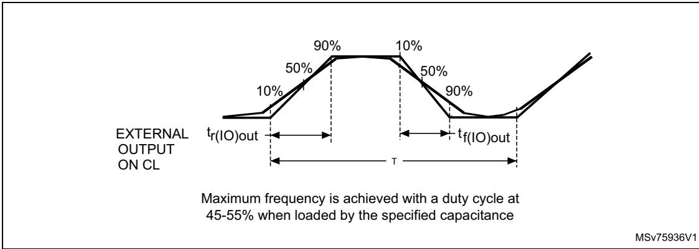

Figure 37. I/O AC characteristics definition

120/206

DS8626 Rev 12

STM32F405xx, STM32F407xx

Electrical characteristics

## 6.3.17 NRST pin characteristics

The NRST pin input driver uses CMOS technology. It is connected to a permanent pull-up resistor, $\mathsf { R } _ { \mathsf { P U } }$ (see Table 48).

Unless otherwise specified, the parameters given in Table 51 are derived from tests performed under the ambient temperature and $\mathsf { V } _ { \mathsf { D D } }$ supply voltage conditions summarized in Table 14.

Table 51. NRST pin characteristics

<table><tr><td rowspan=1 colspan=1>Symbol</td><td rowspan=1 colspan=1>Parameter</td><td rowspan=1 colspan=1>Conditions</td><td rowspan=1 colspan=1>Min</td><td rowspan=1 colspan=1>Typ</td><td rowspan=1 colspan=1>Max</td><td rowspan=1 colspan=1>Unit</td></tr><tr><td rowspan=1 colspan=1><eq>\overline { { \mathsf { V } _ { \mathsf { I L } ( \mathsf { N R S T } ) } ( 1 ) } }</eq></td><td rowspan=1 colspan=1>NRST Input low level voltage</td><td rowspan=1 colspan=1>TTL ports</td><td rowspan=1 colspan=1>-</td><td rowspan=1 colspan=1>-</td><td rowspan=1 colspan=1>0.8</td><td rowspan=4 colspan=1>V</td></tr><tr><td rowspan=1 colspan=1><eq>\mathsf { V } _ { \mathsf { I H ( N R S T ) } } ( 1 )</eq></td><td rowspan=1 colspan=1>NRST Input high level voltage</td><td rowspan=1 colspan=1><eq>2 . 7 \vee \le \vee _ { \mathsf { D D } } \le 3 . 6 \vee</eq></td><td rowspan=1 colspan=1>2</td><td rowspan=1 colspan=1>1</td><td rowspan=1 colspan=1>-</td></tr><tr><td rowspan=1 colspan=1><eq>\mathsf { V } _ { \mathsf { I L ( N R S T ) } } ( 1 )</eq></td><td rowspan=1 colspan=1>NRST Input low level voltage</td><td rowspan=1 colspan=1>CMOS ports</td><td rowspan=1 colspan=1>-</td><td rowspan=1 colspan=1>-</td><td rowspan=1 colspan=1><eq>0 . 3 \mathsf { V } _ { \mathsf { D D } }</eq></td></tr><tr><td rowspan=1 colspan=1><eq>\mathsf { V } _ { \mathsf { I H ( N R S T ) } } ( 1 )</eq></td><td rowspan=1 colspan=1>NRST Input high level voltage</td><td rowspan=1 colspan=1><eq>1 . 8 \vee \le \bigvee _ { \mathsf { D D } } \le 3 . 6 \vee</eq></td><td rowspan=1 colspan=1><eq>0 . 7 \mathsf { V } _ { \mathsf { D } \mathsf { D } }</eq></td><td rowspan=1 colspan=1>-</td><td rowspan=1 colspan=1>-</td></tr><tr><td rowspan=1 colspan=1><eq>V _ { \mathsf { h y s ( N R S T ) } }</eq></td><td rowspan=1 colspan=1>NRST Schmitt trigger voltagehysteresis</td><td rowspan=1 colspan=1></td><td rowspan=1 colspan=1>-</td><td rowspan=1 colspan=1>200</td><td rowspan=1 colspan=1>1</td><td rowspan=1 colspan=1>mV</td></tr><tr><td rowspan=1 colspan=1><eq>\mathsf { R } _ { \mathsf { P U } }</eq></td><td rowspan=1 colspan=1>Weak pull-up equivalent resistor(2)</td><td rowspan=1 colspan=1><eq>\mathsf { V } _ { \mathsf { I N } } = \mathsf { V } _ { \mathsf { S S } }</eq></td><td rowspan=1 colspan=1>30</td><td rowspan=1 colspan=1>40</td><td rowspan=1 colspan=1>50</td><td rowspan=1 colspan=1>kΩ</td></tr><tr><td rowspan=1 colspan=1><eq>\mathsf { V } _ { \mathsf { F ( N R S T ) } } ( 1 )</eq></td><td rowspan=1 colspan=1>NRST Input filtered pulse</td><td rowspan=1 colspan=1></td><td rowspan=1 colspan=1>-</td><td rowspan=1 colspan=1>1</td><td rowspan=1 colspan=1>100</td><td rowspan=1 colspan=1>ns</td></tr><tr><td rowspan=1 colspan=1><eq>\mathsf { V } _ { \mathsf { N F ( N R S T ) } } ( 1 )</eq></td><td rowspan=1 colspan=1>NRST Input not filtered pulse</td><td rowspan=1 colspan=1><eq>\mathsf { V } _ { \mathsf { D D } } > 2 . 7 \mathsf { V }</eq></td><td rowspan=1 colspan=1>300</td><td rowspan=1 colspan=1>-</td><td rowspan=1 colspan=1>-</td><td rowspan=1 colspan=1>ns</td></tr><tr><td rowspan=1 colspan=1>TNRST_OUT</td><td rowspan=1 colspan=1>Generated reset pulse duration</td><td rowspan=1 colspan=1>Internal resetsource</td><td rowspan=1 colspan=1>20</td><td rowspan=1 colspan=1>一</td><td rowspan=1 colspan=1></td><td rowspan=1 colspan=1>μs</td></tr></table>

1. Specified by design.

2. The pull-up is designed with a true resistance in series with a switchable PMOS. This PMOS contribution to the series resistance must be minimum (\~10% order).

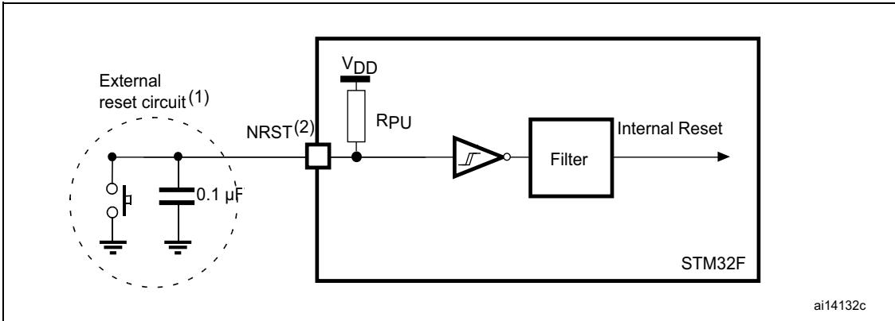

Figure 38. Recommended NRST pin protection

1. The reset network protects the device against parasitic resets.

2. The user must ensure that the level on the NRST pin can go below the $\mathsf { V } _ { \mathsf { I L ( N R S T ) } }$ max level specified in Table 51. Otherwise the reset is not taken into account by the device.

## 6.3.18 TIM timer characteristics

The parameters given in Table 52 and Table 53 are specified by design.

Refer to Section 6.3.16: I/O port characteristics for details on the input/output alternate function characteristics (output compare, input capture, external clock, PWM output).

121/206

DS8626 Rev 12

Electrical characteristics

STM32F405xx, STM32F407xx

Table 52. Characteristics of TIMx connected to the APB1 domain(1)

<table><tr><td rowspan=1 colspan=1>Symbol</td><td rowspan=1 colspan=1>Parameter</td><td rowspan=1 colspan=1>Conditions</td><td rowspan=1 colspan=1>Min</td><td rowspan=1 colspan=1>Max</td><td rowspan=1 colspan=1>Unit</td></tr><tr><td rowspan=4 colspan=1><eq>\mathfrak { t } _ { \Gamma \in \mathsf { S } ( \mathsf { T } \mid \mathsf { M } ) }</eq></td><td rowspan=4 colspan=1>Timer resolution time</td><td rowspan=2 colspan=1>AHB/APB1prescaler distinctfrom<eq>1 , \mathsf { f } _ { \mathsf { T I M X C L K } } =</eq>84 MHz</td><td rowspan=1 colspan=1>1</td><td rowspan=1 colspan=1></td><td rowspan=1 colspan=1>tTIMxCLK</td></tr><tr><td rowspan=1 colspan=1>11.9</td><td rowspan=1 colspan=1></td><td rowspan=1 colspan=1>ns</td></tr><tr><td rowspan=2 colspan=1>AHB/APB1prescaler = 1,<eq>\mathsf { f } _ { \mathsf { T I M x C L K } } = 4 2 \mathsf { M H z }</eq></td><td rowspan=1 colspan=1>1</td><td rowspan=1 colspan=1></td><td rowspan=1 colspan=1>tTIMxCLK</td></tr><tr><td rowspan=1 colspan=1>23.8</td><td rowspan=1 colspan=1></td><td rowspan=1 colspan=1>ns</td></tr><tr><td rowspan=2 colspan=1><eq>\mathsf { f } _ { \mathsf { E X T } }</eq></td><td rowspan=2 colspan=1>Timer external clockfrequency on CH1 to CH4</td><td rowspan=9 colspan=1><eq>\mathsf { f } _ { \mathsf { T I M x C L K } } = 8 4 ~ \mathsf { M H z }</eq><eq>\mathsf { A P B } \mathsf { 1 } = 4 2 \mathsf { M H } z</eq></td><td rowspan=1 colspan=1>0</td><td rowspan=1 colspan=1><eq>\mathsf { f } _ { \mathsf { T I M X C L K } } / 2</eq></td><td rowspan=1 colspan=1>MHz</td></tr><tr><td rowspan=1 colspan=1>0</td><td rowspan=1 colspan=1>42</td><td rowspan=1 colspan=1>MHz</td></tr><tr><td rowspan=1 colspan=1><eq>{ \mathsf { R e s } } _ { { \mathsf { T I M } } }</eq></td><td rowspan=1 colspan=1>Timer resolution</td><td rowspan=1 colspan=1>-</td><td rowspan=1 colspan=1>16/32</td><td rowspan=1 colspan=1>bit</td></tr><tr><td rowspan=4 colspan=1>tCOUNTER</td><td rowspan=2 colspan=1>16-bit counter clockperiod when internal clockis selected</td><td rowspan=1 colspan=1>1</td><td rowspan=1 colspan=1>65536</td><td rowspan=1 colspan=1><eq>\mathtt { t } _ { \mathsf { T I M X C L K } }</eq></td></tr><tr><td rowspan=1 colspan=1>0.0119</td><td rowspan=1 colspan=1>780</td><td rowspan=1 colspan=1>μs</td></tr><tr><td rowspan=2 colspan=1>32-bit counter clockperiod when internal clockis selected</td><td rowspan=1 colspan=1>1</td><td rowspan=1 colspan=1></td><td rowspan=1 colspan=1><eq>\mathrm { { \ t { \tau } u n \times C L K } }</eq></td></tr><tr><td rowspan=1 colspan=1>0.0119</td><td rowspan=1 colspan=1>51130563</td><td rowspan=1 colspan=1>μs</td></tr><tr><td rowspan=2 colspan=1>tMAX_COUNT</td><td rowspan=2 colspan=1>Maximum possible count</td><td rowspan=1 colspan=1></td><td rowspan=1 colspan=1>65536×65536</td><td rowspan=1 colspan=1>tTIMxCLK</td></tr><tr><td rowspan=1 colspan=1></td><td rowspan=1 colspan=1>51.1</td><td rowspan=1 colspan=1>S</td></tr></table>

1. TIMx is used as a general term to refer to the TIM2, TIM3, TIM4, TIM5, TIM6, TIM7, and TIM12 timers.

122/206

DS8626 Rev 12

STM32F405xx, STM32F407xx

Electrical characteristics

Table 53. Characteristics of TIMx connected to the APB2 domain(1)

<table><tr><td rowspan=1 colspan=1>Symbol</td><td rowspan=1 colspan=1>Parameter</td><td rowspan=1 colspan=1>Conditions</td><td rowspan=1 colspan=1>Min</td><td rowspan=1 colspan=1>Max</td><td rowspan=1 colspan=1>Unit</td></tr><tr><td rowspan=4 colspan=1>tres(TIM)</td><td rowspan=4 colspan=1>Timer resolution time</td><td rowspan=2 colspan=1>AHB/APB2prescaler distinctfrom<eq>1 , \mathsf { f } _ { \mathsf { T I M X C L K } } =</eq>168 MHz</td><td rowspan=1 colspan=1>1</td><td rowspan=1 colspan=1></td><td rowspan=1 colspan=1>tTIMxCLK</td></tr><tr><td rowspan=1 colspan=1>5.95</td><td rowspan=1 colspan=1></td><td rowspan=1 colspan=1>ns</td></tr><tr><td rowspan=2 colspan=1>AHB/APB2prescaler = 1,<eq>\mathsf { f } _ { \mathsf { T I M x C L K } } = 8 4 ~ \mathsf { M H z }</eq></td><td rowspan=1 colspan=1>1</td><td rowspan=1 colspan=1></td><td rowspan=1 colspan=1>tTIMxCLK</td></tr><tr><td rowspan=1 colspan=1>11.9</td><td rowspan=1 colspan=1></td><td rowspan=1 colspan=1>ns</td></tr><tr><td rowspan=2 colspan=1><eq>\mathsf { f } _ { \mathsf { E X T } }</eq></td><td rowspan=2 colspan=1>Timer external clockfrequency on CH1 toCH4</td><td rowspan=5 colspan=1>fTIMxCLK =168 MHzAPB2 = 84 MHz</td><td rowspan=1 colspan=1>0</td><td rowspan=1 colspan=1><eq>\mathsf { f } _ { \mathsf { T I M X C L K } } / 2</eq></td><td rowspan=1 colspan=1>MHz</td></tr><tr><td rowspan=1 colspan=1>0</td><td rowspan=1 colspan=1>84</td><td rowspan=1 colspan=1>MHz</td></tr><tr><td rowspan=1 colspan=1>ReSTIM</td><td rowspan=1 colspan=1>Timer resolution</td><td rowspan=1 colspan=1></td><td rowspan=1 colspan=1>16</td><td rowspan=1 colspan=1>bit</td></tr><tr><td rowspan=1 colspan=1>tcOUNTER</td><td rowspan=1 colspan=1>16-bit counter clockperiod when internalclock is selected</td><td rowspan=1 colspan=1>1</td><td rowspan=1 colspan=1>65536</td><td rowspan=1 colspan=1>tTIMxCLK</td></tr><tr><td rowspan=1 colspan=1>tMAX_COUNT</td><td rowspan=1 colspan=1>Maximum possible count</td><td rowspan=1 colspan=1></td><td rowspan=1 colspan=1>32768</td><td rowspan=1 colspan=1>tTIMxCLK</td></tr></table>

1. TIMx is used as a general term to refer to the TIM1, TIM8, TIM9, TIM10, and TIM11 timers.

## 6.3.19Communications interfaces

## I²C interface characteristics

The ${ \mathsf { I } } ^ { 2 } { \mathsf { C } }$ interface meets the timings requirements of the ${ \mathsf { I } } ^ { 2 } { \mathsf { C } } .$ -bus specification and user manual rev. 03 for:

•Standard-mode (Sm): with a bit rate up to 100 kbit/s

• Fast-mode (Fm): with a bit rate up to 400 kbit/s.

The ${ \mathsf { I } } ^ { 2 } { \mathsf { C } }$ timings requirements are specified by design when the I2C peripheral is properly configured (refer to RM0090 reference manual).

The SDA and SCL I/O requirements are met with the following restrictions: the SDA and SCL I/O pins are not “true” open-drain. When configured as open-drain, the PMOS connected between the l/O pin and $\mathsf { V } _ { \mathsf { D D } }$ is disabled, but is still present. Refer to Section 6.3.16: I/O port characteristics for more details on the I²C l/O characteristics.

All ${ \mathsf { I } } ^ { 2 } { \mathsf { C } }$ SDA and SCL I/Os embed an analog filter. Refer to the table below for the analog filter characteristics:

Table 54. I2C analog filter characteristics(1)

<table><tr><td rowspan=1 colspan=1>Symbol</td><td rowspan=1 colspan=1>Parameter</td><td rowspan=1 colspan=1>Min</td><td rowspan=1 colspan=1>Max</td><td rowspan=1 colspan=1>Unit</td></tr><tr><td rowspan=1 colspan=1><eq>\mathfrak { t } _ { \mathsf { A F } }</eq></td><td rowspan=1 colspan=1>Maximum pulse width of spikesthat are suppressed by the analogfilter</td><td rowspan=1 colspan=1><eq>5 0 ^ { ( 2 ) }</eq></td><td rowspan=1 colspan=1><eq>2 6 0 ^ { ( 3 ) }</eq></td><td rowspan=1 colspan=1>ns</td></tr></table>

1. Specified by design.

2. Spikes with widths below $\mathfrak { t } _ { \mathsf { A F } ( \mathsf { m i n } ) }$ are filtered.

3. Spikes with widths above $\mathsf { t } _ { \mathsf { A F ( m a x ) } }$ are not filtered

123/206

DS8626 Rev 12

Electrical characteristics

STM32F405xx, STM32F407xx

## SPI interface characteristics

Unless otherwise specified, the parameters given in Table 55 for SPI are derived from tests performed under the ambient temperature, $\mathsf { f } _ { \mathsf { P C L K } \times }$ frequency and $\mathsf { V } _ { \mathsf { D D } }$ supply voltage conditions summarized in Table 14 with the following configuration:

• Output speed is set to OSPEEDRy[1:0] = 10

• Capacitive load ${ \mathsf { C } } = 3 0 { \mathsf { p F } }$

•Measurement points are done at CMOS levels: $0 . 5 \mathsf { V } _ { \mathsf { D D } }$

Refer to Section 6.3.16: I/O port characteristics for more details on the input/output alternate function characteristics (NSS, SCK, MOSI, MISO).

Table 55. SPI dynamic characteristics(1)

<table><tr><td colspan="1" rowspan="1">Symbol</td><td colspan="1" rowspan="1">Parameter</td><td colspan="1" rowspan="1">Conditions</td><td colspan="1" rowspan="1">Min</td><td colspan="1" rowspan="1">Typ</td><td colspan="1" rowspan="1">Max</td><td colspan="1" rowspan="1">Unit</td></tr><tr><td colspan="1" rowspan="2">fscK</td><td colspan="1" rowspan="4">SPI clock frequency</td><td colspan="1" rowspan="1">Master mode, SPI1,<eq>2 . 7 \mathrm { V } < \mathrm { V } _ { \mathrm { D D } } < 3 . 6 \mathrm { V }</eq></td><td colspan="1" rowspan="2"></td><td colspan="1" rowspan="2"></td><td colspan="1" rowspan="1">42</td><td colspan="1" rowspan="4">MHz</td></tr><tr><td colspan="1" rowspan="1">Slave mode, SPI1,<eq>2 . 7 \mathrm { V } < \mathrm { V } _ { \mathrm { D D } } < 3 . 6 \mathrm { V }</eq></td><td colspan="1" rowspan="1">42</td></tr><tr><td colspan="1" rowspan="2">1/tc(SCK)</td><td colspan="1" rowspan="1">Master mode, SPI1/2/3,<eq>1 . 7 \mathrm { V } < \mathrm { V } _ { \mathrm { D D } } < 3 . 6 \mathrm { V }</eq></td><td colspan="1" rowspan="2"></td><td colspan="1" rowspan="2"></td><td colspan="1" rowspan="1">21</td></tr><tr><td colspan="1" rowspan="1">Slave mode, SPI1/2/3,<eq>1 . 7 \mathrm { V } < \mathrm { V } _ { \mathrm { D D } } < 3 . 6 \mathrm { V }</eq></td><td colspan="1" rowspan="1">21</td></tr><tr><td colspan="1" rowspan="1">Duty(SCK)</td><td colspan="1" rowspan="1">Duty cycle of SPI clockfrequency</td><td colspan="1" rowspan="1">Slave mode</td><td colspan="1" rowspan="1">30</td><td colspan="1" rowspan="1">50</td><td colspan="1" rowspan="1">70</td><td colspan="1" rowspan="1">%</td></tr><tr><td colspan="1" rowspan="1">tw(SCKH)</td><td colspan="1" rowspan="2">SCK high and low time</td><td colspan="1" rowspan="1">Master mode, SPI presc = 2,<eq>2 . 7 \mathrm { V } < \mathrm { V } _ { \mathrm { D D } } < 3 . 6 \mathrm { V }</eq></td><td colspan="1" rowspan="1"><eq>T _ { \mathsf { P C L K } ^ { - 0 . 5 } }</eq></td><td colspan="1" rowspan="1">TPCLK</td><td colspan="1" rowspan="1"><eq>T _ { \mathsf { P C L K } ^ { + 0 . 5 } }</eq></td><td colspan="1" rowspan="18">ns</td></tr><tr><td colspan="1" rowspan="1">tw(SCKL)</td><td colspan="1" rowspan="1">Master mode, SPI presc = 2,<eq>1 . 7 \mathrm { V } < \mathrm { V } _ { \mathrm { D D } } < 3 . 6 \mathrm { V }</eq></td><td colspan="1" rowspan="1"><eq>{ \sf T } _ { \sf P C L K ^ { - 2 } }</eq></td><td colspan="1" rowspan="1"><eq>{ \sf T } _ { \sf P C L K }</eq></td><td colspan="1" rowspan="1"><eq>\mathsf { T } _ { \mathsf { P C L K } } { ^ { + 2 } }</eq></td></tr><tr><td colspan="1" rowspan="1">tsu(NSS)</td><td colspan="1" rowspan="1">NSS setup time</td><td colspan="1" rowspan="1">Slave mode, SPI presc = 2</td><td colspan="1" rowspan="1">4 x TPCLK</td><td colspan="1" rowspan="2">1</td><td colspan="1" rowspan="2"></td></tr><tr><td colspan="1" rowspan="1">th(NSS)</td><td colspan="1" rowspan="1">NSS hold time</td><td colspan="1" rowspan="1">Slave mode, SPI presc = 2</td><td colspan="1" rowspan="1"><eq>2 \times T _ { \mathsf { P C L K } }</eq></td></tr><tr><td colspan="1" rowspan="1">tsu(MI)</td><td colspan="1" rowspan="2">Data input setup time</td><td colspan="1" rowspan="1">Master mode</td><td colspan="1" rowspan="1">6.5</td><td colspan="1" rowspan="1">-</td><td colspan="1" rowspan="1"></td></tr><tr><td colspan="1" rowspan="1">tsu(SI)</td><td colspan="1" rowspan="1">Slave mode</td><td colspan="1" rowspan="1">2.5</td><td colspan="1" rowspan="1">-</td><td colspan="1" rowspan="1"></td></tr><tr><td colspan="1" rowspan="1">th(MI)</td><td colspan="1" rowspan="2">Data input hold time</td><td colspan="1" rowspan="1">Master mode</td><td colspan="1" rowspan="1">2.5</td><td colspan="1" rowspan="1">1</td><td colspan="1" rowspan="1">-</td></tr><tr><td colspan="1" rowspan="1">th(SI)</td><td colspan="1" rowspan="1">Slave mode</td><td colspan="1" rowspan="1">4</td><td colspan="1" rowspan="1">-</td><td colspan="1" rowspan="1"></td></tr><tr><td colspan="1" rowspan="1"><eq>\mathfrak { t } _ { \mathsf { a } ( \mathsf { S O } ) } \ L ^ { ( 2 ) }</eq></td><td colspan="1" rowspan="1">Data output access time</td><td colspan="1" rowspan="1">Slave mode, SPI presc = 2</td><td colspan="1" rowspan="1">0</td><td colspan="1" rowspan="1">一</td><td colspan="1" rowspan="1"><eq>4 \times T _ { \mathsf { P C L K } }</eq></td></tr><tr><td colspan="1" rowspan="2"><eq>\mathfrak { t } _ { \mathtt { d i s } ( \mathsf { S O } ) } { } ^ { ( 3 ) }</eq></td><td colspan="1" rowspan="2">Data output disable time</td><td colspan="1" rowspan="1">Slave mode, SPI1,<eq>2 . 7 \mathrm { V } < \mathrm { V } _ { \mathrm { D D } } < 3 . 6 \mathrm { V }</eq></td><td colspan="1" rowspan="1">0</td><td colspan="1" rowspan="1"></td><td colspan="1" rowspan="1">7.5</td></tr><tr><td colspan="1" rowspan="1">Slave mode, SPI1/2/3<eq>1 . 7 \mathrm { V } < \mathrm { V } _ { \mathrm { D D } } < 3 . 6 \mathrm { V }</eq></td><td colspan="1" rowspan="1">0</td><td colspan="1" rowspan="1"></td><td colspan="1" rowspan="1">16.5</td></tr><tr><td colspan="1" rowspan="4"><eq>\mathfrak { t } _ { \mathsf { v } ( \mathsf { S O } ) }</eq>tn(SO)</td><td colspan="1" rowspan="4">Data output valid/hold time</td><td colspan="1" rowspan="1">Slave mode (after enable edge),SPI1,<eq>2 . 7 \mathrm { V } < \mathrm { V } _ { \mathrm { D D } } < 3 . 6 \mathrm { V }</eq></td><td colspan="1" rowspan="1"></td><td colspan="1" rowspan="1">11</td><td colspan="1" rowspan="1">13</td></tr><tr><td colspan="1" rowspan="1">Slave mode (after enable edge),SPI2/3,<eq>2 . 7 \mathrm { V } < \mathrm { V } _ { \mathsf { D D } } < 3 . 6 \mathrm { V }</eq></td><td colspan="1" rowspan="1"></td><td colspan="1" rowspan="1">12</td><td colspan="1" rowspan="1">16.5</td></tr><tr><td colspan="1" rowspan="1">Slave mode (after enable edge),SPI1,<eq>1 . 7 \mathrm { V } < \mathrm { V } _ { \mathrm { D D } } < 3 . 6 \mathrm { V }</eq></td><td colspan="1" rowspan="1"></td><td colspan="1" rowspan="1">15.5</td><td colspan="1" rowspan="1">19</td></tr><tr><td colspan="1" rowspan="1">Slave mode (after enable edge),SPI2/3,<eq>1 . 7 \mathrm { V } < \mathrm { V } _ { \mathrm { D D } } < 3 . 6 \mathrm { V }</eq></td><td colspan="1" rowspan="1"></td><td colspan="1" rowspan="1">18</td><td colspan="1" rowspan="1">20.5</td></tr><tr><td colspan="1" rowspan="2"><eq>\mathsf { t } _ { \mathsf { v } ( \mathsf { M O } ) }</eq></td><td colspan="1" rowspan="2">Data output valid time</td><td colspan="1" rowspan="1">Master mode (after enable edge),SPI1,<eq>2 . 7 \mathrm { V } < \mathrm { V } _ { \mathrm { D D } } < 3 . 6 \mathrm { V }</eq></td><td colspan="1" rowspan="1"></td><td colspan="1" rowspan="1"></td><td colspan="1" rowspan="1">2.5</td></tr><tr><td colspan="1" rowspan="1">Master mode (after enable edge),SPI1/2/3,<eq>1 . 7 \mathrm { V } < \mathrm { V } _ { \mathrm { D D } } < 3 . 6 \mathrm { V }</eq></td><td colspan="1" rowspan="1"></td><td colspan="1" rowspan="1"></td><td colspan="1" rowspan="1">4.5</td></tr><tr><td colspan="1" rowspan="1">th(MO)</td><td colspan="1" rowspan="1">Data output hold time</td><td colspan="1" rowspan="1">Master mode (after enable edge)</td><td colspan="1" rowspan="1">0</td><td colspan="1" rowspan="1"></td><td colspan="1" rowspan="1"></td></tr></table>

1. Evaluated by characterization - not tested in production.

2. Min time is for the minimum time to drive the output and the max time is for the maximum time to validate the data.

124/206

DS8626 Rev 12

STM32F405xx, STM32F407xx

Electrical characteristics

3. Min time is for the minimum time to invalidate the output and the max time is for the maximum time to put the data in Hi-Z.

125/206

DS8626 Rev 12

Electrical characteristics

STM32F405xx, STM32F407xx

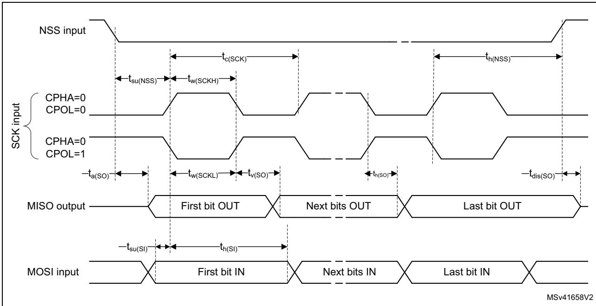

Figure 39. SPI timing diagram - slave mode and CPHA = 0

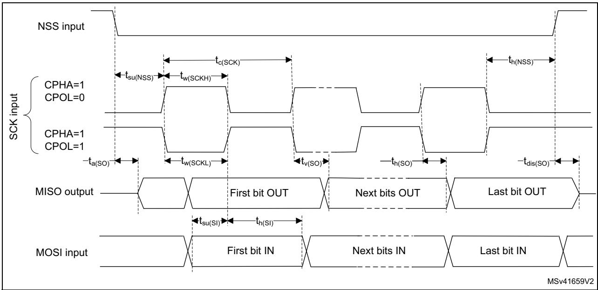

Figure 40. SPI timing diagram - slave mode and CPHA = 1

126/206

DS8626 Rev 12

STM32F405xx, STM32F407xx

Electrical characteristics

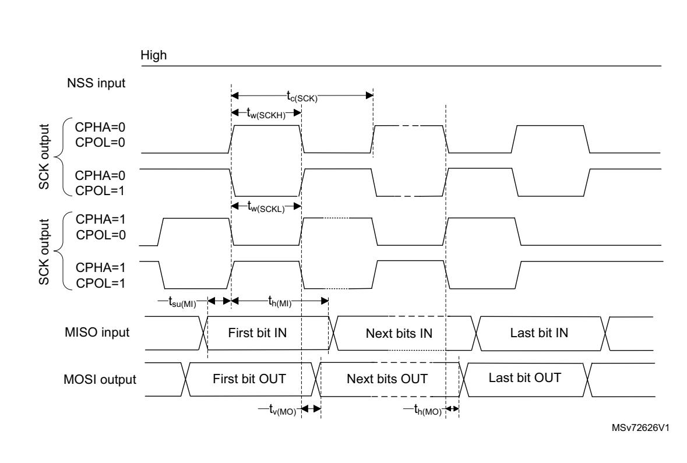

Figure 41. SPI timing diagram - master mode

DS8626 Rev 12

127/206

Electrical characteristics

STM32F405xx, STM32F407xx

## I²S interface characteristics

Unless otherwise specified, the parameters given in Table 56 for the $\mathsf { i } ^ { 2 } \mathsf { S }$ interface are derived from tests performed under the ambient temperature, $\mathsf { f } _ { \mathsf { P C L K } \times }$ frequency and $\mathsf { V } _ { \mathsf { D D } }$ supply voltage conditions summarized in Table 14, with the following configuration:

• Output speed is set to OSPEEDRy[1:0] = 10

• Capacitive load ${ \mathsf { C } } = 3 0 { \mathsf { p F } }$

•Measurement points are done at CMOS levels: $0 . 5 \mathsf { V } _ { \mathsf { D D } }$

Refer to Section 6.3.16: I/O port characteristics for more details on the input/output alternate function characteristics (CK, SD, WS).

Table 56. $1 ^ { 2 } S$ dynamic characteristics(1)

<table><tr><td rowspan=1 colspan=1>Symbol</td><td rowspan=1 colspan=1>Parameter</td><td rowspan=1 colspan=1>Conditions</td><td rowspan=1 colspan=1>Min</td><td rowspan=1 colspan=1>Max</td><td rowspan=1 colspan=1>Unit</td></tr><tr><td rowspan=1 colspan=1><eq>\mathsf { f } _ { \mathsf { M C K } }</eq></td><td rowspan=1 colspan=1><eq>{ \mathsf { I } } ^ { 2 } { \mathsf { S } }</eq>main clock output</td><td rowspan=1 colspan=1></td><td rowspan=1 colspan=1>256 x8K</td><td rowspan=1 colspan=1><eq>2 5 6 \times 5 \mathrm { s } ^ { ( 2 ) }</eq></td><td rowspan=1 colspan=1>MHz</td></tr><tr><td rowspan=2 colspan=1><eq>\mathsf { f } _ { \mathsf { C K } }</eq></td><td rowspan=2 colspan=1><eq>{ \mathsf { I } } ^ { 2 } { \mathsf { S } }</eq>clock frequency</td><td rowspan=1 colspan=1>Master data: 32 bits</td><td rowspan=1 colspan=1>1</td><td rowspan=1 colspan=1><eq>6 4 \times \mathsf { F } _ { \mathsf { S } }</eq></td><td rowspan=2 colspan=1>MHz</td></tr><tr><td rowspan=1 colspan=1>Slave data: 32 bits</td><td rowspan=1 colspan=1>-</td><td rowspan=1 colspan=1><eq>6 4 \times \mathsf { F } _ { \mathsf { S } }</eq></td></tr><tr><td rowspan=1 colspan=1><eq>\mathsf { D } _ { \mathsf { C K } }</eq></td><td rowspan=1 colspan=1>I²S clock frequency duty cycle</td><td rowspan=1 colspan=1>Slave receiver</td><td rowspan=1 colspan=1>30</td><td rowspan=1 colspan=1>70</td><td rowspan=1 colspan=1>%</td></tr><tr><td rowspan=1 colspan=1>tv(WS)</td><td rowspan=1 colspan=1>WS valid time</td><td rowspan=1 colspan=1>Master mode</td><td rowspan=1 colspan=1>0</td><td rowspan=1 colspan=1>6</td><td rowspan=11 colspan=1>ns</td></tr><tr><td rowspan=1 colspan=1>th(WS)</td><td rowspan=1 colspan=1>WS hold time</td><td rowspan=1 colspan=1>Master mode</td><td rowspan=1 colspan=1>0</td><td rowspan=1 colspan=1></td></tr><tr><td rowspan=1 colspan=1>tsu(WS)</td><td rowspan=1 colspan=1>WS setup time</td><td rowspan=1 colspan=1>Slave mode</td><td rowspan=1 colspan=1>1</td><td rowspan=1 colspan=1>=</td></tr><tr><td rowspan=1 colspan=1>th(wS)</td><td rowspan=1 colspan=1>WS hold time</td><td rowspan=1 colspan=1>Slave mode</td><td rowspan=1 colspan=1>0</td><td rowspan=1 colspan=1></td></tr><tr><td rowspan=1 colspan=1>tsu(SD_MR)</td><td rowspan=2 colspan=1>Data input setup time</td><td rowspan=1 colspan=1>Master receiver</td><td rowspan=1 colspan=1>7.5</td><td rowspan=1 colspan=1>一</td></tr><tr><td rowspan=1 colspan=1>tsu(SD_SR)</td><td rowspan=1 colspan=1>Slave receiver</td><td rowspan=1 colspan=1>2</td><td rowspan=1 colspan=1></td></tr><tr><td rowspan=1 colspan=1>th(SD_MR)</td><td rowspan=2 colspan=1>Data input hold time</td><td rowspan=1 colspan=1>Master receiver</td><td rowspan=1 colspan=1>0</td><td rowspan=1 colspan=1></td></tr><tr><td rowspan=1 colspan=1>th(SD_SR)</td><td rowspan=1 colspan=1>Slave receiver</td><td rowspan=1 colspan=1>0</td><td rowspan=1 colspan=1>-</td></tr><tr><td rowspan=1 colspan=1>tv(SD_ST)th(SD_ST)</td><td rowspan=1 colspan=1>Data output valid time</td><td rowspan=1 colspan=1>Slave transmitter (after enable edge)</td><td rowspan=1 colspan=1>1</td><td rowspan=1 colspan=1>27</td></tr><tr><td rowspan=1 colspan=1>tv(SD_MT)</td><td rowspan=1 colspan=1></td><td rowspan=1 colspan=1>Master transmitter (after enable edge)</td><td rowspan=1 colspan=1>-</td><td rowspan=1 colspan=1>20</td></tr><tr><td rowspan=1 colspan=1>th(SD_MT)</td><td rowspan=1 colspan=1>Data output hold time</td><td rowspan=1 colspan=1>Master transmitter (after enable edge)</td><td rowspan=1 colspan=1>2.5</td><td rowspan=1 colspan=1>-</td></tr></table>

1. Evaluated by characterization - not tested in production.

2. The maximum value of 256 $\textsf { x F } _ { \mathsf { S } }$ is 42 MHz (APB1 maximum frequency).

Note: Refer to the $I ^ { 2 } S$ section of RMo090 reference manual for more details on the sampling frequency $( F _ { S } ) .$ fMCK, $f _ { C K } ,$ and $D _ { C K }$ values reflect only the digital peripheral behavior. The value of these parameters might be slightly impacted by the source clock accuracy. $D _ { C K }$ depends mainly on the value of ODD bit. The digital contribution leads to a minimum value of I2SDIV / (2 x I2SDIV + ODD) and a maximum value of (I2SDIV + ODD) / (2 x I2SDIV + ODD). $F _ { S }$ maximum value is supported for each mode/condition.

128/206

DS8626 Rev 12

STM32F405xx, STM32F407xx

Electrical characteristics

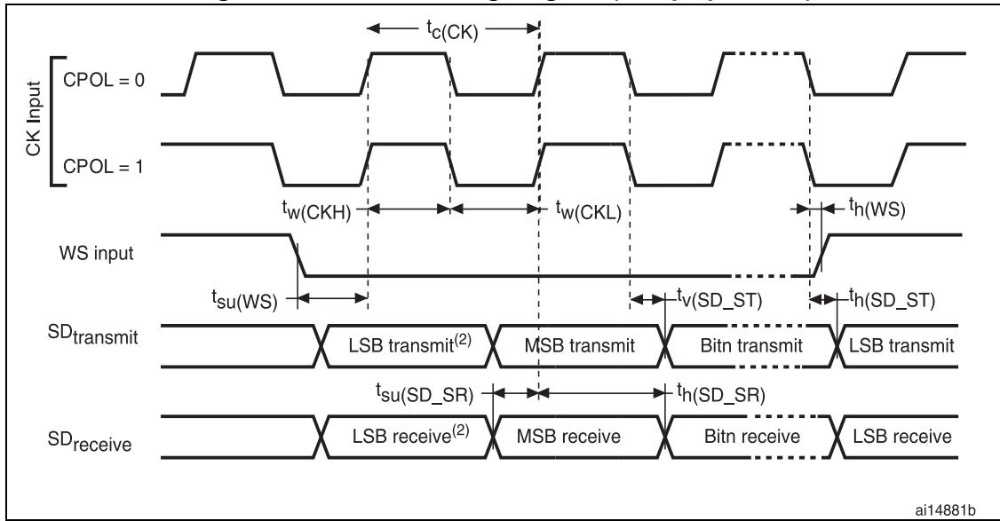

Figure 42. $1 ^ { 2 } \thinspace \thinspace \mathsf { S }$ slave timing diagram (Philips protocol)

1. LSB transmit/receive of the previously transmitted byte. No LSB transmit/receive is sent before the first byte.

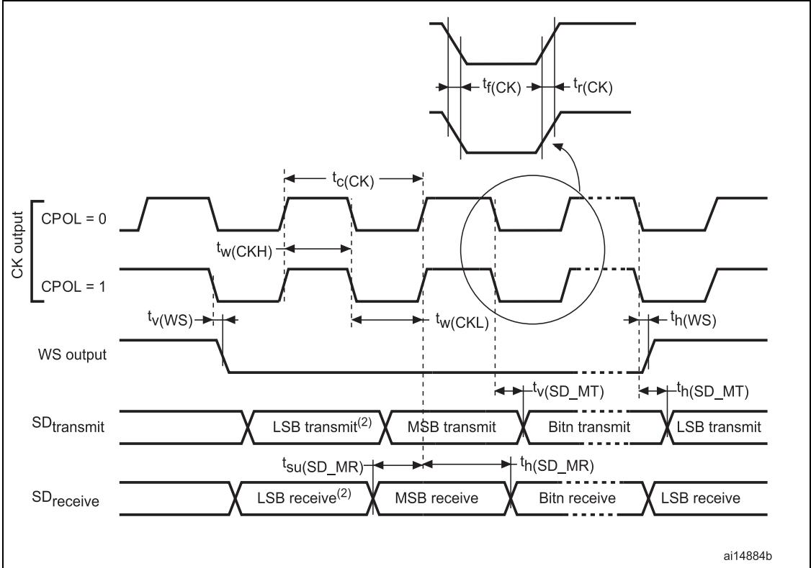

Figure 43. $1 ^ { 2 } \thinspace \thinspace \mathsf { S }$ master timing diagram (Philips protocol)(1)

1. Evaluated by characterization - not tested in production.

2. LSB transmit/receive of the previously transmitted byte. No LSB transmit/receive is sent before the first byte.

129/206

DS8626 Rev 12

Electrical characteristics

STM32F405xx, STM32F407xx

## USB OTG FS characteristics

This interface is present in both the USB OTG HS and USB OTG FS controllers.

Table 57. USB OTG FS startup time

<table><tr><td rowspan=1 colspan=1>Symbol</td><td rowspan=1 colspan=1>Parameter</td><td rowspan=1 colspan=1>Max</td><td rowspan=1 colspan=1>Unit</td></tr><tr><td rowspan=1 colspan=1><eq>\overline { { \mathsf { t } _ { \mathsf { S T A R T U P } } ( 1 ) } }</eq></td><td rowspan=1 colspan=1>USB OTG FS transceiver startup time</td><td rowspan=1 colspan=1>1</td><td rowspan=1 colspan=1>μs</td></tr></table>

1. Specified by design.

Table 58. USB OTG FS DC electrical characteristics

<table><tr><td rowspan=1 colspan=2>Symbol</td><td rowspan=1 colspan=1>Parameter</td><td rowspan=1 colspan=1>Conditions</td><td rowspan=1 colspan=1><eq>\mathsf { M i n } . ^ { ( 1 ) }</eq></td><td rowspan=1 colspan=1><eq>{ \mathsf { T y p . } }</eq></td><td rowspan=1 colspan=1><eq>\pmb { M } \mathbf { a x . } ^ { ( 1 ) }</eq></td><td rowspan=1 colspan=1>Unit</td></tr><tr><td rowspan=4 colspan=1>Inputlevels</td><td rowspan=1 colspan=1><eq>\mathsf { V } _ { \mathsf { D D } }</eq></td><td rowspan=1 colspan=1>USB OTG FS operatingvoltage</td><td rowspan=1 colspan=1></td><td rowspan=1 colspan=1><eq>3 . 0 ^ { ( 2 ) }</eq></td><td rowspan=1 colspan=1>=</td><td rowspan=1 colspan=1>3.6</td><td rowspan=1 colspan=1>V</td></tr><tr><td rowspan=1 colspan=1><eq>{ \mathsf { V } } _ { \mathsf { D } } { \mathsf { I } } ^ { ( 3 ) }</eq></td><td rowspan=1 colspan=1>Differential input sensitivity</td><td rowspan=1 colspan=1>I(USB_FS_DP/DM,USB_HS_DP/DM)</td><td rowspan=1 colspan=1>0.2</td><td rowspan=1 colspan=1>=</td><td rowspan=1 colspan=1></td><td rowspan=3 colspan=1>V</td></tr><tr><td rowspan=1 colspan=1><eq>{ \mathsf { V } } _ { \mathsf { C M } } { } ^ { ( 3 ) }</eq></td><td rowspan=1 colspan=1>Differential common moderange</td><td rowspan=1 colspan=1>Includes<eq>\mathsf { V } _ { \mathsf { D } | }</eq>range</td><td rowspan=1 colspan=1>0.8</td><td rowspan=1 colspan=1>-</td><td rowspan=1 colspan=1>2.5</td></tr><tr><td rowspan=1 colspan=1><eq>{ \mathsf { V } } _ { \mathsf { S E } } { } ^ { ( 3 ) }</eq></td><td rowspan=1 colspan=1>Single ended receiverthreshold</td><td rowspan=1 colspan=1></td><td rowspan=1 colspan=1>1.3</td><td rowspan=1 colspan=1>-</td><td rowspan=1 colspan=1>2.0</td></tr><tr><td rowspan=2 colspan=1>Outputlevels</td><td rowspan=1 colspan=1><eq>V _ { \mathrm { O L } }</eq></td><td rowspan=1 colspan=1>Static output level low</td><td rowspan=1 colspan=1><eq>\mathsf { R } _ { \mathsf { L } } \mathsf { o f } 1 . 5 \mathsf { k } \Omega \mathsf { t o } 3 . 6 \mathsf { V } ^ { ( 4 ) }</eq></td><td rowspan=1 colspan=1>-</td><td rowspan=1 colspan=1>-</td><td rowspan=1 colspan=1>0.3</td><td rowspan=2 colspan=1>V</td></tr><tr><td rowspan=1 colspan=1><eq>\mathsf { V } _ { \mathsf { O H } }</eq></td><td rowspan=1 colspan=1>Static output level high</td><td rowspan=1 colspan=1><eq>\mathsf { R } _ { \mathsf { L } } \mathsf { o f } 1 5 \mathsf { k } \Omega \mathsf { t o } \mathsf { V } _ { \mathsf { S S } } ( 4 )</eq></td><td rowspan=1 colspan=1>2.8</td><td rowspan=1 colspan=1>-</td><td rowspan=1 colspan=1>3.6</td></tr><tr><td rowspan=2 colspan=2><eq>\mathsf { R } _ { \mathsf { P D } }</eq></td><td rowspan=1 colspan=1>PA11, PA12, PB14, PB15(USB_FS_DP/DM,USB_HS_DP/DM)</td><td rowspan=2 colspan=1><eq>\mathsf { V } _ { \mathsf { I N } } = \mathsf { V } _ { \mathsf { D D } }</eq></td><td rowspan=1 colspan=1>17</td><td rowspan=1 colspan=1>21</td><td rowspan=1 colspan=1>24</td><td rowspan=4 colspan=1>kΩ</td></tr><tr><td rowspan=1 colspan=1>PA9, PB13(OTG_FS_VBUS,OTG_HS_VBUS)</td><td rowspan=1 colspan=1>0.65</td><td rowspan=1 colspan=1>1.1</td><td rowspan=1 colspan=1>2.0</td></tr><tr><td rowspan=2 colspan=2><eq>\mathsf { R } _ { \mathsf { P U } }</eq></td><td rowspan=1 colspan=1>PA12, PB15 (USB_FS_DP,USB_HS_DP)</td><td rowspan=1 colspan=1><eq>\mathsf { V } _ { \mathsf { I N } } = \mathsf { V } _ { \mathsf { S S } }</eq></td><td rowspan=1 colspan=1>1.5</td><td rowspan=1 colspan=1>1.8</td><td rowspan=1 colspan=1>2.1</td></tr><tr><td rowspan=1 colspan=1>PA9, PB13(OTG_FS_VBUS,OTG_HS_VBUS)</td><td rowspan=1 colspan=1><eq>\mathsf { V } _ { \mathsf { I N } } = \mathsf { V } _ { \mathsf { S S } }</eq></td><td rowspan=1 colspan=1>0.25</td><td rowspan=1 colspan=1>0.37</td><td rowspan=1 colspan=1>0.55</td></tr></table>

1. All the voltages are measured from the local ground potential.

2. The STM32F405xx and STM32F407xx USB OTG FS functionality is ensured down to 2.7 V but not the full USB OTG FS electrical characteristics which are degraded in the 2.7-to-3.0 V VpD voltage range.

3. Specified by design.

4. $\mathsf { R } _ { \mathsf { L } }$ is the load connected on the USB OTG FS drivers

130/206

DS8626 Rev 12

STM32F405xx, STM32F407xx

Electrical characteristics

Figure 44. USB OTG FS timings: definition of data signal rise and fall time

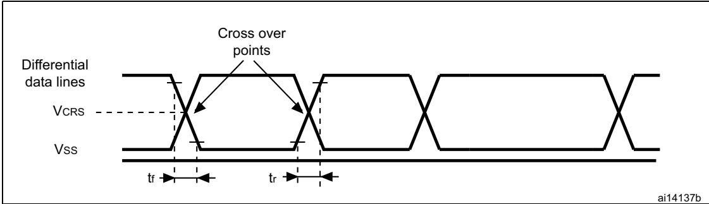

Table 59. USB OTG FS electrical characteristics(1)

<table><tr><td rowspan=1 colspan=6>Driver characteristics</td></tr><tr><td rowspan=1 colspan=1>Symbol</td><td rowspan=1 colspan=1>Parameter</td><td rowspan=1 colspan=1>Conditions</td><td rowspan=1 colspan=1>Min</td><td rowspan=1 colspan=1>Max</td><td rowspan=1 colspan=1>Unit</td></tr><tr><td rowspan=1 colspan=1><eq>\mathfrak { t } _ { \mathfrak { r } }</eq></td><td rowspan=1 colspan=1>Rise time(2)</td><td rowspan=1 colspan=1><eq>\mathsf C _ { \mathsf { L } } = 5 0 { \mathsf { \ p F } }</eq></td><td rowspan=1 colspan=1>4</td><td rowspan=1 colspan=1>20</td><td rowspan=1 colspan=1>ns</td></tr><tr><td rowspan=1 colspan=1><eq>\mathfrak { t } _ { \mathfrak { f } }</eq></td><td rowspan=1 colspan=1>Fall time(2)</td><td rowspan=1 colspan=1><eq>\mathsf C _ { \mathsf { L } } = 5 0 { \mathsf { \ p F } }</eq></td><td rowspan=1 colspan=1>4</td><td rowspan=1 colspan=1>20</td><td rowspan=1 colspan=1>ns</td></tr><tr><td rowspan=1 colspan=1><eq>\mathrm { { \sf t } } _ { \sf { r f m } }</eq></td><td rowspan=1 colspan=1>Rise/ fall time matching</td><td rowspan=1 colspan=1><eq>\mathfrak { t } _ { \mathfrak { r } } / \mathfrak { t } _ { \mathfrak { f } }</eq></td><td rowspan=1 colspan=1>90</td><td rowspan=1 colspan=1>110</td><td rowspan=1 colspan=1>%</td></tr><tr><td rowspan=1 colspan=1><eq>\mathsf { V } _ { \mathsf { C R S } }</eq></td><td rowspan=1 colspan=1>Output signal crossover voltage</td><td rowspan=1 colspan=1>-</td><td rowspan=1 colspan=1>1.3</td><td rowspan=1 colspan=1>2.0</td><td rowspan=1 colspan=1>V</td></tr></table>

1. Specified by design.

2. Measured from 10% to 90% of the data signal. For more detailed informations, please refer to USB Specification - Chapter 7 (version 2.0).

## USB HS characteristics

Unless otherwise specified, the parameters given in Table 62 for ULPl are derived from tests performed under the ambient temperature, $\mathsf { f } _ { \mathsf { H C L K } }$ frequency summarized in Table 61 and $\mathsf { V } _ { \mathsf { D D } }$ supply voltage conditions summarized in Table 60, with the following configuration:

• Output speed is set to OSPEEDRy[1:0] = 10

• Capacitive load ${ \mathsf { C } } = 3 0 { \mathsf { p F } }$

Measurement points are done at CMOS levels: $0 . 5 \mathsf { V } _ { \mathsf { D } \mathsf { D } }$

Refer to Section Section 6.3.16: I/O port characteristics for more details on the input/output characteristics.

Table 60. USB HS DC electrical characteristics

<table><tr><td rowspan=1 colspan=2>Symbol</td><td rowspan=1 colspan=1>Parameter</td><td rowspan=1 colspan=1><eq>M \mathbf { i } \mathbf { n . } ^ { ( 1 ) }</eq></td><td rowspan=1 colspan=1><eq>\pmb { M } \mathbf { a x . } ^ { ( 1 ) }</eq></td><td rowspan=1 colspan=1>Unit</td></tr><tr><td rowspan=1 colspan=1>Input level</td><td rowspan=1 colspan=1><eq>\mathsf { V } _ { \mathsf { D D } }</eq></td><td rowspan=1 colspan=1>USB OTG HS operating voltage</td><td rowspan=1 colspan=1>2.7</td><td rowspan=1 colspan=1>3.6</td><td rowspan=1 colspan=1>V</td></tr></table>

1. All the voltages are measured from the local ground potential.

Table 61. USB HS clock timing parameters(1)

<table><tr><td rowspan=1 colspan=2>Parameter</td><td rowspan=1 colspan=1>Symbol</td><td rowspan=1 colspan=1>Min</td><td rowspan=1 colspan=1>Nominal</td><td rowspan=1 colspan=1>Max</td><td rowspan=1 colspan=1>Unit</td></tr><tr><td rowspan=1 colspan=2><eq>\mathsf { f } _ { \mathsf { H C L K } }</eq>value to guarantee proper operation ofUSB HS interface</td><td rowspan=1 colspan=1>-</td><td rowspan=1 colspan=1>30</td><td rowspan=1 colspan=1></td><td rowspan=1 colspan=1>-</td><td rowspan=1 colspan=1>MHz</td></tr><tr><td rowspan=1 colspan=1>Frequency (first transition)</td><td rowspan=1 colspan=1>8-bit ±10%</td><td rowspan=1 colspan=1>FSTART_8BIT</td><td rowspan=1 colspan=1>54</td><td rowspan=1 colspan=1>60</td><td rowspan=1 colspan=1>66</td><td rowspan=1 colspan=1>MHz</td></tr></table>

131/206

DS8626 Rev 12

Electrical characteristics

STM32F405xx, STM32F407xx

Table 61. USB HS clock timing parameters(1)

<table><tr><td rowspan=1 colspan=2>Parameter</td><td rowspan=1 colspan=1>Symbol</td><td rowspan=1 colspan=1>Min</td><td rowspan=1 colspan=1>Nominal</td><td rowspan=1 colspan=1>Max</td><td rowspan=1 colspan=1>Unit</td></tr><tr><td rowspan=1 colspan=2>Frequency (steady state) ±500 ppm</td><td rowspan=1 colspan=1>FSTEADY</td><td rowspan=1 colspan=1>59.97</td><td rowspan=1 colspan=1>60</td><td rowspan=1 colspan=1>60.03</td><td rowspan=1 colspan=1>MHz</td></tr><tr><td rowspan=1 colspan=1>Duty cycle (first transition)</td><td rowspan=1 colspan=1>8-bit ±10%</td><td rowspan=1 colspan=1>DSTART_8BIT</td><td rowspan=1 colspan=1>40</td><td rowspan=1 colspan=1>50</td><td rowspan=1 colspan=1>60</td><td rowspan=1 colspan=1>%</td></tr><tr><td rowspan=1 colspan=2>Duty cycle (steady state) ±500 ppm</td><td rowspan=1 colspan=1>DSTEADY</td><td rowspan=1 colspan=1>49.975</td><td rowspan=1 colspan=1>50</td><td rowspan=1 colspan=1>50.025</td><td rowspan=1 colspan=1>%</td></tr><tr><td rowspan=1 colspan=2>Time to reach the steady state frequency andduty cycle after the first transition</td><td rowspan=1 colspan=1><eq>{ \mathsf { T } } _ { \mathsf { S T E A D Y } }</eq></td><td rowspan=1 colspan=1></td><td rowspan=1 colspan=1>一</td><td rowspan=1 colspan=1>1.4</td><td rowspan=1 colspan=1>ms</td></tr><tr><td rowspan=2 colspan=1>Clock startup time after thede-assertion of SuspendM</td><td rowspan=1 colspan=1>Peripheral</td><td rowspan=1 colspan=1>TSTART_DEV</td><td rowspan=1 colspan=1>-</td><td rowspan=1 colspan=1></td><td rowspan=1 colspan=1>5.6</td><td rowspan=2 colspan=1>ms</td></tr><tr><td rowspan=1 colspan=1>Host</td><td rowspan=1 colspan=1>TSTART_HOST</td><td rowspan=1 colspan=1>一</td><td rowspan=1 colspan=1>-</td><td rowspan=1 colspan=1>-</td></tr><tr><td rowspan=1 colspan=2>PHY preparation time after the first transitionof the input clock</td><td rowspan=1 colspan=1>TPREP</td><td rowspan=1 colspan=1></td><td rowspan=1 colspan=1></td><td rowspan=1 colspan=1></td><td rowspan=1 colspan=1>μs</td></tr></table>

1. Specified by design.

Table 62. ULPI timing

<table><tr><td rowspan=2 colspan=1>Parameter</td><td rowspan=2 colspan=1>Symbol</td><td rowspan=1 colspan=2><eq>{ \pmb { \mathsf { v a l u e } } } ^ { ( 1 ) }</eq></td><td rowspan=2 colspan=1>Unit</td></tr><tr><td rowspan=1 colspan=1>Min.</td><td rowspan=1 colspan=1>Max.</td></tr><tr><td rowspan=1 colspan=1>Control in (ULPI_DIR) setup time</td><td rowspan=2 colspan=1>tsc</td><td rowspan=1 colspan=1>一</td><td rowspan=1 colspan=1>2.0</td><td rowspan=7 colspan=1>ns</td></tr><tr><td rowspan=1 colspan=1>Control in (ULPI_NXT) setup time</td><td rowspan=1 colspan=1>-</td><td rowspan=1 colspan=1>1.5</td></tr><tr><td rowspan=1 colspan=1>Control in (ULPI_DIR, ULPI_NXT) hold time</td><td rowspan=1 colspan=1>tHC</td><td rowspan=1 colspan=1>0</td><td rowspan=1 colspan=1>-</td></tr><tr><td rowspan=1 colspan=1>Data in setup time</td><td rowspan=1 colspan=1>tsD</td><td rowspan=1 colspan=1>-</td><td rowspan=1 colspan=1>2.0</td></tr><tr><td rowspan=1 colspan=1>Data in hold time</td><td rowspan=1 colspan=1>tHD</td><td rowspan=1 colspan=1>0</td><td rowspan=1 colspan=1>-</td></tr><tr><td rowspan=1 colspan=1>Control out (ULPI_STP) setup time and hold time</td><td rowspan=1 colspan=1>tDC</td><td rowspan=1 colspan=1>-</td><td rowspan=1 colspan=1>9.2</td></tr><tr><td rowspan=1 colspan=1>Data out available from clock rising edge</td><td rowspan=1 colspan=1>tDD</td><td rowspan=1 colspan=1>-</td><td rowspan=1 colspan=1>10.7</td></tr></table>

1. VDD = 2.7 V to 3.6 V and $\mathsf { T } _ { \mathsf { A } } = - 4 0 \mathsf { t o } 8 5 ^ { \circ } \mathsf { C }$

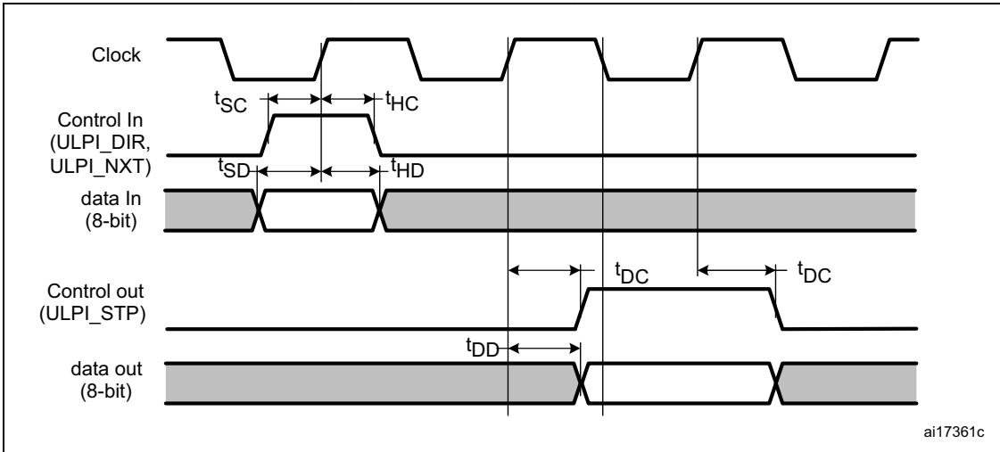

Figure 45. ULPI timing diagram

132/206

DS8626 Rev 12

STM32F405xx, STM32F407xx

Electrical characteristics

## Ethernet characteristics

Unless otherwise specified, the parameters given in Table 64, Table 65 and Table 66 for SMI, RMII and MII are derived from tests performed under the ambient temperature, fHCLK frequency summarized in Table 14 and VDD supply voltage conditions summarized in Table 63, with the following configuration:

• Output speed is set to OSPEEDRy[1:0] = 10

• Capacitive load ${ \mathsf { C } } = 3 0 { \mathsf { p F } }$

•Measurement points are done at CMOS levels: $0 . 5 \mathsf { V } _ { \mathsf { D D } }$

Refer to Section 6.3.16: I/O port characteristics for more details on the input/output characteristics.

Table 63. Ethernet DC electrical characteristics

<table><tr><td rowspan=1 colspan=2>Symbol</td><td rowspan=1 colspan=1>Parameter</td><td rowspan=1 colspan=1><eq>M \mathbf { i } \mathbf { n . } ^ { ( 1 ) }</eq></td><td rowspan=1 colspan=1>Max.(1)</td><td rowspan=1 colspan=1>Unit</td></tr><tr><td rowspan=1 colspan=1>Input level</td><td rowspan=1 colspan=1>VDD</td><td rowspan=1 colspan=1>Ethernet operating voltage</td><td rowspan=1 colspan=1>2.7</td><td rowspan=1 colspan=1>3.6</td><td rowspan=1 colspan=1>V</td></tr></table>

1. All the voltages are measured from the local ground potential.

Table 64 gives the list of Ethernet MAC signals for the SMI (station management interface) and Figure 46 shows the corresponding timing diagram.

Figure 46. Ethernet SMI timing diagram

<table><tr><td rowspan="4">ETH_MDC</td><td>4 tMDC</td></tr><tr><td></td></tr><tr><td>td(MDIO) → 4</td></tr><tr><td></td></tr><tr><td>ETH_MDIO(O) tsu(MDIO)</td><td>1 th(MDIO)</td></tr><tr><td colspan="3">ETH_MDIO(I)</td></tr><tr><td colspan="3"></td></tr><tr><td colspan="3"></td></tr></table>

Table 64. Dynamic characteristics: Ethernet MAC signals for SMI(1)

<table><tr><td rowspan=1 colspan=1>Symbol</td><td rowspan=1 colspan=1>Parameter</td><td rowspan=1 colspan=1>Min</td><td rowspan=1 colspan=1>Typ</td><td rowspan=1 colspan=1>Max</td><td rowspan=1 colspan=1>Unit</td></tr><tr><td rowspan=1 colspan=1>tMDC</td><td rowspan=1 colspan=1>MDC cycle time(2.38 MHz)</td><td rowspan=1 colspan=1>411</td><td rowspan=1 colspan=1>420</td><td rowspan=1 colspan=1>425</td><td rowspan=4 colspan=1>ns</td></tr><tr><td rowspan=1 colspan=1>Td(MDIO)</td><td rowspan=1 colspan=1>Write data valid time</td><td rowspan=1 colspan=1>6</td><td rowspan=1 colspan=1>10</td><td rowspan=1 colspan=1>13</td></tr><tr><td rowspan=1 colspan=1>tsu(MDIO)</td><td rowspan=1 colspan=1>Read data setup time</td><td rowspan=1 colspan=1>12</td><td rowspan=1 colspan=1>1</td><td rowspan=1 colspan=1>1</td></tr><tr><td rowspan=1 colspan=1>th(MDIO)</td><td rowspan=1 colspan=1>Read data hold time</td><td rowspan=1 colspan=1>0</td><td rowspan=1 colspan=1>-</td><td rowspan=1 colspan=1>-</td></tr></table>

1. Evaluated by characterization - not tested in production.

Table 65 gives the list of Ethernet MAC signals for the RMIl and Figure 47 shows the corresponding timing diagram.

133/206

DS8626 Rev 12

Electrical characteristics

STM32F405xx, STM32F407xx

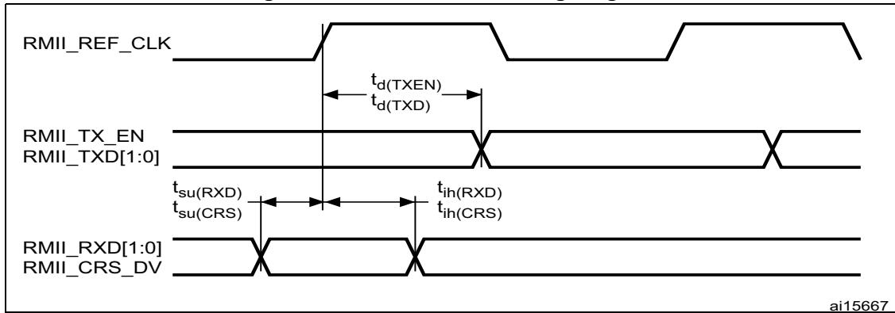

Figure 47. Ethernet RMIl timing diagram

Table 65. Dynamic characteristics: Ethernet MAC signals for RMII

<table><tr><td rowspan=1 colspan=1>Symbol</td><td rowspan=1 colspan=1>Rating</td><td rowspan=1 colspan=1>Min</td><td rowspan=1 colspan=1>Typ</td><td rowspan=1 colspan=1>Max</td><td rowspan=1 colspan=1>Unit</td></tr><tr><td rowspan=1 colspan=1>tsu(RXD)</td><td rowspan=1 colspan=1>Receive data setup time</td><td rowspan=1 colspan=1>2</td><td rowspan=1 colspan=1>1</td><td rowspan=1 colspan=1>-</td><td rowspan=1 colspan=1>ns</td></tr><tr><td rowspan=1 colspan=1>tih(RXD)</td><td rowspan=1 colspan=1>Receive data hold time</td><td rowspan=1 colspan=1>1</td><td rowspan=1 colspan=1>1</td><td rowspan=1 colspan=1>-</td><td rowspan=1 colspan=1>ns</td></tr><tr><td rowspan=1 colspan=1>tsu(CRS)</td><td rowspan=1 colspan=1>Carrier sense set-up time</td><td rowspan=1 colspan=1>0.5</td><td rowspan=1 colspan=1>-</td><td rowspan=1 colspan=1>1</td><td rowspan=1 colspan=1>ns</td></tr><tr><td rowspan=1 colspan=1>tih(CRS)</td><td rowspan=1 colspan=1>Carrier sense hold time</td><td rowspan=1 colspan=1>2</td><td rowspan=1 colspan=1>-</td><td rowspan=1 colspan=1>-</td><td rowspan=1 colspan=1>ns</td></tr><tr><td rowspan=1 colspan=1>td(TXEN)</td><td rowspan=1 colspan=1>Transmit enable valid delay time</td><td rowspan=1 colspan=1>8</td><td rowspan=1 colspan=1>9.5</td><td rowspan=1 colspan=1>11</td><td rowspan=1 colspan=1>ns</td></tr><tr><td rowspan=1 colspan=1>td(TXD)</td><td rowspan=1 colspan=1>Transmit data valid delay time</td><td rowspan=1 colspan=1>8.5</td><td rowspan=1 colspan=1>10</td><td rowspan=1 colspan=1>11.5</td><td rowspan=1 colspan=1>ns</td></tr></table>

Table 66 gives the list of Ethernet MAC signals for MIl and Figure 47 shows the corresponding timing diagram.

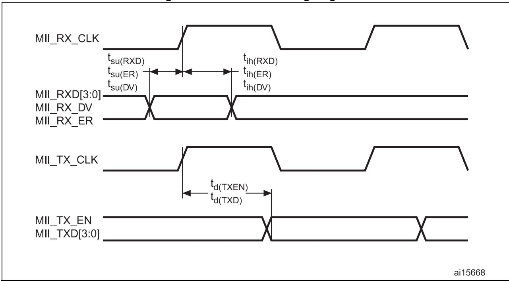

Figure 48. Ethernet MIl timing diagram

134/206

DS8626 Rev 12

STM32F405xx, STM32F407xx

Electrical characteristics

Table 66. Dynamic characteristics: Ethernet MAC signals for ${ \sf M I I } ^ { ( 1 ) }$

<table><tr><td rowspan=1 colspan=1>Symbol</td><td rowspan=1 colspan=1>Parameter</td><td rowspan=1 colspan=1>Min</td><td rowspan=1 colspan=1><eq>{ \mathsf { T y p } }</eq></td><td rowspan=1 colspan=1><eq>\pmb { \mathsf { M a x } }</eq></td><td rowspan=1 colspan=1>Unit</td></tr><tr><td rowspan=1 colspan=1>tsu(RXD)</td><td rowspan=1 colspan=1>Receive data setup time</td><td rowspan=1 colspan=1>9</td><td rowspan=1 colspan=1>-</td><td rowspan=1 colspan=1>-</td><td rowspan=8 colspan=1>ns</td></tr><tr><td rowspan=1 colspan=1>tih(RXD)</td><td rowspan=1 colspan=1>Receive data hold time</td><td rowspan=1 colspan=1>10</td><td rowspan=1 colspan=1>1</td><td rowspan=1 colspan=1>1</td></tr><tr><td rowspan=1 colspan=1><eq>\mathfrak { t } _ { \mathsf { s u ( D V ) } }</eq></td><td rowspan=1 colspan=1>Data valid setup time</td><td rowspan=1 colspan=1>9</td><td rowspan=1 colspan=1>1</td><td rowspan=1 colspan=1>1</td></tr><tr><td rowspan=1 colspan=1><eq>\mathsf { t } _ { \mathsf { i h ( D V ) } }</eq></td><td rowspan=1 colspan=1>Data valid hold time</td><td rowspan=1 colspan=1>8</td><td rowspan=1 colspan=1>1</td><td rowspan=1 colspan=1>1</td></tr><tr><td rowspan=1 colspan=1><eq>\mathfrak { t } _ { \mathtt { S U } ( \mathsf { E R } ) }</eq></td><td rowspan=1 colspan=1>Error setup time</td><td rowspan=1 colspan=1>6</td><td rowspan=1 colspan=1>1</td><td rowspan=1 colspan=1>1</td></tr><tr><td rowspan=1 colspan=1>tih(ER)</td><td rowspan=1 colspan=1>Error hold time</td><td rowspan=1 colspan=1>8</td><td rowspan=1 colspan=1>-</td><td rowspan=1 colspan=1>-</td></tr><tr><td rowspan=1 colspan=1>td(TXEN)</td><td rowspan=1 colspan=1>Transmit enable valid delay time</td><td rowspan=1 colspan=1>0</td><td rowspan=1 colspan=1>10</td><td rowspan=1 colspan=1>14</td></tr><tr><td rowspan=1 colspan=1>td(TXD)</td><td rowspan=1 colspan=1>Transmit data valid delay time</td><td rowspan=1 colspan=1>0</td><td rowspan=1 colspan=1>10</td><td rowspan=1 colspan=1>15</td></tr></table>

1. Evaluated by characterization - not tested in production.

## 6.3.20CAN (controller area network) interface

Refer to Section 6.3.16: I/O port characteristics for more details on the input/output alternate function characteristics (CANTX and CANRX).

## 6.3.2112-bit ADC characteristics

Unless otherwise specified, the parameters given in Table 67 are derived from tests performed under the ambient temperature, fpcLk2 frequency and $\mathsf { V } _ { \mathsf { D D A } }$ supply voltage conditions summarized in Table 14.

Table 67. ADC characteristics

<table><tr><td colspan="1" rowspan="1">Symbol</td><td colspan="1" rowspan="1">Parameter</td><td colspan="1" rowspan="1">Conditions</td><td colspan="1" rowspan="1">Min</td><td colspan="1" rowspan="1">Typ</td><td colspan="1" rowspan="1">Max</td><td colspan="1" rowspan="1">Unit</td></tr><tr><td colspan="1" rowspan="1"><eq>\mathsf { V } _ { \mathsf { D D A } }</eq></td><td colspan="1" rowspan="1">Power supply</td><td colspan="1" rowspan="1"></td><td colspan="1" rowspan="1"><eq>\overline { { 1 . 8 ^ { ( 1 ) } } }</eq></td><td colspan="1" rowspan="1"></td><td colspan="1" rowspan="1">3.6</td><td colspan="1" rowspan="3">V</td></tr><tr><td colspan="1" rowspan="1"><eq>{ \mathsf { V } } _ { { \mathsf { R E F } } + }</eq></td><td colspan="1" rowspan="1">Positive reference voltage</td><td colspan="1" rowspan="1"></td><td colspan="1" rowspan="1"><eq>1 . 8 ^ { ( 1 ) ( 2 ) ( 3 ) }</eq></td><td colspan="1" rowspan="1">-</td><td colspan="1" rowspan="1"><eq>\mathsf { V } _ { \mathsf { D D A } }</eq></td></tr><tr><td colspan="1" rowspan="1"><eq>V _ { \mathsf { R E F - } }</eq></td><td colspan="1" rowspan="1">Negative reference voltage</td><td colspan="1" rowspan="1"></td><td colspan="1" rowspan="1"></td><td colspan="1" rowspan="1">0</td><td colspan="1" rowspan="1"></td></tr><tr><td colspan="1" rowspan="2"><eq>{ \mathsf { f } } _ { \mathsf { A D C } }</eq></td><td colspan="1" rowspan="2">ADC clock frequency</td><td colspan="1" rowspan="1"><eq>\overline { { \mathsf { V } _ { \mathsf { D D A } } = 1 . 8 ^ { ( 1 ) ( 3 ) } \mathsf { t o } } }</eq></td><td colspan="1" rowspan="1">0.6</td><td colspan="1" rowspan="1">15</td><td colspan="1" rowspan="1">18</td><td colspan="1" rowspan="1">MHz</td></tr><tr><td colspan="1" rowspan="1"><eq>\mathsf { V } _ { \mathsf { D D A } } = 2 . 4 \mathrm { t o } 3 . 6 \mathrm { V } ^ { ( 3 ) }</eq></td><td colspan="1" rowspan="1">0.6</td><td colspan="1" rowspan="1">30</td><td colspan="1" rowspan="1">36</td><td colspan="1" rowspan="1">MHz</td></tr><tr><td colspan="1" rowspan="2"><eq>\mathsf { f } _ { \mathsf { T R I G } } ( 4 )</eq></td><td colspan="1" rowspan="2">External trigger frequency</td><td colspan="1" rowspan="1"><eq>\mathsf { f } _ { \mathsf { A D C } } = 3 0 \mathsf { M H z } ,</eq>12-bit resolution</td><td colspan="1" rowspan="1"></td><td colspan="1" rowspan="1"></td><td colspan="1" rowspan="1">1764</td><td colspan="1" rowspan="1">kHz</td></tr><tr><td colspan="1" rowspan="1"></td><td colspan="1" rowspan="1"></td><td colspan="1" rowspan="1"></td><td colspan="1" rowspan="1">17</td><td colspan="1" rowspan="1"><eq>{ 1 / \mathfrak { f } } _ { \mathsf { A D C } }</eq></td></tr><tr><td colspan="1" rowspan="1"><eq>\mathsf { V } _ { \mathsf { A I N } }</eq></td><td colspan="1" rowspan="1">Conversion voltage range(5)</td><td colspan="1" rowspan="1"></td><td colspan="1" rowspan="1"><eq>\begin{array} { c } { { 0 ( \mathsf { V } _ { \mathsf { S S A } } \circ \mathsf { r V } _ { \mathsf { R E F } _ { - } } } } \\ { { \mathsf { t i e d } \mathrm { t o } \mathsf { g r o u n d } ) } } \end{array}</eq></td><td colspan="1" rowspan="1"></td><td colspan="1" rowspan="1"><eq>{ \mathsf { V } } _ { { \mathsf { R E F } } + }</eq></td><td colspan="1" rowspan="1">V</td></tr><tr><td colspan="1" rowspan="1"><eq>\mathsf { R } _ { \mathsf { A l N } } { } ^ { ( 4 ) }</eq></td><td colspan="1" rowspan="1">External input impedance</td><td colspan="1" rowspan="1">See Equation 1 fordetails</td><td colspan="1" rowspan="1"></td><td colspan="1" rowspan="1"></td><td colspan="1" rowspan="1">50</td><td colspan="1" rowspan="1">KΩ</td></tr><tr><td colspan="1" rowspan="1"><eq>\mathsf { R } _ { \mathsf { A D C } } ^ { ( 4 ) ( 6 ) }</eq></td><td colspan="1" rowspan="1">Sampling switch resistance</td><td colspan="1" rowspan="1"></td><td colspan="1" rowspan="1"></td><td colspan="1" rowspan="1"></td><td colspan="1" rowspan="1">6</td><td colspan="1" rowspan="1">KΩ</td></tr><tr><td colspan="1" rowspan="1"><eq>\mathsf { C } _ { \mathsf { A D C } } ^ { } { } ^ { ( 4 ) }</eq></td><td colspan="1" rowspan="1">Internal sample and holdcapacitor</td><td colspan="1" rowspan="1"></td><td colspan="1" rowspan="1"></td><td colspan="1" rowspan="1">4</td><td colspan="1" rowspan="1"></td><td colspan="1" rowspan="1"><eq>\mathsf { p F }</eq></td></tr><tr><td colspan="1" rowspan="2"><eq>\mathfrak { t } _ { | \mathtt { a t } } ( 4 )</eq></td><td colspan="1" rowspan="2">Injection trigger conversionlatency</td><td colspan="1" rowspan="1"><eq>\mathsf { f } _ { \mathsf { A D C } } = 3 0</eq>MHz</td><td colspan="1" rowspan="1"></td><td colspan="1" rowspan="1"></td><td colspan="1" rowspan="1">0.100</td><td colspan="1" rowspan="1">μs</td></tr><tr><td colspan="1" rowspan="1"></td><td colspan="1" rowspan="1"></td><td colspan="1" rowspan="1">-</td><td colspan="1" rowspan="1"><eq>3 ^ { ( 7 ) }</eq></td><td colspan="1" rowspan="1"><eq>{ 1 / \mathfrak { f } } _ { \mathsf { A D C } }</eq></td></tr><tr><td colspan="1" rowspan="2"><eq>\mathfrak { t } _ { | \mathsf { a t r } } ^ { ( 4 ) }</eq></td><td colspan="1" rowspan="2">Regular trigger conversionlatency</td><td colspan="1" rowspan="1"><eq>\mathsf { f } _ { \mathsf { A D C } } = 3 0 \mathsf { M H z }</eq></td><td colspan="1" rowspan="1"></td><td colspan="1" rowspan="1">1</td><td colspan="1" rowspan="1">0.067</td><td colspan="1" rowspan="1">μs</td></tr><tr><td colspan="1" rowspan="1"></td><td colspan="1" rowspan="1"></td><td colspan="1" rowspan="1"></td><td colspan="1" rowspan="1"><eq>2 ^ { ( 7 ) }</eq></td><td colspan="1" rowspan="1"><eq>{ 1 / \mathfrak { f } } _ { \mathsf { A D C } }</eq></td></tr><tr><td colspan="1" rowspan="2"><eq>\mathfrak { t } _ { \mathbb { S } } ^ { ( 4 ) }</eq></td><td colspan="1" rowspan="2">Sampling time</td><td colspan="1" rowspan="1"><eq>\mathsf { f } _ { \mathsf { A D C } } = 3 0 \mathsf { M H z }</eq></td><td colspan="1" rowspan="1">0.100</td><td colspan="1" rowspan="1">-</td><td colspan="1" rowspan="1">16</td><td colspan="1" rowspan="1">μs</td></tr><tr><td colspan="1" rowspan="1"></td><td colspan="1" rowspan="1">3</td><td colspan="1" rowspan="1">-</td><td colspan="1" rowspan="1">480</td><td colspan="1" rowspan="1"><eq>{ 1 / \mathfrak { f } } _ { \mathsf { A D C } }</eq></td></tr><tr><td colspan="1" rowspan="1"><eq>\mathfrak { t } _ { \mathtt { S T A B } } { } ^ { ( 4 ) }</eq></td><td colspan="1" rowspan="1">Power-up time</td><td colspan="1" rowspan="1"></td><td colspan="1" rowspan="1"></td><td colspan="1" rowspan="1">2</td><td colspan="1" rowspan="1">3</td><td colspan="1" rowspan="1">μs</td></tr><tr><td colspan="1" rowspan="5"><eq>\mathfrak { t } _ { \mathsf { C O N V } } { } ^ { ( 4 ) }</eq></td><td colspan="1" rowspan="5">Total conversion time (includingsampling time)</td><td colspan="1" rowspan="1"><eq>\mathsf { f } _ { \mathsf { A D C } } = 3 0 \mathsf { M H z }</eq>12-bit resolution</td><td colspan="1" rowspan="1">0.50</td><td colspan="1" rowspan="1"></td><td colspan="1" rowspan="1">16.40</td><td colspan="1" rowspan="1">μs</td></tr><tr><td colspan="1" rowspan="1"><eq>\mathsf { f } _ { \mathsf { A D C } } = 3 0 \mathsf { M H z }</eq>10-bit resolution</td><td colspan="1" rowspan="1">0.43</td><td colspan="1" rowspan="1"></td><td colspan="1" rowspan="1">16.34</td><td colspan="1" rowspan="1">μs</td></tr><tr><td colspan="1" rowspan="1"><eq>\mathsf { f } _ { \mathsf { A D C } } = 3 0 \mathsf { M H z }</eq>8-bit resolution</td><td colspan="1" rowspan="1">0.37</td><td colspan="1" rowspan="1"></td><td colspan="1" rowspan="1">16.27</td><td colspan="1" rowspan="1">μs</td></tr><tr><td colspan="1" rowspan="1"><eq>\mathsf { f } _ { \mathsf { A D C } } = 3 0 \mathsf { M H z }</eq>6-bit resolution</td><td colspan="1" rowspan="1">0.30</td><td colspan="1" rowspan="1"></td><td colspan="1" rowspan="1">16.20</td><td colspan="1" rowspan="1">μs</td></tr><tr><td colspan="4" rowspan="1">9 to 492<eq>( \mathrm { { t } _ { S } }</eq>for sampling +n-bit resolution for successiveapproximation)</td><td colspan="1" rowspan="1"><eq>{ 1 / \mathfrak { f } } _ { \mathsf { A D C } }</eq></td></tr><tr><td colspan="1" rowspan="3"><eq>{ \mathfrak { f } } _ { \mathbb { S } } ( 4 )</eq></td><td colspan="1" rowspan="3">Sampling rate<eq>( \mathsf { f } _ { \mathsf { A D C } } = 3 0 \mathsf { M H z } , \mathsf { a n d }</eq><eq>\mathfrak { t } _ { \mathbb { S } } = 3 \mathsf { A D C } \mathsf { c y c l e s } )</eq></td><td colspan="1" rowspan="1">12-bit resolutionSingle ADC</td><td colspan="1" rowspan="1"></td><td colspan="1" rowspan="1"></td><td colspan="1" rowspan="1">2</td><td colspan="1" rowspan="1">Msps</td></tr><tr><td colspan="1" rowspan="1">12-bit resolutionInterleave Dual ADCmode</td><td colspan="1" rowspan="1"></td><td colspan="1" rowspan="1"></td><td colspan="1" rowspan="1">3.75</td><td colspan="1" rowspan="1">Msps</td></tr><tr><td colspan="1" rowspan="1">12-bit resolutionInterleave Triple ADCmode</td><td colspan="1" rowspan="1"></td><td colspan="1" rowspan="1"></td><td colspan="1" rowspan="1">6</td><td colspan="1" rowspan="1">Msps</td></tr><tr><td colspan="1" rowspan="1"><eq>{ \mathsf { I } } _ { \mathsf { V R E F } + } ( 4 )</eq></td><td colspan="1" rowspan="1">ADC<eq>V _ { \mathsf { R E F } }</eq>DC currentconsumption in conversionmode</td><td colspan="1" rowspan="1"></td><td colspan="1" rowspan="1"></td><td colspan="1" rowspan="1">300</td><td colspan="1" rowspan="1">500</td><td colspan="1" rowspan="1"><eq>\mu { \sf A }</eq></td></tr><tr><td colspan="1" rowspan="1"><eq>{ \mathsf { I } } _ { \mathsf { V D D A } } ^ { ( 4 ) }</eq></td><td colspan="1" rowspan="1">ADC<eq>\mathsf { V } _ { \mathsf { D D A } }</eq>DC currentconsumption in conversionmode</td><td colspan="1" rowspan="1"></td><td colspan="1" rowspan="1"></td><td colspan="1" rowspan="1">1.6</td><td colspan="1" rowspan="1">1.8</td><td colspan="1" rowspan="1">mA</td></tr></table>

1. $\mathsf { V } _ { \mathsf { D D } } N _ { \mathsf { \Omega } } \mathsf { D A }$ minimum value of $1 . 7 \times$ is obtained when the device operates in reduced temperature range, and with the use of an extērnàl power supply supervisor (refer to Section 3.15.2: Internal reset OFF).

2. It is recommended to maintain the voltage difference between $V _ { \mathsf { R E F } } .$ and $\mathsf { V } _ { \mathsf { D D A } }$ below 1.8 V.

3. $\mathsf { V } _ { \mathsf { D D A } } - \mathsf { V } _ { \mathsf { R E F } + } < 1 . 2 \mathsf { V } .$

4. Evaluated by characterization - not tested in production.

5. ${ \mathsf { V } } _ { \mathsf { R E F } } .$ is internally connected to $\mathsf { V } _ { \mathsf { D D A } }$ and $V _ { \mathsf { R E F } }$ is internally connected to $\mathsf { V } _ { \mathsf { S S A } }$

6. ${ \mathsf { R } } _ { \mathsf { A D C } }$ maximum value is given for $\mathsf { V } _ { \mathsf { D D } } { = } 1 . 8 \mathsf { V } ,$ and minimum value for $\mathsf { V } _ { \mathsf { D D } } { = } 3 . 3 \mathsf { V } .$

135/206

DS8626 Rev 12

Electrical characteristics

STM32F405xx, STM32F407xx

7. For external triggers, a delay of $1 / \mathsf { f } _ { \mathsf { P C L K 2 } }$ must be added to the latency specified in Table $^ { 6 7 . }$

136/206

DS8626 Rev 12

Note:

STM32F405xx, STM32F407xx

Electrical characteristics

Equation 1: $\mathsf { R } _ { \mathsf { A I N } }$ max formula

$$
{ \mathsf { R } } _ { \mathsf { A I N } } = \frac { ( \mathsf { k } - 0 . 5 ) } { \mathsf { f } _ { \mathsf { A D C } } \times \mathsf { C } _ { \mathsf { A D C } } \times \mathsf { i n } ( 2 ^ { \mathsf { N } + 2 } ) } - { \mathsf { R } } _ { \mathsf { A D C } }
$$

The formula above (Equation 1) is used to determine the maximum external impedance allowed for an error below 1/4 of LSB. N = 12 (from 12-bit resolution) and k is the number of sampling periods defined in the ADC\_SMPR1 register.

Table 68. ADC accuracy at $\mathtt { f _ { A D C } } = 3 0$ MHz

<table><tr><td rowspan=1 colspan=1>Symbol</td><td rowspan=1 colspan=1>Parameter</td><td rowspan=1 colspan=1>Test conditions</td><td rowspan=1 colspan=1>Typ</td><td rowspan=1 colspan=1><eq>{ \pmb M } { \bf a x } ^ { ( 1 ) }</eq></td><td rowspan=1 colspan=1>Unit</td></tr><tr><td rowspan=1 colspan=1>ET</td><td rowspan=1 colspan=1>Total unadjusted error</td><td rowspan=5 colspan=1><eq>\mathsf { f } _ { \mathsf { P C L K 2 } } = 6 0 \mathsf { M H z } ,</eq><eq>\mathsf { f } _ { \mathsf { A D C } } = 3 0 \mathsf { M H z } , \mathsf { R } _ { \mathsf { A I N } } < 1 0 \mathsf { k } \Omega ,</eq><eq>\bar { \mathsf { V } } _ { \mathsf { D D A } } = 1 . 8 ^ { ( 2 ) } \mathsf { t o } 3 . \bar { 6 } \bar { \mathsf { V } }</eq></td><td rowspan=1 colspan=1>±2</td><td rowspan=1 colspan=1>±5</td><td rowspan=5 colspan=1>LSB</td></tr><tr><td rowspan=1 colspan=1>EO</td><td rowspan=1 colspan=1>Offset error</td><td rowspan=1 colspan=1>±1.5</td><td rowspan=1 colspan=1>±2.5</td></tr><tr><td rowspan=1 colspan=1>EG</td><td rowspan=1 colspan=1>Gain error</td><td rowspan=1 colspan=1>±1.5</td><td rowspan=1 colspan=1>±3</td></tr><tr><td rowspan=1 colspan=1>ED</td><td rowspan=1 colspan=1>Differential linearity error</td><td rowspan=1 colspan=1>±1</td><td rowspan=1 colspan=1>±2</td></tr><tr><td rowspan=1 colspan=1>EL</td><td rowspan=1 colspan=1>Integral linearity error</td><td rowspan=1 colspan=1>±1.5</td><td rowspan=1 colspan=1>±3</td></tr></table>

1. Evaluated by characterization - not tested in production.

2. $\mathsf { V } _ { \mathsf { D } \mathsf { D } } N _ { \mathsf { D } \mathsf { D } \mathsf { A } }$ minimum value of 1.7 V is obtained when the device operates in reduced temperature range, and with the use of an external power supply supervisor (refer to Section 3.15.2: Internal reset OFF).

ADC accuracy vs. negative injection current: injecting a negative current on any analog input pins should be avoided as this significantly reduces the accuracy of the conversion being performed on another analog input. It is recommended to add a Schottky diode (pin to ground) to analog pins which may potentially inject negative currents.

Any positive injection current within the limits specified for $I _ { I N J ( P I N ) }$ and $S I _ { I N J ( P I N ) } i n$ Section 6.3.16 does not affect the ADC accuracy.

Figure 49. ADC accuracy characteristics

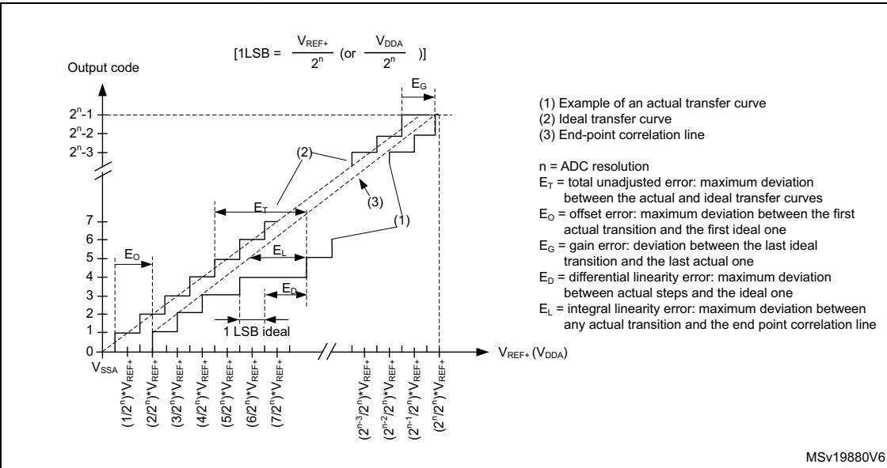

137/206

DS8626 Rev 12

Electrical characteristics

STM32F405xx, STM32F407xx

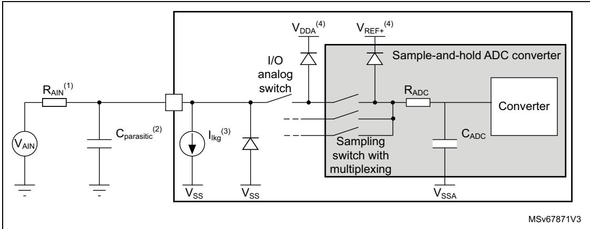

Figure 50. Typical connection diagram when using the ADC with FT/TT pins featuring analog switch function

1. Refer to Table 67: ADC characteristics for the values of $\mathsf { R } _ { \mathsf { A l N } } , \mathsf { R } _ { \mathsf { A D C } }$ and ${ \mathsf { C } } _ { \mathsf { A D C } }$

2. $\mathsf { C } _ { \mathsf { p q r a s i t i c } }$ represents the capacitance of the PCB (dependent on soldering and PCB layout quality) plus the pad capacitance (refer to Table 48: I/O static characteristics) A high Cparasitic value downgrades conversion accuracy. To remedy this, ${ \mathsf { f } } _ { \mathsf { A D C } }$ should be reduced.

3. Refer to Table 48: I/O static characteristics.

4. Refer to Figure 21: Power supply scheme.

138/206

DS8626 Rev 12

STM32F405xx, STM32F407xx

Electrical characteristics

## General PCB design guidelines

Power supply decoupling should be performed as shown in Figure 51 or Figure 52, depending on whether ${ \mathsf { V } } _ { \mathsf { R E F } + }$ . is connected to $\mathsf { V } _ { \mathsf { D D A } }$ or not. The 10 nF capacitors should be ceramic (good quality). They should be placed them as close as possible to the chip.

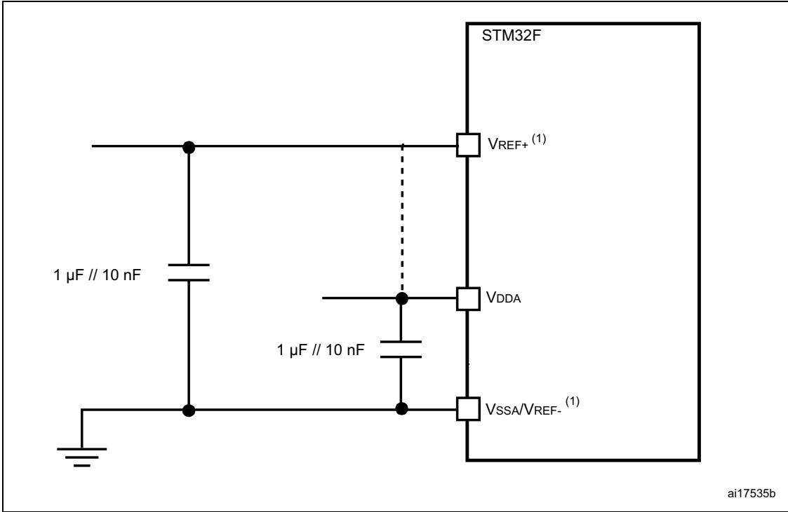

Figure 51. Power supply and reference decoupling $N _ { R E F + }$ not connected to $\underline { { \boldsymbol { \mathsf { v } } _ { \mathsf { D D A } } } } )$

1. ${ \mathsf { V } } _ { { \mathsf { R E F } } + }$ and VREF\_inputs are both available on UFBGA176. $\check { \mathsf { K } } \mathsf { E } \mathsf { F } +$ is also available on LQFP100, LQFP144, and'LQFP176.When $V _ { \mathsf { R E F } } .$ and $V _ { \mathsf { R E F - } }$ are not available, théy are internally connected to $\mathsf { V } _ { \mathsf { D D A } }$ and $\mathsf { V } _ { \mathsf { S S A } } .$

139/206

DS8626 Rev 12

Electrical characteristics

STM32F405xx, STM32F407xx

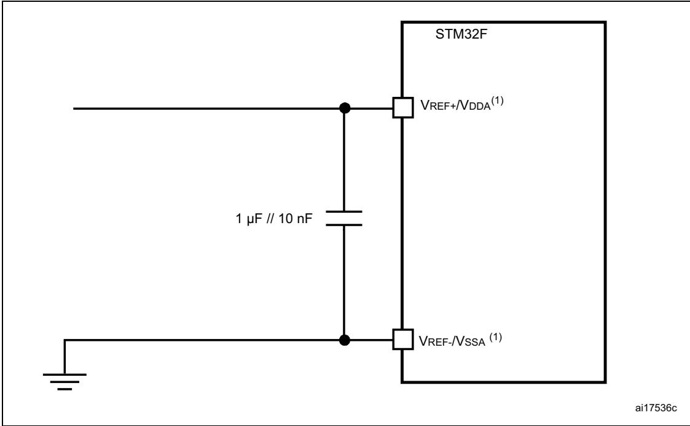

Figure 52. Power supply and reference decoupling $( V _ { R E F + }$ connected to $\mathsf { v } _ { \mathsf { D D A } } )$

1. VREF+ and VREF\_ inputs are both available on UFBGA176. $\check { \mathsf { M } } _ { \mathsf { R E F } ^ { + } }$ is also available on LQFP100, LQFP144, and'LQFP176.When ${ \mathsf { V } } _ { \mathsf { R E F } }$ + and $V _ { \mathsf { R E F } } .$ \_ are not available, théy are internally connected to $\mathsf { V } _ { \mathsf { D D A } }$ and $\mathsf { V } _ { \mathsf { S S A } }$

## 6.3.22Temperature sensor characteristics

Table 69. Temperature sensor characteristics

<table><tr><td rowspan=1 colspan=1>Symbol</td><td rowspan=1 colspan=1>Parameter</td><td rowspan=1 colspan=1>Min</td><td rowspan=1 colspan=1>Typ</td><td rowspan=1 colspan=1>Max</td><td rowspan=1 colspan=1>Unit</td></tr><tr><td rowspan=1 colspan=1><eq>\overline { { \mathsf { T } _ { \mathsf { L } } ( 1 ) } }</eq></td><td rowspan=1 colspan=1><eq>\mathsf { V } _ { \mathsf { S E N S E } }</eq>linearity with temperature</td><td rowspan=1 colspan=1></td><td rowspan=1 colspan=1>±1</td><td rowspan=1 colspan=1>+2</td><td rowspan=1 colspan=1>℃</td></tr><tr><td rowspan=1 colspan=1>Avg_Slope(1)</td><td rowspan=1 colspan=1>Average slope</td><td rowspan=1 colspan=1>1</td><td rowspan=1 colspan=1>2.5</td><td rowspan=1 colspan=1>-</td><td rowspan=1 colspan=1><eq>\mathsf { m V } / { } ^ { \circ } \mathsf { C }</eq></td></tr><tr><td rowspan=1 colspan=1><eq>\mathsf { V } _ { 2 5 } ( 1 )</eq></td><td rowspan=1 colspan=1>Voltage at<eq>\boldsymbol { 2 5 } ^ { \circ } \mathrm { C }</eq></td><td rowspan=1 colspan=1>1</td><td rowspan=1 colspan=1>0.76</td><td rowspan=1 colspan=1>-</td><td rowspan=1 colspan=1>V</td></tr><tr><td rowspan=1 colspan=1><eq>\mathsf { t } _ { \mathsf { S T A R T } } ( 2 )</eq></td><td rowspan=1 colspan=1>Startup time</td><td rowspan=1 colspan=1>-</td><td rowspan=1 colspan=1>6</td><td rowspan=1 colspan=1>10</td><td rowspan=1 colspan=1>μs</td></tr><tr><td rowspan=1 colspan=1><eq>{ \sf T } _ { \mathsf { S \_ t e m p } } ( 2 )</eq></td><td rowspan=1 colspan=1>ADC sampling time when reading the temperature<eq>( 1 ~ ^ { \circ } \mathsf C</eq>accuracy)</td><td rowspan=1 colspan=1>10</td><td rowspan=1 colspan=1>-</td><td rowspan=1 colspan=1>-</td><td rowspan=1 colspan=1>μs</td></tr></table>

1. Evaluated by characterization - not tested in production.

2. Specified by design.

Table 70. Temperature sensor calibration values

<table><tr><td rowspan=1 colspan=1>Symbol</td><td rowspan=1 colspan=1>Parameter</td><td rowspan=1 colspan=1>Memory address</td></tr><tr><td rowspan=1 colspan=1>TS_CAL1</td><td rowspan=1 colspan=1>TS ADC raw data acquired at temperature of 30 °C,<eq>\mathsf { V } _ { \mathsf { D D A } } = 3 . 3 \mathsf { V }</eq></td><td rowspan=1 colspan=1>0x1FFF 7A2C - 0x1FFF 7A2D</td></tr><tr><td rowspan=1 colspan=1>TS_CAL2</td><td rowspan=1 colspan=1>TS ADC raw data acquired at temperature of 110 °C, VDDA=3.3 V</td><td rowspan=1 colspan=1>0x1FFF 7A2E - 0x1FFF 7A2F</td></tr></table>

140/206

DS8626 Rev 12

STM32F405xx, STM32F407xx

Electrical characteristics

## 6.3.23 $\mathsf { v } _ { \mathsf { B A T } }$ monitoring characteristics

Table 71. $\mathsf { v } _ { \mathsf { B A T } }$ monitoring characteristics

<table><tr><td rowspan=1 colspan=1>Symbol</td><td rowspan=1 colspan=1>Parameter</td><td rowspan=1 colspan=1>Min</td><td rowspan=1 colspan=1>Typ</td><td rowspan=1 colspan=1>Max</td><td rowspan=1 colspan=1>Unit</td></tr><tr><td rowspan=1 colspan=1>R</td><td rowspan=1 colspan=1>Resistor bridge for<eq>\mathsf { V } _ { \mathsf { B A T } }</eq></td><td rowspan=1 colspan=1>-</td><td rowspan=1 colspan=1>50</td><td rowspan=1 colspan=1>1</td><td rowspan=1 colspan=1>KΩ</td></tr><tr><td rowspan=1 colspan=1>Q</td><td rowspan=1 colspan=1>Ratio on<eq>\mathsf { V } _ { \mathsf { B A T } }</eq>measurement</td><td rowspan=1 colspan=1>-</td><td rowspan=1 colspan=1>2</td><td rowspan=1 colspan=1>-</td><td rowspan=1 colspan=1>1</td></tr><tr><td rowspan=1 colspan=1><eq>\overline { { \mathsf { E r } ^ { ( 1 ) } } }</eq></td><td rowspan=1 colspan=1>Error on Q</td><td rowspan=1 colspan=1>-1</td><td rowspan=1 colspan=1>-</td><td rowspan=1 colspan=1>+1</td><td rowspan=1 colspan=1>%</td></tr><tr><td rowspan=1 colspan=1><eq>\mathsf { T } _ { \mathsf { S } _ { \mathsf { \_ } } \mathsf { v b a t } } ( 2 ) ( 2 )</eq></td><td rowspan=1 colspan=1>ADC sampling time when reading the<eq>\mathsf { V } _ { \mathsf { B A T } }</eq>1 mV accuracy</td><td rowspan=1 colspan=1>5</td><td rowspan=1 colspan=1></td><td rowspan=1 colspan=1>一</td><td rowspan=1 colspan=1>μs</td></tr></table>

1. Specified by design.

2. Shortest sampling time can be determined in the application by multiple iterations.

## 6.3.24Embedded reference voltage

The parameters given in Table 72 are derived from tests performed under ambient temperature and $\mathsf { V } _ { \mathsf { D D } }$ supply voltage conditions summarized in Table 14.

Table 72. Embedded internal reference voltage

<table><tr><td rowspan=1 colspan=1>Symbol</td><td rowspan=1 colspan=1>Parameter</td><td rowspan=1 colspan=1>Conditions</td><td rowspan=1 colspan=1>Min</td><td rowspan=1 colspan=1>Typ</td><td rowspan=1 colspan=1>Max</td><td rowspan=1 colspan=1>Unit</td></tr><tr><td rowspan=1 colspan=1><eq>V _ { \mathsf { R E F I N T } }</eq></td><td rowspan=1 colspan=1>Internal reference voltage</td><td rowspan=1 colspan=1><eq>- 4 0 ^ { \circ } \mathsf { C } < \mathsf { T } _ { \mathsf { A } } < + 1 0 5 ^ { \circ } \mathsf { C }</eq></td><td rowspan=1 colspan=1>1.18</td><td rowspan=1 colspan=1>1.21</td><td rowspan=1 colspan=1>1.24</td><td rowspan=1 colspan=1>V</td></tr><tr><td rowspan=1 colspan=1><eq>{ \sf T } _ { \mathsf { S \_ v r e f i n t } } ( 1 )</eq></td><td rowspan=1 colspan=1>ADC sampling time when reading theinternal reference voltage</td><td rowspan=1 colspan=1></td><td rowspan=1 colspan=1>10</td><td rowspan=1 colspan=1>-</td><td rowspan=1 colspan=1>-</td><td rowspan=1 colspan=1>μs</td></tr><tr><td rowspan=1 colspan=1><eq>\mathsf { V } _ { \mathsf { R E R I N T } \_ } \mathsf { s } ^ { ( 2 ) }</eq></td><td rowspan=1 colspan=1>Internal reference voltage spread over thetemperature range</td><td rowspan=1 colspan=1><eq>\mathsf { V } _ { \mathsf { D D } } = 3 \mathsf { V }</eq></td><td rowspan=1 colspan=1>1</td><td rowspan=1 colspan=1>3</td><td rowspan=1 colspan=1>5</td><td rowspan=1 colspan=1>mV</td></tr><tr><td rowspan=1 colspan=1><eq>\mathsf { T } _ { \mathsf { C o e f f } } ( 2 )</eq></td><td rowspan=1 colspan=1>Temperature coefficient</td><td rowspan=1 colspan=1></td><td rowspan=1 colspan=1>1</td><td rowspan=1 colspan=1>30</td><td rowspan=1 colspan=1>50</td><td rowspan=1 colspan=1><eq>\mathsf { p p m } / \mathsf { ^ o C }</eq></td></tr><tr><td rowspan=1 colspan=1><eq>\mathsf { t } _ { \mathsf { S T A R T } } ( 2 )</eq></td><td rowspan=1 colspan=1>Startup time</td><td rowspan=1 colspan=1></td><td rowspan=1 colspan=1>-</td><td rowspan=1 colspan=1>6</td><td rowspan=1 colspan=1>10</td><td rowspan=1 colspan=1>μs</td></tr></table>

1. Shortest sampling time can be determined in the application by multiple iterations.

2. Specified by design.

Table 73. Internal reference voltage calibration values

<table><tr><td rowspan=1 colspan=1>Symbol</td><td rowspan=1 colspan=1>Parameter</td><td rowspan=1 colspan=1>Memory address</td></tr><tr><td rowspan=1 colspan=1><eq>\mathsf { V } _ { \mathsf { R E F I N \_ C A L } }</eq></td><td rowspan=1 colspan=1>Raw data acquired at temperature of<eq>3 0 \ ^ { \circ } \mathsf { C } , \mathsf { V } _ { \mathsf { D D A } } \mathsf { = } 3 . 3 \ \mathsf { V }</eq></td><td rowspan=1 colspan=1>0x1FFF 7A2A - 0x1FFF 7A2B</td></tr></table>

## 6.3.25 DAC electrical characteristics

Table 74. DAC characteristics

<table><tr><td colspan="1" rowspan="1">Symbol</td><td colspan="1" rowspan="1">Parameter</td><td colspan="1" rowspan="1">Min</td><td colspan="1" rowspan="1">Typ</td><td colspan="1" rowspan="1">Max</td><td colspan="1" rowspan="1">Unit</td><td colspan="1" rowspan="1">Comments</td></tr><tr><td colspan="1" rowspan="1"><eq>\mathsf { V } _ { \mathsf { D D A } }</eq></td><td colspan="1" rowspan="1">Analog supply voltage</td><td colspan="1" rowspan="1"><eq>1 . 8 ^ { ( 1 ) }</eq></td><td colspan="1" rowspan="1">1</td><td colspan="1" rowspan="1">3.6</td><td colspan="1" rowspan="1">V</td><td colspan="1" rowspan="1"></td></tr><tr><td colspan="1" rowspan="1"><eq>{ \mathsf { V } } _ { { \mathsf { R E F } } + }</eq></td><td colspan="1" rowspan="1">Reference supply voltage</td><td colspan="1" rowspan="1"><eq>\overline { { 1 . 8 ^ { ( 1 ) } } }</eq></td><td colspan="1" rowspan="1">1</td><td colspan="1" rowspan="1">3.6</td><td colspan="1" rowspan="1">V</td><td colspan="1" rowspan="1"><eq>\mathsf { V } _ { \mathsf { R E F } ^ { + } } \triangle \mathsf { V } _ { \mathsf { D D A } }</eq></td></tr><tr><td colspan="1" rowspan="1"><eq>\mathsf { V } _ { \mathsf { S S A } }</eq></td><td colspan="1" rowspan="1">Ground</td><td colspan="1" rowspan="1">0</td><td colspan="1" rowspan="1">-</td><td colspan="1" rowspan="1">0</td><td colspan="1" rowspan="1">V</td><td colspan="1" rowspan="1"></td></tr><tr><td colspan="1" rowspan="1"><eq>{ \mathsf { R } } _ { \mathsf { L O A D } } ^ { } ( 2 )</eq></td><td colspan="1" rowspan="1">Resistive load with bufferON</td><td colspan="1" rowspan="1">5</td><td colspan="1" rowspan="1"></td><td colspan="1" rowspan="1"></td><td colspan="1" rowspan="1">kΩ</td><td colspan="1" rowspan="1"></td></tr><tr><td colspan="1" rowspan="1"><eq>{ \mathsf { R } } _ { 0 } { } ^ { ( 2 ) }</eq></td><td colspan="1" rowspan="1">Impedance output withbuffer OFF</td><td colspan="1" rowspan="1"></td><td colspan="1" rowspan="1"></td><td colspan="1" rowspan="1">15</td><td colspan="1" rowspan="1">kΩ</td><td colspan="1" rowspan="1">When the buffer is OFF, theMinimum resistive load betweenDAC_OUT and<eq>\mathsf { V } _ { \mathsf { S S } }</eq>to have a 1%accuracy is 1.5 MΩ</td></tr><tr><td colspan="1" rowspan="1"><eq>\mathsf { C } _ { \mathsf { L O A D } } ^ { } ( 2 )</eq></td><td colspan="1" rowspan="1">Capacitive load</td><td colspan="1" rowspan="1"></td><td colspan="1" rowspan="1"></td><td colspan="1" rowspan="1">50</td><td colspan="1" rowspan="1"><eq>{ \mathsf { p F } }</eq></td><td colspan="1" rowspan="1">Maximum capacitive load atDAC OUT pin (when the buffer isON).</td></tr><tr><td colspan="1" rowspan="1">DAC_OUTmin(2)</td><td colspan="1" rowspan="1">Lower DAC_OUT voltagewith buffer ON</td><td colspan="1" rowspan="1">0.2</td><td colspan="1" rowspan="1"></td><td colspan="1" rowspan="1"></td><td colspan="1" rowspan="1">V</td><td colspan="1" rowspan="2">It gives the maximum outputexcursion of the DAC.It corresponds to 12-bit input code(0x0E0) to (0xF1C) at<eq>{ \mathsf { V } } _ { \mathsf { R E F + } } =</eq>3.6 V and (0x1C7) to (0xE38) at<eq>\mathsf { V } _ { \mathsf { R E F } + } = 1 . 8 \mathsf { V }</eq></td></tr><tr><td colspan="1" rowspan="1">DAC_OUT<eq>\mathfrak { m a x } ^ { ( 2 ) }</eq></td><td colspan="1" rowspan="1">Higher DAC_OUT voltagewith buffer ON</td><td colspan="1" rowspan="1"></td><td colspan="1" rowspan="1"></td><td colspan="1" rowspan="1"><eq>\mathsf { V } _ { \mathsf { D D A } } - 0 . 2</eq></td><td colspan="1" rowspan="1">V</td></tr><tr><td colspan="1" rowspan="1">DAC_OUT<eq>\mathsf { m i n } ^ { ( 2 ) }</eq></td><td colspan="1" rowspan="1">Lower DAC_OUT voltagewith buffer OFF</td><td colspan="1" rowspan="1"></td><td colspan="1" rowspan="1">0.5</td><td colspan="1" rowspan="1"></td><td colspan="1" rowspan="1">mV</td><td colspan="1" rowspan="2">It gives the maximum outputexcursion of the DAC.</td></tr><tr><td colspan="1" rowspan="1">DAC_OUT<eq>\mathfrak { m a x } ^ { ( 2 ) }</eq></td><td colspan="1" rowspan="1">Higher DAC_OUT voltagewith buffer OFF</td><td colspan="1" rowspan="1"></td><td colspan="1" rowspan="1">1</td><td colspan="1" rowspan="1"><eq>\mathsf { V } _ { \mathsf { R E F } + } - 1 \mathsf { L S B }</eq></td><td colspan="1" rowspan="1">V</td></tr><tr><td colspan="1" rowspan="2"><eq>{ \mathsf { I } } _ { \mathsf { V R E F } + } ( 4 )</eq></td><td colspan="1" rowspan="2">DAC DC<eq>V _ { \mathsf { R E F } }</eq>currentconsumption in quiescentmode (Standby mode)</td><td colspan="1" rowspan="1"></td><td colspan="1" rowspan="1">170</td><td colspan="1" rowspan="1">240</td><td colspan="1" rowspan="2"><eq>\mu { \sf A }</eq></td><td colspan="1" rowspan="1">With no load, worst code (0x800)at<eq>\mathsf { V } _ { \mathsf { R E F } + } = 3 . 6 \mathsf { V }</eq>in terms of DCconsumption on the inputs</td></tr><tr><td colspan="1" rowspan="1"></td><td colspan="1" rowspan="1">50</td><td colspan="1" rowspan="1">75</td><td colspan="1" rowspan="1">With no load, worst code (0xF1C)<eq>\mathsf { a t V } _ { \mathsf { R E F } + } = 3 . 6 \ V</eq>in terms of DCconsumption on the inputs</td></tr><tr><td colspan="1" rowspan="2"><eq>{ \mathsf { I } } _ { \mathsf { D D A } } ^ { } { } ^ { ( 4 ) }</eq></td><td colspan="1" rowspan="2">DAC DC VDDA currentconsumption in quiescentmode(3)</td><td colspan="1" rowspan="1"></td><td colspan="1" rowspan="1">280</td><td colspan="1" rowspan="1">380</td><td colspan="1" rowspan="1"><eq>\mu { \sf A }</eq></td><td colspan="1" rowspan="1">With no load, middle code (0x800)on the inputs</td></tr><tr><td colspan="1" rowspan="1"></td><td colspan="1" rowspan="1">475</td><td colspan="1" rowspan="1">625</td><td colspan="1" rowspan="1"><eq>\mu { \sf A }</eq></td><td colspan="1" rowspan="1">With no load, worst code (0xF1C)<eq>\mathsf { a t V } _ { \mathsf { R E F } + } = 3 . 6 \ V</eq>in terms of DCconsumption on the inputs</td></tr><tr><td colspan="1" rowspan="2"><eq>{ \mathsf { D N L } } ^ { ( 4 ) }</eq></td><td colspan="1" rowspan="2">Differential non linearityDifference between twoconsecutive code-1LSB)</td><td colspan="1" rowspan="1"></td><td colspan="1" rowspan="1"></td><td colspan="1" rowspan="1">±0.5</td><td colspan="1" rowspan="1">LSB</td><td colspan="1" rowspan="1">Given for the DAC in 10-bitconfiguration.</td></tr><tr><td colspan="1" rowspan="1"></td><td colspan="1" rowspan="1"></td><td colspan="1" rowspan="1">±2</td><td colspan="1" rowspan="1">LSB</td><td colspan="1" rowspan="1">Given for the DAC in 12-bitconfiguration.</td></tr><tr><td colspan="1" rowspan="2"><eq>{ \mathsf { I N L } } ^ { ( 4 ) }</eq></td><td colspan="1" rowspan="2">Integral non linearity(difference betweenmeasured value at Code iand the value at Code i on aline drawn between Code 0and last Code 1023)</td><td colspan="1" rowspan="1"></td><td colspan="1" rowspan="1"></td><td colspan="1" rowspan="1">±1</td><td colspan="1" rowspan="1">LSB</td><td colspan="1" rowspan="1">Given for the DAC in 10-bitconfiguration.</td></tr><tr><td colspan="1" rowspan="1"></td><td colspan="1" rowspan="1"></td><td colspan="1" rowspan="1">±4</td><td colspan="1" rowspan="1">LSB</td><td colspan="1" rowspan="1">Given for the DAC in 12-bitconfiguration.</td></tr><tr><td colspan="1" rowspan="3"><eq>{ \mathsf { O f f s e t } } ^ { ( 4 ) }</eq></td><td colspan="1" rowspan="3">Offset error(difference betweenmeasured value at Code(0x800) and the ideal value<eq>= V _ { \mathsf { R E F } + } / 2 )</eq></td><td colspan="1" rowspan="1"></td><td colspan="1" rowspan="1"></td><td colspan="1" rowspan="1">±10</td><td colspan="1" rowspan="1">mV</td><td colspan="1" rowspan="1">Given for the DAC in 12-bitconfiguration</td></tr><tr><td colspan="1" rowspan="1"></td><td colspan="1" rowspan="1"></td><td colspan="1" rowspan="1">±3</td><td colspan="1" rowspan="1">LSB</td><td colspan="1" rowspan="1">Given for the DAC in 10-bit at<eq>\mathsf { V } _ { \mathsf { R E F } + } = 3 . 6 \mathsf { V }</eq></td></tr><tr><td colspan="1" rowspan="1"></td><td colspan="1" rowspan="1"></td><td colspan="1" rowspan="1">±12</td><td colspan="1" rowspan="1">LSB</td><td colspan="1" rowspan="1">Given for the DAC in 12-bit at<eq>\mathsf { V } _ { \mathsf { R E F } + } = 3 . 6 \mathsf { V }</eq></td></tr><tr><td colspan="1" rowspan="1">Gain<eq>\mathsf { e r r o r } ^ { ( 4 ) }</eq></td><td colspan="1" rowspan="1">Gain error</td><td colspan="1" rowspan="1"></td><td colspan="1" rowspan="1"></td><td colspan="1" rowspan="1">±0.5</td><td colspan="1" rowspan="1">%</td><td colspan="1" rowspan="1">Given for the DAC in 12-bitconfiguration</td></tr><tr><td colspan="1" rowspan="1"><eq>\mathsf { t } _ { \mathsf { S E T T L I N G } } ( 4 )</eq></td><td colspan="1" rowspan="1">Settling time (full scale: for a10-bit input code transitionbetween the lowest and thehighest input codes whenDAC_OUT reaches finalvalue ±4LSB</td><td colspan="1" rowspan="1"></td><td colspan="1" rowspan="1">3</td><td colspan="1" rowspan="1">6</td><td colspan="1" rowspan="1">μs</td><td colspan="1" rowspan="1"><eq>\mathsf { C } _ { \mathsf { L O A D } } \leq 5 0 ~ \mathsf { p F } ,</eq><eq>\mathsf { R } _ { \mathsf { L O A D } } \geq 5 \mathsf { k } \Omega</eq></td></tr><tr><td colspan="1" rowspan="1"><eq>{ \mathsf { T H D } } ^ { ( 4 ) }</eq></td><td colspan="1" rowspan="1">Total Harmonic DistortionBuffer ON</td><td colspan="1" rowspan="1"></td><td colspan="1" rowspan="1"></td><td colspan="1" rowspan="1"></td><td colspan="1" rowspan="1">dB</td><td colspan="1" rowspan="1"><eq>\mathsf { C } _ { \mathsf { L O A D } } \leq 5 0 ~ \mathsf { p F } ,</eq><eq>\mathsf { R } _ { \mathsf { L O A D } } \geq 5 \mathsf { k } \Omega</eq></td></tr><tr><td colspan="1" rowspan="1">Update<eq>\mathsf { r a t e } ^ { ( 2 ) }</eq></td><td colspan="1" rowspan="1">Max frequency for a correctDAC_OUT change whensmall variation in the inputcode (from code i to i+1LSB)</td><td colspan="1" rowspan="1"></td><td colspan="1" rowspan="1"></td><td colspan="1" rowspan="1">1</td><td colspan="1" rowspan="1">MS/s</td><td colspan="1" rowspan="1"><eq>\mathsf { C } _ { \mathsf { L O A D } } \leq 5 0 \mathsf { p F } ,</eq><eq>\mathsf { R } _ { \mathsf { L O A D } } \geq 5 \mathsf { k } \Omega</eq></td></tr><tr><td colspan="1" rowspan="1"><eq>\mathfrak { t } _ { \mathsf { W A K E U P } } ^ { ( 4 ) }</eq></td><td colspan="1" rowspan="1">Wakeup time from off state(Setting the ENx bit in theDAC Control register)</td><td colspan="1" rowspan="1"></td><td colspan="1" rowspan="1">6.5</td><td colspan="1" rowspan="1">10</td><td colspan="1" rowspan="1">μs</td><td colspan="1" rowspan="1"><eq>\mathsf { C } _ { \mathsf { L O A D } } \leq 5 0 \mathsf { p F } , \mathsf { R } _ { \mathsf { L O A D } } \geq 5 \mathsf { k } \Omega</eq>input code between lowest andhighest possible ones.</td></tr><tr><td colspan="1" rowspan="1">PSRR+ (2)</td><td colspan="1" rowspan="1">Power supply rejection ratio<eq>( \mathsf { t o } \mathsf { V } _ { \mathsf { D D A } } )</eq>(static DCmeasurement)</td><td colspan="1" rowspan="1"></td><td colspan="1" rowspan="1">-67</td><td colspan="1" rowspan="1">-40</td><td colspan="1" rowspan="1">dB</td><td colspan="1" rowspan="1"><eq>\mathsf { N o R } _ { \mathsf { L O A D } } , \mathsf { C } _ { \mathsf { L O A D } } = 5 0 \mathsf { p F }</eq></td></tr></table>

1. Vpp/VpDA minimum value of 1.7 V is obtained when the device operates in reduced temperature range, and with the use of an extērnàl power supply supervisor (refer to Section 3.15.2: Intérnal reset OFF).

2. Specified by design.

3. The quiescent mode corresponds to a state where the DAC maintains a stable output level to ensure that no dynamic consumption occurs.

4. Evaluated by characterization - not tested in production.

141/206

DS8626 Rev 12

Electrical characteristics

STM32F405xx, STM32F407xx

142/206

DS8626 Rev 12

STM32F405xx, STM32F407xx

Electrical characteristics

143/206

DS8626 Rev 12

Electrical characteristics

STM32F405xx, STM32F407xx

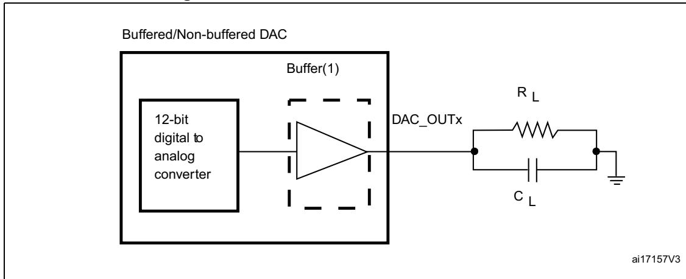

Figure 53. 12-bit buffered /non-buffered DAC

1. The DAC integrates an output buffer that can be used to reduce the output impedance and to drive external loads directly without the use of an external operational amplifier. The buffer can be bypassed by configuring the BOFFx bit in the DAC\_CR register.

## 6.3.26FSMC characteristics

Unless otherwise specified, the parameters given in Table 75 to Table 86 for the FSMC interface are derived from tests performed under the ambient temperature, $\mathsf { f } _ { \mathsf { H C L K } }$ frequency and $\mathsf { V } _ { \mathsf { D D } }$ supply voltage conditions summarized in Table 14, with the following configuration:

• Output speed is set to OSPEEDRy[1:0] = 10

• Capacitive load ${ \mathsf { C } } = 3 0 { \mathsf { p F } }$

•Measurement points are done at CMOS levels: $0 . 5 \mathsf { V } _ { \mathsf { D D } }$

Refer to Section Section 6.3.16: I/O port characteristics for more details on the input/output characteristics.

## Asynchronous waveforms and timings

Figure 54 through Figure 57 represent asynchronous waveforms and Table 75 through Table 78 provide the corresponding timings. The results shown in these tables are obtained with the following FSMC configuration:

• AddressSetupTime = 1

• AddressHoldTime = 0x1

• DataSetupTime = 0x1

• BusTurnAroundDuration = 0x0

In all timing tables, the $T _ { \mathsf { H C L K } }$ is the HCLK clock period.

144/206

DS8626 Rev 12

STM32F405xx, STM32F407xx

Electrical characteristics

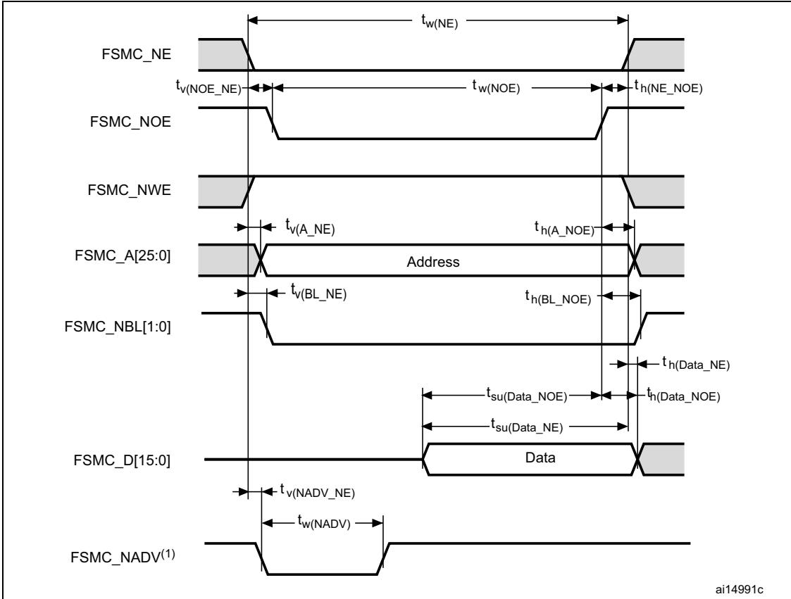

Figure 54. Asynchronous non-multiplexed SRAM/PSRAM/NOR read waveforms

1. Mode 2/B, C and D only. In Mode 1, FSMC\_NADV is not used.

Table 75. Asynchronous non-multiplexed SRAM/PSRAM/NOR read timings(1)(2)

<table><tr><td rowspan=1 colspan=1>Symbol</td><td rowspan=1 colspan=1>Parameter</td><td rowspan=1 colspan=1>Min</td><td rowspan=1 colspan=1>Max</td><td rowspan=1 colspan=1>Unit</td></tr><tr><td rowspan=1 colspan=1><eq>\mathfrak { t } _ { \mathsf { w } ( \mathsf { N E } ) }</eq></td><td rowspan=1 colspan=1>FSMC_NE low time</td><td rowspan=1 colspan=1><eq>2 \mathsf { T } _ { \mathsf { H C L K } } { - 0 . 5 }</eq></td><td rowspan=1 colspan=1>2<eq>T _ { \mathsf { H C L K } ^ { + 1 } }</eq></td><td rowspan=1 colspan=1>ns</td></tr><tr><td rowspan=1 colspan=1>tv(NOE_NE)</td><td rowspan=1 colspan=1>FSMC_NEx low to FSMC_NOE low</td><td rowspan=1 colspan=1>0.5</td><td rowspan=1 colspan=1>3</td><td rowspan=1 colspan=1>ns</td></tr><tr><td rowspan=1 colspan=1>tw(NOE)</td><td rowspan=1 colspan=1>FSMC_NOE low time</td><td rowspan=1 colspan=1><eq>2 \mathsf { T } _ { \mathsf { H C L K } ^ { - 2 } }</eq></td><td rowspan=1 colspan=1><eq>2 \mathsf { T } _ { \mathsf { H C L K } ^ { + } } 2</eq></td><td rowspan=1 colspan=1>ns</td></tr><tr><td rowspan=1 colspan=1>th(NE_NOE)</td><td rowspan=1 colspan=1>FSMC_NOE high to FSMC_NE high hold time</td><td rowspan=1 colspan=1>0</td><td rowspan=1 colspan=1>-</td><td rowspan=1 colspan=1>ns</td></tr><tr><td rowspan=1 colspan=1>tv(A_NE)</td><td rowspan=1 colspan=1>FSMC_NEx low to FSMC_A valid</td><td rowspan=1 colspan=1>-</td><td rowspan=1 colspan=1>4.5</td><td rowspan=1 colspan=1>ns</td></tr><tr><td rowspan=1 colspan=1>th(A_NOE)</td><td rowspan=1 colspan=1>Address hold time after FSMC_NOE high</td><td rowspan=1 colspan=1>4</td><td rowspan=1 colspan=1>-</td><td rowspan=1 colspan=1>ns</td></tr><tr><td rowspan=1 colspan=1>tv(BL_NE)</td><td rowspan=1 colspan=1>FSMC_NEx low to FSMC_BL valid</td><td rowspan=1 colspan=1>-</td><td rowspan=1 colspan=1>1.5</td><td rowspan=1 colspan=1>ns</td></tr><tr><td rowspan=1 colspan=1>th(BL_NOE)</td><td rowspan=1 colspan=1>FSMC_BL hold time after FSMC_NOE high</td><td rowspan=1 colspan=1>0</td><td rowspan=1 colspan=1>-</td><td rowspan=1 colspan=1>ns</td></tr><tr><td rowspan=1 colspan=1><eq>\mathfrak { t } _ { \mathtt { s u } ( \mathsf { D a t a \_ N E } ) }</eq></td><td rowspan=1 colspan=1>Data to FSMC_NEx high setup time</td><td rowspan=1 colspan=1><eq>\mathsf { T } _ { \mathsf { H C L K } } { ^ { + 4 } }</eq></td><td rowspan=1 colspan=1>-</td><td rowspan=1 colspan=1>ns</td></tr><tr><td rowspan=1 colspan=1><eq>\mathsf { t } _ { \mathsf { s u } ( \mathsf { D a t a \_ N O E } ) }</eq></td><td rowspan=1 colspan=1>Data to FSMC_NOEx high setup time</td><td rowspan=1 colspan=1><eq>T _ { \mathsf { H C L K } ^ { + 4 } }</eq></td><td rowspan=1 colspan=1></td><td rowspan=1 colspan=1>ns</td></tr><tr><td rowspan=1 colspan=1>th(Data_NOE)</td><td rowspan=1 colspan=1>Data hold time after FSMC_NOE high</td><td rowspan=1 colspan=1>0</td><td rowspan=1 colspan=1>-</td><td rowspan=1 colspan=1>ns</td></tr><tr><td rowspan=1 colspan=1>th(Data_NE)</td><td rowspan=1 colspan=1>Data hold time after FSMC_NEx high</td><td rowspan=1 colspan=1>0</td><td rowspan=1 colspan=1>-</td><td rowspan=1 colspan=1>ns</td></tr><tr><td rowspan=1 colspan=1>tv(NADV_NE)</td><td rowspan=1 colspan=1>FSMC_NEx low to FSMC_NADV low</td><td rowspan=1 colspan=1>-</td><td rowspan=1 colspan=1>2</td><td rowspan=1 colspan=1>ns</td></tr><tr><td rowspan=1 colspan=1><eq>\mathfrak { t } _ { \mathsf { W } ( \mathsf { N A D V } ) }</eq></td><td rowspan=1 colspan=1>FSMC_NADV low time</td><td rowspan=1 colspan=1>-</td><td rowspan=1 colspan=1><eq>{ \sf T } _ { \sf H C L K }</eq></td><td rowspan=1 colspan=1>ns</td></tr></table>

$$
\mathsf { C } _ { \mathsf { L } } = 3 0 ~ \mathsf { p F } .
$$

2. Evaluated by characterization - not tested in production.

145/206

DS8626 Rev 12

Electrical characteristics

STM32F405xx, STM32F407xx

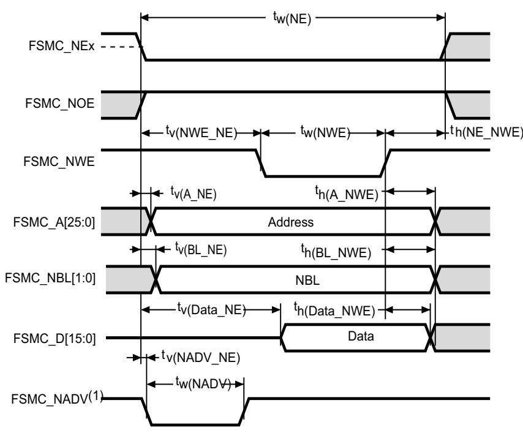

Figure 55. Asynchronous non-multiplexed SRAM/PSRAM/NOR write waveforms

1. Mode 2/B, C and D only. In Mode 1, FSMC\_NADV is not used.

Table 76. Asynchronous non-multiplexed SRAM/PSRAM/NOR write timings(1)(2)

<table><tr><td rowspan=1 colspan=1>Symbol</td><td rowspan=1 colspan=1>Parameter</td><td rowspan=1 colspan=1>Min</td><td rowspan=1 colspan=1>Max</td><td rowspan=1 colspan=1>Unit</td></tr><tr><td rowspan=1 colspan=1>tw(NE)</td><td rowspan=1 colspan=1>FSMC_NE low time</td><td rowspan=1 colspan=1><eq>3 T _ { \mathsf { H C L K } }</eq></td><td rowspan=1 colspan=1><eq>3 \mathsf { T } _ { \mathsf { H C L K } ^ { + } } 4</eq></td><td rowspan=1 colspan=1>ns</td></tr><tr><td rowspan=1 colspan=1>tv(NWE_NE)</td><td rowspan=1 colspan=1>FSMC_NEx low to FSMC_NWE low</td><td rowspan=1 colspan=1><eq>T _ { \mathsf { H C L K } } { - } 0 . 5</eq></td><td rowspan=1 colspan=1><eq>T _ { \mathsf { H C L K } ^ { + 0 . 5 } }</eq></td><td rowspan=1 colspan=1>ns</td></tr><tr><td rowspan=1 colspan=1><eq>\mathsf { t } _ { \mathsf { w } ( \mathsf { N W E } ) }</eq></td><td rowspan=1 colspan=1>FSMC_NWE low time</td><td rowspan=1 colspan=1><eq>T _ { \mathsf { H C L K } ^ { - 1 } }</eq></td><td rowspan=1 colspan=1><eq>T _ { \mathsf { H C L K } ^ { + 2 } }</eq></td><td rowspan=1 colspan=1>ns</td></tr><tr><td rowspan=1 colspan=1>th(NE_NWE)</td><td rowspan=1 colspan=1>FSMC_NWE high to FSMC_NE high hold time</td><td rowspan=1 colspan=1><eq>T _ { \mathsf { H C L K } ^ { - 1 } }</eq></td><td rowspan=1 colspan=1>-</td><td rowspan=1 colspan=1>ns</td></tr><tr><td rowspan=1 colspan=1><eq>\mathfrak { t } _ { \vee ( \mathsf { A } \_ N \mathsf { E } ) }</eq></td><td rowspan=1 colspan=1>FSMC_NEx low to FSMC_A valid</td><td rowspan=1 colspan=1></td><td rowspan=1 colspan=1>0</td><td rowspan=1 colspan=1>ns</td></tr><tr><td rowspan=1 colspan=1><eq>\mathfrak { t } _ { \mathsf { h } ( \mathsf { A \_ N W E } ) }</eq></td><td rowspan=1 colspan=1>Address hold time after FSMC_NWE high</td><td rowspan=1 colspan=1><eq>{ \sf T } _ { \sf \sf H C L K ^ { - 2 } }</eq></td><td rowspan=1 colspan=1>1</td><td rowspan=1 colspan=1>ns</td></tr><tr><td rowspan=1 colspan=1>tv(BL_NE)</td><td rowspan=1 colspan=1>FSMC_NEx low to FSMC_BL valid</td><td rowspan=1 colspan=1>-</td><td rowspan=1 colspan=1>1.5</td><td rowspan=1 colspan=1>ns</td></tr><tr><td rowspan=1 colspan=1>th(BL_NWE)</td><td rowspan=1 colspan=1>FSMC_BL hold time after FSMC_NWE high</td><td rowspan=1 colspan=1><eq>T _ { \mathsf { H C L K } ^ { - } } 1</eq></td><td rowspan=1 colspan=1>-</td><td rowspan=1 colspan=1>ns</td></tr><tr><td rowspan=1 colspan=1><eq>\mathsf { t } _ { \mathsf { V } ( \mathsf { D } \mathsf { a t a \_ N E } ) }</eq></td><td rowspan=1 colspan=1>Data to FSMC_NEx low to Data valid</td><td rowspan=1 colspan=1>-</td><td rowspan=1 colspan=1><eq>T _ { \mathsf { H C L K } ^ { + 3 } }</eq></td><td rowspan=1 colspan=1>ns</td></tr><tr><td rowspan=1 colspan=1>th(Data_NWE)</td><td rowspan=1 colspan=1>Data hold time after FSMC_NWE high</td><td rowspan=1 colspan=1><eq>T _ { \mathsf { H C L K } ^ { - 1 } }</eq></td><td rowspan=1 colspan=1>-</td><td rowspan=1 colspan=1>ns</td></tr><tr><td rowspan=1 colspan=1><eq>\mathsf { t } _ { \mathsf { v } ( \mathsf { N A D V \_ N E } ) }</eq></td><td rowspan=1 colspan=1>FSMC_NEx low to FSMC_NADV low</td><td rowspan=1 colspan=1>-</td><td rowspan=1 colspan=1>2</td><td rowspan=1 colspan=1>ns</td></tr><tr><td rowspan=1 colspan=1><eq>\mathsf { t } _ { \mathsf { W } ( \mathsf { N A D V } ) }</eq></td><td rowspan=1 colspan=1>FSMC_NADV low time</td><td rowspan=1 colspan=1>-</td><td rowspan=1 colspan=1><eq>T _ { \mathsf { H C L K } ^ { + 0 . 5 } }</eq></td><td rowspan=1 colspan=1>ns</td></tr></table>

1. $\mathsf { C } _ { \mathsf { L } } = 3 0 ~ \mathsf { p F } .$

2. Evaluated by characterization - not tested in production.

146/206

DS8626 Rev 12

STM32F405xx, STM32F407xx

Electrical characteristics

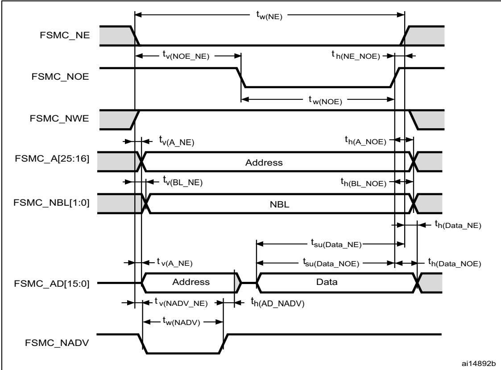

Figure 56. Asynchronous multiplexed PSRAM/NOR read waveforms

Table 77. Asynchronous multiplexed PSRAM/NOR read timings(1)(2)

<table><tr><td rowspan=1 colspan=1>Symbol</td><td rowspan=1 colspan=1>Parameter</td><td rowspan=1 colspan=1>Min</td><td rowspan=1 colspan=1>Max</td><td rowspan=1 colspan=1>Unit</td></tr><tr><td rowspan=1 colspan=1>tw(NE)</td><td rowspan=1 colspan=1>FSMC_NE low time</td><td rowspan=1 colspan=1><eq>3 \mathsf { T } _ { \mathsf { H C L K } ^ { - 1 } }</eq></td><td rowspan=1 colspan=1><eq>3 \mathsf { T } _ { \mathsf { H C L K } } + 1</eq></td><td rowspan=1 colspan=1>ns</td></tr><tr><td rowspan=1 colspan=1>tv(NOE_NE)</td><td rowspan=1 colspan=1>FSMC_NEx low to FSMC_NOE low</td><td rowspan=1 colspan=1><eq>2 \mathsf { T } _ { \mathsf { H C L K } } { - 0 . 5 }</eq></td><td rowspan=1 colspan=1><eq>2 T _ { \mathsf { H C L K } } { + } 0 . 5</eq></td><td rowspan=1 colspan=1>ns</td></tr><tr><td rowspan=1 colspan=1>tw(NOE)</td><td rowspan=1 colspan=1>FSMC_NOE low time</td><td rowspan=1 colspan=1><eq>T _ { \mathsf { H C L K } ^ { - 1 } }</eq></td><td rowspan=1 colspan=1><eq>T _ { \mathsf { H C L K } ^ { + 1 } }</eq></td><td rowspan=1 colspan=1>ns</td></tr><tr><td rowspan=1 colspan=1>th(NE_NOE)</td><td rowspan=1 colspan=1>FSMC_NOE high to FSMC_NE high hold time</td><td rowspan=1 colspan=1>0</td><td rowspan=1 colspan=1>-</td><td rowspan=1 colspan=1>ns</td></tr><tr><td rowspan=1 colspan=1>tv(A_NE)</td><td rowspan=1 colspan=1>FSMC_NEx low to FSMC_A valid</td><td rowspan=1 colspan=1>1</td><td rowspan=1 colspan=1>3</td><td rowspan=1 colspan=1>ns</td></tr><tr><td rowspan=1 colspan=1>tv(NADV_NE)</td><td rowspan=1 colspan=1>FSMC_NEx low to FSMC_NADV low</td><td rowspan=1 colspan=1>1</td><td rowspan=1 colspan=1>2</td><td rowspan=1 colspan=1>ns</td></tr><tr><td rowspan=1 colspan=1>tw(NADV)</td><td rowspan=1 colspan=1>FSMC_NADV low time</td><td rowspan=1 colspan=1><eq>{ \sf T } _ { \sf \sf H C L K ^ { - 2 } }</eq></td><td rowspan=1 colspan=1><eq>T _ { \mathsf { H C L K } ^ { + 1 } }</eq></td><td rowspan=1 colspan=1>ns</td></tr><tr><td rowspan=1 colspan=1>th(AD_NADV)</td><td rowspan=1 colspan=1>FSMC_AD(adress) valid hold time after FSMC_NADV high)</td><td rowspan=1 colspan=1><eq>T _ { \mathsf { H C L K } }</eq></td><td rowspan=1 colspan=1></td><td rowspan=1 colspan=1>ns</td></tr><tr><td rowspan=1 colspan=1>th(A_NOE)</td><td rowspan=1 colspan=1>Address hold time after FSMC_NOE high</td><td rowspan=1 colspan=1><eq>T _ { \mathsf { H C L K } ^ { - 1 } }</eq></td><td rowspan=1 colspan=1></td><td rowspan=1 colspan=1>ns</td></tr><tr><td rowspan=1 colspan=1>th(BL_NOE)</td><td rowspan=1 colspan=1>FSMC_BL time after FSMC_NOE high</td><td rowspan=1 colspan=1>0</td><td rowspan=1 colspan=1></td><td rowspan=1 colspan=1>ns</td></tr><tr><td rowspan=1 colspan=1>tv(BL_NE)</td><td rowspan=1 colspan=1>FSMC_NEx low to FSMC_BL valid</td><td rowspan=1 colspan=1></td><td rowspan=1 colspan=1>2</td><td rowspan=1 colspan=1>ns</td></tr><tr><td rowspan=1 colspan=1>tsu(Data_NE)</td><td rowspan=1 colspan=1>Data to FSMC_NEx high setup time</td><td rowspan=1 colspan=1><eq>T _ { \mathsf { H C L K } ^ { + 4 } }</eq></td><td rowspan=1 colspan=1>-</td><td rowspan=1 colspan=1>ns</td></tr><tr><td rowspan=1 colspan=1>tsu(Data_NOE)</td><td rowspan=1 colspan=1>Data to FSMC_NOE high setup time</td><td rowspan=1 colspan=1><eq>T _ { \mathsf { H C L K } ^ { + 4 } }</eq></td><td rowspan=1 colspan=1></td><td rowspan=1 colspan=1>ns</td></tr><tr><td rowspan=1 colspan=1>th(Data_NE)</td><td rowspan=1 colspan=1>Data hold time after FSMC_NEx high</td><td rowspan=1 colspan=1>0</td><td rowspan=1 colspan=1></td><td rowspan=1 colspan=1>ns</td></tr><tr><td rowspan=1 colspan=1>th(Data_NOE)</td><td rowspan=1 colspan=1>Data hold time after FSMC_NOE high</td><td rowspan=1 colspan=1>0</td><td rowspan=1 colspan=1></td><td rowspan=1 colspan=1>ns</td></tr></table>

$$
\mathsf { C } _ { \mathsf { L } } = 3 0 ~ \mathsf { p F } .
$$

2. Evaluated by characterization - not tested in production.

147/206

DS8626 Rev 12

Electrical characteristics

STM32F405xx, STM32F407xx

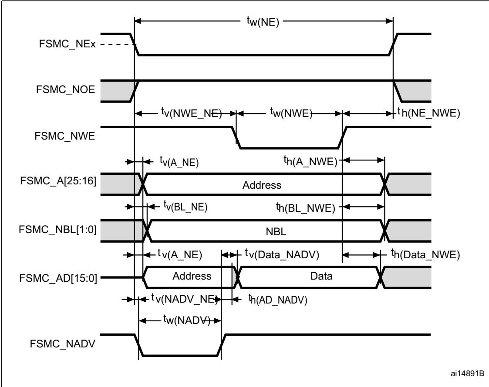

Figure 57. Asynchronous multiplexed PSRAM/NOR write waveforms

Table 78. Asynchronous multiplexed PSRAM/NOR write timings(1)(2)

<table><tr><td rowspan=1 colspan=1>Symbol</td><td rowspan=1 colspan=1>Parameter</td><td rowspan=1 colspan=1>Min</td><td rowspan=1 colspan=1>Max</td><td rowspan=1 colspan=1>Unit</td></tr><tr><td rowspan=1 colspan=1><eq>\mathfrak { t } _ { \mathsf { w } ( \mathsf { N E } ) }</eq></td><td rowspan=1 colspan=1>FSMC_NE low time</td><td rowspan=1 colspan=1><eq>4 T _ { \mathsf { H C L K } } - 0 . 5</eq></td><td rowspan=1 colspan=1><eq>4 T _ { \mathsf { H C L K } } { } ^ { + 3 }</eq></td><td rowspan=1 colspan=1>ns</td></tr><tr><td rowspan=1 colspan=1><eq>\mathsf { t } _ { \mathsf { v } ( \mathsf { N W E } \_ \mathsf { N E } ) }</eq></td><td rowspan=1 colspan=1>FSMC_NEx low to FSMC_NWE low</td><td rowspan=1 colspan=1><eq>T _ { \mathsf { H C L K } } { - } 0 . 5</eq></td><td rowspan=1 colspan=1><eq>T _ { \mathsf { H C L K } } - 0 . 5</eq></td><td rowspan=1 colspan=1>ns</td></tr><tr><td rowspan=1 colspan=1><eq>\mathfrak { t } _ { \mathsf { w } ( \mathsf { N W E } ) }</eq></td><td rowspan=1 colspan=1>FSMC_NWE low tim e</td><td rowspan=1 colspan=1><eq>2 \mathsf { T } _ { \mathsf { H C L K } } { - 0 . 5 }</eq></td><td rowspan=1 colspan=1><eq>2 T _ { \mathsf { H C L K } } { } ^ { + 3 }</eq></td><td rowspan=1 colspan=1>ns</td></tr><tr><td rowspan=1 colspan=1>th(NE_NWE)</td><td rowspan=1 colspan=1>FSMC_NWE high to FSMC_NE high hold time</td><td rowspan=1 colspan=1>THCLK</td><td rowspan=1 colspan=1>-</td><td rowspan=1 colspan=1>ns</td></tr><tr><td rowspan=1 colspan=1><eq>\mathfrak { t } _ { \mathsf { v } ( \mathsf { A } \_ { \mathsf { N E } } ) }</eq></td><td rowspan=1 colspan=1>FSMC_NEx low to FSMC_A valid</td><td rowspan=1 colspan=1>1</td><td rowspan=1 colspan=1>0</td><td rowspan=1 colspan=1>ns</td></tr><tr><td rowspan=1 colspan=1><eq>\mathsf { t } _ { \mathsf { v } ( \mathsf { N A D V \_ N E } ) }</eq></td><td rowspan=1 colspan=1>FSMC_NEx low to FSMC_NADV low</td><td rowspan=1 colspan=1>1</td><td rowspan=1 colspan=1>2</td><td rowspan=1 colspan=1>ns</td></tr><tr><td rowspan=1 colspan=1><eq>\mathfrak { t } _ { \mathsf { W } ( \mathsf { N A D V } ) }</eq></td><td rowspan=1 colspan=1>FSMC_NADV low time</td><td rowspan=1 colspan=1><eq>{ \sf T } _ { \sf \sf H C L K ^ { - 2 } }</eq></td><td rowspan=1 colspan=1><eq>\tau _ { \mathsf { H C L K } ^ { + } } 1</eq></td><td rowspan=1 colspan=1>ns</td></tr><tr><td rowspan=1 colspan=1>th(AD_NADV)</td><td rowspan=1 colspan=1>FSMC_AD(address) valid hold time afterFSMC_NADV high)</td><td rowspan=1 colspan=1><eq>T _ { \mathsf { H C L K } ^ { - 2 } }</eq></td><td rowspan=1 colspan=1></td><td rowspan=1 colspan=1>ns</td></tr><tr><td rowspan=1 colspan=1>th(A_NWE)</td><td rowspan=1 colspan=1>Address hold time after FSMC_NWE high</td><td rowspan=1 colspan=1><eq>{ \sf T } _ { \sf H C L K }</eq></td><td rowspan=1 colspan=1></td><td rowspan=1 colspan=1>ns</td></tr><tr><td rowspan=1 colspan=1><eq>\mathfrak { t } _ { \mathsf { h } ( \mathsf { B L } \_ \mathsf { N W E } ) }</eq></td><td rowspan=1 colspan=1>FSMC_BL hold time after FSMC_NWE high</td><td rowspan=1 colspan=1><eq>T _ { \mathsf { H C L K } ^ { - 2 } }</eq></td><td rowspan=1 colspan=1>1</td><td rowspan=1 colspan=1>ns</td></tr><tr><td rowspan=1 colspan=1><eq>\mathfrak { t } _ { \mathsf { v } ( \mathsf { B L } \_ { \mathsf { N E } } ) }</eq></td><td rowspan=1 colspan=1>FSMC_NEx low to FSMC_BL valid</td><td rowspan=1 colspan=1></td><td rowspan=1 colspan=1>1.5</td><td rowspan=1 colspan=1>ns</td></tr><tr><td rowspan=1 colspan=1>tv(Data_NADV)</td><td rowspan=1 colspan=1>FSMC_NADV high to Data valid</td><td rowspan=1 colspan=1></td><td rowspan=1 colspan=1><eq>T _ { \mathsf { H C L K } } { - } 0 . 5</eq></td><td rowspan=1 colspan=1>ns</td></tr><tr><td rowspan=1 colspan=1>th(Data_NWE)</td><td rowspan=1 colspan=1>Data hold time after FSMC_NWE high</td><td rowspan=1 colspan=1><eq>{ \sf T } _ { \sf H C L K }</eq></td><td rowspan=1 colspan=1>1</td><td rowspan=1 colspan=1>ns</td></tr></table>

1. $\mathsf { C } _ { \mathsf { L } } = 3 0 ~ \mathsf { p F } .$

148/206

DS8626 Rev 12

STM32F405xx, STM32F407xx

Electrical characteristics

2. Evaluated by characterization - not tested in production.

## Synchronous waveforms and timings

Figure 58 through Figure 61 represent synchronous waveforms and Table 80 through Table 82 provide the corresponding timings. The results shown in these tables are obtained with the following FSMC configuration:

BurstAccessMode = FSMC\_BurstAccessMode\_Enable;

• MemoryType = FSMC\_MemoryType\_CRAM;

• WriteBurst = FSMC\_WriteBurst\_Enable;

•CLKDivision = 1; (0 is not supported, see the STM32F40xxx/41xxx reference manual)

• DataLatency = 1 for NOR flash; DataLatency = 0 for PSRAM

In all timing tables, the $T _ { \mathsf { H C L K } }$ is the HCLK clock period (with maximum FSMC\_CLK = 60 MHz).

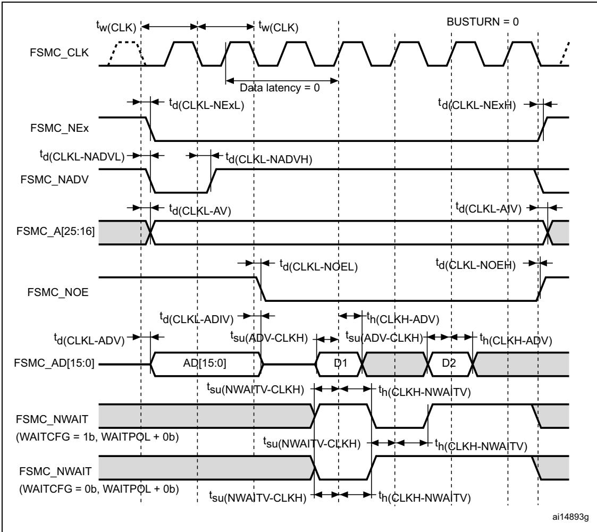

Figure 58. Synchronous multiplexed NOR/PSRAM read timings

149/206

DS8626 Rev 12

Electrical characteristics

STM32F405xx, STM32F407xx

Table 79. Synchronous multiplexed NOR/PSRAM read timings(1)(2)

<table><tr><td rowspan=1 colspan=1>Symbol</td><td rowspan=1 colspan=1>Parameter</td><td rowspan=1 colspan=1>Min</td><td rowspan=1 colspan=1>Max</td><td rowspan=1 colspan=1>Unit</td></tr><tr><td rowspan=1 colspan=1><eq>\mathfrak { t } _ { \mathsf { w } ( \mathsf { C L K } ) }</eq></td><td rowspan=1 colspan=1>FSMC_CLK period</td><td rowspan=1 colspan=1><eq>2 ^ { \mathsf { T } } \mathsf { H C L K }</eq></td><td rowspan=1 colspan=1>-</td><td rowspan=1 colspan=1>ns</td></tr><tr><td rowspan=1 colspan=1>td(CLKL-NExL)</td><td rowspan=1 colspan=1>FSMC_CLK low to FSMC_NEx low (x=0..2)</td><td rowspan=1 colspan=1>-</td><td rowspan=1 colspan=1>0</td><td rowspan=1 colspan=1>ns</td></tr><tr><td rowspan=1 colspan=1>td(CLKL-NExH)</td><td rowspan=1 colspan=1>FSMC_CLK low to FSMC_NEx high (x= 0...2)</td><td rowspan=1 colspan=1>2</td><td rowspan=1 colspan=1>-</td><td rowspan=1 colspan=1>ns</td></tr><tr><td rowspan=1 colspan=1>td(CLKL-NADVL)</td><td rowspan=1 colspan=1>FSMC_CLK low to FSMC_NADV low</td><td rowspan=1 colspan=1>-</td><td rowspan=1 colspan=1>2</td><td rowspan=1 colspan=1>ns</td></tr><tr><td rowspan=1 colspan=1>td(CLKL-NADVH)</td><td rowspan=1 colspan=1>FSMC_CLK low to FSMC_NADV high</td><td rowspan=1 colspan=1>2</td><td rowspan=1 colspan=1>-</td><td rowspan=1 colspan=1>ns</td></tr><tr><td rowspan=1 colspan=1>td(CLKL-AV)</td><td rowspan=1 colspan=1>FSMC_CLK low to FSMC_Ax valid (x=16...25)</td><td rowspan=1 colspan=1>-</td><td rowspan=1 colspan=1>0</td><td rowspan=1 colspan=1>ns</td></tr><tr><td rowspan=1 colspan=1>td(CLKL-AIV)</td><td rowspan=1 colspan=1>FSMC_CLK low to FSMC_Ax invalid (x=16...25)</td><td rowspan=1 colspan=1>0</td><td rowspan=1 colspan=1>-</td><td rowspan=1 colspan=1>ns</td></tr><tr><td rowspan=1 colspan=1>td(CLKL-NOEL)</td><td rowspan=1 colspan=1>FSMC_CLK low to FSMC_NOE low</td><td rowspan=1 colspan=1>-</td><td rowspan=1 colspan=1>0</td><td rowspan=1 colspan=1>ns</td></tr><tr><td rowspan=1 colspan=1>td(CLKL-NOEH)</td><td rowspan=1 colspan=1>FSMC_CLK low to FSMC_NOE high</td><td rowspan=1 colspan=1>2</td><td rowspan=1 colspan=1>一</td><td rowspan=1 colspan=1>ns</td></tr><tr><td rowspan=1 colspan=1>td(CLKL-ADV)</td><td rowspan=1 colspan=1>FSMC_CLK low to FSMC_AD[15:0] valid</td><td rowspan=1 colspan=1>-</td><td rowspan=1 colspan=1>4.5</td><td rowspan=1 colspan=1>ns</td></tr><tr><td rowspan=1 colspan=1>td(CLKL-ADIV)</td><td rowspan=1 colspan=1>FSMC_CLK low to FSMC_AD[15:0] invalid</td><td rowspan=1 colspan=1>0</td><td rowspan=1 colspan=1>-</td><td rowspan=1 colspan=1>ns</td></tr><tr><td rowspan=1 colspan=1>tsu(ADV-CLKH)</td><td rowspan=1 colspan=1>FSMC_A/D[15:0] valid data before FSMC_CLK high</td><td rowspan=1 colspan=1>6</td><td rowspan=1 colspan=1>-</td><td rowspan=1 colspan=1>ns</td></tr><tr><td rowspan=1 colspan=1>th(CLKH-ADV)</td><td rowspan=1 colspan=1>FSMC_A/D[15:0] valid data after FSMC_CLK high</td><td rowspan=1 colspan=1>0</td><td rowspan=1 colspan=1>-</td><td rowspan=1 colspan=1>ns</td></tr><tr><td rowspan=1 colspan=1>tsu(NWAIT-CLKH)</td><td rowspan=1 colspan=1>FSMC_NWAIT valid before FSMC_CLK high</td><td rowspan=1 colspan=1>4</td><td rowspan=1 colspan=1>-</td><td rowspan=1 colspan=1>ns</td></tr><tr><td rowspan=1 colspan=1>th(CLKH-NWAIT)</td><td rowspan=1 colspan=1>FSMC_NWAIT valid after FSMC_CLK high</td><td rowspan=1 colspan=1>0</td><td rowspan=1 colspan=1>一</td><td rowspan=1 colspan=1>ns</td></tr></table>

1. $\mathsf { C } _ { \mathsf { L } } = 3 0 \mathsf { p F } .$

2. Evaluated by characterization - not tested in production.

150/206

DS8626 Rev 12