STM32F405xx, STM32F407xx

Electrical characteristics

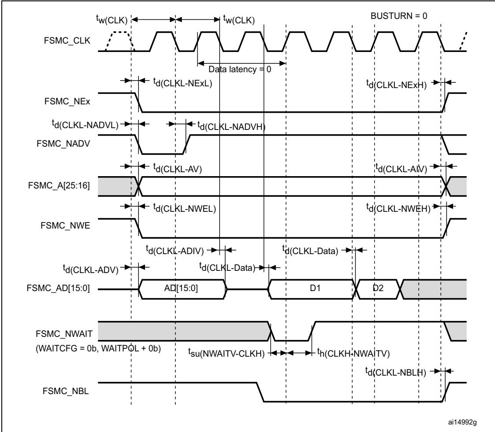

Figure 59. Synchronous multiplexed PSRAM write timings

Table 80. Synchronous multiplexed PSRAM write timings(1)(2)

<table><tr><td colspan="1" rowspan="1">Symbol</td><td colspan="1" rowspan="1">Parameter</td><td colspan="1" rowspan="1">Min</td><td colspan="1" rowspan="1">Max</td><td colspan="1" rowspan="1">Unit</td></tr><tr><td colspan="1" rowspan="1">tw(CLK)</td><td colspan="1" rowspan="1">FSMC_CLK period</td><td colspan="1" rowspan="1">2THCLK</td><td colspan="1" rowspan="1">-</td><td colspan="1" rowspan="1">ns</td></tr><tr><td colspan="1" rowspan="1">td(CLKL-NExL)</td><td colspan="1" rowspan="1">FSMC_CLK low to FSMC_NEx low (x=0..2)</td><td colspan="1" rowspan="1">-</td><td colspan="1" rowspan="1">1</td><td colspan="1" rowspan="1">ns</td></tr><tr><td colspan="1" rowspan="1">td(CLKL-NExH)</td><td colspan="1" rowspan="1">FSMC_CLK low to FSMC_NEx high (x= 0...2)</td><td colspan="1" rowspan="1">1</td><td colspan="1" rowspan="1">-</td><td colspan="1" rowspan="1">ns</td></tr><tr><td colspan="1" rowspan="1">td(CLKL-NADVL)</td><td colspan="1" rowspan="1">FSMC_CLK low to FSMC_NADV low</td><td colspan="1" rowspan="1">-</td><td colspan="1" rowspan="1">0</td><td colspan="1" rowspan="1">ns</td></tr><tr><td colspan="1" rowspan="1">td(CLKL-NADVH)</td><td colspan="1" rowspan="1">FSMC_CLK low to FSMC_NADV high</td><td colspan="1" rowspan="1">0</td><td colspan="1" rowspan="1"></td><td colspan="1" rowspan="1">ns</td></tr><tr><td colspan="1" rowspan="1">td(CLKL-AV)</td><td colspan="1" rowspan="1">FSMC_CLK low to FSMC_Ax valid (x=16...25)</td><td colspan="1" rowspan="1">-</td><td colspan="1" rowspan="1">0</td><td colspan="1" rowspan="1">ns</td></tr><tr><td colspan="1" rowspan="1">td(CLKL-AIV)</td><td colspan="1" rowspan="1">FSMC_CLK low to FSMC_Ax invalid (x=16...25)</td><td colspan="1" rowspan="1">8</td><td colspan="1" rowspan="1">-</td><td colspan="1" rowspan="1">ns</td></tr><tr><td colspan="1" rowspan="1">td(CLKL-NWEL)</td><td colspan="1" rowspan="1">FSMC_CLK low to FSMC_NWE low</td><td colspan="1" rowspan="1">-</td><td colspan="1" rowspan="1">0.5</td><td colspan="1" rowspan="1">ns</td></tr><tr><td colspan="1" rowspan="1">td(CLKL-NWEH)</td><td colspan="1" rowspan="1">FSMC_CLK low to FSMC_NWE high</td><td colspan="1" rowspan="1">0</td><td colspan="1" rowspan="1">-</td><td colspan="1" rowspan="1">ns</td></tr><tr><td colspan="1" rowspan="1">td(CLKL-ADIV)</td><td colspan="1" rowspan="1">FSMC_CLK low to FSMC_AD[15:0] invalid</td><td colspan="1" rowspan="1">0</td><td colspan="1" rowspan="1">-</td><td colspan="1" rowspan="1">ns</td></tr><tr><td colspan="1" rowspan="1">td(CLKL-DATA)</td><td colspan="1" rowspan="1">FSMC_A/D[15:0] valid data after FSMC_CLKlow</td><td colspan="1" rowspan="1"></td><td colspan="1" rowspan="1">3</td><td colspan="1" rowspan="1">ns</td></tr><tr><td colspan="1" rowspan="1">td(CLKL-NBLH)</td><td colspan="1" rowspan="1">FSMC_CLK low to FSMC_NBL high</td><td colspan="1" rowspan="1">0</td><td colspan="1" rowspan="1"></td><td colspan="1" rowspan="1">ns</td></tr><tr><td colspan="1" rowspan="1">tsu(NWAIT-CLKH)</td><td colspan="1" rowspan="1">FSMC_NWAIT valid before FSMC_CLK high</td><td colspan="1" rowspan="1">4</td><td colspan="1" rowspan="1"></td><td colspan="1" rowspan="1">ns</td></tr><tr><td colspan="1" rowspan="1">th(CLKH-NWAIT)</td><td colspan="1" rowspan="1">FSMC_NWAIT valid after FSMC_CLK high</td><td colspan="1" rowspan="1">0</td><td colspan="1" rowspan="1"></td><td colspan="1" rowspan="1">ns</td></tr></table>

1. $\mathsf { C } _ { \mathsf { L } } = 3 0 ~ \mathsf { p F } .$

DS8626 Rev 12

151/206

Electrical characteristics

STM32F405xx, STM32F407xx

2. Evaluated by characterization - not tested in production.

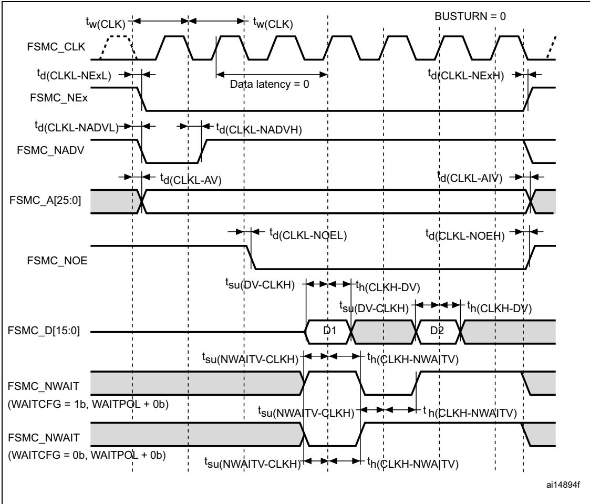

Figure 60. Synchronous non-multiplexed NOR/PSRAM read timings

152/206

DS8626 Rev 12

STM32F405xx, STM32F407xx

Electrical characteristics

Table 81. Synchronous non-multiplexed NOR/PSRAM read timings(1)(2)

<table><tr><td rowspan=1 colspan=1>Symbol</td><td rowspan=1 colspan=1>Parameter</td><td rowspan=1 colspan=1>Min</td><td rowspan=1 colspan=1>Max</td><td rowspan=1 colspan=1>Unit</td></tr><tr><td rowspan=1 colspan=1>tw(CLK)</td><td rowspan=1 colspan=1>FSMC_CLK period</td><td rowspan=1 colspan=1><eq>2 \mathsf { T } _ { \mathsf { H C L K } } - 0 . 5</eq></td><td rowspan=1 colspan=1>-</td><td rowspan=1 colspan=1>ns</td></tr><tr><td rowspan=1 colspan=1>td(CLKL-NExL)</td><td rowspan=1 colspan=1>FSMC_CLK low to FSMC_NEx low (x=0..2)</td><td rowspan=1 colspan=1>-</td><td rowspan=1 colspan=1>0.5</td><td rowspan=1 colspan=1>ns</td></tr><tr><td rowspan=1 colspan=1>td(CLKL-NExH)</td><td rowspan=1 colspan=1>FSMC_CLK low to FSMC_NEx high (x= 0...2)</td><td rowspan=1 colspan=1>0</td><td rowspan=1 colspan=1>-</td><td rowspan=1 colspan=1>ns</td></tr><tr><td rowspan=1 colspan=1>td(CLKL-NADVL)</td><td rowspan=1 colspan=1>FSMC_CLK low to FSMC_NADV low</td><td rowspan=1 colspan=1>-</td><td rowspan=1 colspan=1>2</td><td rowspan=1 colspan=1>ns</td></tr><tr><td rowspan=1 colspan=1>td(CLKL-NADVH)</td><td rowspan=1 colspan=1>FSMC_CLK low to FSMC_NADV high</td><td rowspan=1 colspan=1>3</td><td rowspan=1 colspan=1>-</td><td rowspan=1 colspan=1>ns</td></tr><tr><td rowspan=1 colspan=1>td(CLKL-AV)</td><td rowspan=1 colspan=1>FSMC_CLK low to FSMC_Ax valid (x=16...25)</td><td rowspan=1 colspan=1>-</td><td rowspan=1 colspan=1>0</td><td rowspan=1 colspan=1>ns</td></tr><tr><td rowspan=1 colspan=1>td(CLKL-AIV)</td><td rowspan=1 colspan=1>FSMC_CLK low to FSMC_Ax invalid (x=16...25)</td><td rowspan=1 colspan=1>2</td><td rowspan=1 colspan=1>-</td><td rowspan=1 colspan=1>ns</td></tr><tr><td rowspan=1 colspan=1>td(CLKL-NOEL)</td><td rowspan=1 colspan=1>FSMC_CLK low to FSMC_NOE low</td><td rowspan=1 colspan=1>-</td><td rowspan=1 colspan=1>0.5</td><td rowspan=1 colspan=1>ns</td></tr><tr><td rowspan=1 colspan=1>td(CLKL-NOEH)</td><td rowspan=1 colspan=1>FSMC_CLK low to FSMC_NOE high</td><td rowspan=1 colspan=1>1.5</td><td rowspan=1 colspan=1>-</td><td rowspan=1 colspan=1>ns</td></tr><tr><td rowspan=1 colspan=1>tsu(DV-CLKH)</td><td rowspan=1 colspan=1>FSMC_D[15:0] valid data before FSMC_CLK high</td><td rowspan=1 colspan=1>6</td><td rowspan=1 colspan=1>-</td><td rowspan=1 colspan=1>ns</td></tr><tr><td rowspan=1 colspan=1>th(CLKH-DV)</td><td rowspan=1 colspan=1>FSMC_D[15:0] valid data after FSMC_CLK high</td><td rowspan=1 colspan=1>3</td><td rowspan=1 colspan=1>-</td><td rowspan=1 colspan=1>ns</td></tr><tr><td rowspan=1 colspan=1>tsu(NWAIT-CLKH)</td><td rowspan=1 colspan=1>FSMC_NWAIT valid before FSMC_CLK high</td><td rowspan=1 colspan=1>4</td><td rowspan=1 colspan=1>-</td><td rowspan=1 colspan=1>ns</td></tr><tr><td rowspan=1 colspan=1>th(CLKH-NWAIT)</td><td rowspan=1 colspan=1>FSMC_NWAIT valid after FSMC_CLK high</td><td rowspan=1 colspan=1>0</td><td rowspan=1 colspan=1>-</td><td rowspan=1 colspan=1>ns</td></tr></table>

1. $\mathsf C _ { \mathsf { L } } = 3 0 ~ \mathsf p \mathsf F .$

2. Evaluated by characterization - not tested in production.

153/206

S

DS8626 Rev 12

Electrical characteristics

STM32F405xx, STM32F407xx

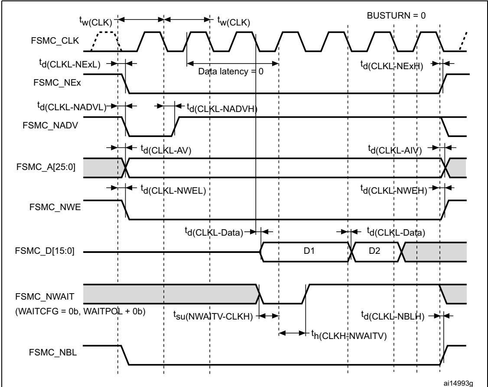

Figure 61. Synchronous non-multiplexed PSRAM write timings

Table 82. Synchronous non-multiplexed PSRAM write timings(1)(2)

<table><tr><td rowspan=1 colspan=1>Symbol</td><td rowspan=1 colspan=1>Parameter</td><td rowspan=1 colspan=1>Min</td><td rowspan=1 colspan=1>Max</td><td rowspan=1 colspan=1>Unit</td></tr><tr><td rowspan=1 colspan=1>tw(CLK)</td><td rowspan=1 colspan=1>FSMC_CLK period</td><td rowspan=1 colspan=1><eq>2 ^ { \mathsf { T } } \mathsf { H C L K }</eq></td><td rowspan=1 colspan=1>-</td><td rowspan=1 colspan=1>ns</td></tr><tr><td rowspan=1 colspan=1>td(CLKL-NExL)</td><td rowspan=1 colspan=1>FSMC_CLK low to FSMC_NEx low (x=0..2)</td><td rowspan=1 colspan=1>-</td><td rowspan=1 colspan=1>1</td><td rowspan=1 colspan=1>ns</td></tr><tr><td rowspan=1 colspan=1>td(CLKL-NExH)</td><td rowspan=1 colspan=1>FSMC_CLK low to FSMC_NEx high (x= 0...2)</td><td rowspan=1 colspan=1>1</td><td rowspan=1 colspan=1>-</td><td rowspan=1 colspan=1>ns</td></tr><tr><td rowspan=1 colspan=1>td(CLKL-NADVL)</td><td rowspan=1 colspan=1>FSMC_CLK low to FSMC_NADV low</td><td rowspan=1 colspan=1>-</td><td rowspan=1 colspan=1>7</td><td rowspan=1 colspan=1>ns</td></tr><tr><td rowspan=1 colspan=1>td(CLKL-NADVH)</td><td rowspan=1 colspan=1>FSMC_CLK low to FSMC_NADV high</td><td rowspan=1 colspan=1>6</td><td rowspan=1 colspan=1>-</td><td rowspan=1 colspan=1>ns</td></tr><tr><td rowspan=1 colspan=1>td(CLKL-AV)</td><td rowspan=1 colspan=1>FSMC_CLK low to FSMC_Ax valid (x=16...25)</td><td rowspan=1 colspan=1>-</td><td rowspan=1 colspan=1>0</td><td rowspan=1 colspan=1>ns</td></tr><tr><td rowspan=1 colspan=1>td(CLKL-AIV)</td><td rowspan=1 colspan=1>FSMC_CLK low to FSMC_Ax invalid (x=16...25)</td><td rowspan=1 colspan=1>6</td><td rowspan=1 colspan=1>-</td><td rowspan=1 colspan=1>ns</td></tr><tr><td rowspan=1 colspan=1>td(CLKL-NWEL)</td><td rowspan=1 colspan=1>FSMC_CLK low to FSMC_NWE low</td><td rowspan=1 colspan=1>1</td><td rowspan=1 colspan=1>1</td><td rowspan=1 colspan=1>ns</td></tr><tr><td rowspan=1 colspan=1>td(CLKL-NWEH)</td><td rowspan=1 colspan=1>FSMC_CLK low to FSMC_NWE high</td><td rowspan=1 colspan=1>2</td><td rowspan=1 colspan=1>-</td><td rowspan=1 colspan=1>ns</td></tr><tr><td rowspan=1 colspan=1>td(CLKL-Data)</td><td rowspan=1 colspan=1>FSMC_D[15:0] valid data after FSMC_CLK low</td><td rowspan=1 colspan=1>-</td><td rowspan=1 colspan=1>3</td><td rowspan=1 colspan=1>ns</td></tr><tr><td rowspan=1 colspan=1>td(CLKL-NBLH)</td><td rowspan=1 colspan=1>FSMC_CLK low to FSMC_NBL high</td><td rowspan=1 colspan=1>3</td><td rowspan=1 colspan=1>-</td><td rowspan=1 colspan=1>ns</td></tr><tr><td rowspan=1 colspan=1>tsu(NWAIT-CLKH)</td><td rowspan=1 colspan=1>FSMC_NWAIT valid before FSMC_CLK high</td><td rowspan=1 colspan=1>4</td><td rowspan=1 colspan=1>-</td><td rowspan=1 colspan=1>ns</td></tr><tr><td rowspan=1 colspan=1>th(CLKH-NWAIT)</td><td rowspan=1 colspan=1>FSMC_NWAIT valid after FSMC_CLK high</td><td rowspan=1 colspan=1>0</td><td rowspan=1 colspan=1>-</td><td rowspan=1 colspan=1>ns</td></tr></table>

1. $\mathsf { C } _ { \mathsf { L } } = 3 0 ~ \mathsf { p F } .$

2. Evaluated by characterization - not tested in production.

154/206

DS8626 Rev 12

STM32F405xx, STM32F407xx

Electrical characteristics

## PC Card/CompactFlash controller waveforms and timings

Figure 62 through Figure 67 represent synchronous waveforms, and Table 83 and Table 84 provide the corresponding timings. The results shown in this table are obtained with the following FSMC configuration:

• COM.FSMC\_SetupTime = 0x04;

• COM.FSMC\_WaitSetupTime = 0x07;

• COM.FSMC\_HoldSetupTime = 0x04;

• COM.FSMC\_HiZSetupTime = 0x00;

• ATT.FSMC\_SetupTime = 0x04;

• ATT.FSMC\_WaitSetupTime = 0x07;

• ATT.FSMC\_HoldSetupTime = 0x04;

• ATT.FSMC\_HiZSetupTime = 0x00;

• IO.FSMC\_SetupTime = 0x04;

• IO.FSMC\_WaitSetupTime = 0x07;

• IO.FSMC\_HoldSetupTime = 0x04;

• IO.FSMC\_HiZSetupTime = 0x00;

• TCLRSetupTime = 0;

• TARSetupTime = 0.

In all timing tables, the $T _ { \mathsf { H C L K } }$ is the HCLK clock period.

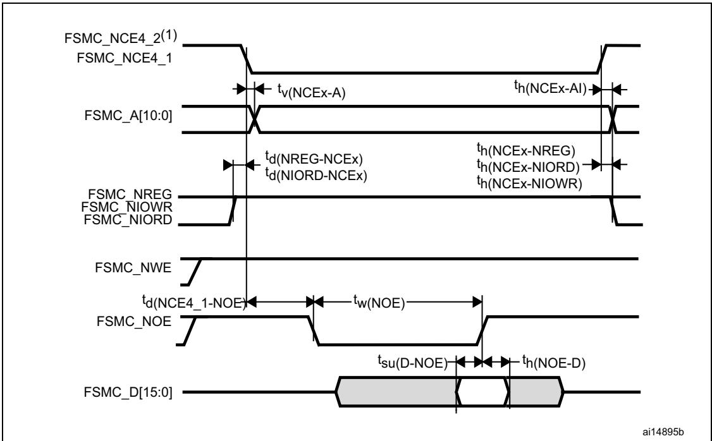

Figure 62. PC Card/CompactFlash controller waveforms for common memory read access

1. FSMC\_NCE4\_2 remains high (inactive during 8-bit access.

155/206

DS8626 Rev 12

Electrical characteristics

STM32F405xx, STM32F407xx

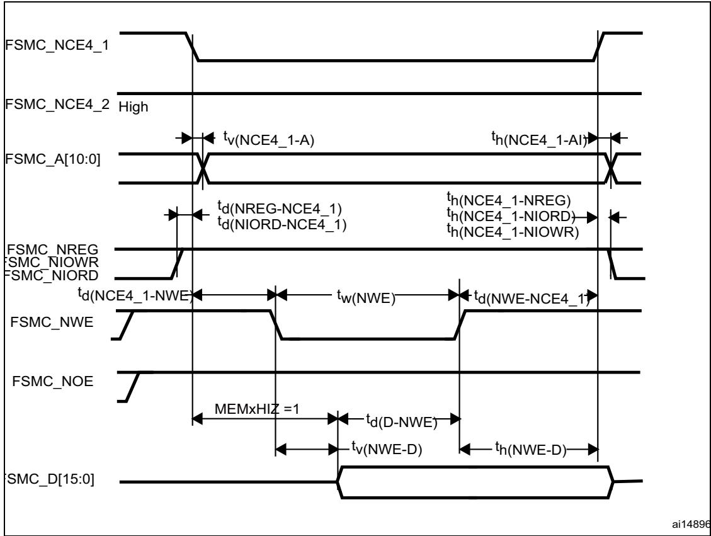

Figure 63. PC Card/CompactFlash controller waveforms for common memory write access

156/206

DS8626 Rev 12

STM32F405xx, STM32F407xx

Electrical characteristics

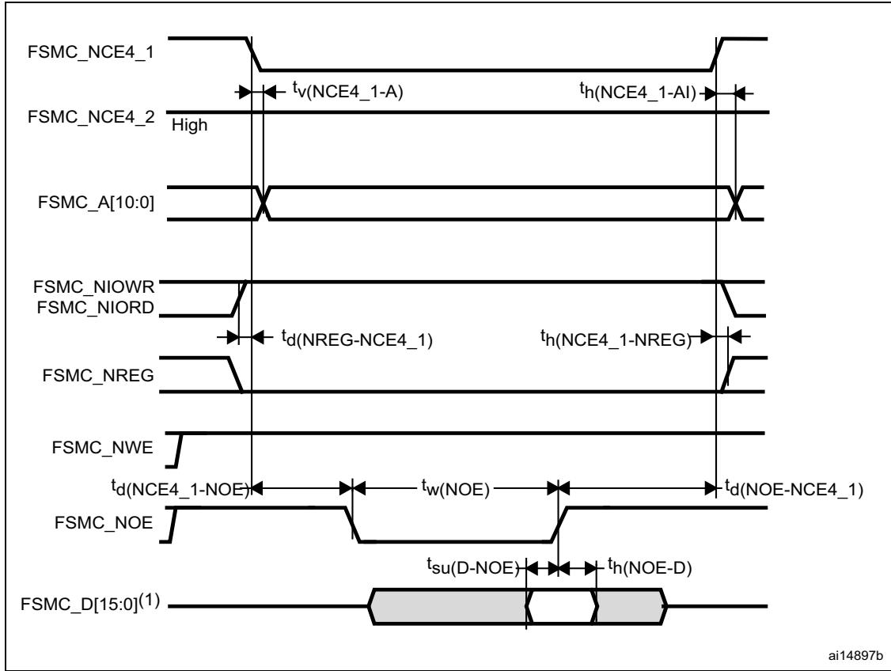

Figure 64. PC Card/CompactFlash controller waveforms for attribute memory read access

1. Only data bits 0...7 are read (bits 8...15 are disregarded).

DS8626 Rev 12

157/206

Electrical characteristics

STM32F405xx, STM32F407xx

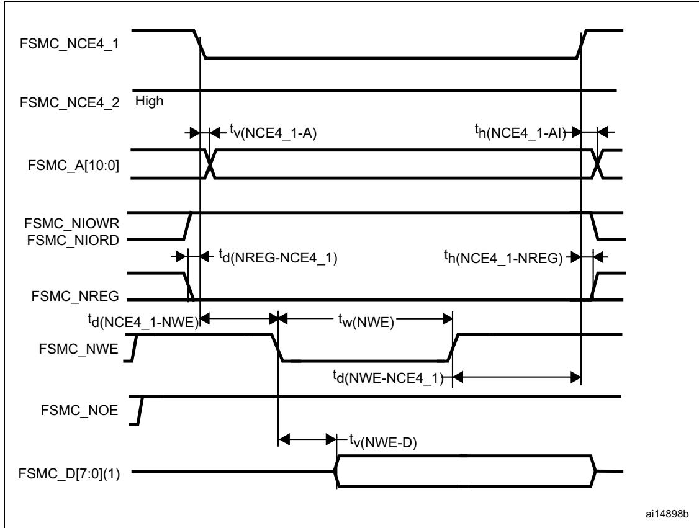

Figure 65. PC Card/CompactFlash controller waveforms for attribute memory write access

1. Only data bits 0...7 are driven (bits 8...15 remains Hi-Z).

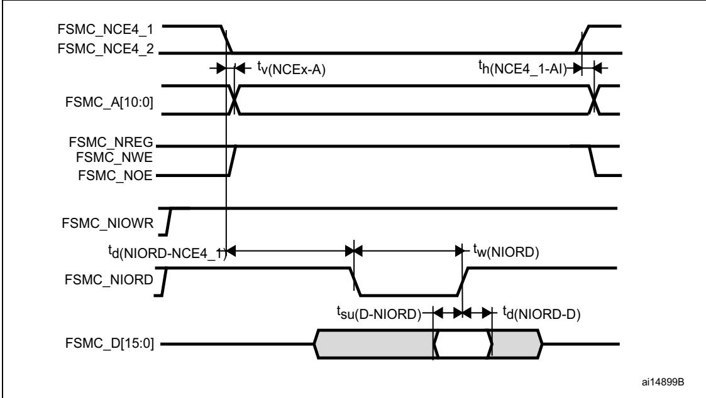

Figure 66. PC Card/CompactFlash controller waveforms for I/O space read access

158/206

DS8626 Rev 12

STM32F405xx, STM32F407xx

Electrical characteristics

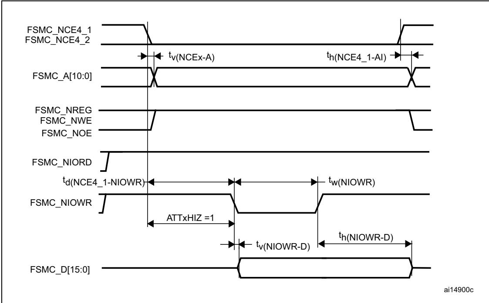

Figure 67. PC Card/CompactFlash controller waveforms for I/O space write access

Table 83. Switching characteristics for PC Card/CF read and write cycles in attribute/common space(1)(2)

<table><tr><td rowspan=1 colspan=1>Symbol</td><td rowspan=1 colspan=1>Parameter</td><td rowspan=1 colspan=1>Min</td><td rowspan=1 colspan=1>Max</td><td rowspan=1 colspan=1>Unit</td></tr><tr><td rowspan=1 colspan=1>tv(NCEx-A)</td><td rowspan=1 colspan=1>FSMC_Ncex low to FSMC_Ay valid</td><td rowspan=1 colspan=1></td><td rowspan=1 colspan=1>0</td><td rowspan=1 colspan=1>ns</td></tr><tr><td rowspan=1 colspan=1>th(NCEx_AI)</td><td rowspan=1 colspan=1>FSMC_NCEx high to FSMC_Ax invalid</td><td rowspan=1 colspan=1>4</td><td rowspan=1 colspan=1>-</td><td rowspan=1 colspan=1>ns</td></tr><tr><td rowspan=1 colspan=1>td(NREG-NCEx)</td><td rowspan=1 colspan=1>FSMC_NCEx low to FSMC_NREG valid</td><td rowspan=1 colspan=1></td><td rowspan=1 colspan=1>3.5</td><td rowspan=1 colspan=1>ns</td></tr><tr><td rowspan=1 colspan=1>th(NCEx-NREG)</td><td rowspan=1 colspan=1>FSMC_NCEx high to FSMC_NREG invalid</td><td rowspan=1 colspan=1><eq>T _ { \mathsf { H C L K } ^ { + 4 } }</eq></td><td rowspan=1 colspan=1></td><td rowspan=1 colspan=1>ns</td></tr><tr><td rowspan=1 colspan=1>td(NCEx-NWE)</td><td rowspan=1 colspan=1>FSMC_NCEx low to FSMC_NWE low</td><td rowspan=1 colspan=1></td><td rowspan=1 colspan=1><eq>5 T _ { \mathrm { H C L K } } + 0 . 5</eq></td><td rowspan=1 colspan=1>ns</td></tr><tr><td rowspan=1 colspan=1>td(NCEx-NOE)</td><td rowspan=1 colspan=1>FSMC_NCEx low to FSMC_NOE low</td><td rowspan=1 colspan=1>一</td><td rowspan=1 colspan=1><eq>5 \mathsf { T } _ { \mathsf { H C L K } } + 0 . 5</eq></td><td rowspan=1 colspan=1>ns</td></tr><tr><td rowspan=1 colspan=1>tw(NOE)</td><td rowspan=1 colspan=1>FSMC_NOE low width</td><td rowspan=1 colspan=1><eq>8 \mathsf { T } _ { \mathsf { H C L K } ^ { - 1 } }</eq></td><td rowspan=1 colspan=1><eq>8 \mathsf { T } _ { \mathsf { H C L K } } + 1</eq></td><td rowspan=1 colspan=1>ns</td></tr><tr><td rowspan=1 colspan=1>td(NOE_NCEx)</td><td rowspan=1 colspan=1>FSMC_NOE high to FSMC_NCEx high</td><td rowspan=1 colspan=1><eq>5 T _ { \mathrm { H C L K } ^ { + 2 . 5 } }</eq></td><td rowspan=1 colspan=1>-</td><td rowspan=1 colspan=1>ns</td></tr><tr><td rowspan=1 colspan=1><eq>\mathsf { t } _ { \mathsf { s u } ( \mathsf { D } - \mathsf { N O E } ) }</eq></td><td rowspan=1 colspan=1>FSMC_D[15:0] valid data before FSMC_NOE high</td><td rowspan=1 colspan=1>4.5</td><td rowspan=1 colspan=1>-</td><td rowspan=1 colspan=1>ns</td></tr><tr><td rowspan=1 colspan=1>th(NOE-D)</td><td rowspan=1 colspan=1>FSMC_N0E high to FSMC_D[15:0] invalid</td><td rowspan=1 colspan=1>3</td><td rowspan=1 colspan=1>-</td><td rowspan=1 colspan=1>ns</td></tr><tr><td rowspan=1 colspan=1><eq>\mathfrak { t } _ { \mathsf { w } ( \mathsf { N W E } ) }</eq></td><td rowspan=1 colspan=1>FSMC_NWE low width</td><td rowspan=1 colspan=1><eq>8 \mathsf { T } _ { \mathsf { H C L K } } { - 0 . 5 }</eq></td><td rowspan=1 colspan=1><eq>8 \mathsf { T } _ { \mathsf { H C L K } ^ { + } } 3</eq></td><td rowspan=1 colspan=1>ns</td></tr><tr><td rowspan=1 colspan=1>td(NWE_NCEx)</td><td rowspan=1 colspan=1>FSMC_NWE high to FSMC_NCEx high</td><td rowspan=1 colspan=1><eq>5 \mathsf { T } _ { \mathsf { H C L K } ^ { - 1 } }</eq></td><td rowspan=1 colspan=1>-</td><td rowspan=1 colspan=1>ns</td></tr><tr><td rowspan=1 colspan=1><eq>\mathsf { t _ { d ( N C E x - N W E ) } }</eq></td><td rowspan=1 colspan=1>FSMC_NCEx low to FSMC_NWE low</td><td rowspan=1 colspan=1>-</td><td rowspan=1 colspan=1><eq>5 \mathsf { T } _ { \mathsf { H C L K } ^ { + } } 1</eq></td><td rowspan=1 colspan=1>ns</td></tr><tr><td rowspan=1 colspan=1>tv(NWE-D)</td><td rowspan=1 colspan=1>FSMC_NWE low to FSMC_D[15:0] valid</td><td rowspan=1 colspan=1>-</td><td rowspan=1 colspan=1>0</td><td rowspan=1 colspan=1>ns</td></tr><tr><td rowspan=1 colspan=1><eq>\mathfrak { t } _ { \mathfrak { h } } ( \mathsf { N W E - D } )</eq></td><td rowspan=1 colspan=1>FSMC_NWE high to FSMC_D[15:0] invalid</td><td rowspan=1 colspan=1><eq>8 \mathsf { T } _ { \mathsf { H C L K } } - 1</eq></td><td rowspan=1 colspan=1>一</td><td rowspan=1 colspan=1>ns</td></tr><tr><td rowspan=1 colspan=1>td (D-NWE)</td><td rowspan=1 colspan=1>FSMC_D[15:0] valid before FSMC_NWE high</td><td rowspan=1 colspan=1><eq>1 3 \mathsf { T } _ { \mathsf { H C L K } } - 1</eq></td><td rowspan=1 colspan=1>-</td><td rowspan=1 colspan=1>ns</td></tr></table>

1. $\mathsf { C } _ { \mathsf { L } } = 3 0 ~ \mathsf { p F } .$

2. Evaluated by characterization - not tested in production.

159/206

DS8626 Rev 12

Electrical characteristics

STM32F405xx, STM32F407xx

Table 84. Switching characteristics for PC Card/CF read and write cycles in I/O space(1)(2)

<table><tr><td rowspan=1 colspan=1>Symbol</td><td rowspan=1 colspan=1>Parameter</td><td rowspan=1 colspan=1>Min</td><td rowspan=1 colspan=1>Max</td><td rowspan=1 colspan=1>Unit</td></tr><tr><td rowspan=1 colspan=1>tw(NIOWR)</td><td rowspan=1 colspan=1>FSMC_NIOWR low width</td><td rowspan=1 colspan=1><eq>8 \mathsf { T } _ { \mathsf { H C L K } } - 1</eq></td><td rowspan=1 colspan=1></td><td rowspan=1 colspan=1>ns</td></tr><tr><td rowspan=1 colspan=1>tv(NIOWR-D)</td><td rowspan=1 colspan=1>FSMC_NIOWR low to FSMC_D[15:0] valid</td><td rowspan=1 colspan=1></td><td rowspan=1 colspan=1><eq>5 \mathsf { T } _ { \mathsf { H C L K } ^ { - } } 1</eq></td><td rowspan=1 colspan=1>ns</td></tr><tr><td rowspan=1 colspan=1>th(NIOWR-D)</td><td rowspan=1 colspan=1>FSMC_NIOWR high to FSMC_D[15:0] invalid</td><td rowspan=1 colspan=1><eq>^ { 8 \top } \mathsf { H C l K } ^ { - 2 }</eq></td><td rowspan=1 colspan=1></td><td rowspan=1 colspan=1>ns</td></tr><tr><td rowspan=1 colspan=1>td(NCE4_1-NIOWR)</td><td rowspan=1 colspan=1>FSMC_NCE4_1 Iow to FSMC_NIOWR valid</td><td rowspan=1 colspan=1></td><td rowspan=1 colspan=1><eq>5 \mathsf { T } _ { \mathsf { H C L K } ^ { + } } 2 . 5</eq></td><td rowspan=1 colspan=1>ns</td></tr><tr><td rowspan=1 colspan=1>th(NCEx-NIOWR)</td><td rowspan=1 colspan=1>FSMC_NCEx high to FSMC_NIOWR invalid</td><td rowspan=1 colspan=1><eq>5 T _ { \mathsf { H C L K } } - 1 . 5</eq></td><td rowspan=1 colspan=1></td><td rowspan=1 colspan=1>ns</td></tr><tr><td rowspan=1 colspan=1>td(NIORD-NCEx)</td><td rowspan=1 colspan=1>FSMC NCEx low to FSMC NIORD valid</td><td rowspan=1 colspan=1></td><td rowspan=1 colspan=1><eq>5 \mathsf { T } _ { \mathsf { H C L K } ^ { + } } 2</eq></td><td rowspan=1 colspan=1>ns</td></tr><tr><td rowspan=1 colspan=1>th(NCEx-NIORD)</td><td rowspan=1 colspan=1>FSMC_NCEx high to FSMC_NIORD) valid</td><td rowspan=1 colspan=1><eq>5 T _ { \mathrm { H C L K } ^ { - } } 1 . 5</eq></td><td rowspan=1 colspan=1></td><td rowspan=1 colspan=1>ns</td></tr><tr><td rowspan=1 colspan=1>tw(NIORD)</td><td rowspan=1 colspan=1>FSMC_NIORD low width</td><td rowspan=1 colspan=1><eq>8 \mathsf { T } _ { \mathsf { H C L K } } { - 0 . 5 }</eq></td><td rowspan=1 colspan=1></td><td rowspan=1 colspan=1>ns</td></tr><tr><td rowspan=1 colspan=1><eq>\mathfrak { t } _ { \mathtt { S U } ( \mathsf { D } - \mathsf { N l O R D } ) }</eq></td><td rowspan=1 colspan=1>FSMC_D[15:0] valid before FSMC_NIORD high</td><td rowspan=1 colspan=1>9</td><td rowspan=1 colspan=1></td><td rowspan=1 colspan=1>ns</td></tr><tr><td rowspan=1 colspan=1>td(NIORD-D)</td><td rowspan=1 colspan=1>FSMC_D[15:0] valid after FSMC_NIORD high</td><td rowspan=1 colspan=1>0</td><td rowspan=1 colspan=1></td><td rowspan=1 colspan=1>ns</td></tr></table>

1. $\mathsf { C } _ { \mathsf { L } } = 3 0 ~ \mathsf { p F } .$

2. Evaluated by characterization - not tested in production.

## NAND controller waveforms and timings

Figure 68 and Figure 69 represent synchronous waveforms, and Table 85 and Table 86 provide the corresponding timings. The results shown in this table are obtained with the following FSMC configuration:

• COM.FSMC\_SetupTime = 0x01;

• COM.FSMC\_WaitSetupTime = 0x03;

• COM.FSMC\_HoldSetupTime = 0x02;

• COM.FSMC\_HiZSetupTime = 0x01;

• ATT.FSMC\_SetupTime = 0x01;

• ATT.FSMC\_WaitSetupTime = 0x03;

• ATT.FSMC\_HoldSetupTime = 0x02;

• ATT.FSMC\_HiZSetupTime = 0x01;

• Bank = FSMC\_Bank\_NAND;

• MemoryDataWidth = FSMC\_MemoryDataWidth\_16b;

• ECC = FSMC\_ECC\_Enable;

• ECCPageSize = FSMC\_ECCPageSize\_512Bytes;

• TCLRSetupTime = 0;

• TARSetupTime = 0.

In all timing tables, the $T _ { \mathsf { H C L K } }$ is the HCLK clock period.

160/206

DS8626 Rev 12

STM32F405xx, STM32F407xx

Electrical characteristics

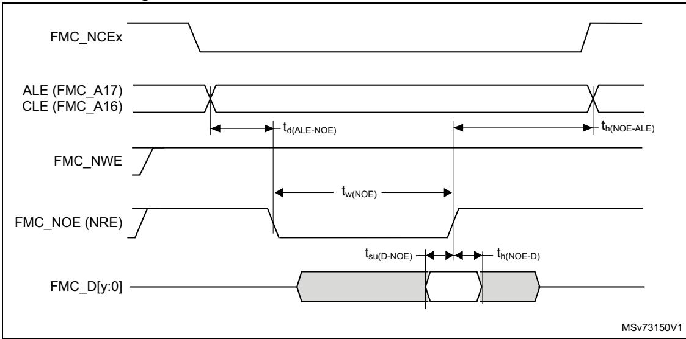

Figure 68. NAND controller waveforms for read access

1. y = 7 or 15 depending on the NAND flash memory interface.

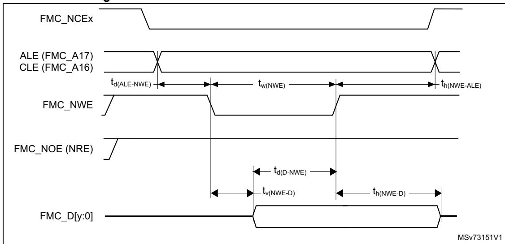

Figure 69. NAND controller waveforms for write access

1. y = 7 or 15 depending on the NAND flash memory interface.

Table 85. Switching characteristics for NAND flash read cycles(1)

<table><tr><td rowspan=1 colspan=1>Symbol</td><td rowspan=1 colspan=1>Parameter</td><td rowspan=1 colspan=1>Min</td><td rowspan=1 colspan=1>Max</td><td rowspan=1 colspan=1>Unit</td></tr><tr><td rowspan=1 colspan=1>tw(NOE)</td><td rowspan=1 colspan=1>FSMC_NOE low width</td><td rowspan=1 colspan=1>4THCLK-0.5</td><td rowspan=1 colspan=1><eq>^ { 4 \top } \mathsf { H C L K } ^ { + 3 }</eq></td><td rowspan=1 colspan=1>ns</td></tr><tr><td rowspan=1 colspan=1>tsu(D-NOE)</td><td rowspan=1 colspan=1>FSMC_D[15-0] valid data before FSMC_NOE high</td><td rowspan=1 colspan=1>10</td><td rowspan=1 colspan=1>一</td><td rowspan=1 colspan=1>ns</td></tr><tr><td rowspan=1 colspan=1>th(NOE-D)</td><td rowspan=1 colspan=1>FSMC_D[15-0] valid data after FSMC_NOE high</td><td rowspan=1 colspan=1>0</td><td rowspan=1 colspan=1>-</td><td rowspan=1 colspan=1>ns</td></tr><tr><td rowspan=1 colspan=1>td(ALE-NOE)</td><td rowspan=1 colspan=1>FSMC_ALE valid before FSMC_NOE low</td><td rowspan=1 colspan=1>1</td><td rowspan=1 colspan=1>3THCLK</td><td rowspan=1 colspan=1>ns</td></tr><tr><td rowspan=1 colspan=1>th(NOE-ALE)</td><td rowspan=1 colspan=1>FSMC_NWE high to FSMC_ALE invalid</td><td rowspan=1 colspan=1>3THCLK-2</td><td rowspan=1 colspan=1>-</td><td rowspan=1 colspan=1>ns</td></tr></table>

1. $\mathsf { C } _ { \mathsf { L } } = 3 0 ~ \mathsf { p F } .$

161/206

DS8626 Rev 12

Electrical characteristics

STM32F405xx, STM32F407xx

Table 86. Switching characteristics for NAND flash write cycles(1)

<table><tr><td rowspan=1 colspan=1>Symbol</td><td rowspan=1 colspan=1>Parameter</td><td rowspan=1 colspan=1>Min</td><td rowspan=1 colspan=1>Max</td><td rowspan=1 colspan=1>Unit</td></tr><tr><td rowspan=1 colspan=1><eq>\mathfrak { t } _ { \mathsf { w } ( \mathsf { N W E } ) }</eq></td><td rowspan=1 colspan=1>FSMC_NWE low width</td><td rowspan=1 colspan=1><eq>4 T _ { \mathsf { H C L K } ^ { - 1 } }</eq></td><td rowspan=1 colspan=1><eq>4 \mathsf { T } _ { \mathsf { H C L K } ^ { + } } 3</eq></td><td rowspan=1 colspan=1>ns</td></tr><tr><td rowspan=1 colspan=1>tv(NWE-D)</td><td rowspan=1 colspan=1>FSMC_NWE low to FSMC_D[15-0] valid</td><td rowspan=1 colspan=1></td><td rowspan=1 colspan=1>0</td><td rowspan=1 colspan=1>ns</td></tr><tr><td rowspan=1 colspan=1>th(NWE-D)</td><td rowspan=1 colspan=1>FSMC_NWE high to FSMC_D[15-0] invalid</td><td rowspan=1 colspan=1><eq>3 \mathsf { T } _ { \mathsf { H C L K } } - 2</eq></td><td rowspan=1 colspan=1>-</td><td rowspan=1 colspan=1>ns</td></tr><tr><td rowspan=1 colspan=1>td(D-NWE)</td><td rowspan=1 colspan=1>FSMC_D[15-0] valid before FSMC_NWE high</td><td rowspan=1 colspan=1><eq>5 \mathsf { T } _ { \mathsf { H C L K } } { - 3 }</eq></td><td rowspan=1 colspan=1>-</td><td rowspan=1 colspan=1>ns</td></tr><tr><td rowspan=1 colspan=1>td(ALE-NWE)</td><td rowspan=1 colspan=1>FSMC_ALE valid before FSMC_NWE low</td><td rowspan=1 colspan=1></td><td rowspan=1 colspan=1><eq>3 T _ { \mathsf { H C L K } }</eq></td><td rowspan=1 colspan=1>ns</td></tr><tr><td rowspan=1 colspan=1>th(NWE-ALE)</td><td rowspan=1 colspan=1>FSMC_NWE high to FSMC_ALE invalid</td><td rowspan=1 colspan=1><eq>3 \mathsf { T } _ { \mathsf { H C L K } ^ { - 2 } }</eq></td><td rowspan=1 colspan=1>一</td><td rowspan=1 colspan=1>ns</td></tr></table>

1. $\mathsf { C } _ { \mathsf { L } } = 3 0 ~ \mathsf { p F } .$

## 6.3.27 Camera interface (DCMI) timing specifications

Unless otherwise specified, the parameters given in Table 87 for DCMI are derived from tests performed under the ambient temperature, $\mathsf { f } _ { \mathsf { H C L K } }$ frequency and $\mathsf { V } _ { \mathsf { D D } }$ supply voltage summarized in Table 13, with the following configuration:

• PCK polarity: falling

• VSYNC and HSYNC polarity: high

Data format: 14 bits

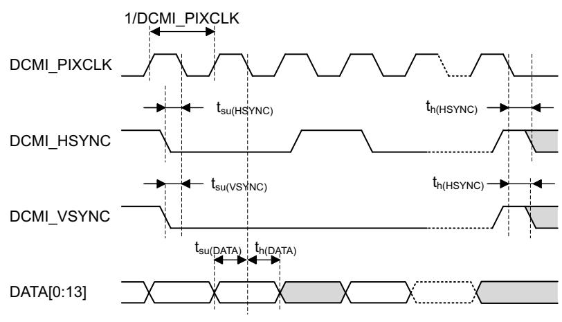

Figure 70. DCMI timing diagram

MS32414V2

Table 87. DCMI characteristics(1)

<table><tr><td colspan="1" rowspan="1">Symbol</td><td colspan="1" rowspan="1">Parameter</td><td colspan="1" rowspan="1">Min</td><td colspan="1" rowspan="1">Max</td><td colspan="1" rowspan="1">Unit</td></tr><tr><td colspan="1" rowspan="1"></td><td colspan="1" rowspan="1">Frequency ratio DCMI_PIXCLK/fHCLK</td><td colspan="1" rowspan="1"></td><td colspan="1" rowspan="1">0.4</td><td colspan="1" rowspan="1"></td></tr><tr><td colspan="1" rowspan="1">DCMI_PIXCLK</td><td colspan="1" rowspan="1">Pixel clock input</td><td colspan="1" rowspan="1"></td><td colspan="1" rowspan="1">54</td><td colspan="1" rowspan="1">MHz</td></tr><tr><td colspan="1" rowspan="1"><eq>\sf D _ { p i x e l }</eq></td><td colspan="1" rowspan="1">Pixel clock input duty cycle</td><td colspan="1" rowspan="1">30</td><td colspan="1" rowspan="1">70</td><td colspan="1" rowspan="1">%</td></tr><tr><td colspan="1" rowspan="1">tsu(DATA)</td><td colspan="1" rowspan="1">Data input setup time</td><td colspan="1" rowspan="1">2.5</td><td colspan="1" rowspan="1"></td><td colspan="1" rowspan="4">ns</td></tr><tr><td colspan="1" rowspan="1">th(DATA)</td><td colspan="1" rowspan="1">Data hold time</td><td colspan="1" rowspan="1">1</td><td colspan="1" rowspan="1"></td></tr><tr><td colspan="1" rowspan="1">tsu(HSYNC),tsu(VSYNC)</td><td colspan="1" rowspan="1">HSYNC/VSYNC input setup time</td><td colspan="1" rowspan="1">2</td><td colspan="1" rowspan="1"></td></tr><tr><td colspan="1" rowspan="1">th(HSYNC),th(VSYNC)</td><td colspan="1" rowspan="1">HSYNC/VSYNC input hold time</td><td colspan="1" rowspan="1">0.5</td><td colspan="1" rowspan="1"></td></tr></table>

162/206

DS8626 Rev 12

STM32F405xx, STM32F407xx

Electrical characteristics

1. Evaluated by characterization - not tested in production.

## 6.3.28 SD/SDIO MMC card host interface (SDIO) characteristics

Unless otherwise specified, the parameters given in Table 88 are derived from tests performed under ambient temperature, f frequency and $\mathsf { V } _ { \mathsf { D D } }$ supply voltage conditions summarized in Table 14 with the following configuration:

• Output speed is set to OSPEEDRy[1:0] = 10

• Capacitive load C = 30 pF

Measurement points are done at CMOS levels: $0 . 5 \mathsf { V } _ { \mathsf { D } \mathsf { D } }$

Refer to Section 6.3.16: I/O port characteristics for more details on the input/output characteristics.

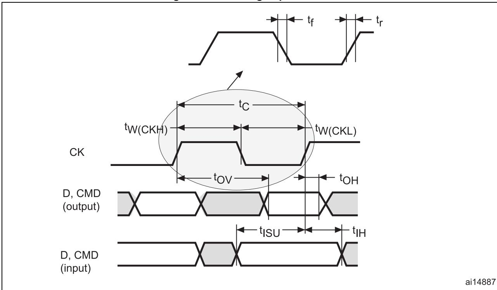

Figure 71. SDIO high-speed mode

163/206

DS8626 Rev 12

Electrical characteristics

STM32F405xx, STM32F407xx

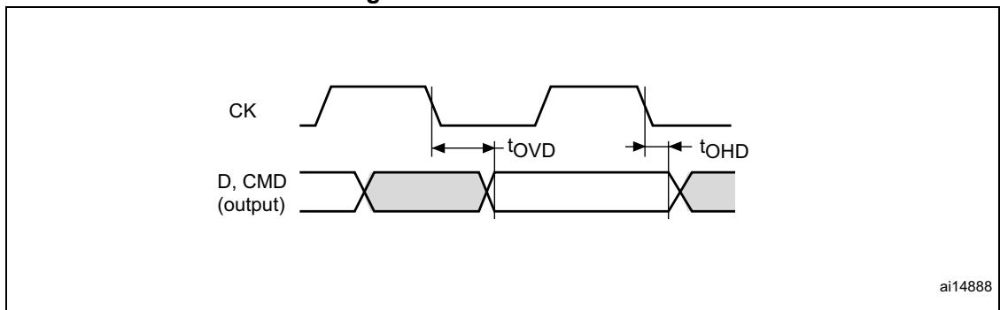

Figure 72. SD default mode

Table 88. Dynamic characteristics: SD/MMC characteristics(1)

<table><tr><td rowspan=1 colspan=1>Symbol</td><td rowspan=1 colspan=1>Parameter</td><td rowspan=1 colspan=1>Conditions</td><td rowspan=1 colspan=1>Min</td><td rowspan=1 colspan=1>Typ</td><td rowspan=1 colspan=1>Max</td><td rowspan=1 colspan=1>Unit</td></tr><tr><td rowspan=1 colspan=1>fpp</td><td rowspan=1 colspan=1>Clock frequency in data transfer mode</td><td rowspan=1 colspan=1></td><td rowspan=1 colspan=1>0</td><td rowspan=1 colspan=1></td><td rowspan=1 colspan=1>48</td><td rowspan=1 colspan=1>MHz</td></tr><tr><td rowspan=1 colspan=1></td><td rowspan=1 colspan=1>SDIO_CK/fpCLK2 frequency ratio</td><td rowspan=1 colspan=1></td><td rowspan=1 colspan=1>-</td><td rowspan=1 colspan=1>-</td><td rowspan=1 colspan=1>8/3</td><td rowspan=1 colspan=1>=</td></tr><tr><td rowspan=1 colspan=1>tw(CKL)</td><td rowspan=1 colspan=1>Clock low time</td><td rowspan=1 colspan=1>fpp = 48 MHz</td><td rowspan=1 colspan=1>8.5</td><td rowspan=1 colspan=1>9</td><td rowspan=1 colspan=1>-</td><td rowspan=2 colspan=1>ns</td></tr><tr><td rowspan=1 colspan=1>tW(CKH)</td><td rowspan=1 colspan=1>Clock high time</td><td rowspan=1 colspan=1>fpp = 48 MHz</td><td rowspan=1 colspan=1>8.3</td><td rowspan=1 colspan=1>10</td><td rowspan=1 colspan=1>-</td></tr><tr><td rowspan=1 colspan=7>CMD, D inputs (referenced to CK) in MMC and SD HS mode</td></tr><tr><td rowspan=1 colspan=1>tisu</td><td rowspan=1 colspan=1>Input setup time HS</td><td rowspan=1 colspan=1>fpp = 48 MHz</td><td rowspan=1 colspan=1>3</td><td rowspan=1 colspan=1>-</td><td rowspan=1 colspan=1>-</td><td rowspan=2 colspan=1>ns</td></tr><tr><td rowspan=1 colspan=1>tH</td><td rowspan=1 colspan=1>Input hold time HS</td><td rowspan=1 colspan=1>fpp = 48 MHz</td><td rowspan=1 colspan=1>0</td><td rowspan=1 colspan=1>–</td><td rowspan=1 colspan=1>-</td></tr><tr><td rowspan=1 colspan=7>CMD, D outputs (referenced to CK) in MMC and SD HS mode</td></tr><tr><td rowspan=1 colspan=1>tov</td><td rowspan=1 colspan=1>Output valid time HS</td><td rowspan=1 colspan=1>fpp = 48 MHz</td><td rowspan=1 colspan=1>–</td><td rowspan=1 colspan=1>4.5</td><td rowspan=1 colspan=1>6</td><td rowspan=2 colspan=1>ns</td></tr><tr><td rowspan=1 colspan=1>tOH</td><td rowspan=1 colspan=1>Output hold time HS</td><td rowspan=1 colspan=1>fpp = 48 MHz</td><td rowspan=1 colspan=1>1</td><td rowspan=1 colspan=1>-</td><td rowspan=1 colspan=1>-</td></tr><tr><td rowspan=1 colspan=7>CMD, D inputs (referenced to CK) in SD default mode</td></tr><tr><td rowspan=1 colspan=1>tISUD</td><td rowspan=1 colspan=1>Input setup time SD</td><td rowspan=1 colspan=1>fpp = 24 MHz</td><td rowspan=1 colspan=1>1.5</td><td rowspan=1 colspan=1></td><td rowspan=1 colspan=1>1</td><td rowspan=2 colspan=1>ns</td></tr><tr><td rowspan=1 colspan=1>tIHD</td><td rowspan=1 colspan=1>Input hold time SD</td><td rowspan=1 colspan=1>fpp = 24 MHz</td><td rowspan=1 colspan=1>0.5</td><td rowspan=1 colspan=1>-</td><td rowspan=1 colspan=1>-</td></tr><tr><td rowspan=1 colspan=7>CMD, D outputs (referenced to CK) in SD default mode</td></tr><tr><td rowspan=1 colspan=1>tovD</td><td rowspan=1 colspan=1>Output valid default time SD</td><td rowspan=1 colspan=1>fpp = 24 MHz</td><td rowspan=1 colspan=1>-</td><td rowspan=1 colspan=1>4.5</td><td rowspan=1 colspan=1>7</td><td rowspan=2 colspan=1>ns</td></tr><tr><td rowspan=1 colspan=1>tOHD</td><td rowspan=1 colspan=1>Output hold default time SD</td><td rowspan=1 colspan=1>fpp = 24 MHz</td><td rowspan=1 colspan=1>0.5</td><td rowspan=1 colspan=1>-</td><td rowspan=1 colspan=1>-</td></tr></table>

1. Evaluated by characterization - not tested in production.

## 6.3.29 RTC characteristics

Table 89. RTC characteristics

<table><tr><td rowspan=1 colspan=1>Symbol</td><td rowspan=1 colspan=1>Parameter</td><td rowspan=1 colspan=1>Conditions</td><td rowspan=1 colspan=1>Min</td><td rowspan=1 colspan=1>Max</td></tr><tr><td rowspan=1 colspan=1></td><td rowspan=1 colspan=1>fpCLK1/RTCCLK frequency ratio</td><td rowspan=1 colspan=1>Any read/write operationfrom/to an RTC register</td><td rowspan=1 colspan=1>4</td><td rowspan=1 colspan=1></td></tr></table>

164/206

DS8626 Rev 12

STM32F405xx, STM32F407xx

Package information

## Package information

In order to meet environmental requirements, ST offers these devices in different grades of ECOPACK packages, depending on their level of environmental compliance. ECOPACK specifications, grade definitions and product status are available at: www.st.com. ECOPACK is an ST trademark.

## 7.1 Device marking

Refer to technical note “Reference device marking schematics for STM32 microcontrollers and microprocessors” (TN1433), available on www.st.com, for the location of pin 1 / ball A1 as well as the location and orientation of the marking areas versus pin 1 / ball A1.

Parts marked as “ES”, “E”, or accompanied by an engineering sample notification letter, are not yet qualified and therefore not approved for use in production. ST is not responsible for any consequences resulting from such use. In no event will ST be liable for the customer using any of these engineering samples in production. ST’s Quality department must be contacted prior to any decision to use these engineering samples to run a qualification activity.

A WLCSP simplified marking example (if any) is provided in the corresponding package information subsection.

165/206

DS8626 Rev 12

Package information

STM32F405xx, STM32F407xx

## 7.2 WLCSP90 package information

Figure 73. WLCSP90 - 4.223 x 3.969 mm, 0.400 mm pitch wafer level chip scale package outline

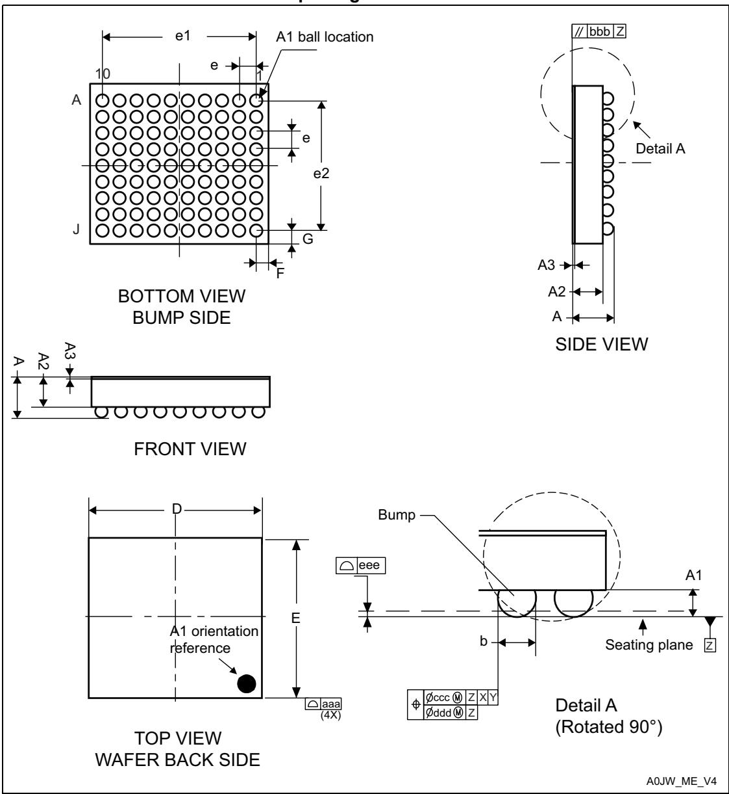

1. Drawing is not to scale.

166/206

DS8626 Rev 12

STM32F405xx, STM32F407xx

Package information

Table 90. WLCSP90 - 4.223 x 3.969 mm, 0.400 mm pitch wafer level chip scale package mechanical data

<table><tr><td rowspan=2 colspan=1>Symbol</td><td rowspan=1 colspan=3>millimeters</td><td rowspan=1 colspan=3>inches(1)</td></tr><tr><td rowspan=1 colspan=1>Min</td><td rowspan=1 colspan=1>Typ</td><td rowspan=1 colspan=1>Max</td><td rowspan=1 colspan=1>Min</td><td rowspan=1 colspan=1>Typ</td><td rowspan=1 colspan=1>Max</td></tr><tr><td rowspan=1 colspan=1>A</td><td rowspan=1 colspan=1>0.540</td><td rowspan=1 colspan=1>0.570</td><td rowspan=1 colspan=1>0.600</td><td rowspan=1 colspan=1>0.0213</td><td rowspan=1 colspan=1>0.0224</td><td rowspan=1 colspan=1>0.0236</td></tr><tr><td rowspan=1 colspan=1>A1</td><td rowspan=1 colspan=1>-</td><td rowspan=1 colspan=1>0.190</td><td rowspan=1 colspan=1>1</td><td rowspan=1 colspan=1>1</td><td rowspan=1 colspan=1>0.0075</td><td rowspan=1 colspan=1>1</td></tr><tr><td rowspan=1 colspan=1>A2</td><td rowspan=1 colspan=1>1</td><td rowspan=1 colspan=1>0.380</td><td rowspan=1 colspan=1>1</td><td rowspan=1 colspan=1>1</td><td rowspan=1 colspan=1>0.0150</td><td rowspan=1 colspan=1>1</td></tr><tr><td rowspan=1 colspan=1>A3(2)</td><td rowspan=1 colspan=1>-</td><td rowspan=1 colspan=1>0.025</td><td rowspan=1 colspan=1>-</td><td rowspan=1 colspan=1>1</td><td rowspan=1 colspan=1>0.0010</td><td rowspan=1 colspan=1>1</td></tr><tr><td rowspan=1 colspan=1>b(3)</td><td rowspan=1 colspan=1>0.240</td><td rowspan=1 colspan=1>0.270</td><td rowspan=1 colspan=1>0.300</td><td rowspan=1 colspan=1>0.0094</td><td rowspan=1 colspan=1>0.0106</td><td rowspan=1 colspan=1>0.0118</td></tr><tr><td rowspan=1 colspan=1>D</td><td rowspan=1 colspan=1>4.188</td><td rowspan=1 colspan=1>4.223</td><td rowspan=1 colspan=1>4.258</td><td rowspan=1 colspan=1>0.1649</td><td rowspan=1 colspan=1>0.1663</td><td rowspan=1 colspan=1>0.1676</td></tr><tr><td rowspan=1 colspan=1>E</td><td rowspan=1 colspan=1>3.934</td><td rowspan=1 colspan=1>3.969</td><td rowspan=1 colspan=1>4.004</td><td rowspan=1 colspan=1>0.1549</td><td rowspan=1 colspan=1>0.1563</td><td rowspan=1 colspan=1>0.1576</td></tr><tr><td rowspan=1 colspan=1>e</td><td rowspan=1 colspan=1>1</td><td rowspan=1 colspan=1>0.400</td><td rowspan=1 colspan=1>1</td><td rowspan=1 colspan=1>1</td><td rowspan=1 colspan=1>0.0157</td><td rowspan=1 colspan=1>1</td></tr><tr><td rowspan=1 colspan=1>e1</td><td rowspan=1 colspan=1>1</td><td rowspan=1 colspan=1>3.600</td><td rowspan=1 colspan=1>1</td><td rowspan=1 colspan=1>1</td><td rowspan=1 colspan=1>0.1417</td><td rowspan=1 colspan=1>1</td></tr><tr><td rowspan=1 colspan=1>e2</td><td rowspan=1 colspan=1>1</td><td rowspan=1 colspan=1>3.200</td><td rowspan=1 colspan=1>1</td><td rowspan=1 colspan=1>1</td><td rowspan=1 colspan=1>0.1260</td><td rowspan=1 colspan=1>1</td></tr><tr><td rowspan=1 colspan=1>F</td><td rowspan=1 colspan=1>1</td><td rowspan=1 colspan=1>0.3115</td><td rowspan=1 colspan=1>1</td><td rowspan=1 colspan=1>1</td><td rowspan=1 colspan=1>0.0123</td><td rowspan=1 colspan=1>1</td></tr><tr><td rowspan=1 colspan=1>G</td><td rowspan=1 colspan=1>1</td><td rowspan=1 colspan=1>0.3845</td><td rowspan=1 colspan=1>1</td><td rowspan=1 colspan=1>1</td><td rowspan=1 colspan=1>0.0151</td><td rowspan=1 colspan=1>1</td></tr><tr><td rowspan=1 colspan=1>aaa</td><td rowspan=1 colspan=1></td><td rowspan=1 colspan=1>0.100</td><td rowspan=1 colspan=1></td><td rowspan=1 colspan=1></td><td rowspan=1 colspan=1>0.0039</td><td rowspan=1 colspan=1>1</td></tr><tr><td rowspan=1 colspan=1>bbb</td><td rowspan=1 colspan=1></td><td rowspan=1 colspan=1>0.100</td><td rowspan=1 colspan=1>1</td><td rowspan=1 colspan=1>1</td><td rowspan=1 colspan=1>0.0039</td><td rowspan=1 colspan=1>1</td></tr><tr><td rowspan=1 colspan=1>CCC</td><td rowspan=1 colspan=1></td><td rowspan=1 colspan=1>0.100</td><td rowspan=1 colspan=1>1</td><td rowspan=1 colspan=1>1</td><td rowspan=1 colspan=1>0.0039</td><td rowspan=1 colspan=1>1</td></tr><tr><td rowspan=1 colspan=1>ddd</td><td rowspan=1 colspan=1>1</td><td rowspan=1 colspan=1>0.050</td><td rowspan=1 colspan=1>1</td><td rowspan=1 colspan=1>1</td><td rowspan=1 colspan=1>0.0020</td><td rowspan=1 colspan=1>1</td></tr><tr><td rowspan=1 colspan=1>eee</td><td rowspan=1 colspan=1>-</td><td rowspan=1 colspan=1>0.050</td><td rowspan=1 colspan=1>-</td><td rowspan=1 colspan=1>1</td><td rowspan=1 colspan=1>0.0020</td><td rowspan=1 colspan=1>-</td></tr></table>

1. Values in inches are converted from mm and rounded to 4 decimal digits.

2. Back side coating.

3. Dimension is measured at the maximum bump diameter parallel to primary datum Z.

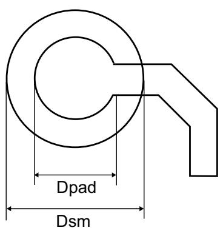

Figure 74. WLCSP90 - 4.223 x 3.969 mm, 0.400 mm pitch wafer level chip scale package recommended footprint

167/206

S

DS8626 Rev 12

Package information

STM32F405xx, STM32F407xx

Table 91. WLCSP90 recommended PCB design rules

<table><tr><td rowspan=1 colspan=1>Dimension</td><td rowspan=1 colspan=1>Recommended values</td></tr><tr><td rowspan=1 colspan=1>Pitch</td><td rowspan=1 colspan=1>0.4 mm</td></tr><tr><td rowspan=1 colspan=1>Dpad</td><td rowspan=1 colspan=1>260 μm max. (circular)220 μm recommended</td></tr><tr><td rowspan=1 colspan=1>Dsm</td><td rowspan=1 colspan=1>300 μm min. (for 260 μm diameter pad)</td></tr><tr><td rowspan=1 colspan=1>PCB pad design</td><td rowspan=1 colspan=1>Non-solder mask defined via underbump allowed</td></tr></table>

## Device marking for WLCSP90

The following figure gives an example of topside marking and ball A1 position identifier location.

The printed markings may differ depending on the supply chain.

Other optional marking or inset/upset marks, which depend on supply chain operations, are not indicated below.

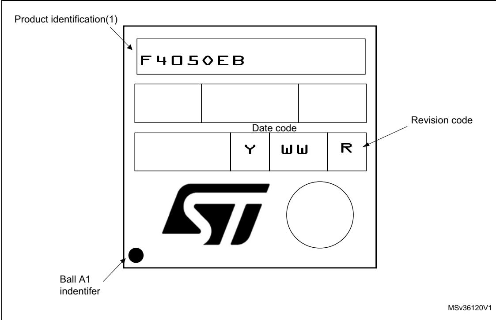

Figure 75. WLCSP90 marking example (package top view)

1. Parts marked as “ES”, “E” or accompanied by an Engineering Sample notification letter, are not yet qualified and therefore not yet ready to be used in production and any consequences deriving from such usage will not be at ST charge. In no event, ST will be liable for any customer usage of these engineering samples in production. ST Quality has to be contacted prior to any decision to use these Engineering Samples to run qualification activity.

168/206

DS8626 Rev 12

STM32F405xx, STM32F407xx

Package information

## LQFP64 package information (5W)

This LQFP is 64-pin, 10 x 10 mm low-profile quad flat package.

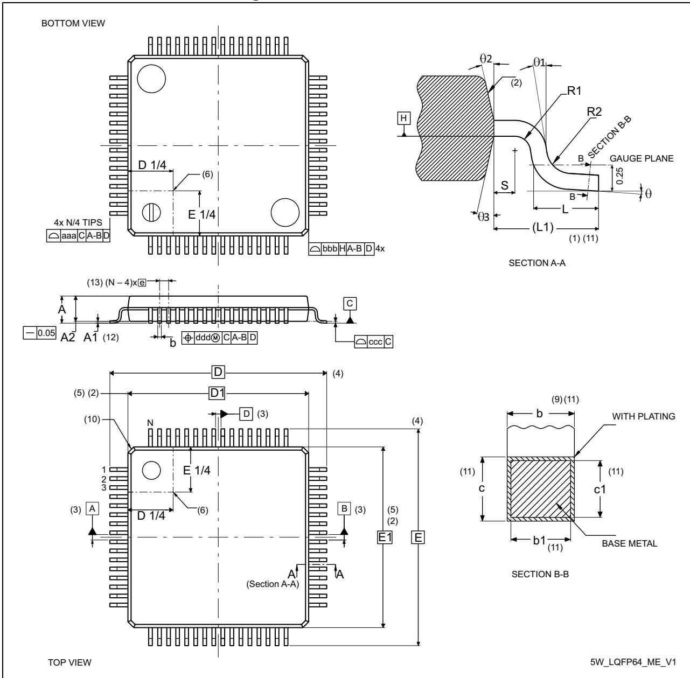

Figure 76. LQFP64 - Outline(15)

169/206

DS8626 Rev 12

Package information

STM32F405xx, STM32F407xx

Table 92. LQFP64 - Mechanical data

<table><tr><td rowspan=2 colspan=1>Symbol</td><td rowspan=1 colspan=3>millimeters</td><td rowspan=1 colspan=3>inches(14)</td></tr><tr><td rowspan=1 colspan=1>Min</td><td rowspan=1 colspan=1>Typ</td><td rowspan=1 colspan=1>Max</td><td rowspan=1 colspan=1>Min</td><td rowspan=1 colspan=1>Typ</td><td rowspan=1 colspan=1>Max</td></tr><tr><td rowspan=1 colspan=1>A</td><td rowspan=1 colspan=1>-</td><td rowspan=1 colspan=1>1</td><td rowspan=1 colspan=1>1.60</td><td rowspan=1 colspan=1>1</td><td rowspan=1 colspan=1>1</td><td rowspan=1 colspan=1>0.0630</td></tr><tr><td rowspan=1 colspan=1><eq>\overline { { { \sf A } 1 ^ { ( 1 2 ) } } }</eq></td><td rowspan=1 colspan=1>0.05</td><td rowspan=1 colspan=1>1</td><td rowspan=1 colspan=1>0.15</td><td rowspan=1 colspan=1>0.0020</td><td rowspan=1 colspan=1>1</td><td rowspan=1 colspan=1>0.0059</td></tr><tr><td rowspan=1 colspan=1>A2</td><td rowspan=1 colspan=1>1.35</td><td rowspan=1 colspan=1>1.40</td><td rowspan=1 colspan=1>1.45</td><td rowspan=1 colspan=1>0.0531</td><td rowspan=1 colspan=1>0.0551</td><td rowspan=1 colspan=1>0.0570</td></tr><tr><td rowspan=1 colspan=1><eq>\overline { { { \sf b } ^ { ( 9 ) ( 1 1 ) } } }</eq></td><td rowspan=1 colspan=1>0.17</td><td rowspan=1 colspan=1>0.22</td><td rowspan=1 colspan=1>0.27</td><td rowspan=1 colspan=1>0.0067</td><td rowspan=1 colspan=1>0.0087</td><td rowspan=1 colspan=1>0.0106</td></tr><tr><td rowspan=1 colspan=1><eq>\overline { { { \bf b } \ o 1 ^ { ( 1 1 ) } } }</eq></td><td rowspan=1 colspan=1>0.17</td><td rowspan=1 colspan=1>0.20</td><td rowspan=1 colspan=1>0.23</td><td rowspan=1 colspan=1>0.0067</td><td rowspan=1 colspan=1>0.0079</td><td rowspan=1 colspan=1>0.0091</td></tr><tr><td rowspan=1 colspan=1><eq>\overline { { \mathsf { c } ^ { ( 1 1 ) } } }</eq></td><td rowspan=1 colspan=1>0.09</td><td rowspan=1 colspan=1>1</td><td rowspan=1 colspan=1>0.20</td><td rowspan=1 colspan=1>0.0035</td><td rowspan=1 colspan=1>1</td><td rowspan=1 colspan=1>0.0079</td></tr><tr><td rowspan=1 colspan=1><eq>\overline { { \mathsf { c } 1 ^ { ( 1 1 ) } } }</eq></td><td rowspan=1 colspan=1>0.09</td><td rowspan=1 colspan=1>-</td><td rowspan=1 colspan=1>0.16</td><td rowspan=1 colspan=1>0.0035</td><td rowspan=1 colspan=1>-</td><td rowspan=1 colspan=1>0.0063</td></tr><tr><td rowspan=1 colspan=1><eq>\overline { { \mathsf { D } ^ { ( 4 ) } } }</eq></td><td rowspan=1 colspan=3>12.00 BSC</td><td rowspan=1 colspan=3>0.4724 BSC</td></tr><tr><td rowspan=1 colspan=1>D1(2)(5)</td><td rowspan=1 colspan=3>10.00 BSC</td><td rowspan=1 colspan=1></td><td rowspan=1 colspan=1>0.3937 BSC</td><td rowspan=1 colspan=1></td></tr><tr><td rowspan=1 colspan=1><eq>\overline { { \mathsf { E } ^ { ( 4 ) } } }</eq></td><td rowspan=1 colspan=3>12.00 BSC</td><td rowspan=1 colspan=3>0.4724 BSC</td></tr><tr><td rowspan=1 colspan=1>E1(2)(5)</td><td rowspan=1 colspan=3>10.00 BSC</td><td rowspan=1 colspan=3>0.3937 BSC</td></tr><tr><td rowspan=1 colspan=1>e</td><td rowspan=1 colspan=3>0.50 BSC</td><td rowspan=1 colspan=3>0.1970 BSC</td></tr><tr><td rowspan=1 colspan=1>L</td><td rowspan=1 colspan=1>0.45</td><td rowspan=1 colspan=1>0.60</td><td rowspan=1 colspan=1>0.75</td><td rowspan=1 colspan=1>0.0177</td><td rowspan=1 colspan=1>0.0236</td><td rowspan=1 colspan=1>0.0295</td></tr><tr><td rowspan=1 colspan=1>L1</td><td rowspan=1 colspan=3>1.00 REF</td><td rowspan=1 colspan=3>0.0394 REF</td></tr><tr><td rowspan=1 colspan=1><eq>\overline { { { \sf N } ^ { ( 1 3 ) } } }</eq></td><td rowspan=1 colspan=6>64</td></tr><tr><td rowspan=1 colspan=1>θ</td><td rowspan=1 colspan=1><eq>0 ^ { \circ }</eq></td><td rowspan=1 colspan=1><eq>3 . 5 ^ { \circ }</eq></td><td rowspan=1 colspan=1><eq>\overline { { 7 ^ { \circ } } }</eq></td><td rowspan=1 colspan=1><eq>0 ^ { \circ }</eq></td><td rowspan=1 colspan=1>3.5°</td><td rowspan=1 colspan=1><eq>7 ^ { \circ }</eq></td></tr><tr><td rowspan=1 colspan=1>θ1</td><td rowspan=1 colspan=1><eq>0 ^ { \circ }</eq></td><td rowspan=1 colspan=1></td><td rowspan=1 colspan=1>1</td><td rowspan=1 colspan=1><eq>0 ^ { \circ }</eq></td><td rowspan=1 colspan=1>-</td><td rowspan=1 colspan=1></td></tr><tr><td rowspan=1 colspan=1>02</td><td rowspan=1 colspan=1><eq>1 0 ^ { \circ }</eq></td><td rowspan=1 colspan=1><eq>12 ^ { \circ }</eq></td><td rowspan=1 colspan=1><eq>1 4 ^ { \circ }</eq></td><td rowspan=1 colspan=1><eq>1 0 ^ { \circ }</eq></td><td rowspan=1 colspan=1><eq>12 ^ { \circ }</eq></td><td rowspan=1 colspan=1><eq>1 4 ^ { \circ }</eq></td></tr><tr><td rowspan=1 colspan=1>03</td><td rowspan=1 colspan=1><eq>1 0 ^ { \circ }</eq></td><td rowspan=1 colspan=1><eq>12 ^ { \circ }</eq></td><td rowspan=1 colspan=1><eq>1 4 ^ { \circ }</eq></td><td rowspan=1 colspan=1><eq>\overline { { 1 0 ^ { \circ } } }</eq></td><td rowspan=1 colspan=1><eq>12 ^ { \circ }</eq></td><td rowspan=1 colspan=1><eq>\overline { { 1 4 ^ { \circ } } }</eq></td></tr><tr><td rowspan=1 colspan=1>R1</td><td rowspan=1 colspan=1>0.08</td><td rowspan=1 colspan=1>1</td><td rowspan=1 colspan=1>1</td><td rowspan=1 colspan=1>0.0031</td><td rowspan=1 colspan=1>1</td><td rowspan=1 colspan=1>1</td></tr><tr><td rowspan=1 colspan=1>R2</td><td rowspan=1 colspan=1>0.08</td><td rowspan=1 colspan=1>1</td><td rowspan=1 colspan=1>0.20</td><td rowspan=1 colspan=1>0.0031</td><td rowspan=1 colspan=1>1</td><td rowspan=1 colspan=1>0.0079</td></tr><tr><td rowspan=1 colspan=1>S</td><td rowspan=1 colspan=1>0.20</td><td rowspan=1 colspan=1>I</td><td rowspan=1 colspan=1>1</td><td rowspan=1 colspan=1>0.0079</td><td rowspan=1 colspan=1>1</td><td rowspan=1 colspan=1></td></tr><tr><td rowspan=1 colspan=1><eq>\overline { { \mathsf { a a a } \mathsf { a } ^ { ( 1 ) } } }</eq></td><td rowspan=1 colspan=3>0.20</td><td rowspan=1 colspan=3>0.0079</td></tr><tr><td rowspan=1 colspan=1><eq>\overline { { \mathsf { b b b } ^ { ( 1 ) } } }</eq></td><td rowspan=1 colspan=3>0.20</td><td rowspan=1 colspan=3>0.0079</td></tr><tr><td rowspan=1 colspan=1><eq>\overline { { \mathsf { c c c } ^ { ( 1 ) } } }</eq></td><td rowspan=1 colspan=3>0.08</td><td rowspan=1 colspan=3>0.0031</td></tr><tr><td rowspan=1 colspan=1><eq>\overline { { \mathsf { d o d d } ^ { ( 1 ) } } }</eq></td><td rowspan=1 colspan=3>0.08</td><td rowspan=1 colspan=3>0.0031</td></tr></table>

170/206

DS8626 Rev 12

STM32F405xx, STM32F407xx

Package information

## Notes:

1. Dimensioning and tolerancing schemes conform to ASME Y14.5M-1994.

2. The Top package body size may be smaller than the bottom package size by as much as 0.15 mm.

3. Datums A-B and D to be determined at datum plane H.

4. To be determined at seating datum plane C.

5. Dimensions D1 and E1 do not include mold flash or protrusions. Allowable mold flash or protrusions is “0.25 mm” per side. D1 and E1 are Maximum plastic body size dimensions including mold mismatch.

6. Details of pin 1 identifier are optional but must be located within the zone indicated.

7. All Dimensions are in millimeters.

8. No intrusion allowed inwards the leads.

9. Dimension “b” does not include dambar protrusion. Allowable dambar protrusion shall not cause the lead width to exceed the maximum “b” dimension by more than 0.08 mm. Dambar cannot be located on the lower radius or the foot. Minimum space between protrusion and an adjacent lead is 0.07 mm for 0.4 mm and 0.5 mm pitch packages.

10. Exact shape of each corner is optional.

11. These dimensions apply to the flat section of the lead between 0.10 mm and 0.25 mm from the lead tip.

12. A1 is defined as the distance from the seating plane to the lowest point on the package body.

13. “N” is the number of terminal positions for the specified body size.

14. Values in inches are converted from mm and rounded to 4 decimal digits.

15. Drawing is not to scale.

171/206

DS8626 Rev 12

Package information

STM32F405xx, STM32F407xx

## 7.4 LQFP100 package information (1L)

This LQFP is a 100-pin, 14 x 14 mm low-profile quad flat package.

Note: See list of notes in the notes section.

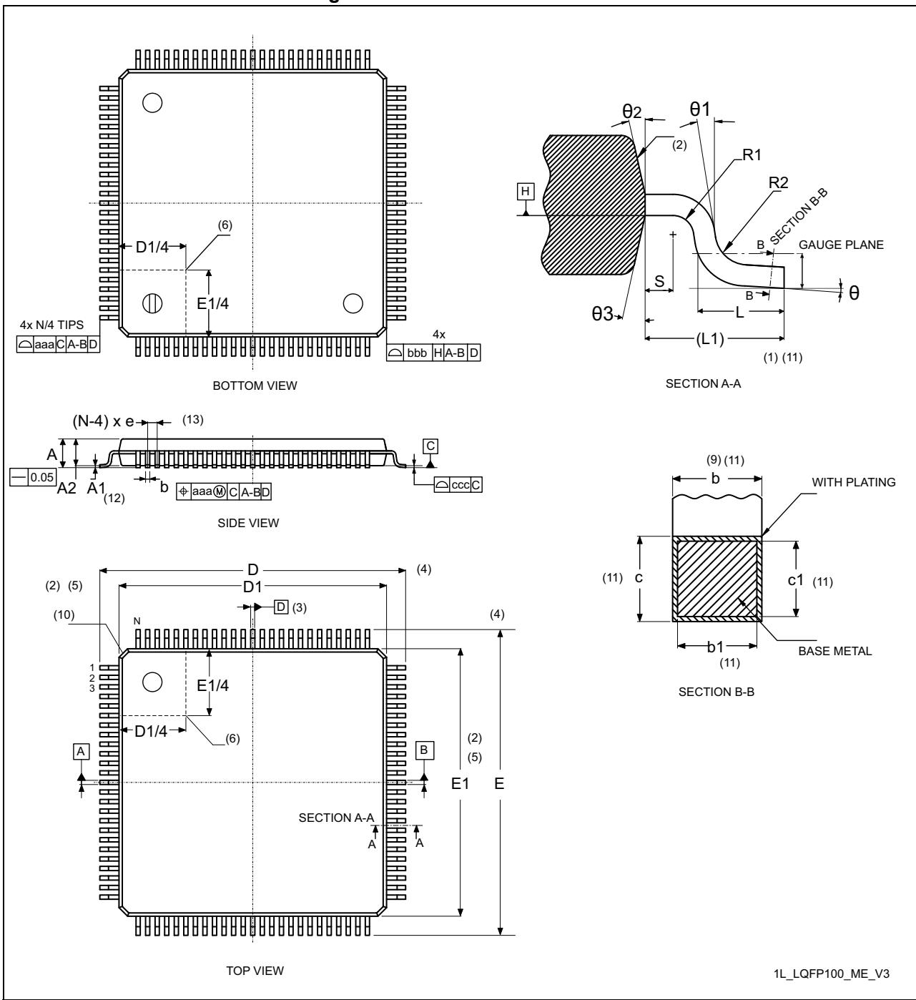

Figure 77. LQFP100 - Outline(15)

172/206

DS8626 Rev 12

STM32F405xx, STM32F407xx

Package information

Table 93. LQFP100 - Mechanical data

<table><tr><td rowspan=2 colspan=1>Symbol</td><td rowspan=1 colspan=3>millimeters</td><td rowspan=1 colspan=3>inches(14)</td></tr><tr><td rowspan=1 colspan=1>Min</td><td rowspan=1 colspan=1><eq>\mathtt { T y p }</eq></td><td rowspan=1 colspan=1>Max</td><td rowspan=1 colspan=1>Min</td><td rowspan=1 colspan=1>Typ</td><td rowspan=1 colspan=1>Max</td></tr><tr><td rowspan=1 colspan=1>A</td><td rowspan=1 colspan=1>1</td><td rowspan=1 colspan=1>1.50</td><td rowspan=1 colspan=1>1.60</td><td rowspan=1 colspan=1>1</td><td rowspan=1 colspan=1>0.0590</td><td rowspan=1 colspan=1>0.0630</td></tr><tr><td rowspan=1 colspan=1><eq>\overline { { { \mathsf { A } } 1 ^ { ( 1 2 ) } } }</eq></td><td rowspan=1 colspan=1>0.05</td><td rowspan=1 colspan=1>-</td><td rowspan=1 colspan=1>0.15</td><td rowspan=1 colspan=1>0.0019</td><td rowspan=1 colspan=1>1</td><td rowspan=1 colspan=1>0.0059</td></tr><tr><td rowspan=1 colspan=1>A2</td><td rowspan=1 colspan=1>1.35</td><td rowspan=1 colspan=1>1.40</td><td rowspan=1 colspan=1>1.45</td><td rowspan=1 colspan=1>0.0531</td><td rowspan=1 colspan=1>0.0551</td><td rowspan=1 colspan=1>0.0570</td></tr><tr><td rowspan=1 colspan=1><eq>\overline { { { \sf b } ^ { ( 9 ) ( 1 1 ) } } }</eq></td><td rowspan=1 colspan=1>0.17</td><td rowspan=1 colspan=1>0.22</td><td rowspan=1 colspan=1>0.27</td><td rowspan=1 colspan=1>0.0067</td><td rowspan=1 colspan=1>0.0087</td><td rowspan=1 colspan=1>0.0106</td></tr><tr><td rowspan=1 colspan=1><eq>\overline { { { \sf b } \ o 1 ^ { ( 1 1 ) } } }</eq></td><td rowspan=1 colspan=1>0.17</td><td rowspan=1 colspan=1>0.20</td><td rowspan=1 colspan=1>0.23</td><td rowspan=1 colspan=1>0.0067</td><td rowspan=1 colspan=1>0.0079</td><td rowspan=1 colspan=1>0.0090</td></tr><tr><td rowspan=1 colspan=1><eq>\overline { { \mathsf { c } ^ { ( 1 1 ) } } }</eq></td><td rowspan=1 colspan=1>0.09</td><td rowspan=1 colspan=1>1</td><td rowspan=1 colspan=1>0.20</td><td rowspan=1 colspan=1>0.0035</td><td rowspan=1 colspan=1>1</td><td rowspan=1 colspan=1>0.0079</td></tr><tr><td rowspan=1 colspan=1><eq>\overline { { \mathsf { c } 1 ^ { ( 1 1 ) } } }</eq></td><td rowspan=1 colspan=1>0.09</td><td rowspan=1 colspan=1>-</td><td rowspan=1 colspan=1>0.16</td><td rowspan=1 colspan=1>0.0035</td><td rowspan=1 colspan=1>-</td><td rowspan=1 colspan=1>0.0063</td></tr><tr><td rowspan=1 colspan=1><eq>\mathsf { D } ^ { ( 4 ) }</eq></td><td rowspan=1 colspan=3>16.00 BSC</td><td rowspan=1 colspan=3>0.6299 BSC</td></tr><tr><td rowspan=1 colspan=1><eq>\mathsf { D } \mathsf { 1 } ^ { ( 2 ) ( 5 ) }</eq></td><td rowspan=1 colspan=3>14.00 BSC</td><td rowspan=1 colspan=1></td><td rowspan=1 colspan=2>0.5512 BSC</td></tr><tr><td rowspan=1 colspan=1><eq>\mathsf { E } ^ { ( 4 ) }</eq></td><td rowspan=1 colspan=3>16.00 BSC</td><td rowspan=1 colspan=1></td><td rowspan=1 colspan=2>0.6299 BSC</td></tr><tr><td rowspan=1 colspan=1><eq>\mathsf { E } \mathsf { 1 } ^ { ( 2 ) ( 5 ) }</eq></td><td rowspan=1 colspan=3>14.00 BSC</td><td rowspan=1 colspan=3>0.5512 BSC</td></tr><tr><td rowspan=1 colspan=1>e</td><td rowspan=1 colspan=3>0.50 BSC</td><td rowspan=1 colspan=3>0.0197 BSC</td></tr><tr><td rowspan=1 colspan=1>L</td><td rowspan=1 colspan=1>0.45</td><td rowspan=1 colspan=1>0.60</td><td rowspan=1 colspan=1>0.75</td><td rowspan=1 colspan=1>0.177</td><td rowspan=1 colspan=1>0.0236</td><td rowspan=1 colspan=1>0.0295</td></tr><tr><td rowspan=1 colspan=1><eq>\overline { { \mathsf { L } 1 ^ { ( 1 ) ( 1 1 ) } } }</eq></td><td rowspan=1 colspan=3>1.00</td><td rowspan=1 colspan=1>1</td><td rowspan=1 colspan=1>0.0394</td><td rowspan=1 colspan=1>1</td></tr><tr><td rowspan=1 colspan=1><eq>\overline { { { \mathsf { N } } ^ { ( 1 3 ) } } }</eq></td><td rowspan=1 colspan=6>100</td></tr><tr><td rowspan=1 colspan=1>θ</td><td rowspan=1 colspan=1><eq>0 ^ { \circ }</eq></td><td rowspan=1 colspan=1><eq>3 . 5 ^ { \circ }</eq></td><td rowspan=1 colspan=1><eq>7 ^ { \circ }</eq></td><td rowspan=1 colspan=1><eq>0 ^ { \circ }</eq></td><td rowspan=1 colspan=1><eq>3 . 5 ^ { \circ }</eq></td><td rowspan=1 colspan=1><eq>7 ^ { \circ }</eq></td></tr><tr><td rowspan=1 colspan=1>θ1</td><td rowspan=1 colspan=1><eq>0 ^ { \circ }</eq></td><td rowspan=1 colspan=1></td><td rowspan=1 colspan=1></td><td rowspan=1 colspan=1><eq>0 ^ { \circ }</eq></td><td rowspan=1 colspan=1></td><td rowspan=1 colspan=1></td></tr><tr><td rowspan=1 colspan=1>θ2</td><td rowspan=1 colspan=1><eq>1 0 ^ { \circ }</eq></td><td rowspan=1 colspan=1><eq>12 ^ { \circ }</eq></td><td rowspan=1 colspan=1><eq>1 4 ^ { \circ }</eq></td><td rowspan=1 colspan=1><eq>1 0 ^ { \circ }</eq></td><td rowspan=1 colspan=1><eq>12 ^ { \circ }</eq></td><td rowspan=1 colspan=1><eq>1 4 ^ { \circ }</eq></td></tr><tr><td rowspan=1 colspan=1>θ3</td><td rowspan=1 colspan=1><eq>1 0 ^ { \circ }</eq></td><td rowspan=1 colspan=1><eq>12 ^ { \circ }</eq></td><td rowspan=1 colspan=1><eq>1 4 ^ { \circ }</eq></td><td rowspan=1 colspan=1><eq>1 0 ^ { \circ }</eq></td><td rowspan=1 colspan=1><eq>12 ^ { \circ }</eq></td><td rowspan=1 colspan=1><eq>1 4 ^ { \circ }</eq></td></tr><tr><td rowspan=1 colspan=1>R1</td><td rowspan=1 colspan=1>0.08</td><td rowspan=1 colspan=1>1</td><td rowspan=1 colspan=1>1</td><td rowspan=1 colspan=1>0.0031</td><td rowspan=1 colspan=1>1</td><td rowspan=1 colspan=1>1</td></tr><tr><td rowspan=1 colspan=1>R2</td><td rowspan=1 colspan=1>0.08</td><td rowspan=1 colspan=1>1</td><td rowspan=1 colspan=1>0.20</td><td rowspan=1 colspan=1>0.0031</td><td rowspan=1 colspan=1>1</td><td rowspan=1 colspan=1>0.0079</td></tr><tr><td rowspan=1 colspan=1>S</td><td rowspan=1 colspan=1>0.20</td><td rowspan=1 colspan=1>1</td><td rowspan=1 colspan=1>1</td><td rowspan=1 colspan=1>0.0079</td><td rowspan=1 colspan=1>1</td><td rowspan=1 colspan=1>1</td></tr><tr><td rowspan=1 colspan=1><eq>\mathtt { a a a } \mathtt { a } ^ { ( 1 ) }</eq></td><td rowspan=1 colspan=3>0.20</td><td rowspan=1 colspan=3>0.0079</td></tr><tr><td rowspan=1 colspan=1><eq>\mathsf { b o b } ^ { ( 1 ) }</eq></td><td rowspan=1 colspan=3>0.20</td><td rowspan=1 colspan=3>0.0079</td></tr><tr><td rowspan=1 colspan=1><eq>\mathsf { c c c } ^ { ( 1 ) }</eq></td><td rowspan=1 colspan=3>0.08</td><td rowspan=1 colspan=3>0.0031</td></tr><tr><td rowspan=1 colspan=1><eq>{ \mathsf { d o d d } } ^ { ( 1 ) }</eq></td><td rowspan=1 colspan=3>0.08</td><td rowspan=1 colspan=3>0.0031</td></tr></table>

173/206

S

DS8626 Rev 12

Package information

STM32F405xx, STM32F407xx

## Notes:

1. Dimensioning and tolerancing schemes conform to ASME Y14.5M-1994.

2. The top package body size may be smaller than the bottom package size by as much as 0.15 mm.

3. Datums A-B and D to be determined at datum plane H.

4. To be determined at the seating datum plane C.

5. Dimensions D1 and E1 do not include mold flash or protrusions. Allowable mold flash or protrusions is 0.25 mm per side. D1 and E1 are maximum plastic body size dimensions including mold mismatch.

6. Details of pin 1 identifier are optional but must be located within the zone indicated.

7. All dimensions are in millimeters.

8. No intrusion is allowed inwards the leads.

9. Dimension b does not include a dambar protrusion. Allowable dambar protrusion shall not cause the lead width to exceed the maximum b dimension by more than 0.08 mm. The dambar cannot be located on the lower radius or the foot. The minimum space between the protrusion and an adjacent lead is 0.07 mm for 0.4 mm and 0.5 mm pitch packages.

10. The exact shape of each corner is optional.

11. These dimensions apply to the flat section of the lead that is between 0.10 mm and 0.25 mm from the lead tip.

12. A1 is defined as the distance from the seating plane to the lowest point on the package body.

13. N is the number of terminal positions for the specified body size.

14. Values in inches are converted from mm and rounded to four decimal digits.

15. Drawing is not to scale.

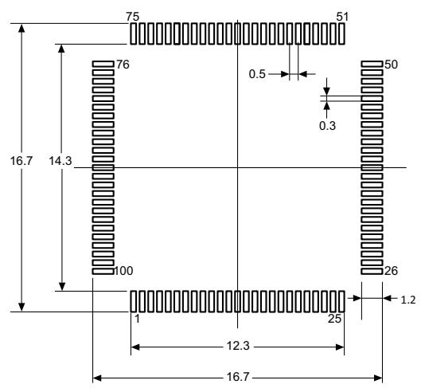

Figure 78. LQFP100 - Footprint example

1L\_LQFP100\_FP\_V1

1. Dimensions are expressed in millimeters.

174/206

DS8626 Rev 12

STM32F405xx, STM32F407xx

Package information

## LQFP144 package information (1A)

This LQFP is a 144-pin, 20 x 20 mm low-profile quad flat package.

Note: See list of notes in the notes section.

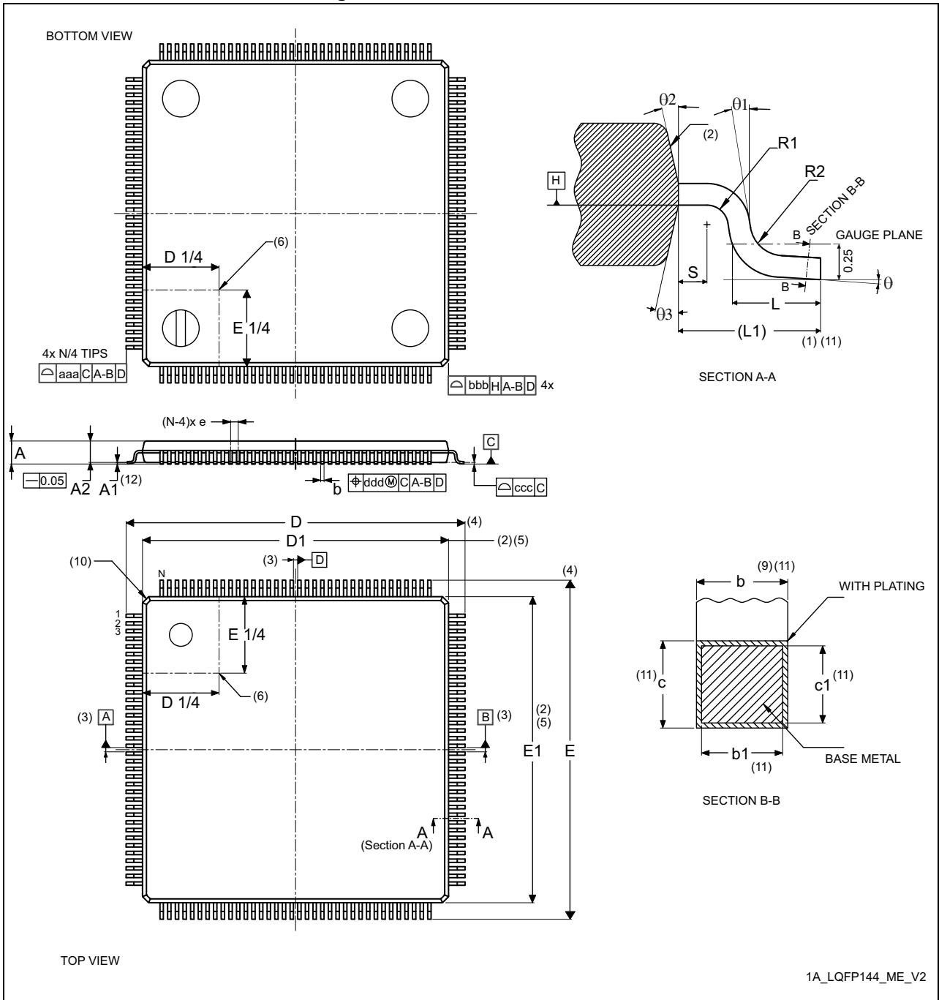

Figure 79. LQFP144 - Outline(15)

175/206

DS8626 Rev 12

Package information

STM32F405xx, STM32F407xx

Table 94. LQFP144 - Mechanical data

<table><tr><td rowspan=2 colspan=1>Symbol</td><td rowspan=1 colspan=3>millimeters</td><td rowspan=1 colspan=3>inches(14)</td></tr><tr><td rowspan=1 colspan=1>Min</td><td rowspan=1 colspan=1>Typ</td><td rowspan=1 colspan=1>Max</td><td rowspan=1 colspan=1>Min</td><td rowspan=1 colspan=1>Typ</td><td rowspan=1 colspan=1>Max</td></tr><tr><td rowspan=1 colspan=1>A</td><td rowspan=1 colspan=1>1</td><td rowspan=1 colspan=1>1</td><td rowspan=1 colspan=1>1.60</td><td rowspan=1 colspan=1>-</td><td rowspan=1 colspan=1>1</td><td rowspan=1 colspan=1>0.0630</td></tr><tr><td rowspan=1 colspan=1>A1(12)</td><td rowspan=1 colspan=1>0.05</td><td rowspan=1 colspan=1>1</td><td rowspan=1 colspan=1>0.15</td><td rowspan=1 colspan=1>0.0020</td><td rowspan=1 colspan=1>1</td><td rowspan=1 colspan=1>0.0059</td></tr><tr><td rowspan=1 colspan=1>A2</td><td rowspan=1 colspan=1>1.35</td><td rowspan=1 colspan=1>1.40</td><td rowspan=1 colspan=1>1.45</td><td rowspan=1 colspan=1>0.0531</td><td rowspan=1 colspan=1>0.0551</td><td rowspan=1 colspan=1>0.0571</td></tr><tr><td rowspan=1 colspan=1>b(9)(11)</td><td rowspan=1 colspan=1>0.17</td><td rowspan=1 colspan=1>0.22</td><td rowspan=1 colspan=1>0.27</td><td rowspan=1 colspan=1>0.0067</td><td rowspan=1 colspan=1>0.0087</td><td rowspan=1 colspan=1>0.0106</td></tr><tr><td rowspan=1 colspan=1><eq>\overline { { { \sf b } \ o 1 ^ { ( 1 1 ) } } }</eq></td><td rowspan=1 colspan=1>0.17</td><td rowspan=1 colspan=1>0.20</td><td rowspan=1 colspan=1>0.23</td><td rowspan=1 colspan=1>0.0067</td><td rowspan=1 colspan=1>0.0079</td><td rowspan=1 colspan=1>0.0090</td></tr><tr><td rowspan=1 colspan=1><eq>\overline { { \mathsf { c } ^ { ( 1 1 ) } } }</eq></td><td rowspan=1 colspan=1>0.09</td><td rowspan=1 colspan=1>1</td><td rowspan=1 colspan=1>0.20</td><td rowspan=1 colspan=1>0.0035</td><td rowspan=1 colspan=1>1</td><td rowspan=1 colspan=1>0.0079</td></tr><tr><td rowspan=1 colspan=1><eq>\mathsf { c } \mathsf { 1 } ^ { ( 1 1 ) }</eq></td><td rowspan=1 colspan=1>0.09</td><td rowspan=1 colspan=1>-</td><td rowspan=1 colspan=1>0.16</td><td rowspan=1 colspan=1>0.0035</td><td rowspan=1 colspan=1>-</td><td rowspan=1 colspan=1>0.0063</td></tr><tr><td rowspan=1 colspan=1>D(4)</td><td rowspan=1 colspan=3>22.00 BSC</td><td rowspan=1 colspan=3>0.8661 BSC</td></tr><tr><td rowspan=1 colspan=1>D1(2)(5)</td><td rowspan=1 colspan=3>20.00 BSC</td><td rowspan=1 colspan=1></td><td rowspan=1 colspan=2>0.7874 BSC</td></tr><tr><td rowspan=1 colspan=1>E(4)</td><td rowspan=1 colspan=3>22.00 BSC</td><td rowspan=1 colspan=3>0.8661 BSC</td></tr><tr><td rowspan=1 colspan=1>E1(2)(5)</td><td rowspan=1 colspan=3>20.00 BSC</td><td rowspan=1 colspan=3>0.7874 BSC</td></tr><tr><td rowspan=1 colspan=1>e</td><td rowspan=1 colspan=3>0.50 BSC</td><td rowspan=1 colspan=3>0.0197 BSC</td></tr><tr><td rowspan=1 colspan=1>L</td><td rowspan=1 colspan=1>0.45</td><td rowspan=1 colspan=1>0.60</td><td rowspan=1 colspan=1>0.75</td><td rowspan=1 colspan=1>0.0177</td><td rowspan=1 colspan=1>0.0236</td><td rowspan=1 colspan=1>0.0295</td></tr><tr><td rowspan=1 colspan=1>L1</td><td rowspan=1 colspan=3>1.00 REF</td><td rowspan=1 colspan=3>0.0394 REF</td></tr><tr><td rowspan=1 colspan=1><eq>\overline { { { \mathsf { N } } ^ { ( 1 3 ) } } }</eq></td><td rowspan=1 colspan=6>144</td></tr><tr><td rowspan=1 colspan=1>e</td><td rowspan=1 colspan=1><eq>0 ^ { \circ }</eq></td><td rowspan=1 colspan=1>3.5°</td><td rowspan=1 colspan=1>7°</td><td rowspan=1 colspan=1><eq>0 ^ { \circ }</eq></td><td rowspan=1 colspan=1>3.5°</td><td rowspan=1 colspan=1>7°</td></tr><tr><td rowspan=1 colspan=1>θ1</td><td rowspan=1 colspan=1><eq>0 ^ { \circ }</eq></td><td rowspan=1 colspan=1>1</td><td rowspan=1 colspan=1>1</td><td rowspan=1 colspan=1>0°</td><td rowspan=1 colspan=1>-</td><td rowspan=1 colspan=1>1</td></tr><tr><td rowspan=1 colspan=1>02</td><td rowspan=1 colspan=1><eq>1 0 ^ { \circ }</eq></td><td rowspan=1 colspan=1>12°</td><td rowspan=1 colspan=1><eq>1 4 ^ { \circ }</eq></td><td rowspan=1 colspan=1><eq>1 0 ^ { \circ }</eq></td><td rowspan=1 colspan=1>12°</td><td rowspan=1 colspan=1>14°</td></tr><tr><td rowspan=1 colspan=1>θ3</td><td rowspan=1 colspan=1><eq>1 0 ^ { \circ }</eq></td><td rowspan=1 colspan=1><eq>1 2 ^ { \circ }</eq></td><td rowspan=1 colspan=1><eq>1 4 ^ { \circ }</eq></td><td rowspan=1 colspan=1><eq>1 0 ^ { \circ }</eq></td><td rowspan=1 colspan=1><eq>12 ^ { \circ }</eq></td><td rowspan=1 colspan=1>14°</td></tr><tr><td rowspan=1 colspan=1>R1</td><td rowspan=1 colspan=1>0.08</td><td rowspan=1 colspan=1></td><td rowspan=1 colspan=1>1</td><td rowspan=1 colspan=1>0.0031</td><td rowspan=1 colspan=1>1</td><td rowspan=1 colspan=1>1</td></tr><tr><td rowspan=1 colspan=1>R2</td><td rowspan=1 colspan=1>0.08</td><td rowspan=1 colspan=1></td><td rowspan=1 colspan=1>0.20</td><td rowspan=1 colspan=1>0.0031</td><td rowspan=1 colspan=1>1</td><td rowspan=1 colspan=1>0.0079</td></tr><tr><td rowspan=1 colspan=1>S</td><td rowspan=1 colspan=1>0.20</td><td rowspan=1 colspan=1>1</td><td rowspan=1 colspan=1>1</td><td rowspan=1 colspan=1>0.0079</td><td rowspan=1 colspan=1>1</td><td rowspan=1 colspan=1></td></tr><tr><td rowspan=1 colspan=1>aaa</td><td rowspan=1 colspan=3>0.20</td><td rowspan=1 colspan=3>0.0079</td></tr><tr><td rowspan=1 colspan=1>bbb</td><td rowspan=1 colspan=3>0.20</td><td rowspan=1 colspan=3>0.0079</td></tr><tr><td rowspan=1 colspan=1>CCC</td><td rowspan=1 colspan=3>0.08</td><td rowspan=1 colspan=3>0.0031</td></tr><tr><td rowspan=1 colspan=1>ddd</td><td rowspan=1 colspan=3>0.08</td><td rowspan=1 colspan=3>0.0031</td></tr></table>

176/206

DS8626 Rev 12

STM32F405xx, STM32F407xx

Package information

## Notes:

1. Dimensioning and tolerancing schemes conform to ASME Y14.5M-1994.

2. The top package body size may be smaller than the bottom package size by as much as 0.15 mm.

3. Datums A-B and D to be determined at datum plane H.

4. To be determined at the seating datum plane C.

5. Dimensions D1 and E1 do not include mold flash or protrusions. Allowable mold flash or protrusions is 0.25 mm per side. D1 and E1 are maximum plastic body size dimensions including mold mismatch.

6. Details of pin 1 identifier are optional but must be located within the zone indicated.

7. All dimensions are in millimeters.

8. No intrusion is allowed inwards the leads.

9. Dimension b does not include a dambar protrusion. Allowable dambar protrusion shall not cause the lead width to exceed the maximum b dimension by more than 0.08 mm. The dambar cannot be located on the lower radius or the foot. The minimum space between the protrusion and an adjacent lead is 0.07 mm for 0.4 mm and 0.5 mm pitch packages.

10. The exact shape of each corner is optional.

11. These dimensions apply to the flat section of the lead that is between 0.10 mm and 0.25 mm from the lead tip.

12. A1 is defined as the distance from the seating plane to the lowest point on the package body.

13. N is the number of terminal positions for the specified body size.

14. Values in inches are converted from mm and rounded to four decimal digits.

15. Drawing is not to scale.

177/206

DS8626 Rev 12

Package information

STM32F405xx, STM32F407xx

Figure 80. LQFP144 - Footprint example

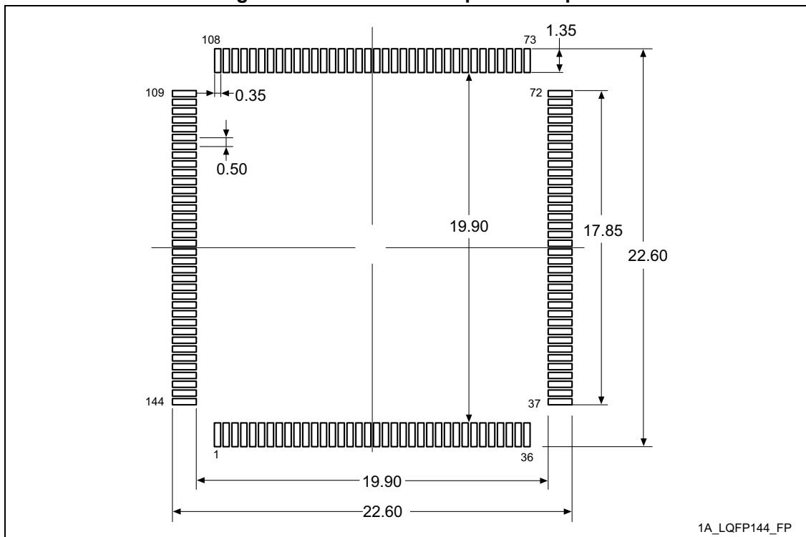

1. Dimensions are expressed in millimeters.

178/206

DS8626 Rev 12

STM32F405xx, STM32F407xx

Package information

## 7.6

## UFBGA(176+25) package information (A0E7)

This UFBGA is a 176+25-ball, 10 x 10 mm, 0.65 mm pitch, ultra fine pitch ball grid array package.

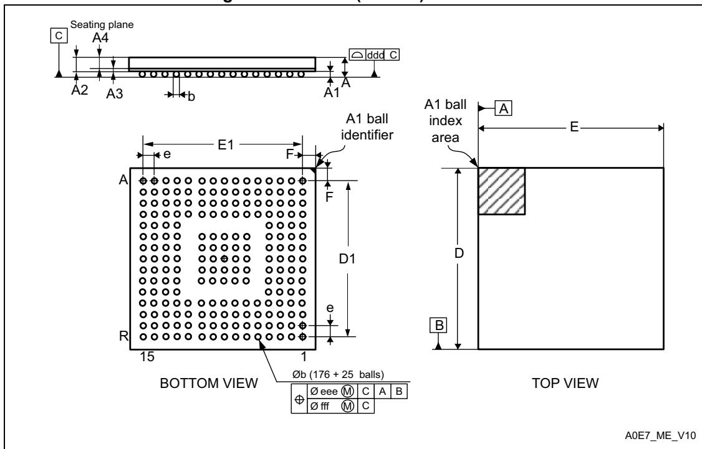

Figure 81. UFBGA(176+25) - Outline

1. Drawing is not to scale.

Table 95. UFBGA(176+25) - Mechanical data

<table><tr><td colspan="1" rowspan="2">Symbol</td><td colspan="3" rowspan="1">millimeters</td><td colspan="3" rowspan="1">inches(1)</td></tr><tr><td colspan="1" rowspan="1">Min.</td><td colspan="1" rowspan="1">Typ.</td><td colspan="1" rowspan="1">Max.</td><td colspan="1" rowspan="1">Min.</td><td colspan="1" rowspan="1">Typ.</td><td colspan="1" rowspan="1">Max.</td></tr><tr><td colspan="1" rowspan="1">A</td><td colspan="1" rowspan="1">1</td><td colspan="1" rowspan="1">1</td><td colspan="1" rowspan="1">0.600</td><td colspan="1" rowspan="1">1</td><td colspan="1" rowspan="1">-</td><td colspan="1" rowspan="1">0.0236</td></tr><tr><td colspan="1" rowspan="1">A1</td><td colspan="1" rowspan="1">0.050</td><td colspan="1" rowspan="1">0.080</td><td colspan="1" rowspan="1">0.110</td><td colspan="1" rowspan="1">0.0020</td><td colspan="1" rowspan="1">0.0031</td><td colspan="1" rowspan="1">0.0043</td></tr><tr><td colspan="1" rowspan="1">A2</td><td colspan="1" rowspan="1">1</td><td colspan="1" rowspan="1">0.450</td><td colspan="1" rowspan="1">1</td><td colspan="1" rowspan="1">1</td><td colspan="1" rowspan="1">0.0177</td><td colspan="1" rowspan="1">1</td></tr><tr><td colspan="1" rowspan="1">A3</td><td colspan="1" rowspan="1">1</td><td colspan="1" rowspan="1">0.130</td><td colspan="1" rowspan="1">1</td><td colspan="1" rowspan="1">1</td><td colspan="1" rowspan="1">0.0051</td><td colspan="1" rowspan="1">1</td></tr><tr><td colspan="1" rowspan="1">A4</td><td colspan="1" rowspan="1">1</td><td colspan="1" rowspan="1">0.320</td><td colspan="1" rowspan="1">1</td><td colspan="1" rowspan="1">1</td><td colspan="1" rowspan="1">0.0126</td><td colspan="1" rowspan="1">1</td></tr><tr><td colspan="1" rowspan="1">b</td><td colspan="1" rowspan="1">0.240</td><td colspan="1" rowspan="1">0.290</td><td colspan="1" rowspan="1">0.340</td><td colspan="1" rowspan="1">0.0094</td><td colspan="1" rowspan="1">0.0114</td><td colspan="1" rowspan="1">0.0134</td></tr><tr><td colspan="1" rowspan="1">D</td><td colspan="1" rowspan="1">9.850</td><td colspan="1" rowspan="1">10.000</td><td colspan="1" rowspan="1">10.150</td><td colspan="1" rowspan="1">0.3878</td><td colspan="1" rowspan="1">0.3937</td><td colspan="1" rowspan="1">0.3996</td></tr><tr><td colspan="1" rowspan="1">D1</td><td colspan="1" rowspan="1">1</td><td colspan="1" rowspan="1">9.100</td><td colspan="1" rowspan="1">1</td><td colspan="1" rowspan="1">1</td><td colspan="1" rowspan="1">0.3583</td><td colspan="1" rowspan="1">1</td></tr><tr><td colspan="1" rowspan="1">E</td><td colspan="1" rowspan="1">9.850</td><td colspan="1" rowspan="1">10.000</td><td colspan="1" rowspan="1">10.150</td><td colspan="1" rowspan="1">0.3878</td><td colspan="1" rowspan="1">0.3937</td><td colspan="1" rowspan="1">0.3996</td></tr><tr><td colspan="1" rowspan="1">E1</td><td colspan="1" rowspan="1">1</td><td colspan="1" rowspan="1">9.100</td><td colspan="1" rowspan="1">1</td><td colspan="1" rowspan="1">1</td><td colspan="1" rowspan="1">0.3583</td><td colspan="1" rowspan="1">1</td></tr><tr><td colspan="1" rowspan="1">e</td><td colspan="1" rowspan="1">-</td><td colspan="1" rowspan="1">0.650</td><td colspan="1" rowspan="1">1</td><td colspan="1" rowspan="1">1</td><td colspan="1" rowspan="1">0.0256</td><td colspan="1" rowspan="1">1</td></tr><tr><td colspan="1" rowspan="1">F</td><td colspan="1" rowspan="1">I</td><td colspan="1" rowspan="1">0.450</td><td colspan="1" rowspan="1">1</td><td colspan="1" rowspan="1">1</td><td colspan="1" rowspan="1">0.0177</td><td colspan="1" rowspan="1">1</td></tr><tr><td colspan="1" rowspan="1">ddd</td><td colspan="1" rowspan="1">I</td><td colspan="1" rowspan="1">-</td><td colspan="1" rowspan="1">0.080</td><td colspan="1" rowspan="1">-</td><td colspan="1" rowspan="1">-</td><td colspan="1" rowspan="1">0.0031</td></tr><tr><td colspan="1" rowspan="2">Symbol</td><td colspan="3" rowspan="1">millimeters</td><td colspan="3" rowspan="1"><eq>\mathrm { i n c h e s } ^ { ( 1 ) }</eq></td></tr><tr><td colspan="1" rowspan="1">Min.</td><td colspan="1" rowspan="1">Typ.</td><td colspan="1" rowspan="1">Max.</td><td colspan="1" rowspan="1">Min.</td><td colspan="1" rowspan="1">Typ.</td><td colspan="1" rowspan="1">Max.</td></tr><tr><td colspan="1" rowspan="1">eee</td><td colspan="1" rowspan="1">I</td><td colspan="1" rowspan="1">1</td><td colspan="1" rowspan="1">0.150</td><td colspan="1" rowspan="1">1</td><td colspan="1" rowspan="1">-</td><td colspan="1" rowspan="1">0.0059</td></tr><tr><td colspan="1" rowspan="1">fff</td><td colspan="1" rowspan="1">I</td><td colspan="1" rowspan="1">1</td><td colspan="1" rowspan="1">0.050</td><td colspan="1" rowspan="1"></td><td colspan="1" rowspan="1">1</td><td colspan="1" rowspan="1">0.0020</td></tr></table>

179/206

DS8626 Rev 12

Package information

STM32F405xx, STM32F407xx

1. Values in inches are converted from mm and rounded to 4 decimal digits.

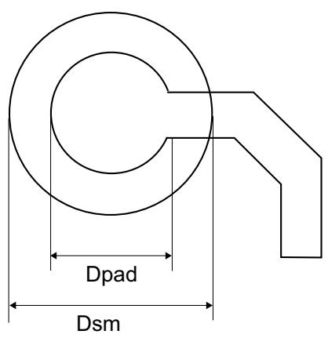

Figure 82. UFBGA(176+25) - Footprint example

BGA\_WLCSP\_FT\_V1

Table 96. UFBGA(176+25) - Example of PCB design rules (0.65 mm pitch BGA)

<table><tr><td rowspan=1 colspan=1>Dimension</td><td rowspan=1 colspan=1>Values</td></tr><tr><td rowspan=1 colspan=1>Pitch</td><td rowspan=1 colspan=1>0.65 mm</td></tr><tr><td rowspan=1 colspan=1>Dpad</td><td rowspan=1 colspan=1>0.300 mm</td></tr><tr><td rowspan=1 colspan=1>Dsm</td><td rowspan=1 colspan=1>0.400 mm typ. (depends on the soldermaskregistration tolerance)</td></tr><tr><td rowspan=1 colspan=1>Stencil opening</td><td rowspan=1 colspan=1>0.300 mm</td></tr><tr><td rowspan=1 colspan=1>Stencil thickness</td><td rowspan=1 colspan=1>Between 0.100 mm and 0.125 mm</td></tr><tr><td rowspan=1 colspan=1>Pad trace width</td><td rowspan=1 colspan=1>0.100 mm</td></tr></table>

180/206

DS8626 Rev 12

STM32F405xx, STM32F407xx

Package information

## 7.7 LQFP176 package information (1T)

This LQFP is a 176-pin, 24 x 24 mm, 0.5 mm pitch, low profile quad flat package.

Note: See list of notes in the notes section.

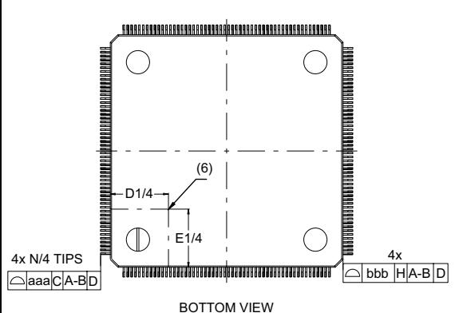

Figure 83. LQFP176 - Outline(15)

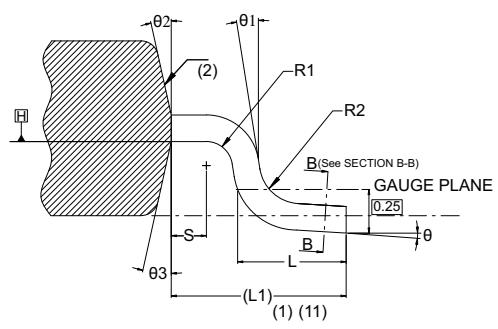

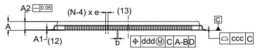

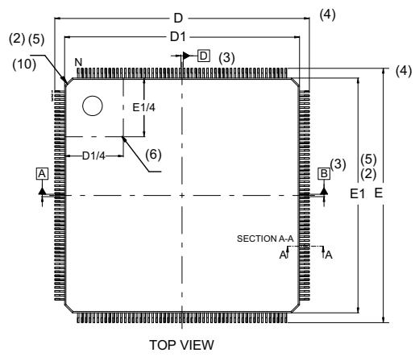

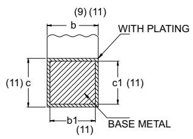

1T\_LQFP176\_ME\_V2

181/206

S

DS8626 Rev 12

Package information

STM32F405xx, STM32F407xx

Table 97. LQFP176 - Mechanical data

<table><tr><td rowspan=2 colspan=1>Symbol</td><td rowspan=1 colspan=3>millimeters</td><td rowspan=1 colspan=3>inches(14)</td></tr><tr><td rowspan=1 colspan=1>Min</td><td rowspan=1 colspan=1>Typ</td><td rowspan=1 colspan=1>Max</td><td rowspan=1 colspan=1>Min</td><td rowspan=1 colspan=1>Typ</td><td rowspan=1 colspan=1>Max</td></tr><tr><td rowspan=1 colspan=1><eq>\mathsf { A }</eq></td><td rowspan=1 colspan=1>-</td><td rowspan=1 colspan=1>1</td><td rowspan=1 colspan=1>1.600</td><td rowspan=1 colspan=1>1</td><td rowspan=1 colspan=1>1</td><td rowspan=1 colspan=1>0.0630</td></tr><tr><td rowspan=1 colspan=1><eq>\overline { { { \sf A } 1 ^ { ( 1 2 ) } } }</eq></td><td rowspan=1 colspan=1>0.050</td><td rowspan=1 colspan=1>1</td><td rowspan=1 colspan=1>0.150</td><td rowspan=1 colspan=1>0.0020</td><td rowspan=1 colspan=1>1</td><td rowspan=1 colspan=1>0.0059</td></tr><tr><td rowspan=1 colspan=1>A2</td><td rowspan=1 colspan=1>1.350</td><td rowspan=1 colspan=1>1.400</td><td rowspan=1 colspan=1>1.450</td><td rowspan=1 colspan=1>0.0531</td><td rowspan=1 colspan=1>0.0551</td><td rowspan=1 colspan=1>0.0571</td></tr><tr><td rowspan=1 colspan=1><eq>\overline { { { \sf b } ^ { ( 9 ) ( 1 1 ) } } }</eq></td><td rowspan=1 colspan=1>0.170</td><td rowspan=1 colspan=1>0.220</td><td rowspan=1 colspan=1>0.270</td><td rowspan=1 colspan=1>0.0067</td><td rowspan=1 colspan=1>0.0087</td><td rowspan=1 colspan=1>0.0106</td></tr><tr><td rowspan=1 colspan=1><eq>\overline { { { \bf b } \ o 1 ^ { ( 1 1 ) } } }</eq></td><td rowspan=1 colspan=1>0.170</td><td rowspan=1 colspan=1>0.200</td><td rowspan=1 colspan=1>0.230</td><td rowspan=1 colspan=1>0.0067</td><td rowspan=1 colspan=1>0.0079</td><td rowspan=1 colspan=1>0.0091</td></tr><tr><td rowspan=1 colspan=1><eq>\overline { { \mathsf { c } ^ { ( 1 1 ) } } }</eq></td><td rowspan=1 colspan=1>0.090</td><td rowspan=1 colspan=1>1</td><td rowspan=1 colspan=1>0.200</td><td rowspan=1 colspan=1>0.0035</td><td rowspan=1 colspan=1>-</td><td rowspan=1 colspan=1>0.0079</td></tr><tr><td rowspan=1 colspan=1><eq>\overline { { \mathsf { c } 1 ^ { ( 1 1 ) } } }</eq></td><td rowspan=1 colspan=1>0.090</td><td rowspan=1 colspan=1>-</td><td rowspan=1 colspan=1>0.160</td><td rowspan=1 colspan=1>0.0035</td><td rowspan=1 colspan=1>-</td><td rowspan=1 colspan=1>0.063</td></tr><tr><td rowspan=1 colspan=1><eq>\overline { { \mathsf { D } ^ { ( 4 ) } } }</eq></td><td rowspan=1 colspan=3>26.000</td><td rowspan=1 colspan=3>1.0236</td></tr><tr><td rowspan=1 colspan=1>D1(2)(5)</td><td rowspan=1 colspan=3>24.000</td><td rowspan=1 colspan=3>0.9449</td></tr><tr><td rowspan=1 colspan=1><eq>\overline { { \mathsf { E } ^ { ( 4 ) } } }</eq></td><td rowspan=1 colspan=3>26.000</td><td rowspan=1 colspan=3>0.0197</td></tr><tr><td rowspan=1 colspan=1>E1(2)(5)</td><td rowspan=1 colspan=3>24.000</td><td rowspan=1 colspan=3>0.9449</td></tr><tr><td rowspan=1 colspan=1>e</td><td rowspan=1 colspan=3>0.500</td><td rowspan=1 colspan=3>0.1970</td></tr><tr><td rowspan=1 colspan=1><eq>\overline { { \mathsf { L } } }</eq></td><td rowspan=1 colspan=1>0.450</td><td rowspan=1 colspan=1>0.600</td><td rowspan=1 colspan=1>0.750</td><td rowspan=1 colspan=1>0.0177</td><td rowspan=1 colspan=1>0.0236</td><td rowspan=1 colspan=1>0.0295</td></tr><tr><td rowspan=1 colspan=1>L1(1)(11)</td><td rowspan=1 colspan=3>1</td><td rowspan=1 colspan=3>0.0394 REF</td></tr><tr><td rowspan=1 colspan=1><eq>\overline { { { \sf N } ^ { ( 1 3 ) } } }</eq></td><td rowspan=1 colspan=6>176</td></tr><tr><td rowspan=1 colspan=1>θ</td><td rowspan=1 colspan=1><eq>0 ^ { \circ }</eq></td><td rowspan=1 colspan=1><eq>3 . 5 ^ { \circ }</eq></td><td rowspan=1 colspan=1><eq>\overline { { 7 ^ { \circ } } }</eq></td><td rowspan=1 colspan=1><eq>0 ^ { \circ }</eq></td><td rowspan=1 colspan=1>3.5°</td><td rowspan=1 colspan=1><eq>7 ^ { \circ }</eq></td></tr><tr><td rowspan=1 colspan=1>θ1</td><td rowspan=1 colspan=1><eq>0 ^ { \circ }</eq></td><td rowspan=1 colspan=1>1</td><td rowspan=1 colspan=1>1</td><td rowspan=1 colspan=1><eq>0 ^ { \circ }</eq></td><td rowspan=1 colspan=1>-</td><td rowspan=1 colspan=1></td></tr><tr><td rowspan=1 colspan=1>02</td><td rowspan=1 colspan=1><eq>1 0 ^ { \circ }</eq></td><td rowspan=1 colspan=1><eq>12 ^ { \circ }</eq></td><td rowspan=1 colspan=1><eq>1 4 ^ { \circ }</eq></td><td rowspan=1 colspan=1><eq>1 0 ^ { \circ }</eq></td><td rowspan=1 colspan=1><eq>12 ^ { \circ }</eq></td><td rowspan=1 colspan=1><eq>1 4 ^ { \circ }</eq></td></tr><tr><td rowspan=1 colspan=1>03</td><td rowspan=1 colspan=1><eq>1 0 ^ { \circ }</eq></td><td rowspan=1 colspan=1><eq>12 ^ { \circ }</eq></td><td rowspan=1 colspan=1><eq>1 4 ^ { \circ }</eq></td><td rowspan=1 colspan=1><eq>\overline { { 1 0 ^ { \circ } } }</eq></td><td rowspan=1 colspan=1><eq>12 ^ { \circ }</eq></td><td rowspan=1 colspan=1><eq>\overline { { 1 4 ^ { \circ } } }</eq></td></tr><tr><td rowspan=1 colspan=1>R1</td><td rowspan=1 colspan=1>0.080</td><td rowspan=1 colspan=1>1</td><td rowspan=1 colspan=1>1</td><td rowspan=1 colspan=1>0.0031</td><td rowspan=1 colspan=1>1</td><td rowspan=1 colspan=1>1</td></tr><tr><td rowspan=1 colspan=1>R2</td><td rowspan=1 colspan=1>0.080</td><td rowspan=1 colspan=1>1</td><td rowspan=1 colspan=1>0.200</td><td rowspan=1 colspan=1>0.0031</td><td rowspan=1 colspan=1>1</td><td rowspan=1 colspan=1>0.0079</td></tr><tr><td rowspan=1 colspan=1>S</td><td rowspan=1 colspan=1>0.200</td><td rowspan=1 colspan=1>1</td><td rowspan=1 colspan=1>1</td><td rowspan=1 colspan=1>0.0079</td><td rowspan=1 colspan=1>1</td><td rowspan=1 colspan=1></td></tr><tr><td rowspan=1 colspan=1><eq>\overline { { \mathsf { a a a } \mathsf { a } ^ { ( 1 ) } } }</eq></td><td rowspan=1 colspan=3>0.200</td><td rowspan=1 colspan=3>0.0079</td></tr><tr><td rowspan=1 colspan=1><eq>\overline { { \mathsf { b b b } ^ { ( 1 ) } } }</eq></td><td rowspan=1 colspan=3>0.200</td><td rowspan=1 colspan=3>0.0079</td></tr><tr><td rowspan=1 colspan=1><eq>\overline { { \mathsf { c c c } ^ { ( 1 ) } } }</eq></td><td rowspan=1 colspan=3>0.080</td><td rowspan=1 colspan=3>0.0031</td></tr><tr><td rowspan=1 colspan=1><eq>\overline { { \mathsf { d o d d } ^ { ( 1 ) } } }</eq></td><td rowspan=1 colspan=3>0.080</td><td rowspan=1 colspan=3>0.0031</td></tr></table>

182/206

DS8626 Rev 12

STM32F405xx, STM32F407xx

Package information

## Notes:

1. Dimensioning and tolerancing schemes conform to ASME Y14.5M-1994.

2. The top package body size may be smaller than the bottom package size by as much as 0.15 mm.

3. Datums A-B and D to be determined at datum plane H.

4. To be determined at the seating datum plane C.

5. Dimensions D1 and E1 do not include mold flash or protrusions. Allowable mold flash or protrusions is 0.25 mm per side. D1 and E1 are maximum plastic body size dimensions including mold mismatch.

6. Details of pin 1 identifier are optional but must be located within the zone indicated.

7. All dimensions are in millimeters.

8. No intrusion is allowed inwards the leads.

9. Dimension b does not include a dambar protrusion. Allowable dambar protrusion shall not cause the lead width to exceed the maximum b dimension by more than 0.08 mm. The dambar cannot be located on the lower radius or the foot. The minimum space between the protrusion and an adjacent lead is 0.07 mm for 0.4 mm and 0.5 mm pitch packages.

10. The exact shape of each corner is optional.

11. These dimensions apply to the flat section of the lead that is between 0.10 mm and 0.25 mm from the lead tip.

12. A1 is defined as the distance from the seating plane to the lowest point on the package body.

13. N is the number of terminal positions for the specified body size.

14. Values in inches are converted from mm and rounded to four decimal digits.

15. Drawing is not to scale.

183/206

DS8626 Rev 12

Package information

STM32F405xx, STM32F407xx

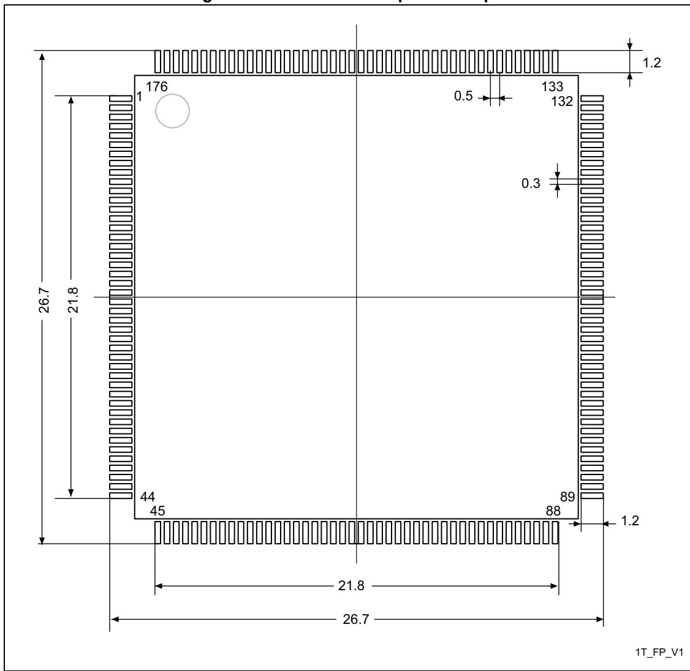

Figure 84. LQFP176 - Footprint example

1. Dimensions are expressed in millimeters.

184/206

DS8626 Rev 12

STM32F405xx, STM32F407xx

Package information

## 7.8

## Thermal characteristics

The maximum chip-junction temperature, ${ \sf T } _ { \sf J }$ max, in degrees Celsius, may be calculated using the following equation:

$$
\mathsf { T } _ { \mathsf { J } } \mathsf { m a x } = \mathsf { T } _ { \mathsf { A } } \mathsf { m a x } + ( \mathsf { P } _ { \mathsf { D } } \mathsf { m a x } \times \Theta _ { \mathsf { J } \mathsf { A } } )
$$

Where:

$\mathsf { T } _ { \mathsf { A } }$ max is the maximum ambient temperature in ${ } ^ { \circ } { \mathsf { C } } _ { : }$

$\Theta _ { \mathsf { J A } }$ is the package junction-to-ambient thermal resistance, in $^ { \circ } \mathsf { C } N ,$

$\mathsf { P } _ { \mathsf { D } }$ max is the sum of $\mathsf { P } _ { \mathsf { I N T } }$ max and $\mathsf { P } _ { | / \mathsf { O } }$ max $( \mathsf { P } _ { \mathsf { D } } \mathsf { m a x } = \mathsf { P } _ { \mathsf { I N T } } \mathsf { m a x } + \mathsf { P } _ { \mathsf { I / O } } \mathsf { m a x } ) ,$

$\mathsf { P } _ { \mathsf { I N T } }$ max is the product of IDD and $\mathsf { V } _ { \mathsf { D D } }$ , expressed in Watts. This is the maximum chip internal power.

$\mathsf { P } _ { | / \mathsf { O } }$ max represents the maximum power dissipation on output pins where:

$$
\mathsf { P } _ { | / \mathsf { O } } \mathsf { m } \mathsf { a } \mathsf { x } = \Sigma ( \mathsf { V } _ { \mathrm { O L } } \times \mathsf { I } _ { \mathrm { O L } } ) + \Sigma ( ( \mathsf { V } _ { \mathrm { D D } } - \mathsf { V } _ { \mathrm { O H } } ) \times \mathsf { I } _ { \mathrm { O H } } ) ,
$$

taking into account the actual $\mathsf { V } _ { \mathsf { O L } } / \mathsf { I } _ { \mathsf { O L } }$ and $\mathsf { V } _ { \mathsf { O H } } / \mathsf { I } _ { \mathsf { O H } }$ of the I/Os at low and high level in the application.

Table 98. Package thermal characteristics

<table><tr><td rowspan=1 colspan=1>Symbol</td><td rowspan=1 colspan=1>Parameter</td><td rowspan=1 colspan=1>Value</td><td rowspan=1 colspan=1>Unit</td></tr><tr><td rowspan=6 colspan=1><eq>\Theta _ { \mathsf { A } }</eq></td><td rowspan=1 colspan=1>Thermal resistance junction-ambientLQFP64 - 10 × 10 mm / 0.5 mm pitch</td><td rowspan=1 colspan=1>46</td><td rowspan=6 colspan=1>℃/W</td></tr><tr><td rowspan=1 colspan=1>Thermal resistance junction-ambientLQFP100 - 14 × 14 mm / 0.5 mm pitch</td><td rowspan=1 colspan=1>43</td></tr><tr><td rowspan=1 colspan=1>Thermal resistance junction-ambientLQFP144 - 20 × 20 mm / 0.5 mm pitch</td><td rowspan=1 colspan=1>40</td></tr><tr><td rowspan=1 colspan=1>Thermal resistance junction-ambientLQFP176 - 24 × 24 mm / 0.5 mm pitch</td><td rowspan=1 colspan=1>38</td></tr><tr><td rowspan=1 colspan=1>Thermal resistance junction-ambientUFBGA176 - 10× 10 mm / 0.65 mm pitch</td><td rowspan=1 colspan=1>39</td></tr><tr><td rowspan=1 colspan=1>Thermal resistance junction-ambientWLCSP90 - 0.400 mm pitch</td><td rowspan=1 colspan=1>38.1</td></tr></table>

## Reference document

JESD51-2 Integrated Circuits Thermal Test Method Environment Conditions - Natura Convection (Still Air). Available from www.jedec.org.

185/206

DS8626 Rev 12

Ordering information

STM32F405xx, STM32F407xx

## 8 Ordering information

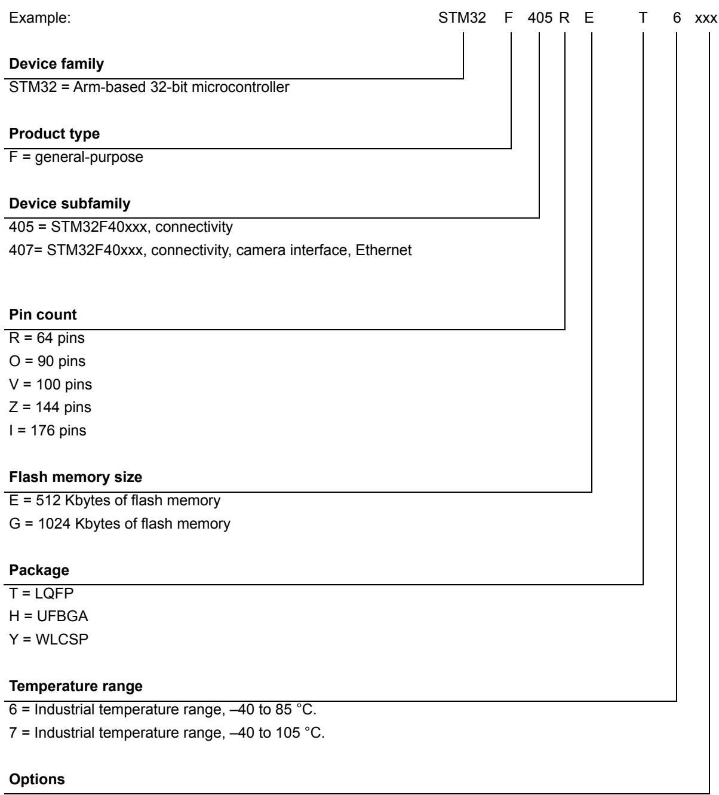

xxx = programmed parts

TR = tape and reel

For a list of available options (speed, package, etc.) or for further information on any aspect of this device, please contact your nearest ST sales office.

S

186/206

DS8626 Rev 12

STM32F405xx, STM32F407xx

Application block diagrams

## Appendix A Application block diagrams

## A.1 USB OTG full speed (FS) interface solutions

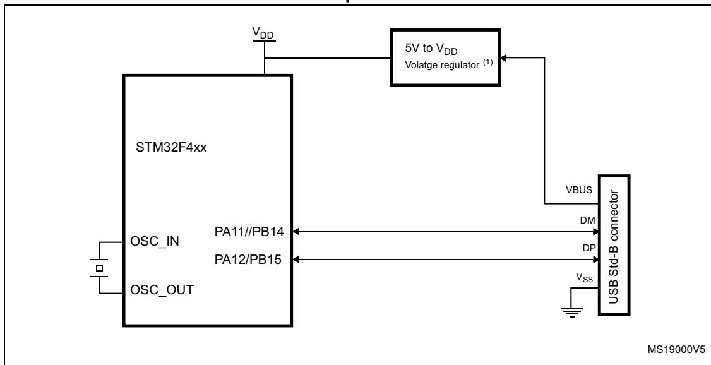

Figure 85. USB controller configured as peripheral-only and used in Full speed mode

1. External voltage regulator only needed when building a $\mathsf { V } _ { \mathsf { B U S } }$ powered device.

2. The same application can be developed using the OTG HS in FS mode to achieve enhanced performance thanks to the large Rx/Tx FIFO and to a dedicated DMA controller.

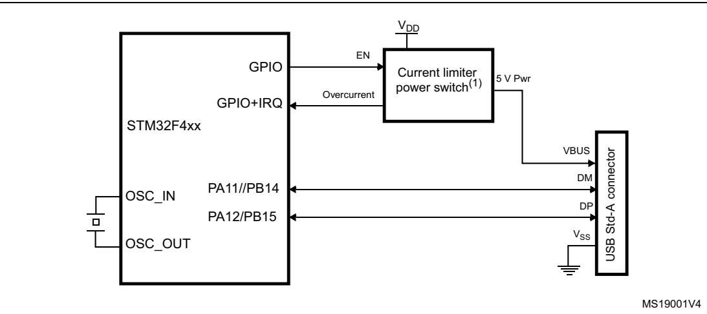

Figure 86. USB controller configured as host-only and used in full speed mode

1. The current limiter is required only if the application has to support a $\mathsf { V } _ { \mathsf { B U S } }$ powered device. A basic power switch can be used if 5 V are available on the application board.

2. The same application can be developed using the OTG HS in FS mode to achieve enhanced performance thanks to the large Rx/Tx FIFO and to a dedicated DMA controller.

187/206

DS8626 Rev 12

Application block diagrams

STM32F405xx, STM32F407xx

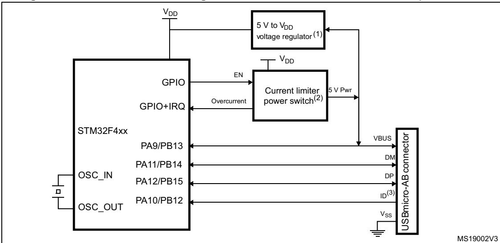

Figure 87. USB controller configured in dual mode and used in full speed mode

1. External voltage regulator only needed when building a VBUS powered device.

2. The current limiter is required only if the application has to support a $\mathsf { V } _ { \mathsf { B U S } }$ powered device. A basic power switch can be used if 5 V are available on the application board.

3. The ID pin is required in dual role only.

4. The same application can be developed using the OTG HS in FS mode to achieve enhanced performance thanks to the large Rx/Tx FIFO and to a dedicated DMA controller.

188/206

DS8626 Rev 12

STM32F405xx, STM32F407xx

Application block diagrams

## A.2 USB OTG high speed (HS) interface solutions

Figure 88. USB controller configured as peripheral, host, or dual-mode and used in high speed mode

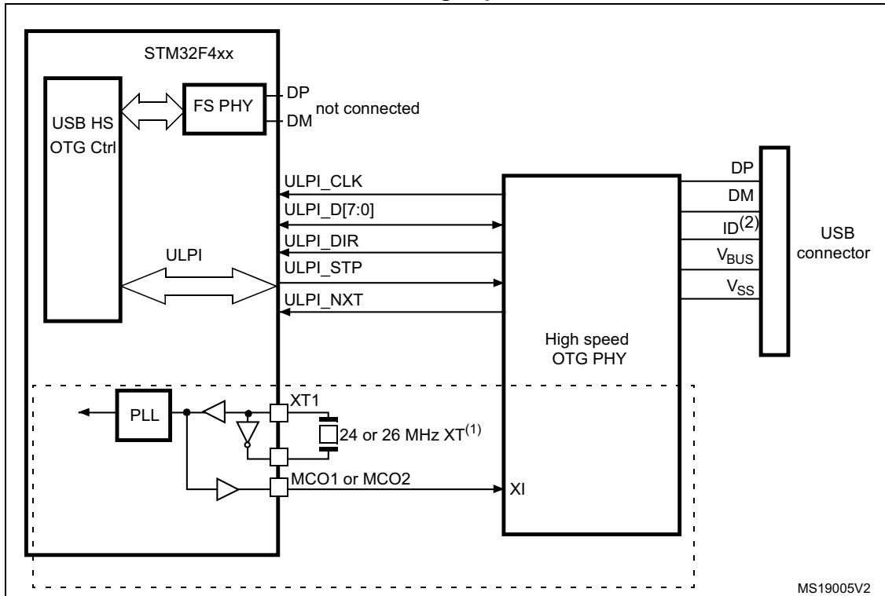

1. It is possible to use MCO1 or MCO2 to save a crystal. It is however not mandatory to clock the STM32F40xxx with a 24 or 26 MHz crystal when using USB HS. The above figure only shows an example of a possible connection.

2. The ID pin is required in dual role only.

189/206

DS8626 Rev 12

Application block diagrams

STM32F405xx, STM32F407xx

## A.3 Ethernet interface solutions

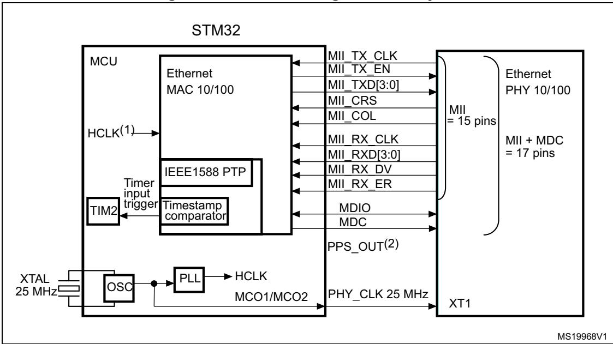

Figure 89. MII mode using a 25 MHz crysta

1. fHCLK must be greater than 25 MHz.

2. Pulse per second when using IEEE1588 PTP optional signal.

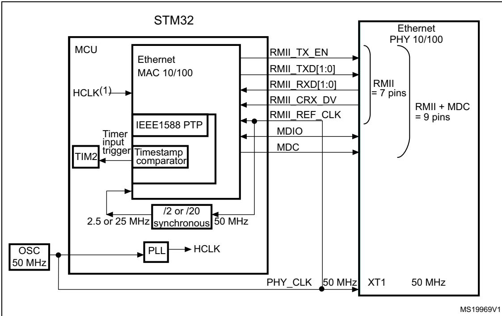

Figure 90. RMII with a 50 MHz oscillator

1. fHCLK must be greater than 25 MHz.

190/206

DS8626 Rev 12

STM32F405xx, STM32F407xx

Application block diagrams

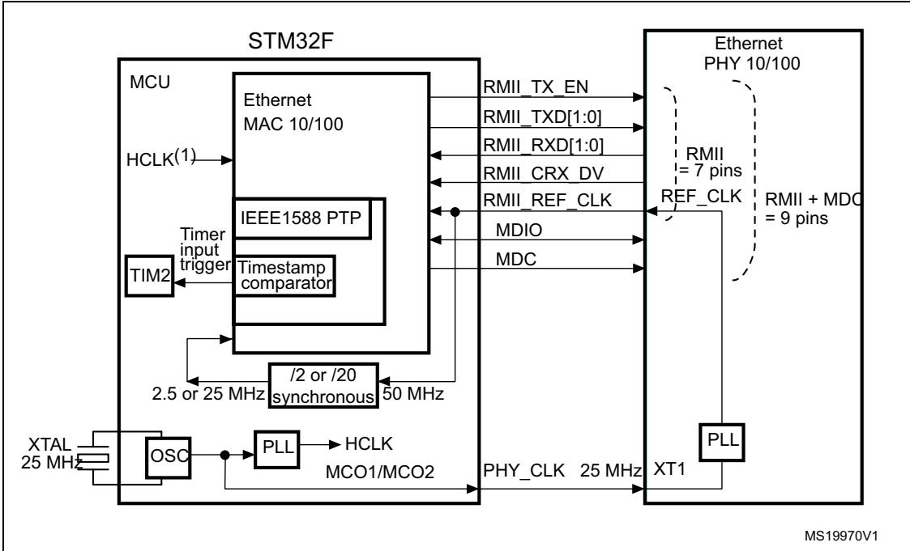

Figure 91. RMII with a 25 MHz crystal and PHY with PLL

1. f must be greater than 25 MHz.

2. The 25 MHz (PHY\_CLK) must be derived directly from the HSE oscillator, before the PLL block.

191/206

DS8626 Rev 12

Important security notice

STM32F405xx, STM32F407xx

## Important security notice

The STMicroelectronics group of companies (ST) places a high value on product security, which is why the ST product(s) identified in this documentation may be certified by various security certification bodies and/or may implement our own security measures as set forth herein. However, no level of security certification and/or built-in security measures can guarantee that ST products are resistant to all forms of attacks. As such, it is the responsibility of each of ST's customers to determine if the level of security provided in an ST product meets the customer needs both in relation to the ST product alone, as well as when combined with other components and/or software for the customer end product or application. In particular, take note that:

ST products may have been certified by one or more security certification bodies, such as Platform Security Architecture (www.psacertified.org) and/or Security Evaluation standard for IoT Platforms (www.trustcb.com). For details concerning whether the ST product(s) referenced herein have received security certification along with the level and current status of such certification, either visit the relevant certification standards website or go to the relevant product page on www.st.com for the most up to date information. As the status and/or level of security certification for an ST product can change from time to time, customers should re-check security certification status/level as needed. If an ST product is not shown to be certified under a particular security standard, customers should not assume it is certified.

Certification bodies have the right to evaluate, grant and revoke security certification in relation to ST products. These certification bodies are therefore independently responsible for granting or revoking security certification for an ST product, and ST does not take any responsibility for mistakes, evaluations, assessments, testing, or other activity carried out by the certification body with respect to any ST product.

Industry-based cryptographic algorithms (such as AES, DES, or MD5) and other open standard technologies which may be used in conjunction with an ST product are based on standards which were not developed by ST. ST does not take responsibility for any flaws in such cryptographic algorithms or open technologies or for any methods which have been or may be developed to bypass, decrypt or crack such algorithms or technologies.

While robust security testing may be done, no level of certification can absolutely guarantee protections against all attacks, including, for example, against advanced attacks which have not been tested for, against new or unidentified forms of attack, or against any form of attack when using an ST product outside of its specification or intended use, or in conjunction with other components or software which are used by customer to create their end product or application. ST is not responsible for resistance against such attacks. As such, regardless of the incorporated security features and/or any information or support that may be provided by ST, each customer is solely responsible for determining if the level of attacks tested for meets their needs, both in relation to the ST product alone and when incorporated into a customer end product or application.

All security features of ST products (inclusive of any hardware, software, documentation, and the like), including but not limited to any enhanced security features added by ST, are provided on an "AS IS" BASIS. AS SUCH, TO THE EXTENT PERMITTED BY APPLICABLE LAW, ST DISCLAIMS ALL WARRANTIES, EXPRESS OR IMPLIED, INCLUDING BUT NOT LIMITED TO THE IMPLIED WARRANTIES OF MERCHANTABILITY OR FITNESS FOR A PARTICULAR PURPOSE, unless the applicable written and signed contract terms specifically provide otherwise.

192/206

DS8626 Rev 12

STM32F405xx, STM32F407xx

Revision history

## Revision history

Table 99. Document revision history

<table><tr><td>Date</td><td>Revision</td><td>Changes</td></tr><tr><td>15-Sep-2011</td><td>1</td><td>Initial release. Added WLCSP90 package on cover page.</td></tr><tr><td>24-Jan-2012</td><td>2</td><td>Renamed USART4 and USART5 into UART4 and UART5, respectively. Updated number of USB OTG HS and FS in Table 3: STM32F405xx and STM32F407xx: features and peripheral counts. Updated Figure 3: Compatible board design between STM32F10xx/STM32F2/STM32F40xxx for LQFP144 package and Figure 4: Compatible board design between STM32F2 and STM32F40xxx for LQFP176 and BGA176 packages, and removed note 1 and 2. Updated Section 3.0.9: Flexible static memory controller (FSMC). Modified l/Os used to reprogram the flash memory for CAN2 and USB OTG FS in Section 3.0.13: Boot modes. Updated note in Section 3.0.14: Power supply schemes PDR_ON no more available on LQFP100 package. Updated Section 3.0.16: Voltage regulator. Updated condition to obtain a minimum supply voltage of 1.7 V in the whole document. Renamed USART4/5 to UART4/5 and added LIN and IrDA feature for UART4 and UART5 in Table 6: USART feature comparison. Removed support of I2C for OTG PHY in Section 3.0.30: Universal serial bus on-the-go full-speed (OTG_FS). Added Table 7: Legend/abbreviations used in the pinout table. Table 8: STM32F40xxx pin and ball definitions: replaced VSS_3, VSS_4, and VSS_8 by VSS; reformatted Table 8: STM32F40xxx pin and ball definitions to better highlight l/O structure, and alternate functions versus additional functions; signal corresponding to LQFP100 pin 99 changed from PDR ON to VSS; EVENTOUT added in the list of alternate functions for all I/Os; ADC3 IN8 added as alternate function for PF10; FSMC CLE and FSMC ALE added as alternate functions for PD11 and PD12, respectively; PH10 alternate function TIM15_CH1_ETR renamed TIM5_CH1; updated PA4 and PA5 I/O structure to TTa. Removed OTG_HS_SCL, OTG_HS SDA, OTG FS INTN in Table 8: STM32F40xxx pin and ball definitions and Table 10: Alternate function mapping. Changed TCM data RAM to CCM data RAM in Figure 18: STM32F40xxx memory map. Added IVDD and IVSS maximum values in Table 14: Current characteristics. Added Note 1 related to fHCLK, updated Note 2 in Table 16: General operating conditions, and added maximum power dissipation values. Updated Table 17: Limitations depending on the operating power supply range.</td></tr><tr><td>24-Jan-2012</td><td>2 (continued)</td><td>Added V12 in Table 21: Embedded reset and power control block characteristics. Updated Table 23: Typical and maximum current consumption in Run mode, code with data processing running from flash memory (ART accelerator disabled) and Table 22: Typical and maximum current consumption in Run mode, code with data processing running from flash memory (ART accelerator enabled) or RAM. Added Figure, Figure 25, Figure 26, and Figure 27. Updated Table 24: Typical and maximum current consumption in Sleep mode and removed Note 1. Updated Table 25: Typical and maximum current consumptions in Stop mode and Table 26: Typical and maximum current consumptions in Standby mode, Table 27: Typical and maximum current consumptions in VBAT mode, and Table 29: Switching output l/O current consumption. Section : On-chip peripheral current consumption: modified conditions, and updated Table 30: Peripheral current consumption and Note 2. Changed fHSE_ext to 50 MHz and tr(HSE)/tf(HSE) maximum value in Table 32: High-speed external user clock characteristics. Added Cin(LSE) in Table 33: Low-speed external user clock characteristics. Updated maximum PLL input clock frequency, removed related note, and deleted jitter for MCO for RMII Ethernet typical value in Table 38: Main PLL characteristics. Updated maximum PLLI2S input clock frequency and removed related note in Table 39: PLLI2S (audio PLL) characteristics. Updated Section : Flash memory to specify that the devices are shipped to customers with the flash memory erased. Updated Table 41: Flash memory characteristics, and added tME in Table 42: Flash memory programming. Updated Table 45: EMS characteristics, and Table 46: EMI characteristics.</td></tr><tr><td>24-Jan-2012</td><td>2 (continued)</td><td>Updated Table 63: USB HS clock timing parameters Updated Table 69: ADC characteristics. Updated Table 70: ADC accuracy at fADC = 30 MHz. Updated Note 1 in Table 76: DAC characteristics. Section 6.3.26: FSMC characteristics: updated Table 77 toTable 88, changed CL value to 30 pF, and modified FSMC configuration for asynchronous timings and waveforms. Updated Figure 59: Synchronous multiplexed PSRAM write timings. Updated Table 100: Package thermal characteristics. Appendix A.1: USB OTG full speed (FS) interface solutions: modified Figure 93: USB controller configured as peripheral-only and used in Full speed mode added Note 2, updated Figure 94: USB controller configured as host-only and used in full speed mode and added Note 2, changed Figure 95: USB controller configured in dual mode and used in full speed mode and added Note 3. Appendix A.2: USB OTG high speed (HS) interface solutions: removed figures USB OTG HS device-only connection in FS mode and USB</td></tr><tr><td>31-May-2012</td><td>3</td><td>Updated Figure 5: STM32F40xxx block diagram and Figure 7: Power supply supervisor interconnection with internal reset OFF Added SDIO, added notes related to FSMC and SPI/I2S in Table 3: STM32F405xx and STM32F407xx: features and peripheral counts. Starting from Silicon revision Z, USB OTG full-speed interface is now available for all STM32F405xx devices. Added full information on WLCSP90 package together with corresponding part numbers. Changed number of AHB buses to 3. Modified available flash memory sizes in Section 3.0.4: Embedded flash memory. Modified number of maskable interrupt channels in Section 3.0.10: Nested vectored interrupt controller (NVIC) Updated case of Regulator ON/internal reset ON, Regulator ON/internal reset OFF. and Regulator OFF/internal reset ON in Section 3.0.16: Voltage regulator. Updated standby mode description in Section 3.0.19: Low-power modes. Added Note 1 below Figure 16: STM32F40xxx UFBGA176 ballout Added Note 1 below Figure 17: STM32F40xxx WLCSP90 ballout. Updated Table 8: STM32F40xxx pin and ball definitions. Added Table 9: FSMC pin definition. Removed OTG HS INTN alternate function in Table 8: STM32F40xxx pin and ball definitions and Table 10: Alternate function mapping. Removed I2S2 WS on PB6/AF5 in Table 10: Alternate function mapping. Replaced JTRST by NJTRST, removed ETH RMII TX CLK, and modified I2S3ext SD on PC11 in Table 10: Alternate function mapping. Added Table 12: register boundary addresses Updated Figure 18: STM32F40xxx memory map. Updated VDDA and VREF+ decoupling capacitor in Figure 21: Power supply scheme. Added power dissipation maximum value for WLCSP90 in Table 16: General operating conditions. Updated VPOR/PDR in Table 21: Embedded reset and power control block characteristics. Updated notes in Table 23: Typical and maximum current consumption in Run mode, code with data processing running from flash memory (ART accelerator disabled), Table 22: Typical and maximum current consumption in Run mode, code with data processing running from flash memory (ART accelerator enabled) or RAM, and Table 24: Typical and maximum current consumption in Sleep mode. Updated maximum current consumption at TA = 25 °n Table 25:</td></tr><tr><td>31-May-2012</td><td>3 (continued) grid array mechanical data. Added Figure 91: LQFP176 - 176-pin, 24 x 24 mm low profile quad flat</td><td>Removed fHSE_ext typical value in Table 32: High-speed external user clock characteristics. Updated Table 34: HSE 4-26 MHz oscillator characteristics and Table 35: LSE oscillator characteristics (fLSE = 32.768 kHz). Added fPLL48_OUT maximum value in Table 38: Main PLL characteristics. Modified equation 1 and 2 in Section 6.3.11: PLL spread spectrum clock generation (SSCG) characteristics. Updated Table 41: Flash memory characteristics, Table 42: Flash memory programming, and Table 43: Flash memory programming with VPP. Updated Section : Output driving current. Table 56: I2C characteristics: Note 4 updated and applied to th(SDA) in Fast mode, and removed note 4 related to th(SDA) minimum value. Updated Table 69: ADC characteristics. Updated note concerning ADC accuracy vs. negative injection current below Table 70: ADC accuracy at fADC = 30 MHz. Added WLCSP90 thermal resistance in Table 100: Package thermal characteristics. Updated Table 92: WLCSP90 - 4.223 x 3.969 mm, 0.400 mm pitch wafer level chip scale package mechanical data. Updated Figure 87: UFBGA176+25 ball, 10 x 10 mm, 0.65 mm pitch, ultra fine pitch ball grid array package outline and Table 97:</td></tr></table>

193/206

10

DS8626 Rev 12

Revision history

STM32F405xx, STM32F407xx

194/206

DS8626 Rev 12

STM32F405xx, STM32F407xx

Revision history

DS8626 Rev 12

195/206

Revision history

STM32F405xx, STM32F407xx

196/206

DS8626 Rev 12

STM32F405xx, STM32F407xx

Revision history

DS8626 Rev 12

197/206

Revision history

STM32F405xx, STM32F407xx

Table 99. Document revision history (continued)

<table><tr><td>Date Revision</td><td>Changes</td></tr><tr><td>04-Jun-2013 4</td><td>Modified Note 1 below Table 3: STM32F405xx and STM32F407xx: features and peripheral counts. Updated Figure 4 title. Updated Note 3 below Figure 21: Power supply scheme. Changed simplex mode into half-duplex mode in Section 3.0.25: Inter- integrated sound (I2S). Replaced DAC1_OUT and DAC2_OUT by DAC_OUT1 and DAC_OUT2, respectively. Updated pin 36 signal in Figure 15: STM32F40xxx LQFP176 pinout. Changed pin number from F8 to D4 for PA13 pin in Table 8: STM32F40xxx pin and ball definitions. Replaced TIM2_CH1/TIM2_ETR by TIM2_CH1_ETR for PA0 and PA5 pins in Table 10: Alternate function mapping. Changed system memory into System memory + OTP in Figure 18: STM32F40xxx memory map. Added Note 1 below Table 18: VCAP1/VCAP 2 operating conditions. Updated IDDA description in Table 76: DAC characteristics. Removed PA9/PB13 connection to VBUS in Figure 93: USB controller configured as peripheral-only and used in Full speed mode and Figure 94: USB controller configured as host-only and used in full speed mode. Updated SPI throughput on front page and Section 3.0.24: Serial peripheral interface (SPI) Updated operating voltages in Table 3: STM32F405xx and STM32F407xx: features and peripheral counts. Updated note in Section 3.0.14: Power supply schemes Updated Section 3.0.15: Power supply supervisor Updated “Regulator ON” paragraph in Section 3.0.16: Voltage regulator Removed note in Section 3.0.19: Low-power modes Corrected wrong reference manual in Section 3.0.28: Ethernet MAC interface with dedicated DMA and IEEE 1588 support Updated Table 17: Limitations depending on the operating power supply range Updated Table 26: Typical and maximum current consumptions in Standby mode Updated Table 27: Typical and maximum current consumptions in VBAT mode Updated Table 39: PLLI2S (audio PLL) characteristics Updated Table 46: EMI characteristics Updated Table 51: Output voltage characteristics Updated Table 53: NRST pin characteristics Updated Table 57: SPI dynamic characteristics Updated Table 58: I2S dynamic characteristics Deleted Table 59 Updated Table 64: ULPI timing</td></tr></table>

198/206

DS8626 Rev 12

STM32F405xx, STM32F407xx

Revision history

Table 99. Document revision history (continued)

<table><tr><td>Date</td><td>Revision</td><td>Changes</td></tr><tr><td>04-Jun-2013</td><td>4 (continued) – for pin PB15, added RTC REFIN in Alternate functions column. In Table 10: Alternate function mapping on page 70, for port</td><td>Updated Figure 87: UFBGA176+25 ball, 10 x 10 mm, 0.65 mm pitch, ultra fine pitch ball grid array package outline Updated Table 97: UFBGA176+25 ball, 10 × 10 × 0.65 mm pitch, ultra thin fine pitch ball grid array mechanical data Updated Figure 5: STM32F40xxx block diagram Updated Section 2: Description Updated footnote (3) in Table 3: STM32F405xx and STM32F407xx: features and peripheral counts. Updated Figure 3: Compatible board design between STM32F10xx/STM32F2/STM32F40xxx for LQFP144 package Updated Figure 4: Compatible board design between STM32F2 and STM32F40xxx for LQFP176 and BGA176 packages Updated Section 3.0.14: Power supply schemes Updated Section 3.0.15: Power supply supervisor Updated Section 3.0.16: Voltage regulator, including figures. Updated Table 16: General operating conditions, including footnote (2). Updated Table 17: Limitations depending on the operating power supply range, including footnote (3). Updated footnote (1) in Table 69: ADC characteristics Updated footnote (2) in Table 70: ADC accuracy at fADC = 30 MHz. Updated footnote (1) in Table 76: DAC characteristics. Updated Figure 9: Regulator OFF. Updated Figure 7: Power supply supervisor interconnection with internal reset OFF. Added Section 3.0.17: Regulator ON/OFF and internal reset ON/OFF availability. Updated footnote (2) of Figure 21: Power supply scheme. Replaced respectively “I2S3S_WS" by "I2S3_WS”, “I2S3S_CK” by “I2S3 CK” and “FSMC BLN1” by “FSMC NBL1” in Table 10: Alternate function mapping. Added “EVENTOUT”as alternate function “AF15” for pin PC13, PC14, PC15, PH0, PH1, PI8 in Table 10: Alternate function mapping Replaced “DCMI12” by “DCMI D12” in Table 8: STM32F40xxx pin and ball definitions Removed the following sentence from Section : I2C interface characteristics: "Unless otherwise specified, the parameters given in Table 56 are derived from tests performed under the ambient temperature, fPCLK1 frequency and VDD supply voltage conditions summarized in Table 16.". In Table 8: STM32F40xxx pin and ball definitions on page 53: – For pin PC13, replaced “RTC AF1” by “RTC OUT, RTC TAMP1, RTC_TS” - for pin PI8, replaced “RTC_AF2” by “RTC_TAMP1, RTC_TAMP2, RTC_TS".</td></tr><tr><td>Date</td><td>Revision Updated Figure 6: Multi-AHB matrix.</td><td>Changes</td></tr><tr><td>04-Jun-2013</td><td>4 (continued)</td><td>Updated Figure 7: Power supply supervisor interconnection with internal reset OFF Changed 1.2 V to V12 in Section : Regulator OFF Updated LQFP176 pin 48. Updated Section 1: Introduction. Updated Section 2: Description Updated operating voltage in Table 3: STM32F405xx and STM32F407xx: features and peripheral counts Updated Note 1. Updated Section 3.0.15: Power supply supervisor. Updated Section 3.0.16: Voltage regulator. Updated Figure 9: Regulator OFF. Updated Table 4: Regulator ON/OFF and internal reset ON/OFF availability. Updated Section 3.0.19: Low-power modes. Updated Section 3.0.20: VBAT operation. Updated Section 3.0.22: Inter-integrated circuit interface (l²C) . Updated pin 48 in Figure 15: STM32F40xxx LQFP176 pinout. Updated Table 7: Legend/abbreviations used in the pinout table. Updated Table 8: STM32F40xxx pin and ball definitions. Updated Table 16: General operating conditions. Updated Table 17: Limitations depending on the operating power supply range. Updated Section 6.3.7: Wakeup time from low-power mode. Updated Table 36: HSI oscillator characteristics. Updated Section 6.3.15: I/O current injection characteristics. Updated Table 50: I/O static characteristics. Updated Table 53: NRST pin characteristics Updated Table 56: I2C characteristics. Updated Figure 39: I2C bus AC waveforms and measurement circuit. Updated Section 6.3.19: Communications interfaces. Updated Table 69: ADC characteristics. Added Table 72: Temperature sensor calibration values. Added Table 75: Internal reference voltage calibration values. Updated Section 6.3.26: FSMC characteristics. Updated Section 6.3.28: SD/SDIO MMC card host interface (SDIO) characteristics. Updated Table 25: Typical and maximum current consumptions in Stop mode. Updated Section : SPI interface characteristics included Table 57.</td></tr><tr><td>Date</td><td>Revision</td><td>Changes</td></tr><tr><td>04-Jun-2013</td><td>4 (continued)</td><td>Updated Table 66: Dynamic characteristics: Ethernet MAC signals for SMI. Updated Table 68: Dynamic characteristics: Ethernet MAC signals for MII. Updated Table 81: Synchronous multiplexed NOR/PSRAM read timings. Updated Table 82: Synchronous multiplexed PSRAM write timings. Updated Table 83: Synchronous non-multiplexed NOR/PSRAM read timings. Updated Table 84: Synchronous non-multiplexed PSRAM write timings. Updated Section 6.3.27: Camera interface (DCMI) timing specifications including Table 89: DCMI characteristics and addition of Figure 72: DCMI timing diagram.</td></tr><tr><td>06-Mar-2015</td><td>5 Added Section : Device marking for WLCSP90, Section : Device marking for LQFP64, Section : Device marking for LFP100, Section :</td><td>Replace Cortex-M4F by Cortex-M4 with FPU throughout the document. Updated Section : Regulator OFF and Table 4: Regulator ON/OFF and internal reset ON/OFF availability for LQFP176. Updated Figure 15: STM32F40xxx LQFP176 pinout and Table 8: STM32F40xxx pin and ball definitions. Updated Figure 6: Multi-AHB matrix. Added note 1 below Figure 12: STM32F40xxx LQFP64 pinout, Figure 13: STM32F40xxx LQFP100 pinout, Figure 14: STM32F40xxx LQFP144 pinout and Figure 15: STM32F40xxx LQFP176 pinout. Updated IVDD and IVSS in Table 14: Current characteristics. Updated PLS[2:0]=101 (falling edge) configuration in Table 21: Embedded reset and power control block characteristics. Added Section : Additional current consumption. Updated Section : On-chip peripheral current consumption. Updated Table 31: Low-power mode wakeup timings Updated Table 34: HSE 4-26 MHz oscillator characteristics and Table 35: LSE oscillator characteristics (fLSE = 32.768 kHz). Changed condition related to VESD(CDM) in Table 47: ESD absolute maximum ratings. Updated Table 49: I/O current injection susceptibility, Table 50: I/O static characteristics, Table 51: Output voltage characteristics conditions, Table 52: I/O AC characteristics and Figure 37: I/O AC characteristics definition. Updated Section : I2C interface characteristics. Remove note 3 in Table 71: Temperature sensor characteristics. Updated Figure 72: DCMI timing diagram. Modified Figure 75: WLCSP90 - 4.223 x 3.969 mm, 0.400 mm pitch wafer level chip scale package outline and Table 92: WLCSP90 - 4.223 x 3.969 mm, 0.400 mm pitch wafer level chip scale package mechanical data. Added Figure 76: WLCSP90 - 4.223 x 3.969 mm, 0.400 mm pitch wafer level chip scale recommended footprint and Table 93: WLCSP90 recommended PCB design rules. / Modified Figure 78: LQFP64 – 64-pin, 10 x 10 mm low-profile quad flat package outline and Table 94: LQFP64 – 64-pin 10 x 10 mm low-profile quad flat package mechanical data. Updated Figure 87: UFBGA176+25 ball, 10 x 10 mm, 0.65 mm pitch, ultra fine pitch ball grid array package outline and Table 97: UFBGA176+25 ball, 10 × 10 × 0.65 mm pitch, ultra thin fine pitch ball grid array mechanical data. Added Figure 88: UFBGA176+25 - 201- ball, 10 x 10 mm, 0.65 mm pitch, ultra fine pitch ball grid array recommended footprint and Table 98: UFBGA176+25 recommended PCB design rules (0.65 mm pitch BGA). Updated Figure 90: LQFP176 - 176-pin, 24 x 24 mm low profile quad</td></tr><tr><td colspan="1" rowspan="1">22-Oct-2015</td><td colspan="1" rowspan="1">6</td><td colspan="1" rowspan="1">In the whole document, updated notes related to values specified bydesign or by characterization.Updated Table 36: HSI oscillator characteristics.Changed fVCO_OUT minimum value and VCO freq to 100 MHz inTable 38: Main PLL characteristics and Table 39: PLLI2S (audio PLL)characteristics.Updated Figure 39: SPI timing diagram - slave mode and CPHA = 0.Updated Figure 53: 12-bit buffered /non-buffered DAC.Removed note 1 related to better performance using a restricted VDDrange in Table 70: ADC accuracy at fADC = 30 MHz.Upated Figure 84: LQFP144 - 144-pin, 20 x 20 mm low-profile quad flatpackage outline.Updated Figure 87: UFBGA176+25 ball, 10 x 10 mm, 0.65 mm pitch,ultra fine pitch ball grid array package outline and Table 97:UFBGA176+25 ball, 10 × 10 × 0.65 mm pitch, ultra thin fine pitch ballgrid array mechanical data.</td></tr><tr><td colspan="1" rowspan="1">16-Mar-2016</td><td colspan="1" rowspan="1">7</td><td colspan="1" rowspan="1">Updated Figure 2: Compatible board designSTM32F10xx/STM32F2/STM32F40xxx for LQFP100 package.Updated |VSSX- VSS| in Table 13: Voltage characteristics to addVREF-.Added VREF- in Table 69: ADC characteristics.Updated Table 92: WLCSP90 - 4.223 x 3.969 mm, 0.400 mm pitchwafer level chip scale package mechanical data.</td></tr><tr><td colspan="1" rowspan="1">09-Sep-2016</td><td colspan="1" rowspan="1">8</td><td colspan="1" rowspan="1">Removed note 1 below Figure 5: STM32F40xxx block diagram.Updated definition of stresses above maximum ratings in Section 6.2:Absolute maximum ratings.Updated th(NSS) in Figure 39: SPI timing diagram - slave mode andCPHA = 0 and Figure 40: SPI timing diagram - slave mode and CPHA= 1.Added note related to optional marking and inset/upset marks in allpackage marking sections.Updated Figure 87: UFBGA176+25 ball, 10 x 10 mm, 0.65 mm pitch,ultra fine pitch ball grid array package outline and Table 97:UFBGA176+25 ball, 10 × 10 × 0.65 mm pitch, ultra thin fine pitch ballgrid array mechanical data.</td></tr><tr><td>14-Aug-2020</td><td>9</td><td>Renamed Section 3 and Section 8 into Functional overview and Ordering information, respectively. Added Arm logo and legal notice in Section 1: Introduction and updated Arm wordmark in the whole document. Removed USB certified logos. Updated camera interfaces for STM32F405OE in Table 3: STM32F405xx and STM32F407xx: features and peripheral counts. Added OTP memory in Features and Section 3.0.4: Embedded flash memory. Changed random number generator to true random number generator in the whole document and updated Section 3.0.34: True random number generator (RNG). Added Note 1 related to UFBGA176 in Table 8: STM32F40xxx pin and ball definitions. Updated Section 6.2: Absolute maximum ratings introduction. Updated VPVD minimum value for PLS[2:0]=101 (falling edge) in Table 21: Embedded reset and power control block characteristics. Updated Note 1 in Table 36: HSl oscillator characteristics. Added reference to application note AN4899 in Section 6.3.16: I/O port characteristics.</td></tr><tr><td colspan="1" rowspan="1">08-Nov-2024</td><td colspan="1" rowspan="1">10</td><td colspan="1" rowspan="1">Updated:- Cover pageSection 1: IntroductionFigure 5: STM32F40xxx block diagramSection 3.18: Real-time clock (RTC), backup SRAM and backupregistersTable 7: STM32F40xxx pin and ball definitionsTable 9: Alternate function mapping- I/O system current consumptionNote 1 in Table 34: HSl oscillator characteristics.Table 33: LSE oscillator characteristics (fLsE = 32.768 kHz)Figure 37: I/O AC characteristics definitionFigure 39: SPI timing diagram - slave mode and CPHA = 0,Figure 40: SPI timing diagram - slave mode and CPHA = 1, andFigure 41: SPI timing diagram - master modeTable 44: EMI characteristics for fHSE = 25 MH and fCPU =168 MHzFigure 49: ADC accuracy characteristics and Figure 50: Typicalconnection diagram when using the ADC with FT/TT pins featuringanalog switch functionFigure 68: NAND controller waveforms for read access andFigure 69: NAND controller waveforms for write accessTable 96: UFBGA(176+25) - Example of PCB design rules (0.65 mmpitch BGA) titleSection 7: Package informationAdded Section 9: Important security notice</td></tr><tr><td colspan="1" rowspan="1">04-Feb-2026</td><td colspan="1" rowspan="1">11</td><td colspan="1" rowspan="1">Updated Figure 7: Power supply supervisor interconnection withinternal reset OFF.Updated Figure 8: PDR_ON and NRST control with internal reset OFF.Updated Figure 9: Regulator OFF.Updated Figure 18: STM32F40xxx memory map.Updated Figure 20: Pin input voltage.Updated Table 45: ESD absolute maximum ratings.Updated Section 7.3: LQFP64 package information (5W).</td></tr><tr><td colspan="1" rowspan="1">18-Mar-2026</td><td colspan="1" rowspan="1">12</td><td colspan="1" rowspan="1">Re-numbering of Section 3: Functional overview sub-sections.</td></tr></table>

S

DS8626 Rev 12

199/206

Revision history

STM32F405xx, STM32F407xx

200/206

DS8626 Rev 12

STM32F405xx, STM32F407xx

Revision history

DS8626 Rev 12

201/206

Revision history

STM32F405xx, STM32F407xx

202/206

DS8626 Rev 12

STM32F405xx, STM32F407xx

Revision history

S

DS8626 Rev 12

203/206

Revision history

STM32F405xx, STM32F407xx

204/206

DS8626 Rev 12

STM32F405xx, STM32F407xx

Revision history

S

DS8626 Rev 12

205/206

STM32F405xx, STM32F407xx

## IMPORTANT NOTICE – READ CAREFULLY

STMicroelectronics NV and its subsidiaries (“ST”) reserve the right to make changes, corrections, enhancements, modifications, and improvements to ST products and/or to this document at any time without notice.

In the event of any conflict between the provisions of this document and the provisions of any contractual arrangement in force between the purchasers and ST, the provisions of such contractual arrangement shall prevail.

The purchasers should obtain the latest relevant information on ST products before placing orders. ST products are sold pursuant to ST’s terms and conditions of sale in place at the time of order acknowledgment.

The purchasers are solely responsible for the choice, selection, and use of ST products and ST assumes no liability for application assistance or the design of the purchasers’ products

No license, express or implied, to any intellectual property right is granted by ST herein.

Resale of ST products with provisions different from the information set forth herein shall void any warranty granted by ST for such product.

If the purchasers identify an ST product that meets their functional and performance requirements but that is not designated for the purchasers' market segment, the purchasers shall contact ST for more information.

ST and the ST logo are trademarks of ST. For additional information about ST trademarks, refer to www.st.com/trademarks. All other product or service names are the property of their respective owners.

Information in this document supersedes and replaces information previously supplied in any prior versions of this document.

© 2026 STMicroelectronics – All rights reserved

206/206

DS8626 Rev 12