W25Q128JV

spiflash

# 3V 128M-BIT SERIAL FLASH MEMORY WITH DUAL/QUAD SPI

For Industrial & Industrial Plus Grade

Publication Release Date: March 27, 2018 Revision F

W25Q128JV

## winbond

## Table of Contents

1. GENERAL DESCRIPTIONS   
2. FEATURES   
3. PACKAGE TYPES AND PIN CONFIGURATIONS 5   
3.1 Pin Configuration SOIC 208-mil . 5   
3.2 Pad Configuration WSON 6x5-mm/ 8x6-mm 5   
3.3 Pin Description SOIC 208-mil, WSON 6x5-mm / 8x6-mm . 5   
3.4 Pin Configuration SOIC 300-mil . 6   
3.5 Pin Description SOIC 300-mil. 6   
3.6 Ball Configuration TFBGA 8x6-mm (5x5 or 6x4 Ball Array) 7   
3.7 Ball Description TFBGA 8x6-mm   
3.8 Ball Configuration WLCSP 8   
3.9 Ball Description WLCSP24. 8   
4. PIN DESCRIPTIONS. . 9   
4.1 Chip Select (/CS) 9   
4.2 Serial Data Input, Output and IOs (DI, DO and IO0, IO1, IO2, IO3) . 9   
4.3 Write Protect (/WP) . 9   
4.4 HOLD (/HOLD) . 9   
4.5 Serial Clock (CLK) . 9   
4.6 Reset (/RESET). . 9   
5. BLOCK DIAGRAM 10   
6. FUNCTIONAL DESCRIPTIONS 11   
6.1 Standard SPI Instructions 11   
6.2 Dual SPI Instructions . 11   
6.3 Quad SPI Instructions. . 11   
6.4 Software Reset & Hardware /RESET pin . 11   
6.5 Write Protection . . 12   
6.5.1 Write Protect Features ..12   
7. STATUS AND CONFIGURATION REGISTERS . 13   
7.1 Status Registers . 13   
7.1.1 Erase/Write In Progress (BUSY) – Status Only . ..13   
7.1.2 Write Enable Latch (WEL) – Status Only. ..13   
7.1.3 Block Protect Bits (BP2, BP1, BP0) Volatile/Non-Volatile Writable. ..13   
7.1.4 Top/Bottom Block Protect (TB) Volatile/Non-Volatile Writable ..14   
7.1.5 Sector/Block Protect Bit (SEC) – Volatile/Non-Volatile Writable ..14   
7.1.6 Complement Protect (CMP) – Volatile/Non-Volatile Writable... ...14

1

## winbond

## W25Q128JV

7.1.1 Status Register Protect (SRP, SRL) Volatile/Non-Volatile Writable . .15   
7.1.2 Erase/Program Suspend Status (SUS) – Status Only. .16   
7.1.3 Security Register Lock Bits (LB3, LB2, LB1) – Volatile/Non-Volatile OTP Writable. ..16   
7.1.4 Quad Enable (QE) – Volatile/Non-Volatile Writable ..16   
7.1.5 Write Protect Selection (WPS)–Volatile/Non-Volatile Writable ..17   
7.1.6 Output Driver Strength (DRV1, DRV0) – Volatile/Non-Volatile Writable ...17   
7.1.7 Reserved Bits – Non Functional. ..17   
7.1.8 W25Q128JV Status Register Memory Protection (WPS = 0, CMP = 0). ...18   
7.1.9 W25Q128JV Status Register Memory Protection (WPS = 0, CMP = 1). ..19   
7.1.10 W25Q128JV Individual Block Memory Protection (WPS=1) ..20   
INSTRUCTIONS .. 21   
8.1 Device ID and Instruction Set Tables . 21   
8.1.1 Manufacturer and Device Identification ..21   
8.1.2 Instruction Set Table 1 (Standard SPI Instructions)(1). ..22   
8.1.3 Instruction Set Table 2 (Dual/Quad SPI Instructions) . ...23   
Notes: ..23   
8.2 Instruction Descriptions . 24   
8.2.1 Write Enable (06h) ..24   
8.2.2 Write Enable for Volatile Status Register (50h) . ..24   
8.2.3 Write Disable (04h). ..25   
8.2.4 Read Status Register-1 (05h), Status Register-2 (35h) & Status Register-3 (15h) ..25   
8.2.5 Write Status Register-1 (01h), Status Register-2 (31h) & Status Register-3 (11h) ...26   
8.2.6 Read Data (03h) ..28   
8.2.7 Fast Read (0Bh) ..29   
8.2.8 Fast Read Dual Output (3Bh) .30   
8.2.9 Fast Read Quad Output (6Bh) ..31   
8.2.10 Fast Read Dual I/O (BBh). .32   
8.2.11 Fast Read Quad I/O (EBh) ..33   
8.2.12 Set Burst with Wrap (77h) ..35   
8.2.13 Page Program (02h) ..36   
8.2.14 Quad Input Page Program (32h) ..37   
8.2.15 Sector Erase (20h) ..38   
8.2.16 32KB Block Erase (52h) ..39   
8.2.17 64KB Block Erase (D8h). ...40   
8.2.18 Chip Erase (C7h / 60h). ..41   
8.2.19 Erase / Program Suspend (75h) ...42   
8.2.20 Erase / Program Resume (7Ah) . ..43   
8.2.21 Power-down (B9h) ..44   
8.2.22 Release Power-down / Device ID (ABh) ..45   
8.2.23 Read Manufacturer / Device ID (90h) .46

2

Publication Release Date: March 27, 2018 Revision F

W25Q128JV

## winbond

8.2.24 Read Manufacturer / Device ID Dual I/O (92h). .47   
8.2.25 Read Manufacturer / Device ID Quad I/O (94h) .48   
8.2.26 Read Unique ID Number (4Bh). ..49   
8.2.27 Read JEDEC ID (9Fh) ..50   
8.2.28 Read SFDP Register (5Ah) .51   
8.2.29 Erase Security Registers (44h). .52   
8.2.30 Program Security Registers (42h) ..53   
8.2.31 Read Security Registers (48h) ..54   
8.2.32 Individual Block/Sector Lock (36h) .55   
8.2.33 Individual Block/Sector Unlock (39h) .56   
8.2.34 Read Block/Sector Lock (3Dh) ..57   
8.2.35 Global Block/Sector Lock (7Eh). ..58   
8.2.36 Global Block/Sector Unlock (98h) ..58   
8.2.37 Enable Reset (66h) and Reset Device (99h). .59   
9. ELECTRICAL CHARACTERISTICS. . 60   
9.1 Absolute Maximum Ratings (1) . 60   
9.2 Operating Ranges. . 60   
9.3 Power-Up Power-Down Timing and Requirements.. . 61   
9.4 DC Electrical Characteristics-. . 62   
9.5 AC Measurement Conditions. . 63   
9.6 AC Electrical Characteristics(6) . 64   
9.7 Serial Output Timing. . 66   
9.8 Serial Input Timing.. . 66   
9.9 /WP Timing. . 66   
10. PACKAGE SPECIFICATIONS. . 67   
10.1 8-Pin SOIC 208-mil (Package Code S) . 67   
10.2 16-Pin SOIC 300-mil (Package Code F) . 68   
10.3 8-Pad WSON 6x5-mm (Package Code P) . 69   
10.4 8-Pad WSON 8x6-mm (Package Code E) . 70   
10.5 24-Ball TFBGA 8x6-mm (Package Code B, 5x5-1 ball array) . . 71   
10.6 24-Ball TFBGA 8x6-mm (Package Code C, 6x4 ball array) . . 72   
10.7 24-Ball WLCSP (Package Code Y) . 73   
11. ORDERING INFORMATION . 74   
11.1 Valid Part Numbers and Top Side Marking . 75   
12. REVISION HISTORY. . 77

3

W25Q128JV

# winbond

## 1. GENERAL DESCRIPTIONS

The W25Q128JV (128M-bit) Serial Flash memory provides a storage solution for systems with limited space, pins and power. The 25Q series offers flexibility and performance well beyond ordinary Serial Flash devices. They are ideal for code shadowing to RAM, executing code directly from Dual/Quad SPI (XIP) and storing voice, text and data. The device operates on a single 2.7V to 3.6V power supply with current consumption as low as 1µA for power-down. All devices are offered in space-saving packages.

The W25Q128JV array is organized into 65,536 programmable pages of 256-bytes each. Up to 256 bytes can be programmed at a time. Pages can be erased in groups of 16 (4KB sector erase), groups of 128 (32KB block erase), groups of 256 (64KB block erase) or the entire chip (chip erase). The W25Q128JV has 4,096 erasable sectors and 256 erasable blocks respectively. The small 4KB sectors allow for greater flexibility in applications that require data and parameter storage. (See Figure 2.)

The W25Q128JV supports the standard Serial Peripheral Interface (SPI), Dual/Quad I/O SPI: Serial Clock, Chip Select, Serial Data I/O0 (DI), I/O1 (DO), I/O2 and I/O3. SPI clock frequencies of W25Q128JV of up to 133MHz are supported allowing equivalent clock rates of 266MHz (133MHz x 2) for Dual I/O and 532MHz (133MHz x 4) for Quad I/O when using the Fast Read Dual/Quad I/O. These transfer rates can outperform standard Asynchronous 8 and 16-bit Parallel Flash memories.

Additionally, the device supports JEDEC standard manufacturer and device ID and SFDP, and a 64-bit Unique Serial Number and three 256-bytes Security Registers.

## 2. FEATURES

 New Family of SpiFlash Memories

– W25Q128JV: 128M-bit / 16M-byte

– Standard SPI: CLK, /CS, DI, DO

– Dual SPI: CLK, /CS, IO0, IO1

– Quad SPI: CLK, /CS, IO0, IO1, IO2, IO3

– Software & Hardware Reset(1)

 Highest Performance Serial Flash

– 133MHz Single, Dual/Quad SPI clocks

– 266/532MHz equivalent Dual/Quad SPI

– 66MB/S continuous data transfer rate

– Min. 100K Program-Erase cycles per sector

– More than 20-year data retention

 Efficient “Continuous Read”

– Continuous Read with 8/16/32/64-Byte Wrap

– As few as 8 clocks to address memory

– Allows true XIP (execute in place) operation

 Low Power, Wide Temperature Range

– Single 2.7 to 3.6V supply

– <1µA Power-down (typ.)

$- \angle 4 0 ^ { \circ } \mathsf { C } \mathsf { t o } + 8 5 ^ { \circ } \mathsf { C }$ operating range

– -40°C to +105°C operating range

 Flexible Architecture with 4KB sectors

– Uniform Sector/Block Erase (4K/32K/64K-Byte)

– Program 1 to 256 byte per programmable page

– Erase/Program Suspend & Resume

 Advanced Security Features

– Software and Hardware Write-Protect

– Power Supply Lock-Down

– Special OTP protection

– Top/Bottom, Complement array protection

– Individual Block/Sector array protection

– 64-Bit Unique ID for each device

– Discoverable Parameters (SFDP) Register

– 3X256-Bytes Security Registers with OTP locks

– Volatile & Non-volatile Status Register Bits

##  Space Efficient Packaging

– 8-pin SOIC 208-mil

– 16-pin SOIC 300-mil (additional /RESET pin)

– 8-pad WSON 6x5-mm / 8x6-mm

– 24-ball TFBGA 8x6-mm (6x4/5x5 ball array)

– 24-ball WLCSP

– Contact Winbond for KGD and other options

Note: 1. Hardware /RESET pin is only available on TFBGA or SOIC16 packages

4

Publication Release Date: March 27, 2018 Revision F

W25Q128JV

# winbond

## 3. PACKAGE TYPES AND PIN CONFIGURATIONS

## 3.1 Pin Configuration SOIC 208-mil

$$
\begin{array} { r l } { / { \mathsf { C S } } } & { \longmapsto  \begin{array} { l l } { { \mathsf { T o p } } { \mathsf { V i e w } } } & \\ { { \mathsf { O 1 } } } & \\ { { \mathsf { 2 } } } & { \quad { \mathsf { 7 } } } \\ { { \mathsf { N P P } } ( 1 { \mathsf { O 2 } } ) } & { \longmapsto  \begin{array} { l l } { { \mathsf { T o p } } { \mathsf { V i e w } } } & \\ { { \mathsf { 4 } } } & { \quad { \mathsf { 8 } } } \\ { { \mathsf { 4 } } } & { \quad { \mathsf { 5 } } } \end{array}   \begin{array} { l } { } \\ { { \mathsf { \Gamma 2 } } } \\ { { \mathsf { 1 0 } } _ { 3 } { \mathsf { \Gamma } } ( 1 { \mathsf { O 2 } } ) { \mathsf { \Gamma } } { \mathsf { R E S E } } { \mathsf { 7 } } } \\ { { \mathsf { 2 0 } } } \end{array} } \\ { { \mathsf { G N D } } } & { \longmapsto  \begin{array} { l } { { \mathsf { 3 } } } \\ { { \mathsf { 3 } } } \\ { { \mathsf { 4 } } } \\ { { \mathsf { 4 } } } \end{array} } & { \mathsf { 6 } } \\ { { \mathsf { 5 } } } \end{array}   } & { { \mathsf { C L K } } } \end{array}
$$

Figure 1a. W25Q128JV Pin Assignments, 8-pin SOIC 208-mil (Package Code S)

## 3.2 Pad Configuration WSON 6x5-mm/ 8x6-mm

$$
\begin{array} { r l } { / { \mathbb { C } } \mathbb { S } } & { [ \begin{array} { l } { { \underline { { \nabla } } } _ { > } } \\ { \longrightarrow } \\ { \longmapsto } \\ { \longmapsto } \\ { \longmapsto } \\ { \longrightarrow } \\ { \longrightarrow } \\ { \qquad \mathrm { N P } ( 1 0 _ { 2 } ) } \\ { \qquad \mathrm { G N D } } \\ { \qquad \longmapsto } \end{array} ] } & { { } { \mathbb { I } } _ { 1 } \quad \otimes \quad \underbrace { \qquad } _ { \longleftarrow } ] \quad \forall \mathbb { C } } \\ { \ \in \mathbb { O } ( 1 0 _ { 1 } ) } & { [ \begin{array} { l } { \underbrace { \qquad } \\ { \longmapsto \quad } \\ { \longmapsto \quad } 2 \quad } \\ { \longmapsto \quad } \\ { \longmapsto \quad } 3 \quad } \\ { \qquad \mathrm { G } \in \quad } \\ { \qquad \ } \end{array} ]  & { { } \in \begin{array} { l } { \langle 1 0 \mathsf { L D } \circ \mathsf { o r } / \mathsf { R E S E T } } \\ { \underbrace { \qquad } _ { \displaystyle ( } \mathsf { I } _ { \displaystyle \mathsf { N } } ) } \\ { \qquad \mathrm { G I X } } \\ { \qquad \vdots \qquad } \\ { \mathsf { D I } \mid ( 1 0 _ { 0 } ) } \end{array} } \end{array}
$$

Figure 1b. W25Q128JV Pad Assignments, 8-pad WSON 6x5-mm/ 8x6-mm (Package Code P/E)

## 3.3 Pin Description SOIC 208-mil, WSON 6x5-mm / 8x6-mm

<table><tr><td rowspan=1 colspan=1>PAD NO.</td><td rowspan=1 colspan=1>PAD NAME</td><td rowspan=1 colspan=1>1/0</td><td rowspan=1 colspan=1>FUNCTION</td></tr><tr><td rowspan=1 colspan=1>1</td><td rowspan=1 colspan=1>/CS</td><td rowspan=1 colspan=1>1</td><td rowspan=1 colspan=1>Chip Select Input</td></tr><tr><td rowspan=1 colspan=1>2</td><td rowspan=1 colspan=1>DO (IO1)</td><td rowspan=1 colspan=1>1/O</td><td rowspan=1 colspan=1>Data Output (Data Input Output 1)(1)</td></tr><tr><td rowspan=1 colspan=1>3</td><td rowspan=1 colspan=1>/WP (IO2)</td><td rowspan=1 colspan=1>1/O</td><td rowspan=1 colspan=1>Write Protect Input ( Data Input Output 2)(2)</td></tr><tr><td rowspan=1 colspan=1>4</td><td rowspan=1 colspan=1>GND</td><td rowspan=1 colspan=1></td><td rowspan=1 colspan=1>Ground</td></tr><tr><td rowspan=1 colspan=1>5</td><td rowspan=1 colspan=1>DI (IO0)</td><td rowspan=1 colspan=1>I/O</td><td rowspan=1 colspan=1>Data Input (Data Input Output 0)(1)</td></tr><tr><td rowspan=1 colspan=1>6</td><td rowspan=1 colspan=1>CLK</td><td rowspan=1 colspan=1>1</td><td rowspan=1 colspan=1>Serial Clock Input</td></tr><tr><td rowspan=1 colspan=1>7</td><td rowspan=1 colspan=1>/HOLD or /RESET(103)</td><td rowspan=1 colspan=1>1/0</td><td rowspan=1 colspan=1>Hold or Reset Input (Data Input Output 3)(2)</td></tr><tr><td rowspan=1 colspan=1>8</td><td rowspan=1 colspan=1>VCC</td><td rowspan=1 colspan=1></td><td rowspan=1 colspan=1>Power Supply</td></tr></table>

Notes:

1. IO0 and IO1 are used for Standard and Dual SPI instructions

2. IO0 – IO3 are used for Quad SPI instructions, /HOLD (or /RESET) function is only available for Standard/Dual SPI.

5

W25Q128JV

# winbond

## 3.4 Pin Configuration SOIC 300-mil

<table><tr><td colspan="3">Top View</td></tr><tr><td>/HOLD (IO3)</td><td>O 1 16</td><td>CLK</td></tr><tr><td>VCC</td><td>2 15</td><td>DI (IOo)</td></tr><tr><td></td><td></td><td></td></tr><tr><td>/RESET</td><td>3 14</td><td>NC</td></tr><tr><td>NC NC</td><td>4 13</td><td>NC</td></tr><tr><td></td><td>5 12</td><td>NC</td></tr><tr><td>NC</td><td>6 11</td><td>NC</td></tr><tr><td>/CS DO (IO1)</td><td>7 10 8 9</td><td>GND /WP (IO2)</td></tr></table>

Figure 1c. W25Q128JV Pin Assignments, 16-pin SOIC 300-mil (Package Code F)

3.5 Pin Description SOIC 300-mil

<table><tr><td rowspan=1 colspan=1>PIN NO.</td><td rowspan=1 colspan=1>PIN NAME</td><td rowspan=1 colspan=1>1/0</td><td rowspan=1 colspan=1>FUNCTION</td></tr><tr><td rowspan=1 colspan=1>1</td><td rowspan=1 colspan=1>/HOLD or/RESET (IO3)</td><td rowspan=1 colspan=1>1/0</td><td rowspan=1 colspan=1>Hold or Reset Input (Data Input Output 3)(2)</td></tr><tr><td rowspan=1 colspan=1>2</td><td rowspan=1 colspan=1>VCC</td><td rowspan=1 colspan=1></td><td rowspan=1 colspan=1>Power Supply</td></tr><tr><td rowspan=1 colspan=1>3</td><td rowspan=1 colspan=1>/RESET</td><td rowspan=1 colspan=1>一</td><td rowspan=1 colspan=1>Reset Input(3)</td></tr><tr><td rowspan=1 colspan=1>4</td><td rowspan=1 colspan=1>N/C</td><td rowspan=1 colspan=1></td><td rowspan=1 colspan=1>No Connect</td></tr><tr><td rowspan=1 colspan=1>5</td><td rowspan=1 colspan=1>N/C</td><td rowspan=1 colspan=1></td><td rowspan=1 colspan=1>No Connect</td></tr><tr><td rowspan=1 colspan=1>6</td><td rowspan=1 colspan=1>N/C</td><td rowspan=1 colspan=1></td><td rowspan=1 colspan=1>No Connect</td></tr><tr><td rowspan=1 colspan=1>7</td><td rowspan=1 colspan=1>/CS</td><td rowspan=1 colspan=1>一</td><td rowspan=1 colspan=1>Chip Select Input</td></tr><tr><td rowspan=1 colspan=1>8</td><td rowspan=1 colspan=1>DO (IO1)</td><td rowspan=1 colspan=1>I/O</td><td rowspan=1 colspan=1>Data Output (Data Input Output 1)(1)</td></tr><tr><td rowspan=1 colspan=1>9</td><td rowspan=1 colspan=1>/WP (IO2)</td><td rowspan=1 colspan=1>1/0</td><td rowspan=1 colspan=1>Write Protect Input (Data Input Output 2)(2)</td></tr><tr><td rowspan=1 colspan=1>10</td><td rowspan=1 colspan=1>GND</td><td rowspan=1 colspan=1></td><td rowspan=1 colspan=1>Ground</td></tr><tr><td rowspan=1 colspan=1>11</td><td rowspan=1 colspan=1>N/C</td><td rowspan=1 colspan=1></td><td rowspan=1 colspan=1>No Connect</td></tr><tr><td rowspan=1 colspan=1>12</td><td rowspan=1 colspan=1>N/C</td><td rowspan=1 colspan=1></td><td rowspan=1 colspan=1>No Connect</td></tr><tr><td rowspan=1 colspan=1>13</td><td rowspan=1 colspan=1>N/C</td><td rowspan=1 colspan=1></td><td rowspan=1 colspan=1>No Connect</td></tr><tr><td rowspan=1 colspan=1>14</td><td rowspan=1 colspan=1>N/C</td><td rowspan=1 colspan=1></td><td rowspan=1 colspan=1>No Connect</td></tr><tr><td rowspan=1 colspan=1>15</td><td rowspan=1 colspan=1>DI (IO0)</td><td rowspan=1 colspan=1>1/O</td><td rowspan=1 colspan=1>Data Input (Data Input Output 0)(1)</td></tr><tr><td rowspan=1 colspan=1>16</td><td rowspan=1 colspan=1>CLK</td><td rowspan=1 colspan=1>一</td><td rowspan=1 colspan=1>Serial Clock Input</td></tr></table>

Notes:

1. IO0 and IO1 are used for Standard and Dual SPI instructions.

2. IO0 – IO3 are used for Quad SPI instructions, /HOLD (or /RESET) function is only available for Standard/Dual SPI.

3. The /RESET pin is a dedicated hardware reset pin regardless of device settings or operation states. If the hardware reset function is not used, this pin can be left floating or connected to VCC in the system.

6

Publication Release Date: March 27, 2018 Revision F

W25Q128JV

# winbond

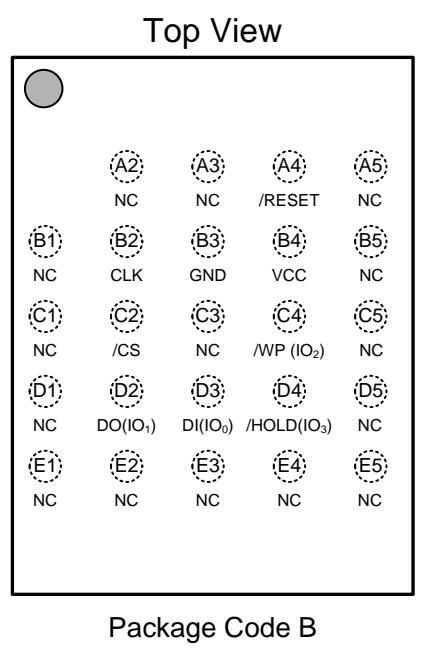

3.6 Ball Configuration TFBGA 8x6-mm (5x5 or 6x4 Ball Array)

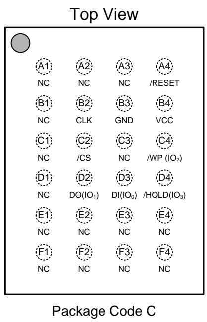

Figure 1d. W25Q128JV Ball Assignments, 24-ball TFBGA 8x6-mm (Package Code B/C)

3.7 Ball Description TFBGA 8x6-mm

<table><tr><td rowspan=1 colspan=1>BALL NO.</td><td rowspan=1 colspan=1>PIN NAME</td><td rowspan=1 colspan=1>1/0</td><td rowspan=1 colspan=1>FUNCTION</td></tr><tr><td rowspan=1 colspan=1>A4</td><td rowspan=1 colspan=1>/RESET</td><td rowspan=1 colspan=1>1</td><td rowspan=1 colspan=1>Reset Input(3)</td></tr><tr><td rowspan=1 colspan=1>B2</td><td rowspan=1 colspan=1>CLK</td><td rowspan=1 colspan=1>1</td><td rowspan=1 colspan=1>Serial Clock Input</td></tr><tr><td rowspan=1 colspan=1>B3</td><td rowspan=1 colspan=1>GND</td><td rowspan=1 colspan=1></td><td rowspan=1 colspan=1>Ground</td></tr><tr><td rowspan=1 colspan=1>B4</td><td rowspan=1 colspan=1>VCC</td><td rowspan=1 colspan=1></td><td rowspan=1 colspan=1>Power Supply</td></tr><tr><td rowspan=1 colspan=1>C2</td><td rowspan=1 colspan=1>/CS</td><td rowspan=1 colspan=1>1</td><td rowspan=1 colspan=1>Chip Select Input</td></tr><tr><td rowspan=1 colspan=1>C4</td><td rowspan=1 colspan=1>/WP (IO2)</td><td rowspan=1 colspan=1>1/0</td><td rowspan=1 colspan=1>Write Protect Input (Data Input Output 2)(2)</td></tr><tr><td rowspan=1 colspan=1>D2</td><td rowspan=1 colspan=1>DO (IO1)</td><td rowspan=1 colspan=1>1/O</td><td rowspan=1 colspan=1>Data Output (Data Input Output 1)(1)</td></tr><tr><td rowspan=1 colspan=1>D3</td><td rowspan=1 colspan=1>DI (IO0)</td><td rowspan=1 colspan=1>1/O</td><td rowspan=1 colspan=1>Data Input (Data Input Output 0)(1)</td></tr><tr><td rowspan=1 colspan=1>D4</td><td rowspan=1 colspan=1>/HOLD (IO3)</td><td rowspan=1 colspan=1>1/0</td><td rowspan=1 colspan=1>Hold or Reset Input (Data Input Output 3)(2)</td></tr><tr><td rowspan=1 colspan=1>Multiple</td><td rowspan=1 colspan=1>NC</td><td rowspan=1 colspan=1></td><td rowspan=1 colspan=1>No Connect</td></tr></table>

Notes:

1. IO0 and IO1 are used for Standard and Dual SPI instructions

2. IO0 – IO3 are used for Quad SPI instructions, /HOLD (or /RESET) function is only available for Standard/Dual SPI.

3. The /RESET pin is a dedicated hardware reset pin regardless of device settings or operation states. If the hardware reset function is not used, this pin can be left floating or connected to VCC in the syste

7

W25Q128JV

# winbond

## 3.8 Ball Configuration WLCSP

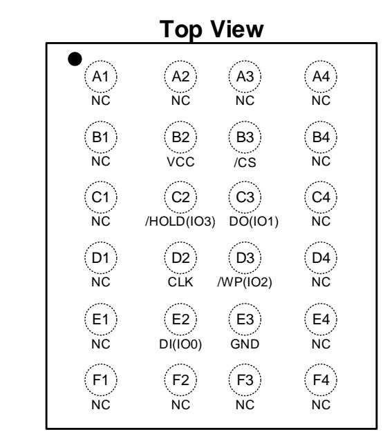

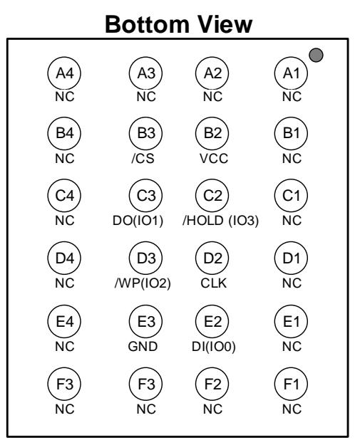

Figure 1e. W25Q128JV Ball Assignments, 24-ball WLCSP (Package Code Y)

## 3.9 Ball Description WLCSP24

<table><tr><td rowspan=1 colspan=1>BALL NO.</td><td rowspan=1 colspan=1>PIN NAME</td><td rowspan=1 colspan=1>1/0</td><td rowspan=1 colspan=1>FUNCTION</td></tr><tr><td rowspan=1 colspan=1>B2</td><td rowspan=1 colspan=1>VCC</td><td rowspan=1 colspan=1></td><td rowspan=1 colspan=1>Power Supply</td></tr><tr><td rowspan=1 colspan=1>B3</td><td rowspan=1 colspan=1>/CS</td><td rowspan=1 colspan=1>1</td><td rowspan=1 colspan=1>Chip Select Input</td></tr><tr><td rowspan=1 colspan=1>C2</td><td rowspan=1 colspan=1>/HOLD (IO3)</td><td rowspan=1 colspan=1>1/0</td><td rowspan=1 colspan=1>Hold Input (Data Input Output 3)*2</td></tr><tr><td rowspan=1 colspan=1>C3</td><td rowspan=1 colspan=1>DO (IO1)</td><td rowspan=1 colspan=1>1/0</td><td rowspan=1 colspan=1>Data Output (Data Input Output 1)*1</td></tr><tr><td rowspan=1 colspan=1>D2</td><td rowspan=1 colspan=1>CLK</td><td rowspan=1 colspan=1>1</td><td rowspan=1 colspan=1>Serial Clock Input</td></tr><tr><td rowspan=1 colspan=1>D3</td><td rowspan=1 colspan=1>/WP (IO2)</td><td rowspan=1 colspan=1>1/O</td><td rowspan=1 colspan=1>Write Protect Input (Data Input Output 2)*2</td></tr><tr><td rowspan=1 colspan=1>E2</td><td rowspan=1 colspan=1>DI (IO0)</td><td rowspan=1 colspan=1>1/0</td><td rowspan=1 colspan=1>Data Input (Data Input Output 0)*1</td></tr><tr><td rowspan=1 colspan=1>E3</td><td rowspan=1 colspan=1>GND</td><td rowspan=1 colspan=1></td><td rowspan=1 colspan=1>Ground</td></tr></table>

Notes:

1. IO0 and IO1 are used for Standard and Dual SPI instructions

2. IO0 – IO3 are used for Quad SPI instructions, /HOLD (or /RESET) function is only available for Standard/Dual SPI.

8

Publication Release Date: March 27, 2018 Revision F

W25Q128JV

# winbond

## 4. PIN DESCRIPTIONS

## 4.1 Chip Select (/CS)

The SPI Chip Select (/CS) pin enables and disables device operation. When /CS is high the device is deselected and the Serial Data Output (DO, or IO0, IO1, IO2, IO3) pins are at high impedance. When deselected, the devices power consumption will be at standby levels unless an internal erase, program or write status register cycle is in progress. When /CS is brought low the device will be selected, power consumption will increase to active levels and instructions can be written to and data read from the device. After power-up, /CS must transition from high to low before a new instruction will be accepted. The /CS input must track the VCC supply level at power-up and power-down (see “Write Protection” and Figure 58). If needed a pull-up resister on the /CS pin can be used to accomplish this.

## 4.2 Serial Data Input, Output and IOs (DI, DO and IO0, IO1, IO2, IO3)

The W25Q128JV supports standard SPI, Dual SPI and Quad SPI operation. Standard SPI instructions use the unidirectional DI (input) pin to serially write instructions, addresses or data to the device on the rising edge of the Serial Clock (CLK) input pin. Standard SPI also uses the unidirectional DO (output) to read data or status from the device on the falling edge of CLK.

Dual and Quad SPI instructions use the bidirectional IO pins to serially write instructions, addresses or data to the device on the rising edge of CLK and read data or status from the device on the falling edge of CLK. Quad SPI instructions require the non-volatile Quad Enable bit (QE) in Status Register-2 to be set. When QE=1, the /WP pin becomes IO2 and the /HOLD pin becomes IO3.

## 4.3 Write Protect (/WP)

The Write Protect (/WP) pin can be used to prevent the Status Register from being written. Used in conjunction with the Status Register’s Block Protect (CMP, SEC, TB, BP2, BP1 and BP0) bits and Status Register Protect (SRP) bits, a portion as small as a 4KB sector or the entire memory array can be hardware protected. The /WP pin is active low.

## 4.4 HOLD (/HOLD)

The /HOLD pin allows the device to be paused while it is actively selected. When /HOLD is brought low, while /CS is low, the DO pin will be at high impedance and signals on the DI and CLK pins will be ignored (don’t care). When /HOLD is brought high, device operation can resume. The /HOLD function can be useful when multiple devices are sharing the same SPI signals. The /HOLD pin is active low. When the QE bit of Status Register-2 is set for Quad I/O, the /HOLD pin function is not available since this pin is used for IO3. See Figure 1a-c for the pin configuration of Quad I/O operation.

## 4.5 Serial Clock (CLK)

The SPI Serial Clock Input (CLK) pin provides the timing for serial input and output operations. ("See SPI Operations")

## 4.6 Reset (/RESET)

A dedicated hardware /RESET pin is available on SOIC-16 and TFBGA packages. When it’s driven low for a minimum period of \~1µS, this device will terminate any external or internal operations and return to its power-on state.

Note: Hardware /RESET pin is available on SOIC-16 or TFBGA; please contact Winbond for this package.

9

W25Q128JV

5. BLOCK DIAGRAM

winbond

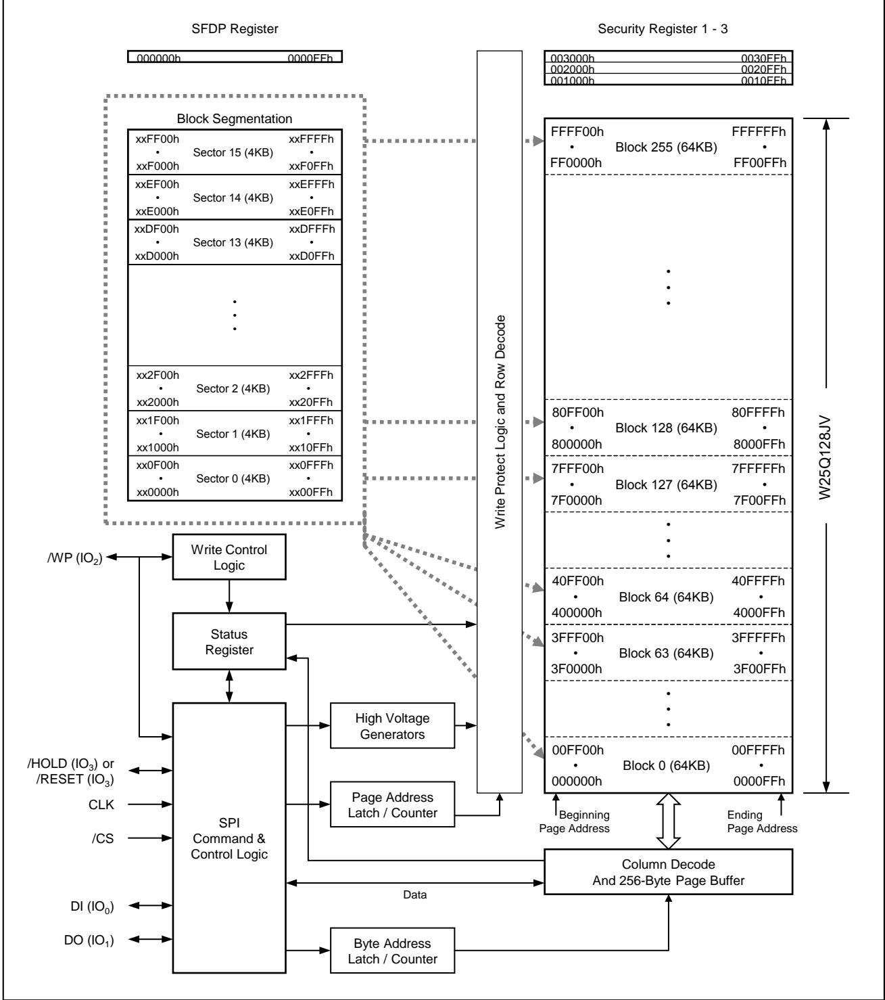

Figure 2. W25Q128JV Serial Flash Memory Block Diagram

10

Publication Release Date: March 27, 2018 Revision F

W25Q128JV

## 6. FUNCTIONAL DESCRIPTIONS

## 6.1 Standard SPI Instructions

The W25Q128JV is accessed through an SPI compatible bus consisting of four signals: Serial Clock (CLK), Chip Select (/CS), Serial Data Input (DI) and Serial Data Output (DO). Standard SPI instructions use the DI input pin to serially write instructions, addresses or data to the device on the rising edge of CLK. The DO output pin is used to read data or status from the device on the falling edge of CLK.

SPI bus operation Mode 0 (0,0) and 3 (1,1) are supported. The primary difference between Mode 0 and Mode 3 concerns the normal state of the CLK signal when the SPI bus master is in standby and data is not being transferred to the Serial Flash. For Mode 0, the CLK signal is normally low on the falling and rising edges of /CS. For Mode 3, the CLK signal is normally high on the falling and rising edges of /CS.

## 6.2 Dual SPI Instructions

The W25Q128JV supports Dual SPI operation when using instructions such as “Fast Read Dual Output (3Bh)” and “Fast Read Dual I/O (BBh)”. These instructions allow data to be transferred to or from the device at two to three times the rate of ordinary Serial Flash devices. The Dual SPI Read instructions are ideal for quickly downloading code to RAM upon power-up (code-shadowing) or for executing non-speedcritical code directly from the SPI bus (XIP). When using Dual SPI instructions, the DI and DO pins become bidirectional I/O pins: IO0 and IO1.

## 6.3 Quad SPI Instructions

The W25Q128JV supports Quad SPI operation when using instructions such as “Fast Read Quad Output (6Bh)”, and “Fast Read Quad I/O (EBh). These instructions allow data to be transferred to or from the device four to six times the rate of ordinary Serial Flash. When using Quad SPI instructions, the DI and DO pins become bidirectional IO0 and IO1, with the additional I/O pins: IO2, IO3.

## 6.4 Software Reset & Hardware /RESET pin

The W25Q128JV can be reset to the initial power-on state by a software Reset sequence. This sequence must include two consecutive instructions: Enable Reset (66h) & Reset (99h). If the instruction sequence is successfully accepted, the device will take approximately 30µS (tRST) to reset. No instruction will be accepted during the reset period. For the SOIC-16 and TFBGA packages, W25Q128JV provides a dedicated hardware /RESET pin. Drive the /RESET pin low for a minimum period of \~1µS (tRESET\*) will interrupt any on-going external/internal operations and reset the device to its initial power-on state. Hardware /RESET pin has higher priority than other SPI input signals (/CS, CLK, IOs).

## Note:

1. Hardware /RESET pin is available on SOIC-16 or TFBGA; please contact Winbond for his package.

2. While a faster /RESET pulse (as short as a few hundred nanoseconds) will often reset the device, a 1us minimum is recommended to ensure reliable operation.

3. There is an internal pull-up resistor for the dedicated /RESET pin on the SOIC-16 and TFBGA-24 package. If the reset function is not needed, this pin can be left floating in the system.

11

W25Q128JV

# winbond

## 6.5 Write Protection

Applications that use non-volatile memory must take into consideration the possibility of noise and other adverse system conditions that may compromise data integrity. To address this concern, the W25Q128JV provides several means to protect the data from inadvertent writes.

## 6.5.1 Write Protect Features

Device resets when VCC is below threshold

 Time delay write disable after Power-up

 Write enable/disable instructions and automatic write disable after erase or program

 Software and Hardware (/WP pin) write protection using Status Registers

 Additional Individual Block/Sector Locks for array protection

 Write Protection using Power-down instruction

 Lock Down write protection for Status Register until the next power-up

 One Time Program (OTP) write protection for array and Security Registers using Status Register

\* Note: This feature is available upon special flow. Please contact Winbond for details.

Upon power-up or at power-down, the W25Q128JV will maintain a reset condition while VCC is below the threshold value of VWI, (See Power-up Timing and Voltage Levels and Figure 43). While reset, all operations are disabled and no instructions are recognized. During power-up and after the VCC voltage exceeds VWI, all program and erase related instructions are further disabled for a time delay of tPUW. This includes the Write Enable, Page Program, Sector Erase, Block Erase, Chip Erase and the Write Status Register instructions. Note that the chip select pin (/CS) must track the VCC supply level at power-up until the VCC-min level and tVSL time delay is reached, and it must also track the VCC supply level at powerdown to prevent adverse command sequence. If needed a pull-up resister on /CS can be used to accomplish this.

After power-up the device is automatically placed in a write-disabled state with the Status Register Write Enable Latch (WEL) set to a 0. A Write Enable instruction must be issued before a Page Program, Sector Erase, Block Erase, Chip Erase or Write Status Register instruction will be accepted. After completing a program, erase or write instruction the Write Enable Latch (WEL) is automatically cleared to a writedisabled state of 0.

Software controlled write protection is facilitated using the Write Status Register instruction and setting the Status Register Protect (SRP, SRL) and Block Protect (CMP, TB, BP[3:0]) bits. These settings allow a portion or the entire memory array to be configured as read only. Used in conjunction with the Write Protect (/WP) pin, changes to the Status Register can be enabled or disabled under hardware control. See Status Register section for further information. Additionally, the Power-down instruction offers an extra level of write protection as all instructions are ignored except for the Release Power-down instruction.

The W25Q128JV also provides another Write Protect method using the Individual Block Locks. Each 64KB block (except the top and bottom blocks, total of 126 blocks) and each 4KB sector within the top/bottom blocks (total of 32 sectors) are equipped with an Individual Block Lock bit. When the lock bit is 0, the corresponding sector or block can be erased or programmed; when the lock bit is set to 1, Erase or Program commands issued to the corresponding sector or block will be ignored. When the device is powered on, all Individual Block Lock bits will be 1, so the entire memory array is protected from Erase/Program. An “Individual Block Unlock (39h)” instruction must be issued to unlock any specific sector or block.

The WPS bit in Status Register-3 is used to decide which Write Protect scheme should be used. When WPS=0 (factory default), the device will only utilize CMP, SEC, TB, BP[2:0] bits to protect specific areas of the array; when WPS=1, the device will utilize the Individual Block Locks for write protection.

12

Publication Release Date: March 27, 2018 Revision F

W25Q128JV

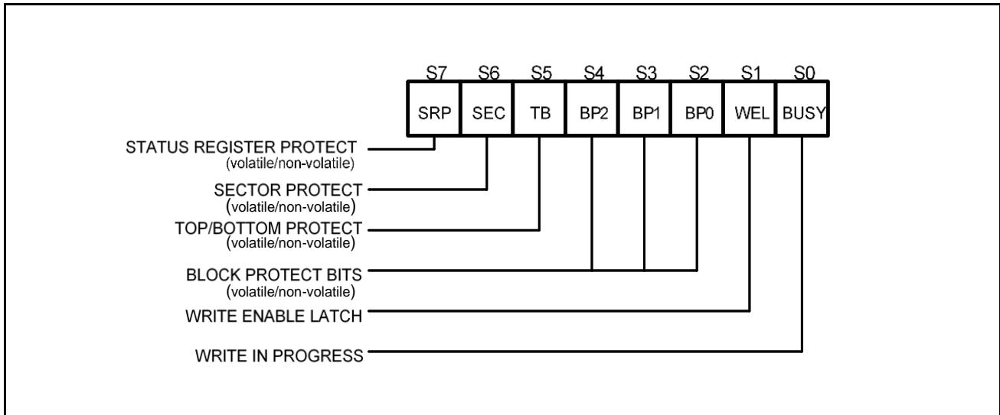

Figure 4a. Status Register-1

# winbond

## 7. STATUS AND CONFIGURATION REGISTERS

Three Status and Configuration Registers are provided for W25Q128JV. The Read Status Register-1/2/3 instructions can be used to provide status on the availability of the flash memory array, whether the device is write enabled or disabled, the state of write protection, Quad SPI setting, Security Register lock status, Erase/Program Suspend status, output driver strength, power-up. The Write Status Register instruction can be used to configure the device write protection features, Quad SPI setting, Security Register OTP locks, and output driver strength. Write access to the Status Register is controlled by the state of the non-volatile Status Register Protect bits (SRL), the Write Enable instruction, and during Standard/Dual SPI operations

## 7.1 Status Registers

## 7.1.1 Erase/Write In Progress (BUSY) – Status Only

BUSY is a read only bit in the status register (S0) that is set to a 1 state when the device is executing a Page Program, Quad Page Program, Sector Erase, Block Erase, Chip Erase, Write Status Register or Erase/Program Security Register instruction. During this time the device will ignore further instructions except for the Read Status Register and Erase/Program Suspend instruction (see tW, tPP, tSE, tBE, and tCE in AC Characteristics). When the program, erase or write status/security register instruction has completed, the BUSY bit will be cleared to a 0 state indicating the device is ready for further instructions.

## 7.1.2 Write Enable Latch (WEL) – Status Only

Write Enable Latch (WEL) is a read only bit in the status register (S1) that is set to 1 after executing a Write Enable Instruction. The WEL status bit is cleared to 0 when the device is write disabled. A write disable state occurs upon power-up or after any of the following instructions: Write Disable, Page Program, Quad Page Program, Sector Erase, Block Erase, Chip Erase, Write Status Register, Erase Security Register and Program Security Register.

## 7.1.3 Block Protect Bits (BP2, BP1, BP0) – Volatile/Non-Volatile Writable

The Block Protect Bits (BP2, BP1, BP0) are non-volatile read/write bits in the status register (S4, S3, and S2) that provide Write Protection control and status. Block Protect bits can be set using the Write Status Register Instruction (see tW in AC characteristics). All, none or a portion of the memory array can be protected from Program and Erase instructions (see Status Register Memory Protection table). The factory default setting for the Block Protection Bits is 0, none of the array protected.

13

W25Q128JV

## winbond

## 7.1.4 Top/Bottom Block Protect (TB) – Volatile/Non-Volatile Writable

The non-volatile Top/Bottom bit (TB) controls if the Block Protect Bits (BP2, BP1, BP0) protect from the Top (TB=0) or the Bottom (TB=1) of the array as shown in the Status Register Memory Protection table. The factory default setting is TB=0. The TB bit can be set with the Write Status Register Instruction depending on the state of the SRP, SRL and WEL bits.

## 7.1.5 Sector/Block Protect Bit (SEC) – Volatile/Non-Volatile Writable

The non-volatile Sector/Block Protect bit (SEC) controls if the Block Protect Bits (BP2, BP1, BP0) protect either 4KB Sectors (SEC=1) or 64KB Blocks (SEC=0) in the Top (TB=0) or the Bottom (TB=1) of the array as shown in the Status Register Memory Protection table. The default setting is SEC=0.

## 7.1.6 Complement Protect (CMP) – Volatile/Non-Volatile Writable

The Complement Protect bit (CMP) is a non-yolatile read/write bit in the status register (S14). It is used in conjunction with SEC, TB, BP2, BP1 and BP0 bits to provide more flexibility for the array protection. Once CMP is set to 1, previous array protection set by SEC, TB, BP2, BP1 and BP0 will be reversed. For instance, when CMP=0, a top 64KB block can be protected while the rest of the array is not; when CMP=1, the top 64KB block will become unprotected while the rest of the array become read-only. Please refer to the Status Register Memory Protection table for details. The default setting is CMP=0.

14

Publication Release Date: March 27, 2018 Revision F

W25Q128JV

# winbond

## 7.1.1 Status Register Protect (SRP, SRL) – Volatile/Non-Volatile Writable

Three Status and Configuration Registers are provided for W25Q128JV. The Read Status Register-1/2/3 instructions can be used to provide status on the availability of the flash memory array, whether the device is write enabled or disabled, the state of write protection, Quad SPI setting, Security Register lock status, Erase/Program Suspend status,and output driver strength, The Write Status Register instruction can be used to configure the device write protection features, Quad SPI setting, Security Register OTP locks, output driver. Write access to the Status Register is controlled by the state of the non-volatile Status Register Protect bits (SRP, SRL), the Write Enable instruction, and during Standard/Dual SPI operations, the /WP pin.

<table><tr><td rowspan=1 colspan=1>SRL</td><td rowspan=1 colspan=1>SRP</td><td rowspan=1 colspan=1>/WP</td><td rowspan=1 colspan=1>StatusRegister</td><td rowspan=1 colspan=1>Description</td></tr><tr><td rowspan=1 colspan=1>0</td><td rowspan=1 colspan=1>0</td><td rowspan=1 colspan=1>X</td><td rowspan=1 colspan=1>SoftwareProtection</td><td rowspan=1 colspan=1>/WP pin has no control. The Status register can be written toafter a Write Enable instruction, WEL=1. [Factory Default]</td></tr><tr><td rowspan=1 colspan=1>0</td><td rowspan=1 colspan=1>1</td><td rowspan=1 colspan=1>0</td><td rowspan=1 colspan=1>HardwareProtected</td><td rowspan=1 colspan=1>When /WP pin is low the Status Register locked and cannot bewritten to.</td></tr><tr><td rowspan=1 colspan=1>0</td><td rowspan=1 colspan=1>1</td><td rowspan=1 colspan=1>1</td><td rowspan=1 colspan=1>HardwareUnprotected</td><td rowspan=1 colspan=1>When /WP pin is high the Status register is unlocked and canbe written to after a Write Enable instruction, WEL=1.</td></tr><tr><td rowspan=1 colspan=1>1</td><td rowspan=1 colspan=1>X</td><td rowspan=1 colspan=1>X</td><td rowspan=1 colspan=1>Power SupplyLock-Down</td><td rowspan=1 colspan=1>Status Register is protected and cannot be written to again untilthe next power-down, power-up cycle.(1)</td></tr><tr><td rowspan=1 colspan=1>1</td><td rowspan=1 colspan=1>X</td><td rowspan=1 colspan=1>X</td><td rowspan=1 colspan=1>One TimeProgram(²)</td><td rowspan=1 colspan=1>Status Register is permanently protected and cannot be writtento. (enabled by adding prefix command AAh, 55h)</td></tr></table>

1. When SRL =1 , a power-down, power-up cycle will change SRL =0 state.

2. Please contact Winbond for details regarding the special instruction sequence.

15

W25Q128JV

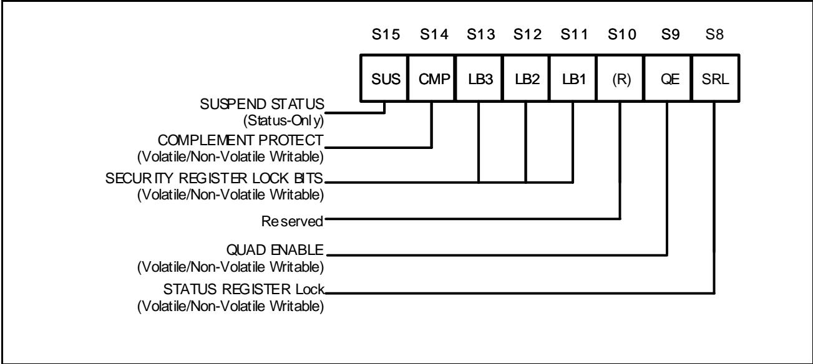

Figure 4b. Status Register-2

## 7.1.2 Erase/Program Suspend Status (SUS) – Status Only

The Suspend Status bit is a read only bit in the status register (S15) that is set to 1 after executing a Erase/Program Suspend (75h) instruction. The SUS status bit is cleared to 0 by Erase/Program Resume (7Ah) instruction as well as a power-down, power-up cycle.

## 7.1.3 Security Register Lock Bits (LB3, LB2, LB1) – Volatile/Non-Volatile OTP Writable

The Security Register Lock Bits (LB3, LB2, LB1) are non-volatile One Time Program (OTP) bits in Status Register (S13, S12, S11) that provide the write protect control and status to the Security Registers. The default state of LB3-1 is 0, Security Registers are unlocked. LB3-1 can be set to 1 individually using the Write Status Register instruction. LB3-1 are One Time Programmable (OTP), once it’s set to 1, the corresponding 256-Byte Security Register will become read-only permanently.

## 7.1.4 Quad Enable (QE) – Volatile/Non-Volatile Writable

The Quad Enable (QE) bit is a non-volatile read/write bit in the status register (S9) that enables Quad SPI operation. When the QE bit is set to a 0 state (factory default for part numbers with ordering options “IM” & “JM”), the /HOLD are enabled, the device operates in Standard/Dual SPI modes. When the QE bit is set to a 1 (factory fixed default for part numbers with ordering options “IQ” & “JQ”), the Quad IO2 and IO3 pins are enabled, and /HOLD function is disabled, the device operates in Standard/Dual/Quad SPI modes.

Note: QE bit is set to a 0 state, factory default for part numbers with ordering options “IM” or ”JM”; please see W25Q128JV-DTR data sheet.

16

Publication Release Date: March 27, 2018 Revision F

W25Q128JV

Figure 4c. Status Register-3

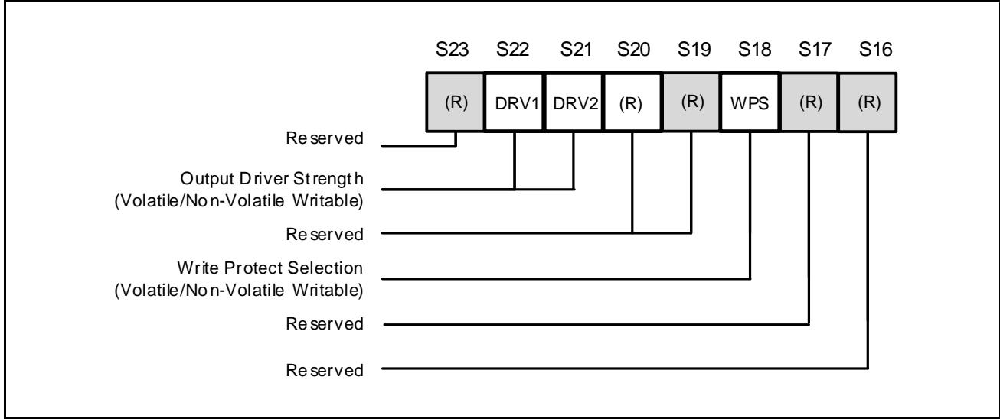

## 7.1.5 Write Protect Selection (WPS) – Volatile/Non-Volatile Writable

The WPS bit is used to select which Write Protect scheme should be used. When WPS=0, the device will use the combination of CMP, SEC, TB, BP[2:0] bits to protect a specific area of the memory array. When WPS=1, the device will utilize the Individual Block Locks to protect any individual sector or blocks. The default value for all Individual Block Lock bits is 1 upon device power on or after reset.

## 7.1.6 Output Driver Strength (DRV1, DRV0) – Volatile/Non-Volatile Writable

The DRV1 & DRV0 bits are used to determine the output driver strength for the Read operations.

<table><tr><td rowspan=1 colspan=1>DRV1, DRV0</td><td rowspan=1 colspan=1>Driver Strength</td></tr><tr><td rowspan=1 colspan=1>0,0</td><td rowspan=1 colspan=1>100%</td></tr><tr><td rowspan=1 colspan=1>0,1</td><td rowspan=1 colspan=1>75%</td></tr><tr><td rowspan=1 colspan=1>1,0</td><td rowspan=1 colspan=1>50%</td></tr><tr><td rowspan=1 colspan=1>1,1</td><td rowspan=1 colspan=1>25% (default)</td></tr></table>

## 7.1.7 Reserved Bits – Non Functional

There are a few reserved Status Register bits that may be read out as a “0” or “1”. It is recommended to ignore the values of those bits. During a “Write Status Register” instruction, the Reserved Bits can be written as “0”, but there will not be any effects.

17

W25Q128JV

# winbond

## 7.1.8 W25Q128JV Status Register Memory Protection (WPS = 0, CMP = 0)

<table><tr><td rowspan=1 colspan=5>STATUS REGISTER(1)</td><td rowspan=1 colspan=4>W25Q128JV (128M-BIT) MEMORY PROTECTION(3)</td></tr><tr><td rowspan=1 colspan=1>SEC</td><td rowspan=1 colspan=1>TB</td><td rowspan=1 colspan=1>BP2</td><td rowspan=1 colspan=1>BP1</td><td rowspan=1 colspan=1>BP0</td><td rowspan=1 colspan=1>PROTECTEDBLOCK(S)</td><td rowspan=1 colspan=1>PROTECTEDADDRESSES</td><td rowspan=1 colspan=1>PROTECTEDDENSITY</td><td rowspan=1 colspan=1>PROTECTEDPORTION(2)</td></tr><tr><td rowspan=1 colspan=1>X</td><td rowspan=1 colspan=1>X</td><td rowspan=1 colspan=1>0</td><td rowspan=1 colspan=1>0</td><td rowspan=1 colspan=1>0</td><td rowspan=1 colspan=1>NONE</td><td rowspan=1 colspan=1>NONE</td><td rowspan=1 colspan=1>NONE</td><td rowspan=1 colspan=1>NONE</td></tr><tr><td rowspan=1 colspan=1>0</td><td rowspan=1 colspan=1>0</td><td rowspan=1 colspan=1>0</td><td rowspan=1 colspan=1>0</td><td rowspan=1 colspan=1>1</td><td rowspan=1 colspan=1>252 thru 255</td><td rowspan=1 colspan=1>FC0000h – FFFFFFh</td><td rowspan=1 colspan=1>256KB</td><td rowspan=1 colspan=1>Upper 1/64</td></tr><tr><td rowspan=1 colspan=1>0</td><td rowspan=1 colspan=1>0</td><td rowspan=1 colspan=1>0</td><td rowspan=1 colspan=1>1</td><td rowspan=1 colspan=1>0</td><td rowspan=1 colspan=1>248 thru 255</td><td rowspan=1 colspan=1>F80000h – FFFFFFh</td><td rowspan=1 colspan=1>512KB</td><td rowspan=1 colspan=1>Upper 1/32</td></tr><tr><td rowspan=1 colspan=1>0</td><td rowspan=1 colspan=1>0</td><td rowspan=1 colspan=1>0</td><td rowspan=1 colspan=1>1</td><td rowspan=1 colspan=1>1</td><td rowspan=1 colspan=1>240 thru 255</td><td rowspan=1 colspan=1>F00000h – FFFFFFh</td><td rowspan=1 colspan=1>1MB</td><td rowspan=1 colspan=1>Upper 1/16</td></tr><tr><td rowspan=1 colspan=1>0</td><td rowspan=1 colspan=1>0</td><td rowspan=1 colspan=1>1</td><td rowspan=1 colspan=1>0</td><td rowspan=1 colspan=1>0</td><td rowspan=1 colspan=1>224 thru 255</td><td rowspan=1 colspan=1>E00000h – FFFFFFh</td><td rowspan=1 colspan=1>2MB</td><td rowspan=1 colspan=1>Upper 1/8</td></tr><tr><td rowspan=1 colspan=1>0</td><td rowspan=1 colspan=1>0</td><td rowspan=1 colspan=1>1</td><td rowspan=1 colspan=1>0</td><td rowspan=1 colspan=1>1</td><td rowspan=1 colspan=1>192 thru 255</td><td rowspan=1 colspan=1>C00000h - FFFFFFh</td><td rowspan=1 colspan=1>4MB</td><td rowspan=1 colspan=1>Upper 1/4</td></tr><tr><td rowspan=1 colspan=1>0</td><td rowspan=1 colspan=1>0</td><td rowspan=1 colspan=1>1</td><td rowspan=1 colspan=1>1</td><td rowspan=1 colspan=1>0</td><td rowspan=1 colspan=1>128 thru 255</td><td rowspan=1 colspan=1>800000h - FFFFFFh</td><td rowspan=1 colspan=1>8MB</td><td rowspan=1 colspan=1>Upper 1/2</td></tr><tr><td rowspan=1 colspan=1>0</td><td rowspan=1 colspan=1>1</td><td rowspan=1 colspan=1>0</td><td rowspan=1 colspan=1>0</td><td rowspan=1 colspan=1>1</td><td rowspan=1 colspan=1>0 thru 3</td><td rowspan=1 colspan=1>000000h - 03FFFFh</td><td rowspan=1 colspan=1>256KB</td><td rowspan=1 colspan=1>Lower 1/64</td></tr><tr><td rowspan=1 colspan=1>0</td><td rowspan=1 colspan=1>1</td><td rowspan=1 colspan=1>0</td><td rowspan=1 colspan=1>1</td><td rowspan=1 colspan=1>0</td><td rowspan=1 colspan=1>0 thru 7</td><td rowspan=1 colspan=1>000000h – 07FFFFh</td><td rowspan=1 colspan=1>512KB</td><td rowspan=1 colspan=1>Lower 1/32</td></tr><tr><td rowspan=1 colspan=1>0</td><td rowspan=1 colspan=1>1</td><td rowspan=1 colspan=1>0</td><td rowspan=1 colspan=1>1</td><td rowspan=1 colspan=1>1</td><td rowspan=1 colspan=1>0 thru 15</td><td rowspan=1 colspan=1>000000h – 0FFFFFh</td><td rowspan=1 colspan=1>1MB</td><td rowspan=1 colspan=1>Lower 1/16</td></tr><tr><td rowspan=1 colspan=1>0</td><td rowspan=1 colspan=1>1</td><td rowspan=1 colspan=1>1</td><td rowspan=1 colspan=1>0</td><td rowspan=1 colspan=1>0</td><td rowspan=1 colspan=1>0 thru 31</td><td rowspan=1 colspan=1>000000h - 1FFFFFh</td><td rowspan=1 colspan=1>2MB</td><td rowspan=1 colspan=1>Lower 1/8</td></tr><tr><td rowspan=1 colspan=1>0</td><td rowspan=1 colspan=1>1</td><td rowspan=1 colspan=1>1</td><td rowspan=1 colspan=1>0</td><td rowspan=1 colspan=1>1</td><td rowspan=1 colspan=1>0 thru 63</td><td rowspan=1 colspan=1>000000h - 3FFFFFh</td><td rowspan=1 colspan=1>4MB</td><td rowspan=1 colspan=1>Lower 1/4</td></tr><tr><td rowspan=1 colspan=1>0</td><td rowspan=1 colspan=1>1</td><td rowspan=1 colspan=1>1</td><td rowspan=1 colspan=1>1</td><td rowspan=1 colspan=1>0</td><td rowspan=1 colspan=1>0 thru 127</td><td rowspan=1 colspan=1>000000h – 7FFFFFh</td><td rowspan=1 colspan=1>8MB</td><td rowspan=1 colspan=1>Lower 1/2</td></tr><tr><td rowspan=1 colspan=1>X</td><td rowspan=1 colspan=1>X</td><td rowspan=1 colspan=1>1</td><td rowspan=1 colspan=1>1</td><td rowspan=1 colspan=1>1</td><td rowspan=1 colspan=1>0 thru 255</td><td rowspan=1 colspan=1>000000h - FFFFFFh</td><td rowspan=1 colspan=1>16MB</td><td rowspan=1 colspan=1>ALL</td></tr><tr><td rowspan=1 colspan=1>1</td><td rowspan=1 colspan=1>0</td><td rowspan=1 colspan=1>0</td><td rowspan=1 colspan=1>0</td><td rowspan=1 colspan=1>1</td><td rowspan=1 colspan=1>255</td><td rowspan=1 colspan=1>FFF000h - FFFFFFh</td><td rowspan=1 colspan=1>4KB</td><td rowspan=1 colspan=1>U - 1/4096</td></tr><tr><td rowspan=1 colspan=1>1</td><td rowspan=1 colspan=1>0</td><td rowspan=1 colspan=1>0</td><td rowspan=1 colspan=1>1</td><td rowspan=1 colspan=1>0</td><td rowspan=1 colspan=1>255</td><td rowspan=1 colspan=1>FFE000h – FFFFFFh</td><td rowspan=1 colspan=1>8KB</td><td rowspan=1 colspan=1>U - 1/2048</td></tr><tr><td rowspan=1 colspan=1>1</td><td rowspan=1 colspan=1>0</td><td rowspan=1 colspan=1>0</td><td rowspan=1 colspan=1>1</td><td rowspan=1 colspan=1>1</td><td rowspan=1 colspan=1>255</td><td rowspan=1 colspan=1>FFC000h - FFFFFFh</td><td rowspan=1 colspan=1>16KB</td><td rowspan=1 colspan=1>U - 1/1024</td></tr><tr><td rowspan=1 colspan=1>1</td><td rowspan=1 colspan=1>0</td><td rowspan=1 colspan=1>1</td><td rowspan=1 colspan=1>0</td><td rowspan=1 colspan=1>X</td><td rowspan=1 colspan=1>255</td><td rowspan=1 colspan=1>FF8000h – FFFFFFh</td><td rowspan=1 colspan=1>32KB</td><td rowspan=1 colspan=1>U - 1/512</td></tr><tr><td rowspan=1 colspan=1>1</td><td rowspan=1 colspan=1>1</td><td rowspan=1 colspan=1>0</td><td rowspan=1 colspan=1>0</td><td rowspan=1 colspan=1>1</td><td rowspan=1 colspan=1>0</td><td rowspan=1 colspan=1>000000h - 000FFFh</td><td rowspan=1 colspan=1>4KB</td><td rowspan=1 colspan=1>L - 1/4096</td></tr><tr><td rowspan=1 colspan=1>1</td><td rowspan=1 colspan=1>1</td><td rowspan=1 colspan=1>0</td><td rowspan=1 colspan=1>1</td><td rowspan=1 colspan=1>0</td><td rowspan=1 colspan=1>0</td><td rowspan=1 colspan=1>000000h - 001FFFh</td><td rowspan=1 colspan=1>8KB</td><td rowspan=1 colspan=1>L - 1/2048</td></tr><tr><td rowspan=1 colspan=1>1</td><td rowspan=1 colspan=1>1</td><td rowspan=1 colspan=1>0</td><td rowspan=1 colspan=1>1</td><td rowspan=1 colspan=1>1</td><td rowspan=1 colspan=1>0</td><td rowspan=1 colspan=1>000000h - 003FFFh</td><td rowspan=1 colspan=1>16KB</td><td rowspan=1 colspan=1>L - 1/1024</td></tr><tr><td rowspan=1 colspan=1>1</td><td rowspan=1 colspan=1>1</td><td rowspan=1 colspan=1>1</td><td rowspan=1 colspan=1>0</td><td rowspan=1 colspan=1>X</td><td rowspan=1 colspan=1>0</td><td rowspan=1 colspan=1>000000h - 007FFFh</td><td rowspan=1 colspan=1>32KB</td><td rowspan=1 colspan=1>L- 1/512</td></tr></table>

Notes:

1. X = don’t care

2. L = Lower; U = Upper

3. If any Erase or Program command specifies a memory region that contains protected data portion, this command will be ignored.

18

Publication Release Date: March 27, 2018 Revision F

W25Q128JV

# winbond

## 7.1.9 W25Q128JV Status Register Memory Protection (WPS = 0, CMP = 1)

<table><tr><td rowspan=1 colspan=5>STATUS REGISTER(1)</td><td rowspan=1 colspan=4>W25Q128JV (128M-BIT) MEMORY PROTECTION(3)</td></tr><tr><td rowspan=1 colspan=1>SEC</td><td rowspan=1 colspan=1>TB</td><td rowspan=1 colspan=1>BP2</td><td rowspan=1 colspan=1>BP1</td><td rowspan=1 colspan=1>BP0</td><td rowspan=1 colspan=1>PROTECTEDBLOCK(S)</td><td rowspan=1 colspan=1>PROTECTEDADDRESSES</td><td rowspan=1 colspan=1>PROTECTEDDENSITY</td><td rowspan=1 colspan=1>PROTECTEDPORTION(2)</td></tr><tr><td rowspan=1 colspan=1>X</td><td rowspan=1 colspan=1>X</td><td rowspan=1 colspan=1>0</td><td rowspan=1 colspan=1>0</td><td rowspan=1 colspan=1>0</td><td rowspan=1 colspan=1>0 thru 255</td><td rowspan=1 colspan=1>000000h - FFFFFFh</td><td rowspan=1 colspan=1>16MB</td><td rowspan=1 colspan=1>ALL</td></tr><tr><td rowspan=1 colspan=1>0</td><td rowspan=1 colspan=1>0</td><td rowspan=1 colspan=1>0</td><td rowspan=1 colspan=1>0</td><td rowspan=1 colspan=1>1</td><td rowspan=1 colspan=1>0 thru 251</td><td rowspan=1 colspan=1>000000h - FBFFFFh</td><td rowspan=1 colspan=1>16,128KB</td><td rowspan=1 colspan=1>Lower 63/64</td></tr><tr><td rowspan=1 colspan=1>0</td><td rowspan=1 colspan=1>0</td><td rowspan=1 colspan=1>0</td><td rowspan=1 colspan=1>1</td><td rowspan=1 colspan=1>0</td><td rowspan=1 colspan=1>0 thru 247</td><td rowspan=1 colspan=1>000000h – F7FFFFh</td><td rowspan=1 colspan=1>15,872KB</td><td rowspan=1 colspan=1>Lower 31/32</td></tr><tr><td rowspan=1 colspan=1>0</td><td rowspan=1 colspan=1>0</td><td rowspan=1 colspan=1>0</td><td rowspan=1 colspan=1>1</td><td rowspan=1 colspan=1>1</td><td rowspan=1 colspan=1>0 thru 239</td><td rowspan=1 colspan=1>000000h - EFFFFFh</td><td rowspan=1 colspan=1>15MB</td><td rowspan=1 colspan=1>Lower 15/16</td></tr><tr><td rowspan=1 colspan=1>0</td><td rowspan=1 colspan=1>0</td><td rowspan=1 colspan=1>1</td><td rowspan=1 colspan=1>0</td><td rowspan=1 colspan=1>0</td><td rowspan=1 colspan=1>0 thru 223</td><td rowspan=1 colspan=1>000000h - DFFFFFh</td><td rowspan=1 colspan=1>14MB</td><td rowspan=1 colspan=1>Lower 7/8</td></tr><tr><td rowspan=1 colspan=1>0</td><td rowspan=1 colspan=1>0</td><td rowspan=1 colspan=1>1</td><td rowspan=1 colspan=1>0</td><td rowspan=1 colspan=1>1</td><td rowspan=1 colspan=1>0 thru 191</td><td rowspan=1 colspan=1>000000h - BFFFFFh</td><td rowspan=1 colspan=1>12MB</td><td rowspan=1 colspan=1>Lower 3/4</td></tr><tr><td rowspan=1 colspan=1>0</td><td rowspan=1 colspan=1>0</td><td rowspan=1 colspan=1>1</td><td rowspan=1 colspan=1>1</td><td rowspan=1 colspan=1>0</td><td rowspan=1 colspan=1>0 thru 127</td><td rowspan=1 colspan=1>000000h - 7FFFFFh</td><td rowspan=1 colspan=1>8MB</td><td rowspan=1 colspan=1>Lower 1/2</td></tr><tr><td rowspan=1 colspan=1>0</td><td rowspan=1 colspan=1>1</td><td rowspan=1 colspan=1>0</td><td rowspan=1 colspan=1>0</td><td rowspan=1 colspan=1>1</td><td rowspan=1 colspan=1>4 thru 255</td><td rowspan=1 colspan=1>040000h - FFFFFFh</td><td rowspan=1 colspan=1>16,128KB</td><td rowspan=1 colspan=1>Upper 63/64</td></tr><tr><td rowspan=1 colspan=1>0</td><td rowspan=1 colspan=1>1</td><td rowspan=1 colspan=1>0</td><td rowspan=1 colspan=1>1</td><td rowspan=1 colspan=1>0</td><td rowspan=1 colspan=1>8 thru 255</td><td rowspan=1 colspan=1>080000h - FFFFFFh</td><td rowspan=1 colspan=1>15,872KB</td><td rowspan=1 colspan=1>Upper 31/32</td></tr><tr><td rowspan=1 colspan=1>0</td><td rowspan=1 colspan=1>1</td><td rowspan=1 colspan=1>0</td><td rowspan=1 colspan=1>1</td><td rowspan=1 colspan=1>1</td><td rowspan=1 colspan=1>16 thru 255</td><td rowspan=1 colspan=1>100000h - FFFFFFh</td><td rowspan=1 colspan=1>15MB</td><td rowspan=1 colspan=1>Upper 15/16</td></tr><tr><td rowspan=1 colspan=1>0</td><td rowspan=1 colspan=1>1</td><td rowspan=1 colspan=1>1</td><td rowspan=1 colspan=1>0</td><td rowspan=1 colspan=1>0</td><td rowspan=1 colspan=1>32 thru 255</td><td rowspan=1 colspan=1>200000h - FFFFFFh</td><td rowspan=1 colspan=1>14MB</td><td rowspan=1 colspan=1>Upper 7/8</td></tr><tr><td rowspan=1 colspan=1>0</td><td rowspan=1 colspan=1>1</td><td rowspan=1 colspan=1>1</td><td rowspan=1 colspan=1>0</td><td rowspan=1 colspan=1>1</td><td rowspan=1 colspan=1>64 thru 255</td><td rowspan=1 colspan=1>400000h - FFFFFFh</td><td rowspan=1 colspan=1>12MB</td><td rowspan=1 colspan=1>Upper 3/4</td></tr><tr><td rowspan=1 colspan=1>0</td><td rowspan=1 colspan=1>1</td><td rowspan=1 colspan=1>1</td><td rowspan=1 colspan=1>1</td><td rowspan=1 colspan=1>0</td><td rowspan=1 colspan=1>128 thru 255</td><td rowspan=1 colspan=1>800000h - FFFFFFh</td><td rowspan=1 colspan=1>8MB</td><td rowspan=1 colspan=1>Upper 1/2</td></tr><tr><td rowspan=1 colspan=1>X</td><td rowspan=1 colspan=1>X</td><td rowspan=1 colspan=1>1</td><td rowspan=1 colspan=1>1</td><td rowspan=1 colspan=1>1</td><td rowspan=1 colspan=1>NONE</td><td rowspan=1 colspan=1>NONE</td><td rowspan=1 colspan=1>NONE</td><td rowspan=1 colspan=1>NONE</td></tr><tr><td rowspan=1 colspan=1>1</td><td rowspan=1 colspan=1>0</td><td rowspan=1 colspan=1>0</td><td rowspan=1 colspan=1>0</td><td rowspan=1 colspan=1>1</td><td rowspan=1 colspan=1>0 thru 255</td><td rowspan=1 colspan=1>000000h - FFEFFFh</td><td rowspan=1 colspan=1>16,380KB</td><td rowspan=1 colspan=1>L - 4095/4096</td></tr><tr><td rowspan=1 colspan=1>1</td><td rowspan=1 colspan=1>0</td><td rowspan=1 colspan=1>0</td><td rowspan=1 colspan=1>1</td><td rowspan=1 colspan=1>0</td><td rowspan=1 colspan=1>0 thru 255</td><td rowspan=1 colspan=1>000000h – FFDFFFh</td><td rowspan=1 colspan=1>16,376KB</td><td rowspan=1 colspan=1>L- 2047/2048</td></tr><tr><td rowspan=1 colspan=1>1</td><td rowspan=1 colspan=1>0</td><td rowspan=1 colspan=1>0</td><td rowspan=1 colspan=1>1</td><td rowspan=1 colspan=1>1</td><td rowspan=1 colspan=1>0 thru 255</td><td rowspan=1 colspan=1>000000h - FFBFFFh</td><td rowspan=1 colspan=1>16,368KB</td><td rowspan=1 colspan=1>L - 1023/1024</td></tr><tr><td rowspan=1 colspan=1>1</td><td rowspan=1 colspan=1>0</td><td rowspan=1 colspan=1>1</td><td rowspan=1 colspan=1>0</td><td rowspan=1 colspan=1>X</td><td rowspan=1 colspan=1>0 thru 255</td><td rowspan=1 colspan=1>000000h – FF7FFFh</td><td rowspan=1 colspan=1>16,352KB</td><td rowspan=1 colspan=1>L-511/512</td></tr><tr><td rowspan=1 colspan=1>1</td><td rowspan=1 colspan=1>1</td><td rowspan=1 colspan=1>0</td><td rowspan=1 colspan=1>0</td><td rowspan=1 colspan=1>1</td><td rowspan=1 colspan=1>0 thru 255</td><td rowspan=1 colspan=1>001000h – FFFFFFh</td><td rowspan=1 colspan=1>16,380KB</td><td rowspan=1 colspan=1>U - 4095/4096</td></tr><tr><td rowspan=1 colspan=1>1</td><td rowspan=1 colspan=1>1</td><td rowspan=1 colspan=1>0</td><td rowspan=1 colspan=1>1</td><td rowspan=1 colspan=1>0</td><td rowspan=1 colspan=1>0 thru 255</td><td rowspan=1 colspan=1>002000h – FFFFFFh</td><td rowspan=1 colspan=1>16,376KB</td><td rowspan=1 colspan=1>U - 2047/2048</td></tr><tr><td rowspan=1 colspan=1>1</td><td rowspan=1 colspan=1>1</td><td rowspan=1 colspan=1>0</td><td rowspan=1 colspan=1>1</td><td rowspan=1 colspan=1>1</td><td rowspan=1 colspan=1>0 thru 255</td><td rowspan=1 colspan=1>004000h – FFFFFFh</td><td rowspan=1 colspan=1>16,368KB</td><td rowspan=1 colspan=1>U-1023/1024</td></tr><tr><td rowspan=1 colspan=1>1</td><td rowspan=1 colspan=1>1</td><td rowspan=1 colspan=1>1</td><td rowspan=1 colspan=1>0</td><td rowspan=1 colspan=1>X</td><td rowspan=1 colspan=1>0 thru 255</td><td rowspan=1 colspan=1>008000h – FFFFFFh</td><td rowspan=1 colspan=1>16,352KB</td><td rowspan=1 colspan=1>U- 511/512</td></tr></table>

Notes:

1. X = don’t care

2. L = Lower; U = Upper

3. If any Erase or Program command specifies a memory region that contains protected data portion, this command will be ignored.

19

W25Q128JV

# winbond

## 7.1.10 W25Q128JV Individual Block Memory Protection (WPS=1)

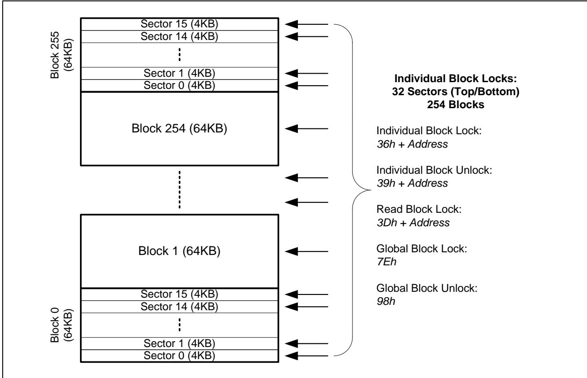

Figure 4d. Individual Block/Sector Locks

## Notes:

1. Individual Block/Sector protection is only valid when WPS=1.

2. All individual block/sector lock bits are set to 1 by default after power up, all memory array is protected.

20

Publication Release Date: March 27, 2018 Revision F

W25Q128JV

## winbond

## 8. INSTRUCTIONS

The Standard/Dual/Quad SPI instruction set of the W25Q128JV consists of 47 basic instructions that are fully controlled through the SPI bus (see Instruction Set Table1-2). Instructions are initiated with the falling edge of Chip Select (/CS). The first byte of data clocked into the DI input provides the instruction code. Data on the DI input is sampled on the rising edge of clock with most significant bit (MSB) first.

Instructions vary in length from a single byte to several bytes and may be followed by address bytes, data bytes, dummy bytes (don’t care), and in some cases, a combination. Instructions are completed with the rising edge of edge /CS. Clock relative timing diagrams for each instruction are included in Figures 5 through 57. All read instructions can be completed after any clocked bit. However, all instructions that Write, Program or Erase must complete on a byte boundary (/CS driven high after a full 8-bits have been clocked) otherwise the instruction will be ignored. This feature further protects the device from inadvertent writes. Additionally, while the memory is being programmed or erased, or when the Status Register is being written, all instructions except for Read Status Register will be ignored until the program or erase cycle has completed.

## 8.1 Device ID and Instruction Set Tables

## 8.1.1 Manufacturer and Device Identification

<table><tr><td rowspan=1 colspan=1>MANUFACTURER ID</td><td rowspan=1 colspan=1>(MF7 - MF0)</td><td rowspan=3 colspan=1></td></tr><tr><td rowspan=1 colspan=1>Winbond Serial Flash</td><td rowspan=1 colspan=1>EFh</td></tr><tr><td rowspan=1 colspan=2></td></tr><tr><td rowspan=1 colspan=1>Device ID</td><td rowspan=1 colspan=1>(ID7 - ID0)</td><td rowspan=1 colspan=1>(ID15 - ID0)</td></tr><tr><td rowspan=1 colspan=1>Instruction</td><td rowspan=1 colspan=1>ABh, 90h, 92h, 94h</td><td rowspan=1 colspan=1>9Fh</td></tr><tr><td rowspan=1 colspan=1>W25Q128JV-IQ/JQ</td><td rowspan=1 colspan=1>17h</td><td rowspan=1 colspan=1>4018h</td></tr><tr><td rowspan=1 colspan=1>W25Q128JV-IM*/JM*</td><td rowspan=1 colspan=1>17h</td><td rowspan=1 colspan=1>7018h</td></tr></table>

Note: For DTR, QPI supporting, please refer to W25Q128JV DTR datasheet.

21

W25Q128JV

8.1.2 Instruction Set Table 1 (Standard SPI Instructions)(1)

<table><tr><td rowspan=1 colspan=1>Data Input Output</td><td rowspan=1 colspan=1>Byte 1</td><td rowspan=1 colspan=1>Byte 2</td><td rowspan=1 colspan=1>Byte 3</td><td rowspan=1 colspan=1>Byte 4</td><td rowspan=1 colspan=1>Byte 5</td><td rowspan=1 colspan=1>Byte 6</td><td rowspan=1 colspan=1>Byte 7</td></tr><tr><td rowspan=1 colspan=1>Number of Clock(1-1-1)</td><td rowspan=1 colspan=1>8</td><td rowspan=1 colspan=1>8</td><td rowspan=1 colspan=1>8</td><td rowspan=1 colspan=1>8</td><td rowspan=1 colspan=1>8</td><td rowspan=1 colspan=1>8</td><td rowspan=1 colspan=1>8</td></tr><tr><td rowspan=1 colspan=1>Write Enable</td><td rowspan=1 colspan=1>06h</td><td rowspan=1 colspan=6></td></tr><tr><td rowspan=1 colspan=1>Volatile SR Write Enable</td><td rowspan=1 colspan=1>50h</td><td rowspan=1 colspan=6></td></tr><tr><td rowspan=1 colspan=1>Write Disable</td><td rowspan=1 colspan=1>04h</td><td rowspan=1 colspan=6></td></tr><tr><td rowspan=1 colspan=1>Release Power-down / ID</td><td rowspan=1 colspan=1>ABh</td><td rowspan=1 colspan=1>Dummy</td><td rowspan=1 colspan=1>Dummy</td><td rowspan=1 colspan=1>Dummy</td><td rowspan=1 colspan=1>(ID7-ID0)(2)</td><td rowspan=1 colspan=2></td></tr><tr><td rowspan=1 colspan=1>Manufacturer/Device ID</td><td rowspan=1 colspan=1>90h</td><td rowspan=1 colspan=1>Dummy</td><td rowspan=1 colspan=1>Dummy</td><td rowspan=1 colspan=1>00h</td><td rowspan=1 colspan=1>(MF7-MF0)</td><td rowspan=1 colspan=1>(ID7-ID0)</td><td rowspan=1 colspan=1></td></tr><tr><td rowspan=1 colspan=1>JEDEC ID</td><td rowspan=1 colspan=1>9Fh</td><td rowspan=1 colspan=1>(MF7-MF0)</td><td rowspan=1 colspan=1>(ID15-ID8)</td><td rowspan=1 colspan=1>(ID7-ID0)</td><td rowspan=1 colspan=1></td><td rowspan=1 colspan=1></td><td rowspan=1 colspan=1></td></tr><tr><td rowspan=1 colspan=1>Read Unique ID</td><td rowspan=1 colspan=1>4Bh</td><td rowspan=1 colspan=1>Dummy</td><td rowspan=1 colspan=1>Dummy</td><td rowspan=1 colspan=1>Dummy</td><td rowspan=1 colspan=1>Dummy</td><td rowspan=1 colspan=1>(UID63-0)</td><td rowspan=1 colspan=1></td></tr><tr><td rowspan=1 colspan=1>Read Data</td><td rowspan=1 colspan=1>03h</td><td rowspan=1 colspan=1>A23-A16</td><td rowspan=1 colspan=1>A15-A8</td><td rowspan=1 colspan=1>A7-A0</td><td rowspan=1 colspan=1>(D7-D0)</td><td rowspan=1 colspan=2></td></tr><tr><td rowspan=1 colspan=1>Fast Read</td><td rowspan=1 colspan=1>0Bh</td><td rowspan=1 colspan=1>A23-A16</td><td rowspan=1 colspan=1>A15-A8</td><td rowspan=1 colspan=1>A7-A0</td><td rowspan=1 colspan=1>Dummy</td><td rowspan=1 colspan=1>(D7-D0)</td><td rowspan=1 colspan=1></td></tr><tr><td rowspan=1 colspan=1>Page Program</td><td rowspan=1 colspan=1>02h</td><td rowspan=1 colspan=1>A23-A16</td><td rowspan=1 colspan=1>A15-A8</td><td rowspan=1 colspan=1>A7-A0</td><td rowspan=1 colspan=1>D7-D0</td><td rowspan=1 colspan=1>D7-D0(3)</td><td rowspan=1 colspan=1></td></tr><tr><td rowspan=1 colspan=1>Sector Erase (4KB)</td><td rowspan=1 colspan=1>20h</td><td rowspan=1 colspan=1>A23-A16</td><td rowspan=1 colspan=1>A15-A8</td><td rowspan=1 colspan=1>A7-A0</td><td rowspan=1 colspan=3></td></tr><tr><td rowspan=1 colspan=1>Block Erase (32KB)</td><td rowspan=1 colspan=1>52h</td><td rowspan=1 colspan=1>A23-A16</td><td rowspan=1 colspan=1>A15-A8</td><td rowspan=1 colspan=1>A7-A0</td><td rowspan=1 colspan=3></td></tr><tr><td rowspan=1 colspan=1>Block Erase (64KB)</td><td rowspan=1 colspan=1>D8h</td><td rowspan=1 colspan=1>A23-A16</td><td rowspan=1 colspan=1>A15-A8</td><td rowspan=1 colspan=1>A7-A0</td><td rowspan=1 colspan=3></td></tr><tr><td rowspan=1 colspan=1>Chip Erase</td><td rowspan=1 colspan=1>C7h/60h</td><td rowspan=1 colspan=6></td></tr><tr><td rowspan=1 colspan=1>Read Status Register-1</td><td rowspan=1 colspan=1>05h</td><td rowspan=1 colspan=1>(S7-S0)(2)</td><td rowspan=1 colspan=5></td></tr><tr><td rowspan=1 colspan=1>Write Status Register-1(4)</td><td rowspan=1 colspan=1>01h</td><td rowspan=1 colspan=1>(S7-S0)(4)</td><td rowspan=1 colspan=5></td></tr><tr><td rowspan=1 colspan=1>Read Status Register-2</td><td rowspan=1 colspan=1>35h</td><td rowspan=1 colspan=1>(S15-S8)(2)</td><td rowspan=1 colspan=5></td></tr><tr><td rowspan=1 colspan=1>Write Status Register-2</td><td rowspan=1 colspan=1>31h</td><td rowspan=1 colspan=1>(S15-S8)</td><td rowspan=1 colspan=5></td></tr><tr><td rowspan=1 colspan=1>Read Status Register-3</td><td rowspan=1 colspan=1>15h</td><td rowspan=1 colspan=1>(S23-S16)(2)</td><td rowspan=1 colspan=5></td></tr><tr><td rowspan=1 colspan=1>Write Status Register-3</td><td rowspan=1 colspan=1>11h</td><td rowspan=1 colspan=1>(S23-S16)</td><td rowspan=1 colspan=5></td></tr><tr><td rowspan=1 colspan=1>Read SFDP Register</td><td rowspan=1 colspan=1>5Ah</td><td rowspan=1 colspan=1>00</td><td rowspan=1 colspan=1>00</td><td rowspan=1 colspan=1>A7-A0</td><td rowspan=1 colspan=1>Dummy</td><td rowspan=1 colspan=1>(D7-D0)</td><td rowspan=1 colspan=1></td></tr><tr><td rowspan=1 colspan=1>Erase Security Register(5)</td><td rowspan=1 colspan=1>44h</td><td rowspan=1 colspan=1>A23-A16</td><td rowspan=1 colspan=1>A15-A8</td><td rowspan=1 colspan=1>A7-A0</td><td rowspan=1 colspan=1></td><td rowspan=1 colspan=1></td><td rowspan=1 colspan=1></td></tr><tr><td rowspan=1 colspan=1>Program Security Register(5)</td><td rowspan=1 colspan=1>42h</td><td rowspan=1 colspan=1>A23-A16</td><td rowspan=1 colspan=1>A15-A8</td><td rowspan=1 colspan=1>A7-A0</td><td rowspan=1 colspan=1>D7-D0</td><td rowspan=1 colspan=1>D7-D0(3)</td><td rowspan=1 colspan=1></td></tr><tr><td rowspan=1 colspan=1>Read Security Register(5)</td><td rowspan=1 colspan=1>48h</td><td rowspan=1 colspan=1>A23-A16</td><td rowspan=1 colspan=1>A15-A8</td><td rowspan=1 colspan=1>A7-A0</td><td rowspan=1 colspan=1>Dummy</td><td rowspan=1 colspan=1>(D7-D0)</td><td rowspan=1 colspan=1></td></tr><tr><td rowspan=1 colspan=1>Global Block Lock</td><td rowspan=1 colspan=1>7Eh</td><td rowspan=1 colspan=6></td></tr><tr><td rowspan=1 colspan=1>Global Block Unlock</td><td rowspan=1 colspan=1>98h</td><td rowspan=1 colspan=6></td></tr><tr><td rowspan=1 colspan=1>Read Block Lock</td><td rowspan=1 colspan=1>3Dh</td><td rowspan=1 colspan=1>A23-A16</td><td rowspan=1 colspan=1>A15-A8</td><td rowspan=1 colspan=1>A7-A0</td><td rowspan=1 colspan=1>(L7-L0)</td><td rowspan=1 colspan=2></td></tr><tr><td rowspan=1 colspan=1>Individual Block Lock</td><td rowspan=1 colspan=1>36h</td><td rowspan=1 colspan=1>A23-A16</td><td rowspan=1 colspan=1>A15-A8</td><td rowspan=1 colspan=1>A7-A0</td><td rowspan=1 colspan=3></td></tr><tr><td rowspan=1 colspan=1>Individual Block Unlock</td><td rowspan=1 colspan=1>39h</td><td rowspan=1 colspan=1>A23-A16</td><td rowspan=1 colspan=1>A15-A8</td><td rowspan=1 colspan=1>A7-A0</td><td rowspan=1 colspan=3></td></tr><tr><td rowspan=1 colspan=1>Erase / Program Suspend</td><td rowspan=1 colspan=1>75h</td><td rowspan=1 colspan=6></td></tr><tr><td rowspan=1 colspan=1>Erase / Program Resume</td><td rowspan=1 colspan=1>7Ah</td><td rowspan=1 colspan=6></td></tr><tr><td rowspan=1 colspan=1>Power-down</td><td rowspan=1 colspan=1>B9h</td><td rowspan=1 colspan=6></td></tr><tr><td rowspan=1 colspan=1>Enable Reset</td><td rowspan=1 colspan=1>66h</td><td rowspan=1 colspan=6></td></tr><tr><td rowspan=1 colspan=1>Reset Device</td><td rowspan=1 colspan=1>99h</td><td rowspan=1 colspan=6></td></tr></table>

22

Publication Release Date: March 27, 2018 Revision F

W25Q128JV

IO3 = A23, A19, A15, A11, A7, A3, M7, M3

## winbond

8.1.3 Instruction Set Table 2 (Dual/Quad SPI Instructions)

<table><tr><td rowspan=1 colspan=1>Data Input Output</td><td rowspan=1 colspan=1>Byte 1</td><td rowspan=1 colspan=1>Byte 2</td><td rowspan=1 colspan=1>Byte 3</td><td rowspan=1 colspan=1>Byte 4</td><td rowspan=1 colspan=1>Byte 5</td><td rowspan=1 colspan=1>Byte 6</td><td rowspan=1 colspan=1>Byte 7</td><td rowspan=1 colspan=1>Byte 8</td><td rowspan=1 colspan=1>Byte 9</td></tr><tr><td rowspan=1 colspan=1>Number of Clock(1-1-2)</td><td rowspan=1 colspan=1>8</td><td rowspan=1 colspan=1>8</td><td rowspan=1 colspan=1>8</td><td rowspan=1 colspan=1>8</td><td rowspan=1 colspan=1>4</td><td rowspan=1 colspan=1>4</td><td rowspan=1 colspan=1>4</td><td rowspan=1 colspan=1>4</td><td rowspan=1 colspan=1>4</td></tr><tr><td rowspan=1 colspan=1>Fast Read Dual Output</td><td rowspan=1 colspan=1>3Bh</td><td rowspan=1 colspan=1>A23-A16</td><td rowspan=1 colspan=1>A15-A8</td><td rowspan=1 colspan=1>A7-A0</td><td rowspan=1 colspan=1>Dummy</td><td rowspan=1 colspan=1>Dummy</td><td rowspan=1 colspan=1>(D7-D0)(7)</td><td rowspan=1 colspan=2></td></tr><tr><td rowspan=1 colspan=1>Number of Clock(1-2-2)</td><td rowspan=1 colspan=1>8</td><td rowspan=1 colspan=1>4</td><td rowspan=1 colspan=1>4</td><td rowspan=1 colspan=1>4</td><td rowspan=1 colspan=1>4</td><td rowspan=1 colspan=1>4</td><td rowspan=1 colspan=1>4</td><td rowspan=1 colspan=1>4</td><td rowspan=1 colspan=1>4</td></tr><tr><td rowspan=1 colspan=1>Fast Read Dual I/O</td><td rowspan=1 colspan=1>BBh</td><td rowspan=1 colspan=1>A23-A16(6)</td><td rowspan=1 colspan=1>A15-A8(6)</td><td rowspan=1 colspan=1>A7-A0(6)</td><td rowspan=1 colspan=1>Dummy(11)</td><td rowspan=1 colspan=1>(D7-D0)(7)</td><td rowspan=1 colspan=3></td></tr><tr><td rowspan=1 colspan=1>Mftr./Device ID Dual I/O</td><td rowspan=1 colspan=1>92h</td><td rowspan=1 colspan=1>A23-A16(6)</td><td rowspan=1 colspan=1>A15-A8(6)</td><td rowspan=1 colspan=1>00(6)</td><td rowspan=1 colspan=1>Dummy(11)</td><td rowspan=1 colspan=1>(MF7-MF0)</td><td rowspan=1 colspan=1>(ID7-ID0)(7)</td><td rowspan=1 colspan=2></td></tr><tr><td rowspan=1 colspan=1>Number of Clock(1-1-4)</td><td rowspan=1 colspan=1>8</td><td rowspan=1 colspan=1>8</td><td rowspan=1 colspan=1>8</td><td rowspan=1 colspan=1>8</td><td rowspan=1 colspan=1>2</td><td rowspan=1 colspan=1>2</td><td rowspan=1 colspan=1>2</td><td rowspan=1 colspan=1>2</td><td rowspan=1 colspan=1>2</td></tr><tr><td rowspan=1 colspan=1>Quad Input Page Program</td><td rowspan=1 colspan=1>32h</td><td rowspan=1 colspan=1>A23-A16</td><td rowspan=1 colspan=1>A15-A8</td><td rowspan=1 colspan=1>A7-A0</td><td rowspan=1 colspan=1>(D7-D0)(9)</td><td rowspan=1 colspan=1>(D7-D0)(3)</td><td rowspan=1 colspan=3></td></tr><tr><td rowspan=1 colspan=1>Fast Read Quad Output</td><td rowspan=1 colspan=1>6Bh</td><td rowspan=1 colspan=1>A23-A16</td><td rowspan=1 colspan=1>A15-A8</td><td rowspan=1 colspan=1>A7-A0</td><td rowspan=1 colspan=1>Dummy</td><td rowspan=1 colspan=1>Dummy</td><td rowspan=1 colspan=1>Dummy</td><td rowspan=1 colspan=1>Dummy</td><td rowspan=1 colspan=1>(D7-D0)(10)</td></tr><tr><td rowspan=1 colspan=1>Number of Clock(1-4-4)</td><td rowspan=1 colspan=1>8</td><td rowspan=1 colspan=1>2(8)</td><td rowspan=1 colspan=1>2(8)</td><td rowspan=1 colspan=1>2(8)</td><td rowspan=1 colspan=1>2</td><td rowspan=1 colspan=1>2</td><td rowspan=1 colspan=1>2</td><td rowspan=1 colspan=1>2</td><td rowspan=1 colspan=1>2</td></tr><tr><td rowspan=1 colspan=1>Mftr./Device ID Quad I/O</td><td rowspan=1 colspan=1>94h</td><td rowspan=1 colspan=1>A23-A16</td><td rowspan=1 colspan=1>A15-A8</td><td rowspan=1 colspan=1>00</td><td rowspan=1 colspan=1>Dummy(11)</td><td rowspan=1 colspan=1>Dummy</td><td rowspan=1 colspan=1>Dummy</td><td rowspan=1 colspan=1>(MF7-MF0)</td><td rowspan=1 colspan=1>(ID7-ID0)</td></tr><tr><td rowspan=1 colspan=1>Fast Read Quad I/O</td><td rowspan=1 colspan=1>EBh</td><td rowspan=1 colspan=1>A23-A16</td><td rowspan=1 colspan=1>A15-A8</td><td rowspan=1 colspan=1>A7-A0</td><td rowspan=1 colspan=1>Dummy(11)</td><td rowspan=1 colspan=1>Dummy</td><td rowspan=1 colspan=1>Dummy</td><td rowspan=1 colspan=1>(D7-D0)</td><td rowspan=1 colspan=1></td></tr><tr><td rowspan=1 colspan=1>Set Burst with Wrap</td><td rowspan=1 colspan=1>77h</td><td rowspan=1 colspan=1>Dummy</td><td rowspan=1 colspan=1>Dummy</td><td rowspan=1 colspan=1>Dummy</td><td rowspan=1 colspan=1>W8-W0</td><td rowspan=1 colspan=4></td></tr></table>

Notes:

1. Data bytes are shifted with Most Significant Bit first. Byte fields with data in parenthesis “( )” indicate data output from the device on either 1, 2 or 4 IO pins.

2. The Status Register contents and Device ID will repeat continuously until /CS terminates the instruction.

3. At least one byte of data input is required for Page Program, Quad Page Program and Program Security Registers, up to 256 bytes of data input. If more than 256 bytes of data are sent to the device, the addressing will wrap to the beginning of the page and overwrite previously sent data.

4. Write Status Register-1 (01h) can also be used to program Status Register-1&2, see section 8.2.5.

5. Security Register Address:

Security Register 1: A23-16 = 00h; A15-8 = 10h; A7-0 = byte address

Security Register 2: A23-16 = 00h; A15-8 = 20h; A7-0 = byte address

6. Dual SPI address input format:

7. Dual SPI data output format:

$$
1 0 0 = ( \mathsf { D 6 } , \mathsf { D 4 } , \mathsf { D 2 } , \mathsf { D 0 } )
$$

$$
\mathsf { I O 1 } = ( \mathsf { D 7 } , \mathsf { D 5 } , \mathsf { D 3 } , \mathsf { D 1 } )
$$

8. Quad SPI address input format:

$$
1 0 0 = \mathsf { A 2 0 } , \mathsf { A 1 6 } , \mathsf { A 1 2 } , \mathsf { A 8 } , \mathsf { A 4 } , \mathsf { A 0 } , \mathsf { M 4 } , \mathsf { M 0 }
$$

Set Burst with Wrap input format:

$$
1 0 0 = \mathsf { x } , \mathsf { x } , \mathsf { x } , \mathsf { x } , \mathsf { x } , \mathsf { x } , \mathsf { w } 4 , \mathsf { x }
$$

$$
\mathsf { I O 1 } = \mathsf { x } , \mathsf { x } , \mathsf { x } , \mathsf { x } , \mathsf { x } , \mathsf { x } , \mathsf { w } 5 , \mathsf { x }
$$

$$
1 0 2 = { \tt x } , { \tt x } , { \tt x } , { \tt x } , { \tt x } , { \tt x } , { \tt W } 6 , { \tt x }
$$

$$
\begin{array} { r } { | { \cal O } 3 = \mathrm { x } , \mathrm { x } , \mathrm { x } , \mathrm { x } , \mathrm { x } , \mathrm { x } , \mathrm { x } , \mathrm { x } , \mathrm { x } , \quad \mathrm { x } } \end{array}
$$

9. Quad SPI data input/output format:

$$
1 0 0 = ( \mathsf { D } 4 , \mathsf { D } 0 , . . . . . )
$$

$$
| 0 1 = ( \mathsf { D } 5 , \mathsf { D } 1 , . . . . . )
$$

$$
1 0 2 = ( \mathbb { D } 6 , \mathbb { D } 2 , . . . . . )
$$

$$
| \boldsymbol { \mathrm { O 3 } } = ( \mathbb { D 7 } , \mathbb { D 3 } , . . . . . )
$$

10. Fast Read Quad I/O data output format:

$$
1 0 0 = ( \mathsf { x } , \mathsf { x } , \mathsf { x } , \mathsf { x } , \mathsf { D } 4 , \mathsf { D } 0 , \mathsf { D } 4 , \mathsf { D } 0 )
$$

$$
1 0 1 = ( { \tt x } , { \tt x } , { \tt x } , { \tt x } , { \tt D 5 } , { \tt D 1 } , { \tt D 5 } , { \tt D 1 } )
$$

$$
1 0 2 = ( { \tt x } , { \tt x } , { \tt x } , { \tt x } , { \tt D 6 } , { \tt D 2 } , { \tt D 6 } , { \tt D 2 } )
$$

$$
1 0 3 = ( \mathsf { x } , \mathsf { x } , \mathsf { x } , \mathsf { x } , \mathsf { D 7 } , \mathsf { D 3 } , \mathsf { D 7 } , \mathsf { D 3 } )
$$

11. The first dummy is M7-M0 should be set to Fxh

23

W25Q128JV

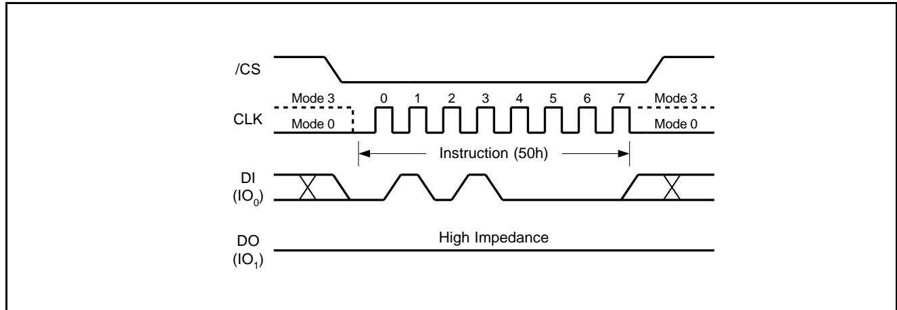

Figure 6. Write Enable for Volatile Status Register Instruction for SPI Mode

## 8.2 Instruction Descriptions

## 8.2.1 Write Enable (06h)

The Write Enable instruction (Figure 5) sets the Write Enable Latch (WEL) bit in the Status Register to a 1. The WEL bit must be set prior to every Page Program, Quad Page Program, Sector Erase, Block Erase, Chip Erase, Write Status Register and Erase/Program Security Registers instruction. The Write Enable instruction is entered by driving /CS low, shifting the instruction code “06h” into the Data Input (DI) pin on the rising edge of CLK, and then driving /CS high.

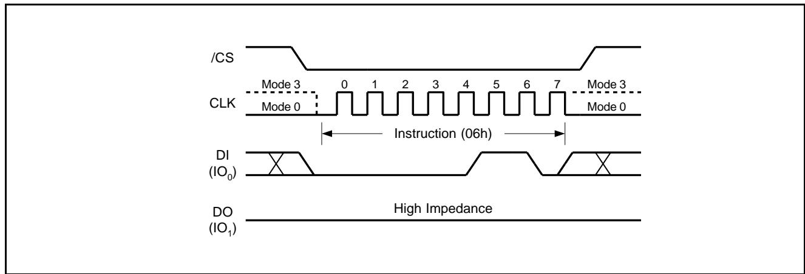

Figure 5. Write Enable Instruction for SPI Mode

## 8.2.2 Write Enable for Volatile Status Register (50h)

The non-volatile Status Register bits described in section 7.1 can also be written to as volatile bits. This gives more flexibility to change the system configuration and memory protection schemes quickly without waiting for the typical non-volatile bit write cycles or affecting the endurance of the Status Register nonvolatile bits. To write the volatile values into the Status Register bits, the Write Enable for Volatile Status Register (50h) instruction must be issued prior to a Write Status Register (01h) instruction. Write Enable for Volatile Status Register instruction (Figure 6) will not set the Write Enable Latch (WEL) bit, it is only valid for the Write Status Register instruction to change the volatile Status Register bit values.

24

Publication Release Date: March 27, 2018 Revision F

W25Q128JV

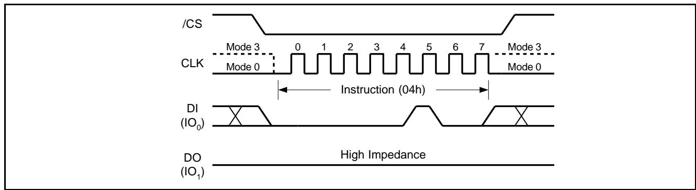

Figure 7. Write Disable Instruction for SPI Mode

## winbond

## 8.2.3 Write Disable (04h)

The Write Disable instruction (Figure 7) resets the Write Enable Latch (WEL) bit in the Status Register to a 0. The Write Disable instruction is entered by driving /CS low, shifting the instruction code “04h” into the DI pin and then driving /CS high. Note that the WEL bit is automatically reset after Power-up and upon completion of the Write Status Register, Erase/Program Security Registers, Page Program, Quad Page Program, Sector Erase, Block Erase, Chip Erase and Reset instructions.

## 8.2.4 Read Status Register-1 (05h), Status Register-2 (35h) & Status Register-3 (15h)

The Read Status Register instructions allow the 8-bit Status Registers to be read. The instruction is entered by driving /CS low and shifting the instruction code “05h” for Status Register-1, “35h” for Status Register-2 or “15h” for Status Register-3 into the DI pin on the rising edge of CLK. The status register bits are then shifted out on the DO pin at the falling edge of CLK with most significant bit (MSB) first as shown in Figure 8. Refer to section 7.1 for Status Register descriptions.

The Read Status Register instruction may be used at any time, even while a Program, Erase or Write Status Register cycle is in progress. This allows the BUSY status bit to be checked to determine when the cycle is complete and if the device can accept another instruction. The Status Register can be read continuously, as shown in Figure 8. The instruction is completed by driving /CS high.

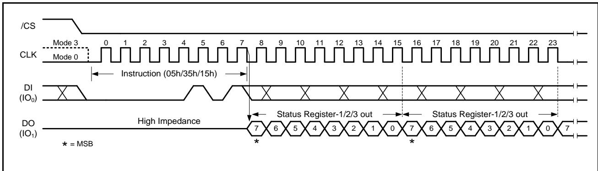

Figure 8a. Read Status Register Instruction

25

W25Q128JV

## winbond

## 8.2.5 Write Status Register-1 (01h), Status Register-2 (31h) & Status Register-3 (11h)

The Write Status Register instruction allows the Status Registers to be written. The writable Status Register bits include: SEC, TB, BP[2:0] in Status Register-1; CMP, LB[3:1], QE, SRL in Status Register-2; DRV1, DRV0, WPS in Status Register-3. All other Status Register bit locations are read-only and will not be affected by the Write Status Register instruction. LB[3:1] are non-volatile OTP bits, once it is set to 1, it cannot be cleared to 0.

To write non-volatile Status Register bits, a standard Write Enable (06h) instruction must previously have been executed for the device to accept the Write Status Register instruction (Status Register bit WEL must equal 1). Once write enabled, the instruction is entered by driving /CS low, sending the instruction code “01h/31h/11h”, and then writing the status register data byte as illustrated in Figure 9a.

To write volatile Status Register bits, a Write Enable for Volatile Status Register (50h) instruction must have been executed prior to the Write Status Register instruction (Status Register bit WEL remains 0). However, SRL and LB[3:1] cannot be changed from “1” to “0” because of the OTP protection for these bits. Upon power off or the execution of a Software/Hardware Reset, the volatile Status Register bit values will be lost, and the non-volatile Status Register bit values will be restored.

During non-volatile Status Register write operation (06h combined with 01h/31h/11h), after /CS is driven high, the self-timed Write Status Register cycle will commence for a time duration of tW (See AC Characteristics). While the Write Status Register cycle is in progress, the Read Status Register instruction may still be accessed to check the status of the BUSY bit. The BUSY bit is a 1 during the Write Status Register cycle and a 0 when the cycle is finished and ready to accept other instructions again. After the Write Status Register cycle has finished, the Write Enable Latch (WEL) bit in the Status Register will be cleared to 0.

During volatile Status Register write operation (50h combined with 01h/31h/11h), after /CS is driven high, the Status Register bits will be refreshed to the new values within the time period of tSHSL2 (See AC Characteristics). BUSY bit will remain 0 during the Status Register bit refresh period.

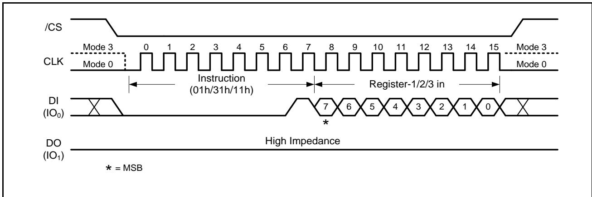

Refer to section 7.1 for Status Register descriptions.

Figure 9a. Write Status Register-1/2/3 Instruction

26

Publication Release Date: March 27, 2018 Revision F

## W25Q128JV

## winbond

The W25Q128JV is also backward compatible to Winbond’s previous generations of serial flash memories, in which the Status Register-1&2 can be written using a single “Write Status Register-1 (01h)” command. To complete the Write Status Register-1&2 instruction, the /CS pin must be driven high after the sixteenth bit of data that is clocked in as shown in Figure 9b. If /CS is driven high after the eighth clock, the Write Status Register-1 (01h) instruction will only program the Status Register-1, the Status Register-2 will not be affected (Previous generations will clear CMP and QE bits).

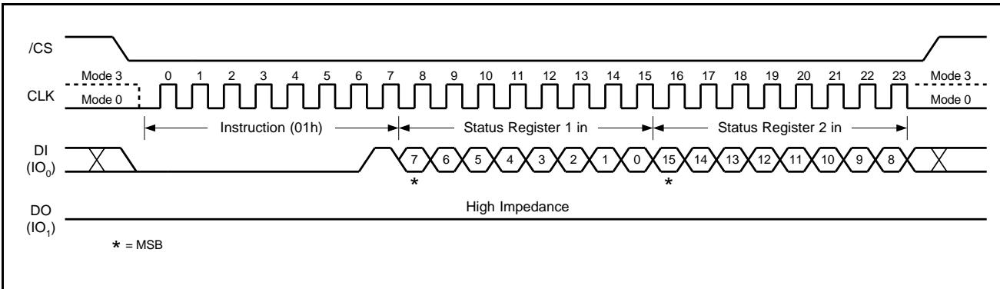

Figure 9b. Write Status Register-1/2 Instruction

27

W25Q128JV

## winbond

## 8.2.6 Read Data (03h)

The Read Data instruction allows one or more data bytes to be sequentially read from the memory. The instruction is initiated by driving the /CS pin low and then shifting the instruction code “03h” followed by a 24-bit address (A23-A0) into the DI pin. The code and address bits are latched on the rising edge of the CLK pin. After the address is received, the data byte of the addressed memory location will be shifted out on the DO pin at the falling edge of CLK with most significant bit (MSB) first. The address is automatically incremented to the next higher address after each byte of data is shifted out allowing for a continuous stream of data. This means that the entire memory can be accessed with a single instruction as long as the clock continues. The instruction is completed by driving /CS high.

The Read Data instruction sequence is shown in Figure 14. If a Read Data instruction is issued while an Erase, Program or Write cycle is in process (BUSY=1) the instruction is ignored and will not have any effects on the current cycle. The Read Data instruction allows clock rates from D.C. to a maximum of fR (see AC Electrical Characteristics).

The Read Data (03h) instruction is only supported in Standard SPI mode.

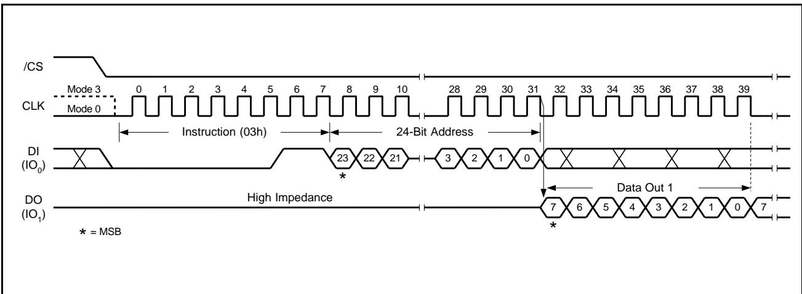

Figure 14. Read Data Instruction

28

Publication Release Date: March 27, 2018 Revision F

W25Q128JV

## winbond

## 8.2.7 Fast Read (0Bh)

The Fast Read instruction is similar to the Read Data instruction except that it can operate at the highest possible frequency of FR (see AC Electrical Characteristics). This is accomplished by adding eight “dummy” clocks after the 24-bit address as shown in Figure 16. The dummy clocks allow the devices internal circuits additional time for setting up the initial address. During the dummy clocks the data value on the DO pin is a “don’t care”.

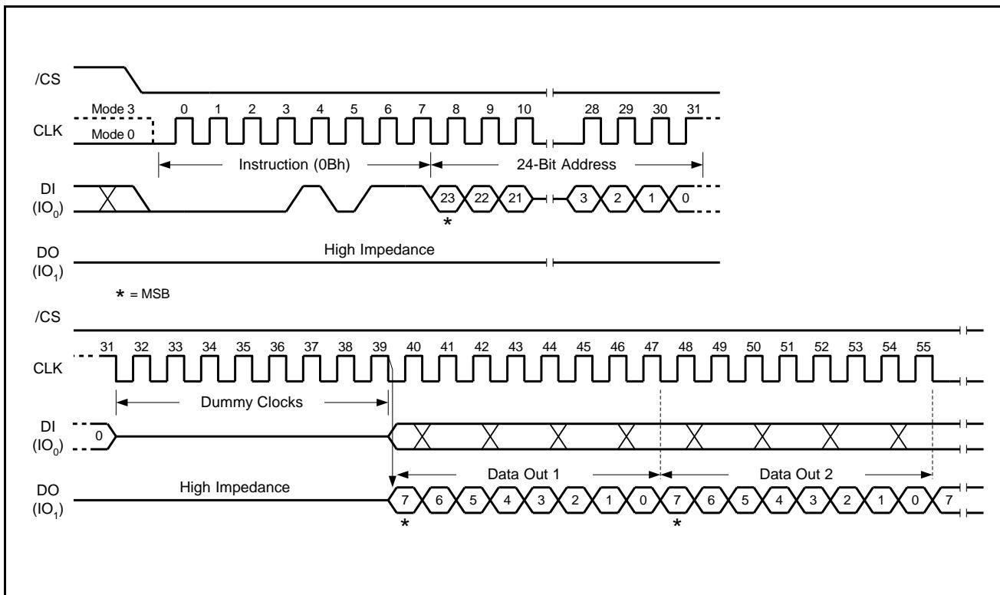

Figure 16a. Fast Read Instruction

29

W25Q128JV

## 8.2.8 Fast Read Dual Output (3Bh)

The Fast Read Dual Output (3Bh) instruction is similar to the standard Fast Read (0Bh) instruction except that data is output on two pins; IO and IO . This allows data to be transferred at twice the rate of standard SPI devices. The Fast Read Dual Output instruction is ideal for quickly downloading code from Flash to RAM upon power-up or for applications that cache code-segments to RAM for execution.

Similar to the Fast Read instruction, the Fast Read Dual Output instruction can operate at the highest possible frequency of FR (see AC Electrical Characteristics). This is accomplished by adding eight “dummy” clocks after the 24-bit address as shown in Figure 18. The dummy clocks allow the device's internal circuits additional time for setting up the initial address. The input data during the dummy clocks is “don’t care”. However, the IO0 pin should be high-impedance prior to the falling edge of the first data out clock.

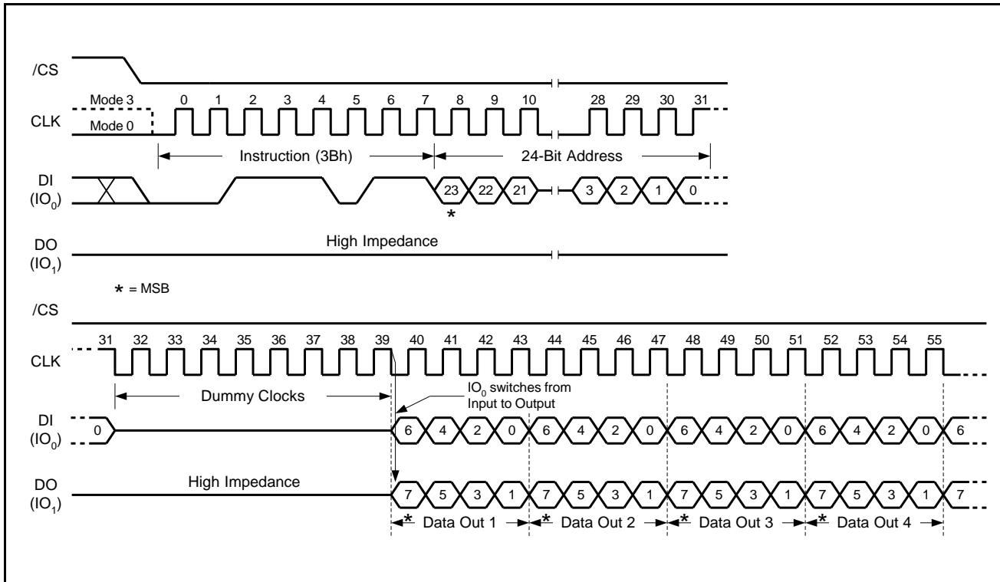

Figure 18. Fast Read Dual Output Instruction

30

Publication Release Date: March 27, 2018 Revision F

W25Q128JV

## 8.2.9 Fast Read Quad Output (6Bh)

The Fast Read Quad Output (6Bh) instruction is similar to the Fast Read Dual Output (3Bh) instruction except that data is output on four pins, IO0, IO1, IO2, and IO3. The Quad Enable (QE) bit in Status Register-2 must be set to 1 before the device will accept the Fast Read Quad Output Instruction. The Fast Read Quad Output Instruction allows data to be transferred at four times the rate of standard SPI devices.

The Fast Read Quad Output instruction can operate at the highest possible frequency of FR (see AC Electrical Characteristics). This is accomplished by adding eight “dummy” clocks after the 24-bit address as shown in Figure 20. The dummy clocks allow the device's internal circuits additional time for setting up the initial address. The input data during the dummy clocks is “don’t care”. However, the IO pins should be high-impedance prior to the falling edge of the first data out clock.

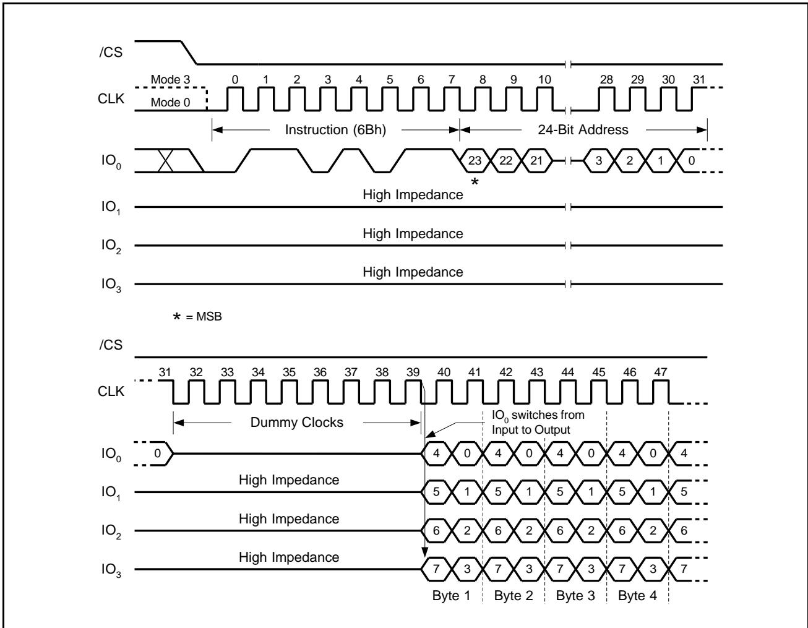

Figure 20. Fast Read Quad Output Instruction

31

W25Q128JV

# winbond

## 8.2.10 Fast Read Dual I/O (BBh)

The Fast Read Dual I/O (BBh) instruction allows for improved random access while maintaining two IO pins, IO0 and IO1. It is similar to the Fast Read Dual Output (3Bh) instruction but with the capability to input the Address bits (A23-0) two bits per clock. This reduced instruction overhead may allow for code execution (XIP) directly from the Dual SPI in some applications.

Figure 22a. Fast Read Dual I/O Instruction (M7-M0 should be set to Fxh)

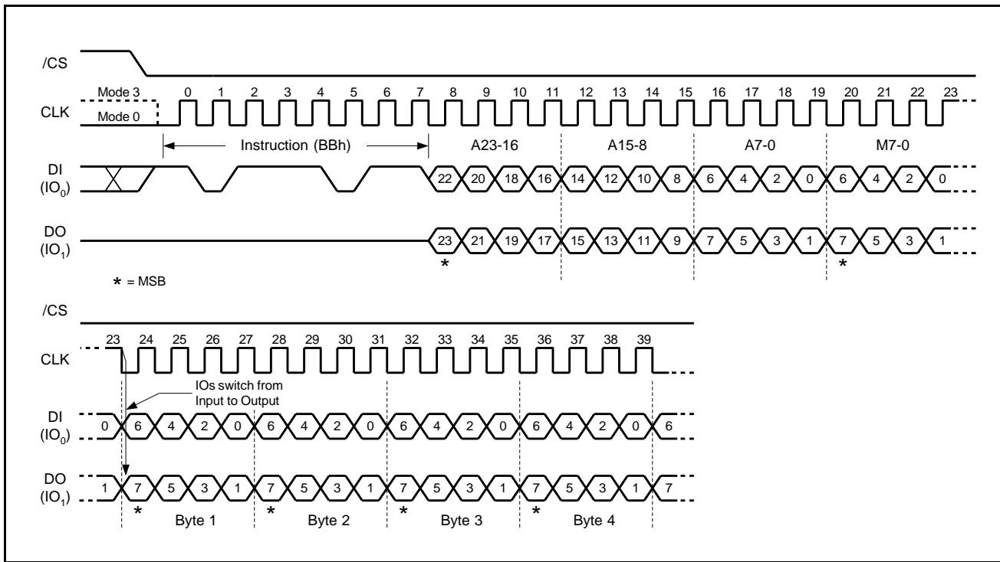

32

Publication Release Date: March 27, 2018 Revision F

W25Q128JV

## 8.2.11 Fast Read Quad I/O (EBh)

The Fast Read Quad I/O (EBh) instruction is similar to the Fast Read Dual I/O (BBh) instruction except that address and data bits are input and output through four pins $1 0 _ { 0 } , 1 0 _ { 1 } , 1 0 _ { 2 }$ and $\mathsf { I O } _ { 3 }$ and four Dummy clocks are required in SPI mode prior to the data output. The Quad I/O dramatically reduces instruction overhead allowing faster random access for code execution (XIP) directly from the Quad SPI. The Quad Enable bit (QE) of Status Register-2 must be set to enable the Fast Read Quad I/O Instruction.

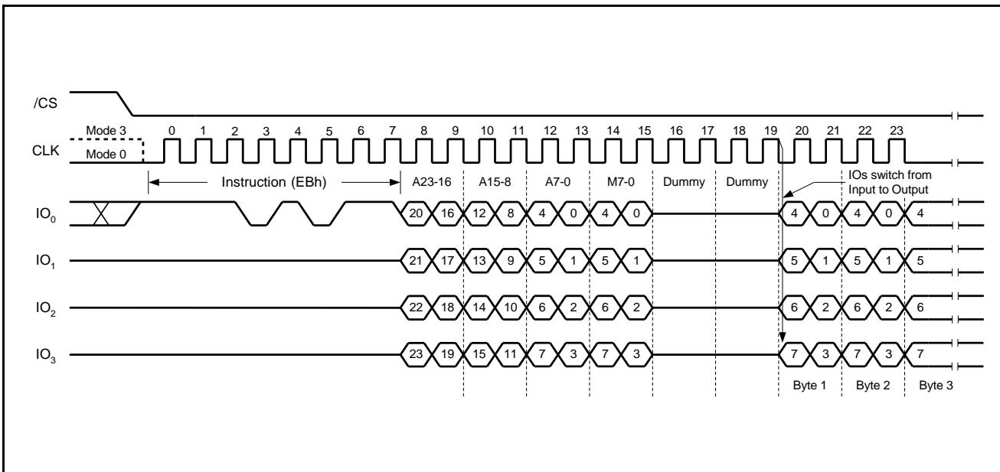

Figure 24a. Fast Read Quad I/O Instruction (M7-M0 should be set to Fxh)

33

W25Q128JV

# winbond

## Fast Read Quad I/O with “8/16/32/64-Byte Wrap Around” in Standard SPI mode

The Fast Read Quad I/O instruction can also be used to access a specific portion within a page by issuing a “Set Burst with Wrap” (77h) command prior to EBh. The “Set Burst with Wrap” (77h) command can either enable or disable the “Wrap Around” feature for the following EBh commands. When “Wrap Around” is enabled, the data being accessed can be limited to either an 8, 16, 32 or 64-byte section of a 256-byte page. The output data starts at the initial address specified in the instruction, once it reaches the ending boundary of the 8/16/32/64-byte section, the output will wrap around to the beginning boundary automatically until /CS is pulled high to terminate the command.

The Burst with Wrap feature allows applications that use cache to quickly fetch a critical address and then fill the cache afterwards within a fixed length (8/16/32/64-byte) of data without issuing multiple read commands.

The “Set Burst with Wrap” instruction allows three “Wrap Bits”, W6-4 to be set. The W4 bit is used to enable or disable the “Wrap Around” operation while W6-5 are used to specify the length of the wrap around section within a page. Refer to section 8.2.37 for detail descriptions.

34

Publication Release Date: March 27, 2018 Revision F

W25Q128JV

# winbond

## 8.2.12 Set Burst with Wrap (77h)

In Standard SPI mode, the Set Burst with Wrap (77h) instruction is used in conjunction with “Fast Read Quad $1 / \bigcirc ^ { \mathfrak { n } }$ instruction to access a fixed length of 8/16/32/64-byte section within a 256-byte page. Certain applications can benefit from this feature and improve the overall system code execution performance.

Similar to a Quad I/O instruction, the Set Burst with Wrap instruction is initiated by driving the /CS pin low and then shifting the instruction code “77h” followed by 24 dummy bits and 8 “Wrap Bits”, W7-0. The instruction seguence is shown in Figure 28. Wrap bit W7 and the lower nibble W3-0 are not used.

<table><tr><td rowspan=2 colspan=1>W6, W5</td><td rowspan=1 colspan=2>W4 = 0</td><td rowspan=1 colspan=2>W4 =1 (DEFAULT)</td></tr><tr><td rowspan=1 colspan=1>Wrap Around</td><td rowspan=1 colspan=1>Wrap Length</td><td rowspan=1 colspan=1>Wrap Around</td><td rowspan=1 colspan=1>Wrap Length</td></tr><tr><td rowspan=1 colspan=1>0 0</td><td rowspan=1 colspan=1>Yes</td><td rowspan=1 colspan=1>8-byte</td><td rowspan=1 colspan=1>No</td><td rowspan=1 colspan=1>N/A</td></tr><tr><td rowspan=1 colspan=1>0 1</td><td rowspan=1 colspan=1>Yes</td><td rowspan=1 colspan=1>16-byte</td><td rowspan=1 colspan=1>No</td><td rowspan=1 colspan=1>N/A</td></tr><tr><td rowspan=1 colspan=1>1 0</td><td rowspan=1 colspan=1>Yes</td><td rowspan=1 colspan=1>32-byte</td><td rowspan=1 colspan=1>No</td><td rowspan=1 colspan=1>N/A</td></tr><tr><td rowspan=1 colspan=1>1 1</td><td rowspan=1 colspan=1>Yes</td><td rowspan=1 colspan=1>64-byte</td><td rowspan=1 colspan=1>No</td><td rowspan=1 colspan=1>N/A</td></tr></table>

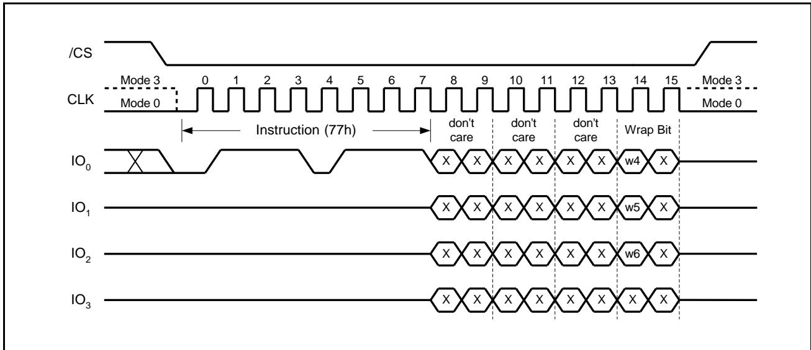

Once W6-4 is set by a Set Burst with Wrap instruction, all the following “Fast Read Quad I/O” instruction will use the W6-4 setting to access the 8/16/32/64-byte section within any page. To exit the “Wrap Around” function and return to normal read operation, another Set Burst with Wrap instruction should be issued to set W4 = 1. The default value of W4 upon power on or after a software/hardware reset is 1.

Figure 28. Set Burst with Wrap Instruction

35

W25Q128JV

## winbond

## 8.2.13 Page Program (02h)

The Page Program instruction allows from one byte to 256 bytes (a page) of data to be programmed at previously erased (FFh) memory locations. A Write Enable instruction must be executed before the device will accept the Page Program Instruction (Status Register bit WEL= 1). The instruction is initiated by driving the /CS pin low then shifting the instruction code “02h” followed by a 24-bit address (A23-A0) and at least one data byte, into the DI pin. The /CS pin must be held low for the entire length of the instruction while data is being sent to the device. The Page Program instruction sequence is shown in Figure 29.

If an entire 256 byte page is to be programmed, the last address byte (the 8 least significant address bits) should be set to 0. If the last address byte is not zero, and the number of clocks exceeds the remaining page length, the addressing will wrap to the beginning of the page. In some cases, less than 256 bytes (a partial page) can be programmed without having any effect on other bytes within the same page. One condition to perform a partial page program is that the number of clocks cannot exceed the remaining page length. If more than 256 bytes are sent to the device the addressing will wrap to the beginning of the page and overwrite previously sent data.

As with the write and erase instructions, the /CS pin must be driven high after the eighth bit of the last byte has been latched. If this is not done the Page Program instruction will not be executed. After /CS is driven high, the self-timed Page Program instruction will commence for a time duration of tpp (See AC Characteristics). While the Page Program cycle is in progress, the Read Status Register instruction may still be accessed for checking the status of the BUSY bit. The BUSY bit is a 1 during the Page Program cycle and becomes a 0 when the cycle is finished and the device is ready to accept other instructions again. After the Page Program cycle has finished the Write Enable Latch (WEL) bit in the Status Register is cleared to 0. The Page Program instruction will not be executed if the addressed page is protected by the Block Protect (CMP, SEC, TB, BP2, BP1, and BP0) bits or the Individual Block/Sector Locks.

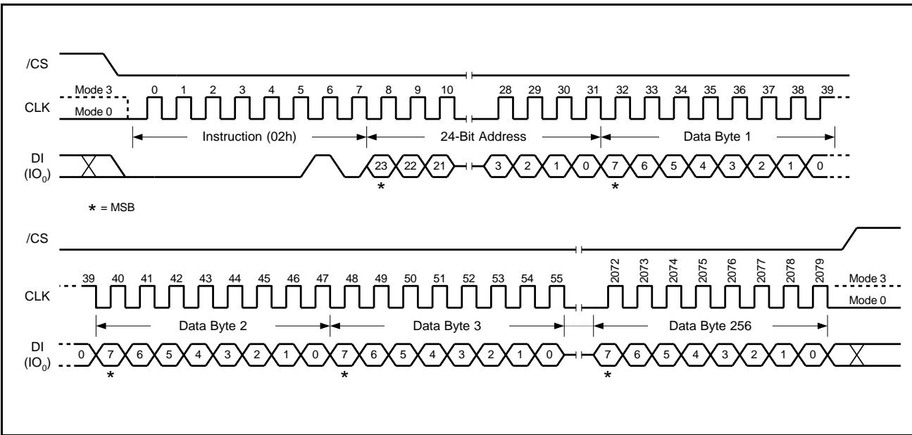

Figure 29a. Page Program Instruction

36

Publication Release Date: March 27, 2018 Revision F

W25Q128JV

## winbond

## 8.2.14 Quad Input Page Program (32h)

The Quad Page Program instruction allows up to 256 bytes of data to be programmed at previously erased (FFh) memory locations using four pins: IO0, IO1, IO2, and IO3. The Quad Page Program can improve performance for PROM Programmer and applications that have slow clock speeds <5MHz. Systems with faster clock speed will not realize much benefit for the Quad Page Program instruction since the inherent page program time is much greater than the time it take to clock-in the data.

To use Quad Page Program the Quad Enable (QE) bit in Status Register-2 must be set to 1. A Write Enable instruction must be executed before the device will accept the Quad Page Program instruction (Status Register-1, WEL=1). The instruction is initiated by driving the /CS pin low then shifting the instruction code “32h” followed by a 24-bit address (A23-A0) and at least one data byte, into the IO pins. The /CS pin must be held low for the entire length of the instruction while data is being sent to the device. All other functions of Quad Page Program are identical to standard Page Program. The Quad Page Program instruction sequence is shown in Figure 30.

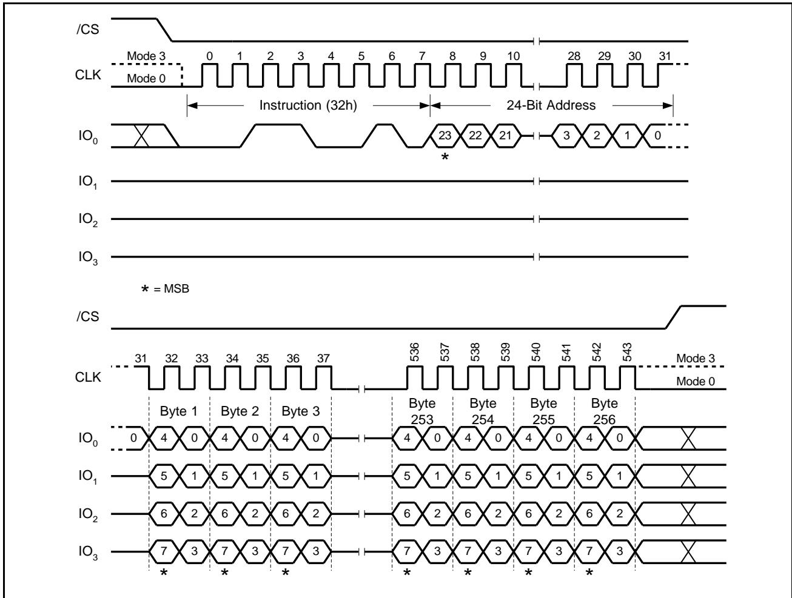

Figure 30. Quad Input Page Program Instruction

37

W25Q128JV

## winbond

## 8.2.15 Sector Erase (20h)

The Sector Erase instruction sets all memory within a specified sector (4K-bytes) to the erased state of all 1s (FFh). A Write Enable instruction must be executed before the device will accept the Sector Erase Instruction (Status Register bit WEL must equal 1). The instruction is initiated by driving the /CS pin low and shifting the instruction code “20h” followed a 24-bit sector address (A23-A0). The Sector Erase instruction sequence is shown in Figure 31a.

The /CS pin must be driven high after the eighth bit of the last byte has been latched. If this is not done the Sector Erase instruction will not be executed. After /CS is driven high, the self-timed Sector Erase instruction will commence for a time duration of tSE (See AC Characteristics). While the Sector Erase cycle is in progress, the Read Status Register instruction may still be accessed for checking the status of the BUSY bit. The BUSY bit is a 1 during the Sector Erase cycle and becomes a 0 when the cycle is finished and the device is ready to accept other instructions again. After the Sector Erase cycle has finished the Write Enable Latch (WEL) bit in the Status Register is cleared to 0. The Sector Erase instruction will not be executed if the addressed page is protected by the Block Protect (CMP, SEC, TB, BP2, BP1, and BP0) bits or the Individual Block/Sector Locks.

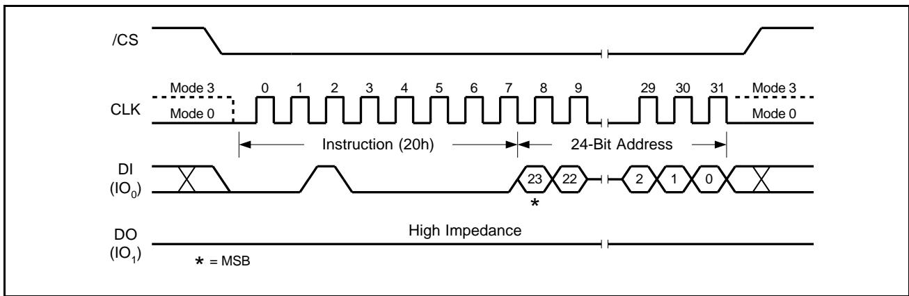

Figure 31a. Sector Erase Instruction

38

Publication Release Date: March 27, 2018 Revision F

W25Q128JV

## winbond

## 8.2.16 32KB Block Erase (52h)

The Block Erase instruction sets all memory within a specified block (32K-bytes) to the erased state of all 1s (FFh). A Write Enable instruction must be executed before the device will accept the Block Erase Instruction (Status Register bit WEL must equal 1). The instruction is initiated by driving the /CS pin low and shifting the instruction code “52h” followed a 24-bit block address (A23-A0). The Block Erase instruction sequence is shown in Figure 32a.

The /CS pin must be driven high after the eighth bit of the last byte has been latched. If this is not done the Block Erase instruction will not be executed. After /CS is driven high, the self-timed Block Erase instruction will commence for a time duration of tBE1 (See AC Characteristics). While the Block Erase cycle is in progress, the Read Status Register instruction may still be accessed for checking the status of the BUSY bit. The BUSY bit is a 1 during the Block Erase cycle and becomes a 0 when the cycle is finished and the device is ready to accept other instructions again. After the Block Erase cycle has finished the Write Enable Latch (WEL) bit in the Status Register is cleared to 0. The Block Erase instruction will not be executed if the addressed page is protected by the Block Protect (CMP, SEC, TB, BP2, BP1, and BP0) bits or the Individual Block/Sector Locks.

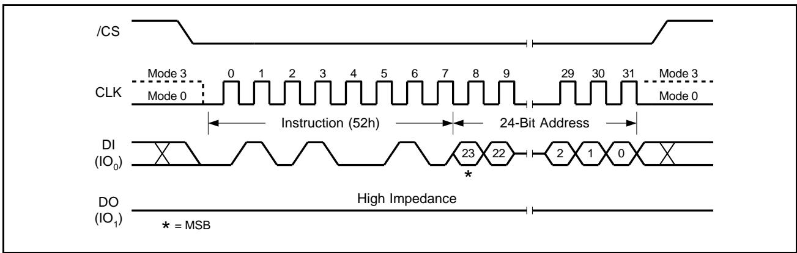

Figure 32a. 32KB Block Erase Instruction

39

W25Q128JV

## winbond

## 8.2.17 64KB Block Erase (D8h)

The Block Erase instruction sets all memory within a specified block (64K-bytes) to the erased state of all 1s (FFh). A Write Enable instruction must be executed before the device will accept the Block Erase Instruction (Status Register bit WEL must equal 1). The instruction is initiated by driving the /CS pin low and shifting the instruction code “D8h” followed a 24-bit block address (A23-A0). The Block Erase instruction sequence is shown in Figure 33a.

The /CS pin must be driven high after the eighth bit of the last byte has been latched. If this is not done the Block Erase instruction will not be executed. After /CS is driven high, the self-timed Block Erase instruction will commence for a time duration of tBE (See AC Characteristics). While the Block Erase cycle is in progress, the Read Status Register instruction may still be accessed for checking the status of the BUSY bit. The BUSY bit is a 1 during the Block Erase cycle and becomes a 0 when the cycle is finished and the device is ready to accept other instructions again. After the Block Erase cycle has finished the Write Enable Latch (WEL) bit in the Status Register is cleared to 0. The Block Erase instruction will not be executed if the addressed page is protected by the Block Protect (CMP, SEC, TB, BP2, BP1, and BP0) bits or the Individual Block/Sector Locks.

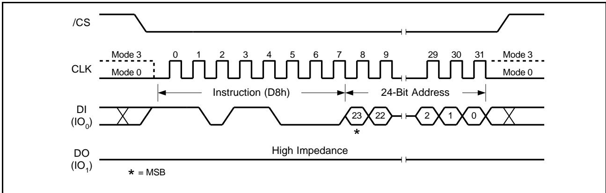

Figure 33a. 64KB Block Erase Instruction

40

Publication Release Date: March 27, 2018 Revision F

W25Q128JV

## winbond

## 8.2.18 Chip Erase (C7h / 60h)

The Chip Erase instruction sets all memory within the device to the erased state of all 1s (FFh). A Write Enable instruction must be executed before the device will accept the Chip Erase Instruction (Status Register bit WEL must equal 1). The instruction is initiated by driving the /CS pin low and shifting the instruction code “C7h” or “60h”. The Chip Erase instruction sequence is shown in Figure 34.

The /CS pin must be driven high after the eighth bit has been latched. If this is not done the Chip Erase instruction will not be executed. After /CS is driven high, the self-timed Chip Erase instruction will commence for a time duration of tCE (See AC Characteristics). While the Chip Erase cycle is in progress, the Read Status Register instruction may still be accessed to check the status of the BUSY bit. The BUSY bit is a 1 during the Chip Erase cycle and becomes a 0 when finished and the device is ready to accept other instructions again. After the Chip Erase cycle has finished the Write Enable Latch (WEL) bit in the Status Register is cleared to 0. The Chip Erase instruction will not be executed if any memory region is protected by the Block Protect (CMP, SEC, TB, BP2, BP1, and BP0) bits or the Individual Block/Sector Locks.

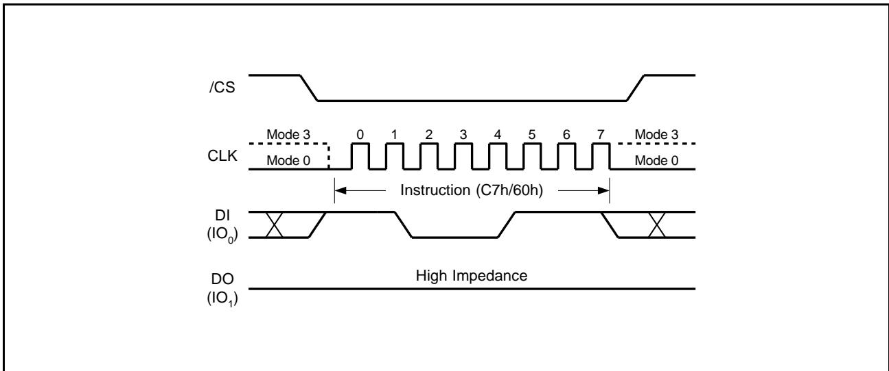

Figure 34. Chip Erase Instruction Sequence Diagram

41

W25Q128JV

# winbond

## 8.2.19 Erase / Program Suspend (75h)

The Erase/Program Suspend instruction “75h”, allows the system to interrupt a Sector or Block Erase operation or a Page Program operation and then read from or program/erase data to, any other sectors or blocks. The Erase/Program Suspend instruction sequence is shown in Figure 35a.

The Write Status Register instruction (01h) and Erase instructions (20h, 52h, D8h, C7h, 60h, 44h) are not allowed during Erase Suspend. Erase Suspend is valid only during the Sector or Block erase operation. If written during the Chip Erase operation, the Erase Suspend instruction is ignored. The Write Status Register instruction (01h) and Program instructions (02h, 32h, 42h) are not allowed during Program Suspend. Program Suspend is valid only during the Page Program or Quad Page Program operation.

The Erase/Program Suspend instruction “75h” will be accepted by the device only if the SUS bit in the Status Register equals to 0 and the BUSY bit equals to 1 while a Sector or Block Erase or a Page Program operation is on-going. If the SUS bit equals to 1 or the BUSY bit equals to 0, the Suspend instruction will be ignored by the device. A maximum of time of “t ” (See AC Characteristics) is required to suspend the erase or program operation. The BUSY bit in the Status Register will be cleared from 1 to 0 within “tS S” and the SUS bit in the Status Register will be set from 0 to 1 immediately after Erase/Program Suspend. For a previously resumed Erase/Program operation, it is also required that the Suspend instruction “75h” is not issued earlier than a minimum of time of “tSUS” following the preceding Resume instruction “7Ah”.

Unexpected power off during the Erase/Program suspend state will reset the device and release the suspend state. SUS bit in the Status Register will also reset to 0. The data within the page, sector or block that was being suspended may become corrupted. It is recommended for the user to implement system design techniques against the accidental power interruption and preserve data integrity during erase/program suspend state.

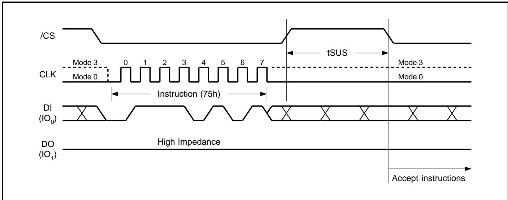

Figure 35a. Erase/Program Suspend Instruction

42

Publication Release Date: March 27, 2018 Revision F

W25Q128JV

## winbond

## 8.2.20 Erase / Program Resume (7Ah)

The Erase/Program Resume instruction “7Ah” must be written to resume the Sector or Block Erase operation or the Page Program operation after an Erase/Program Suspend. The Resume instruction “7Ah” will be accepted by the device only if the SUS bit in the Status Register equals to 1 and the BUSY bit equals to 0. After issued the SUS bit will be cleared from 1 to 0 immediately, the BUSY bit will be set from 0 to 1 within 200ns and the Sector or Block will complete the erase operation or the page will complete the program operation. If the SUS bit equals to 0 or the BUSY bit equals to 1, the Resume instruction “7Ah” will be ignored by the device. The Erase/Program Resume instruction sequence is shown in Figure 36a.

Resume instruction is ignored if the previous Erase/Program Suspend operation was interrupted by unexpected power off. It is also required that a subsequent Erase/Program Suspend instruction not to be issued within a minimum of time of “t ” following a previous Resume instruction.

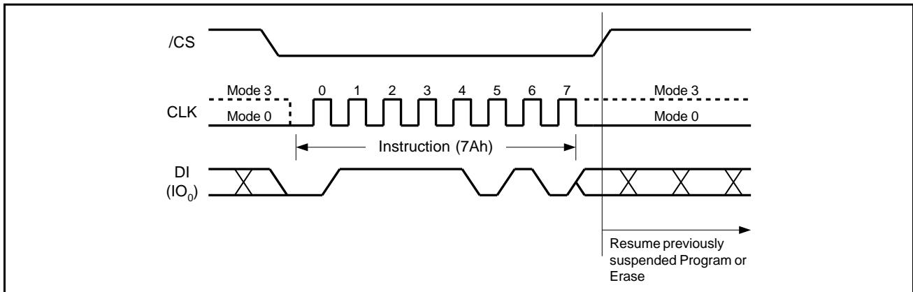

Figure 36a. Erase/Program Resume Instruction

43

W25Q128JV

## winbond

## 8.2.21 Power-down (B9h)

Although the standby current during normal operation is relatively low, standby current can be further reduced with the Power-down instruction. The lower power consumption makes the Power-down instruction especially useful for battery powered applications (See ICC1 and ICC2 in AC Characteristics). The instruction is initiated by driving the /CS pin low and shifting the instruction code “B9h” as shown in Figure 37a.

The /CS pin must be driven high after the eighth bit has been latched. If this is not done the Power-down instruction will not be executed. After /CS is driven high, the power-down state will entered within the time duration of tDP (See AC Characteristics). While in the power-down state only the Release Power-down / Device ID (ABh) instruction, which restores the device to normal operation, will be recognized. All other instructions are ignored. This includes the Read Status Register instruction, which is always available during normal operation. Ignoring all but one instruction makes the Power Down state a useful condition for securing maximum write protection. The device always powers-up in the normal operation with the standby current of ICC1.

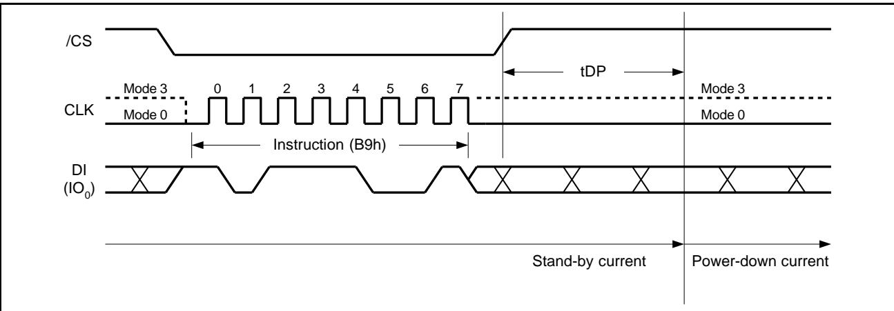

Figure 37a. Deep Power-down Instruction

44

Publication Release Date: March 27, 2018 Revision F

W25Q128JV

## winbond

## 8.2.22 Release Power-down / Device ID (ABh)

The Release from Power-down / Device ID instruction is a multi-purpose instruction. It can be used to release the device from the power-down state, or obtain the devices electronic identification (ID) number.

To release the device from the power-down state, the instruction is issued by driving the /CS pin low, shifting the instruction code “ABh” and driving /CS high as shown in Figure 38a. Release from power-down will take the time duration of tRES1 (See AC Characteristics) before the device will resume normal operation and other instructions are accepted. The /CS pin must remain high during the tRES1 time duration.

When used only to obtain the Device ID while not in the power-down state, the instruction is initiated by driving the /CS pin low and shifting the instruction code “ABh” followed by 3-dummy bytes. The Device ID bits are then shifted out on the falling edge of CLK with most significant bit (MSB) first. The Device ID value for the W25Q128JV is listed in Manufacturer and Device Identification table. The Device ID can be read continuously. The instruction is completed by driving /CS high.

When used to release the device from the power-down state and obtain the Device ID, the instruction is the same as previously described, and shown in Figure 38c, except that after /CS is driven high it must remain high for a time duration of tRES2 (See AC Characteristics). After this time duration the device will resume normal operation and other instructions will be accepted. If the Release from Power-down / Device ID instruction is issued while an Erase, Program or Write cycle is in process (when BUSY equals 1) the instruction is ignored and will not have any effects on the current cycle.

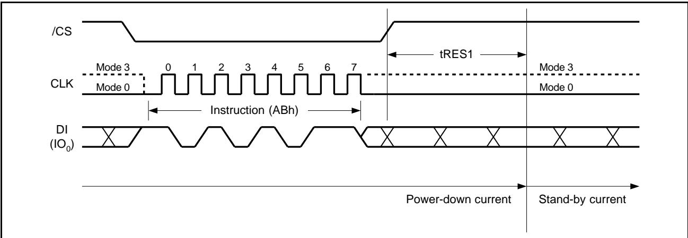

Figure 38a. Release Power-down Instruction

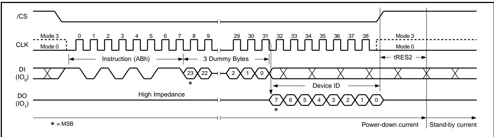

Figure 38c. Release Power-down / Device ID Instruction

45

W25Q128JV

# winbond

## 8.2.23 Read Manufacturer / Device ID (90h)

The Read Manufacturer/Device ID instruction is an alternative to the Release from Power-down / Device ID instruction that provides both the JEDEC assigned manufacturer ID and the specific device ID.

The Read Manufacturer/Device ID instruction is very similar to the Release from Power-down / Device ID instruction. The instruction is initiated by driving the /CS pin low and shifting the instruction code “90h” followed by a 24-bit address (A23-A0) of 000000h. After which, the Manufacturer ID for Winbond (EFh) and the Device ID are shifted out on the falling edge of CLK with most significant bit (MSB) first as shown in Figure 39. The Device ID values for the W25Q128JV are listed in Manufacturer and Device Identification table. The instruction is completed by driving /CS high.

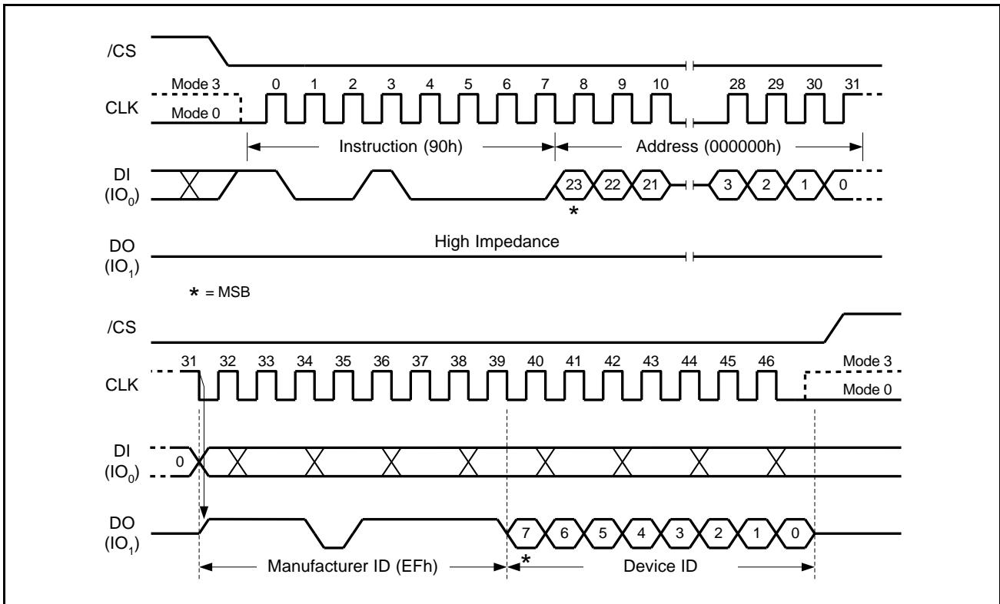

Figure 39. Read Manufacturer / Device ID Instruction

46

Publication Release Date: March 27, 2018 Revision F

W25Q128JV

## winbond

## 8.2.24 Read Manufacturer / Device ID Dual I/O (92h)

The Read Manufacturer / Device ID Dual I/O instruction is an alternative to the Read Manufacturer / Device ID instruction that provides both the JEDEC assigned manufacturer ID and the specific device ID at 2x speed.

The Read Manufacturer / Device ID Dual I/O instruction is similar to the Fast Read Dual I/O instruction. The instruction is initiated by driving the /CS pin low and shifting the instruction code “92h” followed by a 24-bit address (A23-A0) of 000000h, but with the capability to input the Address bits two bits per clock. After which, the Manufacturer ID for Winbond (EFh) and the Device ID are shifted out 2 bits per clock on the falling edge of CLK with most significant bits (MSB) first as shown in Figure 40. The Device ID values for the W25Q128JV are listed in Manufacturer and Device Identification table. The Manufacturer and Device IDs can be read continuously, alternating from one to the other. The instruction is completed by driving /CS high.

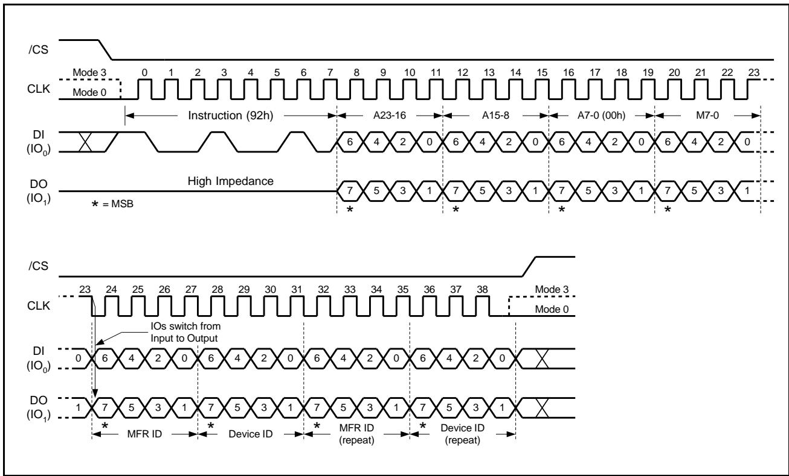

Figure 40. Read Manufacturer / Device ID Dual I/O Instruction

Note:

The “Continuous Read Mode” bits M(7-0) must be set to Fxh to be compatible with Fast Read Dual I/O instruction.

47

W25Q128JV

## winbond

## 8.2.25 Read Manufacturer / Device ID Quad I/O (94h)

The Read Manufacturer / Device ID Quad I/O instruction is an alternative to the Read Manufacturer / Device ID instruction that provides both the JEDEC assigned manufacturer ID and the specific device ID at 4x speed.

The Read Manufacturer / Device ID Quad I/O instruction is similar to the Fast Read Quad I/O instruction. The instruction is initiated by driving the /CS pin low and shifting the instruction code “94h” followed by a four clock dummy cycles and then a 24-bit address (A23-A0) of 000000h, but with the capability to input the Address bits four bits per clock. After which, the Manufacturer ID for Winbond (EFh) and the Device ID are shifted out four bits per clock on the falling edge of CLK with most significant bit (MSB) first as shown in Figure 41. The Device ID values for the W25Q128JV are listed in Manufacturer and Device Identification table. The Manufacturer and Device IDs can be read continuously, alternating from one to the other. The instruction is completed by driving /CS high.

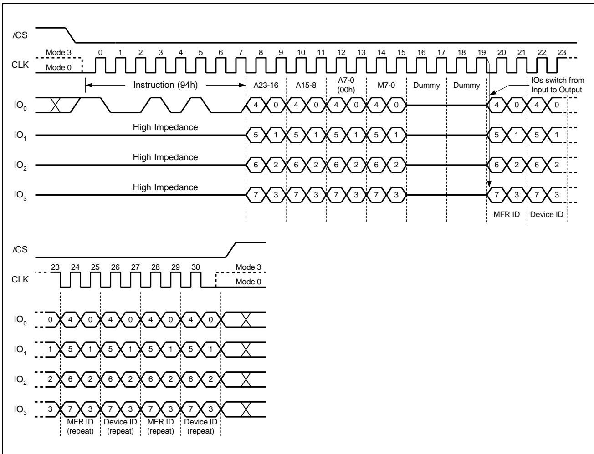

Figure 41. Read Manufacturer / Device ID Quad I/O Instruction

Note:

The “Continuous Read Mode” bits M(7-0) must be set to Fxh to be compatible with Fast Read Quad I/O instruction.

48

Publication Release Date: March 27, 2018 Revision F

W25Q128JV

## winbond

## 8.2.26 Read Unique ID Number (4Bh)

The Read Unique ID Number instruction accesses a factory-set read-only 64-bit number that is unique to each W25Q128JV device. The ID number can be used in conjunction with user software methods to help prevent copying or cloning of a system. The Read Unique ID instruction is initiated by driving the /CS pin low and shifting the instruction code “4Bh” followed by a four bytes of dummy clocks. After which, the 64- bit ID is shifted out on the falling edge of CLK as shown in Figure 42.

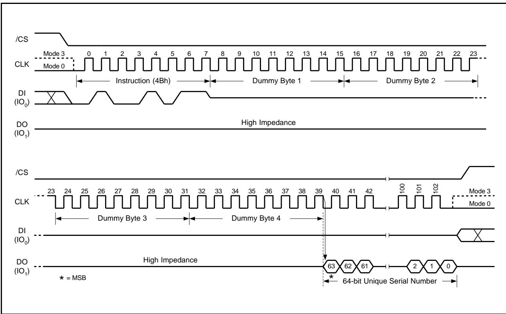

Figure 42. Read Unique ID Number Instruction

49

W25Q128JV

# winbond

## 8.2.27 Read JEDEC ID (9Fh)

For compatibility reasons, the W25Q128JV provides several instructions to electronically determine the identity of the device. The Read JEDEC ID instruction is compatible with the JEDEC standard for SPI compatible serial memories that was adopted in 2003. The instruction is initiated by driving the /CS pin low and shifting the instruction code “9Fh”. The JEDEC assigned Manufacturer ID byte for Winbond (EFh) and two Device ID bytes, Memory Type (ID15-ID8) and Capacity (ID7-ID0) are then shifted out on the falling edge of CLK with most significant bit (MSB) first as shown in Figure 43a. For memory type and capacity values refer to Manufacturer and Device Identification table.

Figure 43a. Read JEDEC ID Instruction

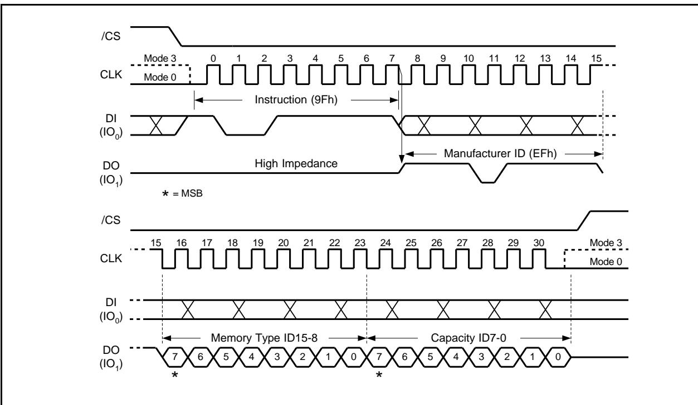

50

Publication Release Date: March 27, 2018 Revision F

W25Q128JV

## winbond

## 8.2.28 Read SFDP Register (5Ah)

The W25Q128JV features a 256-Byte Serial Flash Discoverable Parameter (SFDP) register that contains information about device configurations, available instructions and other features. The SFDP parameters are stored in one or more Parameter Identification (PID) tables. Currently only one PID table is specified, but more may be added in the future. The Read SFDP Register instruction is compatible with the SFDP standard initially established in 2010 for PC and other applications, as well as the JEDEC standard JESD216-serials that is published in 2011. Most Winbond SpiFlash Memories shipped after June 2011 (date code 1124 and beyond) support the SFDP feature as specified in the applicable datasheet.

The Read SFDP instruction is initiated by driving the /CS pin low and shifting the instruction code “5Ah” followed by a 24-bit address (A23-A0)(1) into the DI pin. Eight “dummy” clocks are also required before the SFDP register contents are shifted out on the falling edge of the 40th CLK with most significant bit (MSB) first as shown in Figure 44. For SFDP register values and descriptions, please refer to the Winbond Application Note for SFDP Definition Table.

Note 1: A23-A8 = 0; A7-A0 are used to define the starting byte address for the 256-Byte SFDP Register.

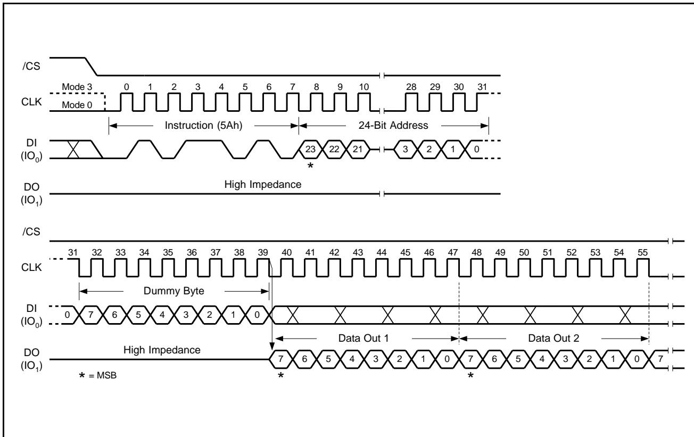

Figure 44. Read SFDP Register Instruction Sequence Diagram

51

W25Q128JV

# winbond

## 8.2.29 Erase Security Registers (44h)

The W25Q128JV offers three 256-byte Security Registers which can be erased and programmed individually. These registers may be used by the system manufacturers to store security and other important information separately from the main memory array.

The Erase Security Register instruction is similar to the Sector Erase instruction. A Write Enable instruction must be executed before the device will accept the Erase Security Register Instruction (Status Register bit WEL must equal 1). The instruction is initiated by driving the /CS pin low and shifting the instruction code “44h” followed by a 24-bit address (A23-A0) to erase one of the three security registers.

<table><tr><td rowspan=1 colspan=1>ADDRESS</td><td rowspan=1 colspan=1>A23-16</td><td rowspan=1 colspan=1>A15-12</td><td rowspan=1 colspan=1>A11-8</td><td rowspan=1 colspan=1>A7-0</td></tr><tr><td rowspan=1 colspan=1>Security Register #1</td><td rowspan=1 colspan=1>00h</td><td rowspan=1 colspan=1>0001</td><td rowspan=1 colspan=1>0000</td><td rowspan=1 colspan=1>Don&#x27;t Care</td></tr><tr><td rowspan=1 colspan=1>Security Register #2</td><td rowspan=1 colspan=1>00h</td><td rowspan=1 colspan=1>0010</td><td rowspan=1 colspan=1>0000</td><td rowspan=1 colspan=1>Don&#x27;t Care</td></tr><tr><td rowspan=1 colspan=1>Security Register #3</td><td rowspan=1 colspan=1>00h</td><td rowspan=1 colspan=1>0011</td><td rowspan=1 colspan=1>0000</td><td rowspan=1 colspan=1>Don&#x27;t Care</td></tr></table>

The Erase Security Register instruction seguence is shown in Figure 45. The /CS pin must be driven hiah after the eighth bit of the last byte has been latched. If this is not done the instruction will not be executed. After /CS is driven high, the self-timed Erase Security Register operation will commence for a time duration of tSE (See AC Characteristics). While the Erase Security Register cycle is in progress, the Read Status Register instruction may still be accessed for checking the status of the BUSY bit. The BUSY bit is a 1 during the erase cycle and becomes a 0 when the cycle is finished and the device is ready to accept other instructions again. After the Erase Security Register cycle has finished the Write Enable Latch (WEL) bit in the Status Register is cleared to 0. The Security Register Lock Bits (LB3-1) in the Status Register-2 can be used to OTP protect the security registers. Once a lock bit is set to 1, the corresponding security register will be permanently locked, Erase Security Register instruction to that register will be ignored (Refer to section 7.1.9 for detail descriptions).

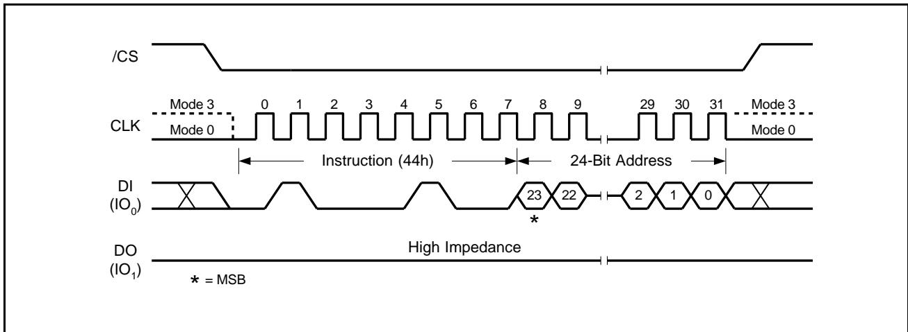

Figure 45. Erase Security Registers Instruction

52

Publication Release Date: March 27, 2018 Revision F

W25Q128JV

## winbond

## 8.2.30 Program Security Registers (42h)

The Program Security Register instruction is similar to the Page Program instruction. It allows from one byte to 256 bytes of security register data to be programmed at previously erased (FFh) memory locations. A Write Enable instruction must be executed before the device will accept the Program Security Register Instruction (Status Register bit WEL= 1). The instruction is initiated by driving the /CS pin low then shifting the instruction code “42h” followed by a 24-bit address (A23-A0) and at least one data byte, into the DI pin. The /CS pin must be held low for the entire length of the instruction while data is being sent to the device.

<table><tr><td rowspan=1 colspan=1>ADDRESS</td><td rowspan=1 colspan=1>A23-16</td><td rowspan=1 colspan=1>A15-12</td><td rowspan=1 colspan=1>A11-8</td><td rowspan=1 colspan=1>A7-0</td></tr><tr><td rowspan=1 colspan=1>Security Register #1</td><td rowspan=1 colspan=1>00h</td><td rowspan=1 colspan=1>0001</td><td rowspan=1 colspan=1>0000</td><td rowspan=1 colspan=1>Byte Address</td></tr><tr><td rowspan=1 colspan=1>Security Register #2</td><td rowspan=1 colspan=1>00h</td><td rowspan=1 colspan=1>0010</td><td rowspan=1 colspan=1>0000</td><td rowspan=1 colspan=1>Byte Address</td></tr><tr><td rowspan=1 colspan=1>Security Register #3</td><td rowspan=1 colspan=1>00h</td><td rowspan=1 colspan=1>0011</td><td rowspan=1 colspan=1>0000</td><td rowspan=1 colspan=1>Byte Address</td></tr></table>

The Program Security Register instruction sequence is shown in Figure 46. The Security Register Lock Bits (LB3-1) in the Status Register-2 can be used to OTP protect the security registers. Once a lock bit is set to 1, the corresponding security register will be permanently locked, Program Security Register instruction to that register will be ignored (See 7.1.9 for detail descriptions).

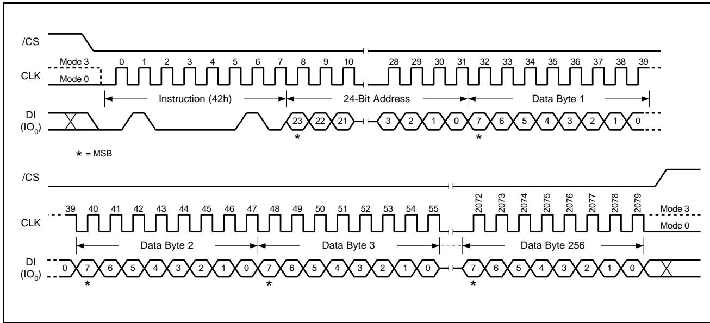

Figure 46. Program Security Registers Instruction

53

W25Q128JV

## 8.2.31 Read Security Registers (48h)

The Read Security Register instruction is similar to the Fast Read instruction and allows one or more data bytes to be sequentially read from one of the four security registers. The instruction is initiated by driving the /CS pin low and then shifting the instruction code “48h” followed by a 24-bit address (A23-A0) and eight “dummy” clocks into the DI pin. The code and address bits are latched on the rising edge of the CLK pin. After the address is received, the data byte of the addressed memory location will be shifted out on the DO pin at the falling edge of CLK with most significant bit (MSB) first. The byte address is automatically incremented to the next byte address after each byte of data is shifted out. Once the byte address reaches the last byte of the register (byte address FFh), it will reset to address 00h, the first byte of the register, and continue to increment. The instruction is completed by driving /CS high. The Read Security Register instruction sequence is shown in Figure 47. If a Read Security Register instruction is issued while an Erase, Program or Write cycle is in process (BUSY=1) the instruction is ignored and will not have any effects on the current cycle. The Read Security Register instruction allows clock rates from D.C. to a maximum of FR (see AC Electrical Characteristics).

<table><tr><td rowspan=1 colspan=1>ADDRESS</td><td rowspan=1 colspan=1>A23-16</td><td rowspan=1 colspan=1>A15-12</td><td rowspan=1 colspan=1>A11-8</td><td rowspan=1 colspan=1>A7-0</td></tr><tr><td rowspan=1 colspan=1>Security Register #1</td><td rowspan=1 colspan=1>00h</td><td rowspan=1 colspan=1>0001</td><td rowspan=1 colspan=1>0000</td><td rowspan=1 colspan=1>Byte Address</td></tr><tr><td rowspan=1 colspan=1>Security Register #2</td><td rowspan=1 colspan=1>00h</td><td rowspan=1 colspan=1>0010</td><td rowspan=1 colspan=1>0000</td><td rowspan=1 colspan=1>Byte Address</td></tr><tr><td rowspan=1 colspan=1>Security Register #3</td><td rowspan=1 colspan=1>00h</td><td rowspan=1 colspan=1>0011</td><td rowspan=1 colspan=1>0000</td><td rowspan=1 colspan=1>Byte Address</td></tr></table>

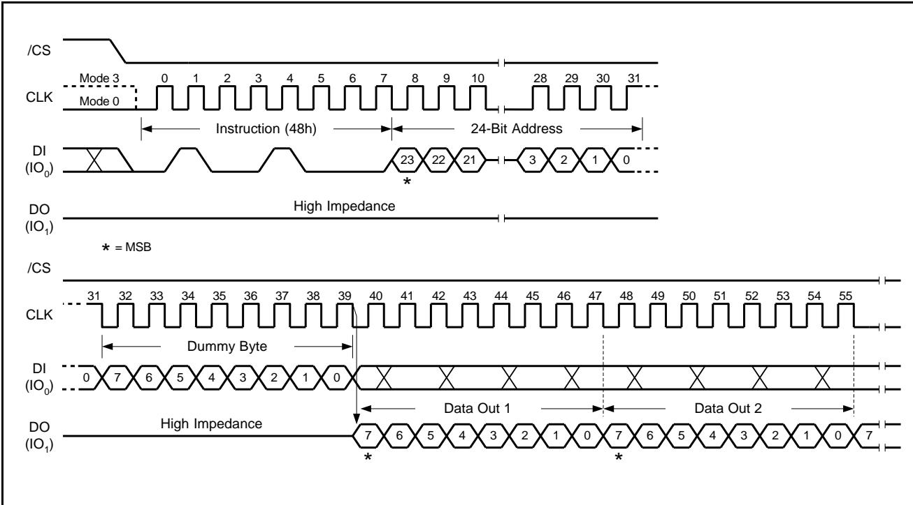

Figure 47. Read Security Registers Instruction

54

Publication Release Date: March 27, 2018 Revision F

W25Q128JV

## winbond

## 8.2.32 Individual Block/Sector Lock (36h)

The Individual Block/Sector Lock provides an alternative way to protect the memory array from adverse Erase/Program. In order to use the Individual Block/Sector Locks, the WPS bit in Status Register-3 must be set to 1. If WPS=0, the write protection will be determined by the combination of CMP, SEC, TB, BP[2:0] bits in the Status Registers. The Individual Block/Sector Lock bits are volatile bits. The default values after device power up or after a Reset are 1, so the entire memory array is being protected.

To lock a specific block or sector as illustrated in Figure 4d, an Individual Block/Sector Lock command must be issued by driving /CS low, shifting the instruction code “36h” into the Data Input (DI) pin on the rising edge of CLK, followed by a 24-bit address and then driving /CS high. A Write Enable instruction must be executed before the device will accept the Individual Block/Sector Lock Instruction (Status Register bit WEL= 1).

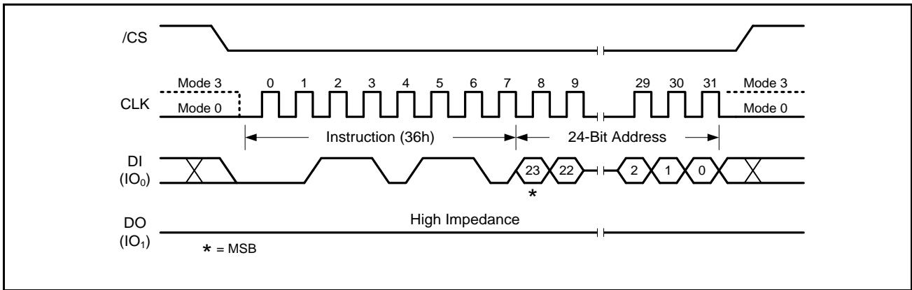

Figure 53a. Individual Block/Sector Lock Instruction

55

W25Q128JV

## winbond

## 8.2.33 Individual Block/Sector Unlock (39h)

The Individual Block/Sector Lock provides an alternative way to protect the memory array from adverse Erase/Program. In order to use the Individual Block/Sector Locks, the WPS bit in Status Register-3 must be set to 1. If WPS=0, the write protection will be determined by the combination of CMP, SEC, TB, BP[2:0] bits in the Status Registers. The Individual Block/Sector Lock bits are volatile bits. The default values after device power up or after a Reset are 1, so the entire memory array is being protected.

To unlock a specific block or sector as illustrated in Figure 4d, an Individual Block/Sector Unlock command must be issued by driving /CS low, shifting the instruction code “39h” into the Data Input (DI) pin on the rising edge of CLK, followed by a 24-bit address and then driving /CS high. A Write Enable instruction must be executed before the device will accept the Individual Block/Sector Unlock Instruction (Status Register bit WEL= 1).

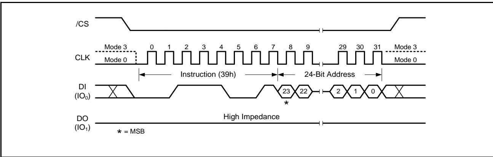

Figure 54a. Individual Block Unlock Instruction

56

Publication Release Date: March 27, 2018 Revision F

W25Q128JV

## winbond

## 8.2.34 Read Block/Sector Lock (3Dh)

The Individual Block/Sector Lock provides an alternative way to protect the memory array from adverse Erase/Program. In order to use the Individual Block/Sector Locks, the WPS bit in Status Register-3 must be set to 1. If WPS=0, the write protection will be determined by the combination of CMP, SEC, TB, BP[2:0] bits in the Status Registers. The Individual Block/Sector Lock bits are volatile bits. The default values after device power up or after a Reset are 1, so the entire memory array is being protected.

To read out the lock bit value of a specific block or sector as illustrated in Figure 4d, a Read Block/Sector Lock command must be issued by driving /CS low, shifting the instruction code “3Dh” into the Data Input (DI) pin on the rising edge of CLK, followed by a 24-bit address. The Block/Sector Lock bit value will be shifted out on the DO pin at the falling edge of CLK with most significant bit (MSB) first as shown in Figure 55. If the least significant bit (LSB) is 1, the corresponding block/sector is locked; if LSB=0, the corresponding block/sector is unlocked, Erase/Program operation can be performed.

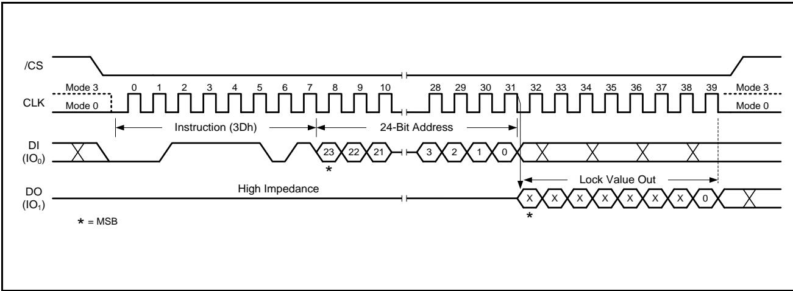

Figure 55a. Read Block Lock Instruction

57

W25Q128JV

## 8.2.35 Global Block/Sector Lock (7Eh)

All Block/Sector Lock bits can be set to 1 by the Global Block/Sector Lock instruction. The command must be issued by driving /CS low, shifting the instruction code “7Eh” into the Data Input (DI) pin on the rising edge of CLK, and then driving /CS high. A Write Enable instruction must be executed before the device will accept the Global Block/Sector Lock Instruction (Status Register bit WEL= 1).

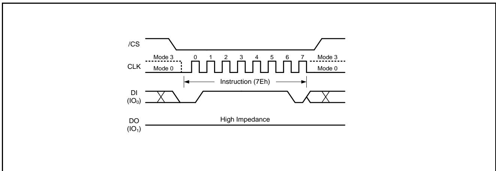

Figure 56. Global Block Lock Instruction for SPI Mode

## 8.2.36 Global Block/Sector Unlock (98h)

All Block/Sector Lock bits can be set to 0 by the Global Block/Sector Unlock instruction. The command must be issued by driving /CS low, shifting the instruction code “98h” into the Data Input (DI) pin on the rising edge of CLK, and then driving /CS high. A Write Enable instruction must be executed before the device will accept the Global Block/Sector Unlock Instruction (Status Register bit WEL= 1).

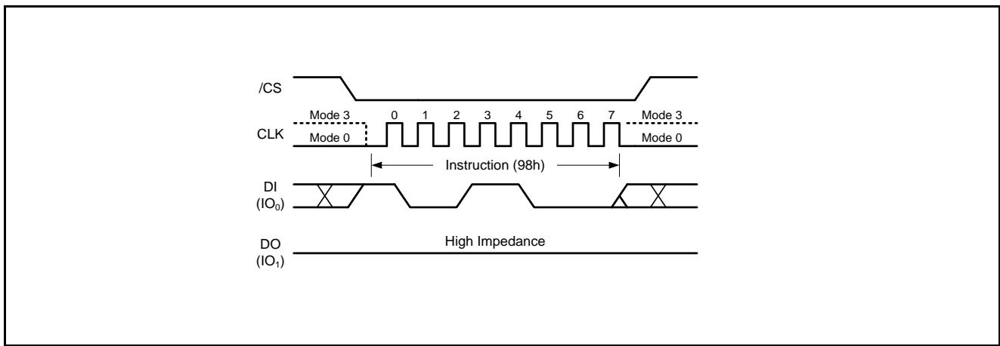

Figure 57. Global Block Unlock Instruction for SPI Mode

58

Publication Release Date: March 27, 2018 Revision F

W25Q128JV

## winbond

## 8.2.37 Enable Reset (66h) and Reset Device (99h)

Because of the small package and the limitation on the number of pins, the W25Q128JV provide a software Reset instruction instead of a dedicated RESET pin. Once the Reset instruction is accepted, any on-going internal operations will be terminated and the device will return to its default power-on state and lose all the current volatile settings, such as Volatile Status Register bits, Write Enable Latch (WEL) status, Program/Erase Suspend status, Read parameter setting (P7-P0), and Wrap Bit setting (W6-W4).

“Enable Reset (66h)” and “Reset (99h)” instructions can be issued in SPI. To avoid accidental reset, both instructions must be issued in sequence. Any other commands other than “Reset (99h)” after the “Enable Reset (66h)” command will disable the “Reset Enable” state. A new sequence of “Enable Reset (66h)” and “Reset (99h)” is needed to reset the device. Once the Reset command is accepted by the device, the device will take approximately tRST=30us to reset. During this period, no command will be accepted.

Data corruption may happen if there is an on-going or suspended internal Erase or Program operation when Reset command sequence is accepted by the device. It is recommended to check the BUSY bit and the SUS bit in Status Register before issuing the Reset command sequence.

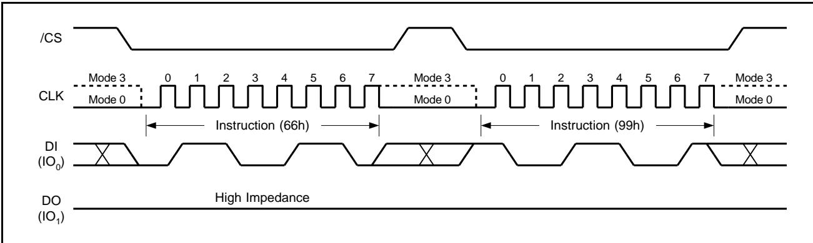

Figure 58a. Enable Reset and Reset Instruction Sequence

59

W25Q128JV

# winbond

## 9. ELECTRICAL CHARACTERISTICS

9.1 Absolute Maximum Ratings (1)

<table><tr><td rowspan=1 colspan=1>PARAMETERS</td><td rowspan=1 colspan=1>SYMBOL</td><td rowspan=1 colspan=1>CONDITIONS</td><td rowspan=1 colspan=1>RANGE</td><td rowspan=1 colspan=1>UNIT</td></tr><tr><td rowspan=1 colspan=1>Supply Voltage</td><td rowspan=1 colspan=1>VCC</td><td rowspan=1 colspan=1></td><td rowspan=1 colspan=1>–0.6 to 4.6</td><td rowspan=1 colspan=1>V</td></tr><tr><td rowspan=1 colspan=1>Voltage Applied to Any Pin</td><td rowspan=1 colspan=1>VIO</td><td rowspan=1 colspan=1>Relative to Ground</td><td rowspan=1 colspan=1>–0.6 to VCC+0.4</td><td rowspan=1 colspan=1>V</td></tr><tr><td rowspan=1 colspan=1>Transient Voltage on any Pin</td><td rowspan=1 colspan=1>VIOT</td><td rowspan=1 colspan=1><20nS TransientRelative to Ground</td><td rowspan=1 colspan=1>-2.0V to VCC+2.0V</td><td rowspan=1 colspan=1>V</td></tr><tr><td rowspan=1 colspan=1>Storage Temperature</td><td rowspan=1 colspan=1>TSTG</td><td rowspan=1 colspan=1></td><td rowspan=1 colspan=1>–65 to +150</td><td rowspan=1 colspan=1>℃</td></tr><tr><td rowspan=1 colspan=1>Lead Temperature</td><td rowspan=1 colspan=1>TLEAD</td><td rowspan=1 colspan=1></td><td rowspan=1 colspan=1>See Note (2)</td><td rowspan=1 colspan=1>℃</td></tr><tr><td rowspan=1 colspan=1>Electrostatic Discharge Voltage</td><td rowspan=1 colspan=1>VESD</td><td rowspan=1 colspan=1>Human Body Model(3)</td><td rowspan=1 colspan=1>-2000 to +2000</td><td rowspan=1 colspan=1>V</td></tr></table>

## Notes:

1. This device has been designed and tested for the specified operation ranges. Proper operation outside of these levels is not guaranteed. Exposure to absolute maximum ratings may affect device reliability. Exposure beyond absolute maximum ratings may cause permanent damage.

2. Compliant with JEDEC Standard J-STD-20C for small body Sn-Pb or Pb-free (Green) assembly and the European directive on restrictions on hazardous substances (RoHS) 2002/95/EU.

3. JEDEC Std JESD22-A114A (C1=100pF, R1=1500 ohms, R2=500 ohms).

9.2 Operating Ranges

<table><tr><td rowspan=2 colspan=1>PARAMETER</td><td rowspan=2 colspan=1>SYMBOL</td><td rowspan=2 colspan=1>CONDITIONS</td><td rowspan=1 colspan=2>SPEC</td><td rowspan=2 colspan=1>UNIT</td></tr><tr><td rowspan=1 colspan=1>MIN</td><td rowspan=1 colspan=1>MAX</td></tr><tr><td rowspan=2 colspan=1>Supply Voltage(1)</td><td rowspan=2 colspan=1>VCC</td><td rowspan=1 colspan=1>FR = 133MHz,   fR = 50MHz</td><td rowspan=1 colspan=1>3.0</td><td rowspan=1 colspan=1>3.6</td><td rowspan=1 colspan=1>V</td></tr><tr><td rowspan=1 colspan=1>FR = 104MHz,   fR = 50MHz</td><td rowspan=1 colspan=1>2.7</td><td rowspan=1 colspan=1>3.0</td><td rowspan=1 colspan=1>V</td></tr><tr><td rowspan=2 colspan=1>Ambient Temperature,Operating</td><td rowspan=2 colspan=1>TA</td><td rowspan=1 colspan=1>Industrial</td><td rowspan=1 colspan=1>-40</td><td rowspan=1 colspan=1>+85</td><td rowspan=1 colspan=1>℃</td></tr><tr><td rowspan=1 colspan=1>Industrial Plus</td><td rowspan=1 colspan=1>-40</td><td rowspan=1 colspan=1>+105</td><td rowspan=1 colspan=1>℃</td></tr></table>

## Note:

1. VCC voltage during Read can operate across the min and max range but should not exceed ±10% of the programming (erase/write) voltage.

60

Publication Release Date: March 27, 2018 Revision F

W25Q128JV

winbond

## 9.3 Power-Up Power-Down Timing and Requirements

<table><tr><td rowspan=2 colspan=1>PARAMETER</td><td rowspan=2 colspan=1>SYMBOL</td><td rowspan=1 colspan=2>SPEC</td><td rowspan=2 colspan=1>UNIT</td></tr><tr><td rowspan=1 colspan=1>MIN</td><td rowspan=1 colspan=1>MAX</td></tr><tr><td rowspan=1 colspan=1>VCC (min) to /CS Low</td><td rowspan=1 colspan=1>tVSL(1)</td><td rowspan=1 colspan=1>20</td><td rowspan=1 colspan=1></td><td rowspan=1 colspan=1>μs</td></tr><tr><td rowspan=1 colspan=1>Time Delay Before Write Instruction</td><td rowspan=1 colspan=1>tPUW(1)</td><td rowspan=1 colspan=1>5</td><td rowspan=1 colspan=1></td><td rowspan=1 colspan=1>ms</td></tr><tr><td rowspan=1 colspan=1>Write Inhibit Threshold Voltage</td><td rowspan=1 colspan=1>VWI(1)</td><td rowspan=1 colspan=1>1.0</td><td rowspan=1 colspan=1>2.0</td><td rowspan=1 colspan=1>V</td></tr></table>

## Note:

1. These parameters are characterized only.

Figure 58a. Power-up Timing and Voltage Levels

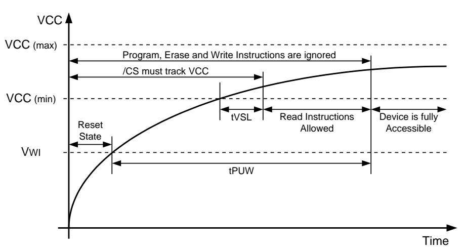

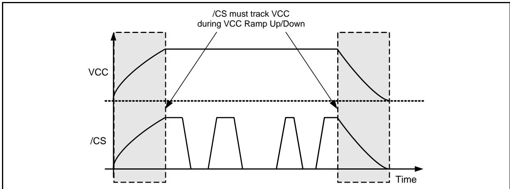

Figure 58b. Power-up, Power-Down Requirement

61

W25Q128JV

## winbond

9.4 DC Electrical Characteristics-

<table><tr><td rowspan=2 colspan=1>PARAMETER</td><td rowspan=2 colspan=1>SYMBOL</td><td rowspan=2 colspan=1>CONDITIONS</td><td rowspan=1 colspan=3>SPEC</td><td rowspan=2 colspan=1>UNIT</td></tr><tr><td rowspan=1 colspan=1>MIN</td><td rowspan=1 colspan=1>TYP</td><td rowspan=1 colspan=1>MAX</td></tr><tr><td rowspan=1 colspan=1>Input Capacitance</td><td rowspan=1 colspan=1>CIN(1)</td><td rowspan=1 colspan=1>VIN = 0V(1)</td><td rowspan=1 colspan=1></td><td rowspan=1 colspan=1></td><td rowspan=1 colspan=1>6</td><td rowspan=1 colspan=1>pF</td></tr><tr><td rowspan=1 colspan=1>Output Capacitance</td><td rowspan=1 colspan=1>Cout(1)</td><td rowspan=1 colspan=1>VOUT = 0V(1)</td><td rowspan=1 colspan=1></td><td rowspan=1 colspan=1></td><td rowspan=1 colspan=1>8</td><td rowspan=1 colspan=1>pF</td></tr><tr><td rowspan=1 colspan=1>Input Leakage</td><td rowspan=1 colspan=1>ILI</td><td rowspan=1 colspan=1></td><td rowspan=1 colspan=1></td><td rowspan=1 colspan=1></td><td rowspan=1 colspan=1>±2</td><td rowspan=1 colspan=1>μA</td></tr><tr><td rowspan=1 colspan=1>I/O Leakage</td><td rowspan=1 colspan=1>ILO</td><td rowspan=1 colspan=1></td><td rowspan=1 colspan=1></td><td rowspan=1 colspan=1></td><td rowspan=1 colspan=1>±2</td><td rowspan=1 colspan=1>μA</td></tr><tr><td rowspan=1 colspan=1>Standby Current</td><td rowspan=1 colspan=1>Icc1</td><td rowspan=1 colspan=1>/CS = VCC,VIN = GND or VCC</td><td rowspan=1 colspan=1></td><td rowspan=1 colspan=1>10</td><td rowspan=1 colspan=1>60</td><td rowspan=1 colspan=1>μA</td></tr><tr><td rowspan=1 colspan=1>Power-down Current</td><td rowspan=1 colspan=1>Icc2</td><td rowspan=1 colspan=1>/CS = VCC,VIN = GND or VCC</td><td rowspan=1 colspan=1></td><td rowspan=1 colspan=1>1</td><td rowspan=1 colspan=1>20</td><td rowspan=1 colspan=1>μA</td></tr><tr><td rowspan=1 colspan=1>Current Read Data /Dual /Quad 50MHz(2)</td><td rowspan=1 colspan=1>Icc3</td><td rowspan=1 colspan=1>C = 0.1 VCC / 0.9 VCCDO = Open</td><td rowspan=1 colspan=1></td><td rowspan=1 colspan=1>8</td><td rowspan=1 colspan=1>15</td><td rowspan=1 colspan=1>mA</td></tr><tr><td rowspan=1 colspan=1>Current Read Data /Dual /Quad 80MHz(2)</td><td rowspan=1 colspan=1>Icc3</td><td rowspan=1 colspan=1>C = 0.1 VCC / 0.9 VCCDO = Open</td><td rowspan=1 colspan=1></td><td rowspan=1 colspan=1>10</td><td rowspan=1 colspan=1>18</td><td rowspan=1 colspan=1>mA</td></tr><tr><td rowspan=1 colspan=1>Current Read Data /Dual /Quad 104MHz(2)</td><td rowspan=1 colspan=1>Icc3</td><td rowspan=1 colspan=1>C = 0.1 VCC / 0.9 VCCDO = Open</td><td rowspan=1 colspan=1></td><td rowspan=1 colspan=1>12</td><td rowspan=1 colspan=1>20</td><td rowspan=1 colspan=1>mA</td></tr><tr><td rowspan=1 colspan=1>Current Write StatusRegister</td><td rowspan=1 colspan=1>Icc4</td><td rowspan=1 colspan=1>/CS = VCC</td><td rowspan=1 colspan=1></td><td rowspan=1 colspan=1>20</td><td rowspan=1 colspan=1>25</td><td rowspan=1 colspan=1>mA</td></tr><tr><td rowspan=1 colspan=1>Current Page Program</td><td rowspan=1 colspan=1>lcc5</td><td rowspan=1 colspan=1>/CS = VCC</td><td rowspan=1 colspan=1></td><td rowspan=1 colspan=1>20</td><td rowspan=1 colspan=1>25</td><td rowspan=1 colspan=1>mA</td></tr><tr><td rowspan=1 colspan=1>Current Sector/BlockErase</td><td rowspan=1 colspan=1>lcc6</td><td rowspan=1 colspan=1>/CS = VCC</td><td rowspan=1 colspan=1></td><td rowspan=1 colspan=1>20</td><td rowspan=1 colspan=1>25</td><td rowspan=1 colspan=1>mA</td></tr><tr><td rowspan=1 colspan=1>Current Chip Erase</td><td rowspan=1 colspan=1>Icc7</td><td rowspan=1 colspan=1>/CS = VCC</td><td rowspan=1 colspan=1></td><td rowspan=1 colspan=1>20</td><td rowspan=1 colspan=1>25</td><td rowspan=1 colspan=1>mA</td></tr><tr><td rowspan=1 colspan=1>Input Low Voltage</td><td rowspan=1 colspan=1>VIL</td><td rowspan=1 colspan=1></td><td rowspan=1 colspan=1>-0.5</td><td rowspan=1 colspan=1></td><td rowspan=1 colspan=1>VCC x 0.3</td><td rowspan=1 colspan=1>V</td></tr><tr><td rowspan=1 colspan=1>Input High Voltage</td><td rowspan=1 colspan=1>VIH</td><td rowspan=1 colspan=1></td><td rowspan=1 colspan=1>VCC x 0.7</td><td rowspan=1 colspan=1></td><td rowspan=1 colspan=1>VCC + 0.4</td><td rowspan=1 colspan=1>V</td></tr><tr><td rowspan=1 colspan=1>Output Low Voltage</td><td rowspan=1 colspan=1>VOL</td><td rowspan=1 colspan=1>IOL = 100 μA</td><td rowspan=1 colspan=1></td><td rowspan=1 colspan=1></td><td rowspan=1 colspan=1>0.2</td><td rowspan=1 colspan=1>V</td></tr><tr><td rowspan=1 colspan=1>Output High Voltage</td><td rowspan=1 colspan=1>VOH</td><td rowspan=1 colspan=1>IOH = -100 μA</td><td rowspan=1 colspan=1>VCC - 0.2</td><td rowspan=1 colspan=1></td><td rowspan=1 colspan=1></td><td rowspan=1 colspan=1>V</td></tr></table>

## Notes:

2. Checker Board Pattern.

1. Tested on sample basis and specified through design and characterization data. TA = 25° C, VCC = 3.0V.

62

Publication Release Date: March 27, 2018 Revision F

W25Q128JV

## winbond

9.5 AC Measurement Conditions

<table><tr><td rowspan=2 colspan=1>PARAMETER</td><td rowspan=2 colspan=1>SYMBOL</td><td rowspan=1 colspan=2>SPEC</td><td rowspan=2 colspan=1>UNIT</td></tr><tr><td rowspan=1 colspan=1>MIN</td><td rowspan=1 colspan=1>MAX</td></tr><tr><td rowspan=1 colspan=1>Load Capacitance</td><td rowspan=1 colspan=1>CL</td><td rowspan=1 colspan=1></td><td rowspan=1 colspan=1>30</td><td rowspan=1 colspan=1>pF</td></tr><tr><td rowspan=1 colspan=1>Input Rise and Fall Times</td><td rowspan=1 colspan=1>TR, TF</td><td rowspan=1 colspan=1></td><td rowspan=1 colspan=1>5</td><td rowspan=1 colspan=1>ns</td></tr><tr><td rowspan=1 colspan=1>Input Pulse Voltages</td><td rowspan=1 colspan=1>VIN</td><td rowspan=1 colspan=2>0.1 VCC to 0.9 VCC</td><td rowspan=1 colspan=1>V</td></tr><tr><td rowspan=1 colspan=1>Input Timing Reference Voltages</td><td rowspan=1 colspan=1>IN</td><td rowspan=1 colspan=2>0.3 VCC to 0.7 VCC</td><td rowspan=1 colspan=1>V</td></tr><tr><td rowspan=1 colspan=1>Output Timing Reference Voltages</td><td rowspan=1 colspan=1>OUT</td><td rowspan=1 colspan=2>0.5 VCC to 0.5 VCC</td><td rowspan=1 colspan=1>V</td></tr></table>

## Note:

1. Output Hi-Z is defined as the point where data out is no longer driven.

Figure 59. AC Measurement I/O Waveform

63

W25Q128JV

winbond

9.6 AC Electrical Characteristics(6)

<table><tr><td rowspan=2 colspan=1>DESCRIPTION</td><td rowspan=2 colspan=1>SYMBOL</td><td rowspan=2 colspan=1>ALT</td><td rowspan=1 colspan=3>SPEC</td><td rowspan=2 colspan=1>UNIT</td></tr><tr><td rowspan=1 colspan=1>MIN</td><td rowspan=1 colspan=1>TYP</td><td rowspan=1 colspan=1>MAX</td></tr><tr><td rowspan=1 colspan=1>Clock frequency except for Read Data (03h)instructions (3.0V-3.6V)</td><td rowspan=1 colspan=1>FR</td><td rowspan=1 colspan=1>fc1</td><td rowspan=1 colspan=1>D.C.</td><td rowspan=1 colspan=1></td><td rowspan=1 colspan=1>133</td><td rowspan=1 colspan=1>MHz</td></tr><tr><td rowspan=1 colspan=1>Clock frequency except for Read Data (03h)instructions(2.7V-3.0V)</td><td rowspan=1 colspan=1>FR</td><td rowspan=1 colspan=1>fc2</td><td rowspan=1 colspan=1>D.C.</td><td rowspan=1 colspan=1></td><td rowspan=1 colspan=1>104</td><td rowspan=1 colspan=1>MHz</td></tr><tr><td rowspan=1 colspan=1>Clock frequency for Read Data instruction (03h)</td><td rowspan=1 colspan=1>fR</td><td rowspan=1 colspan=1></td><td rowspan=1 colspan=1>D.C.</td><td rowspan=1 colspan=1></td><td rowspan=1 colspan=1>50</td><td rowspan=1 colspan=1>MHz</td></tr><tr><td rowspan=1 colspan=1>Clock High, Low Timefor all instructions except for Read Data (03h)</td><td rowspan=1 colspan=1>tCLH,tCLL(i)</td><td rowspan=1 colspan=1></td><td rowspan=1 colspan=1>45%PC</td><td rowspan=1 colspan=1></td><td rowspan=1 colspan=1></td><td rowspan=1 colspan=1>ns</td></tr><tr><td rowspan=1 colspan=1>Clock High, Low Timefor Read Data (03h) instruction</td><td rowspan=1 colspan=1>tCRLH,tCRLL(1)</td><td rowspan=1 colspan=1></td><td rowspan=1 colspan=1>45%PC</td><td rowspan=1 colspan=1></td><td rowspan=1 colspan=1></td><td rowspan=1 colspan=1>ns</td></tr><tr><td rowspan=1 colspan=1>Clock Rise Time peak to peak</td><td rowspan=1 colspan=1>tCLCH(2)</td><td rowspan=1 colspan=1></td><td rowspan=1 colspan=1>0.1</td><td rowspan=1 colspan=1></td><td rowspan=1 colspan=1></td><td rowspan=1 colspan=1>V/ns</td></tr><tr><td rowspan=1 colspan=1>Clock Fall Time peak to peak</td><td rowspan=1 colspan=1>tCHCL(2)</td><td rowspan=1 colspan=1></td><td rowspan=1 colspan=1>0.1</td><td rowspan=1 colspan=1></td><td rowspan=1 colspan=1></td><td rowspan=1 colspan=1>V/ns</td></tr><tr><td rowspan=1 colspan=1>/CS Active Setup Time relative to CLK</td><td rowspan=1 colspan=1>tSLCH</td><td rowspan=1 colspan=1>tcss</td><td rowspan=1 colspan=1>3</td><td rowspan=1 colspan=1></td><td rowspan=1 colspan=1></td><td rowspan=1 colspan=1>ns</td></tr><tr><td rowspan=1 colspan=1>/CS Not Active Hold Time relative to CLK</td><td rowspan=1 colspan=1>tCHSL</td><td rowspan=1 colspan=1></td><td rowspan=1 colspan=1>3</td><td rowspan=1 colspan=1></td><td rowspan=1 colspan=1></td><td rowspan=1 colspan=1>ns</td></tr><tr><td rowspan=1 colspan=1>Data In Setup Time</td><td rowspan=1 colspan=1>tDVCH</td><td rowspan=1 colspan=1>tDSU</td><td rowspan=1 colspan=1>1</td><td rowspan=1 colspan=1></td><td rowspan=1 colspan=1></td><td rowspan=1 colspan=1>ns</td></tr><tr><td rowspan=1 colspan=1>Data In Hold Time</td><td rowspan=1 colspan=1>tCHDX</td><td rowspan=1 colspan=1>tDH</td><td rowspan=1 colspan=1>2</td><td rowspan=1 colspan=1></td><td rowspan=1 colspan=1></td><td rowspan=1 colspan=1>ns</td></tr><tr><td rowspan=1 colspan=1>/CS Active Hold Time relative to CLK</td><td rowspan=1 colspan=1>tCHSH</td><td rowspan=1 colspan=1></td><td rowspan=1 colspan=1>3</td><td rowspan=1 colspan=1></td><td rowspan=1 colspan=1></td><td rowspan=1 colspan=1>ns</td></tr><tr><td rowspan=1 colspan=1>/CS Not Active Setup Time relative to CLK</td><td rowspan=1 colspan=1>tSHCH</td><td rowspan=1 colspan=1></td><td rowspan=1 colspan=1>3</td><td rowspan=1 colspan=1></td><td rowspan=1 colspan=1></td><td rowspan=1 colspan=1>ns</td></tr><tr><td rowspan=1 colspan=1>/CS Deselect Time (for Read)</td><td rowspan=1 colspan=1>tSHSL1</td><td rowspan=1 colspan=1>tCSH</td><td rowspan=1 colspan=1>10</td><td rowspan=1 colspan=1></td><td rowspan=1 colspan=1></td><td rowspan=1 colspan=1>ns</td></tr><tr><td rowspan=1 colspan=1>/CS Deselect Time (for Erase or Program or Write)</td><td rowspan=1 colspan=1>tSHSL2</td><td rowspan=1 colspan=1>tCSH</td><td rowspan=1 colspan=1>50</td><td rowspan=1 colspan=1></td><td rowspan=1 colspan=1></td><td rowspan=1 colspan=1>ns</td></tr><tr><td rowspan=1 colspan=1>Output Disable Time</td><td rowspan=1 colspan=1>tSHQz(2)</td><td rowspan=1 colspan=1>tDIS</td><td rowspan=1 colspan=1></td><td rowspan=1 colspan=1></td><td rowspan=1 colspan=1>7</td><td rowspan=1 colspan=1>ns</td></tr><tr><td rowspan=1 colspan=1>Clock Low to Output Valid</td><td rowspan=1 colspan=1>tCLQV</td><td rowspan=1 colspan=1>tv</td><td rowspan=1 colspan=1></td><td rowspan=1 colspan=1></td><td rowspan=1 colspan=1>6</td><td rowspan=1 colspan=1>ns</td></tr><tr><td rowspan=1 colspan=1>Output Hold Time</td><td rowspan=1 colspan=1>tCLQX</td><td rowspan=1 colspan=1>tHO</td><td rowspan=1 colspan=1>1.5</td><td rowspan=1 colspan=1></td><td rowspan=1 colspan=1></td><td rowspan=1 colspan=1>ns</td></tr></table>

Continued – next page AC Electrical Characteristics (cont’d)

64

Publication Release Date: March 27, 2018 Revision F

## W25Q128JV

## winbond

<table><tr><td rowspan=2 colspan=1>DESCRIPTION</td><td rowspan=2 colspan=1>SYMBOL</td><td rowspan=2 colspan=1>ALT</td><td rowspan=1 colspan=3>SPEC</td><td rowspan=2 colspan=1>UNIT</td></tr><tr><td rowspan=1 colspan=1>MIN</td><td rowspan=1 colspan=1>TYP</td><td rowspan=1 colspan=1>MAX</td></tr><tr><td rowspan=1 colspan=1>Write Protect Setup Time Before /CS Low</td><td rowspan=1 colspan=1>tWHSL(3)</td><td rowspan=1 colspan=1></td><td rowspan=1 colspan=1>20</td><td rowspan=1 colspan=1></td><td rowspan=1 colspan=1></td><td rowspan=1 colspan=1>ns</td></tr><tr><td rowspan=1 colspan=1>Write Protect Hold Time After /CS High</td><td rowspan=1 colspan=1>tSHWL(3)</td><td rowspan=1 colspan=1></td><td rowspan=1 colspan=1>100</td><td rowspan=1 colspan=1></td><td rowspan=1 colspan=1></td><td rowspan=1 colspan=1>ns</td></tr><tr><td rowspan=1 colspan=1>/CS High to Power-down Mode</td><td rowspan=1 colspan=1>tDp(2)</td><td rowspan=1 colspan=1></td><td rowspan=1 colspan=1></td><td rowspan=1 colspan=1></td><td rowspan=1 colspan=1>3</td><td rowspan=1 colspan=1>μs</td></tr><tr><td rowspan=1 colspan=1>/CS High to Standby Mode without ID Read</td><td rowspan=1 colspan=1>tRES1(2)</td><td rowspan=1 colspan=1></td><td rowspan=1 colspan=1></td><td rowspan=1 colspan=1></td><td rowspan=1 colspan=1>3</td><td rowspan=1 colspan=1>μs</td></tr><tr><td rowspan=1 colspan=1>/CS High to Standby Mode with ID Read</td><td rowspan=1 colspan=1>tRES2(2)</td><td rowspan=1 colspan=1></td><td rowspan=1 colspan=1></td><td rowspan=1 colspan=1></td><td rowspan=1 colspan=1>1.8</td><td rowspan=1 colspan=1>μs</td></tr><tr><td rowspan=1 colspan=1>/CS High to next Instruction after Suspend</td><td rowspan=1 colspan=1>tsus(2)</td><td rowspan=1 colspan=1></td><td rowspan=1 colspan=1></td><td rowspan=1 colspan=1></td><td rowspan=1 colspan=1>20</td><td rowspan=1 colspan=1>μs</td></tr><tr><td rowspan=1 colspan=1>/CS High to next Instruction after Reset</td><td rowspan=1 colspan=1>tRST(2)</td><td rowspan=1 colspan=1></td><td rowspan=1 colspan=1></td><td rowspan=1 colspan=1></td><td rowspan=1 colspan=1>30</td><td rowspan=1 colspan=1>μs</td></tr><tr><td rowspan=1 colspan=1>/RESET pin Low period to reset the device</td><td rowspan=1 colspan=1>tRESET(2)</td><td rowspan=1 colspan=1></td><td rowspan=1 colspan=1>1(4)</td><td rowspan=1 colspan=1></td><td rowspan=1 colspan=1></td><td rowspan=1 colspan=1>μs</td></tr><tr><td rowspan=1 colspan=1>Write Status Register Time</td><td rowspan=1 colspan=1>tw</td><td rowspan=1 colspan=1></td><td rowspan=1 colspan=1></td><td rowspan=1 colspan=1>10</td><td rowspan=1 colspan=1>15</td><td rowspan=1 colspan=1>ms</td></tr><tr><td rowspan=1 colspan=1>Page Program Time</td><td rowspan=1 colspan=1>tPP</td><td rowspan=1 colspan=1></td><td rowspan=1 colspan=1></td><td rowspan=1 colspan=1>0.4</td><td rowspan=1 colspan=1>3</td><td rowspan=1 colspan=1>ms</td></tr><tr><td rowspan=1 colspan=1>Sector Erase Time (4KB)</td><td rowspan=1 colspan=1>tSE</td><td rowspan=1 colspan=1></td><td rowspan=1 colspan=1></td><td rowspan=1 colspan=1>45</td><td rowspan=1 colspan=1>400</td><td rowspan=1 colspan=1>ms</td></tr><tr><td rowspan=1 colspan=1>Block Erase Time (32KB)</td><td rowspan=1 colspan=1>tBE1</td><td rowspan=1 colspan=1></td><td rowspan=1 colspan=1></td><td rowspan=1 colspan=1>120</td><td rowspan=1 colspan=1>1,600</td><td rowspan=1 colspan=1>ms</td></tr><tr><td rowspan=1 colspan=1>Block Erase Time (64KB)</td><td rowspan=1 colspan=1>tBE2</td><td rowspan=1 colspan=1></td><td rowspan=1 colspan=1></td><td rowspan=1 colspan=1>150</td><td rowspan=1 colspan=1>2,000</td><td rowspan=1 colspan=1>ms</td></tr><tr><td rowspan=1 colspan=1>Chip Erase Time</td><td rowspan=1 colspan=1>tCE</td><td rowspan=1 colspan=1></td><td rowspan=1 colspan=1></td><td rowspan=1 colspan=1>40</td><td rowspan=1 colspan=1>200</td><td rowspan=1 colspan=1>S</td></tr></table>

Notes:

1. Clock high or Clock low must be more than or equal to 45%Pc. Pc = 1/fc(max).

2. Value guaranteed by design and/or characterization, not 100% tested in production.

3. Only applicable as a constraint for a Write Status Register instruction when SRP=1.

4. It’s possible to reset the device with shorter t (as short as a few hundred ns), a 1us minimum is recommended to ensure reliable operation.

5. Tested on sample basis and specified through design and characterization data. TA = 25° C, VCC = 3.0V, 25% driver strength.

6. 4-bytes address alignment for Quad Read

65

W25Q128JV

# winbond

## 9.7 Serial Output Timing

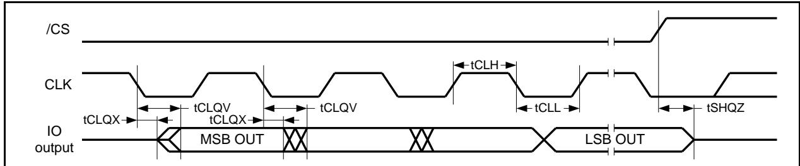

## 9.8 Serial Input Timing

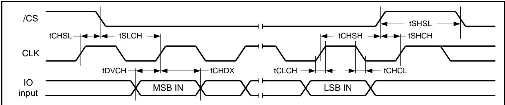

## 9.9 /WP Timing

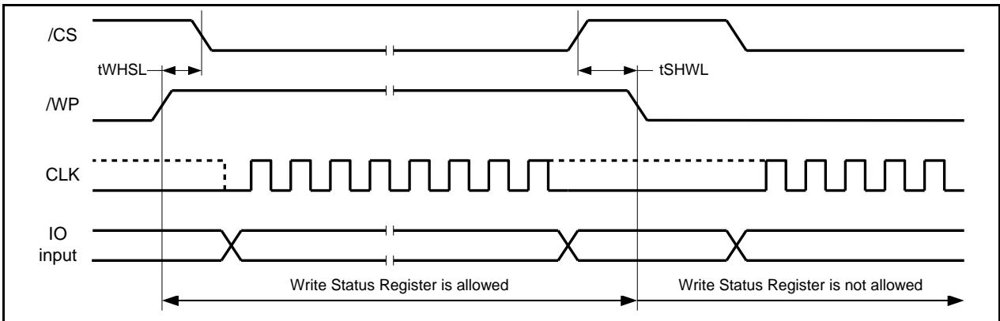

66

Publication Release Date: March 27, 2018 Revision F

W25Q128JV

winbond

10. PACKAGE SPECIFICATIONS

## 10.1 8-Pin SOIC 208-mil (Package Code S)

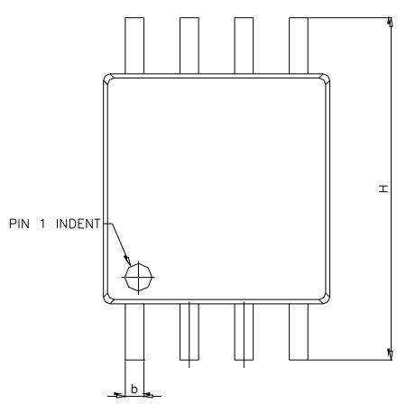

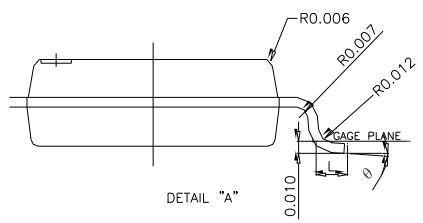

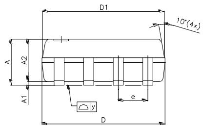

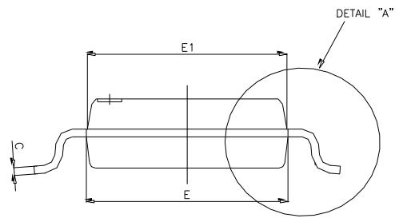

<table><tr><td rowspan=2 colspan=1>Symbol</td><td rowspan=1 colspan=3>Millimeters</td><td rowspan=1 colspan=3>Inches</td></tr><tr><td rowspan=1 colspan=1>Min</td><td rowspan=1 colspan=1>Nom</td><td rowspan=1 colspan=1>Max</td><td rowspan=1 colspan=1>Min</td><td rowspan=1 colspan=1>Nom</td><td rowspan=1 colspan=1>Max</td></tr><tr><td rowspan=1 colspan=1>A</td><td rowspan=1 colspan=1>1.75</td><td rowspan=1 colspan=1>1.95</td><td rowspan=1 colspan=1>2.16</td><td rowspan=1 colspan=1>0.069</td><td rowspan=1 colspan=1>0.077</td><td rowspan=1 colspan=1>0.085</td></tr><tr><td rowspan=1 colspan=1>A1</td><td rowspan=1 colspan=1>0.05</td><td rowspan=1 colspan=1>0.15</td><td rowspan=1 colspan=1>0.25</td><td rowspan=1 colspan=1>0.002</td><td rowspan=1 colspan=1>0.006</td><td rowspan=1 colspan=1>0.010</td></tr><tr><td rowspan=1 colspan=1>A2</td><td rowspan=1 colspan=1>1.70</td><td rowspan=1 colspan=1>1.80</td><td rowspan=1 colspan=1>1.91</td><td rowspan=1 colspan=1>0.067</td><td rowspan=1 colspan=1>0.071</td><td rowspan=1 colspan=1>0.075</td></tr><tr><td rowspan=1 colspan=1>b</td><td rowspan=1 colspan=1>0.35</td><td rowspan=1 colspan=1>0.42</td><td rowspan=1 colspan=1>0.48</td><td rowspan=1 colspan=1>0.014</td><td rowspan=1 colspan=1>0.017</td><td rowspan=1 colspan=1>0.019</td></tr><tr><td rowspan=1 colspan=1>C</td><td rowspan=1 colspan=1>0.19</td><td rowspan=1 colspan=1>0.20</td><td rowspan=1 colspan=1>0.25</td><td rowspan=1 colspan=1>0.007</td><td rowspan=1 colspan=1>0.008</td><td rowspan=1 colspan=1>0.010</td></tr><tr><td rowspan=1 colspan=1>D</td><td rowspan=1 colspan=1>5.18</td><td rowspan=1 colspan=1>5.28</td><td rowspan=1 colspan=1>5.38</td><td rowspan=1 colspan=1>0.204</td><td rowspan=1 colspan=1>0.208</td><td rowspan=1 colspan=1>0.212</td></tr><tr><td rowspan=1 colspan=1>D1</td><td rowspan=1 colspan=1>5.13</td><td rowspan=1 colspan=1>5.23</td><td rowspan=1 colspan=1>5.33</td><td rowspan=1 colspan=1>0.202</td><td rowspan=1 colspan=1>0.206</td><td rowspan=1 colspan=1>0.210</td></tr><tr><td rowspan=1 colspan=1>E</td><td rowspan=1 colspan=1>5.18</td><td rowspan=1 colspan=1>5.28</td><td rowspan=1 colspan=1>5.38</td><td rowspan=1 colspan=1>0.204</td><td rowspan=1 colspan=1>0.208</td><td rowspan=1 colspan=1>0.212</td></tr><tr><td rowspan=1 colspan=1>E1</td><td rowspan=1 colspan=1>5.13</td><td rowspan=1 colspan=1>5.23</td><td rowspan=1 colspan=1>5.33</td><td rowspan=1 colspan=1>0.202</td><td rowspan=1 colspan=1>0.206</td><td rowspan=1 colspan=1>0.210</td></tr><tr><td rowspan=1 colspan=1>e</td><td rowspan=1 colspan=3>1.27 BSC</td><td rowspan=1 colspan=3>0.050 BSC</td></tr><tr><td rowspan=1 colspan=1>H</td><td rowspan=1 colspan=1>7.70</td><td rowspan=1 colspan=1>7.90</td><td rowspan=1 colspan=1>8.10</td><td rowspan=1 colspan=1>0.303</td><td rowspan=1 colspan=1>0.311</td><td rowspan=1 colspan=1>0.319</td></tr><tr><td rowspan=1 colspan=1>L</td><td rowspan=1 colspan=1>0.50</td><td rowspan=1 colspan=1>0.65</td><td rowspan=1 colspan=1>0.80</td><td rowspan=1 colspan=1>0.020</td><td rowspan=1 colspan=1>0.026</td><td rowspan=1 colspan=1>0.031</td></tr><tr><td rowspan=1 colspan=1>y</td><td rowspan=1 colspan=1>---</td><td rowspan=1 colspan=1>---</td><td rowspan=1 colspan=1>0.10</td><td rowspan=1 colspan=1>---</td><td rowspan=1 colspan=1>---</td><td rowspan=1 colspan=1>0.004</td></tr><tr><td rowspan=1 colspan=1>θ</td><td rowspan=1 colspan=1>0°</td><td rowspan=1 colspan=1>---</td><td rowspan=1 colspan=1>8°</td><td rowspan=1 colspan=1>0°</td><td rowspan=1 colspan=1>---</td><td rowspan=1 colspan=1>8°</td></tr></table>

67

W25Q128JV

# winbond

## 10.2 16-Pin SOIC 300-mil (Package Code F)

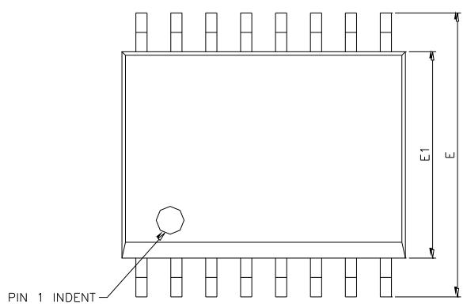

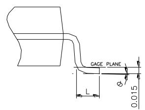

DETAIL A

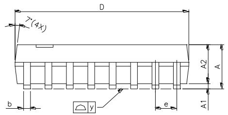

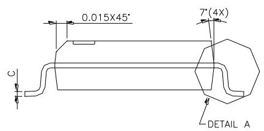

<table><tr><td rowspan=2 colspan=1>Symbol</td><td rowspan=1 colspan=3>Millimeters</td><td rowspan=1 colspan=3>Inches</td></tr><tr><td rowspan=1 colspan=1>Min</td><td rowspan=1 colspan=1>Nom</td><td rowspan=1 colspan=1>Max</td><td rowspan=1 colspan=1>Min</td><td rowspan=1 colspan=1>Nom</td><td rowspan=1 colspan=1>Max</td></tr><tr><td rowspan=1 colspan=1>A</td><td rowspan=1 colspan=1>2.36</td><td rowspan=1 colspan=1>2.49</td><td rowspan=1 colspan=1>2.64</td><td rowspan=1 colspan=1>0.093</td><td rowspan=1 colspan=1>0.098</td><td rowspan=1 colspan=1>0.104</td></tr><tr><td rowspan=1 colspan=1>A1</td><td rowspan=1 colspan=1>0.10</td><td rowspan=1 colspan=1>---</td><td rowspan=1 colspan=1>0.30</td><td rowspan=1 colspan=1>0.004</td><td rowspan=1 colspan=1>---</td><td rowspan=1 colspan=1>0.012</td></tr><tr><td rowspan=1 colspan=1>A2</td><td rowspan=1 colspan=1>---</td><td rowspan=1 colspan=1>2.31</td><td rowspan=1 colspan=1>---</td><td rowspan=1 colspan=1>---</td><td rowspan=1 colspan=1>0.091</td><td rowspan=1 colspan=1>---</td></tr><tr><td rowspan=1 colspan=1>b</td><td rowspan=1 colspan=1>0.33</td><td rowspan=1 colspan=1>0.41</td><td rowspan=1 colspan=1>0.51</td><td rowspan=1 colspan=1>0.013</td><td rowspan=1 colspan=1>0.016</td><td rowspan=1 colspan=1>0.020</td></tr><tr><td rowspan=1 colspan=1>C</td><td rowspan=1 colspan=1>0.18</td><td rowspan=1 colspan=1>0.23</td><td rowspan=1 colspan=1>0.28</td><td rowspan=1 colspan=1>0.007</td><td rowspan=1 colspan=1>0.009</td><td rowspan=1 colspan=1>0.011</td></tr><tr><td rowspan=1 colspan=1>D</td><td rowspan=1 colspan=1>10.08</td><td rowspan=1 colspan=1>10.31</td><td rowspan=1 colspan=1>10.49</td><td rowspan=1 colspan=1>0.397</td><td rowspan=1 colspan=1>0.406</td><td rowspan=1 colspan=1>0.413</td></tr><tr><td rowspan=1 colspan=1>E</td><td rowspan=1 colspan=1>10.01</td><td rowspan=1 colspan=1>10.31</td><td rowspan=1 colspan=1>10.64</td><td rowspan=1 colspan=1>0.394</td><td rowspan=1 colspan=1>0.406</td><td rowspan=1 colspan=1>0.419</td></tr><tr><td rowspan=1 colspan=1>E1</td><td rowspan=1 colspan=1>7.39</td><td rowspan=1 colspan=1>7.49</td><td rowspan=1 colspan=1>7.59</td><td rowspan=1 colspan=1>0.291</td><td rowspan=1 colspan=1>0.295</td><td rowspan=1 colspan=1>0.299</td></tr><tr><td rowspan=1 colspan=1>e</td><td rowspan=1 colspan=3>1.27 BSC</td><td rowspan=1 colspan=3>0.050 BSC</td></tr><tr><td rowspan=1 colspan=1>L</td><td rowspan=1 colspan=1>0.38</td><td rowspan=1 colspan=1>0.81</td><td rowspan=1 colspan=1>1.27</td><td rowspan=1 colspan=1>0.015</td><td rowspan=1 colspan=1>0.032</td><td rowspan=1 colspan=1>0.050</td></tr><tr><td rowspan=1 colspan=1>y</td><td rowspan=1 colspan=1>-</td><td rowspan=1 colspan=1>-</td><td rowspan=1 colspan=1>0.10</td><td rowspan=1 colspan=1>---</td><td rowspan=1 colspan=1>---</td><td rowspan=1 colspan=1>0.004</td></tr><tr><td rowspan=1 colspan=1>e</td><td rowspan=1 colspan=1>0°</td><td rowspan=1 colspan=1>---</td><td rowspan=1 colspan=1>8°</td><td rowspan=1 colspan=1>0°</td><td rowspan=1 colspan=1>---</td><td rowspan=1 colspan=1>8°</td></tr></table>

68

Publication Release Date: March 27, 2018 Revision F

W25Q128JV

# winbond

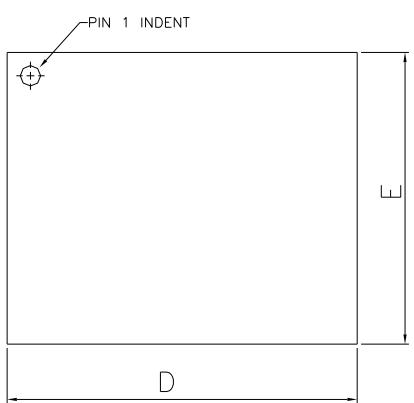

10.3 8-Pad WSON 6x5-mm (Package Code P)

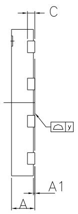

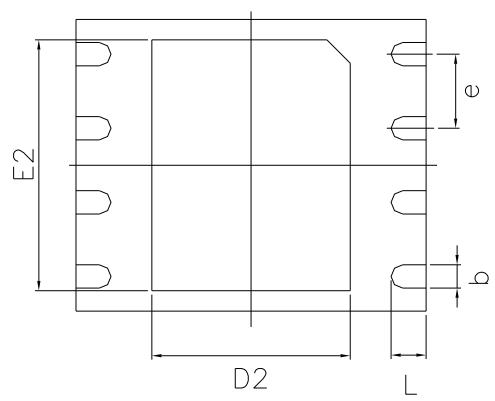

<table><tr><td rowspan=2 colspan=1>Symbol</td><td rowspan=1 colspan=3>Millimeters</td><td rowspan=1 colspan=3>Inches</td></tr><tr><td rowspan=1 colspan=1>Min</td><td rowspan=1 colspan=1>Nom</td><td rowspan=1 colspan=1>Max</td><td rowspan=1 colspan=1>Min</td><td rowspan=1 colspan=1>Nom</td><td rowspan=1 colspan=1>Max</td></tr><tr><td rowspan=1 colspan=1>A</td><td rowspan=1 colspan=1>0.70</td><td rowspan=1 colspan=1>0.75</td><td rowspan=1 colspan=1>0.80</td><td rowspan=1 colspan=1>0.028</td><td rowspan=1 colspan=1>0.030</td><td rowspan=1 colspan=1>0.031</td></tr><tr><td rowspan=1 colspan=1>A1</td><td rowspan=1 colspan=1>0.00</td><td rowspan=1 colspan=1>0.02</td><td rowspan=1 colspan=1>0.05</td><td rowspan=1 colspan=1>0.000</td><td rowspan=1 colspan=1>0.001</td><td rowspan=1 colspan=1>0.002</td></tr><tr><td rowspan=1 colspan=1>b</td><td rowspan=1 colspan=1>0.35</td><td rowspan=1 colspan=1>0.40</td><td rowspan=1 colspan=1>0.48</td><td rowspan=1 colspan=1>0.014</td><td rowspan=1 colspan=1>0.016</td><td rowspan=1 colspan=1>0.019</td></tr><tr><td rowspan=1 colspan=1>C</td><td rowspan=1 colspan=1>---</td><td rowspan=1 colspan=1>0.20 REF</td><td rowspan=1 colspan=1>---</td><td rowspan=1 colspan=1>---</td><td rowspan=1 colspan=1>0.008 REF</td><td rowspan=1 colspan=1>---</td></tr><tr><td rowspan=1 colspan=1>D</td><td rowspan=1 colspan=1>5.90</td><td rowspan=1 colspan=1>6.00</td><td rowspan=1 colspan=1>6.10</td><td rowspan=1 colspan=1>0.232</td><td rowspan=1 colspan=1>0.236</td><td rowspan=1 colspan=1>0.240</td></tr><tr><td rowspan=1 colspan=1>D2</td><td rowspan=1 colspan=1>3.35</td><td rowspan=1 colspan=1>3.40</td><td rowspan=1 colspan=1>3.45</td><td rowspan=1 colspan=1>0.132</td><td rowspan=1 colspan=1>0.134</td><td rowspan=1 colspan=1>0.136</td></tr><tr><td rowspan=1 colspan=1>E</td><td rowspan=1 colspan=1>4.90</td><td rowspan=1 colspan=1>5.00</td><td rowspan=1 colspan=1>5.10</td><td rowspan=1 colspan=1>0.193</td><td rowspan=1 colspan=1>0.197</td><td rowspan=1 colspan=1>0.201</td></tr><tr><td rowspan=1 colspan=1>E2</td><td rowspan=1 colspan=1>4.25</td><td rowspan=1 colspan=1>4.30</td><td rowspan=1 colspan=1>4.35</td><td rowspan=1 colspan=1>0.167</td><td rowspan=1 colspan=1>0.169</td><td rowspan=1 colspan=1>0.171</td></tr><tr><td rowspan=1 colspan=1>e</td><td rowspan=1 colspan=3>1.27 BSC</td><td rowspan=1 colspan=3>0.050 BSC</td></tr><tr><td rowspan=1 colspan=1>L</td><td rowspan=1 colspan=1>0.55</td><td rowspan=1 colspan=1>0.60</td><td rowspan=1 colspan=1>0.65</td><td rowspan=1 colspan=1>0.022</td><td rowspan=1 colspan=1>0.024</td><td rowspan=1 colspan=1>0.026</td></tr><tr><td rowspan=1 colspan=1>y</td><td rowspan=1 colspan=1>0.00</td><td rowspan=1 colspan=1>---</td><td rowspan=1 colspan=1>0.075</td><td rowspan=1 colspan=1>0.000</td><td rowspan=1 colspan=1>---</td><td rowspan=1 colspan=1>0.003</td></tr></table>

Note:

The metal pad area on the bottom center of the package is not connected to any internal electrical signals. It can be left floating or connected to the device ground (GND pin). Avoid placement of exposed PCB vias under the pad.

69

W25Q128JV

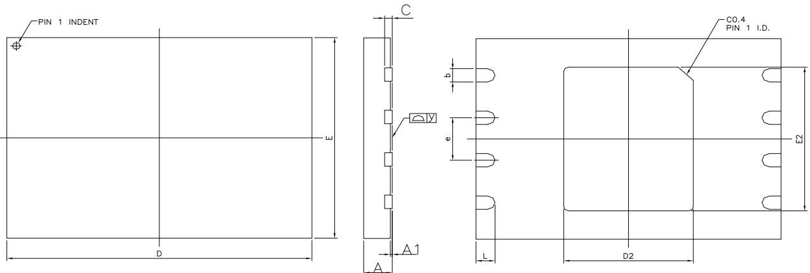

# winbond

10.4 8-Pad WSON 8x6-mm (Package Code E)

<table><tr><td colspan="2">-PIN 1 INDENT</td></tr><tr><td>由</td><td>E</td></tr><tr><td></td><td></td></tr><tr><td colspan="2"></td></tr></table>

<table><tr><td rowspan=2 colspan=1>SYMBOL</td><td rowspan=1 colspan=3>MILLIMETERS</td><td rowspan=1 colspan=3>INCHES</td></tr><tr><td rowspan=1 colspan=1>Min</td><td rowspan=1 colspan=1>Nom</td><td rowspan=1 colspan=1>Max</td><td rowspan=1 colspan=1>Min</td><td rowspan=1 colspan=1>Nom</td><td rowspan=1 colspan=1>Max</td></tr><tr><td rowspan=1 colspan=1>A</td><td rowspan=1 colspan=1>0.70</td><td rowspan=1 colspan=1>0.75</td><td rowspan=1 colspan=1>0.80</td><td rowspan=1 colspan=1>0.028</td><td rowspan=1 colspan=1>0.030</td><td rowspan=1 colspan=1>0.031</td></tr><tr><td rowspan=1 colspan=1>A1</td><td rowspan=1 colspan=1>0.00</td><td rowspan=1 colspan=1>0.02</td><td rowspan=1 colspan=1>0.05</td><td rowspan=1 colspan=1>0.000</td><td rowspan=1 colspan=1>0.001</td><td rowspan=1 colspan=1>0.002</td></tr><tr><td rowspan=1 colspan=1>b</td><td rowspan=1 colspan=1>0.35</td><td rowspan=1 colspan=1>0.40</td><td rowspan=1 colspan=1>0.48</td><td rowspan=1 colspan=1>0.014</td><td rowspan=1 colspan=1>0.016</td><td rowspan=1 colspan=1>0.019</td></tr><tr><td rowspan=1 colspan=1>C</td><td rowspan=1 colspan=1>---</td><td rowspan=1 colspan=1>0.20 Ref.</td><td rowspan=1 colspan=1>---</td><td rowspan=1 colspan=1>---</td><td rowspan=1 colspan=1>0.008 Ref.</td><td rowspan=1 colspan=1>---</td></tr><tr><td rowspan=1 colspan=1>D</td><td rowspan=1 colspan=1>7.90</td><td rowspan=1 colspan=1>8.00</td><td rowspan=1 colspan=1>8.10</td><td rowspan=1 colspan=1>0.311</td><td rowspan=1 colspan=1>0.315</td><td rowspan=1 colspan=1>0.319</td></tr><tr><td rowspan=1 colspan=1>D2</td><td rowspan=1 colspan=1>3.35</td><td rowspan=1 colspan=1>3.40</td><td rowspan=1 colspan=1>3.45</td><td rowspan=1 colspan=1>0.132</td><td rowspan=1 colspan=1>0.134</td><td rowspan=1 colspan=1>0.136</td></tr><tr><td rowspan=1 colspan=1>E</td><td rowspan=1 colspan=1>5.90</td><td rowspan=1 colspan=1>6.00</td><td rowspan=1 colspan=1>6.10</td><td rowspan=1 colspan=1>0.232</td><td rowspan=1 colspan=1>0.236</td><td rowspan=1 colspan=1>0.240</td></tr><tr><td rowspan=1 colspan=1>E2</td><td rowspan=1 colspan=1>4.25</td><td rowspan=1 colspan=1>4.30</td><td rowspan=1 colspan=1>4.35</td><td rowspan=1 colspan=1>0.167</td><td rowspan=1 colspan=1>0.169</td><td rowspan=1 colspan=1>0.171</td></tr><tr><td rowspan=1 colspan=1>e</td><td rowspan=1 colspan=3>1.27 BSC</td><td rowspan=1 colspan=3>0.050 BSC</td></tr><tr><td rowspan=1 colspan=1>L</td><td rowspan=1 colspan=1>0.45</td><td rowspan=1 colspan=1>0.50</td><td rowspan=1 colspan=1>0.55</td><td rowspan=1 colspan=1>0.018</td><td rowspan=1 colspan=1>0.020</td><td rowspan=1 colspan=1>0.022</td></tr><tr><td rowspan=1 colspan=1>y</td><td rowspan=1 colspan=1>0.00</td><td rowspan=1 colspan=1>---</td><td rowspan=1 colspan=1>0.05</td><td rowspan=1 colspan=1>0.000</td><td rowspan=1 colspan=1>---</td><td rowspan=1 colspan=1>0.002</td></tr></table>

## Note:

The metal pad area on the bottom center of the package is not connected to any internal electrical signals. It can be left floating or connected to the device ground (GND pin). Avoid placement of exposed PCB vias under the pad.

70

Publication Release Date: March 27, 2018 Revision F

W25Q128JV

# winbond

# 10.5 24-Ball TFBGA 8x6-mm (Package Code B, 5x5-1 ball array)

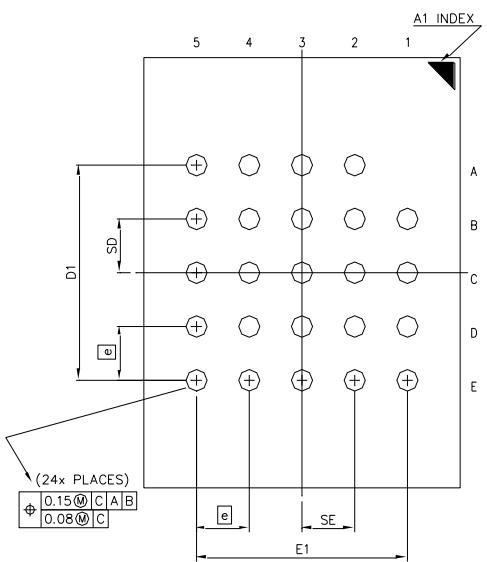

Note:

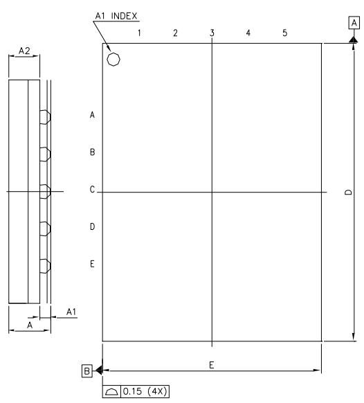

BALL OPENING

Ball land: 0.45mm. Ball Opening: 0.35mm

PCB ball land suggested <= 0.35mm

<table><tr><td rowspan=2 colspan=1>Symbol</td><td rowspan=1 colspan=3>Millimeters</td><td rowspan=1 colspan=3>Inches</td></tr><tr><td rowspan=1 colspan=1>Min</td><td rowspan=1 colspan=1>Nom</td><td rowspan=1 colspan=1>Max</td><td rowspan=1 colspan=1>Min</td><td rowspan=1 colspan=1>Nom</td><td rowspan=1 colspan=1>Max</td></tr><tr><td rowspan=1 colspan=1>A</td><td rowspan=1 colspan=1>---</td><td rowspan=1 colspan=1>---</td><td rowspan=1 colspan=1>1.20</td><td rowspan=1 colspan=1>---</td><td rowspan=1 colspan=1>---</td><td rowspan=1 colspan=1>0.047</td></tr><tr><td rowspan=1 colspan=1>A1</td><td rowspan=1 colspan=1>0.25</td><td rowspan=1 colspan=1>0.30</td><td rowspan=1 colspan=1>0.35</td><td rowspan=1 colspan=1>0.010</td><td rowspan=1 colspan=1>0.012</td><td rowspan=1 colspan=1>0.014</td></tr><tr><td rowspan=1 colspan=1>A2</td><td rowspan=1 colspan=1>---</td><td rowspan=1 colspan=1>0.85</td><td rowspan=1 colspan=1>---</td><td rowspan=1 colspan=1>---</td><td rowspan=1 colspan=1>0.033</td><td rowspan=1 colspan=1>---</td></tr><tr><td rowspan=1 colspan=1>b</td><td rowspan=1 colspan=1>0.35</td><td rowspan=1 colspan=1>0.40</td><td rowspan=1 colspan=1>0.45</td><td rowspan=1 colspan=1>0.014</td><td rowspan=1 colspan=1>0.016</td><td rowspan=1 colspan=1>0.018</td></tr><tr><td rowspan=1 colspan=1>D</td><td rowspan=1 colspan=1>7.90</td><td rowspan=1 colspan=1>8.00</td><td rowspan=1 colspan=1>8.10</td><td rowspan=1 colspan=1>0.311</td><td rowspan=1 colspan=1>0.315</td><td rowspan=1 colspan=1>0.319</td></tr><tr><td rowspan=1 colspan=1>D1</td><td rowspan=1 colspan=3>4.00 BSC</td><td rowspan=1 colspan=3>0.157 BSC</td></tr><tr><td rowspan=1 colspan=1>E</td><td rowspan=1 colspan=1>5.90</td><td rowspan=1 colspan=1>6.00</td><td rowspan=1 colspan=1>6.10</td><td rowspan=1 colspan=1>0.232</td><td rowspan=1 colspan=1>0.236</td><td rowspan=1 colspan=1>0.240</td></tr><tr><td rowspan=1 colspan=1>E1</td><td rowspan=1 colspan=3>4.00 BSC</td><td rowspan=1 colspan=3>0.157 BSC</td></tr><tr><td rowspan=1 colspan=1>SE</td><td rowspan=1 colspan=3>1.00 TYP</td><td rowspan=1 colspan=3>0.039 TYP</td></tr><tr><td rowspan=1 colspan=1>SD</td><td rowspan=1 colspan=3>1.00 TYP</td><td rowspan=1 colspan=3>0.039 TYP</td></tr><tr><td rowspan=1 colspan=1>e</td><td rowspan=1 colspan=3>1.00 BSC</td><td rowspan=1 colspan=3>0.039 BSC</td></tr></table>

71

W25Q128JV

Note:

# winbond

## 10.6 24-Ball TFBGA 8x6-mm (Package Code C, 6x4 ball array)

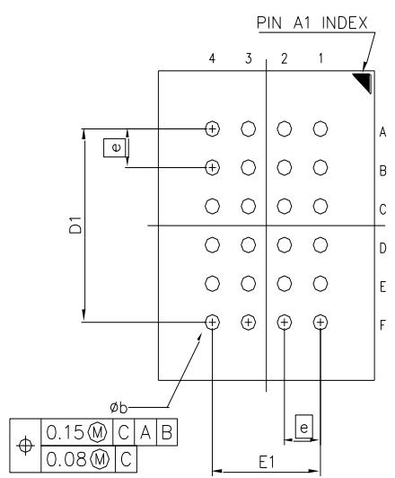

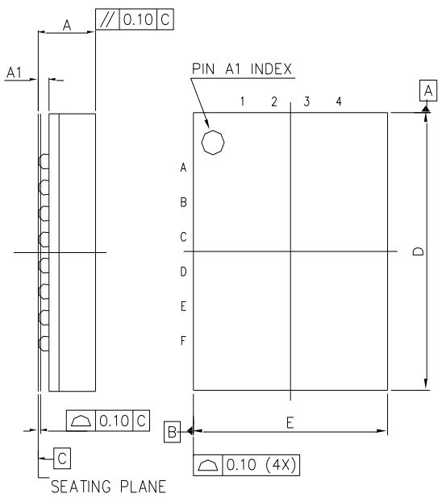

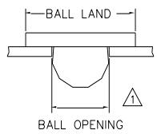

Ball land: 0.45mm. Ball Opening: 0.35mm PCB ball land suggested <= 0.35mm

<table><tr><td rowspan=2 colspan=1>Symbol</td><td rowspan=1 colspan=3>Millimeters</td><td rowspan=1 colspan=3>Inches</td></tr><tr><td rowspan=1 colspan=1>Min</td><td rowspan=1 colspan=1>Nom</td><td rowspan=1 colspan=1>Max</td><td rowspan=1 colspan=1>Min</td><td rowspan=1 colspan=1>Nom</td><td rowspan=1 colspan=1>Max</td></tr><tr><td rowspan=1 colspan=1>A</td><td rowspan=1 colspan=1>---</td><td rowspan=1 colspan=1>---</td><td rowspan=1 colspan=1>1.20</td><td rowspan=1 colspan=1>---</td><td rowspan=1 colspan=1>---</td><td rowspan=1 colspan=1>0.047</td></tr><tr><td rowspan=1 colspan=1>A1</td><td rowspan=1 colspan=1>0.25</td><td rowspan=1 colspan=1>0.30</td><td rowspan=1 colspan=1>0.35</td><td rowspan=1 colspan=1>0.010</td><td rowspan=1 colspan=1>0.012</td><td rowspan=1 colspan=1>0.014</td></tr><tr><td rowspan=1 colspan=1>b</td><td rowspan=1 colspan=1>0.35</td><td rowspan=1 colspan=1>0.40</td><td rowspan=1 colspan=1>0.45</td><td rowspan=1 colspan=1>0.014</td><td rowspan=1 colspan=1>0.016</td><td rowspan=1 colspan=1>0.018</td></tr><tr><td rowspan=1 colspan=1>D</td><td rowspan=1 colspan=1>7.95</td><td rowspan=1 colspan=1>8.00</td><td rowspan=1 colspan=1>8.05</td><td rowspan=1 colspan=1>0.313</td><td rowspan=1 colspan=1>0.315</td><td rowspan=1 colspan=1>0.317</td></tr><tr><td rowspan=1 colspan=1>D1</td><td rowspan=1 colspan=3>5.00 BSC</td><td rowspan=1 colspan=3>0.197 BSC</td></tr><tr><td rowspan=1 colspan=1>E</td><td rowspan=1 colspan=1>5.95</td><td rowspan=1 colspan=1>6.00</td><td rowspan=1 colspan=1>6.05</td><td rowspan=1 colspan=1>0.234</td><td rowspan=1 colspan=1>0.236</td><td rowspan=1 colspan=1>0.238</td></tr><tr><td rowspan=1 colspan=1>E1</td><td rowspan=1 colspan=3>3.00 BSC</td><td rowspan=1 colspan=3>0.118 BSC</td></tr><tr><td rowspan=1 colspan=1>e</td><td rowspan=1 colspan=3>1.00 BSC</td><td rowspan=1 colspan=3>0.039 BSC</td></tr></table>

72

Publication Release Date: March 27, 2018 Revision F

W25Q128JV

# winbond

## 10.7 24-Ball WLCSP (Package Code Y)

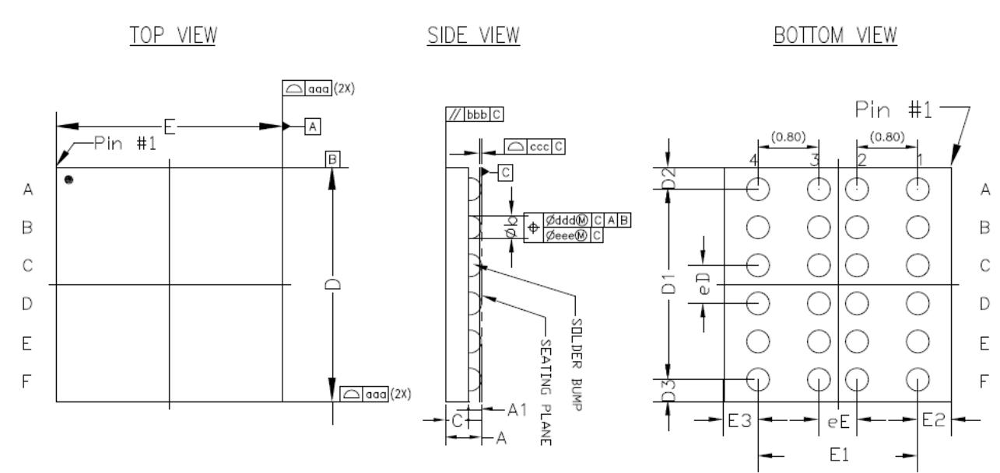

<table><tr><td rowspan=2 colspan=1>Symbol</td><td rowspan=1 colspan=3>Millimeters</td><td rowspan=1 colspan=3>Inches</td></tr><tr><td rowspan=1 colspan=1>Min</td><td rowspan=1 colspan=1>Nom</td><td rowspan=1 colspan=1>Max</td><td rowspan=1 colspan=1>Min</td><td rowspan=1 colspan=1>Nom</td><td rowspan=1 colspan=1>Max</td></tr><tr><td rowspan=1 colspan=1>A</td><td rowspan=1 colspan=1>0.454</td><td rowspan=1 colspan=1>0.497</td><td rowspan=1 colspan=1>0.540</td><td rowspan=1 colspan=1>0.018</td><td rowspan=1 colspan=1>0.020</td><td rowspan=1 colspan=1>0.021</td></tr><tr><td rowspan=1 colspan=1>A1</td><td rowspan=1 colspan=1>0.152</td><td rowspan=1 colspan=1>0.167</td><td rowspan=1 colspan=1>0.182</td><td rowspan=1 colspan=1>0.006</td><td rowspan=1 colspan=1>0.007</td><td rowspan=1 colspan=1>0.007</td></tr><tr><td rowspan=1 colspan=1>C</td><td rowspan=1 colspan=1>0.302</td><td rowspan=1 colspan=1>0.330</td><td rowspan=1 colspan=1>0.358</td><td rowspan=1 colspan=1>0.012</td><td rowspan=1 colspan=1>0.013</td><td rowspan=1 colspan=1>0.014</td></tr><tr><td rowspan=1 colspan=1>D1</td><td rowspan=1 colspan=1></td><td rowspan=1 colspan=1>2.500</td><td rowspan=1 colspan=1></td><td rowspan=1 colspan=1></td><td rowspan=1 colspan=1>0.0984</td><td rowspan=1 colspan=1></td></tr><tr><td rowspan=1 colspan=1>E1</td><td rowspan=1 colspan=1></td><td rowspan=1 colspan=1>2.100</td><td rowspan=1 colspan=1></td><td rowspan=1 colspan=1></td><td rowspan=1 colspan=1>0.0827</td><td rowspan=1 colspan=1></td></tr><tr><td rowspan=1 colspan=1>eD</td><td rowspan=1 colspan=1></td><td rowspan=1 colspan=1>0.50</td><td rowspan=1 colspan=1></td><td rowspan=1 colspan=1></td><td rowspan=1 colspan=1>0.0197</td><td rowspan=1 colspan=1></td></tr><tr><td rowspan=1 colspan=1>eE</td><td rowspan=1 colspan=1></td><td rowspan=1 colspan=1>0.50</td><td rowspan=1 colspan=1></td><td rowspan=1 colspan=1></td><td rowspan=1 colspan=1>0.0197</td><td rowspan=1 colspan=1></td></tr><tr><td rowspan=1 colspan=1>b</td><td rowspan=1 colspan=1>0.240</td><td rowspan=1 colspan=1>0.300</td><td rowspan=1 colspan=1>0.360</td><td rowspan=1 colspan=1>0.009</td><td rowspan=1 colspan=1>0.012</td><td rowspan=1 colspan=1>0.014</td></tr><tr><td rowspan=1 colspan=1>aaa</td><td rowspan=1 colspan=3>0.10</td><td rowspan=1 colspan=3>0.004</td></tr><tr><td rowspan=1 colspan=1>bbb</td><td rowspan=1 colspan=3>0.10</td><td rowspan=1 colspan=3>0.004</td></tr><tr><td rowspan=1 colspan=1>CCC</td><td rowspan=1 colspan=3>0.03</td><td rowspan=1 colspan=3>0.001</td></tr><tr><td rowspan=1 colspan=1>ddd</td><td rowspan=1 colspan=3>0.15</td><td rowspan=1 colspan=3>0.006</td></tr><tr><td rowspan=1 colspan=1>eee</td><td rowspan=1 colspan=3>0.05</td><td rowspan=1 colspan=3>0.002</td></tr></table>

Notes:

1. Dimension b is measured at the maximum solder bump diameter, parallel to primary datum C.

2. Dimension D/D2/D3 and E/E2/E3; please contact Winbond for details.

73

W25Q128JV

# winbond

## 11. ORDERING INFORMATION

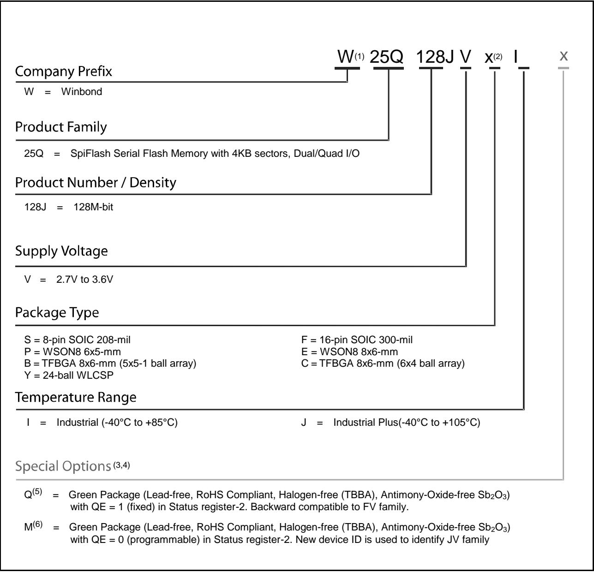

## Notes:

1. The “W” prefix is not included on the part marking.

2. Only the 2nd letter is used for the part marking; WSON package type ZP & ZE are not used for the part marking.

3. Standard bulk shipments are in Tube (shape E). Please specify alternate packing method, such as Tape and Reel (shape T) or Tray (shape S), when placing orders.

4. For shipments with OTP feature enabled, please contact Winbond for details.

5. /HOLD function is disabled to support Standard, Dual and Quad I/O without user setting.

6. For DTR, QPI supporting, please refer to W25Q128JV DTR datasheet.

74

Publication Release Date: March 27, 2018 Revision F

W25Q128JV

# winbond

## 11.1 Valid Part Numbers and Top Side Marking

The following table provides the valid part numbers for the W25Q128JV SpiFlash Memory. Please contact Winbond for specific availability by density and package type. Winbond SpiFlash memories use a 12-digit Product Number for ordering. However, due to limited space, the Top Side Marking on all packages uses an abbreviated 10-digit number.

W25Q128JV-IQ/JQ valid part numbers:

<table><tr><td rowspan=1 colspan=1>W25Q128JV-IQ</td><td rowspan=1 colspan=1>DENSITY</td><td rowspan=1 colspan=1>PRODUCT NUMBER</td><td rowspan=1 colspan=1>TOP SIDE MARKING</td></tr><tr><td rowspan=1 colspan=1>SSOIC-8 208-mil</td><td rowspan=1 colspan=1>128M-bit</td><td rowspan=1 colspan=1>W25Q128JVSIQ</td><td rowspan=1 colspan=1>25Q128JVSQ</td></tr><tr><td rowspan=1 colspan=1>FSOIC-16 300-mil</td><td rowspan=1 colspan=1>128M-bit</td><td rowspan=1 colspan=1>W25Q128JVFIQ</td><td rowspan=1 colspan=1>25Q128JVFQ</td></tr><tr><td rowspan=1 colspan=1>PWSON-8 6x5-mm</td><td rowspan=1 colspan=1>128M-bit</td><td rowspan=1 colspan=1>W25Q128JVPIQ</td><td rowspan=1 colspan=1>25Q128JVPQ</td></tr><tr><td rowspan=1 colspan=1>EWSON-8 8x6-mm</td><td rowspan=1 colspan=1>128M-bit</td><td rowspan=1 colspan=1>W25Q128JVEIQ</td><td rowspan=1 colspan=1>25Q128JVEQ</td></tr><tr><td rowspan=1 colspan=1>B(1)TFBGA-24 8x6-mm(5x5 Ball Array)</td><td rowspan=1 colspan=1>128M-bit</td><td rowspan=1 colspan=1>W25Q128JVBIQ</td><td rowspan=1 colspan=1>25Q128JVBQ</td></tr><tr><td rowspan=1 colspan=1>C(1)TFBGA-24 8x6-mm(6x4 Ball Array)</td><td rowspan=1 colspan=1>128M-bit</td><td rowspan=1 colspan=1>W25Q128JVCIQ</td><td rowspan=1 colspan=1>25Q128JVCQ</td></tr><tr><td rowspan=1 colspan=1>γ(3)24-ball WLCSP</td><td rowspan=1 colspan=1>128M-bit</td><td rowspan=1 colspan=1>W25Q128JVYIQ</td><td rowspan=1 colspan=1>Q128JVYIQ</td></tr></table>

<table><tr><td rowspan=1 colspan=1>W25Q128JV-JQ</td><td rowspan=1 colspan=1>DENSITY</td><td rowspan=1 colspan=1>PRODUCT NUMBER</td><td rowspan=1 colspan=1>TOP SIDE MARKING</td></tr><tr><td rowspan=1 colspan=1>SSOIC-8 208-mil</td><td rowspan=1 colspan=1>128M-bit</td><td rowspan=1 colspan=1>W25Q128JVSJQ</td><td rowspan=1 colspan=1>Q128JVSJQ</td></tr><tr><td rowspan=1 colspan=1>FSOIC-16 300-mil</td><td rowspan=1 colspan=1>128M-bit</td><td rowspan=1 colspan=1>W25Q128JVFJQ</td><td rowspan=1 colspan=1>Q128JVFJQ</td></tr><tr><td rowspan=1 colspan=1>PWSON-8 6x5-mm</td><td rowspan=1 colspan=1>128M-bit</td><td rowspan=1 colspan=1>W25Q128JVPJQ</td><td rowspan=1 colspan=1>Q128JVPJQ</td></tr><tr><td rowspan=1 colspan=1>EWSON-8 8x6-mm</td><td rowspan=1 colspan=1>128M-bit</td><td rowspan=1 colspan=1>W25Q128JVEJQ</td><td rowspan=1 colspan=1>Q128JVEJQ</td></tr><tr><td rowspan=1 colspan=1>B(1)TFBGA-24 8x6-mm(5x5 Ball Array)</td><td rowspan=1 colspan=1>128M-bit</td><td rowspan=1 colspan=1>W25Q128JVBJQ</td><td rowspan=1 colspan=1>Q128JVBJQ</td></tr><tr><td rowspan=1 colspan=1>C(1)TFBGA-24 8x6-mm(6x4 Ball Array)</td><td rowspan=1 colspan=1>128M-bit</td><td rowspan=1 colspan=1>W25Q128JVCJQ</td><td rowspan=1 colspan=1>Q128JVCJQ</td></tr></table>

Continued – next page

75

W25Q128JV

W25Q128JV-IM/JM(2) valid part numbers:

<table><tr><td rowspan=1 colspan=1>W25Q128JV-IM</td><td rowspan=1 colspan=1>DENSITY</td><td rowspan=1 colspan=1>PRODUCT NUMBER</td><td rowspan=1 colspan=1>TOP SIDE MARKING</td></tr><tr><td rowspan=1 colspan=1>SSOIC-8 208-mil</td><td rowspan=1 colspan=1>128M-bit</td><td rowspan=1 colspan=1>W25Q128JVSIM</td><td rowspan=1 colspan=1>25Q128JVSM</td></tr><tr><td rowspan=1 colspan=1>FSOIC-16 300-mil</td><td rowspan=1 colspan=1>128M-bit</td><td rowspan=1 colspan=1>W25Q128JVFIM</td><td rowspan=1 colspan=1>25Q128JVFM</td></tr><tr><td rowspan=1 colspan=1>PWSON-8 6x5-mm</td><td rowspan=1 colspan=1>128M-bit</td><td rowspan=1 colspan=1>W25Q128JVPIM</td><td rowspan=1 colspan=1>25Q128JVPM</td></tr><tr><td rowspan=1 colspan=1>EWSON-8 8x6-mm</td><td rowspan=1 colspan=1>128M-bit</td><td rowspan=1 colspan=1>W25Q128JVEIM</td><td rowspan=1 colspan=1>25Q128JVEM</td></tr><tr><td rowspan=1 colspan=1>B(1)TFBGA-24 8x6-mm(5x5 Ball Array)</td><td rowspan=1 colspan=1>128M-bit</td><td rowspan=1 colspan=1>W25Q128JVBIM</td><td rowspan=1 colspan=1>25Q128JVBM</td></tr><tr><td rowspan=1 colspan=1>C(1)TFBGA-24 8x6-mm(6x4 Ball Array)</td><td rowspan=1 colspan=1>128M-bit</td><td rowspan=1 colspan=1>W25Q128JVCIM</td><td rowspan=1 colspan=1>25Q128JVCM</td></tr></table>

<table><tr><td rowspan=1 colspan=1>W25Q128JV-JM</td><td rowspan=1 colspan=1>DENSITY</td><td rowspan=1 colspan=1>PRODUCT NUMBER</td><td rowspan=1 colspan=1>TOP SIDE MARKING</td></tr><tr><td rowspan=1 colspan=1>SSOIC-8 208-mil</td><td rowspan=1 colspan=1>128M-bit</td><td rowspan=1 colspan=1>W25Q128JVSJM</td><td rowspan=1 colspan=1>Q128JVSJM</td></tr><tr><td rowspan=1 colspan=1>FSOIC-16 300-mil</td><td rowspan=1 colspan=1>128M-bit</td><td rowspan=1 colspan=1>W25Q128JVFJM</td><td rowspan=1 colspan=1>Q128JVFJM</td></tr><tr><td rowspan=1 colspan=1>PWSON-8 6x5-mm</td><td rowspan=1 colspan=1>128M-bit</td><td rowspan=1 colspan=1>W25Q128JVPJM</td><td rowspan=1 colspan=1>Q128JVPJM</td></tr><tr><td rowspan=1 colspan=1>EWSON-8 8x6-mm</td><td rowspan=1 colspan=1>128M-bit</td><td rowspan=1 colspan=1>W25Q128JVEJM</td><td rowspan=1 colspan=1>Q128JVEJM</td></tr><tr><td rowspan=1 colspan=1>B(1)TFBGA-24 8x6-mm(5x5 Ball Array)</td><td rowspan=1 colspan=1>128M-bit</td><td rowspan=1 colspan=1>W25Q128JVBJM</td><td rowspan=1 colspan=1>Q128JVBJM</td></tr><tr><td rowspan=1 colspan=1>C(1)TFBGA-24 8x6-mm(6x4 Ball Array)</td><td rowspan=1 colspan=1>128M-bit</td><td rowspan=1 colspan=1>W25Q128JVCJM</td><td rowspan=1 colspan=1>Q128JVCJM</td></tr></table>

Note:

1. These package types are special order, please contact Winbond for more information.

2. For DTR, QPI supporting, please refer to W25Q128JV DTR datasheet.

3. These package types are special order, please contact Winbond for more information

76

Publication Release Date: March 27, 2018 Revision F

W25Q128JV

# winbond

## 12. REVISION HISTORY

<table><tr><td rowspan=1 colspan=1>VERSION</td><td rowspan=1 colspan=1>DATE</td><td rowspan=1 colspan=1>PAGE</td><td rowspan=1 colspan=1>DESCRIPTION</td></tr><tr><td rowspan=1 colspan=1>A</td><td rowspan=1 colspan=1>01/09/2015</td><td rowspan=1 colspan=1></td><td rowspan=1 colspan=1>New Create Datasheet</td></tr><tr><td rowspan=1 colspan=1>B</td><td rowspan=1 colspan=1>11/04/2016</td><td rowspan=1 colspan=1></td><td rowspan=1 colspan=1>Removed “Preliminary”</td></tr><tr><td rowspan=1 colspan=1>C</td><td rowspan=1 colspan=1>11/16/2016</td><td rowspan=1 colspan=1>12</td><td rowspan=1 colspan=1>Updated Status Register-1</td></tr><tr><td rowspan=1 colspan=1>D</td><td rowspan=1 colspan=1>05/02/2017</td><td rowspan=1 colspan=1>72-73</td><td rowspan=1 colspan=1>Updated /WP informationUpdated W25Q128JV-IM order information</td></tr><tr><td rowspan=1 colspan=1>E</td><td rowspan=1 colspan=1>11/23/2017</td><td rowspan=1 colspan=1>8,73-75</td><td rowspan=1 colspan=1>Added WLCP information</td></tr><tr><td rowspan=1 colspan=1>F</td><td rowspan=1 colspan=1>2018/03/27</td><td rowspan=1 colspan=1>734,74-7662,64-65</td><td rowspan=1 colspan=1>Updated WLCSP E2 DrawingUpdated industrial plus informationUpdated ICC3,tPP,tSLCH, tCHSL, tDVCH, tCHDX</td></tr></table>

## Trademarks

Winbond and SpiFlash are trademarks of Winbond Electronics Corporation.

All other marks are the property of their respective owner.

## Important Notice

Winbond products are not desianed. intended. authorized or warranted for use as components in systems or equipment intended for surgical implantation, atomic energy control instruments, airplane or spaceship instruments, transportation instruments, traffic signal instruments, combustion control instruments, or for other applications intended to support or sustain life. Furthermore, Winbond products are not intended for applications wherein failure of Winbond products could result or lead to a situation wherein personal injury, death or severe property or environmental damage could occur. Winbond customers using or selling these products for use in such applications do so at their own risk and agree to fully indemnify Winbond for any damages resulting from such improper use or sales.

Information in this document is provided solely in connection with Winbond products. Winbond reserves the right to make changes, corrections, modifications or improvements to this document and the products and services described herein at any time, without notice.

Please note that all data and specifications are subiect to change without notice All the trademarks of products and companies mentioned in this datasheet belong to their respective owners.

77