LT

XPT2046 Touch Screen Controller

2007.5

XPT2046 Data Sheet

Copyright©2007, SHENZHEN XPTEK TECHNOLOGY CO.,LTD http://www.xptek.com.cn

1/30

LET

XPT2046 Touch Screen Controller

## CONTENTS

GENERAL DESCRIPTION ....   
FEATURES....   
APPLICATIONS..   
BLOCK DIAGRAM...   
ABSOLUTE MAXIMUM RATINGS ....   
ELECTRICAL CHARACTERISTICS ...   
PIN CONFIGURATION... .. 8   
PIN LAYOUT .8   
PIN DESCRIPTION .9   
TYPICAL CHARACTERISTICS. ... 10   
THEORY OF OPRATION... ... 13   
BASIC OPERATION OF THE XPT2046 .13   
ANALOG INPUT .14   
INTERNAL REFERENCE. .15   
REFERENCE INPUT .16   
SIMPLIFIED DIAGRAM OF SINGLE-ENDED REFERENCE .16   
SIMPLIFIED DIAGRAM OF DIFFERENTIAL REFERENCE. 17   
TOUCH SCREEN SETTLING. .17   
TEMPERATURE MEASUREMENT .18   
BATTERY MEASUREMENT .19   
PRESSURE MEASUREMEN .20   
DIGITAL INTERFACE... ..21   
PENIRQ OUTPUT ... ... 24   
PER-CONVERSION ..... ... 26   
16 CLOCKS-PER-CONVERSION .26   
DIGITAL TIMING .26   
15 CLOCKS-PER-CONVERSION .28   
DATA FORMAT .28   
8-BIT CONVERSION .29   
POWER DISSIPATION.... ..29   
DEMO ...... ..30

Copyright©2007, SHENZHEN XPTEK TECHNOLOGY CO.,LTD http://www.xptek.com.cn

2/30

XPT2046 Touch Screen Controller

## General Description

The XPT2046 is a 4-wire resistive touch screen controller that incorporates a 12-bit 125 kHz sampling SAR type A/D converter.

The XPT2046 operates down to 2.2V supply voltage and supports digital I/O interface voltage from 1.5V to VCC in order to connect low voltage uP.

The XPT2046 can detect the pressed screen location by performing two A/D conversions. In addition to location, the XPT2046 also measures touch screen pressure.On-chip VREF can be utilized for analog auxiliary input, temperature measurement and battery monitoring withthe ability to measure voltage from 0V to 5V.

The XPT2046 also has an on-chip temperature sensor

The XPT2046 is available in 16pin QFN thin package(0.75mm in height) and has the operating temperature range of -40°C to +85°C

## Features

12 bit SAR type A/D converter with S/H circuit

Low voltage operation (VCC = 2.2V ∼ 3.6V)

Low voltage digital I/F (1.5V ∼ VCC)

4-wire I/F

Sampling frequency: 125 kHz (max)

On-Chip voltage reference (2.5V)

Pen pressure measurement

On-chip thermo sensor

Direct battery masurement

Low power consumption (260μA)

Package 16pin QFN

## Applications

Personal digital assistants

Portable instruments

Point -of-sale terminals

Pagers

Touch screen monitors

Cellular phones

Copyright©2007, SHENZHEN XPTEK TECHNOLOGY CO.,LTD http://www.xptek.com.cn

3/30

XPT2046 Touch Screen Controller

Block Diagram

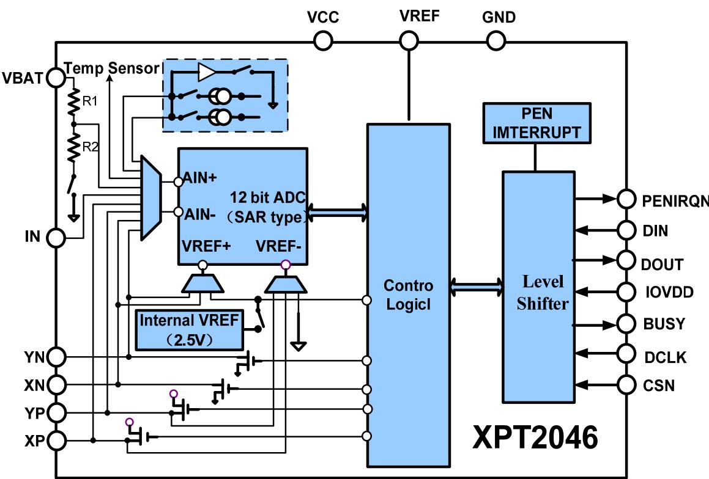

Figure 1. Block Diagram

## Absolute Maximum Ratings

Table 1. Absolute Maximum Ratings

<table><tr><td rowspan=1 colspan=1>+VCC and IOVDD to GND</td><td rowspan=1 colspan=1>-0.3V to +6V</td></tr><tr><td rowspan=1 colspan=1>Analog Inputs to GND</td><td rowspan=1 colspan=1>−0.3V to +VCC + 0.3V</td></tr><tr><td rowspan=1 colspan=1>Digital Inputs to GND</td><td rowspan=1 colspan=1>−0.3V to IOVDD + 0.3V</td></tr><tr><td rowspan=1 colspan=1>Power Dissipation</td><td rowspan=1 colspan=1>.250mW</td></tr><tr><td rowspan=1 colspan=1>Maximum Junction Temperature</td><td rowspan=1 colspan=1>+150℃</td></tr><tr><td rowspan=1 colspan=1>Operating Temperature Range</td><td rowspan=1 colspan=1>. −40°C to +85°C</td></tr><tr><td rowspan=1 colspan=1>Storage Temperature Range</td><td rowspan=1 colspan=1>-65°C to +150°C</td></tr><tr><td rowspan=1 colspan=1>Lead Temperature (soldering, 10s)</td><td rowspan=1 colspan=1>+300℃</td></tr></table>

WARNING: Stresses above these ratings may cause permanent damage.Exposure to absolute maximum conditions for xtended periods may degrade device reliability. These are stress ratings only, and functional operation of the device at these or any other conditions beyond those specified is not implied.

Copyright©2007, SHENZHEN XPTEK TECHNOLOGY CO.,LTD http://www.xptek.com.cn

4/30

XPT2046 Touch Screen Controller

## Electrical Characteristics: $\mathrm { V S } = + 2 . 7 \mathrm { V } \mathrm { t } \mathbf { 0 } + 5 . 5 \mathrm { V }$

At TA = −40°C to +85°C, +VCC = +2.7V, VREF = 2.5V internal voltage, fSAMPLE = 125kHz, fCLK = 16 • fSAMPLE = 2MHz, 12-bit mode, digital inputs = GND or IOVDD, and +VCC must be • IOVDD.

<table><tr><td rowspan=2 colspan=1>PARAMETER</td><td rowspan=2 colspan=1>CONDITION</td><td rowspan=1 colspan=3>XPT2046</td><td rowspan=2 colspan=1>UNITS</td></tr><tr><td rowspan=1 colspan=1>MIN</td><td rowspan=1 colspan=1>TYP</td><td rowspan=1 colspan=1>MAX</td></tr><tr><td rowspan=2 colspan=1>ANALOG INPUTFull-Scale Input SpanAbsolute Input RangeCapacitanceLeakage Current</td><td rowspan=2 colspan=1>Positive Input-Negative InputPositive InputNegative Input</td><td rowspan=2 colspan=1>0-0.2-0.2</td><td rowspan=2 colspan=1>250.1</td><td rowspan=2 colspan=1><eq>\mathrm { V } _ { \mathrm { R E F } }</eq><eq>+ \mathrm { V C C } { + 0 . 2 }</eq>+0.2</td><td rowspan=1 colspan=1>V</td></tr><tr><td rowspan=1 colspan=1>VVpFμA</td></tr><tr><td rowspan=2 colspan=1>SYSTEM PERFORMANCEResolutionNo Missing CodesIntegral Linearity ErrorOffset ErrorGain ErrorNoisePower-Supply Rejection</td><td rowspan=2 colspan=1>External VREFIncluding Internal VREF</td><td rowspan=2 colspan=1>11</td><td rowspan=2 colspan=1>127070</td><td rowspan=2 colspan=1>±2±6±4</td><td rowspan=1 colspan=1>BitsBits<eq>\mathrm { L S B } ^ { 1 }</eq></td></tr><tr><td rowspan=1 colspan=1>LSBLSB<eq>\mu \mathrm { V } _ { \mathrm { r m s } }</eq>dB</td></tr><tr><td rowspan=1 colspan=1>SAMPLING DYNAMICSConversion TimeAcquisition TimeThroughput RateMultiplexer Settling TimeAperture DelayAperture JitterChannel-to-Channel Isolation</td><td rowspan=1 colspan=1><eq>\mathrm { V _ { I N } } { = } 2 . 5 \mathrm { V _ { p p } , f s } { = } 5 0 \mathrm { K H z }</eq></td><td rowspan=1 colspan=1>3</td><td rowspan=1 colspan=1>50030100100</td><td rowspan=1 colspan=1>12125</td><td rowspan=1 colspan=1>CLKCyclesCLKCyclesKHznsnspsdB</td></tr><tr><td rowspan=1 colspan=1>SWITCH DRIVERSOn-ResistanceYP、XPYN、XNDrive Current(2)</td><td rowspan=1 colspan=1>Duration 100ms</td><td rowspan=1 colspan=1></td><td rowspan=1 colspan=1>56</td><td rowspan=1 colspan=1>50</td><td rowspan=1 colspan=1>ΩΩmA</td></tr><tr><td rowspan=1 colspan=1>REFERENCE OUTPUTInternal Reference VoltageInternal Reference DriftQuiescent Current</td><td rowspan=1 colspan=1></td><td rowspan=1 colspan=1>2.45</td><td rowspan=1 colspan=1>2.5015500</td><td rowspan=1 colspan=1>2.55</td><td rowspan=1 colspan=1>V<eq>\mathrm { p p m } / \mathrm { \bar { C } }</eq>μA</td></tr></table>

Copyright©2007, SHENZHEN XPTEK TECHNOLOGY CO.,LTD http://www.xptek.com.cn

5/30

XPT2046 Touch Screen Controller

<table><tr><td colspan="2"></td><td></td><td></td><td></td></tr><tr><td colspan="2">REFERENCE INPUT Range</td><td>1.0 1</td><td>VCC</td><td>V GΩ</td></tr><tr><td>Input Impedance</td><td>SER/DFR=0，PD1=0 Internal Reference Off Internal Reference On</td><td>250</td><td></td><td>Ω</td></tr><tr><td>BATTERY MONITOR Input Voltage Range</td><td></td><td>0.5</td><td>6.0</td><td>V</td></tr><tr><td>Input Impedance</td><td></td><td></td><td></td><td></td></tr><tr><td>Sampling Battery</td><td></td><td>10</td><td></td><td>KΩ</td></tr><tr><td>Battery Monitor Off</td><td></td><td>1</td><td></td><td>GΩ</td></tr><tr><td>Accuracy</td><td><eq>\mathrm { V _ { B A T } = 0 . 5 V { \sim } 5 . 5 V , E x t e r n a l V _ { R E F } { = } 2 . 5 V }</eq></td><td>-2</td><td>+2</td><td>%</td></tr><tr><td></td><td><eq>\mathrm { V _ { B A T } { = } 0 . 5 V { \sim } 5 . 5 V , } \mathrm { I n t e r n a l \ R e f e r e n c e }</eq></td><td>-3</td><td>+3</td><td>%</td></tr><tr><td>TEMPERATURE ASUREMENT</td><td></td><td>-40</td><td>+85</td><td>℃</td></tr><tr><td>Temperature Range Resolution</td><td>Differential Method(3)</td><td>1.6</td><td></td><td>℃</td></tr><tr><td>Accuracy</td><td>TEMP0(4) Differential Method(3)</td><td>0.3 ±2</td><td></td><td>℃ ℃</td></tr><tr><td></td><td>TEMP0(4)</td><td>±3</td><td></td><td>℃</td></tr><tr><td>DIGITAL INPUT/OUTPUT Logic Family</td><td></td><td>CMOS</td><td></td><td></td></tr><tr><td>Capacitance</td><td>All Digital Control Input Pins</td><td>5</td><td>15</td><td>pF</td></tr><tr><td><eq>\mathrm { V _ { I H } }</eq></td><td><eq>\mid \mathrm { I } _ { \mathrm { I H } } \mid \le + 5 \mu \mathrm { A }</eq></td><td>IOVDD*0.7</td><td>IOVDD+0.3</td><td>V</td></tr><tr><td><eq>\mathrm { V _ { I L } }</eq></td><td>|IL|≤+5μA</td><td>-0.3</td><td>0.3*IOVDD</td><td>V</td></tr><tr><td><eq>\mathrm { V _ { O H } }</eq></td><td><eq>\mathrm { I _ { O H } } { = } { - } 2 5 0 \mu \mathrm { A }</eq></td><td>IOVDD*0.8</td><td></td><td>V</td></tr><tr><td><eq>\mathrm { V _ { O L } }</eq></td><td><eq>\operatorname { I _ { O L } } \mathrm { = } 2 5 0 \mu \mathrm { A }</eq></td><td></td><td>0.4</td><td>V</td></tr><tr><td>Data Format</td><td></td><td>Straight</td><td></td><td></td></tr><tr><td></td><td></td><td>Binary</td><td></td><td></td></tr><tr><td>POWER-SUPPLYREOUIREMENTS</td><td></td><td></td><td></td><td></td></tr><tr><td>+VCC (5)</td><td>Specified Performance</td><td>2.7</td><td>3.6</td><td>V</td></tr><tr><td>IOVDD (6)</td><td>Operating Range</td><td>2.2 1.5</td><td>5.25</td><td>V V</td></tr><tr><td>Quiescent Current (7)</td><td></td><td>280</td><td>VCC 650</td><td>μA</td></tr><tr><td></td><td>Internal Reference Off</td><td>780</td><td></td><td></td></tr><tr><td></td><td>Internal Reference On</td><td>220</td><td></td><td>μA</td></tr><tr><td></td><td>fSAMPLE = 12.5kHz</td><td></td><td></td><td>μA</td></tr><tr><td></td><td>Power-Down Mode with</td><td></td><td>3</td><td>μA</td></tr><tr><td></td><td>(CS=DCLK=DIN=IOVDD)</td><td></td><td></td><td></td></tr><tr><td></td><td></td><td></td><td></td><td></td></tr><tr><td></td><td></td><td></td><td></td><td></td></tr><tr><td></td><td></td><td></td><td></td><td></td></tr><tr><td></td><td></td><td></td><td></td><td></td></tr><tr><td></td><td></td><td></td><td></td><td></td></tr><tr><td></td><td></td><td></td><td></td><td></td></tr><tr><td>Power Dissipation</td><td></td><td></td><td>1.8</td><td></td></tr><tr><td></td><td>VCC=+2.7V</td><td></td><td></td><td>mW</td></tr><tr><td></td><td></td><td></td><td></td><td></td></tr><tr><td></td><td></td><td></td><td></td><td></td></tr><tr><td></td><td></td><td></td><td></td><td></td></tr><tr><td></td><td></td><td></td><td></td><td></td></tr><tr><td></td><td></td><td></td><td></td><td></td></tr><tr><td></td><td></td><td></td><td></td><td></td></tr><tr><td></td><td></td><td></td><td></td><td></td></tr><tr><td></td><td></td><td></td><td></td><td></td></tr><tr><td></td><td></td><td></td><td></td><td></td></tr><tr><td></td><td></td><td></td><td></td><td></td></tr><tr><td></td><td></td><td></td><td></td><td></td></tr><tr><td></td><td></td><td></td><td></td><td></td></tr><tr><td></td><td></td><td></td><td></td><td></td></tr><tr><td></td><td></td><td></td><td></td><td></td></tr><tr><td></td><td></td><td></td><td></td><td></td></tr><tr><td></td><td></td><td></td><td></td><td></td></tr><tr><td></td><td></td><td></td><td></td><td></td></tr><tr><td></td><td></td><td></td><td></td><td></td></tr><tr><td></td><td></td><td></td><td></td><td></td></tr><tr><td></td><td></td><td></td><td></td><td></td></tr><tr><td></td><td></td><td></td><td></td><td></td></tr></table>

Copyright©2007, SHENZHEN XPTEK TECHNOLOGY CO.,LTD http://www.xptek.com.cn 6/30

XPT2046 Touch Screen Controller

<table><tr><td rowspan=1 colspan=1>TEMPERATURE RANGESpecified Performance</td><td rowspan=1 colspan=1></td><td rowspan=1 colspan=1>-40</td><td rowspan=1 colspan=1></td><td rowspan=1 colspan=1>+85</td><td rowspan=1 colspan=1>℃</td></tr></table>

## Table 2. Electrical Characteristics

(1) LSB means Least Significant Bit. With VREF = +2.5V, one LSB is 610 V.

(2) Assured by design, but not tested. Exceeding 50mA source current may result in device degradation.

(3) Difference between TEMP0 and TEMP1 measurement, no calibration necessary.

(4) Temperature drift is −2.1mV/ C.

(5) XPT2046 operates down to 2.2V.

(6) IOVDD must be − (+VCC).

(7) Combined supply current from +VCC and IOVDD. Typical values obtained from conversions on AUX input with PD0 = 0.

Copyright©2007, SHENZHEN XPTEK TECHNOLOGY CO.,LTD http://www.xptek.com.cn

7/30

XPT2046 Touch Screen Controller

Pin Configuration

Pin Layout

QFN-16

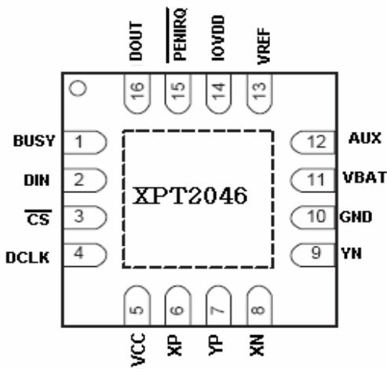

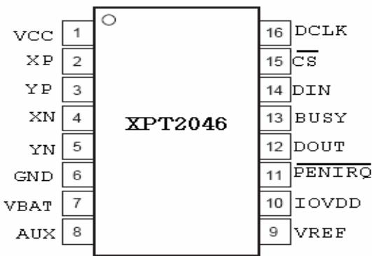

TSSOP－16

VFBGA-16

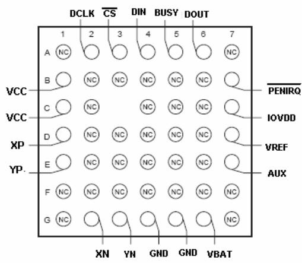

Figure 2. Pin Layout

Copyright©2007, SHENZHEN XPTEK TECHNOLOGY CO.,LTD http://www.xptek.com.cn

8/30

XPT2046 Touch Screen Controller

Pin Description

Table 3. Pin Description

<table><tr><td rowspan=1 colspan=1>QFN PIN #</td><td rowspan=1 colspan=1>TSSOP PIN#</td><td rowspan=1 colspan=1>VFBGA PIN #</td><td rowspan=1 colspan=1>NAME</td><td rowspan=1 colspan=1>DESCRIPTION</td></tr><tr><td rowspan=1 colspan=1>1</td><td rowspan=1 colspan=1>13</td><td rowspan=1 colspan=1>A5</td><td rowspan=1 colspan=1>BUSY</td><td rowspan=1 colspan=1>Busy Output. This output is highimpedance when CS is high.</td></tr><tr><td rowspan=1 colspan=1>2</td><td rowspan=1 colspan=1>14</td><td rowspan=1 colspan=1>A4</td><td rowspan=1 colspan=1>DIN</td><td rowspan=1 colspan=1>Serial Data Input. If CS is low, data islatched on the rising edge of DCLK.</td></tr><tr><td rowspan=1 colspan=1>3</td><td rowspan=1 colspan=1>15</td><td rowspan=1 colspan=1>A3</td><td rowspan=1 colspan=1>CS</td><td rowspan=1 colspan=1>Chip Select Input. Controls conversiontiming and enables the serial input/output</td></tr><tr><td rowspan=1 colspan=1>4</td><td rowspan=1 colspan=1>16</td><td rowspan=1 colspan=1>A2</td><td rowspan=1 colspan=1>DCLK</td><td rowspan=1 colspan=1>External Clock Input. This clock runs theSAR conversion process and synchronizes</td></tr><tr><td rowspan=1 colspan=1>5</td><td rowspan=1 colspan=1>1</td><td rowspan=1 colspan=1>B1和C1</td><td rowspan=1 colspan=1>VCC</td><td rowspan=1 colspan=1>Power Supply</td></tr><tr><td rowspan=1 colspan=1>6</td><td rowspan=1 colspan=1>2</td><td rowspan=1 colspan=1>D1</td><td rowspan=1 colspan=1>XP</td><td rowspan=1 colspan=1>XP Position Input</td></tr><tr><td rowspan=1 colspan=1>7</td><td rowspan=1 colspan=1>3</td><td rowspan=1 colspan=1>E1</td><td rowspan=1 colspan=1>YP</td><td rowspan=1 colspan=1>YP Position Input</td></tr><tr><td rowspan=1 colspan=1>8</td><td rowspan=1 colspan=1>4</td><td rowspan=1 colspan=1>G2</td><td rowspan=1 colspan=1>XN</td><td rowspan=1 colspan=1>XN Position Input</td></tr><tr><td rowspan=1 colspan=1>9</td><td rowspan=1 colspan=1>5</td><td rowspan=1 colspan=1>G3</td><td rowspan=1 colspan=1>YN</td><td rowspan=1 colspan=1>YN Position Input</td></tr><tr><td rowspan=1 colspan=1>10</td><td rowspan=1 colspan=1>6</td><td rowspan=1 colspan=1>G4和G5</td><td rowspan=1 colspan=1>GND</td><td rowspan=1 colspan=1>Ground</td></tr><tr><td rowspan=1 colspan=1>11</td><td rowspan=1 colspan=1>7</td><td rowspan=1 colspan=1>G6</td><td rowspan=1 colspan=1>VBAT</td><td rowspan=1 colspan=1>Battery Monitor Input</td></tr><tr><td rowspan=1 colspan=1>12</td><td rowspan=1 colspan=1>8</td><td rowspan=1 colspan=1>E7</td><td rowspan=1 colspan=1>AUX</td><td rowspan=1 colspan=1>Auxiliary Input to ADC</td></tr><tr><td rowspan=1 colspan=1>13</td><td rowspan=1 colspan=1>9</td><td rowspan=1 colspan=1>D7</td><td rowspan=1 colspan=1>VREF</td><td rowspan=1 colspan=1>Voltage Reference Input/Output</td></tr><tr><td rowspan=1 colspan=1>14</td><td rowspan=1 colspan=1>10</td><td rowspan=1 colspan=1>C7</td><td rowspan=1 colspan=1>IOVDD</td><td rowspan=1 colspan=1>Digital I/O Power Supply</td></tr><tr><td rowspan=1 colspan=1>15</td><td rowspan=1 colspan=1>11</td><td rowspan=1 colspan=1>B7</td><td rowspan=1 colspan=1>PENIRQ</td><td rowspan=1 colspan=1>Pen Interrupt</td></tr><tr><td rowspan=1 colspan=1>16</td><td rowspan=1 colspan=1>12</td><td rowspan=1 colspan=1>A6</td><td rowspan=1 colspan=1>DOUT</td><td rowspan=1 colspan=1>Serial Data Output. Data is shifted on thefalling edge of DCLK. This output is high</td></tr></table>

Copyright©2007, SHENZHEN XPTEK TECHNOLOGY CO.,LTD http://www.xptek.com.cn

9/30

T

XPT2046 Touch Screen Controller

## Typical Characteristics

At TA = +25 C, +VCC = +2.7V, IOVDD = +1.8V, VREF = External +2.5V, 12-bit mode, PD0 = 0, fSAMPLE = 125kHz, and fCLK = 16 fSAMPLE = 2MHz,

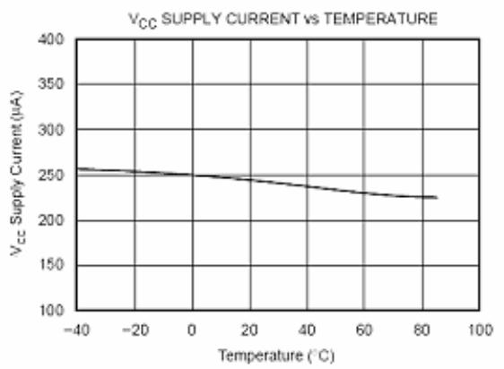

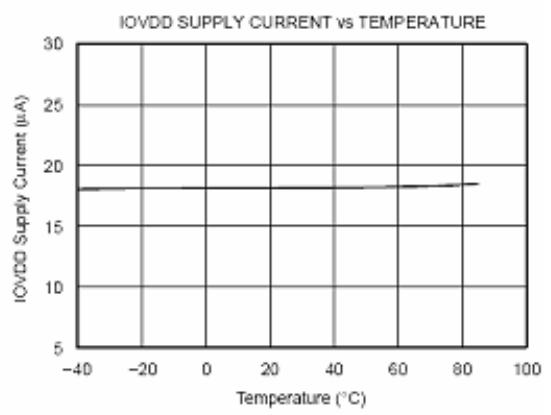

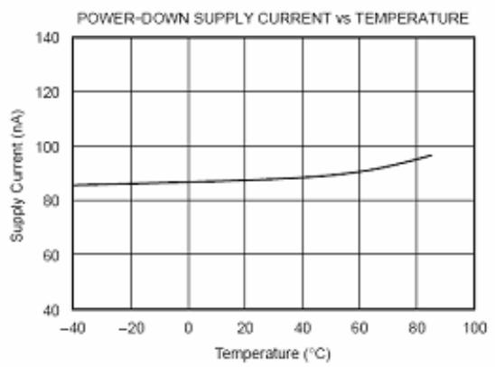

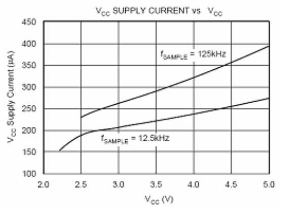

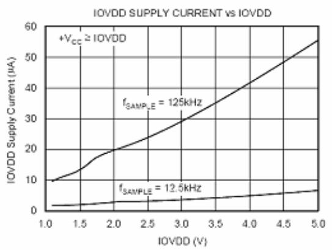

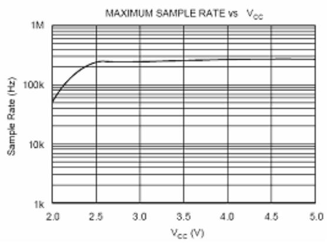

Copyright©2007, SHENZHEN XPTEK TECHNOLOGY CO.,LTD http://www.xptek.com.cn

10/30

XPT2046 Touch Screen Controller

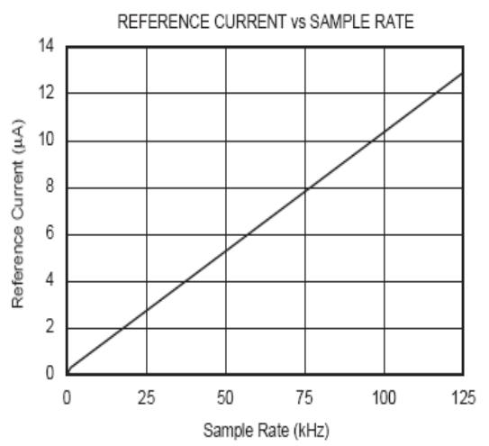

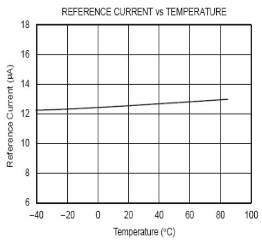

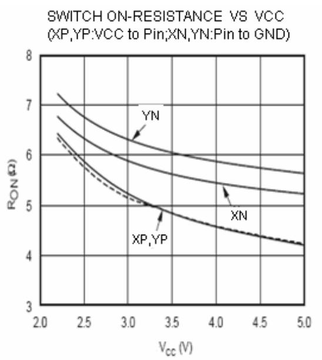

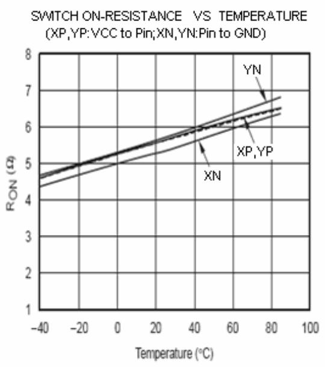

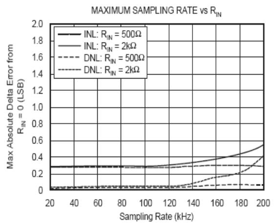

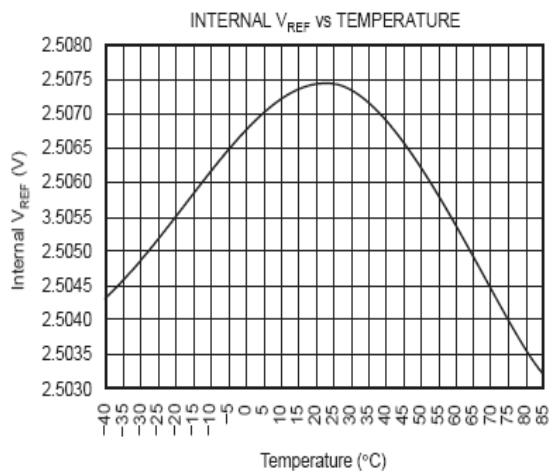

Copyright©2007, SHENZHEN XPTEK TECHNOLOGY CO.,LTD http://www.xptek.com.cn

11/30

T

XPT2046 Touch Screen Controller

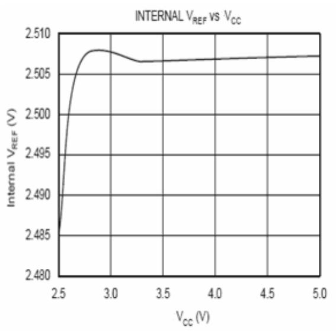

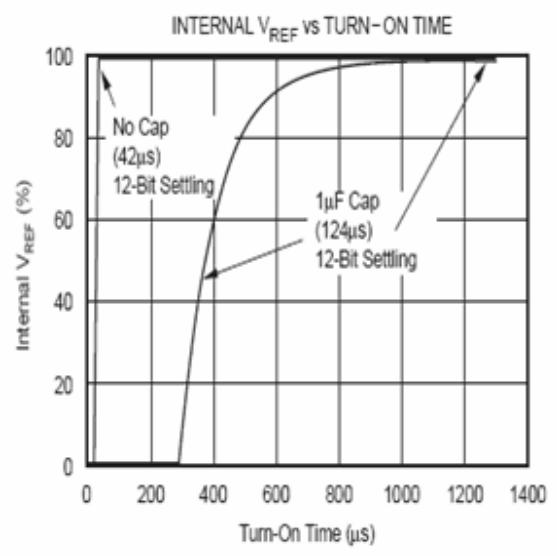

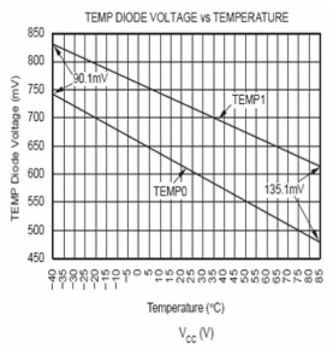

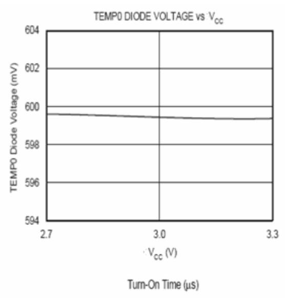

Figure 3. Typical Characteristics

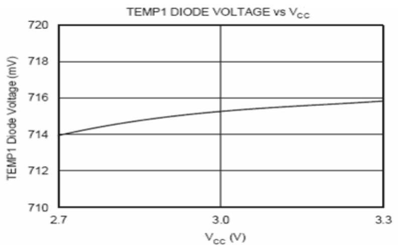

Copyright©2007, SHENZHEN XPTEK TECHNOLOGY CO.,LTD http://www.xptek.com.cn

12/30

XPT2046 Touch Screen Controller

## Theory Of Opration

The XPT2046 is a classic successive approximation register (SAR) analog-to-digital converter (ADC). The architecture is based on capacitive redistribution, which inherently includes a sample-and-hold function. The converter is fabricated on a 0.6μm CMOS process. The basic operation of the XPT2046 is shown in Figure 4 The device features an internal 2.5V reference and uses an external clock. Operation is maintained from a single supply of 2.7V to 5.25V. The internal reference can be overdriven with an external, low-impedance source between 1V and +VCC. The value of the reference voltage directly sets the input range of the converter. The analog input (X-, Y-, and Z-Position coordinates, auxiliary input, battery voltage, and chip temperature) to the converter is provided via a multiplexer. A unique configuration of low on-resistance touch panel driver switches allows an unselected ADC input channel to provide power and the accompanying pin to provide ground for an external device, such as a touch screen. By maintaining a differential input to the converter and a differential reference architecture, it is possible to negate the error from each touch panel driver switch’s on-resistance (if this is a source of error for theparticular measurement).

## Basic Operation of the XPT2046

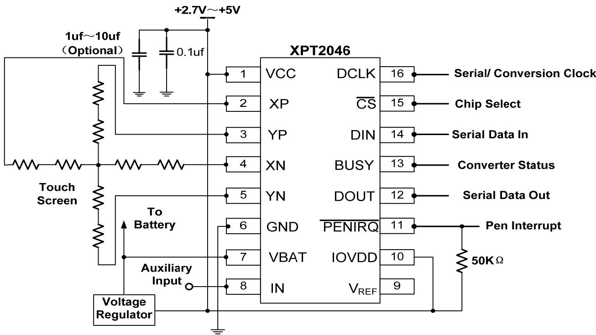

Figure 4. Basic Operation

Copyright©2007, SHENZHEN XPTEK TECHNOLOGY CO.,LTD http://www.xptek.com.cn

13/30

LET

XPT2046 Touch Screen Controller

## Analog Input

Figure 5 hows a block diagram of the input multiplexer on the XPT2046, the differential input of the ADC, andt he differential reference of the converter. Table 4 and Table 5 show the relationship between the A2, A1, A0, and SER/DFR control bits and the configuration of the XPT2046.The control bits are provided serially via the DIN pin—see theDigital Interface section of this data sheet for more details.

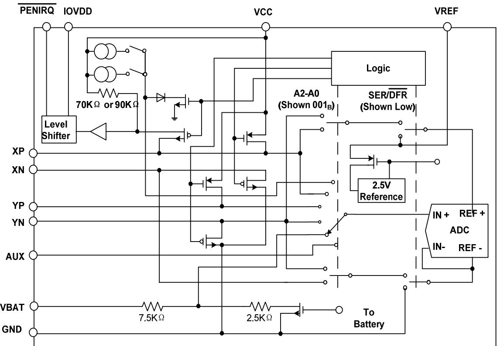

Figure 5. Simplified Diagram of Analog Input

Copyright©2007, SHENZHEN XPTEK TECHNOLOGY CO.,LTD http://www.xptek.com.cn

14/30

XPT2046 Touch Screen Controller

<table><tr><td rowspan=1 colspan=1>A2</td><td rowspan=1 colspan=1>A1</td><td rowspan=1 colspan=1>A0</td><td rowspan=1 colspan=1>VBAT</td><td rowspan=1 colspan=1>AUXIN</td><td rowspan=1 colspan=1>TEMP</td><td rowspan=1 colspan=1>YN</td><td rowspan=1 colspan=1>XP</td><td rowspan=1 colspan=1>YP</td><td rowspan=1 colspan=1>Y-POSITIO</td><td rowspan=1 colspan=1>x-POSITION</td><td rowspan=1 colspan=1>Z1-POSITION</td><td rowspan=1 colspan=1>Z2-POSITION</td><td rowspan=1 colspan=1>X-DRIVERS</td><td rowspan=1 colspan=1>Y-DRIVERS</td></tr><tr><td rowspan=1 colspan=1>0</td><td rowspan=1 colspan=1>0</td><td rowspan=1 colspan=1>0</td><td rowspan=1 colspan=1></td><td rowspan=1 colspan=1></td><td rowspan=1 colspan=1>+IN(TEMP0)</td><td rowspan=1 colspan=1></td><td rowspan=1 colspan=1></td><td rowspan=1 colspan=1></td><td rowspan=1 colspan=1></td><td rowspan=1 colspan=1></td><td rowspan=1 colspan=1></td><td rowspan=1 colspan=1></td><td rowspan=1 colspan=1>off</td><td rowspan=1 colspan=1>off</td></tr><tr><td rowspan=1 colspan=1>0</td><td rowspan=1 colspan=1>0</td><td rowspan=1 colspan=1>1</td><td rowspan=1 colspan=1></td><td rowspan=1 colspan=1></td><td rowspan=1 colspan=1></td><td rowspan=1 colspan=1></td><td rowspan=1 colspan=1>+IN</td><td rowspan=1 colspan=1></td><td rowspan=1 colspan=1>M</td><td rowspan=1 colspan=1></td><td rowspan=1 colspan=1></td><td rowspan=1 colspan=1></td><td rowspan=1 colspan=1>Off</td><td rowspan=1 colspan=1>On</td></tr><tr><td rowspan=1 colspan=1>0</td><td rowspan=1 colspan=1>1</td><td rowspan=1 colspan=1>0</td><td rowspan=1 colspan=1>+IN</td><td rowspan=1 colspan=1></td><td rowspan=1 colspan=1></td><td rowspan=1 colspan=1></td><td rowspan=1 colspan=1></td><td rowspan=1 colspan=1></td><td rowspan=1 colspan=1></td><td rowspan=1 colspan=1></td><td rowspan=1 colspan=1></td><td rowspan=1 colspan=1></td><td rowspan=1 colspan=1>Off</td><td rowspan=1 colspan=1>Off</td></tr><tr><td rowspan=1 colspan=1>0</td><td rowspan=1 colspan=1>1</td><td rowspan=1 colspan=1>1</td><td rowspan=1 colspan=1></td><td rowspan=1 colspan=1></td><td rowspan=1 colspan=1></td><td rowspan=1 colspan=1></td><td rowspan=1 colspan=1>+IN</td><td rowspan=1 colspan=1></td><td rowspan=1 colspan=1></td><td rowspan=1 colspan=1></td><td rowspan=1 colspan=1>M</td><td rowspan=1 colspan=1></td><td rowspan=1 colspan=1>XN, On</td><td rowspan=1 colspan=1>YP, On</td></tr><tr><td rowspan=1 colspan=1>1</td><td rowspan=1 colspan=1>0</td><td rowspan=1 colspan=1>0</td><td rowspan=1 colspan=1></td><td rowspan=1 colspan=1></td><td rowspan=1 colspan=1></td><td rowspan=1 colspan=1>+IN</td><td rowspan=1 colspan=1></td><td rowspan=1 colspan=1></td><td rowspan=1 colspan=1></td><td rowspan=1 colspan=1></td><td rowspan=1 colspan=1></td><td rowspan=1 colspan=1>M</td><td rowspan=1 colspan=1>XN, On</td><td rowspan=1 colspan=1>YP, On</td></tr><tr><td rowspan=1 colspan=1>1</td><td rowspan=1 colspan=1>0</td><td rowspan=1 colspan=1>1</td><td rowspan=1 colspan=1></td><td rowspan=1 colspan=1></td><td rowspan=1 colspan=1></td><td rowspan=1 colspan=1></td><td rowspan=1 colspan=1></td><td rowspan=1 colspan=1>+IN</td><td rowspan=1 colspan=1></td><td rowspan=1 colspan=1>M</td><td rowspan=1 colspan=1></td><td rowspan=1 colspan=1></td><td rowspan=1 colspan=1>On</td><td rowspan=1 colspan=1>Off</td></tr><tr><td rowspan=1 colspan=1>1</td><td rowspan=1 colspan=1>1</td><td rowspan=1 colspan=1>0</td><td rowspan=1 colspan=1></td><td rowspan=1 colspan=1>+IN</td><td rowspan=1 colspan=1></td><td rowspan=1 colspan=1></td><td rowspan=1 colspan=1></td><td rowspan=1 colspan=1></td><td rowspan=1 colspan=1></td><td rowspan=1 colspan=1></td><td rowspan=1 colspan=1></td><td rowspan=1 colspan=1></td><td rowspan=1 colspan=1>Off</td><td rowspan=1 colspan=1>Off</td></tr><tr><td rowspan=1 colspan=1>1</td><td rowspan=1 colspan=1>1</td><td rowspan=1 colspan=1>1</td><td rowspan=1 colspan=1></td><td rowspan=1 colspan=1></td><td rowspan=1 colspan=1>+IN</td><td rowspan=1 colspan=1></td><td rowspan=1 colspan=1></td><td rowspan=1 colspan=1></td><td rowspan=1 colspan=1></td><td rowspan=1 colspan=1></td><td rowspan=1 colspan=1></td><td rowspan=1 colspan=1></td><td rowspan=1 colspan=1>Off</td><td rowspan=1 colspan=1>Off</td></tr></table>

Table 4.Input Configuration (DIN), Differential Reference Mode (SER/DFR low)

Table 5.Input Configuration (DIN), Differential Reference Mode (SER/DFR low)

<table><tr><td rowspan=1 colspan=1>A2</td><td rowspan=1 colspan=1>A1</td><td rowspan=1 colspan=1>A0</td><td rowspan=1 colspan=1>+REF</td><td rowspan=1 colspan=1>-REF</td><td rowspan=1 colspan=1>YN</td><td rowspan=1 colspan=1>XP</td><td rowspan=1 colspan=1>YP</td><td rowspan=1 colspan=1>Y-POSITION</td><td rowspan=1 colspan=1>X-POSITION</td><td rowspan=1 colspan=1>Z1-POSITION</td><td rowspan=1 colspan=1><eq>\scriptstyle z _ { 2 } \cdot \mathsf { P O S I T I O N }</eq></td><td rowspan=1 colspan=1>DRIVERS</td></tr><tr><td rowspan=1 colspan=1>0</td><td rowspan=1 colspan=1>0</td><td rowspan=1 colspan=1>1</td><td rowspan=1 colspan=1>YP</td><td rowspan=1 colspan=1>YN</td><td rowspan=1 colspan=1></td><td rowspan=1 colspan=1>+IN</td><td rowspan=1 colspan=1></td><td rowspan=1 colspan=1>M</td><td rowspan=1 colspan=1></td><td rowspan=1 colspan=1></td><td rowspan=1 colspan=1></td><td rowspan=1 colspan=1>YP,YN</td></tr><tr><td rowspan=1 colspan=1>0</td><td rowspan=1 colspan=1>1</td><td rowspan=1 colspan=1>1</td><td rowspan=1 colspan=1>YP</td><td rowspan=1 colspan=1>XN</td><td rowspan=1 colspan=1></td><td rowspan=1 colspan=1>+IN</td><td rowspan=1 colspan=1></td><td rowspan=1 colspan=1></td><td rowspan=1 colspan=1></td><td rowspan=1 colspan=1>M</td><td rowspan=1 colspan=1></td><td rowspan=1 colspan=1>YP,</td></tr><tr><td rowspan=1 colspan=1>1</td><td rowspan=1 colspan=1>0</td><td rowspan=1 colspan=1>0</td><td rowspan=1 colspan=1>YP</td><td rowspan=1 colspan=1>XN</td><td rowspan=1 colspan=1>+IN</td><td rowspan=1 colspan=1></td><td rowspan=1 colspan=1></td><td rowspan=1 colspan=1></td><td rowspan=1 colspan=1></td><td rowspan=1 colspan=1></td><td rowspan=1 colspan=1>M</td><td rowspan=1 colspan=1>YP,</td></tr><tr><td rowspan=1 colspan=1>1</td><td rowspan=1 colspan=1>0</td><td rowspan=1 colspan=1>1</td><td rowspan=1 colspan=1>XP</td><td rowspan=1 colspan=1>XN</td><td rowspan=1 colspan=1></td><td rowspan=1 colspan=1></td><td rowspan=1 colspan=1>+IN</td><td rowspan=1 colspan=1></td><td rowspan=1 colspan=1>M</td><td rowspan=1 colspan=1></td><td rowspan=1 colspan=1></td><td rowspan=1 colspan=1>XP,</td></tr></table>

## Internal Reference

The XPT2046 has an internal 2.5V voltage reference that can be turned on or off with the control bit, PD1 (see Table 8 and Figure 6. Typically, the internal reference voltage is onlyused in the single-ended mode for battery monitoring, temperature measurement, and for using the auxiliary input.Optimal touch screen performance is achieved when using the differential mode. The internal reference voltage of the XPT2046 must be commanded to be off to maintain compatibility with the ADS7843. Therefore, after power-up,a write of PD1 = 0 is required to insure the reference is off (see the Typical Characteristics for power-up time of the reference from power-down).

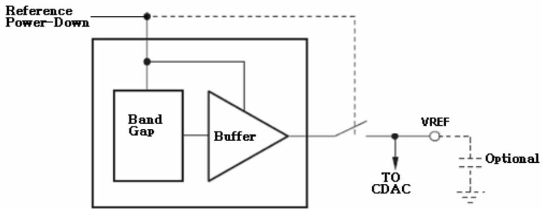

Figure 6. Simplified Diagram of the Internal Reference

Copyright©2007, SHENZHEN XPTEK TECHNOLOGY CO.,LTD http://www.xptek.com.cn

15/30

XPT2046 Touch Screen Controller

## Reference Input

The voltage difference between +REF and –REF (see Figure 5 sets the analog input range. The XPT2046 perates with a reference in the range of 1V to +VCC. There are several critical items concerning the reference input and its wide voltage range. As the reference voltage is reduced, the analog voltage weight of each digital output code is also reduced.

This is often referred to as the LSB (least significant bit) size and is equal to the reference voltage divided by 4096 in 12-bit mode. Any offset or gain error inherent in the ADC appears to increase, in terms of LSB size, as the reference voltage is reduced. With a ower reference voltage, more care mustbe taken to provide a clean layout including adequate bypassing, a clean (low-noise, low-ripple) power supply, alow-noise reference (if an external reference is used), and a low-noise input signal.The voltage into the VREF input directly drives the capacitor digital-to-analog converter (CDAC) portion of the XPT2046. Therefore, the input current is very low (typically< 13 A).

## Simplified Diagram of Single-Ended Reference

There is also a critical item regarding the reference when making measurements while the switch drivers are ON. For this discussion, it is useful to consider the basic operation of the XPT2046 (see Figure 4. This particular application shows the device being used to digitize a resistive touch screen. A measurement of the current Y-Position of the pointing device is made by connecting the X+ input to the ADC, turning on the Y+ and Y– drivers, and digitizing the voltage on X+ (Figure 7 hows a block diagram). For this measurement, the resistance in the X+ lead does not affect the conversion (it does affect the settling time, but the resistance is usually small enough that this is not a concern). However, since the resistance between Y+ and Y– is fairly low, the on-resistance of the Y drivers does make a small difference. Under the situation outlined so far, it is not possible to achieve a 0V input or a full-scale input regardless of where the pointing device is on the touch screen because some voltage is lost across the internal switches. In addition,the internal switch resistance is unlikely to track the resistance of the touch screen, providing an additional source of error.

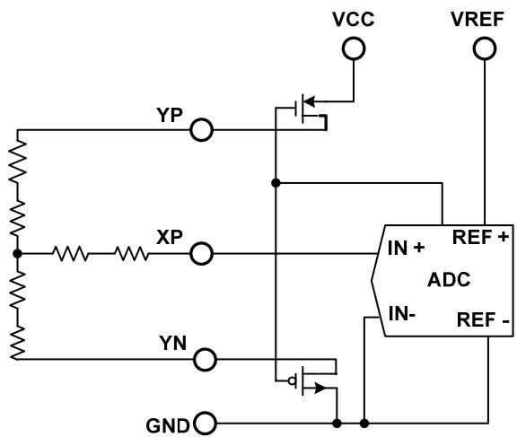

Figure 7. Simplified Diagram of Single-Ended Reference (SER/DFR high, Y switches enabled,X+ is analog input)

Copyright©2007, SHENZHEN XPTEK TECHNOLOGY CO.,LTD http://www.xptek.com.cn

16/30

XPT2046 Touch Screen Controller

## Simplified Diagram of Differential Reference

This situation can be remedied as shown in Figure 8 By setting the SER/DFR bit low, the +REF and –REF inputs are connected directly to Y+ and ${ \mathrm { Y } } - ,$ respectively, which makes the analog-to-digital conversion ratiometric. The result of the conversion is always a percentage of the external resistance, regardless of how it changes in relation to the on-resistance of the internal switches. Note that there is an important consideration regarding power dissipation when using the ratiometric mode of operation (see the Power Dissipation section for more details). As a final note about the differential reference mode, it must be used with +VCC as the source of the +REF voltage and cannot be used with VREF. It is possible to use a high-precision reference on VREF and single-ended reference mode for measurements which do not need to be ratiometric. In some cases, it is possible to power the converter directly from a precision reference. Most references can provide enough power for the XPT2046,but might not be able to supply enough current for the external load (such as a resistive touch screen).

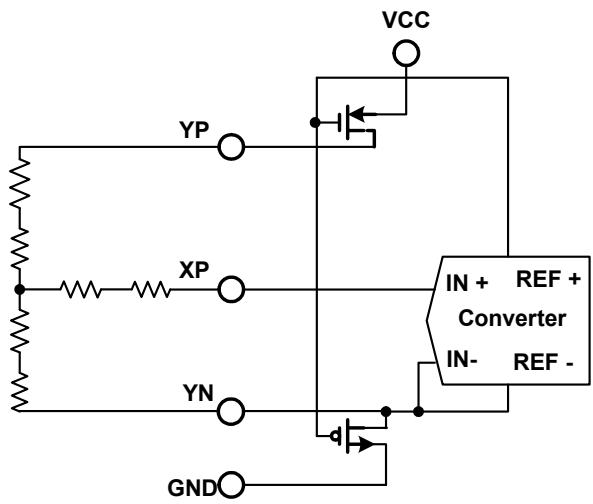

Figure 8. Simplified Diagram of Differential Reference (SER/DFR low, Y switches enabled,X+ is analog input)

## Touch Screen Settling

In some applications, external capacitors may be required across the touch screen for filtering noise picked up by the touch screen (e.g., noise generated by the LCD panel or backlight circuitry). These capacitors provide a low-pass filter to reduce the noise, but cause a settling time requirement when the panel is touched that typically shows up as a gain error. There are several methods for minimizing or eliminating this issue. The problem is that the input and/or reference has not settled to the final steady-state value prior to the ADC sampling the input(s)and providing the digital output. Additionally, the reference voltage may still be changing during the measurement cycle. Option 1 is to stop or slow down the XPT2046 DCLK for the required touch screen settling time. This allows the input and reference to have stable values for the Acquire period (3 clock cycles of the XPT2046; see Figure 12). This works for both the single-ended and the differential modes.Option 2 is to operate the XPT2046 in the differential mode only for the touch screen measurements and command the XPT2046 to remain on (touch screen drivers ON) and not go into power-down (PD0 = 1). Several conversions are made depending on thes ettling time required and the XPT2046 data rate. Once the required number of conversions have been made, the processor commands the XPT2046 to go into its power-down state on the last measurement. This process isr equired for X-Position,Y-Position, and Z-Position measurements. Option 3 is to operate in the 15 Clock-per-Conversion mode, which overlaps the analog-to-digital conversions and maintains the touch screen drivers on until commanded to stop by the processor (see Figure 16).

Copyright©2007, SHENZHEN XPTEK TECHNOLOGY CO.,LTD http://www.xptek.com.cn

17/30

XPT2046 Touch Screen Controller

## Temperature Measurement

In some applications, such as battery recharging, a measurement of ambient temperature is required. The temperature measurement technique used in the XPT2046 relies on the characteristics of a semiconductor junction operating at a fixed current level. The forward diode voltage (VBE) has a well-defined characteristic versus temperature. The ambient temperature can be predicted in applications by knowing the +25 C value of the VBE voltage and then monitoring the delta of that voltage as the temperature changes. The XPT2046 offers two modes of operation. The first mode requires calibration at a known temperature, but only requires a single reading to predict the ambient temperature. A diode is used (turned on) during this measurement cycle. The voltage across the diode is connected through the MUX for digitizing the forward bias voltage by the ADC with an address of A2 = 0, A1 = 0, and A0 = 0 (see Table 1 and Figure 6 for details). This voltage is typically 600mV at +25 C with a 20 A current through the diode. The absolute 　 　 value of this diode voltage can vary a few millivolts.However, the TC of this voltage is very consistent at –2.1mV/ C. During the final test of the end product, the diode voltage would be stored at a known room temperature, in memory, for calibration purposes by the user. The result is an equivalent temperature measurement resolution of 0.3 C/LSB (in 12-bit mode).

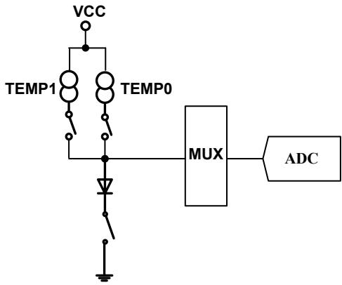

Figure 9. Functional Block Diagram of Temperature Measurement

The second mode does not require a test temperature calibration, but uses a two-measurement method to eliminate the need for absolute temperature calibration and for achieving 2 C accuracy. This mode requires a second conversion with an address of A2 = 1, A1 = 1, and A0 = 1, with a 91 times larger current. The voltage difference between the first and second conversion using 91 times the bias current is represented by Equation (1):

Copyright©2007, SHENZHEN XPTEK TECHNOLOGY CO.,LTD http://www.xptek.com.cn

18/30

XPT2046 Touch Screen Controller

$$
\triangle \lor \ = \ \frac { k T } { q } \bullet \ln ( N )\tag{…………………………(1}
$$

where:

N is the current ratio = 91.

k = Boltzmann’s constant (1.38054 • 10−23 electron volts/ degrees Kelvin).

q = the electron charge (1.602189 • 10–19 C).

T = the temperature in degrees Kelvin.

This method can provide improved absolute temperature measurement over the first mode at the cost of less resolution $( 1 . 6 ^ { \circ } \mathrm { C } / \mathrm { L S B } )$ . The equation for solving for $^ \circ \mathrm { K }$ is:

$$
{ } ^ { \circ } K = q \bullet { \frac { \Delta V } { ( k \bullet \ln ( N ) ) } } \ { \cdots } { \cdots } { \cdots } { \cdots } { \cdots } { \cdots } { \cdots } { \cdots } { \cdots } { \cdots } { \cdots } \ ( 2 )
$$

where:

$$
\Delta \mathsf { V } = \mathsf { V } \left( \mathsf { I } 9 1 \right) - \mathsf { V } \left( \mathrm { I } 1 \right) \left( \mathrm { i n ~ m V } \right)
$$

$$
^ { \circ } \mathrm { K } = 2 . 5 7 3 \ ^ { \circ } \mathrm { K } / \mathrm { m V } \cdot \Delta \mathrm { V }
$$

$$
^ { \circ } \mathrm { C } = 2 . 5 7 3 \cdot \Delta \mathrm { V } ( \mathrm { m V } ) - 2 7 3 ^ { \circ } \mathrm { K }
$$

NOTE: The bias current for each diode temperature measurement is only on for 3 clock cycles (during the acquisition mode) and, therefore, does not add any noticeable increase in power, especially if the temperature measurement only occurs occasionally.

## Battery Measurement

An added feature of the XPT2046 is the ability to monitor the battery voltage on the other side of the voltage regulator(DC/DC converter), as shown in Figure 10. The battery voltage can vary from 0V to 6V, while maintaining the voltage to the XPT2046 at 2.7V, 3.3V, etc. The input voltage (VBAT)is divided down by 4 so that a 5.5V battery voltage is represented as 1.375V to the ADC. This simplifies the multiplexer and control logic. In order to minimize the power consumption, the divider is only on during the sampling period when $\mathrm { A } 2 = 0 , \mathrm { A } 1 = 1$ and $\mathbf A 0 = 0$ (see Table 1 for the relationship between the control bits and configuration of the XPT2046).

Copyright©2007, SHENZHEN XPTEK TECHNOLOGY CO.,LTD http://www.xptek.com.cn

19/30

XPT2046 Touch Screen Controller

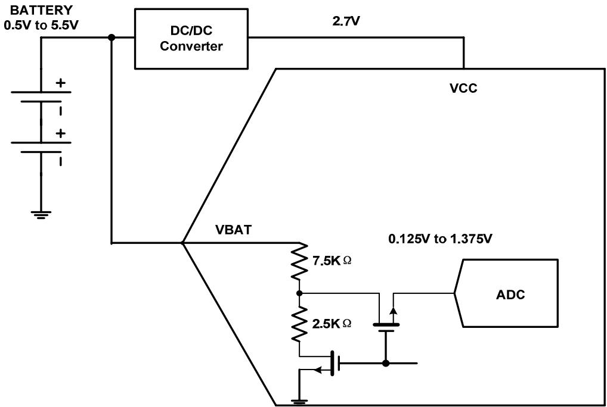

Figure 10. Battery Measurement Functional Block Diagram

## Pressure Measurement

Measuring touch pressure can also be done with the XPT2046. To determine pen or finger touch, the pressure of the touch needs to be determined. Generally, it is not necessary to have very high performance for this test; therefore, the 8-bit resolution mode is recommended(however, calculations will be shown here in the 12-bit resolution mode). There are several different ways of performing this measurement. The XPT2046 supports two methods. The first method requires knowing the X-plate resistance, measurement of the X-Position, and two additional cross panel measurements (Z1 and Z2) of the touch screen, as shown in Figure 11. Using Equation (3) calculates the touch resistance:

$$
\mathrm { \bf ~ R _ { \ p i m a } } = \mathrm { \bf { R } _ { X } } \ m \mathrm { \bf { * } } \ \mathrm { \bf { * } } \ \mathrm { \frac { \partial ~ { \cal X } P o s i t i o n } { \partial 4 0 9 6 } } \biggl ( { \frac { Z 2 } { Z 1 } } - 1 \biggr ) \cdots \cdots \cdots \cdots \cdots \ \mathrm { \bf { ( 3 ) } }
$$

The second method requires knowing both the X-plate and Y-plate resistance, measurement of X-Position and Y-Position, and Z1. Using Equation (4) also calculates the touch resistance:

$$
\mathit { R t o u c h } = \frac { \mathrm { R r } \mathrm { P l a t e } \bullet \mathrm { P o s i t i o n } } { 4 0 9 6 } \biggl ( \frac { 4 0 9 6 } { Z 1 } - 1 \biggr ) - \mathit { R _ { Y \mathrm { ~ - ~ } P l a t e } } \biggl ( 1 - \frac { \mathrm { Y - P o s i t i o n } } { 4 0 9 6 } \biggr ) \ldots \ldots \ ( 4 )
$$

Copyright©2007, SHENZHEN XPTEK TECHNOLOGY CO.,LTD http://www.xptek.com.cn

20/30

XPT2046 Touch Screen Controller

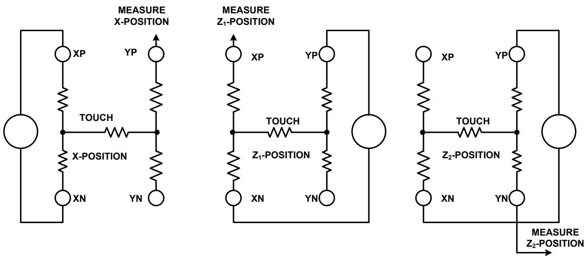

Figure 11. Pressure Measurement Block Diagrams

## Digital Interface

See Figure 12 for the typical operation of the XPT2046 digital interface. This diagram assumes that the source of the digital signals is a microcontroller or digital signal processor with a basic serial interface.Each communication between the processor and the converter,such as SPI, SSI, or Microwire\_ synchronous serial interface, consists of eight clock cycles. One complete conversion can be accomplished with three serial communications for a total of 24 clock cycles on the DCLK input.

The first eight clock cycles are used to provide the control byte via the DIN pin. When the converter has enough information about the following conversion to set the input multiplexer and reference inputs appropriately, the converter enters the acquisition (sample) mode and, if needed, the touch panel drivers are turned on. After three more clock cycles, the control byte is complete and the converter enters the conversion mode. At this point, the input sample-and-hold goes into the hold mode and the touch panel drivers turn off (in single-ended mode). The next 12 clock cycles accomplish the actual analogto-digital conversion. If the conversion is ratiometric(SER/DFR = 0), the drivers are on during the conversion and a 13th clock cycle is needed for the last bit of the conversionr esult. Three more clock cycles are needed to complete the last byte (DOUT will be low), which are ignored by the converter.

## Control Byte

The control byte (on DIN), as shown in Table 3, provides the start conversion, addressing, ADC resolution, configuration,and power-down of the XPT2046. Figure 12, Table 3 and Table 4 give detailed information regarding the order and description of these control bits within the control byte.

Initiate START—The first bit, the S bit, must always be high and initiates the start of the control byte. The XPT2046 ignores inputs on the DIN pin until the start bit is detected.

Addressing—The next three bits (A2, A1, and A0) select the active input channel(s) of the input multiplexer (see Table 1, Table 2, and Figure 5), touch screen drivers, and the reference inputs.

MODE—The mode bit sets the resolution of the ADC. With this bit low, the next conversion has 12 bits ofr esolution,whereas with this bit high, the next conversion has eight bits of resolution.

Copyright©2007, SHENZHEN XPTEK TECHNOLOGY CO.,LTD

http://www.xptek.com.cn

21/30

XPT2046 Touch Screen Controller

SER/DFR—The SER/DFR bit controls the reference mode, either single-ended (high) or differential (low). The differential mode is also referred to as the ratiometric conversion mode and is preferred for X-Position,Y-Position, and Pressure-Touch measurements for optimum performance. The reference is derived from the voltage at the switch drivers, which is almost the same as the voltage to the touch screen. In this case, a reference voltage is not needed as the reference voltage to the ADC is the voltage across the touch screen. In the single-ended mode, the converter reference voltage is always the difference between the VREF and GND pins (see Table 1 and Table 2, and Figure 5 through Figure 8, for further information).

<table><tr><td rowspan=1 colspan=1>BIT7(MSB)</td><td rowspan=1 colspan=1>BIT 6</td><td rowspan=1 colspan=1>BIT 5</td><td rowspan=1 colspan=1>BIT 4</td><td rowspan=1 colspan=1>BIT 3</td><td rowspan=1 colspan=1>BIT2</td><td rowspan=1 colspan=1>BIT 1</td><td rowspan=1 colspan=1>BIT 0(LSB)</td></tr><tr><td rowspan=1 colspan=1>S</td><td rowspan=1 colspan=1>A2</td><td rowspan=1 colspan=1>A1</td><td rowspan=1 colspan=1>A0</td><td rowspan=1 colspan=1>MODE</td><td rowspan=1 colspan=1>SER/DFR</td><td rowspan=1 colspan=1>PD1</td><td rowspan=1 colspan=1>PD0</td></tr></table>

Table 6. Order of the Control Bits in the Control Byte

Table 7. Descriptions of the Control Bits within the Control Byte

<table><tr><td rowspan=1 colspan=1>BIT</td><td rowspan=1 colspan=1>NAME</td><td rowspan=1 colspan=1>DESCRIPTION</td></tr><tr><td rowspan=1 colspan=1>7</td><td rowspan=1 colspan=1>S</td><td rowspan=1 colspan=1>Start bit. Control byte starts with first high bit on DIN.A new control byte can startevery 15th clock cycle in 12-bit conversion mode or every 11th clock cycle in 8-bitconversion mode (see Figure 16).</td></tr><tr><td rowspan=1 colspan=1>6-4</td><td rowspan=1 colspan=1>A2-A0</td><td rowspan=1 colspan=1>Channel Select bits. Along with the SER/DFR bit,these bits control the setting of themultiplexer input,touch driver switches, and reference inputs (seeTable 1 and Figure16).</td></tr><tr><td rowspan=1 colspan=1>3</td><td rowspan=1 colspan=1>MODE</td><td rowspan=1 colspan=1>12-Bit/8-Bit Conversion Select bit. This bit controls the number of bits for the nextconversion: 12-bits(low) or 8-bits (high).</td></tr><tr><td rowspan=1 colspan=1>2</td><td rowspan=1 colspan=1>SER/DFR</td><td rowspan=1 colspan=1>Single-Ended/Differential Reference Select bit. Along with bits A2-A0, this bitcontrols the setting of the multiplexer input, touch driver switches, and referenceinputs (see Table 1 and Table 2).</td></tr><tr><td rowspan=1 colspan=1>1-0</td><td rowspan=1 colspan=1>PD1-PD0</td><td rowspan=1 colspan=1>Power-Down Mode Select bits. Refer to Table 5 fordetails.</td></tr></table>

Copyright©2007, SHENZHEN XPTEK TECHNOLOGY CO.,LTD http://www.xptek.com.cn

22/30

XPT2046 Touch Screen Controller

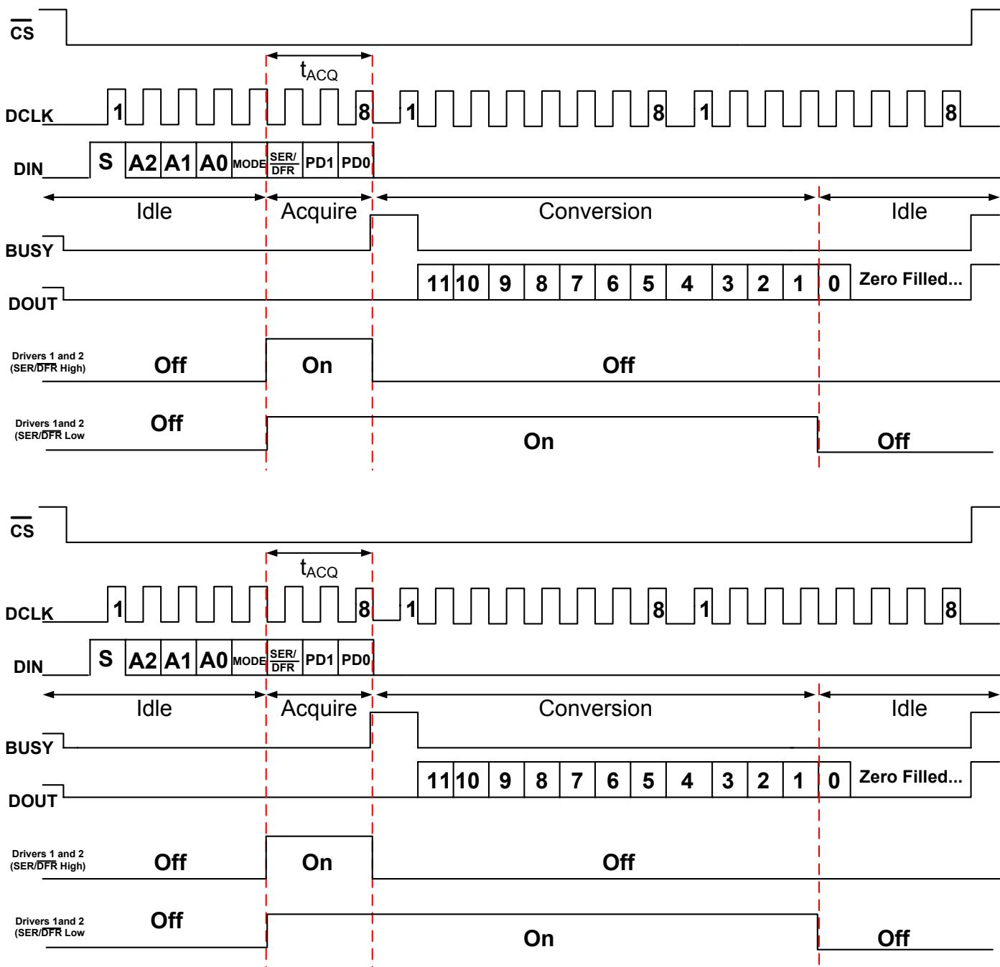

Figure 12. Conversion Timing, 24 Clocks-per-Conversion, 8-Bit Bus Interface. No DCLK delay required with dedicated serial port

If X-Position, Y-Position, and Pressure-Touch are measured in the single-ended mode, an external reference voltage is needed. The XPT2046 must also be powered from the external reference. Caution should be observed when using the single-ended mode such that the input voltage to the ADC does not exceed the internal reference voltage, especially if the supply voltage is greater than 2.7V.

NOTE: The differential mode can only be used for X-Position, Y-Position, and Pressure-Touch measurements.   
All other measurements require the single-ended mode.

PD0 and PD1—Table 5 describes the power-down and the internal reference voltage configurations. The internal reference voltage can be turned on or off independently of the ADC. This can allow extra time for the internal reference voltage to settle to the final value prior to making a conversion. Make sure to also allow this extra wake-up time if the internal reference is powered down. The ADC requires no wake-up time and can be instantaneously used. Also note that the status of the internal reference power-down is latched into the part (internally) with BUSY going high. In order to turn the reference off, an additional write to the XPT2046 is required after the channel has been converted.

Copyright©2007, SHENZHEN XPTEK TECHNOLOGY CO.,LTD http://www.xptek.com.cn

23/30

XPT2046 Touch Screen Controller

Table 8. Power-Down and Internal Reference Selection

<table><tr><td rowspan=1 colspan=1>PD1</td><td rowspan=1 colspan=1>PD0</td><td rowspan=1 colspan=1>PENIRQ</td><td rowspan=1 colspan=1>DESCRIPTION</td></tr><tr><td rowspan=1 colspan=1>0</td><td rowspan=1 colspan=1>0</td><td rowspan=1 colspan=1>Enabled</td><td rowspan=1 colspan=1>Power-Down Between Conversions. When each conversion is finished, the converterenters a low-power mode. At the start of the next conversion, the device instantlypowers up to full power. There is no need for additional delays to ensure full operation,and the very first conversion is valid. The Y– switch is on when in power-down.</td></tr><tr><td rowspan=1 colspan=1>0</td><td rowspan=1 colspan=1>1</td><td rowspan=1 colspan=1>Disabled</td><td rowspan=1 colspan=1>Reference is off and ADC is on.</td></tr><tr><td rowspan=1 colspan=1>1</td><td rowspan=1 colspan=1>0</td><td rowspan=1 colspan=1>Enabled</td><td rowspan=1 colspan=1>Reference is on and ADC is off.</td></tr><tr><td rowspan=1 colspan=1>1</td><td rowspan=1 colspan=1>1</td><td rowspan=1 colspan=1>Disabled</td><td rowspan=1 colspan=1>Device is always powered. Reference is on and ADC is on.</td></tr></table>

## PENIRQ Output

The pen-interrupt output function is shown in Figure 13.While in power-down mode with PD0 = 0, the Y-driver is on and connects the Y-plane of the touch screen to GND. The PENIRQ output is connected to the X+ input through two transmission gates. When the screen is touched, the X+ input is pulled to ground through the touch screen.In most of the XPT2046 models, the internal pullup resistor value is nominally 50k , but this may vary between 36k and 67k given process and temperature variations. In order to assure a logic low of 0.35 \_ (+VCC) is presented to the PENIRQ circuitry, the total resistance between the X+ and Y− terminals must be less than 21k .

Copyright©2007, SHENZHEN XPTEK TECHNOLOGY CO.,LTD http://www.xptek.com.cn

24/30

T

XPT2046 Touch Screen Controller

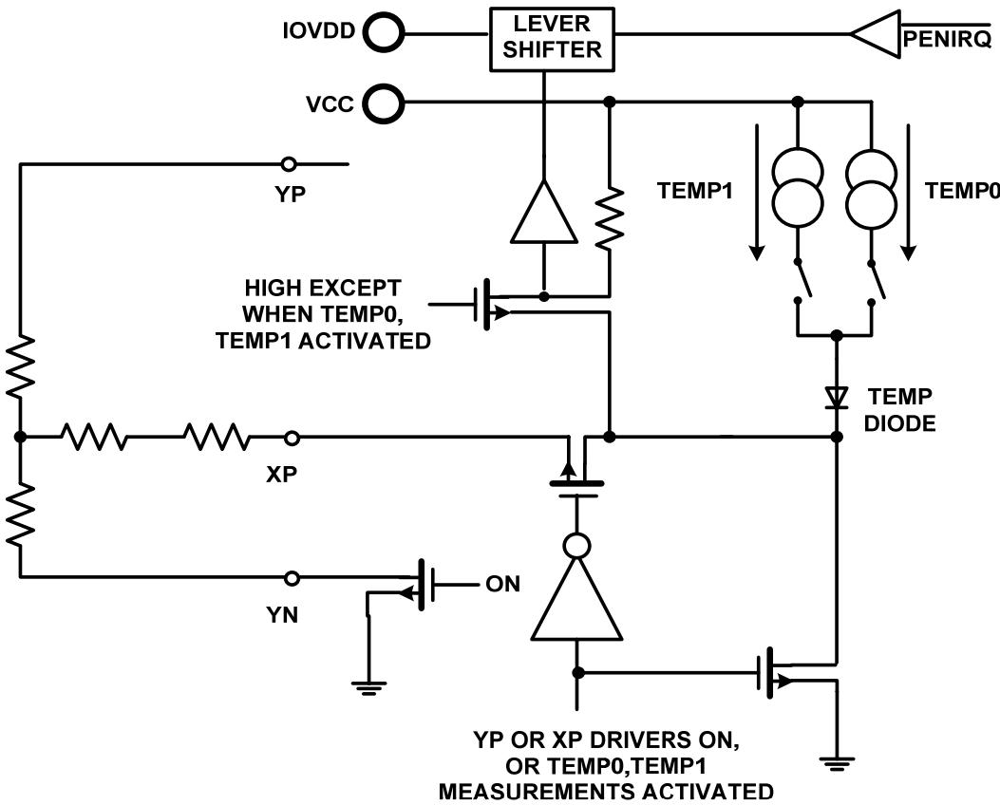

Figure 13. PENIRQ Functional Block Diagram

The −90 version of the XPT2046 uses a nominal 90k pullup resistor, which allows the total resistance between the X+ and Y– terminals to be as high as 30k Note that the higher pullup resistance will cause a slower response time of the PENIRQ to a screen touch, so user software should take this into account. The PENIRQ output goes low due to the current path through the touch screen to ground, which initiates an interrupt to the processor. During the measurement cycle for X-, Y-, and Z-Position, the X+ input is disconnected from the PENIRQ internal pull-up resistor. This is done to eliminate any leakage current from the internal pull-up resistor through the touch screen, thus causing no errors.

Furthermore, the PENIRQ output is disabled and low during the measurement cycle for X-, Y-, and Z-Position. The PENIRQ output is disabled and high during the measurement cycle for battery monitor, auxiliary input, and chip temperature. If the last control byte written to the XPT2046 contains PD0 = 1, the pen-interrupt output function is disabled and is not able to detect when the screen is touched. In order to re-enable the pen-interrupt output function under these circumstances, a control byte needs to be written to the XPT2046 with PD0 = 0. If the last control byte written to the XPT2046 contains PD0 = 0, the pen-interrupt output function is enabled at the end of the conversion. The end of the conversion occurs on the falling edge of DCLK after bit 1 of the converted data is clocked out of the XPT2046.

It is recommended that the processor mask the interrupt PENIRQ is associated with whenever the processor sends a control byte to the XPT2046. This prevents false triggering of interrupts when the PENIRQ output is disabled in the cases discussed in this section.

Copyright©2007, SHENZHEN XPTEK TECHNOLOGY CO.,LTD http://www.xptek.com.cn

25/30

XPT2046 Touch Screen Controller

## per-Conversion

## 16 Clocks-per-Conversion

The control bits for conversion n + 1 can be overlapped with conversion n to allow for a conversion every 16 clock cycles, as shown in Figure 14. This figure also shows possible serial communication occurring with other serial peripherals between each byte transfer from the processor to the converter. This is possible, provided that each conversion completes within 1.6ms of starting. Otherwise, the signal that is captured on the input sample-and-hold may droop enough to affect the conversion result. Note that the XPT2046 is fully powered while other serial communications are taking place during a conversion.

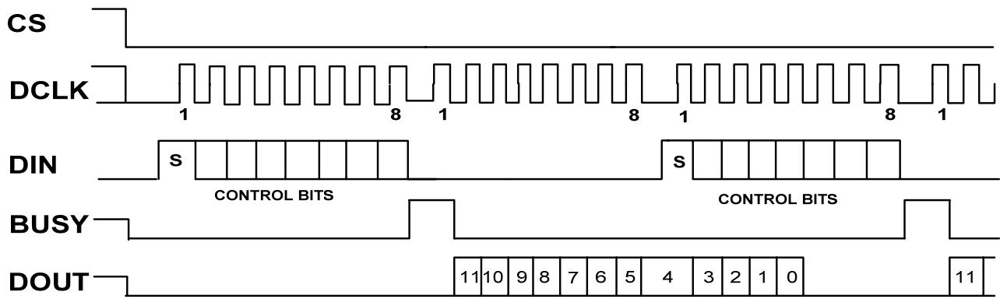

Figure 14. Conversion Timing, 16 Clocks-per-Conversion, 8-Bit Bus Interface. No DCLK delay required with dedicated serial port

## Digital Timing

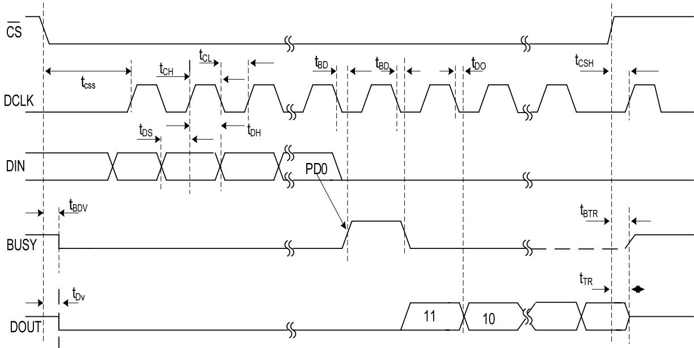

Figure 12, Figure 15 and Table 6 provide detailed timing for the digital interface of the XPT2046.

Figure 15. Detailed Timing Diagram

Copyright©2007, SHENZHEN XPTEK TECHNOLOGY CO.,LTD http://www.xptek.com.cn

26/30

XPT2046 Touch Screen Controller

Table 9. Timing Specifications,

<table><tr><td rowspan=2 colspan=1>SYMBOL</td><td rowspan=2 colspan=1>DESCRIPTION</td><td rowspan=1 colspan=3>+VCC· 2.7V,+VCC· IOVDD·1.5V,CLOAD = 50pF</td><td rowspan=2 colspan=1>UNITS</td></tr><tr><td rowspan=1 colspan=1>MIN</td><td rowspan=1 colspan=1>TYP</td><td rowspan=1 colspan=1>MAX</td></tr><tr><td rowspan=1 colspan=1>tACQ</td><td rowspan=1 colspan=1>Acquisition Time</td><td rowspan=1 colspan=1>1.5</td><td rowspan=1 colspan=1></td><td rowspan=1 colspan=1></td><td rowspan=1 colspan=1>μs</td></tr><tr><td rowspan=1 colspan=1>tDS</td><td rowspan=1 colspan=1>DIN Valid Prior to DCLK Rising</td><td rowspan=1 colspan=1>100</td><td rowspan=1 colspan=1></td><td rowspan=1 colspan=1></td><td rowspan=1 colspan=1>ns</td></tr><tr><td rowspan=1 colspan=1>tDH</td><td rowspan=1 colspan=1>DIN Hold After DCLK High</td><td rowspan=1 colspan=1>50</td><td rowspan=1 colspan=1></td><td rowspan=1 colspan=1></td><td rowspan=1 colspan=1>ns</td></tr><tr><td rowspan=1 colspan=1>tDO</td><td rowspan=1 colspan=1>DCLK Falling to DOUT Valid</td><td rowspan=1 colspan=1></td><td rowspan=1 colspan=1></td><td rowspan=1 colspan=1>200</td><td rowspan=1 colspan=1>ns</td></tr><tr><td rowspan=1 colspan=1>tDV</td><td rowspan=1 colspan=1>CS Falling to DOUT Enabled</td><td rowspan=1 colspan=1></td><td rowspan=1 colspan=1></td><td rowspan=1 colspan=1>200</td><td rowspan=1 colspan=1>ns</td></tr><tr><td rowspan=1 colspan=1>tTR</td><td rowspan=1 colspan=1>CS Rising to DOUT Disabled</td><td rowspan=1 colspan=1></td><td rowspan=1 colspan=1></td><td rowspan=1 colspan=1>200</td><td rowspan=1 colspan=1>ns</td></tr><tr><td rowspan=1 colspan=1>tCSS</td><td rowspan=1 colspan=1>CS CS Falling to First DCLKRising</td><td rowspan=1 colspan=1>100</td><td rowspan=1 colspan=1></td><td rowspan=1 colspan=1></td><td rowspan=1 colspan=1>ns</td></tr><tr><td rowspan=1 colspan=1>tCSH</td><td rowspan=1 colspan=1>CS Rising to DCLK Ignored</td><td rowspan=1 colspan=1>10</td><td rowspan=1 colspan=1></td><td rowspan=1 colspan=1></td><td rowspan=1 colspan=1>ns</td></tr><tr><td rowspan=1 colspan=1>tCH</td><td rowspan=1 colspan=1>DCLK High</td><td rowspan=1 colspan=1>200</td><td rowspan=1 colspan=1></td><td rowspan=1 colspan=1></td><td rowspan=1 colspan=1>ns</td></tr><tr><td rowspan=1 colspan=1>tCL</td><td rowspan=1 colspan=1>DCLK Low</td><td rowspan=1 colspan=1>200</td><td rowspan=1 colspan=1></td><td rowspan=1 colspan=1></td><td rowspan=1 colspan=1>ns</td></tr><tr><td rowspan=1 colspan=1>tBD</td><td rowspan=1 colspan=1>DCLK Falling to BUSYRising/Falling</td><td rowspan=1 colspan=1></td><td rowspan=1 colspan=1></td><td rowspan=1 colspan=1>200</td><td rowspan=1 colspan=1>ns</td></tr><tr><td rowspan=1 colspan=1>tBDV</td><td rowspan=1 colspan=1>CS Falling to BUSY Enabled</td><td rowspan=1 colspan=1></td><td rowspan=1 colspan=1></td><td rowspan=1 colspan=1>200</td><td rowspan=1 colspan=1>ns</td></tr><tr><td rowspan=1 colspan=1>tBTR</td><td rowspan=1 colspan=1>CS Rising to BUSY Disabled</td><td rowspan=1 colspan=1></td><td rowspan=1 colspan=1></td><td rowspan=1 colspan=1>200</td><td rowspan=1 colspan=1>ns</td></tr></table>

Copyright©2007, SHENZHEN XPTEK TECHNOLOGY CO.,LTD http://www.xptek.com.cn

27/30

LET

XPT2046 Touch Screen Controller

## 15 Clocks-per-Conversion

Figure 16 provides the fastest way to clock the XPT2046.This method does not work with the serial interface of most microcontrollers and digital signal processors, as they are generally not capable of providing 15 clock cycles per serial transfer. However, this method can be used with field-programmable gate arrays (FPGAs) or applicationspecific integrated circuits (ASICs). Note that this effectively increases the maximum conversion rate of the converter beyond the values given in the specification tables, which assume 16 clock cycles per conversion.

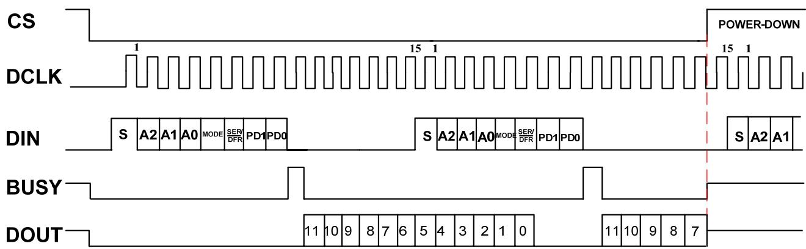

Figure 16. Maximum Conversion Rate, 15 Clocks-per-Conversion

## Data Format

The XPT2046 output data is in Straight Binary format, as shown in Figure 17. This figure shows the ideal output code for the given input voltage and does not include the ffects of offset, gain, or noise.

Figure 17. Ideal Input Voltages and Output Codes

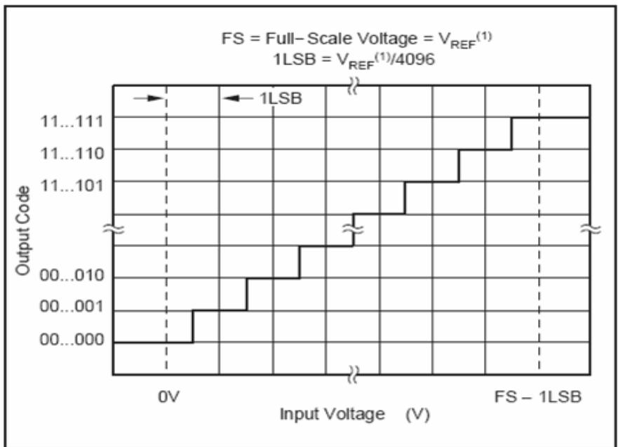

Copyright©2007, SHENZHEN XPTEK TECHNOLOGY CO.,LTD http://www.xptek.com.cn

28/30

XPT2046 Touch Screen Controller

## 8-Bit Conversion

The XPT2046 provides an 8-bit conversion mode that can be used when faster throughput is needed and the digital result is not as critical. By switching to the 8-bit mode, a conversion is complete four clock cycles earlier. Not only does this shorten each conversion by four bits (25% faster throughput), but each conversion can actually occur at afaster clock rate. This is because the internal settling time of the XPT2046 is not as critical—settling to better than 8 bits is all that is needed. The clock rate can be as much as 50% faster. The faster clock rate and fewer clock cycles combine to provide a 2x increase in conversion rate.

## Power Dissipation

There are two major power modes for the XPT2046: full-power (PD0 = 1) and auto power-down (PD0 = 0). When operating at full speed and 16 clocks-per-conversion (see Figure 14), theXPT2046 spends most of the time acquiring or converting. There is little time for auto power-down, assuming that this mode is active. Therefore, the difference between full-power mode and auto power-down is negligible. If the conversion rate is decreased by slowing the frequency of the DCLK input, the two modes remain approximately equal. However, if the DCLK frequency is kept at the maximum rate during a conversion but conversions are done less often, the difference between the two modes is dramatic.

Figure 18 shows the difference between reducing the DCLK frequency (scaling DCLK to match the conversion rate) or maintaining DCLK at the highest frequency and reducing the number of conversions per second. In the latter case, the converter spends an increasing percentage of time in power-down mode (assuming the auto power-down mode is active).

Figure 18. Supply Current versus Directly Scaling the Frequency of DCLK with Sample Rate or Maintaining DCLK at the Maximum Possible Frequency

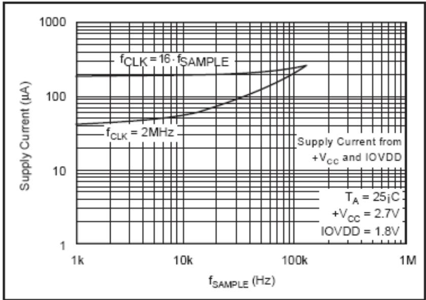

Copyright©2007, SHENZHEN XPTEK TECHNOLOGY CO.,LTD http://www.xptek.com.cn

29/30

XPT2046 Touch Screen Controller

Another important consideration for power dissipation is the reference mode of the converter. In the single-ended reference mode, the touch panel drivers are ON only when the analog input voltage is being acquired (see Figure 12 and Table 1). The external device (e.g., a resistive touch screen), therefore, is only powered during the acquisition period. In the differential reference mode, the external device must be powered throughout the acquisition and conversion periods (see Figure 12). If the conversion rate is high, this could substantially increase power dissipation.CS also puts the XPT2046 into power-down mode. When CS goes high, the XPT2046 immediately goes into power-down mode and does not complete the current conversion. The internal reference, however, does not turn off with CS going high. To turn the reference off, an additional write is required before CS goes high (PD1 = 0).When the XPT2046 first powers up, the device draws about 20μA of current until a control byte is written to it with PD0 = 0 to put it into power-down mode. This can be avoided if the XPT2046 is powered up with CS = 0 and DCLK = IOVDD.

## Demo

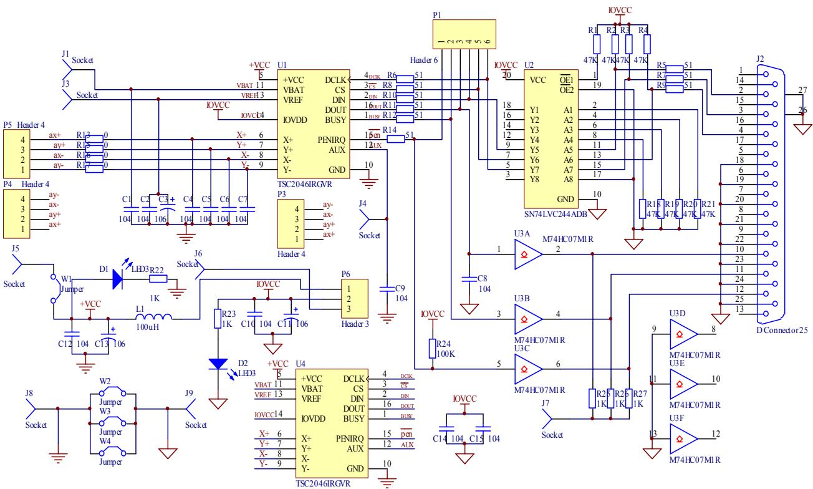

Figure 19. Demo

Copyright©2007, SHENZHEN XPTEK TECHNOLOGY CO.,LTD http://www.xptek.com.cn

30/30